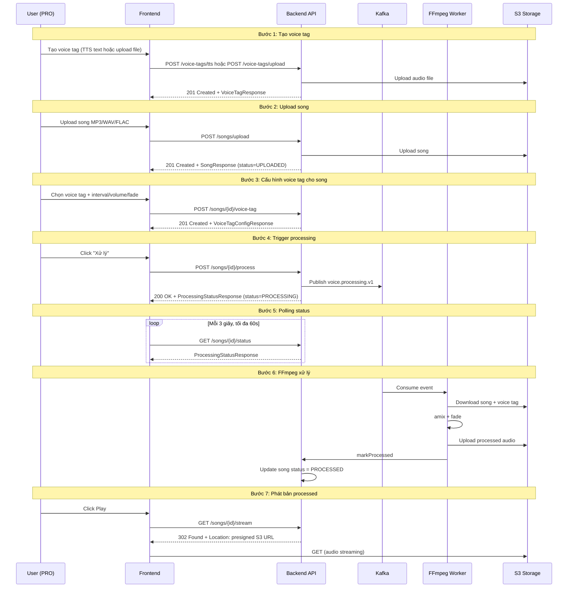
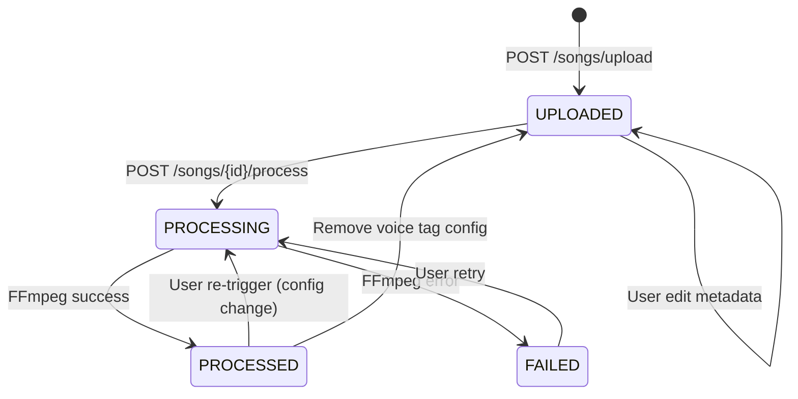

# Voice Module — Frontend Design

Tài liệu này mô tả thiết kế Frontend cho 2 module `voice-tag` và `song` của PWB_MiNi, dựa trên backend đã implement (TASK 1.5 → 18). Mục tiêu là cung cấp kim chỉ nam cho sprint FE tiếp theo — đủ chi tiết để dev FE onboard mà không cần đọc hết backend code.

---

## Mục lục

1. [Tổng quan](#1-tổng-quan)
2. [Route Map](#2-route-map)
3. [Cấu trúc Feature Folder](#3-cấu-trúc-feature-folder)
4. [State Machine — Song Processing](#4-state-machine--song-processing)
5. [Polling Strategy](#5-polling-strategy)
6. [API Contracts](#6-api-contracts)
7. [Component Specs](#7-component-specs)
8. [i18n Keys](#8-i18n-keys)
9. [Error Mapping](#9-error-mapping)
10. [Security Considerations](#10-security-considerations)
11. [Out of Scope](#11-out-of-scope)
12. [Implementation Order](#12-implementation-order)
13. [Tham chiếu Backend](#13-tham-chiếu-backend)

---

## 1. Tổng quan

### 1.1 Vai trò

Voice module là tính năng **PRO** cho phép producer tạo "voice tag" (một đoạn audio ngắn đặc trưng — ví dụ câu "Drop the beat by HNam" hoặc giọng đọc tên producer) rồi tự động chèn voice tag đó vào nhiều bài hát theo cấu hình (interval, volume, fade).

Có 2 nguồn voice tag:
- **TTS** — generate từ Google Cloud Text-to-Speech API (cache qua Redis).
- **UPLOADED** — user upload file MP3/WAV/FLAC tự thu.

### 1.2 Flow nghiệp vụ tổng quan



### 1.3 Giả định

- User đã có role `PRO` (đã enforced bằng `@PreAuthorize("hasRole('PRO')")` ở backend).
- File MP3/WAV/FLAC, tối đa 100 MB (config backend).
- Song duration tối đa ~10 phút (FFmpeg xử lý < 30s với audio ngắn).
- TTS text tối đa 4000 ký tự.
- Connection mạng ổn định — không hỗ trợ offline.

---

## 2. Route Map

Sử dụng Next.js App Router, đặt trong group `(dashboard)` đã yêu cầu auth.

| Path | Page file (trong `(dashboard)` group) | Mục đích |
|---|---|---|
| `/dashboard/voice-tags` | `(dashboard)/voice-tags/page.tsx` | Library — list voice tags + nút Create |
| `/dashboard/voice-tags/new` | `(dashboard)/voice-tags/new/page.tsx` | Wizard tạo (chọn TTS hoặc Upload) |
| `/dashboard/voice-tags/[voiceTagId]` | `(dashboard)/voice-tags/[voiceTagId]/page.tsx` | Chi tiết — preview + edit + delete |
| `/dashboard/songs` | `(dashboard)/songs/page.tsx` | Library — list songs + filter status + nút Upload |
| `/dashboard/songs/new` | `(dashboard)/songs/new/page.tsx` | Wizard upload song |
| `/dashboard/songs/[songId]` | `(dashboard)/songs/[songId]/page.tsx` | Chi tiết — metadata + config + trigger + player |

Tất cả 6 page đều nằm trong group `(dashboard)` → cùng layout với `[demos/page.tsx](frontend/src/app/(dashboard)/demos/page.tsx)` và `[distributions/page.tsx](frontend/src/app/(dashboard)/distributions/page.tsx)` đang có. Cấu trúc filesystem:

```sh
frontend/src/app/(dashboard)/
+-- voice-tags/
|   +-- page.tsx
|   +-- new/page.tsx
|   +-- [voiceTagId]/page.tsx
+-- songs/
    +-- page.tsx
    +-- new/page.tsx
    +-- [songId]/page.tsx
```

### 2.1 Layout inheritance

Layout chung từ `(dashboard)/layout.tsx` đã có — tự động áp dụng cho tất cả page con mà không cần khai báo lại. Không cần thêm config.

Thêm nav link trong `[site-header-client.tsx](frontend/src/components/layout/site-header-client.tsx)` cho user role PRO:
- "Voice Tags" → `/dashboard/voice-tags`
- "Songs" → `/dashboard/songs`

i18n key: `header.voiceTags`, `header.songs`.

### 2.2 Role Guard

Route guard kiểm tra `user.role === 'PRO'` trước khi render. Nếu không phải PRO:
- Hiển thị component `ProUpgradePrompt` thay vì page content.
- Link tới trang nâng cấp plan (nếu có) hoặc hiển thị thông báo "Tính năng chỉ dành cho PRO".

---

## 3. Cấu trúc Feature Folder

Mirror pattern của `[features/audio](frontend/src/features/audio)` đã có.

```
frontend/src/features/voice/
+-- api/
|   +-- voice-tags.ts
|   +-- songs.ts
|   +-- processing.ts
+-- components/
|   +-- voice-tag-card.tsx
|   +-- voice-tag-form.tsx
|   +-- tts-form.tsx
|   +-- upload-voice-tag-form.tsx
|   +-- voice-tag-preview.tsx
|   +-- song-card.tsx
|   +-- song-upload-form.tsx
|   +-- song-detail.tsx
|   +-- voice-tag-config-form.tsx
|   +-- processing-status-badge.tsx
|   +-- processing-controls.tsx
|   +-- audio-player.tsx
+-- hooks/
|   +-- use-processing-polling.ts
|   +-- use-voice-tag-audio.ts
+-- schemas/
|   +-- voice-tag-schema.ts
|   +-- song-schema.ts
|   +-- config-schema.ts
+-- types/
|   +-- index.ts
+-- index.ts
```

### 3.1 Quy ước theo rule `api-layer-conventions.mdc`

Mỗi API file trong `api/` gồm 3 phần:

**3.1.1 Types** trong `types/index.ts`:

```ts
export interface VoiceTag {
  id: string;
  name: string;
  description: string | null;
  tagType: "TTS" | "UPLOADED";
  sourceText: string | null;
  languageCode: string | null;
  durationSeconds: number;
  fileSizeBytes: number;
  isDefault: boolean;
  version: number;
  createdAt: string;
  updatedAt: string;
}

export interface Song {
  id: string;
  userId: string;
  title: string;
  artist: string | null;
  album: string | null;
  format: string;
  status: SongStatus;
  fileSizeBytes: number;
  durationSeconds: number | null;
  processed: boolean;
  version: number;
  createdAt: string;
  updatedAt: string;
}

export type SongStatus = "UPLOADED" | "PROCESSING" | "PROCESSED" | "FAILED";

export interface VoiceTagConfig {
  id: string;
  songId: string;
  voiceTagId: string;
  voiceTagName: string;
  intervalSeconds: number;
  volumePercentage: number;
  fadeInDurationMs: number;
  fadeOutDurationMs: number;
  startOffsetSeconds: number;
  enabled: boolean;
  version: number;
  createdAt: string;
  updatedAt: string;
}

export interface ProcessingStatus {
  songId: string;
  status: SongStatus;
  processedS3KeyExists: boolean;
  lastError: string | null;
  message: string | null;
}

export interface AudioUrl {
  url: string;
  expiresAt: string;
}
```

**3.1.2 Fetcher thuần** trong `api/<resource>.ts` — không chứa hooks:

```ts
export const listVoiceTags = ({ page, size, type }: {
  page: number; size: number; type?: VoiceTagType;
}): Promise<ApiResponse<PaginatedResponse<VoiceTag>>> =>
  apiClient.get("/voice-tags", { params: { page, size, type } }).then((r) => r.data);
```

**3.1.3 React Query hook** bọc fetcher, đặt trong cùng file:

```ts
export const useListVoiceTags = ({ page, size, type, queryConfig }: UseListVoiceTagsOptions = {}) =>
  useQuery({
    ...queryConfig,
    queryKey: ["voice-tags", { page, size, type }],
    queryFn: () => listVoiceTags({ page, size, type }),
  });
```

---

## 4. State Machine — Song Processing

### 4.1 Diagram



### 4.2 UI rules theo status

| Status | Hiển thị | Action có sẵn | Disabled |
|---|---|---|---|
| `UPLOADED` (chưa có config) | Badge "Sẵn sàng tải lên" | "Cấu hình voice tag" (primary), "Xóa" | Play button |
| `UPLOADED` (đã có config, enabled) | Badge "Sẵn sàng xử lý" | "Xử lý" (primary), "Sửa cấu hình", "Xóa config", "Xóa" | Play button |
| `PROCESSING` | Spinner + "Đang xử lý..." + progress hint | "Hủy polling" | Tất cả ngoại trừ Cancel |
| `PROCESSED` | Audio player (bản processed) + "Phát bản gốc" | "Sửa cấu hình" → re-trigger, "Xóa config", "Tải về" | "Xử lý" (nếu không đổi config) |
| `FAILED` | Error banner + `lastError` (i18n resolved) | "Thử lại", "Sửa cấu hình", "Xóa" | Play button |

### 4.3 Edge cases

- **Double-click trigger**: button dùng `isPending` từ `useMutation` để disable. Backend cũng có `@Lock PESSIMISTIC_WRITE` ở song row → nếu 2 request cùng lọt, request thứ 2 nhận `VOICE_015` (PROCESSING_IN_PROGRESS).
- **Race khi đổi config trong lúc processing**: FE disable form khi `status === PROCESSING`. Nếu user bypass (devtools) → BE xử lý (config chỉ áp dụng cho lần trigger kế tiếp).
- **Polling timeout 60s**: hiển thị banner "Đang xử lý nền, refresh để cập nhật" + nút manual refresh.

---

## 5. Polling Strategy

### 5.1 Quyết định đã chốt

- **Mỗi 3 giây**, GET `/api/v1/songs/{songId}/status`.
- **Dừng tối đa sau 60 giây** (20 lần poll) — sau đó hiển thị hint + nút manual refresh.
- Dừng sớm khi `status === PROCESSED` hoặc `status === FAILED`.
- `refetchIntervalInBackground: false` — không poll khi tab không active.

### 5.2 Implementation: `useProcessingPolling`

```ts
export const useProcessingPolling = ({ songId, enabled }: {
  songId: string; enabled: boolean;
}) => {
  const [pollCount, setPollCount] = useState(0);
  const MAX_POLLS = 20;
  const INTERVAL_MS = 3000;

  const query = useQuery({
    queryKey: ["song-processing-status", songId],
    queryFn: () => getProcessingStatus({ songId }),
    enabled: enabled && pollCount < MAX_POLLS,
    refetchInterval: (data) => {
      if (!enabled) return false;
      const status = data?.data?.status;
      if (status === "PROCESSED" || status === "FAILED") return false;
      if (pollCount >= MAX_POLLS) return false;
      return INTERVAL_MS;
    },
    refetchIntervalInBackground: false,
  });

  useEffect(() => {
    if (query.data?.data?.status === "PROCESSED" || query.data?.data?.status === "FAILED") {
      toast.success(...);
      queryClient.invalidateQueries({ queryKey: ["song", songId] });
    }
  }, [query.data]);

  return {
    ...query,
    isTimedOut: pollCount >= MAX_POLLS && query.data?.data?.status === "PROCESSING",
  };
};
```

### 5.3 Lý do giới hạn 60s

- FFmpeg thường xong trong 5-15s với file audio < 10 phút.
- Tránh giữ HTTP connection quá lâu → tốn tài nguyên client + server.
- Sau 60s, vẫn có thể user click "Refresh" để poll thủ công.

---

## 6. API Contracts

Tất cả endpoint dưới `/api/v1/`, base URL config trong `[config.ts](frontend/src/lib/config.ts)`. Auth: `Authorization: Bearer {accessToken}` (do `apiClient` tự gắn).

### 6.1 Voice Tags

| Method | Path | Purpose | Request | Response | Auth |
|---|---|---|---|---|---|
| POST | `/voice-tags/tts` | Tạo TTS voice tag | `CreateTtsVoiceTagRequest` (JSON) | `VoiceTagResponse` | PRO |
| POST | `/voice-tags/upload` | Upload voice tag file | multipart: `file` + `metadata` (UploadVoiceTagRequest) | `VoiceTagResponse` | PRO |
| GET | `/voice-tags` | List + filter | query: `page`, `size`, `type` | `Page<VoiceTagResponse>` | PRO |
| GET | `/voice-tags/{id}` | Detail | — | `VoiceTagResponse` | PRO |
| PUT | `/voice-tags/{id}` | Update metadata | `UpdateVoiceTagRequest` | `VoiceTagResponse` | PRO |
| DELETE | `/voice-tags/{id}` | Soft delete | — | 204 | PRO |
| GET | `/voice-tags/{id}/audio` | Presigned URL audio | — | `AudioUrlResponse` | PRO |

### 6.2 Songs

| Method | Path | Purpose | Request | Response | Auth |
|---|---|---|---|---|---|
| POST | `/songs/upload` | Upload song | multipart: `file` + `metadata` (UploadSongRequest) | `SongResponse` | PRO |
| GET | `/songs` | List + filter | query: `page`, `size`, `status` | `Page<SongResponse>` | PRO |
| GET | `/songs/{id}` | Detail | — | `SongDetailResponse` | PRO |
| PUT | `/songs/{id}` | Update metadata | `UpdateSongRequest` | `SongResponse` | PRO |
| DELETE | `/songs/{id}` | Soft delete | — | 204 | PRO |

### 6.3 Voice Tag Configuration per Song

| Method | Path | Purpose | Request | Response |
|---|---|---|---|---|
| POST | `/songs/{songId}/voice-tag` | Configure voice tag | `ConfigureVoiceTagRequest` | `VoiceTagConfigResponse` |
| GET | `/songs/{songId}/voice-tag` | Get config hiện tại | — | `VoiceTagConfigResponse` |
| DELETE | `/songs/{songId}/voice-tag` | Remove config | — | 204 |

### 6.4 Processing

| Method | Path | Purpose | Request | Response |
|---|---|---|---|---|
| POST | `/songs/{songId}/process` | Trigger FFmpeg processing | — | `ProcessingStatusResponse` (status=PROCESSING) |
| GET | `/songs/{songId}/status` | Poll status | — | `ProcessingStatusResponse` |

### 6.5 Streaming

| Method | Path | Purpose | Response |
|---|---|---|---|
| GET | `/songs/{id}/stream` | Presigned URL processed (302 redirect) | `Location: <presigned-url>` |
| GET | `/songs/{id}/original` | Presigned URL bản gốc (302 redirect) | `Location: <presigned-url>` |

### 6.6 Snippet TypeScript interfaces (map từ BE DTOs)

```ts
// UploadSongRequest
export interface UploadSongRequest {
  title: string;          // required, max 256
  artist?: string;        // optional, max 256
  album?: string;         // optional, max 256
}

// UploadVoiceTagRequest
export interface UploadVoiceTagRequest {
  name: string;           // required, max 128
  description?: string;   // optional, max 512
}

// CreateTtsVoiceTagRequest
export interface CreateTtsVoiceTagRequest {
  name: string;           // required, max 128
  description?: string;   // optional, max 512
  text: string;           // required, max 4000
  languageCode: string;   // required, pattern "^[a-z]{2}-[A-Z]{2}$"
}

// ConfigureVoiceTagRequest
export interface ConfigureVoiceTagRequest {
  voiceTagId: string;           // UUID
  intervalSeconds: number;      // >= 1
  volumePercentage: number;    // 0-100
  fadeInDurationMs: number;     // >= 0
  fadeOutDurationMs: number;    // >= 0
  startOffsetSeconds?: number;  // >= 0, default 0
  enabled?: boolean;            // default true
}

// UpdateSongRequest
export interface UpdateSongRequest {
  title?: string;
  artist?: string;
  album?: string;
}

// UpdateVoiceTagRequest
export interface UpdateVoiceTagRequest {
  name?: string;
  description?: string;
}
```

---

## 7. Component Specs

### 7.1 `SongUploadForm`

**Props**:
```ts
interface SongUploadFormProps {
  onSuccess?: (song: Song) => void;
  onCancel?: () => void;
}
```

**State**:
- `file: File | null`
- `metadata: UploadSongRequest` (react-hook-form)
- `uploadProgress: number` (0-100)

**Hooks**:
- `useForm` + `zodResolver` với `songSchema`
- `useUploadSong` mutation

**UI**:
- Drop zone (dùng shadcn `Input` type=file hoặc third-party như `react-dropzone`)
- Form fields: title (required), artist (optional), album (optional)
- Submit button disabled khi `!file || !title`
- Progress bar khi đang upload (axios `onUploadProgress`)

**Edge cases**:
- File > 100MB → client validate, hiển thị `voice.errors.fileTooLarge`
- Format không thuộc MP3/WAV/FLAC → client validate, hiển thị `voice.errors.unsupportedFormat`
- Network error → retry button
- Cancel trong khi upload → abort axios request

### 7.2 `VoiceTagConfigForm`

**Props**:
```ts
interface VoiceTagConfigFormProps {
  songId: string;
  config: VoiceTagConfig | null;
  availableVoiceTags: VoiceTag[];
  onSuccess?: () => void;
}
```

**State**:
- react-hook-form state
- `submitting: boolean`

**UI**:
- Select dropdown: chọn voice tag từ `availableVoiceTags`
- Slider cho `intervalSeconds` (1-60s)
- Slider cho `volumePercentage` (0-100%)
- Input number cho `fadeInDurationMs` (0-5000)
- Input number cho `fadeOutDurationMs` (0-5000)
- Input number cho `startOffsetSeconds` (0-300)
- Switch cho `enabled`
- Nếu user chưa có voice tag nào → hiển thị empty state với link "Tạo voice tag đầu tiên"

**Hooks**:
- `useForm` + `zodResolver(configSchema)`
- `useConfigureVoiceTag` mutation

### 7.3 `ProcessingStatusBadge`

**Props**:
```ts
interface ProcessingStatusBadgeProps {
  status: SongStatus;
}
```

**Mapping**:
- `UPLOADED` → blue badge "Sẵn sàng"
- `PROCESSING` → yellow badge + Spinner "Đang xử lý"
- `PROCESSED` → green badge "Đã xử lý"
- `FAILED` → red badge "Lỗi"

i18n keys: `voice.status.{status}`.

### 7.4 `ProcessingControls`

**Props**:
```ts
interface ProcessingControlsProps {
  songId: string;
  status: SongStatus;
  hasConfig: boolean;
}
```

**Logic**:
- `status === UPLOADED && !hasConfig` → disable button "Xử lý", show hint "Cấu hình voice tag trước"
- `status === UPLOADED && hasConfig` → button "Xử lý" (primary) → trigger `useTriggerProcessing`
- `status === PROCESSING` → button disabled, show `useProcessingPolling`
- `status === PROCESSED` → button "Xử lý lại" (warning color)
- `status === FAILED` → button "Thử lại" → trigger processing

### 7.5 `AudioPlayer`

**Props**:
```ts
interface AudioPlayerProps {
  songId: string;
  variant: "original" | "processed";
}
```

**Behavior**:
- Fetch presigned URL từ `/songs/{id}/stream` hoặc `/songs/{id}/original` (302 → presigned URL)
- Render `<audio controls src={presignedUrl} />`
- Hiển thị expiry countdown
- Refresh URL khi gần hết hạn (< 5 phút)

**Hooks**:
- `useQuery({ queryKey: ["presigned-url", songId, variant] })` với staleTime = TTL - 5min

### 7.6 `VoiceTagPreview`

**Props**:
```ts
interface VoiceTagPreviewProps {
  voiceTagId: string;
}
```

**Behavior**:
- Fetch `/voice-tags/{id}/audio` → presigned URL
- Render `<audio controls />`
- Auto-play khi user click (không autoplay on mount vì lý do UX)

### 7.7 `TtsForm`

**Props**:
```ts
interface TtsFormProps {
  onSuccess?: (tag: VoiceTag) => void;
}
```

**UI**:
- Input: name, description (optional), text (textarea), languageCode (select: en-US, vi-VN, ja-JP, ...)
- Preview button: gọi API create TTS → return voice tag → play preview
- Submit button: lưu voice tag

**Schema** (`ttsSchema`):
```ts
const ttsSchema = z.object({
  name: z.string().min(1).max(128),
  description: z.string().max(512).optional(),
  text: z.string().min(1).max(4000),
  languageCode: z.string().regex(/^[a-z]{2}-[A-Z]{2}$/),
});
```

---

## 8. i18n Keys

Thêm vào `[frontend/messages/en.json](frontend/messages/en.json)` và `[frontend/messages/vi.json](frontend/messages/vi.json)`. Namespace `voice.*`.

### 8.1 Cấu trúc key

```
voice.nav.*
voice.status.*
voice.voiceTags.*
voice.songs.*
voice.config.*
voice.processing.*
voice.player.*
voice.errors.*
```

### 8.2 Danh sách key (English canonical)

```json
{
  "voice": {
    "nav": {
      "voiceTags": "Voice Tags",
      "songs": "Songs"
    },
    "status": {
      "uploaded": "Ready",
      "processing": "Processing",
      "processed": "Processed",
      "failed": "Failed"
    },
    "voiceTags": {
      "title": "Voice Tags",
      "subtitle": "Create audio tags to brand your songs",
      "createTts": "Generate with AI (TTS)",
      "uploadFile": "Upload audio file",
      "preview": "Preview",
      "duration": "{seconds}s",
      "languageCode": "Language",
      "type": {
        "TTS": "Text-to-Speech",
        "UPLOADED": "Uploaded"
      },
      "form": {
        "nameLabel": "Name",
        "descriptionLabel": "Description",
        "textLabel": "Text to convert",
        "languageLabel": "Language",
        "submitButton": "Create voice tag",
        "cancelButton": "Cancel"
      },
      "delete": {
        "confirmTitle": "Delete voice tag?",
        "confirmMessage": "This action cannot be undone.",
        "confirmButton": "Delete"
      }
    },
    "songs": {
      "title": "Songs",
      "subtitle": "Upload songs and mix in your voice tag",
      "upload": "Upload song",
      "selectFile": "Select audio file",
      "noSongs": "You haven't uploaded any songs yet",
      "originalStream": "Play original",
      "processedStream": "Play with voice tag",
      "download": "Download",
      "form": {
        "titleLabel": "Title",
        "artistLabel": "Artist",
        "albumLabel": "Album",
        "submitButton": "Upload song",
        "cancelButton": "Cancel"
      },
      "delete": {
        "confirmTitle": "Delete song?",
        "confirmMessage": "This will permanently remove the song and all processed versions.",
        "confirmButton": "Delete"
      }
    },
    "config": {
      "title": "Voice Tag Configuration",
      "noConfig": "No voice tag configured",
      "selectVoiceTag": "Select voice tag",
      "intervalSeconds": "Interval (seconds)",
      "intervalHint": "Insert voice tag every N seconds",
      "volumePercentage": "Volume",
      "volumeHint": "How loud the voice tag plays (0-100%)",
      "fadeInMs": "Fade in (ms)",
      "fadeInHint": "Gradually fade in the voice tag",
      "fadeOutMs": "Fade out (ms)",
      "fadeOutHint": "Gradually fade out the voice tag",
      "startOffsetSeconds": "Start offset (seconds)",
      "startOffsetHint": "Skip this many seconds before first insertion",
      "enabled": "Enabled",
      "saveButton": "Save configuration",
      "removeButton": "Remove configuration"
    },
    "processing": {
      "trigger": "Process song",
      "retrigger": "Re-process",
      "retry": "Try again",
      "queued": "Queued for processing...",
      "pollingHint": "This usually takes 5-15 seconds",
      "backgroundProcessing": "Processing in background. Click refresh to update.",
      "manualRefresh": "Refresh status",
      "successToast": "Song processed successfully!",
      "failedToast": "Processing failed. Please try again.",
      "noConfigToast": "Configure a voice tag before processing."
    },
    "player": {
      "expiryWarning": "Audio URL expires soon, refreshing...",
      "loadError": "Failed to load audio"
    },
    "errors": {
      "fileTooLarge": "File exceeds 100MB limit",
      "unsupportedFormat": "Only MP3, WAV, and FLAC files are supported",
      "processingFailed": "Failed to process audio. Please try again.",
      "songNotFound": "Song not found",
      "voiceTagNotFound": "Voice tag not found",
      "alreadyProcessed": "Song is already processed. Modify config to re-process.",
      "streamNotReady": "Processed version not ready yet",
      "processingInProgress": "Song is already being processed",
      "proOnly": "Voice tag feature is available for PRO users only"
    }
  }
}
```

### 8.3 Vietnamese translations

```json
{
  "voice": {
    "nav": {
      "voiceTags": "Voice Tag",
      "songs": "Bài hát"
    },
    "status": {
      "uploaded": "Sẵn sàng",
      "processing": "Đang xử lý",
      "processed": "Đã xử lý",
      "failed": "Lỗi"
    },
    "voiceTags": {
      "title": "Voice Tag",
      "subtitle": "Tạo voice tag để đánh dấu bản sắc các bài hát của bạn",
      "createTts": "Tạo bằng AI (TTS)",
      "uploadFile": "Upload file âm thanh",
      "preview": "Nghe thử",
      "duration": "{seconds} giây",
      "languageCode": "Ngôn ngữ",
      "type": {
        "TTS": "Chuyển văn bản thành giọng nói",
        "UPLOADED": "Upload"
      },
      "form": {
        "nameLabel": "Tên",
        "descriptionLabel": "Mô tả",
        "textLabel": "Văn bản cần chuyển đổi",
        "languageLabel": "Ngôn ngữ",
        "submitButton": "Tạo voice tag",
        "cancelButton": "Hủy"
      },
      "delete": {
        "confirmTitle": "Xóa voice tag?",
        "confirmMessage": "Hành động này không thể hoàn tác.",
        "confirmButton": "Xóa"
      }
    },
    "songs": {
      "title": "Bài hát",
      "subtitle": "Upload bài hát và mix voice tag của bạn",
      "upload": "Upload bài hát",
      "selectFile": "Chọn file âm thanh",
      "noSongs": "Bạn chưa upload bài hát nào",
      "originalStream": "Phát bản gốc",
      "processedStream": "Phát bản có voice tag",
      "download": "Tải về",
      "form": {
        "titleLabel": "Tiêu đề",
        "artistLabel": "Nghệ sĩ",
        "albumLabel": "Album",
        "submitButton": "Upload bài hát",
        "cancelButton": "Hủy"
      },
      "delete": {
        "confirmTitle": "Xóa bài hát?",
        "confirmMessage": "Bài hát và tất cả phiên bản đã xử lý sẽ bị xóa vĩnh viễn.",
        "confirmButton": "Xóa"
      }
    },
    "config": {
      "title": "Cấu hình Voice Tag",
      "noConfig": "Chưa cấu hình voice tag",
      "selectVoiceTag": "Chọn voice tag",
      "intervalSeconds": "Khoảng cách (giây)",
      "intervalHint": "Chèn voice tag mỗi N giây",
      "volumePercentage": "Âm lượng",
      "volumeHint": "Voice tag phát to thế nào (0-100%)",
      "fadeInMs": "Fade in (ms)",
      "fadeInHint": "Voice tag tăng âm lượng dần",
      "fadeOutMs": "Fade out (ms)",
      "fadeOutHint": "Voice tag giảm âm lượng dần",
      "startOffsetSeconds": "Bỏ qua đầu (giây)",
      "startOffsetHint": "Bỏ qua N giây đầu trước khi chèn lần đầu",
      "enabled": "Kích hoạt",
      "saveButton": "Lưu cấu hình",
      "removeButton": "Xóa cấu hình"
    },
    "processing": {
      "trigger": "Xử lý bài hát",
      "retrigger": "Xử lý lại",
      "retry": "Thử lại",
      "queued": "Đã đưa vào hàng xử lý...",
      "pollingHint": "Thường mất 5-15 giây",
      "backgroundProcessing": "Đang xử lý nền. Nhấn refresh để cập nhật.",
      "manualRefresh": "Cập nhật trạng thái",
      "successToast": "Xử lý bài hát thành công!",
      "failedToast": "Xử lý thất bại. Vui lòng thử lại.",
      "noConfigToast": "Cấu hình voice tag trước khi xử lý."
    },
    "player": {
      "expiryWarning": "URL âm thanh sắp hết hạn, đang làm mới...",
      "loadError": "Không thể tải âm thanh"
    },
    "errors": {
      "fileTooLarge": "File vượt quá giới hạn 100MB",
      "unsupportedFormat": "Chỉ hỗ trợ file MP3, WAV và FLAC",
      "processingFailed": "Xử lý âm thanh thất bại. Vui lòng thử lại.",
      "songNotFound": "Không tìm thấy bài hát",
      "voiceTagNotFound": "Không tìm thấy voice tag",
      "alreadyProcessed": "Bài hát đã được xử lý. Thay đổi cấu hình để xử lý lại.",
      "streamNotReady": "Phiên bản đã xử lý chưa sẵn sàng",
      "processingInProgress": "Bài hát đang được xử lý",
      "proOnly": "Tính năng voice tag chỉ dành cho người dùng PRO"
    }
  }
}
```

### 8.4 Thêm vào `header.*`

```json
// en.json
"header": {
  "voiceTags": "Voice Tags",
  "songs": "Songs"
}

// vi.json
"header": {
  "voiceTags": "Voice Tag",
  "songs": "Bài hát"
}
```

---

## 9. Error Mapping

Ánh xạ `ErrorCode.code()` từ backend → i18n key → toast hoặc inline error.

### 9.1 Bảng mapping

| Error Code | HTTP | i18n key | UX |
|---|---|---|---|
| `USER_NOT_FOUND` | 401 | `auth.errors.userNotFound` | Redirect to login |
| `VOICE_001` (TITLE_REQUIRED) | 400 | `voice.errors.titleRequired` (custom) | Inline form error |
| `VOICE_002` (INTERVAL_INVALID) | 400 | `voice.errors.intervalInvalid` | Inline form error |
| `VOICE_003` (VOLUME_OUT_OF_RANGE) | 400 | `voice.errors.volumeRange` | Inline form error |
| `VOICE_004` (FILE_TOO_LARGE) | 413 | `voice.errors.fileTooLarge` | Toast error |
| `VOICE_005` (UNSUPPORTED_FORMAT) | 415 | `voice.errors.unsupportedFormat` | Toast error |
| `VOICE_006` (AUDIO_PROCESSING_FAILED) | 500 | `voice.errors.processingFailed` | Toast error + show lastError |
| `VOICE_007` (SONG_NOT_FOUND) | 404 | `voice.errors.songNotFound` | Toast error + redirect list |
| `VOICE_008` (SONG_ALREADY_PROCESSED) | 409 | `voice.errors.alreadyProcessed` | Inline hint |
| `VOICE_009` (STREAM_NOT_READY) | 400 | `voice.errors.streamNotReady` | Toast error |
| `VOICE_010` (PRO_ONLY) | 403 | `voice.errors.proOnly` | Show upgrade prompt |
| `VOICE_011` (VOICE_TAG_NOT_FOUND) | 404 | `voice.errors.voiceTagNotFound` | Toast error |
| `VOICE_012` (TEXT_TOO_LONG) | 400 | `voice.errors.textTooLong` | Inline form error |
| `VOICE_013` (INVALID_LANGUAGE_CODE) | 400 | `voice.errors.invalidLanguageCode` | Inline form error |
| `VOICE_014` (NEW_STREAM_NOT_READY) | 409 | `voice.errors.streamNotReady` | Toast error |
| `VOICE_015` (PROCESSING_IN_PROGRESS) | 409 | `voice.errors.processingInProgress` | Inline hint + disable button |
| `VOICE_TAG_NOT_FOUND` | 404 | `voice.errors.voiceTagNotFound` | Toast error |

### 9.2 Implementation trong `api-client.ts` interceptor

```ts
apiClient.interceptors.response.use(
  (response) => response,
  (error) => {
    const code = error.response?.data?.error?.code;
    const messageKey = ERROR_CODE_TO_I18N_KEY[code];
    if (messageKey) {
      toast.error(i18n.t(messageKey));
    }
    return Promise.reject(error);
  }
);
```

Lưu ý: **KHÔNG** hiển thị raw `error.response.data.message` (có thể tiếng Anh từ BE) — luôn resolve qua i18n.

---

## 10. Security Considerations

### 10.1 Authentication

- Tất cả endpoint yêu cầu `Authorization: Bearer {accessToken}`.
- `apiClient` tự động gắn token, xử lý refresh qua `[auth-refresh.ts](frontend/src/lib/auth-refresh.ts)` đã có.
- Logout → xóa token + redirect `/login`.

### 10.2 Authorization (Role)

- Backend enforce `@PreAuthorize("hasRole('PRO')")` ở controller level.
- Frontend nên check `user.role === 'PRO'` để:
  - Ẩn nav link nếu user không PRO
  - Hiển thị `<ProUpgradePrompt />` thay vì page content
  - Disable các nút "Upload/Create/Process"

### 10.3 File Upload Validation

- **Client-side**: validate file size (≤ 100MB), format (extension + MIME type) trước khi upload.
- **Server-side**: backend cũng validate (defense in depth).
- Sử dụng Zod schema cho form + custom validator cho file.

### 10.4 Presigned URL

- TTL: 1 giờ (theo config backend).
- Client check `expiresAt` trong `AudioUrlResponse`, refresh khi gần hết hạn (< 5 phút).
- Không embed URL trong HTML (XSS risk nếu có) — chỉ dùng trong `<audio src>` hoặc programmatic fetch.

### 10.5 CSRF

- Backend dùng JWT Bearer (không cookie-based) → không cần CSRF token.
- Tất cả POST/PUT/DELETE đều idempotent trong phạm vi user.

---

## 11. Out of Scope

Các tính năng **KHÔNG** thuộc sprint này:

- **HLS streaming** với AES encryption — backend chưa hỗ trợ.
- **Multiple voice tags trên 1 song** — giữ quan hệ 1:1 (`song_tag_configs` có unique constraint trên `songId`).
- **Audio waveform visualization** — có thể sprint sau với `wavesurfer.js`.
- **Real-time notification qua SSE/WebSocket** — polling là đủ cho use case hiện tại.
- **Drag-and-drop reorder voice tag trong song** — chưa có use case.
- **Bulk upload songs** — chỉ 1-by-1.
- **Voice tag versioning** — chỉ soft-delete, không lưu version cũ.
- **Offline support / PWA** — chưa có nhu cầu.
- **Audio editing UI** (trim, normalize) — backend có thể hỗ trợ sau, FE chưa cần.

---

## 12. Implementation Order

### Sprint N — Foundation + List pages (5-7 ngày)

1. Setup `features/voice/` folder theo [Section 3](#3-cấu-trúc-feature-folder).
2. Tạo `types/index.ts` — copy từ [Section 6.6](#66-snippet-typescript-interfaces-map-từ-be-dtos).
3. Tạo API layer `api/voice-tags.ts`, `api/songs.ts` (chưa cần processing).
4. Thêm i18n keys vào `messages/en.json` + `messages/vi.json`.
5. Tạo page `/dashboard/voice-tags` — list với search + filter theo `type`.
6. Tạo page `/dashboard/songs` — list với filter theo `status`.
7. Tạo `SongUploadForm`, `TtsForm`, `UploadVoiceTagForm` components.
8. Tạo page `/dashboard/voice-tags/new` và `/dashboard/songs/new`.

### Sprint N+1 — Detail + Processing (7-10 ngày)

1. Tạo page `/dashboard/songs/[songId]` — hiển thị metadata + status badge.
2. Tạo `VoiceTagConfigForm` + hook `useConfigureVoiceTag`.
3. Tạo `ProcessingControls` + hook `useTriggerProcessing`.
4. Tạo hook `useProcessingPolling` (xem [Section 5.2](#52-implementation-useprocessingpolling)).
5. Tạo `AudioPlayer` component (fetch presigned URL, render `<audio>`).
6. Tạo `ProcessingStatusBadge`.
7. Tạo `VoiceTagPreview` cho `/dashboard/voice-tags/[voiceTagId]`.
8. Implement delete confirmation dialogs.

### Sprint N+2 — Polish (3-5 ngày)

1. Implement role guard cho non-PRO users.
2. Thêm `ProUpgradePrompt` component.
3. Error handling với toast + i18n (xem [Section 9](#9-error-mapping)).
4. Loading skeletons + empty states.
5. Responsive design (mobile-friendly).
6. Accessibility: keyboard nav, ARIA labels, focus management.
7. E2E test critical paths: upload song → configure → trigger → play.

---

## 13. Tham chiếu Backend

### 13.1 DTO Contracts

- Request:
  - `[UploadSongRequest.java](Backend/modules/voice/src/main/java/com/pwb/voice/api/dto/request/UploadSongRequest.java)`
  - `[UploadVoiceTagRequest.java](Backend/modules/voice/src/main/java/com/pwb/voice/api/dto/request/UploadVoiceTagRequest.java)`
  - `[CreateTtsVoiceTagRequest.java](Backend/modules/voice/src/main/java/com/pwb/voice/api/dto/request/CreateTtsVoiceTagRequest.java)`
  - `[ConfigureVoiceTagRequest.java](Backend/modules/voice/src/main/java/com/pwb/voice/api/dto/request/ConfigureVoiceTagRequest.java)`
  - `[UpdateSongRequest.java](Backend/modules/voice/src/main/java/com/pwb/voice/api/dto/request/UpdateSongRequest.java)`
  - `[UpdateVoiceTagRequest.java](Backend/modules/voice/src/main/java/com/pwb/voice/api/dto/request/UpdateVoiceTagRequest.java)`
- Response:
  - `[SongResponse.java](Backend/modules/voice/src/main/java/com/pwb/voice/api/dto/response/SongResponse.java)`
  - `[SongDetailResponse.java](Backend/modules/voice/src/main/java/com/pwb/voice/api/dto/response/SongDetailResponse.java)`
  - `[VoiceTagResponse.java](Backend/modules/voice/src/main/java/com/pwb/voice/api/dto/response/VoiceTagResponse.java)`
  - `[VoiceTagConfigResponse.java](Backend/modules/voice/src/main/java/com/pwb/voice/api/dto/response/VoiceTagConfigResponse.java)`
  - `[ProcessingStatusResponse.java](Backend/modules/voice/src/main/java/com/pwb/voice/api/dto/response/ProcessingStatusResponse.java)`
  - `[AudioUrlResponse.java](Backend/modules/voice/src/main/java/com/pwb/voice/api/dto/response/AudioUrlResponse.java)`

### 13.2 Enums

- `[SongStatus.java](Backend/modules/voice/src/main/java/com/pwb/voice/api/enums/SongStatus.java)` — `UPLOADED | PROCESSING | PROCESSED | FAILED`
- `[VoiceTagType.java](Backend/modules/voice/src/main/java/com/pwb/voice/api/enums/VoiceTagType.java)` — `TTS | UPLOADED`

### 13.3 Controllers (paths thực tế)

- `[VoiceTagController.java](Backend/modules/voice/src/main/java/com/pwb/voice/infrastructure/web/VoiceTagController.java)` — base `/api/v1/voice-tags`
- `[SongController.java](Backend/modules/voice/src/main/java/com/pwb/voice/infrastructure/web/SongController.java)` — base `/api/v1/songs`

### 13.4 Frontend Pattern Reference

- `[features/audio/api/audio.ts](frontend/src/features/audio/api/audio.ts)` — pattern 3 lớp fetcher/hook
- `[features/audio/types/index.ts](frontend/src/features/audio/types/index.ts)` — pattern types organization
- `[ARCHITECTURE.md](frontend/ARCHITECTURE.md)` — Bulletproof React structure
- `[.cursor/rules/i18n-frontend.mdc](.cursor/rules/i18n-frontend.mdc)` — i18n rules
- `[.cursor/rules/api-layer-conventions.mdc](.cursor/rules/api-layer-conventions.mdc)` — 3-layer API rule
- `[lib/api-client.ts](frontend/src/lib/api-client.ts)` — axios instance
- `[lib/react-query.ts](frontend/src/lib/react-query.ts)` — QueryConfig/MutationConfig types

### 13.5 Existing Features để tham khảo

- `[features/audio](frontend/src/features/audio)` — demos + distributions (upload multipart tương tự)
- `[features/auth](frontend/src/features/auth)` — auth flow + i18n + role-based UI

---

**Tác giả**: Cursor Assistant
**Ngày tạo**: 2026-07-20
**Trạng thái**: Design draft — chờ review và confirm trước khi implement
