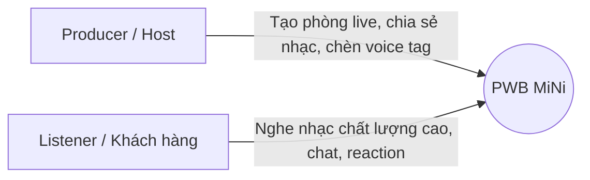
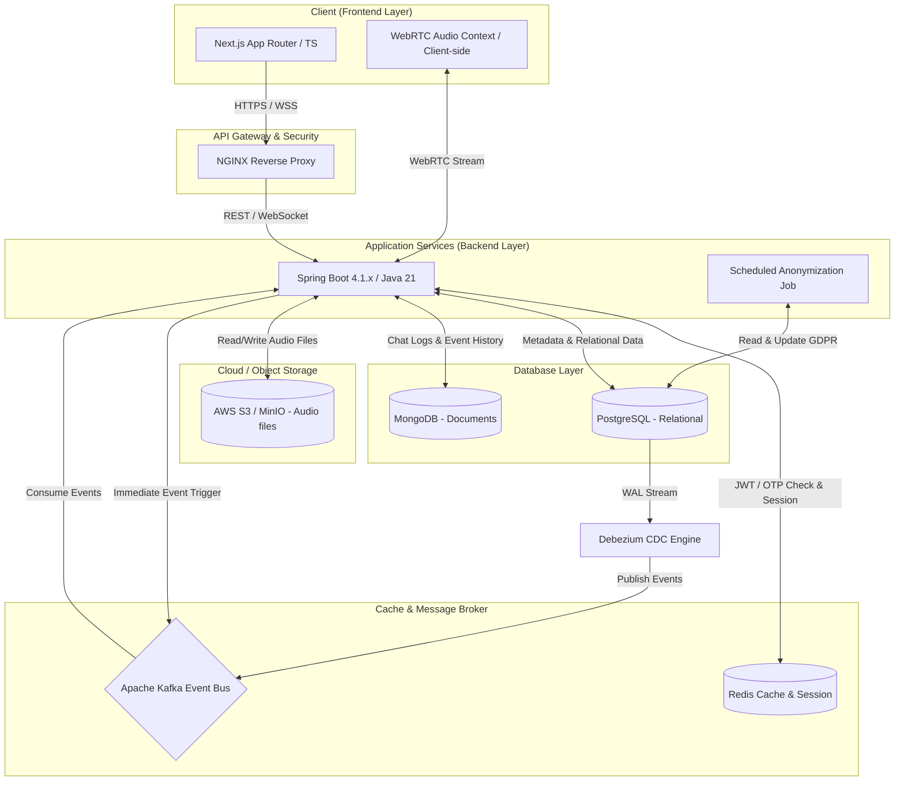

# 📚 Giới thiệu Dự án PWB MiNi (Play With Beats MiNi)

Chào mừng bạn đến với **PWB MiNi** (Play With Beats MiNi) — Nền tảng cộng tác âm thanh thời gian thực và chia sẻ bản thu thử (demo) bảo mật chuyên nghiệp được thiết kế riêng cho các **Nhà sản xuất âm nhạc (Producers)** và các đối tác.

---

## ⚡ 1. Nỗi đau Thị trường & Giải pháp từ PWB MiNi (Pain Points & Solutions)

Trong quy trình sản xuất và phân phối âm nhạc hiện đại, các Producer thường xuyên đối mặt với hai vấn đề sống còn: **Bảo vệ bản quyền sản phẩm** và **Đồng bộ hóa trải nghiệm lắng nghe**. PWB MiNi ra đời như một giải pháp trọn gói giải quyết triệt để những khó khăn này.

### 🛑 Nỗi đau 1: Đánh cắp bản quyền file thử nghiệm (Demo Piracy)
*   **Vấn đề**: Khi gửi file demo gốc (WAV, MP3) cho ca sĩ hoặc đối tác nghe thử, Producer không có cách nào ngăn chặn đối phương tải file về máy, sử dụng lậu hoặc tự ý phát hành khi chưa thanh toán bản quyền.
*   **Giải pháp PWB MiNi**:
    *   **Tự động chèn Voice Tag**: Hệ thống tự động trộn giọng đọc thương hiệu (ví dụ: *"Bản nghe thử của PWB Studio"*) vào file nhạc trước khi stream.
    *   **Mã hóa HLS (HTTP Live Streaming)**: Nhạc được chia nhỏ và mã hóa bằng AES-128. Trình duyệt chỉ nhận các phân đoạn nhỏ (.ts) đã mã hóa, ngăn chặn hoàn toàn việc tải trực tiếp file nhạc gốc từ thẻ `<audio>` hoặc Network Tab.
    *   **Liên kết chia sẻ bảo mật (Secure Shared Links)**: Hỗ trợ tạo liên kết nghe thử có thời hạn sử dụng (Expiration Time), giới hạn số lượt nghe tối đa hoặc giới hạn dải IP truy cập, và cho phép thu hồi quyền truy cập ngay lập tức.

### 🛑 Nỗi đau 2: Trải nghiệm nghe chung từ xa cực kỳ kém & Quản lý phòng Live phức tạp (Low-Quality Live Rooms & Audio Desync)
*   **Vấn đề**:
    *   **Mất đồng bộ khi nghe chung (Desync Playback)**: Khi nghe chung demo, việc bắt nhịp phản hồi (feedback) yêu cầu tính chính xác rất cao. Tuy nhiên, các công cụ đàm thoại thông thường không có tính năng đồng bộ hóa trình phát. Khi Producer tua nhạc (Seek) hay tạm dừng (Pause), Listener không được tự động đồng bộ theo, dẫn đến mỗi người nghe ở một mốc thời gian khác nhau của bài nhạc.
    *   **Đàm thoại trực tiếp trễ lớn (High Latency Voice Chat)**: Trao đổi ý kiến về các chi tiết âm nhạc đòi hỏi tốc độ phản hồi tức thì. Các ứng dụng đàm thoại thông thường có độ trễ thoại lớn khiến các bên khó trao đổi đúng thời điểm bài nhạc đang chạy.
    *   **Thiếu phân quyền kiểm soát buổi review (Lack of Role Delegation)**: Trong buổi nghe thử, Host không có công cụ phân quyền nhanh (như cấp quyền Co-host cùng kiểm soát nhạc, cho phép Listener phát biểu ý kiến, quản lý phòng chờ), dẫn đến việc trao đổi bị lộn xộn hoặc gián đoạn.
    *   **Xâm nhập trái phép & Rò rỉ tài nguyên (Security and Resource Leaks)**: Nguy cơ lộ link phòng live dẫn đến việc người ngoài xâm nhập gây náo loạn (Zoombombing). Thêm vào đó, việc người dùng đột ngột mất mạng hoặc đóng trình duyệt mà không giải phóng các kênh WebRTC sẽ làm treo các kết nối trên server báo hiệu (Signalling Server).
*   **Giải pháp PWB MiNi**:
    *   **Đồng bộ hóa Playback tuyệt đối qua WebSocket**: Trạng thái phát nhạc (Play/Pause/Seek) của toàn bộ Listener được đồng bộ hóa tức thời theo Host thông qua kết nối WebSocket/Redis Cache. Luồng nhạc chính được stream bảo mật chất lượng cao qua HLS từ server.
    *   **Đàm thoại WebRTC Mesh P2P trễ cực thấp**: Sử dụng WebRTC Mesh P2P cho kênh thoại trực tiếp (Voice Chat) giữa Host và các Listeners (tối đa 7 người) giúp giảm độ trễ thoại xuống dưới 150ms và không gây tải băng thông truyền dữ liệu media cho Backend (chỉ đóng vai trò Signalling Broker).
    *   **Ủy quyền điều khiển & Quản lý vai trò (Control Delegation & Roles)**: Hỗ trợ phân quyền phân cấp vai trò Host/Co-host trong phòng Live. Cho phép Host phê duyệt quyền phát biểu hoặc chuyển giao quyền kiểm soát nhạc một cách có kiểm soát.
    *   **Phòng chờ kiểm duyệt & Dọn dẹp tự động (Waiting Room & Cleanup)**: Cơ chế phòng chờ (Waiting Room) yêu cầu Host phê duyệt trước khi cho phép Listener kết nối đàm thoại. Tích hợp cơ chế tự động dọn dẹp vòng đời phòng (Room Lifecycle Cleanup) để giải phóng tài nguyên server ngay khi Host rời phòng.

### 🛑 Nỗi đau 3: Rò rỉ thông tin & Tài khoản rác (Security & Data Governance)
*   **Vấn đề**: Các phiên đăng nhập không được kiểm soát tốt dễ bị lợi dụng chiếm quyền điều khiển (Session Hijacking). Dữ liệu cá nhân của người dùng đã xóa không được xử lý triệt để, vi phạm các đạo luật an toàn thông tin (GDPR).
*   **Giải pháp PWB MiNi**:
    *   **Quay vòng mã xác thực (Refresh Token Rotation - RTR)** kết hợp danh sách đen (Blacklist) trên Redis để vô hiệu hóa token ngay khi đăng xuất.
    *   **Tiến trình ẩn danh hóa tự động (GDPR Anonymization)**: Tự động xóa sạch dữ liệu cá nhân nhạy cảm của tài khoản sau 30 ngày đóng băng mà không làm ảnh hưởng đến tính toàn vẹn của lịch sử hệ thống.

---

## 👥 2. Đối tượng Người dùng chính (Target Personas)

Hệ thống được thiết kế xoay quanh hai nhóm đối tượng chính tương tác với nhau:

1.  **Host (Producer - Nhà sản xuất âm nhạc)**:
    *   Sở hữu tài khoản định danh, có toàn quyền quản lý kho nhạc demo cá nhân.
    *   Khởi tạo và làm chủ các phòng phát âm thanh trực tuyến (Live Rooms).
    *   Kiểm soát việc cấp quyền nghe, tải bản gốc, chèn tag bảo vệ và cấu hình các liên kết chia sẻ an toàn.
2.  **Listener (Người nghe - Ca sĩ, Nhạc sĩ, Khách hàng, Đối tác)**:
    *   Không bắt buộc phải có tài khoản (có thể tham gia dưới danh nghĩa khách vãng lai thông qua liên kết chia sẻ bảo mật).
    *   Tham gia vào phòng chờ (Waiting Room) trước khi được Host phê duyệt vào phòng nghe chính thức.
    *   Lắng nghe luồng nhạc độ phân giải cao thời gian thực và tương tác với Host thông qua hệ thống Chat và Biểu cảm (Reactions).

---

## 🏗️ 3. Kiến trúc Tổng thể & Stack Công nghệ (Architecture & Tech Stack)

Hệ thống PWB MiNi áp dụng kiến trúc Microservices hướng sự kiện (Event-Driven) kết hợp các giải pháp bộ nhớ đệm và hàng đợi hiệu năng cao nhằm đảm bảo tính phản hồi nhanh và khả năng chịu tải tốt.

### Sơ đồ Kiến trúc Hệ thống

### Stack Công nghệ Chi tiết (Tech Stack)

*   **Backend (Java + Spring Boot)**:
    *   **Ngôn ngữ**: Java 21 (sử dụng các tính năng mới như Records, Pattern Matching).
    *   **Framework**: Spring Boot 4.1.x (Spring Security, Spring Web, Spring WebSockets).
    *   **Cơ sở dữ liệu**:
        *   **PostgreSQL**: Lưu trữ dữ liệu quan hệ (Người dùng, Cấu hình phòng, Lịch sử giao dịch, Thiết bị).
        *   **MongoDB**: Lưu trữ tài liệu phi cấu trúc (Tin nhắn chat, Nhật ký hoạt động).
    *   **Cache & Key-Value Store**: **Redis** (Lưu trữ Session, Blacklist Token, Cooldown OTP, Rate Limiting).
    *   **Message Broker**: **Apache Kafka** (Hỗ trợ luồng xử lý bất đồng bộ, gửi email OTP thông qua Transactional Outbox Pattern).
    *   **CDC (Change Data Capture)**: **Debezium Embedded Engine** (PostgreSQL Connector) — Cơ chế chính lắng nghe WAL stream để phát sự kiện Outbox lên Kafka theo thời gian thực, kết hợp với Scheduler polling 30 giây làm fallback.
*   **Frontend (TypeScript + Next.js)**:
    *   **Framework**: Next.js 15+ (App Router, Server Components kết hợp Client Components linh hoạt).
    *   **Ngôn ngữ**: TypeScript ở chế độ kiểm soát kiểu nghiêm ngặt (`strict: true`).
    *   **Styling & UI**: TailwindCSS v4 cùng shadcn/ui được tùy biến theo chủ đề **Grayscale Monochrome** (Đen trắng tối giản và hiện đại).
    *   **Quản lý trạng thái**: Zustand (Client State) kết hợp TanStack Query (Server State).
*   **Công nghệ Âm thanh & Streaming**:
    *   **WebRTC**: Hỗ trợ đàm thoại trực tiếp (Voice/Video) giữa Host và các Listeners trong phòng qua kết nối Mesh P2P với độ trễ siêu thấp (< 150ms) sử dụng Opus Codec, giảm tải tối đa cho hạ tầng server.
    *   **HLS (HTTP Live Streaming)**: Cắt lát file nhạc dạng m3u8 và mã hóa AES-128 để stream nhạc tĩnh an toàn từ thư viện nhạc demo lên trình duyệt của mọi thành viên.

---

## 🎯 4. Tóm tắt 3 Phân hệ Cốt lõi (Core Modules)

Hệ thống PWB MiNi được tổ chức chặt chẽ thành 3 phân hệ nghiệp vụ chính:

### 🔐 Phân hệ 1: Identity & Access Management (IAM)
Chịu trách nhiệm bảo mật đầu vào, định danh và kiểm soát quyền truy cập của toàn bộ hệ thống:
*   Đăng ký tài khoản Producer và xác thực kích hoạt an toàn bằng mã OTP Email thông qua hàng đợi Kafka.
*   Quy trình đăng nhập bảo mật hỗ trợ JWT (Access Token thời gian sống ngắn, Refresh Token xoay vòng RTR để chống chiếm đoạt phiên).
*   Quản lý danh sách thiết bị đang hoạt động (Active Sessions), cho phép hủy phiên làm việc từ xa.
*   Tiến trình chạy ẩn tự động ẩn danh hóa tài khoản (Scheduled GDPR Job) sau thời gian chờ 30 ngày.

### 🎙️ Phân hệ 2: Live Room
Quản lý vòng đời phòng phát trực tuyến và kết nối cộng tác âm thanh thời gian thực:
*   Khởi tạo phòng Live, cấu hình chất lượng stream, mật khẩu và chế độ kiểm soát quyền phát biểu.
*   Cơ chế phòng chờ (Waiting Room) lọc người tham gia, ngăn chặn truy cập trái phép.
*   Lựa chọn bài hát làm nguồn nhạc chính phát trong phòng Live trực tiếp từ kho demo cá nhân của Host.
*   Đồng bộ hóa tuyệt đối trạng thái phát nhạc (Play, Pause, Seek) của tất cả người nghe theo Host qua WebSocket.
*   Hạ tầng đàm thoại trực tiếp WebRTC độ trễ siêu thấp (< 150ms) đi kèm kênh chat và bắn biểu cảm (Reactions) thời gian thực.

### 🎵 Phân hệ 3: Secure Audio Streaming
Đảm bảo an toàn tuyệt đối và bảo vệ bản quyền cho các tài sản âm nhạc của Producer:
*   Quy trình tải lên nhạc gốc chất lượng cao (WAV/FLAC) và tự động chuyển mã (transcoding) sang MP3/AAC tối ưu cho việc truyền tải.
*   Hệ thống trộn Voice Tag tự động theo văn bản định dạng tùy chỉnh của Producer.
*   Tạo liên kết chia sẻ demo (Secure Shared Link) có cấu hình giới hạn (lượt nghe, thời gian hết hạn, IP) và thu hồi tức thì.
*   Công nghệ streaming HLS bảo mật kết hợp Signed URL và Signed Cookies để chống tải lậu.
*   Quy trình thanh toán/kiểm tra quyền sở hữu trước khi mở khóa tải xuống file nhạc chất lượng gốc.

---

## 🗺️ 5. Hướng dẫn Đọc Tài liệu Thiết kế (Documentation Map)

Để thuận tiện cho việc phát triển và tích hợp, toàn bộ tài liệu đặc tả thiết kế chi tiết (Software Specification) được lưu trữ theo cấu trúc thư mục nghiệp vụ sau đây:

*   **Tài liệu Phân hệ IAM**:
    *   [01_register_otp_verification.md](./1.%20Identity%20&%20Access%20Management/01_register_otp_verification.md): Đăng ký & Kích hoạt OTP.
    *   [02_user_login.md](./1.%20Identity%20&%20Access%20Management/02_user_login.md): Đăng nhập Local & OAuth2.
    *   [03_refresh_access_token.md](./1.%20Identity%20&%20Access%20Management/03_refresh_access_token.md): Làm mới Access Token (Silent Refresh).
    *   [04_user_logout.md](./1.%20Identity%20&%20Access%20Management/04_user_logout.md): Đăng xuất & Thu hồi Token.
    *   [05_forgot_change_password.md](./1.%20Identity%20&%20Access%20Management/05_forgot_change_password.md): Quên/Đổi mật khẩu bảo mật.
    *   [06_user_profile_deletion.md](./1.%20Identity%20&%20Access%20Management/06_user_profile_deletion.md): Đóng băng & Xóa tài khoản.
    *   [07_session_management.md](./1.%20Identity%20&%20Access%20Management/07_session_management.md): Quản lý phiên hoạt động.
    *   [08_account_anonymization_job.md](./1.%20Identity%20&%20Access%20Management/08_account_anonymization_job.md): Scheduled Job ẩn danh hóa GDPR.
*   **Tài liệu Phân hệ Live Room**:
    *   [01_create_room.md](./2.%20Live%20Room/01_create_room.md): Khởi tạo phòng Live Room.
    *   [02_join_waiting_room.md](./2.%20Live%20Room/02_join_waiting_room.md): Hàng đợi duyệt vào phòng (Waiting Room).
    *   [03_select_source.md](./2.%20Live%20Room/03_select_source.md): Chọn nguồn âm thanh đầu vào.
    *   [04_playback_sync.md](./2.%20Live%20Room/04_playback_sync.md): Cơ chế đồng bộ Playback.
    *   [05_control_delegation.md](./2.%20Live%20Room/05_control_delegation.md): Phân quyền & Ủy quyền Co-host/Phát biểu.
    *   [06_webrtc_communication.md](./2.%20Live%20Room/06_webrtc_communication.md): Thiết lập WebRTC & SFU.
    *   [07_chat_reactions.md](./2.%20Live%20Room/07_chat_reactions.md): Tương tác Chat & Reactions thời gian thực.
    *   [08_room_lifecycle_cleanup.md](./2.%20Live%20Room/08_room_lifecycle_cleanup.md): Kết thúc phòng & Thu hồi tài nguyên.
*   **Tài liệu Phân hệ Secure Audio Streaming**:
    *   [01_upload_process_demo.md](./3.%20Secure%20Audio%20Streaming/01_upload_process_demo.md): Upload nhạc gốc & Transcoding.
    *   [02_generate_voice_tag.md](./3.%20Secure%20Audio%20Streaming/02_generate_voice_tag.md): Trộn Voice Tag tự động.
    *   [03_distribute_share_demo.md](./3.%20Secure%20Audio%20Streaming/03_distribute_share_demo.md): Quản lý liên kết chia sẻ an toàn.
    *   [04_stream_secure_audio.md](./3.%20Secure%20Audio%20Streaming/04_stream_secure_audio.md): Stream nhạc bảo mật qua HLS AES-128.
    *   [05_download_original_audio.md](./3.%20Secure%20Audio%20Streaming/05_download_original_audio.md): Tải file gốc chất lượng cao.
    *   [06_revoke_shared_link.md](./3.%20Secure%20Audio%20Streaming/06_revoke_shared_link.md): Thu hồi quyền nghe thử tức thì.

> [!TIP]
> Tất cả các tài liệu đặc tả trên đều tuân thủ quy chuẩn thiết kế 6 phần đồng nhất (Business & Requirements, User Flow & Sequence, Database & Cache, API Specs, UI/UX & Frontend Integration, Logging & Observability) để các thành viên dễ dàng phát triển đồng bộ.
