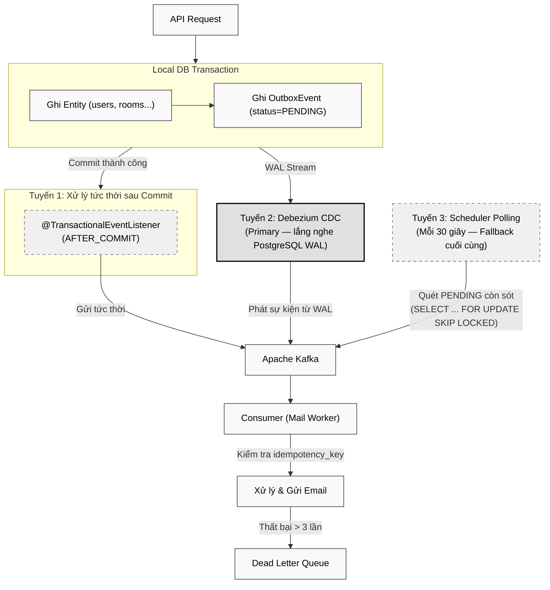

# 📐 Đặc tả Cấu hình Hạ tầng Chung (Infrastructure Configuration Reference)

Tài liệu tham chiếu tập trung mô tả cấu hình, quy tắc vận hành và best practices cho 4 thành phần hạ tầng xuyên suốt toàn bộ hệ thống **PWB MiNi**: **Apache Kafka** (Message Broker), **WebSocket STOMP** (Giao tiếp thời gian thực), **Redis** (Cache, Session, Pub/Sub, Distributed Lock) và **AWS S3 & CloudFront** (Object Storage & CDN).

> [!NOTE]
> Tài liệu này tổng hợp và chuẩn hóa thông tin cấu hình đã được đặc tả rải rác trong 22 file spec của 3 phân hệ (IAM, Live Room, Secure Audio Streaming). Khi phát triển tính năng mới có sử dụng Kafka/WebSocket/Redis, **bắt buộc** phải tham khảo tài liệu này để tuân thủ naming convention, TTL strategy và atomic operation patterns đã thiết lập.

---

## Mục lục

1. [Apache Kafka Configuration](#-1-apache-kafka-configuration)
2. [WebSocket STOMP Configuration](#-2-websocket-stomp-configuration)
3. [Redis Configuration](#-3-redis-configuration)
4. [AWS S3 & CloudFront CDN Configuration](#-4-aws-s3--cloudfront-cdn-configuration)

---

## 🔥 1. Apache Kafka Configuration

### 1.1. Tổng quan Vai trò

Apache Kafka đóng vai trò **Message Broker hướng sự kiện (Event-Driven Message Broker)** trong kiến trúc PWB MiNi, phục vụ hai mục đích chính:

1. **Xử lý bất đồng bộ (Asynchronous Processing)**: Tách biệt luồng xử lý nghiệp vụ chính (API response) khỏi các tác vụ nặng I/O như gửi email OTP, thông báo push, ghi nhận analytics.
2. **Đảm bảo tính nhất quán dữ liệu (Data Consistency)**: Kết hợp với **Transactional Outbox Pattern** để triệt tiêu hoàn toàn vấn đề Dual-Write giữa PostgreSQL và Kafka.

### 1.2. Cấu hình Broker

| Tham số | Giá trị | Ghi chú |
| :--- | :--- | :--- |
| **Image** | `confluentinc/cp-kafka:7.6.0` | KRaft mode (không Zookeeper) |
| **Node ID** | `1` | Single-node development |
| **Process Roles** | `broker,controller` | Combined mode cho môi trường phát triển |
| **Internal Listener** | `PLAINTEXT://kafka:29092` | Giao tiếp nội bộ giữa các container (dev only) |
| **External Listener (Production)** | `SASL_SSL://kafka:9093` | **BẮT BUỘC TLS 1.3 + SASL/SCRAM-SHA-512** ở production. Listener dev `PLAINTEXT_HOST://localhost:9092` chỉ dùng local. |
| **SASL mechanism** | `SCRAM-SHA-512` (user `pwb-audio-producer`, `pwb-audio-worker`, `pwb-notification-mailer`) | Mỗi service có account riêng, ACL giới hạn WRITE/READ theo topic |
| **Controller Quorum** | `1@kafka:29093` | KRaft controller |
| **Replication Factor** | `1` (Offsets, Transaction State Log) | Chỉ dùng cho development, production yêu cầu ≥ 3 |

> [!WARNING]
> **Authentication & Encryption bắt buộc ở Production**:
> 1. **SASL/SCRAM-SHA-512 + TLS 1.3** cho mọi listener (port 9093). Không bao giờ để `PLAINTEXT://` ở môi trường production — Kafka message chứa OTP email, share token, và personal info có thể bị sniff nội bộ.
> 2. **ACL Authorization**: Config qua `kafka-acls.sh` — Producer service `pwb-audio-producer` chỉ `WRITE` trên `audio-processing-events`. Worker `pwb-audio-worker` chỉ `READ` + `WRITE` trên `-dlq`. Không dùng wildcard `*`.
> 3. **Cert rotation**: Internal CA rotate mỗi 12 tháng, deployment tự động refresh truststore qua Vault.

> [!WARNING]
> Cấu hình `REPLICATION_FACTOR = 1` và `MIN_ISR = 1` chỉ phù hợp cho môi trường phát triển. Môi trường production **bắt buộc** phải cấu hình cluster ≥ 3 broker với `replication.factor = 3` và `min.insync.replicas = 2` để đảm bảo tính sẵn sàng và bền vững dữ liệu.

### 1.3. Danh mục Topics (Topic Registry)

| Topic Name | Partition | Mô tả | Module sử dụng | Tham chiếu Spec |
| :--- | :--- | :--- | :--- | :--- |
| `notification-events` | 1 (dev) / 3+ (prod) | Chuyển tải các sự kiện thông báo bất đồng bộ (gửi email OTP kích hoạt, thông báo đăng nhập bất thường, cảnh báo bảo mật) | IAM | [01_register_otp_verification.md](./1.%20Identity%20&%20Access%20Management/01_register_otp_verification.md) |
| `notification-events-dlq` | 1 | Dead Letter Queue — lưu trữ các tin nhắn gửi email thất bại sau 3 lần retry để giám sát và xử lý thủ công | IAM | [01_register_otp_verification.md](./1.%20Identity%20&%20Access%20Management/01_register_otp_verification.md) |
| `room-lifecycle-events` *(tương lai)* | 1 (dev) / 3+ (prod) | Ghi nhận sự kiện `ROOM_LIFECYCLE_ENDED` khi phòng Live Room đóng, phục vụ tính toán Analytics | Live Room | [08_room_lifecycle_cleanup.md](./2.%20Live%20Room/08_room_lifecycle_cleanup.md) |
| `audio-processing-events` | 1 (dev) / 3+ (prod) | Phát sự kiện upload Demo đã xác nhận thành công, Worker (cùng JVM) consume để bắt đầu xử lý HLS + Sidechain Ducking + Trích xuất Waveform | Secure Audio Streaming | [01_upload_process_demo.md](./3.%20Secure%20Audio%20Streaming/01_upload_process_demo.md) |
| `audio-processing-events-dlq` | 1 | Dead Letter Queue — lưu trữ job xử lý âm thanh thất bại ≥ 3 lần (Poison Pill), cho phép Admin Console truy vết | Secure Audio Streaming | [01_upload_process_demo.md](./3.%20Secure%20Audio%20Streaming/01_upload_process_demo.md) |

#### Quy tắc Đặt tên Topic (Topic Naming Convention)

```
{domain}-events            → Topic chính chứa sự kiện nghiệp vụ
{domain}-events-dlq        → Dead Letter Queue tương ứng
```

*Ví dụ*: `notification-events` / `notification-events-dlq`, `room-lifecycle-events` / `room-lifecycle-events-dlq`, `audio-processing-events` / `audio-processing-events-dlq`.

### 1.4. Cấu hình Kafka Producer

| Tham số | Giá trị | Lý do |
| :--- | :--- | :--- |
| `bootstrap-servers` | `${SPRING_KAFKA_BOOTSTRAP_SERVERS}` | Env variable, thay đổi theo môi trường |
| `key-serializer` | `StringSerializer` | Key là chuỗi định danh aggregate |
| `value-serializer` | `StringSerializer` | Payload là JSON string từ bảng `outbox_events` |
| `acks` | `all` | Đảm bảo tin nhắn được ghi nhận bởi tất cả ISR replicas trước khi xác nhận |
| `retries` | `3` | Tự động retry khi gặp lỗi tạm thời (network blip, leader election) |
| `enable.idempotence` | `true` | Kích hoạt Exactly-Once Semantics cho Producer, loại bỏ tin nhắn trùng lặp do retry |
| `max.block.ms` | `500` | Giới hạn thời gian chờ tối đa khi buffer đầy hoặc metadata chưa sẵn sàng. Tránh treo thread xử lý khi Kafka gặp sự cố |
| `delivery.timeout.ms` | `5000` | Tổng thời gian tối đa cho một lần gửi (bao gồm retry). Nếu vượt quá, Producer ném `TimeoutException` |

> [!IMPORTANT]
> Cấu hình `max.block.ms = 500` là thiết yếu trong ngữ cảnh `@TransactionalEventListener(AFTER_COMMIT)`. Nếu Kafka broker bị sự cố, Producer không được phép treo thread quá 500ms vì điều này sẽ block luồng phản hồi HTTP cho client. Lỗi `TimeoutException` được catch và log warning để hệ thống fallback sang Scheduler polling dự phòng.

### 1.5. Cấu hình Kafka Consumer (Mail Worker Service)

| Tham số | Giá trị | Lý do |
| :--- | :--- | :--- |
| `group.id` | `mail-worker` | Consumer Group định danh cho dịch vụ gửi email |
| `auto.offset.reset` | `earliest` | Đọc từ đầu khi Consumer Group mới được khởi tạo, đảm bảo không bỏ sót sự kiện |
| `enable.auto.commit` | `false` | Tắt auto-commit để kiểm soát thủ công việc xác nhận offset sau khi xử lý thành công |
| `max.poll.records` | `10` | Giới hạn số tin nhắn xử lý mỗi lần poll để kiểm soát throughput và tránh timeout |
| `concurrency` (Spring `@KafkaListener`) | `3` (mặc định) — chia đều cho số partition của `notification-events` | Multi-thread Consumer trong cùng JVM — scale theo chiều dọc; **KHÔNG đặt** `concurrency > số partition` (sẽ có thread idle) |
| `session.timeout.ms` | `30000` | Phát hiện Consumer chết trong 30s, sau đó Kafka rebalance partition cho instance khác |
| `max.poll.interval.ms` | `300000` (5 phút) | Max thời gian giữa 2 poll — nếu SMTP gửi email chậm > 5 phút, Kafka tưởng Consumer chết và rebalance (gây duplicate). Nếu cần xử lý lâu hơn, **BẮT BUỘC** gọi `consumer.pause()` hoặc cắt nhỏ batch. |
| `commit_strategy` | **Manual ACK sau khi xử lý thành công** (Spring `AckMode.MANUAL`) | Đảm bảo at-least-once: chỉ commit offset khi DB đã update `status='PROCESSED'` hoặc `status='DEAD_LETTER'`. Nếu Worker crash giữa chừng → Kafka re-deliver event. |

**Idempotency Check Logic (Producer-side của Consumer pipeline)**:

Tại tầng Service của Mail Worker, **trước khi** gửi SMTP, check Redis key `mail:processed:{idempotency_key}` TTL 7 ngày:
```
GET mail:processed:{idempotency_key}
  ├─ EXISTS → log INFO OUTBOX_EVENT_DUPLICATE_SKIP {idempotencyKey}, return early (KHÔNG gửi lại)
  └─ MISSING → tiếp tục xử lý
```

Nếu xử lý thành công:
```
SETEX mail:processed:{idempotency_key} 604800 {epochMs}  // 7 ngày
```

TTL 7 ngày đủ dài để cover Kafka retention (mặc định 7 ngày). Cấu hình `retention.ms = 604800000` cho topic `notification-events` phải khớp TTL Redis.

**Lưu ý quan trọng**: Redis idempotency check + Outbox's `idempotency_key` column là **2 lớp bảo vệ**:
- Lớp 1 (DB UNIQUE constraint): chống duplicate INSERT.
- Lớp 2 (Redis SETEX): chống duplicate **process** (nếu Redis miss → re-process, idempotency_key trùng vẫn đi qua, nhưng DB constraint chặn).

Lớp 2 là OPTIMIZATION — tránh gửi SMTP lần thứ 2 (đã tốn resource). Lớp 1 là correctness guarantee (không bao giờ có 2 row DB cùng idempotency_key).

### 1.6. Transactional Outbox Pattern

**DDL chuẩn cho bảng `outbox_events`** (canonical schema dùng xuyên suốt tất cả module):

```sql
CREATE TABLE outbox_events (
    id UUID PRIMARY KEY,
    idempotency_key UUID NOT NULL UNIQUE,       -- UUID v4 sinh bởi Producer tại INSERT — Consumer check trùng (chống duplicate nếu Debezium hoặc scheduler replay)
    aggregate_type VARCHAR(50) NOT NULL,        -- 'demo_distribution', 'voice_tag_create', 'password_reset', ...
    aggregate_id UUID NOT NULL,                 -- id của aggregate gốc
    event_type VARCHAR(50) NOT NULL,            -- 'SEND_SHARE_EMAIL', 'SEND_REVOKE_NOTICE', 'SEND_OTP', ...
    payload BYTEA NOT NULL,                     -- AES-256-GCM encrypted: base64(nonce || ciphertext || authTag)
    payload_key_version INT NOT NULL,           -- Version của outbox.encryption.key (rotation 90 ngày, dual-key overlap)
    status VARCHAR(20) NOT NULL DEFAULT 'PENDING',  -- 'PENDING', 'PROCESSED', 'FAILED', 'DEAD_LETTER'
    retry_count INT NOT NULL DEFAULT 0,         -- Tối đa 5 (docs 03 §C)
    last_error TEXT NULL,
    available_at TIMESTAMP NOT NULL DEFAULT NOW(),  -- Earliest time to process (backoff)
    processed_at TIMESTAMP NULL,
    created_at TIMESTAMP NOT NULL DEFAULT NOW(),
    updated_at TIMESTAMP NOT NULL,
    CONSTRAINT chk_outbox_status CHECK (status IN ('PENDING', 'PROCESSED', 'FAILED', 'DEAD_LETTER')),
    CONSTRAINT chk_outbox_retry CHECK (retry_count >= 0 AND retry_count <= 5)
);

CREATE INDEX idx_outbox_status_available ON outbox_events(status, available_at) WHERE status IN ('PENDING', 'FAILED');
CREATE INDEX idx_outbox_idempotency ON outbox_events(idempotency_key);
```

**Idempotency Key Generation (Producer-side Rule)**:
- UUID v4 sinh bởi `SecureRandom` tại tầng Service trước khi INSERT.
- Cùng logical event (vd `distributionId` cụ thể) phải dùng cùng `idempotency_key` — chống duplicate khi Producer retry giữa commit và Kafka publish.
- Nếu INSERT fail với unique violation trên `idempotency_key`, Producer SELECT existing event rồi skip insert (idempotent retry safe).
- Tại Consumer, mỗi lần xử lý event check `idempotency_key` đã từng process chưa (qua local cache `processed_keys:{consumerGroup}` hoặc DB mark).

Mẫu thiết kế Transactional Outbox được áp dụng xuyên suốt hệ thống để đảm bảo tính nhất quán tuyệt đối giữa PostgreSQL và Kafka. Hệ thống triển khai **3 tuyến xử lý phân tầng** (Tiered Processing) để đạt At-Least-Once Delivery:



**Luồng xử lý 3 tầng đảm bảo At-Least-Once Delivery:**

| Tuyến | Cơ chế | Vai trò | Khi nào kích hoạt |
| :--- | :--- | :--- | :--- |
| **Tuyến 1 (Tức thời)** | `@TransactionalEventListener(phase = AFTER_COMMIT)` | Phản hồi nhanh nhất — email gửi ngay sau đăng ký | Luôn luôn (sau mỗi commit thành công) |
| **Tuyến 2 (Primary)** | **Debezium Embedded Engine** — lắng nghe PostgreSQL WAL stream, phát hiện INSERT vào `outbox_events` | Cơ chế chính đảm bảo mọi sự kiện Outbox đều được phát lên Kafka, kể cả khi Tuyến 1 thất bại | Liên tục (real-time CDC từ WAL) |
| **Tuyến 3 (Fallback)** | `@Scheduled(fixedDelay = 30000)` + `SELECT ... FOR UPDATE SKIP LOCKED` | Tuyến phòng thủ cuối cùng — bảo vệ trước sự cố sập cả server lẫn Debezium | Quét định kỳ mỗi 30 giây |

> [!IMPORTANT]
> **Debezium CDC (Tuyến 2)** yêu cầu PostgreSQL được cấu hình `wal_level = logical` (đã thiết lập trong `docker-compose.yml`). Debezium Embedded Engine chạy trong cùng tiến trình Spring Boot, sử dụng `@Profile("!test")` để tắt trong môi trường test.

**Cơ chế chống trùng lặp (Idempotency):**
- Mỗi `OutboxEvent` được gắn một `idempotency_key` (UUID v4 duy nhất).
- Kafka Consumer (Mail Worker) sử dụng key này để kiểm tra sự kiện đã được xử lý chưa trước khi gửi email.
- Đảm bảo mỗi email OTP chỉ được gửi đúng **1 lần** dù sự kiện có bị phát lại (do Debezium, scheduler hoặc retry).

### 1.7. Chiến lược Dead Letter Queue (DLQ)

| Bước | Hành động |
| :--- | :--- |
| 1 | Consumer nhận tin nhắn từ topic `notification-events` |
| 2 | Thực hiện xử lý (biên dịch template, gửi SMTP) |
| 3 | Nếu thất bại → retry tự động (tối đa **5 lần** — xem DDL `outbox_events` mục 1.6: `chk_outbox_retry CHECK (retry_count <= 5)`). Backoff: lần 1 ngay, lần 2 sau 30s, lần 3 sau 2 phút, lần 4 sau 10 phút, lần 5 sau 1 giờ. |
| 4 | Nếu vẫn thất bại sau 5 lần → chuyển sang trạng thái `status='DEAD_LETTER'` trong bảng `outbox_events` (KHÔNG push sang Kafka DLQ topic). |
| 5 | Quản trị viên giám sát `outbox_events WHERE status='DEAD_LETTER'` để xử lý thủ công hoặc cấu hình alert qua `outbox_dead_letter_total` Micrometer metric. |

> **Lưu ý quan trọng**: docs 03 §1.2.C nói "DEAD_LETTER chuyển sang Kafka DLQ topic". Sau R5 review, quyết định **DEAD_LETTER giữ trong bảng `outbox_events`** (không push Kafka DLQ) để đơn giản hóa forensic — admin có thể query DB thay vì consume Kafka topic. Cấu hình này áp dụng thống nhất cho **Mọi event type** (SEND_SHARE_EMAIL, SEND_REVOKE_NOTICE, SEND_OTP...) chứ không riêng `notification-events`.

---

## 🌐 2. WebSocket STOMP Configuration

### 2.1. Tổng quan Vai trò

WebSocket STOMP (Simple Text Oriented Messaging Protocol) là giao thức truyền tin nhắn thời gian thực phục vụ toàn bộ tính năng tương tác trực tuyến của phân hệ **Live Room**:

- **Đồng bộ trình phát nhạc** (Play/Pause/Seek/Sync) giữa Host và Listeners.
- **Chat văn bản** tạm thời và **Biểu cảm cảm xúc** (Emoji Reactions).
- **Báo hiệu WebRTC** (SDP Offer/Answer, ICE Candidates) cho đàm thoại P2P.
- **Phê duyệt phòng chờ** (Waiting Room Approve/Reject) và thông báo thành viên.
- **Thông báo phân quyền** (Delegation Changed) và sự kiện vòng đời phòng (Room Closed).

### 2.2. Cấu hình Kết nối

| Tham số | Giá trị | Ghi chú |
| :--- | :--- | :--- |
| **WebSocket Endpoint** | `/ws` | Hỗ trợ SockJS fallback cho trình duyệt không hỗ trợ WebSocket gốc |
| **Giao thức** | STOMP over WebSocket | Sub-protocol chuẩn hóa trên nền WebSocket |
| **Application Destination Prefix** | `/app` | Tiền tố cho các kênh gửi lệnh từ Client lên Server |
| **Simple Broker Prefix** | `/topic`, `/queue` | `/topic` cho broadcast (1-to-many), `/queue` cho point-to-point |
| **User Destination Prefix** | `/user` | Định tuyến tin nhắn cá nhân qua Spring `@SendToUser` |
| **Allowed Origins** | Cấu hình theo môi trường | `*` cho development, domain cụ thể cho production |

### 2.3. Cấu hình Bảo mật & Hiệu năng

| Tham số | Giá trị | Lý do | Tham chiếu Spec |
| :--- | :--- | :--- | :--- |
| **Handshake Timeout** | `10 giây` | Chống tấn công Slowloris — nếu sau 10s mà không nhận được STOMP CONNECT hợp lệ, server chủ động ngắt kết nối | [01_create_room.md](./2.%20Live%20Room/01_create_room.md) |
| **Server Heartbeat** | `10000 ms` | Server gửi heartbeat frame mỗi 10s để phát hiện kết nối zombie | Cấu hình chuẩn |
| **Client Heartbeat** | `10000 ms` | Client gửi heartbeat frame mỗi 10s để server phát hiện mất kết nối | Cấu hình chuẩn |

### 2.4. Cơ chế Xác thực WebSocket (Authentication)

Hệ thống hỗ trợ **2 loại token** cho xác thực kết nối WebSocket STOMP:

| Loại Token | Đối tượng | Cách truyền | TTL | Tham chiếu Spec |
| :--- | :--- | :--- | :--- | :--- |
| **JWT Access Token** | Người dùng đã đăng ký (Host, User Pro) | Header `Authorization: Bearer {token}` trong STOMP CONNECT frame | 15 phút | [02_user_login.md](./1.%20Identity%20&%20Access%20Management/02_user_login.md) |
| **Temporary JWT** | Khách vãng lai (Listener) | Header `Authorization: Bearer {temporaryToken}` trong STOMP CONNECT frame | 4 giờ | [02_join_waiting_room.md](./2.%20Live%20Room/02_join_waiting_room.md) |

**Hàng rào Bảo mật (ROLE_LISTENER Sandbox):**
- Vai trò `ROLE_LISTENER` trong Temporary JWT chỉ được phép:
  - Kết nối WebSocket endpoint `/ws`.
  - Truy cập API join/leave room.
- Bị chặn đứng (`403 Forbidden`) tại toàn bộ API nghiệp vụ hệ thống khác.

### 2.5. WebSocket Session Attributes (In-Memory Cache)

Để tối ưu hiệu năng kiểm tra quyền trên từng STOMP frame (tần suất cao), hệ thống lưu cache vào RAM cục bộ của mỗi WebSocket session thay vì truy vấn Redis:

| Attribute | Kiểu dữ liệu | Mô tả | Thời điểm ghi/cập nhật |
| :--- | :--- | :--- | :--- |
| `userId` | `String (UUID)` | ID người dùng (từ JWT hoặc Temporary Token) | Khi STOMP CONNECT thành công |
| `roomCode` | `String` | Mã phòng Live Room đang tham gia | Khi SUBSCRIBE vào topic phòng |
| `isController` | `Boolean` | Cờ quyền điều khiển phát nhạc | Khi kết nối + khi nhận sự kiện Delegation qua Redis Pub/Sub |

> [!TIP]
> Việc cache `isController` trong Session Attributes giúp tầng xử lý tin nhắn chỉ cần kiểm tra $O(1)$ in-memory thay vì gọi `HGET` / `EXISTS` xuống Redis trên mỗi frame `/sync-state` (tần suất 5-10s/phòng cho hàng ngàn phòng đồng thời).

### 2.6. Bảng Tổng hợp Kênh WebSocket (Channel Registry)

#### Kênh gửi lệnh (Client → Server)

| Destination | Module | Payload chính | Mô tả |
| :--- | :--- | :--- | :--- |
| `/app/rooms/{roomCode}/sync-state` | Playback Sync | `{action, currentTime, clientSendTime}` | Gửi lệnh Play/Pause/Seek và heartbeat Sync định kỳ |
| `/app/rooms/{roomCode}/chat` | Chat & Reactions | `{type, content}` | Gửi tin nhắn văn bản TEXT hoặc biểu cảm REACTION |
| `/app/rooms/{roomCode}/signalling` | WebRTC | `{receiverId, type, payload}` | Chuyển tiếp gói tin báo hiệu SDP/ICE cho kết nối P2P |

#### Kênh nhận tin Broadcast (Server → All Clients in Room)

| Subscribe Topic | Module | Sự kiện phát sóng | Mô tả |
| :--- | :--- | :--- | :--- |
| `/topic/rooms/{roomCode}/playback` | Playback Sync, Source, Delegation, Lifecycle | `PLAYBACK_UPDATED`, `SOURCE_CHANGED`, `DELEGATION_CHANGED`, `ROOM_CLOSED` | Kênh chính cho trạng thái phát nhạc, nguồn nhạc, phân quyền và vòng đời phòng |
| `/topic/rooms/{roomCode}/members` | Join/Leave/Kick | `MEMBERS_UPDATED` | Broadcast danh sách thành viên khi có người vào/ra/bị kick |
| `/topic/rooms/{roomCode}/chat` | Chat & Reactions | `CHAT_RECEIVED` | Broadcast tin nhắn chat và biểu cảm tới toàn phòng |
| `/topic/rooms/{roomCode}/host` | Waiting Room | `JOIN_REQUEST` | Thông báo riêng cho Host khi có yêu cầu tham gia mới |
| `/topic/shared-threads/{threadId}/distributions` | Distribution Revoke | `DISTRIBUTION_REVOKED` | Thông báo cho cả 2 phía (Producer + Listener) của thread khi 1 distribution bị thu hồi |

#### Kênh nhận tin Cá nhân (Server → Specific Client)

| Subscribe Topic | Module | Sự kiện | Mô tả |
| :--- | :--- | :--- | :--- |
| `/user/queue/rooms/join-result` | Waiting Room | `APPROVED`, `REJECTED`, `KICKED` | Kết quả duyệt/từ chối/kick riêng tư gửi tới Listener cụ thể |
| `/user/queue/rooms/signalling` | WebRTC | SDP Offer/Answer, ICE Candidate | Chuyển tiếp gói tin báo hiệu riêng tư tới đúng Peer |
| `/user/queue/demos/status` | Demo Processing | `PROCESSING_COMPLETED`, `PROCESSING_FAILED` | Thông báo riêng cho Producer khi Demo xử lý xong/thất bại (kèm waveform_data nếu thành công) |

### 2.7. Giới hạn Tần suất Frame (Frame Rate Limiting)

Để bảo vệ hệ thống khỏi spam và tấn công từ chối dịch vụ qua kênh WebSocket, hệ thống áp dụng giới hạn frame tách biệt theo từng kênh:

| Kênh | Loại tin nhắn | Giới hạn | Hành vi khi vượt ngưỡng | Tham chiếu Spec |
| :--- | :--- | :--- | :--- | :--- |
| `/app/.../sync-state` | PLAY/PAUSE/SEEK/SYNC | **15 frames / 10 giây / kết nối** | Drop frame + cảnh báo riêng tư | [04_playback_sync.md](./2.%20Live%20Room/04_playback_sync.md) |
| `/app/.../chat` | TEXT | **30 frames / phút / kết nối** | Drop frame + cảnh báo riêng tư | [07_chat_reactions.md](./2.%20Live%20Room/07_chat_reactions.md) |
| `/app/.../chat` | REACTION | **120 frames / phút / kết nối** | Drop frame + cảnh báo riêng tư | [07_chat_reactions.md](./2.%20Live%20Room/07_chat_reactions.md) |
| `/app/.../signalling` | offer/answer/candidate | **100 frames / phút / kết nối** | Drop frame + cảnh báo riêng tư | [06_webrtc_communication.md](./2.%20Live%20Room/06_webrtc_communication.md) |

> [!CAUTION]
> **Chính sách xử lý vi phạm (Drop Frame Policy):** Khi client vượt hạn ngạch, WebSocket Interceptor **lặng lẽ bỏ qua** gói tin vi phạm (không broadcast) và gửi trả cảnh báo riêng tư. Tuyệt đối **không ngắt kết nối socket (Force Close TCP)** để tránh kích hoạt luồng dọn dẹp thoát phòng gây văng người dùng oan uổng.

### 2.8. Cơ chế Đồng bộ Cụm Node (Clustered Operations)

Trong môi trường triển khai multi-instance (nhiều Backend Node chạy song song sau Load Balancer), các thao tác WebSocket cần được đồng bộ xuyên suốt cụm thông qua **Redis Pub/Sub**:

| Redis Pub/Sub Channel | Payload mẫu | Mục đích | Tham chiếu Spec |
| :--- | :--- | :--- | :--- |
| `room-eviction-events` | `{"event":"FORCE_CLOSE_ROOM_SESSIONS","roomCode":"A8B9D1"}` | Khi Host đóng phòng trên Node A, ép buộc tất cả Node khác ngắt kết nối WebSocket của các thành viên thuộc phòng đó. Ngăn chặn phiên mồ côi (WebSocket Clustered Session Leak) | [08_room_lifecycle_cleanup.md](./2.%20Live%20Room/08_room_lifecycle_cleanup.md) |
| `room-delegation-events` | `{"userId":"e5b8...","roomCode":"A8B9D1","isController":true}` | Khi HTTP API phân quyền xử lý trên Node A, đồng bộ cờ `isController` trong WebSocket Session Attributes trên Node B (nơi giữ kết nối STOMP của Listener). Tránh bất đồng bộ in-memory state | [05_control_delegation.md](./2.%20Live%20Room/05_control_delegation.md) |

### 2.9. Xử lý Ngắt kết nối (Disconnect Cleanup)

Khi một thành viên ngắt kết nối WebSocket đột ngột (đóng trình duyệt, mất mạng), Backend bắt sự kiện `SessionDisconnectEvent` và thực hiện dọn dẹp nguyên tử trên Redis:

| Đối tượng | Hành động dọn dẹp | Cơ chế |
| :--- | :--- | :--- |
| **Listener** | Giảm `currentParticipants` (-1), xóa khỏi `room:members`, xóa khỏi `room:waiting` + `room:waiting_metadata`, broadcast danh sách thành viên mới | Redis Lua Script (nguyên tử) |
| **Host** | Cập nhật `room:status` → `INACTIVE_HOST`, pause playback, thêm vào `rooms:cleanup:timeline` (Grace Period 5 phút) | Redis Hash + ZSet |

---

## 🟥 3. Redis Configuration

### 3.1. Tổng quan Vai trò

Redis đóng **5 vai trò cốt lõi** trong kiến trúc PWB MiNi:

| Vai trò | Mô tả | Ví dụ sử dụng |
| :--- | :--- | :--- |
| **Cache Layer** | Lưu trữ trạng thái nóng (hot state) cho truy cập tốc độ mili giây | Trạng thái phòng, danh sách thành viên, trạng thái phát nhạc |
| **Session Store** | Quản lý phiên đăng nhập và token xác thực | Refresh Token, JWT Blacklist, Session Metadata |
| **Distributed Lock** | Khóa phân tán chống Race Condition | Sinh mã phòng độc nhất (`room:lock`), ShedLock cho Scheduler |
| **Pub/Sub Broker** | Truyền tải sự kiện giữa các node Backend trong cụm | Eviction events, Delegation sync |
| **Rate Limiter** | Kiểm soát tần suất truy cập API và WebSocket frame | OTP cooldown, Login lockout, Frame rate limiting |

### 3.2. Cấu hình Kết nối

| Tham số | Giá trị | Ghi chú |
| :--- | :--- | :--- |
| **Image** | `redis:7.2-alpine` | Bản Alpine nhẹ, tối ưu cho container |
| **Port** | `6379` | Cổng mặc định Redis |
| **AUTH (CRITICAL)** | `requirepass ${REDIS_PASSWORD}` (production bắt buộc) | Dev/local có thể disable nhưng production LUÔN bật. Password lưu qua env var, không commit. Độ dài ≥ 32 ký tự ngẫu nhiên (`openssl rand -base64 32`). |
| **TLS** | `redis-stack-server` chạy port `6380` với TLS 1.3 + mTLS (production) | Spring Boot: `spring.data.redis.ssl.enabled=true` + `spring.data.redis.ssl.bundle=classpath:redis-client.p12`. Connection string dạng `rediss://...`. |
| **Connection Library** | Lettuce (mặc định Spring Boot) | Non-blocking, hỗ trợ reactive và cluster |
| **Spring Config** | `spring.data.redis.host`, `spring.data.redis.port`, `spring.data.redis.password`, `spring.data.redis.username` (Redis 6+ dùng ACL, default user `default`) | Env variables qua `${SPRING_DATA_REDIS_HOST}`. Username mặc định `default` nếu không bật ACL user riêng. |
| **Repositories** | `spring.data.redis.repositories.enabled = true` | Kích hoạt Spring Data Redis Repositories |

> [!WARNING]
> **Redis AUTH/TLS là mandatory ở mọi môi trường trừ localhost dev**: Redis không có AUTH mặc định — bất kỳ ai có network access tới port 6379 đều có thể `FLUSHALL` hoặc đọc OTP, session token. Spring Boot dùng `Lettuce` hỗ trợ TLS nguyên thủy, bật `redis-cli --tls` để verify sau khi config. Với shared Redis (vd AWS ElastiCache), bật **encryption in transit + at-rest + AUTH Token** đồng thời.

**Cấu hình Connection Pool (Lettuce) khuyến nghị cho Production:**

| Tham số | Giá trị khuyến nghị | Mô tả |
| :--- | :--- | :--- |
| `spring.data.redis.lettuce.pool.max-active` | `20` | Số kết nối tối đa trong pool |
| `spring.data.redis.lettuce.pool.max-idle` | `10` | Số kết nối nhàn rỗi tối đa |
| `spring.data.redis.lettuce.pool.min-idle` | `5` | Số kết nối nhàn rỗi tối thiểu (giữ warm) |
| `spring.data.redis.lettuce.pool.max-wait` | `2000ms` | Thời gian chờ tối đa khi pool hết kết nối |

> [!NOTE]
> Để kích hoạt Lettuce connection pool, cần bổ sung dependency `commons-pool2` vào `pom.xml`:
> ```xml
> <dependency>
>     <groupId>org.apache.commons</groupId>
>     <artifactId>commons-pool2</artifactId>
> </dependency>
> ```

### 3.3. Redis Key Catalog — Phân hệ IAM (Identity & Access Management)

Bảng tổng hợp toàn bộ Redis key patterns sử dụng trong phân hệ quản lý định danh và phiên đăng nhập:

| Redis Key Pattern | Type | Value | TTL | Mục đích | Tham chiếu Spec |
| :--- | :--- | :--- | :--- | :--- | :--- |
| `otp:registration:{email}` | String | Mã OTP 6 chữ số (ví dụ: `481920`) | **5 phút** | Đối khớp xác thực OTP kích hoạt tài khoản | [01_register_otp_verification.md](./1.%20Identity%20&%20Access%20Management/01_register_otp_verification.md) |
| `otp:cooldown:{email}` | String | `"true"` | **60 giây** | Giới hạn tần suất bấm gửi lại OTP (chống spam) | [01_register_otp_verification.md](./1.%20Identity%20&%20Access%20Management/01_register_otp_verification.md) |
| `otp:attempts:{email}` | String | Counter (`1`, `2`...) | **5 phút** | Đếm số lần nhập sai OTP, khóa sau 5 lần | [01_register_otp_verification.md](./1.%20Identity%20&%20Access%20Management/01_register_otp_verification.md) |
| `login_attempts:{userId}` | String | Counter (`1`, `2`...) | **15 phút** | Đếm số lần nhập sai mật khẩu (chống brute-force) | [02_user_login.md](./1.%20Identity%20&%20Access%20Management/02_user_login.md) |
| `login_lockout:{userId}` | String | `"true"` | **15 phút** | Khóa tạm thời tài khoản khi nhập sai ≥ 5 lần | [02_user_login.md](./1.%20Identity%20&%20Access%20Management/02_user_login.md) |
| `session:refresh_token:{tokenUuid}` | String | `username` hoặc `email` | **7 ngày** | Lưu trữ Refresh Token hợp lệ, xác thực khi Silent Refresh | [01_register_otp_verification.md](./1.%20Identity%20&%20Access%20Management/01_register_otp_verification.md), [02_user_login.md](./1.%20Identity%20&%20Access%20Management/02_user_login.md) |
| `session:metadata:{tokenUuid}` | Hash | `ip`, `device`, `browser`, `os`, `location`, `loginAt`, `active_jwt_signature` | **7 ngày** | Thông tin chi tiết phiên đăng nhập (thiết bị, GeoIP) + chữ ký JWT đang hoạt động | [07_session_management.md](./1.%20Identity%20&%20Access%20Management/07_session_management.md) |
| `session:blacklist_token:{jwtSignature}` | String | `"true"` | **Dynamic** *(remaining TTL + 30s buffer)* | Vô hiệu hóa JWT đã logout hoặc bị thu hồi từ xa | [04_user_logout.md](./1.%20Identity%20&%20Access%20Management/04_user_logout.md), [07_session_management.md](./1.%20Identity%20&%20Access%20Management/07_session_management.md) |
| `user:sessions:{userId}` | ZSet | Member: `tokenUuid`, Score: `loginTimestamp` | **Vô hạn** | Danh sách phiên đăng nhập đang hoạt động, tối đa 3 phiên | [02_user_login.md](./1.%20Identity%20&%20Access%20Management/02_user_login.md), [07_session_management.md](./1.%20Identity%20&%20Access%20Management/07_session_management.md) |
| `user:last_login:{userId}` | Hash | `ip`, `location`, `device`, `timestamp` | **30 ngày** | Lưu thông tin đăng nhập gần nhất, phục vụ Anomalous Login Detection | [02_user_login.md](./1.%20Identity%20&%20Access%20Management/02_user_login.md) |

### 3.4. Redis Key Catalog — Phân hệ Live Room

Bảng tổng hợp toàn bộ Redis key patterns sử dụng trong phân hệ phòng phát trực tuyến:

| Redis Key Pattern | Type | Fields / Value | TTL | Mục đích | Tham chiếu Spec |
| :--- | :--- | :--- | :--- | :--- | :--- |
| `room:status:{roomCode}` | Hash | `hostId`, `hostDisplayName`, `mode` (OPEN/MODERATED), `status` (ACTIVE/INACTIVE_HOST), `maxParticipants` (7), `currentParticipants`, `activeSourceId`, `globalDelegation`, `createdAt` | **30s** (Pha 1) → **4 giờ** (Pha 2) | Trạng thái cấu hình và vận hành thời gian thực của phòng | [01_create_room.md](./2.%20Live%20Room/01_create_room.md) |
| `room:lock:{roomCode}` | String | `"locked"` | **10 giây** | Khóa phân tán tạm thời chống trùng mã phòng khi sinh đồng thời (SETNX) | [01_create_room.md](./2.%20Live%20Room/01_create_room.md) |
| `room:playback:{roomCode}` | Hash | `playbackState` (PLAYING/PAUSED), `currentTime` (float), `clientSendTime` (epoch ms), `serverTimestamp` (epoch ms), `lastUpdatedBy` (UUID) | **4 giờ** | Trạng thái đồng bộ trình phát nhạc | [04_playback_sync.md](./2.%20Live%20Room/04_playback_sync.md) |
| `room:members:{roomCode}` | Hash | Key: `userId`, Value: `displayName` (JSON hoặc plain string) | **4 giờ** | Danh sách thành viên đang online trong phòng | [02_join_waiting_room.md](./2.%20Live%20Room/02_join_waiting_room.md) |
| `room:waiting:{roomCode}` | ZSet | Member: `userId`, Score: `requestedAt` (epoch ms) | **4 giờ** | Hàng chờ duyệt vào phòng (chế độ MODERATED) | [02_join_waiting_room.md](./2.%20Live%20Room/02_join_waiting_room.md) |
| `room:waiting_metadata:{roomCode}` | Hash | Key: `userId`, Value: JSON (`displayName`, `requestedAt`) | **4 giờ** | Thông tin chi tiết yêu cầu chờ duyệt | [02_join_waiting_room.md](./2.%20Live%20Room/02_join_waiting_room.md) |
| `room:delegated:{roomCode}` | Set | Members: `userId` (UUID) | **4 giờ** | Danh sách Listener được ủy quyền điều khiển phát nhạc | [05_control_delegation.md](./2.%20Live%20Room/05_control_delegation.md) |
| `room:host_disconnect:{roomCode}` | String | `"disconnected"` | **5 phút** | Grace Period khi Host mất kết nối WebSocket đột ngột | [01_create_room.md](./2.%20Live%20Room/01_create_room.md) |
| `rooms:active:zset` | ZSet | Member: `roomCode`, Score: `createdAt` (epoch ms) | **Vô hạn** | Tập hợp tất cả phòng đang ACTIVE trên hệ thống | [08_room_lifecycle_cleanup.md](./2.%20Live%20Room/08_room_lifecycle_cleanup.md) |
| `rooms:cleanup:timeline` | ZSet | Member: `roomCode`, Score: `expiryTimestamp` (epoch ms) | **Vô hạn** | Timeline đếm ngược hết hạn phòng, Scheduler quét `ZRANGEBYSCORE 0 {now}` | [08_room_lifecycle_cleanup.md](./2.%20Live%20Room/08_room_lifecycle_cleanup.md) |
| `shedlock:room_cleanup_job` | String | `"lock"` | **45-50 giây** | Distributed lock đảm bảo 1 instance chạy Scheduled Job dọn dẹp | [08_room_lifecycle_cleanup.md](./2.%20Live%20Room/08_room_lifecycle_cleanup.md) |

### 3.5. Redis Key Catalog — Phân hệ Secure Audio Streaming

Bảng tổng hợp Redis key patterns sử dụng trong phân hệ truyền phát và bảo vệ bản quyền âm thanh:

| Redis Key Pattern | Type | Value | TTL | Mục đích | Tham chiếu Spec |
| :--- | :--- | :--- | :--- | :--- | :--- |
| `demo:key:{demoId}` | Hash | `{keyBytes: <base64 16 bytes>, version: <int>, previousKeyBytes?: <base64>}` | **5 phút** | Cache khóa giải mã HLS segments, tránh đọc S3/DB mỗi request. Lưu dạng Hash để chứa cả version + previous key phục vụ rotation (xem docs 04 mục 1.2.E) | [04_stream_secure_audio.md](./3.%20Secure%20Audio%20Streaming/04_stream_secure_audio.md) |
| `play_session:{shareToken}:{sessionId}` | String | `"1"` | **24 giờ** | Chống spam đếm lượt nghe ảo bằng SETNX nguyên tử. sessionId = SHA-256(IP + User-Agent + Accept-Language + Sec-CH-UA + Sec-CH-UA-Platform) tính phía server (xem docs 04 mục 1.2.C) | [04_stream_secure_audio.md](./3.%20Secure%20Audio%20Streaming/04_stream_secure_audio.md) |
| `audio:job:lock:{demoId}` | String | `"locked"` | **10 phút** | Distributed lock chống 2 Worker cùng xử lý 1 demo (SETNX + Lua release) | [01_upload_process_demo.md](./3.%20Secure%20Audio%20Streaming/01_upload_process_demo.md) |
| `voice_tag:daily_count:{userId}` | String | Counter (`INCR`) | **24 giờ rolling** | Đếm số Voice Tag đã tạo trong ngày của user. Khi vượt 30 → trả `RATE_LIMIT_EXCEEDED` | [02_generate_voice_tag.md](./3.%20Secure%20Audio%20Streaming/02_generate_voice_tag.md) |
| `demo:distribution:{shareToken}` | String (JSON) | `{distributionId, threadId, demoId, recipientEmail, allowDownload, isRevoked, createdAt}` | **24 giờ** | Cache cấu hình phân phối để `/shared/{token}` / `/key` / `/play` truy vấn nhanh không qua DB | [03_distribute_share_demo.md](./3.%20Secure%20Audio%20Streaming/03_distribute_share_demo.md) |
| `demo:distribution:revoked:{shareToken}` | String | `"true"` | **10 phút** | Blacklist token đã thu hồi. Check trước mỗi request stream/download | [06_revoke_shared_link.md](./3.%20Secure%20Audio%20Streaming/06_revoke_shared_link.md) |
| `demo:distribution:active_sessions:{shareToken}` | `Set<UUID>` | Set of `jti` đang live | **30 phút** | Track cookie jti issued cho shareToken — dùng khi revoke (xem docs 06 mục 1.2.F) | [04_stream_secure_audio.md](./3.%20Secure%20Audio%20Streaming/04_stream_secure_audio.md) |
| `stream:cookie:revoked:{jti}` | String | `"1"` | **30 phút** | Blacklist cookie jti sau khi distribution bị revoke (xem docs 04 mục 1.2.D) | [04_stream_secure_audio.md](./3.%20Secure%20Audio%20Streaming/04_stream_secure_audio.md) |
| `demo:distribution:locked:{shareToken}` | String | `"1"` | **15 phút** | Khóa tạm thời shareToken khi bị brute-force quá 120 lần/5 phút (xem docs 04 mục 1.2.F) | [04_stream_secure_audio.md](./3.%20Secure%20Audio%20Streaming/04_stream_secure_audio.md) |
| `demo:upload:claim:{s3Key}` | Hash | `{userId, expectedSizeBytes, expectedContentType, issuedAt}` | **2 giờ** | Claim mapping cho upload — xác thực ownership + size khi `/confirm-upload` (xem docs 01) | [01_upload_process_demo.md](./3.%20Secure%20Audio%20Streaming/01_upload_process_demo.md) |
| `voice_tag:active_count:{userId}` | String | Counter (cached từ DB) | **1 giờ** | Số Voice Tag active (≤50 — xem docs 02 mục 1.2.G) | [02_generate_voice_tag.md](./3.%20Secure%20Audio%20Streaming/02_generate_voice_tag.md) |
| `voice_tag:storage_bytes:{userId}` | String | Tổng bytes (lazy compute) | **1 giờ** | Tổng dung lượng S3 Voice Tag (≤200 MB — xem docs 02 mục 1.2.G) | [02_generate_voice_tag.md](./3.%20Secure%20Audio%20Streaming/02_generate_voice_tag.md) |
| `share:daily_recipients:{producerId}` | String | Counter (`INCR`) | **24 giờ rolling** | Unique email đã gửi trong 24 giờ (≤100 — xem docs 03 mục 1.2.G) | [03_distribute_share_demo.md](./3.%20Secure%20Audio%20Streaming/03_distribute_share_demo.md) |
| `share:daily_count:{producerId}` | String | Counter (`INCR`) | **24 giờ rolling** | Distribution đã tạo trong 24 giờ (≤500) | [03_distribute_share_demo.md](./3.%20Secure%20Audio%20Streaming/03_distribute_share_demo.md) |
| `email:domain:blacklist` | Hash | `domain → reason` | **1 giờ** | Cache các domain email rác bị cấm (xem docs 03 mục 1.2.G) | [03_distribute_share_demo.md](./3.%20Secure%20Audio%20Streaming/03_distribute_share_demo.md) |
| `share_token:fail_count:{ip}` | String | Counter (`INCR`) | **5 phút** | Số lần `/shared/{token}` trả 404 từ IP — vượt 50 → block IP | [03_distribute_share_demo.md](./3.%20Secure%20Audio%20Streaming/03_distribute_share_demo.md) |
| `share_token:ip_blocked:{ip}` | String | `"1"` | **1 giờ** | IP bị chặn brute-force (xem docs 03 mục 1.2.I) | [03_distribute_share_demo.md](./3.%20Secure%20Audio%20Streaming/03_distribute_share_demo.md) |
| `revoked:completed:{distributionId}` | String | `"1"` | **10 phút** | Idempotency tracking cho revoke endpoint (xem docs 06 mục 1.2.H) | [06_revoke_shared_link.md](./3.%20Secure%20Audio%20Streaming/06_revoke_shared_link.md) |
| `revoke:user_count:{userId}` | String | Counter (`INCR`) | **60 giây** | Per-user rate limit cho revoke (≤30/phút — xem docs 06 mục 1.2.I) | [06_revoke_shared_link.md](./3.%20Secure%20Audio%20Streaming/06_revoke_shared_link.md) |
| `download:count:{shareToken}:{sessionId}` | String | Counter (`INCR`) | **24 giờ** | Per-session download counter (≤10/ngày — xem docs 05 mục 1.2.E) | [05_download_original_audio.md](./3.%20Secure%20Audio%20Streaming/05_download_original_audio.md) |
| `download:weekly_count:{shareToken}` | String | Counter (`INCR`) | **7 ngày rolling** | Per-shareToken download counter (≤100/tuần) | [05_download_original_audio.md](./3.%20Secure%20Audio%20Streaming/05_download_original_audio.md) |

### 3.6. Redis Pub/Sub Channels

Các kênh Pub/Sub phục vụ đồng bộ trạng thái giữa các node Backend trong cụm (multi-instance deployment):

| Channel Name | Payload Schema (JSON) | Mục đích | Publisher | Subscriber | Tham chiếu Spec |
| :--- | :--- | :--- | :--- | :--- | :--- |
| `room-eviction-events` | `{"event":"FORCE_CLOSE_ROOM_SESSIONS","roomCode":"A8B9D1"}` | Ép buộc tất cả node đóng kết nối WebSocket của phòng khi Host đóng phòng. Ngăn chặn phiên mồ côi | Node xử lý HTTP Close Room | Tất cả Backend Nodes | [08_room_lifecycle_cleanup.md](./2.%20Live%20Room/08_room_lifecycle_cleanup.md) |
| `room-delegation-events` | `{"userId":"e5b8...","roomCode":"A8B9D1","isController":true}` | Đồng bộ cờ `isController` trong WebSocket Session Attributes trên tất cả node khi HTTP API phân quyền được xử lý | Node xử lý HTTP Delegation API | Tất cả Backend Nodes | [05_control_delegation.md](./2.%20Live%20Room/05_control_delegation.md) |

### 3.7. Redis Lua Scripts (Atomic Operations)

Các thao tác phức hợp trên Redis **bắt buộc** phải sử dụng Lua Script để đảm bảo tính nguyên tử (atomicity), tránh Race Condition:

| Lua Script | Module | Mục đích | Input | Output | Tham chiếu Spec |
| :--- | :--- | :--- | :--- | :--- | :--- |
| **Check-and-Increment Participants** | Join Room (OPEN) | Kiểm tra `currentParticipants < maxParticipants`, nếu đúng → tăng count + thêm vào `room:members` | `roomCode`, `userId`, `displayName` | `1` (thành công) / `0` (đầy) | [02_join_waiting_room.md](./2.%20Live%20Room/02_join_waiting_room.md) |
| **Approve State Migration** | Waiting Room Approve | Kiểm tra count → tăng count → xóa khỏi `room:waiting` + `room:waiting_metadata` → thêm vào `room:members` | `roomCode`, `userId`, `displayName` | `1` (thành công) / `0` (đầy) | [02_join_waiting_room.md](./2.%20Live%20Room/02_join_waiting_room.md) |
| **Disconnect Cleanup** | WebSocket Disconnect | Giảm `currentParticipants` → xóa khỏi `room:members` → xóa khỏi `room:waiting` + `room:waiting_metadata` | `roomCode`, `userId` | `void` | [02_join_waiting_room.md](./2.%20Live%20Room/02_join_waiting_room.md) |
| **Kick Member** | Host Kick | Giảm `currentParticipants` → xóa khỏi `room:members` | `roomCode`, `userId` | `void` | [02_join_waiting_room.md](./2.%20Live%20Room/02_join_waiting_room.md) |
| **Session Concurrency Control** | Login | `ZCARD` (đếm phiên) → nếu ≥ 3 thì `ZREMRANGEBYRANK` (xóa cũ nhất) → `ZADD` (thêm phiên mới) | `userId`, `tokenUuid`, `timestamp` | `void` hoặc `oldTokenUuid` (phiên bị xóa) | [02_user_login.md](./1.%20Identity%20&%20Access%20Management/02_user_login.md) |
| **Revoke Other Sessions** | Session Management | Quét ZSet `user:sessions` → lọc bỏ phiên hiện tại → xóa toàn bộ Refresh Token + metadata → trả về danh sách `active_jwt_signature` | `userId`, `currentTokenUuid` | Danh sách `jwtSignature` cần blacklist | [07_session_management.md](./1.%20Identity%20&%20Access%20Management/07_session_management.md) |

### 3.8. Best Practices & Conventions

#### A. Quy tắc Đặt tên Key (Key Naming Convention)

```
{domain}:{entity}:{identifier}
```

| Thành phần | Ý nghĩa | Ví dụ |
| :--- | :--- | :--- |
| `domain` | Phân hệ hoặc nhóm chức năng | `otp`, `session`, `room`, `rooms`, `login`, `user`, `shedlock` |
| `entity` | Thực thể hoặc mục đích cụ thể | `registration`, `refresh_token`, `blacklist_token`, `status`, `playback`, `members`, `waiting`, `delegated`, `active`, `cleanup` |
| `identifier` | Khóa định danh duy nhất | `{email}`, `{userId}`, `{tokenUuid}`, `{jwtSignature}`, `{roomCode}` |

*Sử dụng dấu hai chấm (`:`) để phân cách các cấp. Key toàn bộ viết thường, dùng dấu gạch dưới (`_`) để phân tách các từ trong cùng một cấp.*

#### B. Chiến lược TTL (TTL Strategy)

| Quy tắc | Mô tả |
| :--- | :--- |
| **Mọi key tạm thời phải có TTL** | Tránh memory leak khi key không được dọn dẹp chủ động |
| **TTL phải đồng bộ với nghiệp vụ** | Ví dụ: `session:refresh_token` TTL = 7 ngày (đồng bộ Refresh Token expiry) |
| **Dynamic TTL cho Blacklist** | $\text{TTL} = (\text{JWT Expiry} - \text{Now}) + \text{30s Buffer}$. Nếu kết quả ≤ 0 thì bỏ qua |
| **Two-Phase TTL cho phòng** | Pha 1: 30s (chờ WebSocket). Pha 2: 4h (hoạt động). Tránh phòng ma |
| **Key vĩnh viễn phải có lý do** | Chỉ áp dụng cho ZSet quản lý tập hợp (`rooms:active:zset`, `rooms:cleanup:timeline`, `user:sessions:{userId}`) — các key này được dọn dẹp chủ động bởi logic nghiệp vụ |

#### C. Thao tác Nguyên tử (Atomic Operations)

| Tình huống | Giải pháp |
| :--- | :--- |
| Ghi/Xóa **2-3 key liên quan** cùng lúc (cùng domain) | **Redis Pipeline** hoặc **MULTI/EXEC Transaction** |
| Đọc-Kiểm tra-Ghi trên **nhiều key** (check-then-act) | **Redis Lua Script** (nguyên tử, $O(1)$ network round-trip) |
| Thao tác **xuyên module** (ví dụ: xóa phiên + blacklist JWT) | **Redis Pipeline** (gom tất cả lệnh vào 1 round-trip) |

> [!IMPORTANT]
> **Quy tắc vàng:** Nếu logic yêu cầu đọc giá trị từ Redis để quyết định hành động ghi tiếp theo (ví dụ: kiểm tra `currentParticipants < 7` rồi mới tăng count), **bắt buộc** phải dùng Lua Script. Sử dụng Pipeline/MULTI-EXEC chỉ phù hợp khi các lệnh không phụ thuộc kết quả lẫn nhau.

#### D. Redis Keyspace Notifications

```
notify-keyspace-events = Ex
```

| Tham số | Ý nghĩa |
| :--- | :--- |
| `E` | Kích hoạt sự kiện Keyevent (thông báo theo loại sự kiện) |
| `x` | Lắng nghe sự kiện key hết hạn (expired) |

> [!WARNING]
> Redis Keyspace Notifications hoạt động theo cơ chế **At-Most-Once Delivery** — không đảm bảo phân phối tin nhắn thành công (dễ bị mất sự kiện khi mạng chập chờn hoặc JVM GC Pause). Do đó, hệ thống chỉ sử dụng Keyspace Notifications làm **tuyến phụ** (secondary trigger). Tuyến chính luôn là **Scheduler Cron Job** quét định kỳ để đảm bảo tính toàn vẹn dữ liệu tuyệt đối.

---

## ☁️ 4. AWS S3 & CloudFront CDN Configuration

### 4.1. Tổng quan Vai trò

AWS S3 và CloudFront CDN đóng vai trò **hệ thống lưu trữ và phân phối tệp đa phương tiện** cho phân hệ Secure Audio Streaming của PWB MiNi:

| Thành phần | Vai trò | Mô tả |
| :--- | :--- | :--- |
| **AWS S3 Private Bucket** | Object Storage bảo mật | Lưu trữ 100% Private (Block Public Access) toàn bộ tệp nhạc gốc (.wav/.flac/.mp3), phân đoạn HLS mã hóa AES-128 (.ts), playlist (.m3u8) và Voice Tag (.wav) |
| **AWS CloudFront CDN** | Content Delivery Network | Phân phối công khai các phân đoạn `.ts` đã mã hóa AES-128 tới Listener toàn cầu với độ trễ thấp, giảm tải hoàn toàn cho Backend |
| **MinIO (Local Dev)** | S3-Compatible Storage | Giả lập S3 API trên máy local qua Docker, cho phép phát triển và kiểm thử offline không cần AWS account |

> [!NOTE]
> Các phân đoạn `.ts` phân phối qua CDN hoàn toàn vô hại vì đã bị mã hóa đối xứng AES-128 cường độ cao. Khóa giải mã chỉ được cấp phát qua API Backend có kiểm soát xác thực nghiêm ngặt (Secure Session Cookie + IP Subnet Matching).

### 4.2. Cấu hình Kết nối theo Môi trường

#### Môi trường Local Development (MinIO)

Sử dụng **MinIO** chạy dưới Docker giả lập S3 API. Link đọc file trỏ trực tiếp đến MinIO endpoint:

```yaml
app:
  storage:
    endpoint: ${STORAGE_ENDPOINT:http://localhost:9000}
    bucket-name: ${STORAGE_BUCKET_NAME:pwb-media}
    access-key: ${STORAGE_ACCESS_KEY:minio_admin}
    secret-key: ${STORAGE_SECRET_KEY:minio_password}
    region: ${STORAGE_REGION:us-east-1}
    public-url-prefix: ${STORAGE_PUBLIC_URL_PREFIX:}
```

#### Môi trường Production (AWS S3 + CloudFront)

Sử dụng **AWS S3** bảo mật 100% Private (Block Public Access = true). Liên kết đọc file phục vụ qua **AWS CloudFront CDN**:

```yaml
app:
  storage:
    endpoint: ${AWS_S3_ENDPOINT:}
    bucket-name: ${AWS_S3_BUCKET_NAME}
    access-key: ${AWS_ACCESS_KEY_ID}
    secret-key: ${AWS_SECRET_ACCESS_KEY}
    region: ${AWS_REGION:ap-southeast-1}
    public-url-prefix: ${STORAGE_PUBLIC_URL_PREFIX:} # https://cdn.pwbmini.com
```

> [!TIP]
> Khi `public-url-prefix` được cấu hình (production), Backend tự động sinh URL tải file qua CDN: `https://cdn.pwbmini.com/{s3Key}`. Khi để trống (local dev), Backend fallback về link MinIO trực tiếp: `http://localhost:9000/{bucket}/{s3Key}`.

### 4.3. Cấu trúc Thư mục S3 Bucket (Directory Layout)

| Prefix (Thư mục ảo) | Nội dung | Quyền truy cập | Lifecycle Policy | Tham chiếu Spec |
| :--- | :--- | :--- | :--- | :--- |
| `original/{userId}/{uuid}.{ext}` | File nhạc gốc chất lượng cao (.wav, .flac, .mp3) | **Private** — chỉ truy cập qua Pre-signed URL | Tự động xóa sau **24 giờ** (dọn tệp mồ côi) | [01_upload_process_demo.md](./3.%20Secure%20Audio%20Streaming/01_upload_process_demo.md) |
| `stream/{demoId}/index.m3u8` | Playlist HLS master | **CDN Public** — qua CloudFront OAC | Xóa khi Demo bị xóa (thủ công) | [04_stream_secure_audio.md](./3.%20Secure%20Audio%20Streaming/04_stream_secure_audio.md) |
| `stream/{demoId}/seg_{NNN}.ts` | Phân đoạn nhạc HLS mã hóa AES-128 (mỗi đoạn 6 giây) | **CDN Public** — qua CloudFront OAC | Xóa khi Demo bị xóa (thủ công) | [04_stream_secure_audio.md](./3.%20Secure%20Audio%20Streaming/04_stream_secure_audio.md) |
| `voicetags/{userId}/{uuid}.wav` | File Voice Tag bản quyền của Producer | **Private** — Backend đọc trực tiếp | Xóa khi Voice Tag bị xóa (thủ công) | [02_generate_voice_tag.md](./3.%20Secure%20Audio%20Streaming/02_generate_voice_tag.md) |

### 4.4. Pre-signed URL Convention

Backend sử dụng AWS S3 SDK để sinh URL có chữ ký số thời hạn ngắn, cho phép Frontend tương tác trực tiếp với S3 mà không đi qua Backend:

| Loại | HTTP Method | TTL | Content-Type Enforcement | Mục đích | Tham chiếu Spec |
| :--- | :--- | :--- | :--- | :--- | :--- |
| **Upload** | `PUT` | **60 giây** | ✅ Bắt buộc — S3 ký `Content-Type` vào chữ ký, client phải gửi Header trùng khớp tuyệt đối. Nếu sai lệch → S3 trả `403 SignatureDoesNotMatch` | Producer tải file nhạc gốc lên S3 trực tiếp từ trình duyệt | [01_upload_process_demo.md](./3.%20Secure%20Audio%20Streaming/01_upload_process_demo.md) |
| **Download** | `GET` | **60 giây** | N/A | Listener tải file gốc chất lượng cao (kèm `Content-Disposition: attachment` ép trình duyệt mở Save As) | [05_download_original_audio.md](./3.%20Secure%20Audio%20Streaming/05_download_original_audio.md) |

> [!IMPORTANT]
> **Frontend phải tuân thủ nghiêm ngặt** khi gửi PUT request lên S3 Pre-signed URL:
> - Header `Content-Type` phải trùng khớp tuyệt đối với MIME type đã đăng ký với Backend (ví dụ: `audio/wav`).
> - Tên tệp lưu trên S3 do Backend sinh tự động bằng UUID, **tuyệt đối không dùng `originalFilename`** từ client để tránh tấn công giả mạo đuôi file (Spoofing File Extension).

### 4.5. Biện pháp Bảo mật S3 (Security Hardening)

| Biện pháp | Chi tiết | Lý do |
| :--- | :--- | :--- |
| **Block Public Access** | Bật `true` ở cả cấp Bucket lẫn Account | Ngăn chặn mọi truy cập trực tiếp vào S3, chỉ cho phép qua Pre-signed URL hoặc CloudFront OAC |
| **Object Key = UUID** | Tên tệp lưu trên S3 thay bằng `{uuid}.{ext}` | Chống rò quét IDOR — kẻ xấu không thể đoán đường dẫn file |
| **Content-Type Enforcement** | Backend sinh file extension từ MIME mapping server-side (`audio/wav` → `.wav`, `audio/mpeg` → `.mp3`) | Chống giả mạo đuôi file — kẻ xấu không thể upload `.php` hay `.exe` lên S3 |
| **S3 Lifecycle Policy** | Prefix `original/` tự động xóa object > 24 giờ | Dọn dẹp tệp mồ côi khi Frontend crash trước khi gọi `confirm-upload`. Tuyến phòng thủ cuối cùng ở tầng hạ tầng, hoạt động độc lập với Backend |
| **Pre-signed URL TTL ngắn** | 60 giây cho cả Upload và Download | Ngăn chặn copy URL gửi cho người thứ ba tải lậu |

### 4.6. CloudFront CDN Configuration

CloudFront đứng trước S3 Bucket để phân phối các phân đoạn nhạc HLS mã hóa tới Listener toàn cầu:

| Tham số | Giá trị | Ghi chú |
| :--- | :--- | :--- |
| **Origin** | S3 Bucket (Private) | Trỏ về bucket `pwb-media` |
| **Access Control** | **Origin Access Control (OAC)** | Cho phép CloudFront đọc bảo mật từ S3 Private, thay thế OAI (đã deprecated) |
| **Cache Behavior** | Cache phân đoạn `.ts` và `.m3u8` | Dữ liệu tĩnh không thay đổi sau khi xử lý |
| **Custom Domain** | `cdn.pwbmini.com` → CloudFront Distribution | Gắn SSL certificate qua AWS ACM |
| **Public URL Pattern** | `https://cdn.pwbmini.com/stream/{demoId}/seg_000.ts` | Đường dẫn tải phân đoạn nhạc |
| **CORS** | AllowedOrigins: domain FE | Cho phép trình phát HLS từ Frontend tải file |

> [!WARNING]
> Cấu hình CloudFront **chỉ cho phép prefix `stream/`** được phân phối qua CDN. Các prefix `original/` và `voicetags/` tuyệt đối **không được** cấu hình Cache Behavior trên CloudFront vì chứa tệp nhạc gốc chưa mã hóa.

### 4.7. CORS Policy trên S3 Bucket

> **CRITICAL — Phân biệt rõ CORS theo môi trường**:
> - **Production bucket** (`pwbmini-prod-audio`): chỉ whitelist `https://pwbmini.com` và `https://*.pwbmini.com`. **KHÔNG ĐƯỢC** có `localhost:3000` ở production — đây là attack vector nếu attacker local lừa trình duyệt victim gửi request tới production bucket.
> - **Dev/Staging bucket** (`pwbmini-dev-audio`, MinIO local): cho phép `http://localhost:3000`, `http://localhost:5173` (Vite), `http://127.0.0.1:8080`.

**Cấu hình Production** (Terraform/CDK):

```json
[
  {
    "AllowedOrigins": ["https://pwbmini.com", "https://*.pwbmini.com"],
    "AllowedMethods": ["PUT", "GET"],
    "AllowedHeaders": ["Content-Type", "Content-Length"],
    "ExposedHeaders": ["ETag"],
    "MaxAgeSeconds": 3600
  }
]
```

**Cấu hình Development (MinIO local)**:

```json
[
  {
    "AllowedOrigins": [
      "http://localhost:3000",
      "http://localhost:5173",
      "http://127.0.0.1:8080"
    ],
    "AllowedMethods": ["PUT", "GET"],
    "AllowedHeaders": ["*"],
    "ExposedHeaders": ["ETag"],
    "MaxAgeSeconds": 3600
  }
]
```

> [!NOTE]
> Trong môi trường local development (MinIO), cấu hình CORS dev được tự động thiết lập lúc khởi động bởi `S3StorageService` nếu thuộc tính `app.storage.auto-configure-cors` được bật là `true` trong cấu hình ứng dụng. **Ở production, property này BẮT BUỘC = false** để tránh logic runtime overwrite CORS config cố ý của DevOps.

### 4.8. S3 Lifecycle Rules

Quy tắc vòng đời tự động dọn dẹp tệp mồ côi ở tầng hạ tầng, hoạt động hoàn toàn độc lập với Backend:

| Rule Name | Prefix | Action | Days | Mục đích |
| :--- | :--- | :--- | :--- | :--- |
| `Delete-Orphan-Originals-After-24h` | `original/` | Expire current versions | **1** | Xóa file gốc mồ côi khi Frontend crash/mất mạng trước khi gọi `confirm-upload` |

**Cấu hình trên MinIO CLI (Local Dev):**
```bash
mc alias set pwb http://localhost:9000 minio_admin minio_password
mc ilm rule add pwb/pwb-media --expire --days 1 --prefix "original/"
```

### 4.9. DevOps Checklist (Production Deployment)

Danh mục kiểm tra trước khi triển khai lên Production:

| # | Hạng mục | Chi tiết |
| :--- | :--- | :--- |
| 1 | **Tạo S3 Bucket** | Kích hoạt **Block Public Access = true** ở cả Bucket và Account level |
| 2 | **Tạo CloudFront Distribution** | Origin trỏ về S3 Bucket, cấu hình **OAC** (Origin Access Control) |
| 3 | **Cấu hình Cache Behavior** | Chỉ cho phép prefix `stream/` qua CDN. Chặn `original/` và `voicetags/` |
| 4 | **Gắn Custom Domain** | `cdn.pwbmini.com` → CloudFront, SSL qua AWS ACM |
| 5 | **Cấu hình CORS** | Cho phép `PUT` + `GET` từ domain Frontend |
| 6 | **Cấu hình Lifecycle Rules** | Prefix `original/` expire sau 1 ngày |
| 7 | **Thiết lập Env Variables** | `AWS_S3_BUCKET_NAME`, `AWS_ACCESS_KEY_ID`, `AWS_SECRET_ACCESS_KEY`, `AWS_REGION`, `STORAGE_PUBLIC_URL_PREFIX` |
| 8 | **IAM Policy** | Tạo IAM User/Role với quyền tối thiểu: `s3:PutObject`, `s3:GetObject`, `s3:DeleteObject`, `s3:HeadObject` trên bucket cụ thể |

---

## 🔐 5. Security Best Practices (Quy tắc Bảo mật Chung)

Phần này tổng hợp các quy tắc bảo mật xuyên suốt hệ thống PWB MiNi, áp dụng chung cho cả 3 phân hệ (IAM, Live Room, Secure Audio Streaming). Mọi module mới hoặc feature extend BẮT BUỘC phải tuân thủ.

### 5.1. Mã hóa Dữ liệu Nhạy cảm (Encryption)

| Loại | Quy tắc | Tham chiếu |
| :--- | :--- | :--- |
| **At Rest (Database)** | Tất cả cột chứa PII nhạy cảm (email, full_name, phone) MÃ HÓA bằng AES-256-GCM với key từ AWS KMS. Không bao giờ lưu plaintext. |
| **Database Backup Encryption (CRITICAL)** | Mọi `pg_dump` / `pg_basebackup` / snapshot phải mã hóa AES-256-GCM (hoặc PGP symmetric encryption với key từ AWS KMS `alias/pwb-db-backup`) trước khi upload lên S3 backup bucket. **Tuyệt đối KHÔNG** lưu backup plaintext ở bất kỳ storage nào (kể cả ephemeral disk của job runner). Kiểm tra tự động qua `pgbackrest` với `--encrypt` flag. Backup retention: daily 7 ngày + weekly 4 tuần + monthly 12 tháng. Compliance: GDPR Art. 32, SOC 2 CC6.1. | docs 09 §5.4 | docs IAM |
| **At Rest (Redis)** | Cấu hình Redis với `appendonly yes` + `appendfsync everysec`. Dữ liệu nhạy cảm (OTP, session token) có thể lưu plaintext vì TTL ngắn nhưng key-value backups phải mã hóa disk-level (LUKS/luks). | docs 09 §3 |
| **At Rest (S3)** | Bucket chính sách **Block Public Access = true**. Tất cả object lưu với `ServerSideEncryption: AES256` (S3 managed key) hoặc `aws:kms` (KMS key riêng). | docs 09 §4.2 |
| **In Transit** | Tất cả client-server communication **HTTPS only** (TLS 1.2+). HSTS header `Strict-Transport-Security: max-age=31536000; includeSubDomains; preload`. Internal traffic giữa microservices **mTLS** (qua service mesh hoặc Spring Cloud Vault). | Cross-cutting |
| **AES Key cho HLS** | Lưu trong KMS, encrypted column `demos.aes_key_encrypted`. Master key `alias/pwb-audio-master` rotate 90 ngày. | docs 04 §1.2.E |
| **Outbox Payload** | Mã hóa AES-256-GCM với key `outbox.encryption.key` (rotation 90 ngày, dual-key overlap). | docs 03 §1.2.H |
| **Secure Session Cookie** | JWT HS256 signed với secret rotation 30 ngày. Cookie name `__Host-` prefix + `Secure` + `SameSite=Strict`. | docs 04 §1.2.D |

### 5.2. Quản lý Bí mật & Key Management

| Quy tắc | Chi tiết |
| :--- | :--- |
| **Secret Storage** | KHÔNG BAO GIỜ lưu secret trong source code, application.yaml, hoặc Git. Bắt buộc dùng Vault / AWS Secrets Manager / Spring Cloud Config. |
| **Secret Rotation** | JWT signing key: 30 ngày. AES master key: 90 ngày. DB password: 90 ngày. AWS access key: 180 ngày. |
| **Dual-Key Overlap** | Mỗi lần rotate, giữ fallback key (cũ) trong 7-14 ngày để events/cookies cũ vẫn validate được. |
| **Logging hygiene** | KHÔNG log raw secret, AES key, JWT signature, presigned URL params (AWSAccessKeyId, Signature, Expires). Chỉ log ID/metadata. |
| **Algorithm Agility** | Tất cả JWT/cookie/encryption dùng thuật toán có thể swap (qua config). AES-128 → AES-256 nếu cần. HS256 → EdDSA khi hỗ trợ. |

### 5.3. Network Security

| Quy tắc | Chi tiết |
| :--- | :--- |
| **TLS** | TLS 1.2+ only (tắt TLS 1.0/1.1). Cipher suite whitelist: `TLS_AES_256_GCM_SHA384`, `TLS_CHACHA20_POLY1305_SHA256`, `TLS_ECDHE_RSA_WITH_AES_256_GCM_SHA384`. |
| **Certificate Pinning** | Frontend (mobile) → Backend API dùng certificate pinning để chống MITM. Backend → third-party (Google TTS, SMTP, S3) pin CA chain. |
| **WAF / DDoS Protection** | Triển khai AWS WAF + Cloudflare trước Backend. Rate limit layer 7 + IP reputation filter. |
| **CIDR Allowlist** | Một số endpoint admin (`/admin/*`) chỉ cho phép IP từ dải IP văn phòng (qua `IpRateLimitFilter.allowedCidrs`). |
| **Private Subnets** | Database, Redis, Kafka cluster KHÔNG public. Chỉ Backend Pod được gọi qua internal DNS. |

### 5.4. Application-Level Defenses

| Quy tục | Chi tiết | Tham chiếu |
| :--- | :--- | :--- |
| **IP Rate Limiting** | Mọi endpoint áp dụng IP rate limit (qua `IpRateLimitFilter`) với Bucket4j hoặc Redis-based token bucket. | docs 09 §3.5 + từng docs |
| **Per-User Quota** | Mỗi user/account có quota tổng (vd: 50 voice tags, 20 active demos, 100 downloads/day). Track qua Redis counter + DB COUNT() race-safe. | docs 01-06 |
| **Ownership / IDOR** | Mọi endpoint có path param `{id}` (UUID) kiểm tra `entity.owner_id == currentUserId` TRƯỚC business logic. Trả `403 FORBIDDEN_ACCESS` (không 404) để phân biệt rõ. | docs 02 §1.2.I |
| **CSRF Protection** | State-changing endpoint (POST/PUT/DELETE) cho authenticated user phải có CSRF token (qua double-submit cookie pattern) HOẶC yêu cầu `Authorization: Bearer ...` (CSRF-safe). | docs 04 §5.1 (xhr.withCredentials) |
| **SSRF Protection** | Outbound HTTP (Google TTS, SMTP,...) qua proxy nội bộ, validate URL không nội bộ IP (RFC 1918 + 127.0.0.0/8 + 169.254.0.0/16). | docs 02 §1.2.E (SSML `<audio>` chặn) |
| **Open Redirect Protection** | Email chứa link `https://pwbmini.com/shared/...` chỉ được form từ server-side template, KHÔNG lấy từ user input. | docs 03 |
| **File Upload Validation** | Server-side: `ffprobe` validate codec/sample-rate/duration. MIME sniff check. File size qua `Content-Length` + `HeadObject`. | docs 01 §1.2 + §1.4 |

### 5.5. Authentication & Authorization

| Quy tắc | Chi tiết |
| :--- | :--- |
| **JWT** | Access token 15 phút (HS256 hoặc EdDSA). Refresh token 7 ngày (opaque, lưu DB + Redis blacklist khi revoke). |
| **Password Storage** | Argon2id (`argon2id$v=19$m=65536,t=3,p=4`) hoặc BCrypt cost ≥ 12. Tái hash khi user đổi password. |
| **MFA** | Bắt buộc cho Producer (ROLE_USER_PRO). TOTP qua Google Authenticator hoặc WebAuthn. |
| **Session** | Sử dụng JWT stateless + Refresh rotation. Revoke qua Redis blacklist với TTL = remaining lifetime. |
| **WS Authorization** | Mọi SUBSCRIBE topic phải verify STOMP Session Attribute chứa Temporary Access Token (TAT) — không cho phép subscribe anonymous. | docs 06 §1.2.E |
| **IP Matching** | CIDR-based /24 (v4) hoặc /48 (v6) cho session IP. Strict hơn cho admin endpoints. |

### 5.6. Observability cho Bảo mật

| Loại | Sự kiện | Severity |
| :--- | :--- | :--- |
| **Auth Failure** | `AUTH_LOGIN_FAILED`, `AUTH_MFA_FAILED`, `AUTH_TOKEN_INVALID` | WARN |
| **Brute-Force** | `BRUTE_FORCE_DETECTED`, `IP_BLOCKED` (sau khi vượt threshold) | WARN → ERROR |
| **Suspicious Access** | `IDOR_ATTEMPT`, `WS_SUBSCRIBE_DENIED`, `IP_MISMATCH` | WARN |
| **Encryption Events** | `AES_KEY_ROTATED`, `AES_KEY_COMPROMISED`, `OUTBOX_PAYLOAD_DECRYPT_FAILED` | INFO / ERROR |
| **Quota Exceeded** | `DEMO_QUOTA_EXCEEDED`, `VOICE_TAG_QUOTA_EXCEEDED`, `DOWNLOAD_QUOTA_EXCEEDED`, `SHARE_QUOTA_EXCEEDED` | WARN |
| **Compensation / Cleanup** | `S3_COMPENSATION_ORPHAN`, `VOICE_TAG_S3_CLEANUP_RETRY`, `S3_CLEANUP_FAILED` | WARN / ERROR |
| **Idempotency** | `REVOKE_IDEMPOTENT_SKIP` | INFO |
| **Audit Trail** | `REVOKE_AUDIT_RECORDED`, `DOWNLOAD_AUDIT_RECORDED` | INFO |

> Tất cả event phải được ELK / Datadog / Loki ingest và cấu hình alert rule tương ứng (vd: > 10 `BRUTE_FORCE_DETECTED` / 5 phút / IP → page DevOps on-call).

### 5.7. Incident Response Playbook (Outline)

| Tình huống | Action đầu tiên | Quyết định escalation |
| :--- | :--- | :--- |
| **AES Key bị leak** | Trigger `AES_KEY_ROTATED` qua `POST /demos/{id}/rotate-key`. Invalidate `demo:key:{demoId}` cache. Tất cả jti trong `demo:distribution:active_sessions:{shareToken}` → `stream:cookie:revoked:{jti}`. Notify Producer để revoke. | Security Team |
| **Outbox Payload không giải mã được** | Log `CRITICAL OUTBOX_PAYLOAD_DECRYPT_FAILED`. Worker skip event → DLQ. Admin console truy xuất DLQ manual replay. | Security Team |
| **Brute-force attack** | IP bị block 1 giờ tự động. Nếu vẫn tiếp tục → extend block 24 giờ + add CIDR range vào Cloudflare WAF. | DevOps |
| **S3 Bucket compromise** | Block IAM credentials ngay lập tức qua AWS IAM Console. Rotate access key. Audit S3 access logs để xác định scope. | Security Team + DevOps |
| **JWT signing key leak** | Rotate JWT secret qua Vault. Set TTL cũ = 0 để force logout toàn bộ user. Tất cả refresh token hiện tại bị revoke. | Security Team |
