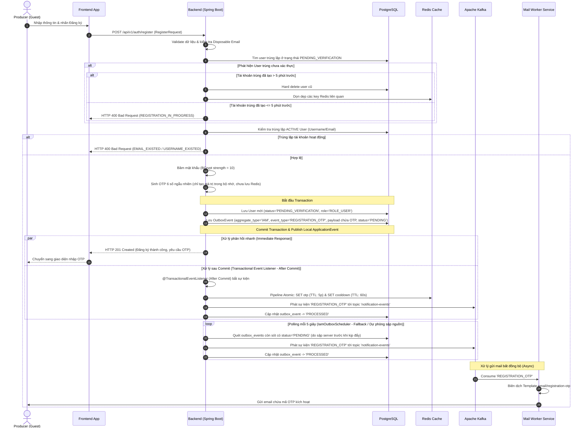
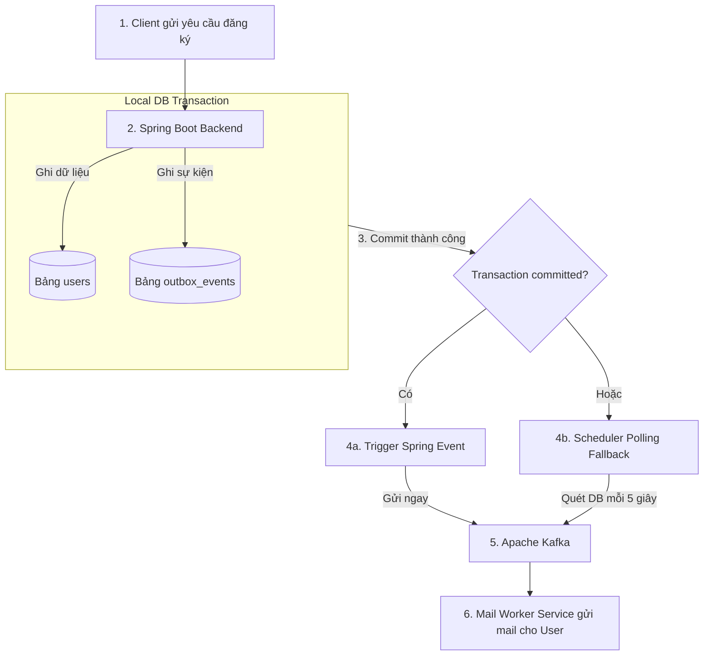
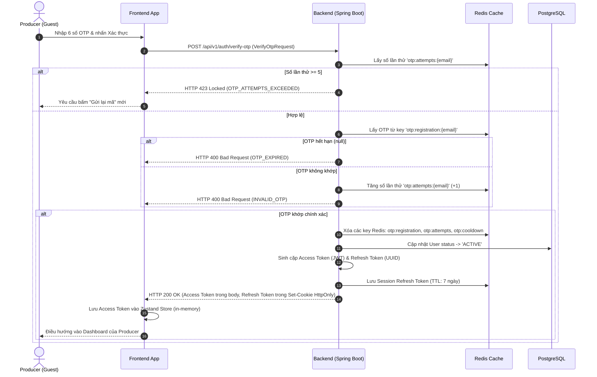
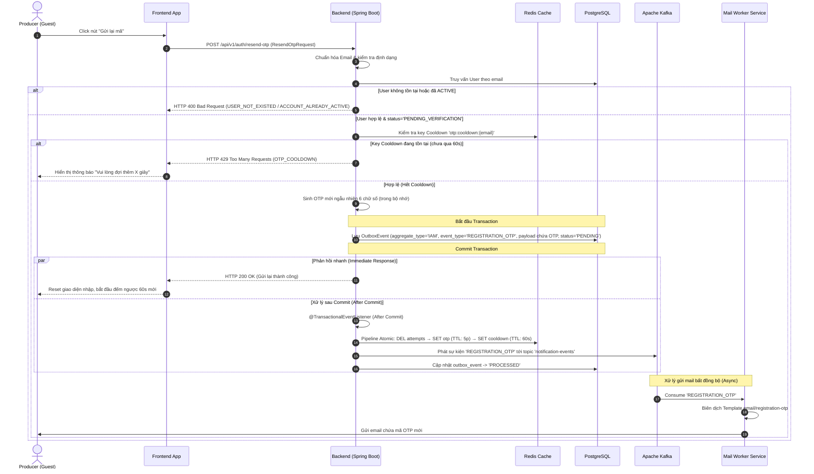
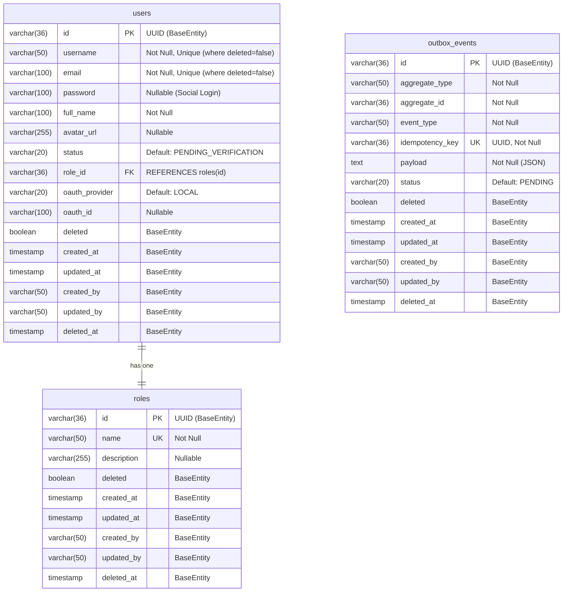
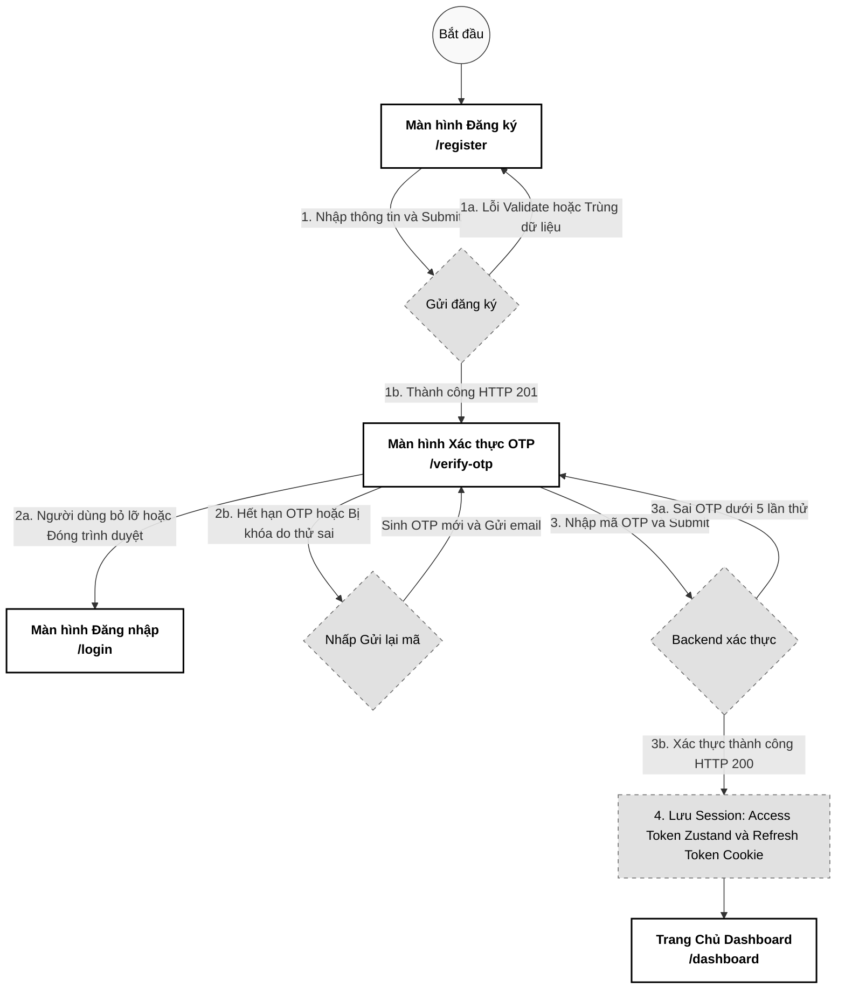

# 1. Đăng ký Tài khoản & Xác thực OTP qua Email (Register & OTP Verification)

Tài liệu này đặc tả chi tiết thiết kế tính năng Đăng ký tài khoản và Xác thực kích hoạt tài khoản thông qua mã OTP gửi qua Email của hệ thống **PWB MiNi**.

---

## 💼 1. Business & Requirements (Nghiệp vụ & Yêu cầu)

### 1.1. Mô tả Nghiệp vụ (User Story / Use Case)
*   **Đối tượng thực hiện**: Khách vãng lai muốn trở thành **Producer** trên hệ thống PWB MiNi để có quyền khởi tạo Live Room hoặc quản lý các bản nhạc demo.
*   **Quy trình tóm tắt**:
    1.  Người dùng điền thông tin đăng ký (Username, Email, Password, Confirm Password, FullName).
    2.  Hệ thống khởi tạo tài khoản ở trạng thái chưa kích hoạt (`PENDING_VERIFICATION`).
    3.  Hệ thống áp dụng **Transactional Outbox Pattern** để đảm bảo ghi nhận sự kiện gửi OTP vào DB đồng thời với User, sau đó gửi tin nhắn bất đồng bộ sang Email của người dùng qua Apache Kafka.
    4.  Người dùng nhận mã OTP (6 chữ số) trong email, nhập mã lên giao diện Frontend để xác thực.
    5.  Xác thực thành công → Tài khoản chuyển sang trạng thái hoạt động (`ACTIVE`), hệ thống tự động đăng nhập và trả về bộ đôi Access Token (JWT) & Refresh Token, điều hướng người dùng vào Dashboard.

---

### 1.2. Quy tắc Nghiệp vụ (Business Rules)
*   **Ràng buộc Duy nhất**: `Username` và `Email` phải là duy nhất trên toàn hệ thống (không trùng lặp với tài khoản khác).
*   **Ngăn chặn Email Rác (Disposable Email Filtering)**: Hệ thống tự động từ chối đăng ký từ các tên miền email tạm thời (ví dụ: `tempmail.com`, `10minutemail.com`, `yopmail.com`, `mailinator.com`...).
*   **Chuẩn hóa dữ liệu**: Email đăng ký tự động được chuẩn hóa về dạng chữ thường (`toLowerCase()`) trước khi lưu trữ hoặc đối khớp.
*   **Xử lý tài khoản chưa xác thực trùng lắp (Clashing Unverified Cleanup)**: 
    *   Nếu một người dùng đăng ký mới với Username/Email đã tồn tại nhưng tài khoản cũ đó vẫn đang ở trạng thái `PENDING_VERIFICATION`:
        *   **Nếu tài khoản cũ được tạo > 5 phút trước** (đã quá TTL của OTP và mã OTP trên Redis đã hết hạn): Hệ thống sẽ tiến hành **Hard Delete (Xóa cứng)** tài khoản cũ và dọn dẹp các key Redis liên quan để người dùng mới có thể đăng ký bình thường, tránh việc tài khoản bị kẹt do quên xác thực.
        *   **Nếu tài khoản cũ được tạo <= 5 phút trước**: Hệ thống sẽ chặn yêu cầu đăng ký mới và ném ra lỗi `REGISTRATION_IN_PROGRESS` (HTTP 400) để ngăn chặn kẻ xấu lợi dụng đăng ký trùng lặp làm công cụ DoS xóa tài khoản của người dùng khác.
*   **Thời gian sống của OTP (TTL)**: Mã OTP chỉ có hiệu lực trong vòng **5 phút**.
*   **Quy tắc chống Spam (Cooldown)**: Thời gian tối thiểu giữa 2 lần yêu cầu gửi lại mã OTP mới là **60 giây**.
*   **Bảo vệ Brute-force (Nhập sai OTP)**:
    *   Người dùng được phép nhập sai tối đa **5 lần**.
    *   Nếu nhập sai quá 5 lần (`attempts >= 5`), hệ thống sẽ **hủy ngay lập tức mã OTP hiện tại trên Redis** và ném lỗi `OTP_ATTEMPTS_EXCEEDED` (HTTP 423/400). Người dùng bắt buộc phải yêu cầu gửi mã mới.
*   **Giới hạn trạng thái đăng nhập**: Tài khoản chưa kích hoạt (`PENDING_VERIFICATION`) không thể thực hiện đăng nhập thông qua API Đăng nhập thông thường.
*   **Dọn dẹp tài khoản chưa kích hoạt định kỳ (Pending User Cleanup)**: Hệ thống chạy một **Scheduled Job** định kỳ mỗi giờ để tự động **Hard Delete** tất cả tài khoản ở trạng thái `PENDING_VERIFICATION` được tạo **quá 24 giờ** trước đó, đồng thời dọn dẹp các key Redis liên quan. Cơ chế này đảm bảo DB không bị tích tụ tài khoản rác do người dùng bỏ dở quá trình đăng ký.

### 1.3. Quy tắc Xác thực Dữ liệu (Validation Rules)

Tất cả dữ liệu đầu vào **bắt buộc phải được xác thực tại cả Frontend (Client-Side) và Backend (Server-Side)**. Backend sử dụng Jakarta Bean Validation annotations để enforce ràng buộc. Client-side validation có thể bị bypass, vì vậy Backend là tuyến phòng thủ chính.

| Trường | Ràng buộc | Annotation (Backend) | Mô tả |
| :--- | :--- | :--- | :--- |
| `username` | Bắt buộc, 3-50 ký tự, chỉ `[a-zA-Z0-9_]` | `@NotBlank`, `@Size(min=3, max=50)`, `@Pattern` | Tên đăng nhập chỉ gồm chữ cái, số và dấu gạch dưới |
| `email` | Bắt buộc, email hợp lệ, tối đa 100 ký tự | `@NotBlank`, `@Email`, `@Size(max=100)` | Email phải đúng định dạng RFC 5322 |
| `password` | Bắt buộc, 8-100 ký tự, ≥1 chữ hoa, ≥1 chữ thường, ≥1 số, ≥1 ký tự đặc biệt | `@NotBlank`, `@Size(min=8, max=100)`, `@Pattern` | Đảm bảo mật khẩu đủ mạnh chống brute-force |
| `confirmPassword` | Bắt buộc, phải trùng khớp với `password` | `@NotBlank`, Custom `@PasswordMatch` | Xác nhận mật khẩu, kiểm tra tại tầng DTO |
| `fullName` | Bắt buộc, 2-100 ký tự | `@NotBlank`, `@Size(min=2, max=100)` | Họ tên đầy đủ của người dùng |

### 1.4. Giới hạn Tần suất Truy cập API (IP Rate Limiting)

Để ngăn chặn tấn công brute-force và spam ở tầng hạ tầng, hệ thống áp dụng giới hạn tần suất truy cập (Rate Limiting) dựa trên **địa chỉ IP** của client, sử dụng Redis + Bucket4j hoặc Spring Cloud Gateway Rate Limiter:

| API Endpoint | Giới hạn | Mô tả |
| :--- | :--- | :--- |
| `POST /api/v1/auth/register` | **5 requests / phút / IP** | Chống spam đăng ký hàng loạt, giảm tải BCrypt hashing & email OTP |
| `POST /api/v1/auth/verify-otp` | **10 requests / phút / IP** | Chống brute-force OTP (bổ sung cho cơ chế `otp:attempts` có sẵn) |
| `POST /api/v1/auth/resend-otp` | **3 requests / phút / IP** | Chống spam gửi lại OTP (bổ sung cho cooldown 60 giây có sẵn) |

Khi client vượt quá giới hạn, hệ thống trả về HTTP `429 Too Many Requests` kèm header `Retry-After` chỉ thời gian chờ (giây).

---

## 🔄 2. User Flow & Sequence Diagram (Luồng người dùng & Sơ đồ tuần tự)

### 2.1. Luồng Giai đoạn 1: Đăng ký & Gửi OTP (Sử dụng Transactional Outbox)
Để tránh hiện tượng **Dual-Write** (ghi dữ liệu vào DB thành công nhưng gửi Kafka thất bại hoặc ngược lại), hệ thống sử dụng bảng `outbox_events` như một hàng đợi tin nhắn bền vững trong DB:



##### 📝 Mô tả chi tiết các bước xử lý (Giai đoạn 1):
1.  **Gửi yêu cầu**: Khách hàng vãng lai điền thông tin đăng ký và nhấn nút "Đăng ký" trên giao diện Frontend App.
2.  **Gọi API**: Frontend gửi một yêu cầu HTTP POST `/api/v1/auth/register` đính kèm payload đăng ký (`RegisterRequest`) tới Backend.
3.  **Kiểm tra dữ liệu**: Backend xác thực định dạng dữ liệu đầu vào và kiểm tra lọc tên miền email tạm thời (Disposable Email).
4.  **Kiểm tra trùng chưa kích hoạt**: Backend truy vấn PostgreSQL để kiểm tra sự tồn tại của Username/Email ở trạng thái chưa kích hoạt (`PENDING_VERIFICATION`).
5.  **Xử lý trùng chưa kích hoạt (Chống DoS)**:
    *   *Trường hợp 5a (Tài khoản cũ tạo > 5 phút)*: OTP cũ đã hết hạn, hệ thống tiến hành xóa cứng (Hard Delete) tài khoản cũ và dọn sạch các key Redis liên quan để giải phóng tài nguyên cho đăng ký mới.
    *   *Trường hợp 5b (Tài khoản cũ tạo <= 5 phút)*: Tài khoản cũ vẫn đang trong thời gian hiệu lực xác thực OTP. Backend chặn đăng ký mới và trả về HTTP 400 kèm lỗi `REGISTRATION_IN_PROGRESS` để chống spam xóa tài khoản người khác.
6.  **Kiểm tra trùng tài khoản đang hoạt động**: Backend truy vấn PostgreSQL kiểm tra trùng lặp với các tài khoản đã kích hoạt (`ACTIVE`).
7.  **Phản hồi lỗi trùng**: Nếu trùng tài khoản `ACTIVE`, Backend lập tức trả về lỗi HTTP 400 Bad Request (`EMAIL_EXISTED` hoặc `USERNAME_EXISTED`) phản hồi cho Frontend hiển thị cảnh báo.
8.  **Mã hóa mật khẩu**: Nếu tất cả thông tin hợp lệ, Backend thực hiện băm mật khẩu người dùng bằng thuật toán bảo mật BCrypt (độ mạnh mặc định là 10).
8b. **Sinh mã OTP**: Backend sinh mã OTP ngẫu nhiên 6 chữ số trong bộ nhớ (in-memory), chưa lưu vào Redis tại thời điểm này.
9.  **Giao dịch Cơ sở dữ liệu (Transaction)**: Backend khởi chạy một Database Transaction cục bộ nhằm đảm bảo tính toàn vẹn:
    *   Lưu thông tin người dùng mới vào bảng `users` với trạng thái `PENDING_VERIFICATION` và gán vai trò là `ROLE_USER`.
    *   Tạo bản ghi sự kiện `OutboxEvent` trạng thái `PENDING` (chứa dữ liệu email, mã OTP vừa sinh và idempotency key là UUID ngẫu nhiên duy nhất) lưu vào bảng `outbox_events`.
10. **Commit Transaction**: Database Transaction được commit thành công, đồng thời Backend phát đi một sự kiện Spring Local Application Event (`OutboxCreatedEvent`).
11. **Xử lý song song sau Commit (AFTER_COMMIT)**:
    *   *Luồng phản hồi nhanh (Immediate Response)*: Backend phản hồi kết quả HTTP 201 Created về cho Frontend để chuyển người dùng sang giao diện nhập OTP.
    *   *Luồng ghi Redis & gửi tin nhắn (AFTER_COMMIT Listener)*: Spring `@TransactionalEventListener` lắng nghe sự kiện. Sau khi DB commit thành công, listener lưu mã OTP vào Redis (key `otp:registration:{email}`, TTL 5 phút) và key cooldown (`otp:cooldown:{email}`, TTL 60 giây) sử dụng Redis Pipeline atomic. Sau đó đẩy thông điệp sự kiện `REGISTRATION_OTP` lên Apache Kafka topic `notification-events` và cập nhật trạng thái outbox trong DB sang `PROCESSED` ngay khi Kafka xác nhận đã nhận tin.
12. **Scheduler quét dự phòng (Fallback)**: Một polling scheduler định kỳ mỗi 5 giây quét bảng `outbox_events` tìm các dòng trạng thái `PENDING` còn sót (do lỗi sập server đột ngột trước khi listener kịp gửi) để thực hiện lưu OTP vào Redis (nếu chưa có) và gửi lại sang Kafka rồi đánh dấu `PROCESSED`.
13. **Xử lý gửi Email**: Apache Kafka phân phối tin nhắn đến dịch vụ gửi email (Mail Worker Service). Worker consume tin nhắn, biên dịch giao diện email và gửi mail chứa mã OTP kích hoạt đến hòm thư người dùng.

#### 💡 Kiến thức nền tảng: Transactional Outbox Pattern là gì?

**Transactional Outbox Pattern** là một mẫu thiết kế (Design Pattern) quan trọng trong kiến trúc hướng sự kiện (Event-Driven Architecture) nhằm đảm bảo tính **nhất quán dữ liệu tuyệt đối (Data Consistency)** giữa Cơ sở dữ liệu quan hệ (PostgreSQL) và Hệ thống hàng đợi tin nhắn (Apache Kafka).

##### 1. Tại sao phải dùng nó? (Giải quyết bài toán "Dual-Write")
Khi người dùng nhấn đăng ký, hệ thống phải thực hiện đồng thời hai hành động ghi dữ liệu vào hai hệ thống độc lập: lưu thông tin tài khoản vào PostgreSQL và phát tin nhắn gửi mail OTP vào Kafka. Nếu triển khai theo cách thông thường (Dual-Write), ta sẽ gặp phải các rủi ro:
*   **Kịch bản lỗi 1 (DB thành công, Kafka thất bại)**: User được lưu vào DB thành công, nhưng do sự cố mạng hoặc Kafka bị nghẽn, tin nhắn OTP không được gửi đi. Kết quả là tài khoản đã tạo nhưng người dùng không bao giờ nhận được mail kích hoạt.
*   **Kịch bản lỗi 2 (Kafka thành công, DB thất bại)**: Hệ thống đẩy tin nhắn gửi mail đi trước, sau đó commit DB nhưng gặp lỗi (ví dụ: trùng tên tài khoản) nên DB bị rollback. Kết quả là người dùng vẫn nhận được mail OTP, nhưng khi nhập mã xác thực thì Backend báo lỗi vì tài khoản không tồn tại.

Sử dụng Giao dịch phân tán (Distributed Transaction - 2PC) sẽ làm giảm hiệu năng hệ thống nghiêm trọng và Kafka không hỗ trợ giao dịch phân tán tích hợp hoàn toàn với PostgreSQL. Transactional Outbox Pattern giải quyết triệt để vấn đề này bằng cách đưa hành động gửi tin nhắn sang Kafka thành **một câu lệnh INSERT vào bảng outbox cục bộ** trong cùng một Database Transaction.

##### 2. Sơ đồ Luồng hoạt động của Outbox Pattern



##### 3. Quy trình Triển khai chi tiết

###### **Bước 1: Lưu trữ sự kiện vào bảng outbox cục bộ**
Trong phương thức đăng ký tài khoản (được đánh dấu `@Transactional`), Backend thực hiện các bước sau trong cùng một database transaction:
1.  Xác thực dữ liệu đầu vào và kiểm tra trùng lặp tài khoản.
2.  Lưu thông tin người dùng mới vào bảng `users` ở trạng thái `PENDING_VERIFICATION`.
3.  Sinh mã OTP ngẫu nhiên 6 chữ số trong bộ nhớ (in-memory), chưa ghi vào Redis tại thời điểm này.
4.  Tạo một bản ghi sự kiện `OutboxEvent` mới ở trạng thái `PENDING` (chứa các thông tin: ID ngẫu nhiên, aggregate type là `IAM`, aggregate ID là user ID, event type là `REGISTRATION_OTP`, idempotency key là UUID ngẫu nhiên duy nhất, và payload dạng JSON chứa email cùng mã OTP vừa sinh) và lưu vào bảng `outbox_events`.
5.  Phát một sự kiện Spring Local Application Event (ví dụ: `OutboxCreatedEvent`) để thông báo cho listener xử lý sau khi transaction commit thành công.

###### **Bước 2: Phát tin nhắn sang Kafka (Event Publisher)**
Hệ thống sử dụng cơ chế kết hợp song song để tối ưu tốc độ phản hồi và đảm bảo an toàn tuyệt đối trước mọi sự cố sập nguồn:

1.  **Gửi tức thời (Transactional Event Listener - AFTER_COMMIT)**:
    *   **Cơ chế**: Một Event Listener trong Spring Boot lắng nghe sự kiện `OutboxCreatedEvent`. Listener này được cấu hình với `@TransactionalEventListener(phase = TransactionPhase.AFTER_COMMIT)`, nghĩa là nó chỉ thực thi sau khi transaction của DB đã commit hoàn tất thành công.
    *   **Hành động**: Lưu mã OTP vào Redis (key `otp:registration:{email}`, TTL 5 phút) và key cooldown (`otp:cooldown:{email}`, TTL 60 giây) sử dụng Redis Pipeline atomic. Sau đó đẩy ngay lập tức payload sự kiện từ bảng outbox sang Kafka topic `notification-events`. Khi Kafka xác nhận đã nhận thành công (Ack), hệ thống cập nhật trạng thái sự kiện trong bảng `outbox_events` thành `PROCESSED`.
    *   **Ưu điểm**: Người dùng nhận được email kích hoạt ngay lập tức sau khi nhấn đăng ký. Việc ghi Redis chỉ sau khi DB commit đảm bảo tính nhất quán dữ liệu tuyệt đối — không bao giờ xảy ra trường hợp OTP tồn tại trên Redis nhưng User chưa được tạo trong DB.

2.  **Quét dự phòng (Polling Scheduler - Fallback)**:
    *   **Cơ chế**: Một bộ lập lịch (Scheduler) chạy ngầm định kỳ mỗi **5 giây** (sử dụng `@Scheduled`).
    *   **Hành động**: Tìm kiếm và quét các bản ghi sự kiện trong bảng `outbox_events` có trạng thái là `PENDING` (thường là những sự kiện bị sót lại do server bị mất nguồn đột ngột ở bước listener). Scheduler sẽ kiểm tra và ghi OTP vào Redis (nếu chưa tồn tại), sau đó đẩy các sự kiện sang Kafka topic `notification-events` và cập nhật trạng thái thành `PROCESSED` sau khi gửi thành công.
    *   **Ưu điểm**: Đảm bảo sự kiện chắc chắn sẽ được gửi đi tối thiểu một lần (At-Least-Once Delivery), không sợ sập server hay mất mát dữ liệu.
    *   **Xử lý trùng lặp (Idempotency)**: Mỗi OutboxEvent được gắn một `idempotency_key` (UUID duy nhất). Kafka consumer (Mail Worker Service) sử dụng key này để kiểm tra sự kiện đã được xử lý hay chưa trước khi gửi email, đảm bảo mỗi email OTP chỉ được gửi đúng **1 lần** dù sự kiện có bị phát lại (do scheduler hoặc retry).

---

### 2.2. Luồng Giai đoạn 2: Xác thực kích hoạt tài khoản
Sau khi nhận được OTP qua email, người dùng tiến hành xác thực trên ứng dụng:



##### 📝 Mô tả chi tiết các bước xử lý (Giai đoạn 2):
1.  **Nhập OTP**: Người dùng điền 6 chữ số OTP nhận được từ email và nhấn nút "Xác thực" trên giao diện.
2.  **Gọi API**: Frontend gửi một yêu cầu HTTP POST `/api/v1/auth/verify-otp` đính kèm payload (`VerifyOtpRequest` chứa email và mã `otpCode`) lên Backend.
3.  **Kiểm tra số lần nhập sai**: Backend truy cập Redis để đọc số lần nhập sai tích lũy từ key `otp:attempts:{email}`.
4.  **Chặn do nhập sai quá nhiều**: Nếu số lần nhập sai trước đó `>= 5`, Backend chặn xử lý tiếp và lập tức trả về mã lỗi HTTP 423 Locked (`OTP_ATTEMPTS_EXCEEDED`). Frontend hiển thị thông báo yêu cầu người dùng phải bấm "Gửi lại mã" mới.
5.  **Lấy mã OTP**: Nếu số lần thử hợp lệ (< 5), Backend truy xuất mã OTP lưu trữ từ Redis key `otp:registration:{email}`.
6.  **Xử lý OTP hết hạn**: Nếu không tìm thấy OTP trong Redis (đã hết hạn 5 phút và tự động hủy), Backend trả về lỗi HTTP 400 Bad Request (`OTP_EXPIRED`).
7.  **Xử lý OTP không khớp**: Nếu mã OTP người dùng gửi lên không trùng khớp với mã trong Redis, Backend thực hiện:
    *   Tăng số lần nhập sai `otp:attempts:{email}` trong Redis lên 1 đơn vị.
    *   Trả về lỗi HTTP 400 Bad Request (`INVALID_OTP`) để người dùng nhập lại.
8.  **Xác thực thành công**: Nếu mã OTP trùng khớp chính xác:
    *   Backend xóa sạch toàn bộ các key liên quan đến OTP của email này trên Redis (`otp:registration`, `otp:attempts`, `otp:cooldown`) để dọn dẹp bộ nhớ và bảo mật.
    *   Cập nhật trường trạng thái `status` của User trong PostgreSQL từ `PENDING_VERIFICATION` sang `ACTIVE`.
    *   Backend sinh cặp Token xác thực: Access Token (định dạng JWT, TTL ngắn 15 phút) và Refresh Token (định dạng UUID, TTL dài 7 ngày).
    *   Lưu Refresh Token vào Redis key `session:refresh_token:{token}` để quản lý phiên hoạt động. Đồng thời Backend đặt Refresh Token vào **HttpOnly Cookie** bảo mật (`Secure`, `SameSite=Strict`) trong HTTP response.
    *   Backend phản hồi HTTP 200 OK chứa Access Token trong response body (Frontend lưu vào Zustand Store in-memory). Refresh Token được truyền qua Set-Cookie header, không xuất hiện trong JSON body.
9.  **Lưu phiên & Điều hướng**: Frontend nhận Access Token từ response body, lưu vào Zustand Store (in-memory). Refresh Token được trình duyệt tự động quản lý qua HttpOnly Cookie. Sau đó Frontend tự động điều hướng người dùng thẳng tiến vào giao diện Dashboard chính thức của Producer.

---

### 2.3. Luồng Giai đoạn 3: Gửi lại mã OTP (Resend OTP)
Khi người dùng yêu cầu gửi lại OTP (do quá thời gian hoặc email thất lạc), quy trình sau sẽ diễn ra:



##### 📝 Mô tả chi tiết các bước xử lý (Giai đoạn 3):
1.  **Nhấp nút Gửi lại**: Người dùng click nút "Gửi lại mã" trên giao diện khi đếm ngược 60s cooldown kết thúc.
2.  **Gọi API**: Frontend gửi một yêu cầu HTTP POST `/api/v1/auth/resend-otp` kèm email lên Backend.
3.  **Kiểm tra người dùng**: Backend thực hiện chuẩn hóa email, kiểm tra định dạng và truy vấn PostgreSQL để kiểm tra sự tồn tại của tài khoản.
4.  **Từ chối nếu không hợp lệ**: Nếu tài khoản không tồn tại trong hệ thống hoặc tài khoản đã ở trạng thái hoạt động (`ACTIVE`), Backend chặn xử lý và trả về lỗi HTTP 400 Bad Request (`USER_NOT_EXISTED` hoặc `ACCOUNT_ALREADY_ACTIVE`).
5.  **Kiểm tra Cooldown**: Nếu tài khoản hợp lệ ở trạng thái `PENDING_VERIFICATION`, Backend kiểm tra sự tồn tại của key cooldown `otp:cooldown:{email}` trên Redis.
6.  **Chặn do Spam**: Nếu key cooldown vẫn còn hạn (người dùng cố tình spam gọi API trực tiếp khi chưa qua 60 giây), Backend trả về lỗi HTTP 429 Too Many Requests (`OTP_COOLDOWN`). Frontend hiển thị cảnh báo yêu cầu người dùng chờ thêm.
7.  **Sinh OTP mới**: Backend sinh mã OTP mới ngẫu nhiên 6 chữ số trong bộ nhớ (in-memory), chưa ghi vào Redis tại thời điểm này.
8.  **Giao dịch Database (Transaction)**: Backend khởi chạy một Database Transaction để tạo và lưu bản ghi sự kiện gửi OTP (`OutboxEvent`) ở trạng thái `PENDING` (payload chứa OTP mới và idempotency key) vào bảng `outbox_events`.
9. **Commit Transaction**: Commit Transaction thành công và phát đi sự kiện Spring Local Event.
10. **Xử lý song song sau Commit (AFTER_COMMIT)**:
    *   *Luồng phản hồi nhanh*: Backend trả về kết quả HTTP 200 OK báo gửi lại mã thành công. Frontend nhận kết quả, reset lại các ô nhập OTP và kích hoạt đồng hồ đếm ngược 60 giây mới.
    *   *Luồng ghi Redis & gửi tin nhắn (AFTER_COMMIT Listener)*: Spring `@TransactionalEventListener` bắt sự kiện, sử dụng Redis Pipeline Atomic để xóa bộ đếm nhập sai cũ (`DEL otp:attempts:{email}`), lưu OTP mới (`SET otp:registration:{email}`, TTL 5 phút), và thiết lập cooldown mới (`SET otp:cooldown:{email}`, TTL 60 giây). Sau đó đẩy thông điệp sự kiện `REGISTRATION_OTP` lên Apache Kafka topic `notification-events` rồi cập nhật outbox DB sang `PROCESSED`.
11. **Xử lý gửi Email**: Apache Kafka phân phối tin nhắn đến dịch vụ gửi email (Mail Worker Service). Worker consume tin nhắn, biên dịch template và gửi email chứa mã OTP mới đến hòm thư người dùng.

---


## 💾 3. Database & Cache Schema (Thiết kế Cơ sở Dữ liệu)

### 3.1. Sơ đồ Quan hệ PostgreSQL (ERD) & Đề xuất Nâng cấp

Để tối ưu hóa hiệu năng, tính bảo mật và tính mở rộng của mã nguồn, dự án PWB MiNi áp dụng các nâng cấp kiến trúc sau:
1.  **Phân quyền dựa trên 3 Role chính**: 
    *   `ROLE_USER`: Mặc định gán cho mọi tài khoản mới đăng ký thành công (Shopper/Listener).
    *   `ROLE_USER_PRO`: Phiên bản nâng cấp (Producer) sau khi mua gói dịch vụ, mở khóa tính năng tạo phòng ảo Live Room, upload nhạc demo và chèn Voice Tag.
    *   `ROLE_ADMIN`: Quyền quản trị viên tối cao để kiểm soát và điều phối dữ liệu hệ thống.
2.  **Kế thừa BaseEntity**: Tất cả các thực thể JPA (`User`, `Role`, `OutboxEvent`) đều kế thừa từ lớp cha trừu tượng `BaseEntity`. Trong DB, các bảng tương ứng sẽ ánh xạ chính xác các trường kiểm toán (Audit fields) của `BaseEntity`:
    *   `id` (VARCHAR(36) UUID làm khóa chính)
    *   `created_at` (TIMESTAMP WITH TIME ZONE)
    *   `updated_at` (TIMESTAMP WITH TIME ZONE)
    *   `created_by` (VARCHAR(50))
    *   `updated_by` (VARCHAR(50))
    *   `deleted` (BOOLEAN mặc định false)
    *   `deleted_at` (TIMESTAMP WITH TIME ZONE)
3.  **Mối quan hệ Role - User (Many-to-One)**: Thay thế bảng trung gian `user_roles` bằng trường `role_id` trực tiếp trong bảng `users` nhằm tối ưu hóa các câu truy vấn JOIN (do một tài khoản chỉ sở hữu một vai trò duy nhất trong hệ thống).
4.  **Tích hợp Bảng Outbox**: Bổ sung bảng `outbox_events` (kế thừa từ `BaseEntity`) để phục vụ luồng gửi tin nhắn an toàn Transactional Outbox.



#### DDL chi tiết (PostgreSQL):
```sql
-- 1. Bảng Roles (Chứa ROLE_USER, ROLE_USER_PRO, ROLE_ADMIN...)
CREATE TABLE roles (
    id VARCHAR(36) PRIMARY KEY,
    name VARCHAR(50) UNIQUE NOT NULL,
    description VARCHAR(255),
    created_at TIMESTAMP WITH TIME ZONE DEFAULT CURRENT_TIMESTAMP,
    updated_at TIMESTAMP WITH TIME ZONE DEFAULT CURRENT_TIMESTAMP,
    created_by VARCHAR(50) DEFAULT 'system',
    updated_by VARCHAR(50) DEFAULT 'system',
    deleted BOOLEAN DEFAULT FALSE NOT NULL,
    deleted_at TIMESTAMP WITH TIME ZONE
);

-- 2. Bảng Users (Many-to-One với Roles)
CREATE TABLE users (
    id VARCHAR(36) PRIMARY KEY,
    username VARCHAR(50) NOT NULL,
    email VARCHAR(100) NOT NULL,
    password VARCHAR(100),
    full_name VARCHAR(100) NOT NULL,
    avatar_url VARCHAR(255),
    status VARCHAR(20) NOT NULL DEFAULT 'PENDING_VERIFICATION',
    role_id VARCHAR(36) NOT NULL CONSTRAINT fk_users_role_id REFERENCES roles(id),
    oauth_provider VARCHAR(20) NOT NULL DEFAULT 'LOCAL',
    oauth_id VARCHAR(100),
    deleted BOOLEAN NOT NULL DEFAULT FALSE,
    created_at TIMESTAMP WITH TIME ZONE DEFAULT CURRENT_TIMESTAMP,
    updated_at TIMESTAMP WITH TIME ZONE DEFAULT CURRENT_TIMESTAMP,
    created_by VARCHAR(50) DEFAULT 'system',
    updated_by VARCHAR(50) DEFAULT 'system',
    deleted_at TIMESTAMP WITH TIME ZONE
);
CREATE UNIQUE INDEX idx_users_username_active ON users(username) WHERE deleted = FALSE;
CREATE UNIQUE INDEX idx_users_email_active ON users(email) WHERE deleted = FALSE;
CREATE UNIQUE INDEX idx_users_oauth ON users(oauth_provider, oauth_id) WHERE deleted = FALSE;
CREATE INDEX idx_users_pending_cleanup ON users(status, created_at) WHERE status = 'PENDING_VERIFICATION';

-- 3. Bảng Outbox Events (Bảo đảm tính toàn vẹn sự kiện bất đồng bộ)
CREATE TABLE outbox_events (
    id VARCHAR(36) PRIMARY KEY,
    aggregate_type VARCHAR(50) NOT NULL,
    aggregate_id VARCHAR(36) NOT NULL,
    event_type VARCHAR(50) NOT NULL,
    idempotency_key VARCHAR(36) UNIQUE NOT NULL,
    payload TEXT NOT NULL,
    status VARCHAR(20) DEFAULT 'PENDING' NOT NULL,
    created_at TIMESTAMP WITH TIME ZONE DEFAULT CURRENT_TIMESTAMP NOT NULL,
    updated_at TIMESTAMP WITH TIME ZONE DEFAULT CURRENT_TIMESTAMP NOT NULL,
    created_by VARCHAR(50),
    updated_by VARCHAR(50),
    deleted BOOLEAN DEFAULT FALSE NOT NULL,
    deleted_at TIMESTAMP WITH TIME ZONE
);
CREATE INDEX idx_outbox_pending ON outbox_events(status, created_at);
```

---

### 3.2. Cấu trúc dữ liệu Redis (Cache & Limits)

| Định dạng Khóa (Redis Key) | Kiểu dữ liệu | Giá trị (Value) | TTL | Mục đích sử dụng |
| :--- | :--- | :--- | :--- | :--- |
| `otp:registration:{email}` | `String` | `6-digit OTP code` (ví dụ: `481920`) | **5 phút** | Đối khớp xác thực OTP kích hoạt. |
| `otp:cooldown:{email}` | `String` | `"true"` | **60 giây** | Giới hạn tần suất bấm gửi lại OTP. |
| `otp:attempts:{email}` | `String` | `Counter (1, 2...)` | **5 phút** | Đếm số lần nhập sai để khóa OTP. |
| `session:refresh_token:{token}` | `String` | `username/email` | **7 ngày** | Quản lý phiên hoạt động (JWT Refresh). |

> **⚡ Lưu ý Kỹ thuật: Atomic Redis Operations**
>
> Khi thực hiện các thao tác Redis liên quan đến OTP (xóa attempts, ghi OTP mới, đặt cooldown), hệ thống **BẮT BUỘC** sử dụng **Redis Pipeline** hoặc **Redis Transaction (`MULTI/EXEC`)** để đảm bảo tính nguyên tử (atomicity). Điều này ngăn chặn trạng thái trung gian không nhất quán nếu một thao tác Redis thất bại giữa chừng.

---

## 🔌 4. API Specifications (Đặc tả API)

### 4.1. Cấu hình Chung
*   **Base Path**: `/api/v1/auth`
*   **Headers**: `Content-Type: application/json`
*   **Format Phản Hồi**: Hệ thống đồng nhất sử dụng cấu trúc `ApiResponse<T>` chuẩn hóa theo quy ước dự án:
    *   **Thành công**: Trả về Http Code thích hợp cùng JSON body chứa `success: true`, `message`, `data` (payload kết quả), `errors: null` và `timestamp` (ISO 8601).
    *   **Thất bại**: Trả về Http Code lỗi, JSON body chứa `success: false`, `message`, `data: null`, `errors` (mảng chi tiết lỗi với `code`, `field`, `message`) và `timestamp`.

---

### 4.2. API Đăng ký tài khoản (Register)
*   **Method**: `POST`
*   **Path**: `/api/v1/auth/register`
*   **Auth Level**: `PermitAll`

#### Request Payload (`RegisterRequest`):
```json
{
  "username": "hoangnam511",
  "email": "producer@example.com",
  "password": "StrongPassword123!",
  "confirmPassword": "StrongPassword123!",
  "fullName": "Nguyễn Đức Hoàng Nam"
}
```

#### Response Thành công (201 Created):
```json
{
  "success": true,
  "message": "Đăng ký thành công, vui lòng kiểm tra email để lấy mã OTP xác thực",
  "data": {
    "username": "hoangnam511",
    "email": "producer@example.com",
    "fullName": "Nguyễn Đức Hoàng Nam",
    "status": "PENDING_VERIFICATION"
  },
  "errors": null,
  "timestamp": "2026-07-01T09:51:00Z"
}
```

#### Response Lỗi Trùng Lặp (400 Bad Request):
```json
{
  "success": false,
  "message": "Email đã được sử dụng",
  "data": null,
  "errors": [
    {
      "code": "EMAIL_EXISTED",
      "field": "email",
      "message": "Email đã được sử dụng bởi tài khoản khác"
    }
  ],
  "timestamp": "2026-07-01T09:51:00Z"
}
```

---

### 4.3. API Xác thực OTP (Verify OTP)
*   **Method**: `POST`
*   **Path**: `/api/v1/auth/verify-otp`
*   **Auth Level**: `PermitAll`

#### Request Payload (`VerifyOtpRequest`):
```json
{
  "email": "producer@example.com",
  "otpCode": "123456"
}
```

#### Response Thành công (200 OK):
```json
{
  "success": true,
  "message": "Xác thực tài khoản thành công",
  "data": {
    "accessToken": "eyJhbGciOiJIUzI1NiIsInR5cCI6IkpXVCJ9...",
    "expiresIn": 900,
    "user": {
      "username": "hoangnam511",
      "email": "producer@example.com",
      "fullName": "Nguyễn Đức Hoàng Nam",
      "status": "ACTIVE"
    }
  },
  "errors": null,
  "timestamp": "2026-07-01T09:56:00Z"
}
```

> **📌 Lưu ý:** Refresh Token không xuất hiện trong JSON response body. Backend tự động đặt Refresh Token vào **HttpOnly Cookie** (`Secure`, `SameSite=Strict`) thông qua `Set-Cookie` header trong HTTP response.

#### Response Lỗi Nhập sai quá nhiều (423 Locked):
```json
{
  "success": false,
  "message": "Nhập sai mã OTP quá nhiều lần. Mã đã bị vô hiệu hóa, vui lòng yêu cầu mã mới",
  "data": null,
  "errors": [
    {
      "code": "OTP_ATTEMPTS_EXCEEDED",
      "field": null,
      "message": "Bạn đã nhập sai mã OTP quá 5 lần, vui lòng yêu cầu gửi mã mới"
    }
  ],
  "timestamp": "2026-07-01T09:56:00Z"
}
```

---

### 4.4. API Gửi lại mã OTP (Resend OTP)
*   **Method**: `POST`
*   **Path**: `/api/v1/auth/resend-otp`
*   **Auth Level**: `PermitAll`

#### Request Payload (`ResendOtpRequest`):
```json
{
  "email": "producer@example.com"
}
```

#### Response Thành công (200 OK):
```json
{
  "success": true,
  "message": "Mã OTP mới đã được gửi thành công, vui lòng kiểm tra hòm thư của bạn",
  "data": null,
  "errors": null,
  "timestamp": "2026-07-01T09:57:00Z"
}
```

#### Response Lỗi Đang trong thời gian chờ (429 Too Many Requests):
```json
{
  "success": false,
  "message": "Vui lòng chờ 60 giây trước khi yêu cầu mã OTP mới",
  "data": null,
  "errors": [
    {
      "code": "OTP_COOLDOWN",
      "field": null,
      "message": "Vui lòng chờ 60 giây trước khi yêu cầu mã OTP mới"
    }
  ],
  "timestamp": "2026-07-01T09:57:00Z"
}
```

---

### 4.5. API Kiểm tra Username khả dụng (Check Username Availability)
*   **Method**: `GET`
*   **Path**: `/api/v1/auth/check-username`
*   **Auth Level**: `PermitAll`
*   **Query Params**: `q` (tên đăng nhập cần kiểm tra)

#### Response Thành công (200 OK):
```json
{
  "success": true,
  "message": "Username khả dụng",
  "data": {
    "username": "hoangnam511",
    "available": true
  },
  "errors": null,
  "timestamp": "2026-07-01T09:50:00Z"
}
```

---

### 4.6. Phụ lục Mã Lỗi Nghiệp Vụ (Error Codes)

Mỗi lỗi nghiệp vụ được định nghĩa trong `ErrorCode` Enum với HTTP Status tương ứng. Giá trị `code` trong mảng `errors` của API response sử dụng **tên lỗi dạng chuỗi** (UPPER_SNAKE_CASE):

| Http Status | Error Code (String) | Mô tả | Trường liên quan (`field`) |
| :--- | :--- | :--- | :--- |
| `400 Bad Request` | `VALIDATION_FAILED` | Dữ liệu đầu vào không hợp lệ | Tên trường bị lỗi |
| `404 Not Found` | `USER_NOT_EXISTED` | Tài khoản không tồn tại | `email` |
| `400 Bad Request` | `USERNAME_EXISTED` | Tên đăng nhập đã được sử dụng | `username` |
| `400 Bad Request` | `EMAIL_EXISTED` | Email đã được sử dụng | `email` |
| `400 Bad Request` | `OTP_EXPIRED` | Mã OTP đã hết hạn, vui lòng yêu cầu mã mới | `otpCode` |
| `400 Bad Request` | `INVALID_OTP` | Mã OTP không đúng | `otpCode` |
| `429 Too Many Requests` | `OTP_COOLDOWN` | Vui lòng chờ 60 giây trước khi yêu cầu mã OTP mới | `null` |
| `423 Locked` | `OTP_ATTEMPTS_EXCEEDED` | Nhập sai mã OTP quá nhiều lần, mã đã bị vô hiệu hóa | `null` |
| `400 Bad Request` | `DISPOSABLE_EMAIL_NOT_ALLOWED` | Email tạm thời không được phép đăng ký | `email` |
| `400 Bad Request` | `REGISTRATION_IN_PROGRESS` | Tài khoản đang trong quá trình đăng ký xác thực | `email` |
| `400 Bad Request` | `ACCOUNT_ALREADY_ACTIVE` | Tài khoản đã được kích hoạt thành công trước đó | `email` |
| `429 Too Many Requests` | `RATE_LIMIT_EXCEEDED` | Vượt quá giới hạn tần suất truy cập API | `null` |

---

## 🎨 5. UI/UX & Frontend Integration Notes (Giao diện & Tích hợp)

### 5.1. Thiết kế Giao diện & Trải nghiệm (UI/UX)
*   **Cơ chế Nhập OTP (6-Digit inputs) mượt mà**:
    *   **Tự động chuyển tiêu điểm (Auto-focus)**: Cung cấp 6 ô nhập số độc lập. Khi người dùng nhập một chữ số, tiêu điểm lập tức tự động nhảy sang ô tiếp theo (`auto-focus`).
    *   **Xử lý xóa ngược (Backspace navigation)**: Hỗ trợ phím `Backspace` để xóa số hiện tại và tự động chuyển tiêu điểm về ô liền trước nếu ô hiện tại rỗng.
    *   **Hỗ trợ dán dữ liệu (Clipboard Paste)**: Hỗ trợ sự kiện dán (`onPaste`) chuỗi 6 số từ Clipboard, tự động phân tích và điền lần lượt vào cả 6 ô đầu vào.
    *   **Thuộc tính Accessibility (A11y)**: Mỗi ô nhập số phải có thuộc tính `aria-label` mô tả vị trí (ví dụ: `aria-label="Mã OTP ký tự 1"`), chỉ chấp nhận ký tự số (`inputmode="numeric"`, `pattern="[0-9]*"`).
*   **Đếm ngược & Quản lý trạng thái Gửi lại mã**:
    *   **Bộ đếm thời gian thực (Countdown Timer)**: Khi chuyển sang màn hình OTP, bộ đếm ngược 60 giây kích hoạt. Nút "Gửi lại mã" bị vô hiệu hóa (`disabled`) kèm theo hiển thị đếm ngược: `Gửi lại mã sau (59s)`.
    *   **Trạng thái kích hoạt**: Khi đếm ngược kết thúc (`countdown = 0`), nút gửi lại chuyển sang trạng thái sẵn sàng nhấp và tự động tập trung tiêu điểm.
    *   **Che dấu thông tin riêng tư (Email Masking)**: Hiển thị email nhận mã dưới dạng đã che một phần (ví dụ: `n*******@gmail.com`) để bảo mật quyền riêng tư của người dùng trên giao diện.
*   **Hỗ trợ người dùng & Trực quan hóa**:
    *   **Ẩn/Hiện mật khẩu**: Bố trí nút icon (Mắt nhắm/Mắt mở) ở trường mật khẩu và trường xác nhận mật khẩu để người dùng dễ dàng kiểm tra tránh nhập sai.
    *   **Xác nhận mật khẩu (Confirm Password)**: Thêm trường nhập **Confirm Password** ngay dưới trường Password. Frontend kiểm tra real-time sự trùng khớp giữa 2 trường và hiển thị icon ✅ (khớp) hoặc ❌ (không khớp) kèm thông báo lỗi inline nếu không trùng.
    *   **Đánh giá Độ mạnh Mật khẩu (Password Strength Indicator)**: Hiển thị thanh đánh giá độ mạnh mật khẩu real-time ngay dưới trường Password với 4 cấp độ: **Yếu** (đỏ) → **Trung bình** (cam) → **Mạnh** (xanh lá) → **Rất mạnh** (xanh đậm). Sử dụng thư viện `zxcvbn` để phân tích đa chiều (dictionary, patterns, sequences) thay vì chỉ kiểm tra regex đơn giản.
    *   **Kiểm tra Username khả dụng Real-time**: Khi người dùng ngừng nhập username (debounce 500ms), Frontend tự động gửi request `GET /api/v1/auth/check-username?q={username}` để kiểm tra tên đăng nhập có khả dụng hay không, hiển thị icon ✅ (khả dụng) hoặc ❌ (đã tồn tại) ngay cạnh ô nhập.
    *   **Thông báo lỗi trực quan (Validation Errors)**: Hiển thị thông báo lỗi ngay dưới mỗi ô nhập (Inline Error Message) kèm theo thay đổi màu viền (Border-red) để chỉ rõ trường dữ liệu bị lỗi.

---

### 5.2. Tối ưu hóa Hiệu năng & Trải nghiệm Lập trình viên (Performance & DevEx)
*   **Chống gửi yêu cầu trùng lặp (Double Submit Prevention)**:
    *   **Trạng thái Loading**: Khi người dùng nhấn "Đăng ký" hoặc "Xác thực", nút Submit lập tức bị vô hiệu hóa (`disabled`) và hiển thị Spinner xoay để ngăn người dùng click liên tục gửi các request trùng lặp (Debounce/Throttle).
*   **Xác thực tại Client (Client-Side Validation)**:
    *   Sử dụng thư viện xác thực nhẹ (Zod — khuyến nghị cho TypeScript) để kiểm tra định dạng email hợp lệ, độ dài mật khẩu tối thiểu (8 ký tự, có chữ hoa, chữ thường, số và ký tự đặc biệt), trùng khớp confirm password, và định dạng username trước khi gọi API.
    *   Nút "Đăng ký" chỉ kích hoạt khi form không còn lỗi validate ở client, giúp giảm 90% các request lỗi gửi lên máy chủ, tiết kiệm tài nguyên mạng.
*   **Xử lý Ngoại lệ mạng (Network Offline Resilience)**:
    *   Frontend sử dụng bộ theo dõi trạng thái mạng (`window.navigator.onLine`).
    *   Nếu người dùng mất kết nối, hệ thống sẽ hiển thị một Toast cảnh báo "Mất kết nối mạng, vui lòng kiểm tra lại!" và chặn gửi request, tránh để ứng dụng bị treo do API timeout.

---

### 5.3. Quản lý trạng thái Token ở Client (Cơ chế HttpOnly Cookie Bảo mật)

Hệ thống PWB MiNi áp dụng cơ chế quản lý token bảo mật cao, kết hợp giữa lưu trữ bộ nhớ tạm (In-Memory) và Cookie bảo mật chống tấn công XSS (Cross-Site Scripting):

*   **Cơ chế lưu trữ**:
    *   **Refresh Token (UUID)**: Sau khi xác thực OTP thành công, Backend sẽ tự động lưu Refresh Token vào một Cookie bảo mật của trình duyệt với các thuộc tính: `HttpOnly` (ngăn Javascript đọc token), `Secure` (chỉ truyền tải qua HTTPS), và `SameSite=Strict` (chống tấn công CSRF).
    *   **Access Token (JWT)**: Được trả về trong response body của API và lưu trực tiếp trong bộ nhớ tạm của Frontend thông qua **Zustand Store** (in-memory state). Access Token có thời gian sống ngắn (ví dụ: 15 phút) để giảm thiểu rủi ro nếu bị lộ.
*   **Luồng tự động gia hạn (Silent Refresh)**:
    *   Frontend thiết lập một **Axios Interceptor** (hoặc Fetch middleware) để giám sát các HTTP requests.
    *   Nếu một API nghiệp vụ trả về mã trạng thái `401 Unauthorized` (do Access Token hết hạn), Interceptor sẽ tạm dừng các request đang chờ, tự động gửi một yêu cầu ngầm POST `/api/v1/auth/refresh` lên Backend (trình duyệt sẽ tự động đính kèm cookie chứa Refresh Token).
    *   Nếu gia hạn thành công: Backend trả về Access Token mới, Frontend cập nhật vào Zustand Store và thực hiện lại các API request bị tạm dừng trước đó, đảm bảo trải nghiệm người dùng không bị gián đoạn.
    *   Nếu gia hạn thất bại (Refresh Token hết hạn hoặc không hợp lệ): Hệ thống sẽ xóa sạch thông tin người dùng trong Zustand Store và điều hướng người dùng về trang đăng nhập `/login`.
*   **Ưu điểm**: Đạt mức độ bảo mật cao nhất, bảo vệ hệ thống tuyệt đối khỏi các lỗ hổng tấn công đánh cắp phiên qua XSS.

---

### 5.4. Sơ đồ Luồng Màn hình (Screen Flow)

Để dễ dàng thiết lập và điều hướng giao diện người dùng mà không bị chồng chéo, luồng di chuyển giữa các màn hình (Screen Flow) được cấu trúc như sau:



##### 📝 Giải thích các trạng thái màn hình và chuyển hướng:
1.  **Màn hình Đăng ký (`/register`)**:
    *   Người dùng điền các thông tin (Username, Email, Password, Confirm Password, Full name).
    *   Khi bấm nút đăng ký, hệ thống gửi dữ liệu lên Backend. Nếu gặp lỗi định dạng hoặc trùng tài khoản `ACTIVE`, Frontend hiển thị thông báo lỗi ngay tại màn hình này.
    *   Nếu thành công, Frontend **tự động chuyển hướng** sang Màn hình Xác thực OTP, đồng thời truyền tham số `email` vào URL query (ví dụ: `/verify-otp?email=user@example.com`) để làm đầu vào cho màn hình tiếp theo.
2.  **Màn hình Xác thực OTP (`/verify-otp`)**:
    *   Giao diện hiển thị form nhập 6 ô số kèm theo đồng hồ đếm ngược 60 giây.
    *   **Trường hợp 1 (Xác thực thành công)**: Người dùng nhập đúng mã và Backend phản hồi HTTP 200 kèm Token. Frontend lưu thông tin phiên và **chuyển hướng trực tiếp** sang `/dashboard`.
    *   **Trường hợp 2 (Nhập sai dưới 5 lần)**: Hệ thống báo lỗi đỏ dưới màn hình, các ô nhập OTP được reset để người dùng nhập lại.
    *   **Trường hợp 3 (Quá thời gian / Muốn gửi lại)**: Khi đếm ngược về 0, người dùng nhấn "Gửi lại mã". Hệ thống gọi API gửi lại mã mới, reset bộ đếm ngược về 60 giây và giữ nguyên người dùng tại màn hình này.
    *   **Trường hợp 4 (Người dùng tự ý tắt trang / Truy cập lại sau)**: Nếu người dùng đóng trình duyệt trước khi xác thực, khi họ quay lại sau này và cố gắng đăng nhập thông qua `/login`, Backend phát hiện tài khoản chưa kích hoạt sẽ tự động điều hướng họ trở lại màn hình `/verify-otp` này (sẽ được đặc tả kỹ hơn trong bài Đăng nhập).
3.  **Trang Chủ Dashboard (`/dashboard`)**:
    *   Điểm đến cuối cùng sau khi xác thực thành công. Tại đây, trạng thái Zustand được cập nhật `isAuthenticated = true` và cho phép truy cập các tài nguyên bảo mật.

---

## ✉️ 6. Email Template OTP (Mẫu Email Gửi Mã Xác Thực)

Hệ thống sử dụng template HTML responsive cho email gửi mã OTP kích hoạt tài khoản. Template được biên dịch bởi Mail Worker Service từ Thymeleaf hoặc FreeMarker.

### 6.1. Thông tin Email
| Thuộc tính | Giá trị |
| :--- | :--- |
| **From** | `PWB MiNi <noreply@pwbmini.com>` |
| **Subject** | `[PWB MiNi] Mã xác thực đăng ký tài khoản: {OTP}` |
| **Template ID** | `email/registration-otp` |
| **Format** | HTML responsive (tương thích mobile ≥ 320px) |
| **SMTP Provider** | Local: **Gmail SMTP** (App Password)<br>Production: **Resend SMTP** (smtp.resend.com) hoặc **AWS SES** |

### 6.2. Nội dung Email (Content Structure)
*   **Header**: Logo PWB MiNi + tiêu đề "Xác thực tài khoản của bạn".
*   **Body**:
    *   Lời chào cá nhân hóa: `Xin chào {fullName},`
    *   Thông báo: "Chúng tôi đã nhận được yêu cầu đăng ký tài khoản từ bạn. Vui lòng sử dụng mã OTP bên dưới để xác thực:"
    *   **Mã OTP**: Hiển thị mã 6 số với font size lớn, bold, cách nhau (letter-spacing), nền highlight rõ ràng.
    *   Cảnh báo thời hạn: "Mã này có hiệu lực trong vòng **5 phút**. Nếu bạn không yêu cầu đăng ký, vui lòng bỏ qua email này."
*   **Footer**: © 2026 PWB MiNi. Liên hệ hỗ trợ: `support@pwbmini.com`.

### 6.3. Quy tắc Bảo mật Email
*   **KHÔNG BAO GIờ** đưa mật khẩu người dùng vào nội dung email.
*   Không chèn link không rõ nguồn gốc.
*   Sử dụng SPF, DKIM, DMARC để chống giả mạo email.

---

## 📊 7. Logging & Observability (Ghi nhận Nhận ký & Giám sát)

Hệ thống sử dụng **SLF4J + Logback** với định dạng **Structured JSON** theo quy ước AGENTS.md. Các sự kiện quan trọng cần ghi nhận:

### 7.1. Log Points (Các điểm ghi log)

| Level | Sự kiện | Payload mẫu |
| :--- | :--- | :--- |
| `INFO` | Registration attempt | `{"event": "REGISTER_ATTEMPT", "email": "***@example.com", "username": "hoangnam511"}` |
| `INFO` | OTP sent successfully | `{"event": "OTP_SENT", "email": "***@example.com", "channel": "EMAIL"}` |
| `INFO` | Account activated | `{"event": "ACCOUNT_ACTIVATED", "userId": "c8b74f51-...", "email": "***@example.com"}` |
| `INFO` | OTP resend requested | `{"event": "OTP_RESEND", "email": "***@example.com"}` |
| `WARN` | OTP mismatch | `{"event": "OTP_MISMATCH", "email": "***@example.com", "attemptCount": 3}` |
| `WARN` | Cooldown violated | `{"event": "COOLDOWN_VIOLATED", "email": "***@example.com"}` |
| `WARN` | Disposable email blocked | `{"event": "DISPOSABLE_EMAIL_BLOCKED", "domain": "tempmail.com"}` |
| `WARN` | Rate limit exceeded | `{"event": "RATE_LIMIT_EXCEEDED", "ip": "192.168.x.x", "endpoint": "/register"}` |
| `WARN` | Pending user cleanup | `{"event": "PENDING_CLEANUP", "deletedCount": 15}` |
| `ERROR` | Redis connection failure | `{"event": "REDIS_CONN_FAILURE", "operation": "SET_OTP", "error": "..."}` |
| `ERROR` | Kafka publish failure | `{"event": "KAFKA_PUBLISH_FAILURE", "topic": "notification-events", "error": "..."}` |
| `ERROR` | Mail delivery failure | `{"event": "MAIL_DELIVERY_FAILURE", "email": "***@example.com", "error": "..."}` |

### 7.2. Quy tắc Bảo mật Log
*   **Không log mật khẩu** (dù đã hash hay chưa).
*   **Không log mã OTP** — chỉ log sự kiện gửi/xác thực, không log giá trị mã.
*   **Mask email** trong log: hiển thị dạng `n***@example.com` thay vì email đầy đủ.
*   **Mask IP** trong môi trường production nếu cần tuân thủ GDPR/PDPA.
