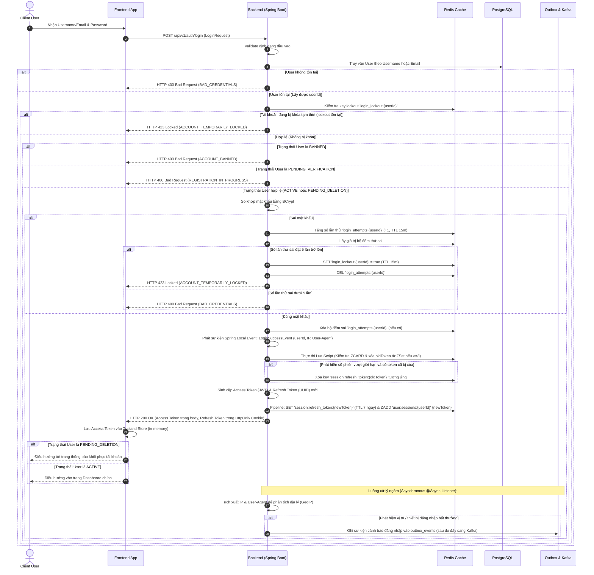
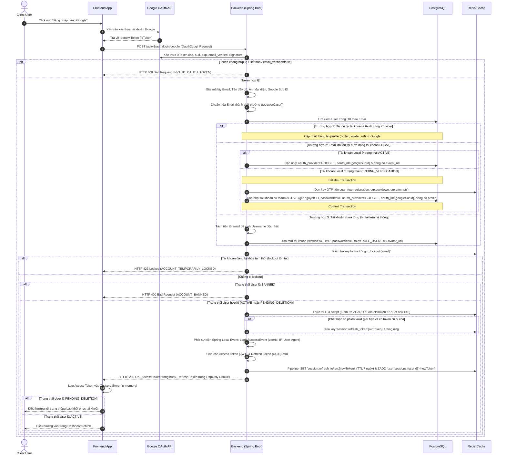
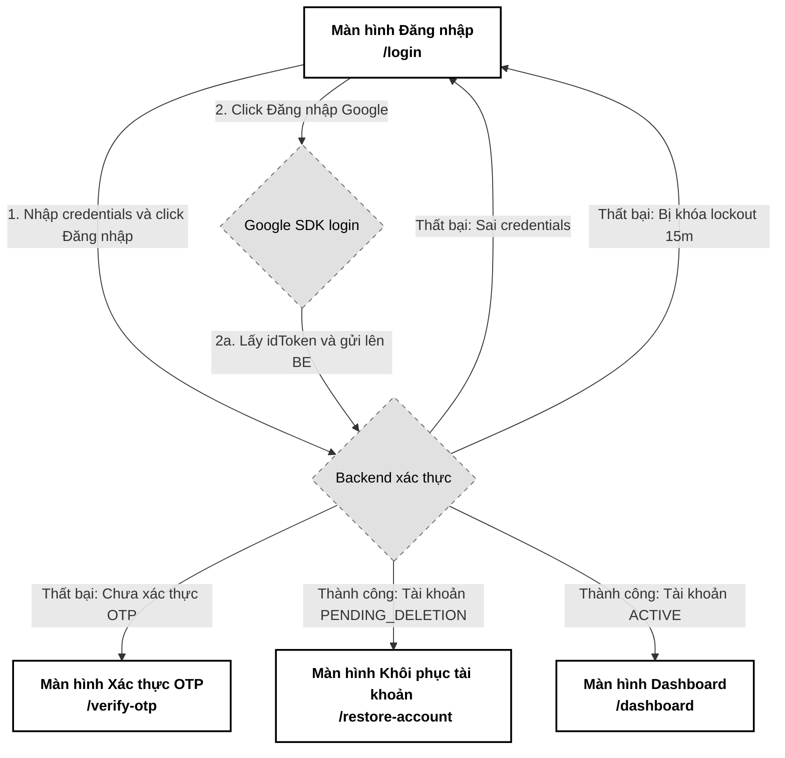

# 02. Đăng nhập (User Login - Local & Google OAuth2)

Tài liệu đặc tả A-Z tính năng Đăng nhập cho hệ thống PWB MiNi, bao gồm đăng nhập bằng tài khoản cục bộ (Local Login) và đăng nhập thông qua bên thứ ba (Google OAuth2). Tài liệu cung cấp chi tiết từ nghiệp vụ, sơ đồ tương tác, cấu trúc dữ liệu, đặc tả API cho tới hướng dẫn tích hợp Frontend.

---

## 📋 1. Business & Requirements (Nghiệp vụ & Yêu cầu)

### 1.1. Mô tả Nghiệp vụ (User Story / Use Case)
*   **Đối tượng thực hiện**: Người dùng đã đăng ký tài khoản (User, User Pro, Admin).
*   **Quy trình tóm tắt**:
    *   *Đăng nhập cục bộ (Local)*: Người dùng nhập Username hoặc Email kèm theo Mật khẩu. Hệ thống xác thực và cấp mã Access Token và Refresh Token.
    *   *Đăng nhập Google (OAuth2)*: Người dùng xác thực thông qua Google ở Client, nhận về Identity Token (`idToken`), sau đó gửi lên Backend. Backend kiểm tra, tự động liên kết tài khoản (nếu khớp email) hoặc đăng ký mới tài khoản và đăng nhập.

### 1.2. Quy tắc Nghiệp vụ (Business Rules)

#### A. Trạng thái Tài khoản & Kiểm soát truy cập
Hệ thống thực hiện xác thực và từ chối đăng nhập đối với các trạng thái tài khoản đặc biệt:
*   **Tài khoản `ACTIVE`**: Đăng nhập bình thường, cấp quyền truy cập đầy đủ.
*   **Tài khoản `PENDING_VERIFICATION`**: **Từ chối đăng nhập**. Hệ thống trả về lỗi `REGISTRATION_IN_PROGRESS`. Giao diện Frontend tự động điều hướng người dùng quay lại trang nhập OTP `/verify-otp?email=...` để kích hoạt tài khoản.
*   **Tài khoản `BANNED`**: **Từ chối đăng nhập**. Trả về lỗi `ACCOUNT_BANNED`.
*   **Tài khoản `PENDING_DELETION`**: **Cho phép đăng nhập thành công**, nhưng giới hạn quyền truy cập. Frontend bắt buộc điều hướng người dùng tới trang khôi phục tài khoản (chỉ cho phép thực hiện 2 hành động: Hủy yêu cầu xóa tài khoản hoặc Đăng xuất).

#### B. Cơ chế chống Brute-force mật khẩu (Account Lockout)
*   **Giới hạn số lần thử**: Hệ thống cho phép nhập sai mật khẩu tối đa **5 lần liên tiếp**.
*   **Khóa định danh độc nhất (Bypass Prevention)**: Để chống hành vi bypass bộ đếm brute-force bằng cách luân phiên nhập Username và Email của cùng một tài khoản, hệ thống sẽ thực hiện truy vấn DB trước để tìm ra `userId` độc nhất của tài khoản. Bộ đếm thử sai và trạng thái khóa sẽ được quản lý thống nhất thông qua các Redis key `login_attempts:{userId}` và `login_lockout:{userId}`.
*   **Kiểm soát và bảo vệ CPU (DoS Protection)**: Key khóa `login_lockout:{userId}` trên Redis được kiểm tra ngay lập tức sau khi lấy được `userId` từ DB và **trước khi thực hiện thuật toán so khớp BCrypt** (vốn ngốn nhiều CPU). Nếu tài khoản đang bị khóa, hệ thống lập tức trả về lỗi HTTP 423 Locked, chặn đứng yêu cầu xử lý tiếp theo mà không chạy BCrypt.

#### C. Giới hạn số lượng Phiên đăng nhập đồng thời (Concurrent Session Control)
*   **Giới hạn tối đa**: Mỗi tài khoản chỉ được phép duy trì tối đa **3 phiên đăng nhập hoạt động song song** (3 thiết bị cùng lúc).
*   **Cơ chế đá phiên cũ (Session Kick-out)**: Khi người dùng đăng nhập thành công vào thiết bị thứ 4, hệ thống tự động tìm và xóa Refresh Token của phiên cũ nhất khỏi Redis. Thiết bị cũ này sẽ tự động bị đăng xuất ngay khi Access Token của nó hết hạn (sau tối đa 15 phút).
*   **Đồng bộ xoay vòng phiên (Refresh Token Rotation Sync)**: Khi cơ chế Silent Refresh xoay vòng Refresh Token thành công, hệ thống bắt buộc phải cập nhật ZSet `user:sessions:{userId}` bằng cách xóa mã Refresh Token cũ và thêm mã Refresh Token mới cùng timestamp mới. Thao tác này ngăn ngừa tích tụ các "phiên ma" đã bị xoay vòng hoặc thu hồi, đảm bảo tính chính xác của hàm kiểm đếm thiết bị.
*   **Tính nguyên tử (Atomicity)**: Các thao tác kiểm tra số phiên (`ZCARD`), thu hồi phiên cũ nhất (`ZREMRANGEBYRANK`) và thêm phiên mới (`ZADD`) phải được đóng gói trong một **Redis Lua Script** duy nhất để thực thi nguyên tử, tránh Race Condition khi người dùng đăng nhập đồng thời trên nhiều thiết bị.

#### D. Cảnh báo đăng nhập bất thường (Anomalous Login Detection)
*   **Xử lý Bất đồng bộ (Asynchronous Processing)**: Tiến trình phân tích GeoIP, so khớp Anomalous Login và ghi nhận log đăng nhập được tách hoàn toàn ra khỏi luồng phản hồi chính. Khi đăng nhập thành công, luồng chính lập tức trả về HTTP 200 và phát đi một sự kiện Spring Local Event (`LoginSuccessEvent` chứa userId, IP, User-Agent). Một `@Async` listener sẽ xử lý sự kiện này ngầm để giải mã vị trí địa lý qua GeoIP, lưu thông tin vào Redis key `user:last_login:{userId}` và tạo bản ghi cảnh báo qua Outbox nếu phát hiện bất thường, từ đó loại bỏ hoàn toàn độ trễ block UI người dùng.
*   **Tối ưu hóa tài nguyên GeoIP (RAM Singleton)**: Để tránh nghẽn băng thông đĩa (Disk I/O Bottleneck) khi truy xuất tệp cơ sở dữ liệu MaxMind GeoIP dưới mật độ truy cập cao, tệp dữ liệu này được cấu hình nạp hoàn toàn vào bộ nhớ RAM (`FileMode.MEMORY`) dưới dạng một **Singleton Bean** trong Spring Container khi ứng dụng khởi tạo.

#### E. Cơ chế liên kết tài khoản Google (OAuth2 Account Linker)
Khi người dùng đăng nhập bằng Google, Backend nhận `idToken` và xác thực qua Google API. Sau khi giải mã lấy Email, hệ thống xử lý theo các trường hợp:
*   **Email OAuth2 đã tồn tại dưới dạng tài khoản LOCAL**:
    *   *Nếu tài khoản Local đã kích hoạt (`ACTIVE`)*: Hệ thống tự động cập nhật trường `oauth_provider = 'GOOGLE'`, `oauth_id = {googleSubId}` và đồng bộ `avatar_url` (lấy từ trường `picture` của Google profile) vào bản ghi của User đó. Người dùng có thể đăng nhập bằng cả 2 cách (Username/Password hoặc Google) ở các lần sau.
    *   *Nếu tài khoản Local chưa kích hoạt (`PENDING_VERIFICATION`)*: Hệ thống thực hiện liên kết và kích hoạt trực tiếp trên bản ghi cũ: giữ nguyên ID (UUID) để bảo toàn tính nhất quán dữ liệu, xóa mật khẩu cũ (đặt `password = null`), cập nhật trạng thái sang `ACTIVE`, cập nhật nhà cung cấp `oauth_provider = 'GOOGLE'` và ID `oauth_id = {googleSubId}`, đồng thời cập nhật tên (`full_name`) và ảnh đại diện (`avatar_url`) lấy từ Google, đồng thời dọn dẹp sạch các key Redis liên quan đến OTP của email đó.
    *   *Nếu tài khoản đang bị khóa (`BANNED`)*: Từ chối đăng nhập và trả về lỗi `ACCOUNT_BANNED`. Người dùng không thể bypass trạng thái BANNED thông qua đăng nhập Google.
    *   *Nếu tài khoản đang bị khóa tạm thời (Lockout)*: Nếu key `login_lockout:{email}` tồn tại trên Redis, từ chối đăng nhập và trả về lỗi `ACCOUNT_TEMPORARILY_LOCKED`. Việc này ngăn chặn kẻ tấn công bypass lockout brute-force bằng cách chuyển sang đăng nhập Google.
*   **Email OAuth2 chưa tồn tại**: Tự động tạo mới tài khoản với trạng thái `ACTIVE`, mật khẩu `null`, username tự sinh từ tiền tố email (ví dụ: `namnd` từ `namnd@gmail.com`, nếu trùng sẽ thêm hậu tố số ngẫu nhiên), lưu ảnh đại diện Google vào trường `avatar_url`, gán vai trò mặc định là `ROLE_USER`.

#### F. Quy tắc Xác thực Google Identity Token (idToken Validation)
Backend sử dụng thư viện `google-api-client` để xác thực `idToken` với các điều kiện bắt buộc:
*   **`iss` (Issuer)**: Phải là `https://accounts.google.com` hoặc `accounts.google.com`.
*   **`aud` (Audience)**: Phải khớp chính xác với `GOOGLE_CLIENT_ID` đã cấu hình trong `application.yml` của Backend. Nếu không khớp → token bị từ chối (để chống token giả từ ứng dụng khác).
*   **`exp` (Expiration)**: Token chưa hết hạn tại thời điểm xác thực.
*   **`email_verified`**: Phải là `true` — chỉ chấp nhận các tài khoản Google đã xác minh email.
*   **Signature**: Chữ ký số của token phải hợp lệ với public key của Google.

#### G. Tính năng Tương lai (Future Enhancements)
*   **Remember Me / Trust This Device**: Cân nhắc thêm option "Ghi nhớ đăng nhập" kéo dài TTL Refresh Token (30 ngày) hoặc "Tin tưởng thiết bị này" để bỏ qua anomalous login detection trên thiết bị đã xác nhận.
*   **Ban Evasion Detection**: Hiện tại hệ thống chỉ chặn BANNED theo email. Người dùng bị BANNED có thể đăng ký tài khoản mới với email khác. Cơ chế chống ban evasion nâng cao (device fingerprinting, IP blocking) sẽ được bổ sung trong các giai đoạn phát triển tiếp theo.

---

### 1.3. Quy tắc Xác thực Dữ liệu (Validation Rules)

| Trường | Ràng buộc | Annotation (Backend) | Mô tả |
| :--- | :--- | :--- | :--- |
| `usernameOrEmail` | Bắt buộc, không để trống | `@NotBlank` | Có thể nhập username hoặc email của tài khoản |
| `password` | Bắt buộc, không để trống, tối đa 100 ký tự | `@NotBlank`, `@Size(max=100)` | Giới hạn độ dài để chống DoS qua BCrypt với input quá dài |
| `idToken` | Bắt buộc, không để trống | `@NotBlank` | Token xác thực Google cấp cho phía Client |

---

### 1.4. Giới hạn Tần suất Truy cập API (IP Rate Limiting)

Hạ tầng Gateway áp dụng Rate Limiting dựa trên địa chỉ IP để chống các cuộc tấn công DDoS/Brute-force:

| API Endpoint | Giới hạn | Mô tả |
| :--- | :--- | :--- |
| `POST /api/v1/auth/login` | **10 requests / phút / IP** | Hạn chế spam đăng nhập và giảm tải xử lý mã hóa BCrypt |
| `POST /api/v1/auth/login/google` | **10 requests / phút / IP** | Hạn chế spam gửi token Google giả lập |

---

## 🔄 2. User Flow & Sequence Diagram (Luồng người dùng & Sơ đồ tuần tự)

### 2.1. Luồng Giai đoạn 1: Đăng nhập Cục bộ (Local Login)



##### 📝 Mô tả chi tiết các bước xử lý (Đăng nhập cục bộ):
1.  **Nhập liệu**: Người dùng nhập tên tài khoản (Username/Email) và mật khẩu rồi nhấn Đăng nhập.
2.  **Gọi API**: Frontend gửi yêu cầu HTTP POST tới `/api/v1/auth/login`.
3.  **Validate**: Backend kiểm tra định dạng dữ liệu đầu vào.
4.  **Tìm kiếm User**: Backend thực hiện truy vấn User trong PostgreSQL theo Username hoặc Email.
    *   *Chống Timing Attack & DoS*: Dưới sự hỗ trợ của bộ lọc giới hạn tần suất truy cập ở Gateway (IP Rate Limiting), hệ thống không thực hiện giả lập băm mật khẩu khi tìm kiếm không thấy User, mà lập tức trả về lỗi HTTP 400 Bad Request (`BAD_CREDENTIALS`).
5.  **Kiểm tra khóa tài khoản (Account Lockout)**: Nếu tìm thấy User, Backend truy cập Redis để kiểm tra sự tồn tại của key `login_lockout:{userId}`. Nếu key tồn tại, hệ thống lập tức từ chối đăng nhập và trả về mã lỗi HTTP 423 Locked. Thao tác này được thực hiện trước khi chạy BCrypt để bảo vệ tài nguyên CPU.
6.  **Kiểm tra trạng thái User**: Hệ thống từ chối đăng nhập ngay đối với tài khoản `BANNED` hoặc chưa kích hoạt (`PENDING_VERIFICATION`).
7.  **So khớp mật khẩu**: Hệ thống dùng BCrypt đối khớp mật khẩu người dùng gửi lên với mật khẩu đã lưu.
    *   *Nếu sai mật khẩu*: Hệ thống tăng bộ đếm thử sai `login_attempts:{userId}` trong Redis. Nếu bộ đếm đạt 5 lần, tạo key lockout `login_lockout:{userId}` 15 phút, xóa bộ đếm và trả về HTTP 423 Locked. Nếu chưa tới 5 lần, trả về HTTP 400 (`BAD_CREDENTIALS`).
    *   *Nếu đúng mật khẩu*: Xóa bộ đếm sai và tiếp tục xử lý cấp phiên.
8.  **Xử lý ngầm & Phát hiện bất thường (Asynchronous)**: Xóa bộ đếm thử sai. Luồng chính phát sự kiện Spring Local `LoginSuccessEvent` rồi chuyển tiếp ngay sang xử lý cấp token để trả phản hồi nhanh cho client. Một `@Async` listener bắt sự kiện này để trích xuất IP/User-Agent, đối chiếu vị trí địa lý qua GeoIP MaxMind ngầm. Nếu phát hiện thiết bị mới hoặc vị trí cách xa bất thường, listener tạo sự kiện Outbox gửi email cảnh báo bảo mật.
9.  **Giới hạn số phiên (Concurrent Session)**: Backend thực thi một **Redis Lua Script** nguyên tử để kiểm tra số lượng phiên hiện tại (`ZCARD`) của `user:sessions:{userId}`. Nếu số lượng phiên đạt mốc tối đa 3, Lua script tự động tìm và xóa Refresh Token cũ nhất (Score thấp nhất) ra khỏi ZSet. Backend sau đó xóa key `session:refresh_token:{oldToken}` tương ứng trên Redis.
10. **Tạo phiên mới**: Sinh Access Token (JWT) và Refresh Token (UUID) mới. Thực hiện lưu Refresh Token vào Redis và add UUID này vào ZSet `user:sessions:{userId}` kèm điểm số Score là timestamp hiện tại.
11. **Trả về kết quả**: Trả về Access Token trong JSON response body và đặt Refresh Token vào HttpOnly Cookie bảo mật.
12. **Điều hướng ở Client**: Frontend lưu Access Token vào Zustand Store. Nếu User ở trạng thái `PENDING_DELETION`, điều hướng tới trang khôi phục tài khoản. Nếu hoạt động bình thường (`ACTIVE`), điều hướng vào Dashboard.

---

### 2.2. Luồng Giai đoạn 2: Đăng nhập Google OAuth2 (Google Login)



##### 📝 Mô tả chi tiết các bước xử lý (Đăng nhập Google):
1.  **Xác thực tại Client**: Người dùng click "Đăng nhập bằng Google", giao diện Frontend gọi SDK của Google để hiển thị popup đăng nhập. Google xác thực và trả về Identity Token (`idToken`) cho Frontend.
2.  **Gửi Token lên Backend**: Frontend gửi một yêu cầu HTTP POST đính kèm `idToken` tới endpoint `/api/v1/auth/login/google`.
3.  **Xác thực idToken**: Backend sử dụng thư viện `google-api-client` để kiểm tra toàn bộ các điều kiện: `iss` phải là `https://accounts.google.com`, `aud` phải khớp với `GOOGLE_CLIENT_ID` của Backend, `exp` chưa hết hạn, `email_verified` phải là `true`, và chữ ký số hợp lệ. Nếu bất kỳ điều kiện nào không thỏa mãn, trả về lỗi HTTP 400 Bad Request (`INVALID_OAUTH_TOKEN`).
4.  **Giải mã thông tin**: Backend giải mã Token để lấy các trường: `email`, `name`, `picture` (avatar_url), và `sub` (Google User ID).
5.  **Chuẩn hóa email**: Chuyển đổi email nhận được thành chữ thường (`toLowerCase()`).
6.  **Xử lý liên kết tài khoản**:
    *   *Đã có tài khoản Google*: Tiếp tục luồng đăng nhập.
    *   *Trùng email với tài khoản LOCAL đang hoạt động (`ACTIVE`)*: Hệ thống cập nhật thông tin nhà cung cấp OAuth2 trực tiếp vào tài khoản đó để liên kết cả hai phương thức đăng nhập, đồng thời đồng bộ `avatar_url`.
    *   *Trùng email với tài khoản LOCAL chưa kích hoạt (`PENDING_VERIFICATION`)*: Hệ thống thực hiện liên kết và kích hoạt trực tiếp trên bản ghi cũ: giữ nguyên ID (UUID) để bảo toàn dữ liệu, xóa mật khẩu cũ (đặt `password = null`), cập nhật trạng thái thành `ACTIVE`, cập nhật nhà cung cấp `oauth_provider = 'GOOGLE'` và `oauth_id = {googleSubId}`, đồng bộ họ tên và `avatar_url` từ Google, đồng thời dọn sạch key Redis OTP liên quan trong một **Database Transaction** đảm bảo nguyên tử.
    *   *Chưa từng tồn tại*: Hệ thống tự sinh Username từ email và tạo mới tài khoản với trạng thái `ACTIVE`, mật khẩu `null`, lưu ảnh đại diện Google vào trường `avatar_url`, gán vai trò mặc định là `ROLE_USER`.
7.  **Kiểm tra lockout**: Backend kiểm tra key `login_lockout:{email}` trên Redis. Nếu tồn tại, từ chối đăng nhập và trả về HTTP 423 Locked (`ACCOUNT_TEMPORARILY_LOCKED`).
8.  **Kiểm tra trạng thái User**: Từ chối nếu tài khoản đang bị `BANNED`. Cho phép nếu `ACTIVE` hoặc `PENDING_DELETION`.
9.  **Quản lý phiên & Cấp Token**: Backend thực thi **Redis Lua Script** để kiểm tra giới hạn 3 phiên đăng nhập đồng thời của User thông qua ZSet `user:sessions:{userId}`. Tiến hành xóa phiên cũ nhất (ZSet và String key) nếu vượt quá giới hạn.
10. **Lưu thông tin phiên (Asynchronous)**: Phát sự kiện Spring Local Event `LoginSuccessEvent` để xử lý ngầm (trích xuất IP/User-Agent qua GeoIP và cập nhật thông tin đăng nhập gần nhất vào Redis key `user:last_login:{userId}`).
11. **Trả về kết quả**: Sinh cặp token mới, lưu Refresh Token vào Redis, trả về Access Token trong response body và Refresh Token qua HttpOnly Cookie.
12. **Điều hướng**: Nếu User ở trạng thái `PENDING_DELETION`, Frontend điều hướng tới trang khôi phục tài khoản. Nếu `ACTIVE`, điều hướng vào Dashboard.

---

## 💾 3. Database & Cache Schema (Thiết kế Cơ sở Dữ liệu)

### 3.1. Sơ đồ Quan hệ PostgreSQL (ERD)
Phần đăng nhập sử dụng trực tiếp các bảng `users` và `roles` đã được định nghĩa ở Usecase 1. Không cần tạo thêm bảng mới.

### 3.2. Cấu trúc dữ liệu Redis (Cache & Limits)

Các khóa Redis được sử dụng cho việc chống brute-force và kiểm soát số lượng phiên đăng nhập:

| Định dạng Khóa (Redis Key) | Kiểu dữ liệu | Giá trị (Value) | TTL | Mục đích sử dụng |
| :--- | :--- | :--- | :--- | :--- |
| `login_attempts:{userId}` | `String` | Số lần đăng nhập sai (ví dụ: `3`) | **15 phút** | Đếm số lần đăng nhập sai mật khẩu liên tiếp. |
| `login_lockout:{userId}` | `String` | `"true"` | **15 phút** | Khóa đăng nhập tạm thời khi sai quá 5 lần. |
| `session:refresh_token:{token}` | `String` | `userId` | **7 ngày** | Quản lý phiên hoạt động (JWT Refresh). |
| `user:sessions:{userId}` | `ZSet` | `token` (UUID) với Score là `timestamp` | **7 ngày** | Danh sách các token phiên đang hoạt động của người dùng, dùng để kiểm soát giới hạn tối đa 3 phiên hoạt động. |
| `user:last_login:{userId}` | `Hash` | `ip`, `location`, `device`, `timestamp` | **30 ngày** | Lưu thông tin phiên đăng nhập thành công gần nhất để phục vụ Anomalous Login Detection. |

*Lưu ý: Để chống hành vi bypass bộ đếm brute-force bằng cách nhập xen kẽ Username và Email của cùng một tài khoản, hệ thống sẽ truy vấn tìm `userId` độc nhất từ DB trước, sau đó dùng `userId` này làm khóa trên Redis (`login_attempts:{userId}` và `login_lockout:{userId}`).*

> **⚡ Lưu ý Kỹ thuật: Atomic Redis Operations**
>
> Khi thực hiện các thao tác Redis liên quan đến đăng nhập và kiểm soát phiên (ví dụ: ghi nhận và kiểm tra số lần thử sai `login_attempts`, khóa tài khoản `login_lockout`, hoặc lấy và xóa phiên cũ nhất trong `user:sessions:{userId}`), hệ thống **BẮT BUỘC** sử dụng **Redis Pipeline**, **Redis Transaction (`MULTI/EXEC`)**, hoặc **Lua Script** để đảm bảo tính nguyên tử (atomicity). Điều này ngăn chặn lỗi tương tranh dữ liệu (Race Condition) khi người dùng cố tình gửi nhiều request đăng nhập cùng một thời điểm.

---

## 🔌 4. API Specifications (Đặc tả API)

### 4.0. Cấu hình Chung
*   **Base Path**: `/api/v1/auth`
*   **Headers**: `Content-Type: application/json`
*   **Format Phản Hồi**: Hệ thống đồng nhất sử dụng cấu trúc `ApiResponse<T>` chuẩn hóa theo quy ước dự án:
    *   **Thành công**: Trả về Http Code thích hợp cùng JSON body chứa `success: true`, `message`, `data` (payload kết quả), `errors: null` và `timestamp` (ISO 8601).
    *   **Thất bại**: Trả về Http Code lỗi, JSON body chứa `success: false`, `message`, `data: null`, `errors` (mảng chi tiết lỗi với `code`, `field`, `message`) và `timestamp`.

---

### 4.1. API Đăng nhập Cục bộ (Local Login)
*   **Method**: `POST`
*   **Path**: `/api/v1/auth/login`
*   **Auth Level**: `PermitAll`

#### Request Body (`LoginRequest`):
```json
{
  "usernameOrEmail": "hoangnam511",
  "password": "StrongPassword123!"
}
```

#### Response Thành công (200 OK):
```json
{
  "success": true,
  "message": "Đăng nhập thành công",
  "data": {
    "accessToken": "eyJhbGciOiJIUzI1NiIsInR5cCI6IkpXVCJ9...",
    "expiresIn": 900,
    "user": {
      "username": "hoangnam511",
      "email": "producer@example.com",
      "fullName": "Nguyễn Đức Hoàng Nam",
      "role": "ROLE_USER",
      "status": "ACTIVE"
    }
  },
  "errors": null,
  "timestamp": "2026-07-01T10:20:00Z"
}
```
*Lưu ý: Refresh Token được đặt tự động vào Cookie `Set-Cookie: refreshToken=8f8b5f36-...; Path=/; HttpOnly; Secure; SameSite=Strict; Max-Age=604800`.*

#### Response Lỗi Sai thông tin đăng nhập (400 Bad Request):
```json
{
  "success": false,
  "message": "Tên đăng nhập hoặc mật khẩu không chính xác",
  "data": null,
  "errors": [
    {
      "code": "BAD_CREDENTIALS",
      "field": null,
      "message": "Tên đăng nhập hoặc mật khẩu không chính xác"
    }
  ],
  "timestamp": "2026-07-01T10:20:00Z"
}
```

> **📌 Lưu ý Bảo mật:** Thông báo lỗi `BAD_CREDENTIALS` cố tình **không chỉ rõ** sai username hay password, và `field` luôn là `null` để chống brute-force dò tìm tài khoản hợp lệ.

#### Response Lỗi Tài khoản chưa kích hoạt (400 Bad Request):
```json
{
  "success": false,
  "message": "Tài khoản chưa được kích hoạt xác thực OTP",
  "data": {
    "redirectTo": "/verify-otp",
    "email": "pro***@example.com"
  },
  "errors": [
    {
      "code": "REGISTRATION_IN_PROGRESS",
      "field": "email",
      "message": "Vui lòng hoàn tất xác thực OTP để kích hoạt tài khoản"
    }
  ],
  "timestamp": "2026-07-01T10:20:00Z"
}
```

#### Response Lỗi Tài khoản đang bị Khóa tạm thời (423 Locked):
```json
{
  "success": false,
  "message": "Tài khoản của bạn đã bị khóa tạm thời do nhập sai mật khẩu quá 5 lần. Vui lòng thử lại sau 15 phút.",
  "data": null,
  "errors": [
    {
      "code": "ACCOUNT_TEMPORARILY_LOCKED",
      "field": null,
      "message": "Tài khoản bị tạm khóa 15 phút"
    }
  ],
  "timestamp": "2026-07-01T10:20:00Z"
}
```

---

### 4.2. API Đăng nhập bằng Google (Google Login)
*   **Method**: `POST`
*   **Path**: `/api/v1/auth/login/google`
*   **Auth Level**: `PermitAll`

#### Request Body (`Oauth2LoginRequest`):
```json
{
  "idToken": "eyJhbGciOiJSUzI1NiIsImtpZCI6IjFhMmIzY..."
}
```

#### Response Thành công (200 OK):
```json
{
  "success": true,
  "message": "Đăng nhập bằng Google thành công",
  "data": {
    "accessToken": "eyJhbGciOiJIUzI1NiIsInR5cCI6IkpXVCJ9...",
    "expiresIn": 900,
    "user": {
      "username": "hoangnam.google.92",
      "email": "hoangnam@gmail.com",
      "fullName": "Hoàng Nam",
      "role": "ROLE_USER",
      "status": "ACTIVE"
    }
  },
  "errors": null,
  "timestamp": "2026-07-01T10:21:00Z"
}
```

#### Response Lỗi Token không hợp lệ (400 Bad Request):
```json
{
  "success": false,
  "message": "Mã token xác thực Google không hợp lệ hoặc đã hết hạn",
  "data": null,
  "errors": [
    {
      "code": "INVALID_OAUTH_TOKEN",
      "field": "idToken",
      "message": "Token Google không hợp lệ hoặc đã hết hạn, vui lòng thử lại"
    }
  ],
  "timestamp": "2026-07-01T10:21:00Z"
}
```

---

### 4.3. Phụ lục Mã Lỗi Nghiệp Vụ (Error Codes)

Mỗi lỗi nghiệp vụ được định nghĩa trong `ErrorCode` Enum với HTTP Status tương ứng. Giá trị `code` trong mảng `errors` sử dụng **tên lỗi dạng chuỗi** (UPPER_SNAKE_CASE):

| Http Status | Error Code (String) | Mô tả | Trường liên quan (`field`) |
| :--- | :--- | :--- | :--- |
| `400 Bad Request` | `VALIDATION_FAILED` | Dữ liệu đầu vào không hợp lệ | Tên trường bị lỗi |
| `400 Bad Request` | `BAD_CREDENTIALS` | Tên đăng nhập hoặc mật khẩu không chính xác | `null` |
| `400 Bad Request` | `ACCOUNT_BANNED` | Tài khoản đã bị vô hiệu hóa khỏi hệ thống | `null` |
| `400 Bad Request` | `REGISTRATION_IN_PROGRESS` | Tài khoản chưa được kích hoạt xác thực OTP | `email` |
| `423 Locked` | `ACCOUNT_TEMPORARILY_LOCKED` | Tài khoản bị khóa tạm thời 15 phút do nhập sai quá nhiều | `null` |
| `400 Bad Request` | `INVALID_OAUTH_TOKEN` | Mã token xác thực Google không hợp lệ hoặc đã hết hạn | `idToken` |
| `429 Too Many Requests` | `RATE_LIMIT_EXCEEDED` | Vượt quá giới hạn tần suất truy cập API | `null` |

---

## 🎨 5. UI/UX & Frontend Integration Notes (Giao diện & Tích hợp)

### 5.1. Thiết kế Giao diện & Trải nghiệm (UI/UX)
*   **Thiết kế đơn sắc (Grayscale Theme)**:
    *   Tất cả các thành phần giao diện (nút bấm, form nhập, nền) tuân thủ nghiêm ngặt tông màu Monochrome (Đen, Trắng, và các sắc độ của Xám) theo quy ước.
    *   Nút bấm đăng nhập Google sử dụng viền xám nhạt, logo Google dạng tối giản hoặc đơn sắc để hòa quyện vào ngôn ngữ thiết kế chung.
*   **Thuộc tính Accessibility (A11y)**:
    *   Các input trong form đăng nhập bắt buộc định nghĩa đầy đủ thuộc tính `id`, `name`, `aria-label`.
    *   Bắt buộc gắn thuộc tính tự động điền `autocomplete="username"` (hoặc `autocomplete="email"`) và `autocomplete="current-password"` để hỗ trợ trình quản lý mật khẩu của trình duyệt.
*   **Hỗ trợ người dùng & Trực quan hóa**:
    *   **Ẩn/Hiện mật khẩu**: Bố trí nút icon (Mắt nhắm/Mắt mở) ở trường mật khẩu để người dùng dễ dàng kiểm tra tránh nhập sai.
    *   **Inline Errors**: Hiển thị thông báo lỗi ngay dưới mỗi ô nhập (Inline Error Message) kèm theo thay đổi màu viền (Border-red) khi có lỗi.
*   **Xử lý các lỗi nghiệp vụ trả về**:
    *   *Lỗi nhập sai credentials (`BAD_CREDENTIALS`)*: Hiển thị thông báo chung *"Tên đăng nhập hoặc mật khẩu không đúng"* ở đầu form (không chỉ rõ sai username hay password để chống brute-force).
    *   *Lỗi chưa kích hoạt (`REGISTRATION_IN_PROGRESS`)*: Hiển thị hộp thoại Toast thông báo và tự động chuyển hướng người dùng sang trang `data.redirectTo` (ví dụ: `/verify-otp?email={data.email}`) sau 2 giây.
    *   *Lỗi khóa tạm thời (`ACCOUNT_TEMPORARILY_LOCKED`)*: Hiển thị thông báo rõ ràng *"Tài khoản bị khóa tạm thời do nhập sai mật khẩu quá nhiều, vui lòng thử lại sau 15 phút"*. Vô hiệu hóa nút Đăng nhập và hiển thị countdown timer. Đồng thời, **cung cấp một nút/link hành động khẩn cấp**: *"Quên mật khẩu? Khôi phục ngay"* giúp điều hướng người dùng trực tiếp sang luồng Quên mật khẩu (`/forgot-password`) để tự mở khóa thông qua OTP Email mà không cần phải chờ hết 15 phút.
    *   *Lỗi tài khoản bị cấm (`ACCOUNT_BANNED`)*: Hiển thị thông báo *"Tài khoản của bạn đã bị vô hiệu hóa. Vui lòng liên hệ hỗ trợ."* kèm link liên hệ `support@pwbmini.com`.

---

### 5.2. Tối ưu hóa Hiệu năng & Trải nghiệm Lập trình viên (Performance & DevEx)
*   **Chống gửi yêu cầu trùng lặp (Double Submit Prevention)**:
    *   **Trạng thái Loading**: Khi người dùng nhấn "Đăng ký" hoặc "Đăng nhập", nút Submit lập tức bị vô hiệu hóa (`disabled`) và hiển thị Spinner xoay để ngăn người dùng click liên tục gửi các request trùng lặp (Debounce/Throttle).
*   **Xác thực tại Client (Client-Side Validation)**:
    *   Sử dụng thư viện xác thực nhẹ (như Zod) để kiểm tra định dạng email/username hợp lệ và độ dài mật khẩu tối thiểu trước khi gọi API, tránh gửi các request lỗi vô ích lên server.
*   **Xử lý Ngoại lệ mạng (Network Offline Resilience)**:
    *   Frontend sử dụng bộ theo dõi trạng thái mạng (`window.navigator.onLine`).
    *   Nếu người dùng mất kết nối, hệ thống sẽ hiển thị một Toast cảnh báo "Mất kết nối mạng, vui lòng kiểm tra lại!" và chặn gửi request, tránh để ứng dụng bị treo do API timeout.

---

### 5.3. Quản lý trạng thái phiên ở Client (HttpOnly Cookie)
*   Frontend chỉ nhận và quản lý `accessToken` thông qua Zustand Store được định nghĩa trong ứng dụng Client.
*   `refreshToken` được trình duyệt tự động gửi và nhận thông qua tiêu chuẩn `Set-Cookie` ở header của mỗi request. Phía Javascript ở Client không thể đọc, chỉnh sửa hoặc can thiệp vào token này nhằm bảo vệ hệ thống khỏi các lỗ hổng bảo mật tấn công XSS.

---

### 5.4. Sơ đồ Luồng Màn hình (Screen Flow)

Luồng di chuyển màn hình khi thực hiện Đăng nhập:



##### 📝 Giải thích các chuyển hướng giao diện:
1.  **Từ `/login` chuyển sang `/verify-otp`**: Nếu đăng nhập bằng một tài khoản có status `PENDING_VERIFICATION`, Backend trả về lỗi `REGISTRATION_IN_PROGRESS`. Frontend tự động lấy thông tin email từ payload lỗi và chuyển hướng người dùng đến `/verify-otp?email=...`.
2.  **Từ `/login` chuyển sang `/restore-account`**: Nếu đăng nhập bằng tài khoản đang trong trạng thái yêu cầu xóa (`PENDING_DELETION`), Frontend sẽ nhận biết qua API response và buộc người dùng di chuyển tới `/restore-account`. Tại đây, người dùng chỉ có thể bấm nút "Hủy yêu cầu xóa tài khoản" để kích hoạt lại tài khoản thành `ACTIVE`, hoặc bấm "Đăng xuất" để quay lại trang login.
3.  **Đăng nhập thành công thông thường**: Lưu Access Token vào Zustand, trình duyệt tự động lưu HttpOnly Refresh Token, sau đó tự động điều hướng người dùng tới màn hình làm việc chính `/dashboard`.

---

## ✉️ 6. Email Template Cảnh báo Đăng nhập Bất thường (Anomalous Login Alert Email Template)

Hệ thống sử dụng template HTML responsive để gửi thư cảnh báo bảo mật khi phát hiện vị trí hoặc thiết bị đăng nhập bất thường. Template được biên dịch bởi Mail Worker Service từ Thymeleaf hoặc FreeMarker.

### 6.1. Thông tin Email
| Thuộc tính | Giá trị |
| :--- | :--- |
| **From** | `PWB MiNi Security <security@pwbmini.com>` |
| **Subject** | `[PWB MiNi] Cảnh báo: Phát hiện đăng nhập từ vị trí hoặc thiết bị bất thường` |
| **Template ID** | `email/anomalous-login-alert` |
| **Format** | HTML responsive (tương thích mobile ≥ 320px) |
| **SMTP Provider** | Local: **Gmail SMTP** (App Password)<br>Production: **Resend SMTP** (smtp.resend.com) hoặc **AWS SES** |

### 6.2. Nội dung Email (Content Structure)
*   **Header**: Logo PWB MiNi + Tiêu đề nổi bật "Cảnh báo bảo mật tài khoản".
*   **Body**:
    *   Lời chào cá nhân hóa: `Xin chào {fullName},`
    *   Nội dung thông báo: "Chúng tôi phát hiện một phiên đăng nhập mới vào tài khoản của bạn từ một địa điểm hoặc thiết bị mà bạn chưa từng sử dụng trước đây."
    *   **Chi tiết phiên đăng nhập**:
        *   **Thời gian**: `{timestamp}`
        *   **Thiết bị / Trình duyệt**: `{deviceInfo}` (Trích xuất từ User-Agent)
        *   **Địa chỉ IP**: `{ipAddress}`
        *   **Vị trí ước tính**: `{location}` (Định vị từ GeoIP)
    *   Nút hành động khẩn cấp: Nút nhấn "Tôi không thực hiện hành động này - Khóa tài khoản ngay" liên kết đến đường dẫn khôi phục bảo mật.
*   **Footer**: © 2026 PWB MiNi. Hỗ trợ khẩn cấp: `security@pwbmini.com`.

### 6.3. Quy tắc Bảo mật Email
*   Không đính kèm bất kỳ thông tin nhạy cảm nào như mật khẩu hoặc token phiên.
*   Sử dụng SPF, DKIM, DMARC để bảo vệ email gửi đi không bị rơi vào thư rác (spam) hoặc giả mạo.

---

## 📊 7. Logging & Observability (Ghi nhận Nhật ký & Giám sát)

Hệ thống sử dụng **SLF4J + Logback** với định dạng **Structured JSON** theo quy ước dự án. Các sự kiện đăng nhập và kiểm soát phiên quan trọng cần được ghi nhận:

### 7.1. Log Points (Các điểm ghi log)

| Level | Sự kiện | Payload mẫu |
| :--- | :--- | :--- |
| `INFO` | Local login attempt | `{"event": "LOGIN_ATTEMPT", "identifier": "***@example.com"}` |
| `INFO` | Local login success | `{"event": "LOGIN_SUCCESS", "userId": "c8b74f51-...", "sessionsCount": 2}` |
| `INFO` | Google OAuth2 attempt | `{"event": "GOOGLE_LOGIN_ATTEMPT"}` |
| `INFO` | Google account linked | `{"event": "GOOGLE_ACCOUNT_LINKED", "userId": "c8b74f51-..."}` |
| `WARN` | Login failed (Wrong credentials) | `{"event": "LOGIN_FAILED_CREDENTIALS", "identifier": "***@example.com"}` |
| `WARN` | Account locked temporarily | `{"event": "ACCOUNT_LOCKED_TEMPORARY", "identifier": "***@example.com", "lockoutDurationMinutes": 15}` |
| `WARN` | Login locked check blocked | `{"event": "LOGIN_BLOCKED_LOCKOUT", "identifier": "***@example.com"}` |
| `WARN` | Session kicked out | `{"event": "SESSION_KICKED_OUT", "userId": "c8b74f51-...", "kickedToken": "8f8b5f36-..."}` |
| `WARN` | Anomalous login detected | `{"event": "SUSPICIOUS_LOGIN_DETECTED", "userId": "c8b74f51-...", "ip": "1.2.3.4", "location": "US"}` |
| `ERROR` | Google API verification failure | `{"event": "GOOGLE_OAUTH_FAILED", "error": "Signature verification failed"}` |
| `ERROR` | Redis connection failure | `{"event": "REDIS_CONN_FAILURE", "operation": "KICK_SESSION", "error": "..."}` |

### 7.2. Quy tắc Bảo mật Log
*   **Tuyệt đối không log mật khẩu** gửi lên từ client (dù ở bất cứ dạng mã hóa nào).
*   **Mask email/username** trong log: hiển thị dạng `n***@example.com` thay vì hiển thị đầy đủ để tuân thủ quyền riêng tư dữ liệu cá nhân.
*   **Không ghi nhận giá trị token** đầy đủ của JWT hoặc Refresh Token vào log. Chỉ ghi nhận dạng UUID viết tắt/mask hoặc ghi nhận số phiên khả dụng.
