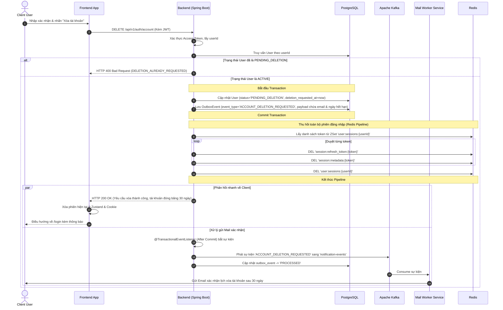
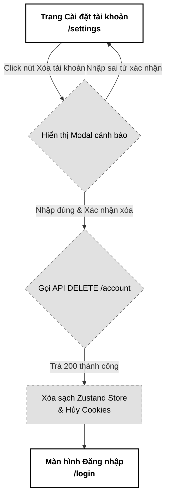

# 06. Thông tin Cá nhân & Yêu cầu Xóa tài khoản (User Profile & Account Deletion Request)

Tài liệu đặc tả A-Z tính năng Quản lý thông tin cá nhân (Profile Management) và Yêu cầu xóa tài khoản (Account Deletion Request) của hệ thống PWB MiNi, tích hợp cơ chế đóng băng tài khoản trong 30 ngày (30-day Grace Period) và Transactional Outbox để gửi mail xác nhận.

---

## 📋 1. Business & Requirements (Nghiệp vụ & Yêu cầu)

### 1.1. Mô tả Nghiệp vụ (User Story / Use Case)
*   **Đối tượng thực hiện**: Người dùng đã đăng nhập thành công (ACTIVE).
*   **Quy trình tóm tắt**:
    *   *Xem hồ sơ*: Người dùng truy cập trang cá nhân, Frontend gọi `GET /api/v1/auth/me` để lấy thông tin chi tiết (fullName, username, email, role, status, avatarUrl, phone).
    *   *Cập nhật hồ sơ*: Người dùng chỉnh sửa thông tin cá nhân (chỉ cho phép sửa fullName, phone, avatarUrl) và lưu lại. Backend xác thực dữ liệu và cập nhật vào PostgreSQL.
    *   *Yêu cầu xóa tài khoản*: Người dùng nhấn "Xóa tài khoản" -> Xác nhận cảnh báo -> Backend chuyển trạng thái User sang `PENDING_DELETION`, ghi nhận mốc thời gian `deletion_requested_at`. Hệ thống gửi email thông báo tài khoản sẽ bị ẩn danh hóa vĩnh viễn sau 30 ngày nếu không có hành động khôi phục.

### 1.2. Quy tắc Nghiệp vụ (Business Rules)

#### A. Quyền cập nhật hồ sơ cá nhân
*   Người dùng chỉ được phép cập nhật các thông tin không mang tính định danh cốt lõi: `fullName`, `phone`, và `avatarUrl`.
*   Các trường như `username`, `email`, `role`, và `status` **tuyệt đối không được phép chỉnh sửa** thông qua API cập nhật hồ sơ thông thường để bảo mật hệ thống.

#### B. Cơ chế Xóa tài khoản (Soft Delete & 30-day Grace Period)
*   Để bảo vệ người dùng khỏi việc vô tình xóa tài khoản hoặc bị kẻ xấu phá hoại, hệ thống áp dụng cơ chế **Xóa mềm trì hoãn**:
    *   Khi nhận yêu cầu `DELETE /api/v1/auth/account`, trạng thái của người dùng trong PostgreSQL được chuyển từ `ACTIVE` sang `PENDING_DELETION`.
    *   Lưu mốc thời gian yêu cầu vào trường `deletion_requested_at`.
*   **Đóng băng tài khoản**: Trong vòng 30 ngày kể từ ngày yêu cầu, tài khoản rơi vào trạng thái đóng băng. 
    *   *Nếu đăng nhập lại*: Hệ thống vẫn cho phép đăng nhập thành công nhưng ép điều hướng sang màn hình khôi phục tài khoản (như đã đặc tả ở Usecase 2). Nếu người dùng chọn **"Hủy yêu cầu xóa"**, trạng thái tài khoản chuyển về `ACTIVE`, trường `deletion_requested_at` reset về `null`, tài khoản khôi phục bình thường.
    *   *Nếu hết 30 ngày*: Một Background Job (Usecase 8) sẽ tự động chạy ngầm quét và thực hiện ẩn danh hóa thông tin vĩnh viễn.

#### C. Thông báo xác nhận qua Email
*   Khi có yêu cầu xóa tài khoản, hệ thống tạo sự kiện `ACCOUNT_DELETION_REQUESTED` trong bảng `outbox_events` để Kafka gửi email thông báo tới hòm thư người dùng, xác nhận thời điểm tài khoản sẽ bị ẩn danh hóa vĩnh viễn và cách thức hủy yêu cầu (đăng nhập lại trước 30 ngày).

#### D. Thu hồi phiên đăng nhập (Session Revocation)
*   Sau khi chuyển trạng thái sang `PENDING_DELETION`, Backend **bắt buộc** thu hồi toàn bộ phiên đăng nhập đang hoạt động của người dùng trên Redis (xóa ZSet `user:sessions:{userId}`, tất cả `session:refresh_token:{token}` và `session:metadata:{token}`) để buộc tất cả thiết bị đăng xuất lập tức.
*   Khi người dùng đăng nhập lại trong vòng 30 ngày, hệ thống sẽ ép điều hướng sang màn hình khôi phục tài khoản (như đặc tả ở Usecase 2).

#### E. Xác nhận bảo mật khi xóa (Future Enhancement)
*   Trong phiên bản hiện tại, API `DELETE /account` sử dụng xác nhận qua dialog UI (nhập text "XÁC NHẬN XÓA"). Trong các giai đoạn tiếp theo, có thể bổ sung xác thực bằng mật khẩu (Local accounts) hoặc Re-authentication (OAuth accounts) để tăng cường chống CSRF/XSS.

---

### 1.3. Quy tắc Xác thực Dữ liệu (Validation Rules)

| Trường dữ liệu | Ràng buộc | Annotation (Backend) | Mô tả |
| :--- | :--- | :--- | :--- |
| `fullName` | Bắt buộc, tối đa 50 ký tự | `@NotBlank`, `@Size(max=50)` | Tên đầy đủ hiển thị của người dùng |
| `phone` | Không bắt buộc, nếu có phải đúng định dạng số điện thoại Việt Nam (10 chữ số) | `@Pattern` | Số điện thoại liên lạc |
| `avatarUrl` | Không bắt buộc, nếu có phải là định dạng URL hợp lệ, tối đa 255 ký tự | `@URL`, `@Size(max=255)` | Đường dẫn ảnh đại diện (lưu trữ trên S3) |

---

### 1.4. Giới hạn Tần suất Truy cập API (IP Rate Limiting)

| API Endpoint | Giới hạn | Mô tả |
| :--- | :--- | :--- |
| `GET /api/v1/auth/me` | **60 requests / phút / IP** | Truy cập lấy hồ sơ cá nhân khi F5 hoặc chuyển trang |
| `PUT /api/v1/auth/profile` | **10 requests / phút / IP** | Tránh spam cập nhật liên tục làm ghi DB quá tải |
| `DELETE /api/v1/auth/account` | **2 requests / phút / IP** | Ngăn chặn hành vi cố tình spam yêu cầu xóa tài khoản |

---

## 🔄 2. User Flow & Sequence Diagram (Luồng người dùng & Sơ đồ tuần tự)

### 2.1. Luồng Yêu cầu Xóa tài khoản (Account Deletion Request Flow)



##### 📝 Mô tả chi tiết các bước xử lý:
1.  **Gửi yêu cầu**: Người dùng truy cập cài đặt tài khoản, nhập xác nhận đồng ý xóa và click gửi. Frontend gọi API `DELETE /api/v1/auth/account` đính kèm Access Token JWT.
2.  **Cập nhật trạng thái đóng băng**: Backend xác thực quyền sở hữu, cập nhật trạng thái User sang `PENDING_DELETION` và lưu mốc thời gian `deletion_requested_at`. Ghi nhận sự kiện gửi mail xác nhận vào hàng đợi Outbox.
3.  **Thu hồi phiên đăng nhập**: Backend sử dụng **Redis Pipeline** xóa toàn bộ Refresh Token, metadata phiên, và ZSet `user:sessions:{userId}` để buộc tất cả thiết bị đăng xuất lập tức.
4.  **Phản hồi và dọn dẹp Client**: Trả về kết quả HTTP 200 OK, Frontend dọn sạch Zustand store và cookie, điều hướng về `/login`.
5.  **Gửi email xác nhận**: Mail Worker Service nhận sự kiện qua Kafka và gửi thư thông báo tới email người dùng, khẳng định tài khoản đang trong trạng thái chờ xóa 30 ngày.

---

## 💾 3. Database & Cache Schema (Thiết kế Cơ sở Dữ liệu & Cache)

### 3.1. Các trường bổ sung trong bảng `users` (PostgreSQL)

Để quản lý trạng thái xóa mềm, bảng `users` được cập nhật các trường thông tin:

```sql
ALTER TABLE users ADD COLUMN deletion_requested_at TIMESTAMP NULL;
CREATE INDEX idx_users_deletion_status ON users(status, deletion_requested_at) WHERE status = 'PENDING_DELETION';
```
*Lưu ý: Chỉ mục có điều kiện `idx_users_deletion_status` giúp Background Job quét cực nhanh các tài khoản đến hạn xóa mà không phải scan toàn bộ bảng DB.*

---

## 🔌 4. API Specifications (Đặc tả API)

### 4.0. Cấu hình Chung
*   **Base Path**: `/api/v1/auth`
*   **Headers**: `Authorization: Bearer <accessToken>`
*   **Format Phản Hồi**: Hệ thống đồng nhất sử dụng cấu trúc `ApiResponse<T>` chuẩn hóa theo quy ước dự án:
    *   **Thành công**: Trả về Http Code thích hợp cùng JSON body chứa `success: true`, `message`, `data`, `errors: null` và `timestamp` (ISO 8601).
    *   **Thất bại**: Trả về Http Code lỗi, JSON body chứa `success: false`, `message`, `data: null`, `errors` và `timestamp`.

---

### 4.1. API Lấy thông tin cá nhân (Get My Profile)
*   **Method**: `GET`
*   **Path**: `/api/v1/auth/me`
*   **Auth Level**: `Requires Authentication`

#### Response Thành công (200 OK):
```json
{
  "success": true,
  "message": "Lấy thông tin cá nhân thành công",
  "data": {
    "username": "hoangnam511",
    "email": "hoangnam@gmail.com",
    "fullName": "Nguyễn Đức Hoàng Nam",
    "role": "ROLE_USER",
    "status": "ACTIVE",
    "avatarUrl": "https://s3.pwbmini.com/avatars/hoangnam.jpg",
    "phone": "0987654321"
  },
  "errors": null,
  "timestamp": "2026-07-01T12:00:00Z"
}
```

---

### 4.2. API Cập nhật hồ sơ cá nhân (Update Profile)
*   **Method**: `PUT`
*   **Path**: `/api/v1/auth/profile`
*   **Auth Level**: `Requires Authentication`

#### Request Body (`UpdateProfileRequest`):
```json
{
  "fullName": "Nguyễn Hoàng Nam",
  "phone": "0912345678",
  "avatarUrl": "https://s3.pwbmini.com/avatars/new_hoangnam.jpg"
}
```

#### Response Thành công (200 OK):
```json
{
  "success": true,
  "message": "Cập nhật thông tin cá nhân thành công",
  "data": {
    "username": "hoangnam511",
    "email": "hoangnam@gmail.com",
    "fullName": "Nguyễn Hoàng Nam",
    "role": "ROLE_USER",
    "status": "ACTIVE",
    "avatarUrl": "https://s3.pwbmini.com/avatars/new_hoangnam.jpg",
    "phone": "0912345678"
  },
  "errors": null,
  "timestamp": "2026-07-01T12:05:00Z"
}
```

---

### 4.3. API Yêu cầu Xóa tài khoản (Delete Account)
*   **Method**: `DELETE`
*   **Path**: `/api/v1/auth/account`
*   **Auth Level**: `Requires Authentication`

#### Response Thành công (200 OK):
```json
{
  "success": true,
  "message": "Yêu cầu xóa tài khoản thành công. Dữ liệu sẽ được đóng băng trong 30 ngày trước khi bị ẩn danh hóa vĩnh viễn.",
  "data": null,
  "errors": null,
  "timestamp": "2026-07-01T12:10:00Z"
}
```

---

#### Response Lỗi Yêu cầu xóa đã được gửi trước đó (400 Bad Request):
```json
{
  "success": false,
  "message": "Tài khoản của bạn đã đang trong trạng thái chờ xóa",
  "data": null,
  "errors": [
    {
      "code": "DELETION_ALREADY_REQUESTED",
      "field": null,
      "message": "Yêu cầu xóa tài khoản đã được gửi trước đó, vui lòng chờ 30 ngày hoặc đăng nhập lại để hủy"
    }
  ],
  "timestamp": "2026-07-01T12:10:00Z"
}
```

---

### 4.4. Phụ lục Mã Lỗi Nghiệp Vụ (Error Codes)

Mỗi lỗi nghiệp vụ được định nghĩa trong `ErrorCode` Enum với HTTP Status tương ứng:

| Http Status | Error Code (String) | Mô tả | Trường liên quan (`field`) |
| :--- | :--- | :--- | :--- |
| `400 Bad Request` | `DELETION_ALREADY_REQUESTED` | Tài khoản đã nằm trong hàng đợi yêu cầu xóa | `null` |
| `400 Bad Request` | `VALIDATION_FAILED` | Định dạng số điện thoại hoặc ảnh đại diện không hợp lệ | `phone` / `avatarUrl` |
| `429 Too Many Requests` | `RATE_LIMIT_EXCEEDED` | Vượt quá giới hạn tần suất truy cập API | `null` |

---

## 🎨 5. UI/UX & Frontend Integration Notes (Giao diện & Tích hợp)

### 5.1. Thiết kế Giao diện quản lý hồ sơ & cảnh báo xóa (Grayscale Theme)
*   **Form Profile**: Thiết kế tối giản, các ô nhập Username, Email bị mờ khóa (`disabled = true`). Hiển thị nút thay đổi Avatar bằng khung tròn đơn sắc nét đứt.
*   **Dialog cảnh báo xóa tài khoản**: Khi nhấn xóa, hiển thị một Modal cảnh báo có nền xám mờ (Overlay), yêu cầu người dùng phải gõ chữ xác nhận `"XÁC NHẬN XÓA"` vào ô nhập để kích hoạt nút bấm "Đồng ý xóa" nhằm ngăn người dùng click nhầm.

---

### 5.2. Sơ đồ Luồng Màn hình (Screen Flow)



---

## ✉️ 6. Email Template Yêu cầu Xóa tài khoản (Account Deletion Email Template)

### 6.1. Thông tin Email
| Thuộc tính | Giá trị |
| :--- | :--- |
| **From** | `PWB MiNi Support` &lt;support@pwbmini.com&gt; |
| **Subject** | `[PWB MiNi] Xác nhận yêu cầu xóa tài khoản của bạn` |
| **Template ID** | `email/account-deletion-requested` |
| **Format** | HTML responsive (tương thích mobile ≥ 320px) |
| **SMTP Provider** | Local: **Gmail SMTP** (App Password)<br>Production: **Resend SMTP** (smtp.resend.com) hoặc **AWS SES** |

### 6.2. Nội dung Email (Content Structure)
*   **Header**: Logo PWB MiNi + Tiêu đề "Tài khoản của bạn đã được lên lịch xóa".
*   **Body**:
    *   Lời chào: `Xin chào {fullName},`
    *   Thông báo: "Hệ thống đã nhận được yêu cầu xóa tài khoản PWB MiNi của bạn. Tài khoản của bạn đã được tạm thời đóng băng."
    *   **Mốc thời gian quan trọng**: "Sau **30 ngày** (tính từ thời điểm gửi yêu cầu), mọi thông tin định danh cá nhân của bạn sẽ bị **ẩn danh hóa vĩnh viễn** khỏi hệ thống."
    *   **Hướng dẫn khôi phục**: "Nếu bạn không muốn xóa tài khoản nữa, chỉ cần đăng nhập lại vào hệ thống bất kỳ lúc nào trước thời hạn trên và chọn **Hủy yêu cầu xóa**."
*   **Footer**: © 2026 PWB MiNi. Liên hệ khẩn cấp: `support@pwbmini.com`.

---

## 📊 7. Logging & Observability (Ghi nhận Nhật ký & Giám sát)

### 7.1. Log Points (Các điểm ghi log)

| Level | Sự kiện | Payload mẫu |
| :--- | :--- | :--- |
| `INFO` | Profile fetch success | `{"event": "PROFILE_FETCH_SUCCESS", "userId": "c8b74f51-..."}` |
| `INFO` | Profile update success | `{"event": "PROFILE_UPDATE_SUCCESS", "userId": "c8b74f51-...", "updatedFields": ["fullName", "phone"]}` |
| `WARN` | Account deletion requested | `{"event": "ACCOUNT_DELETION_REQUESTED", "userId": "c8b74f51-...", "email": "h***@gmail.com", "deletionDate": "2026-08-01T12:10:00Z"}` |
| `ERROR` | Profile update validation failure | `{"event": "PROFILE_UPDATE_VALIDATION_FAILED", "userId": "c8b74f51-...", "errors": "..."}` |
