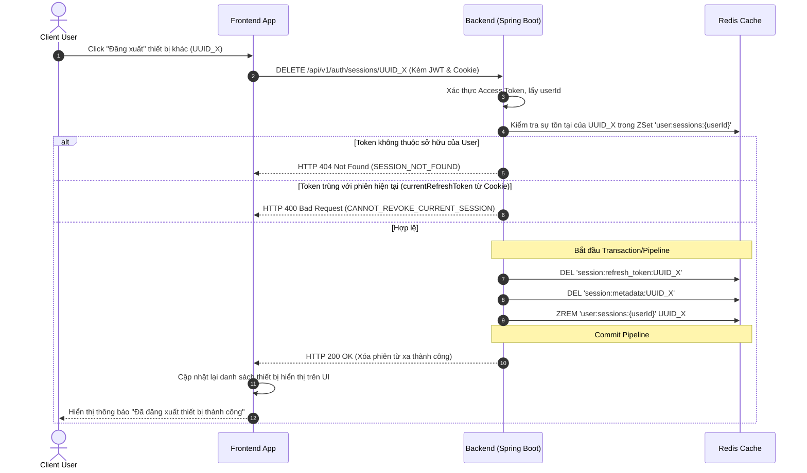
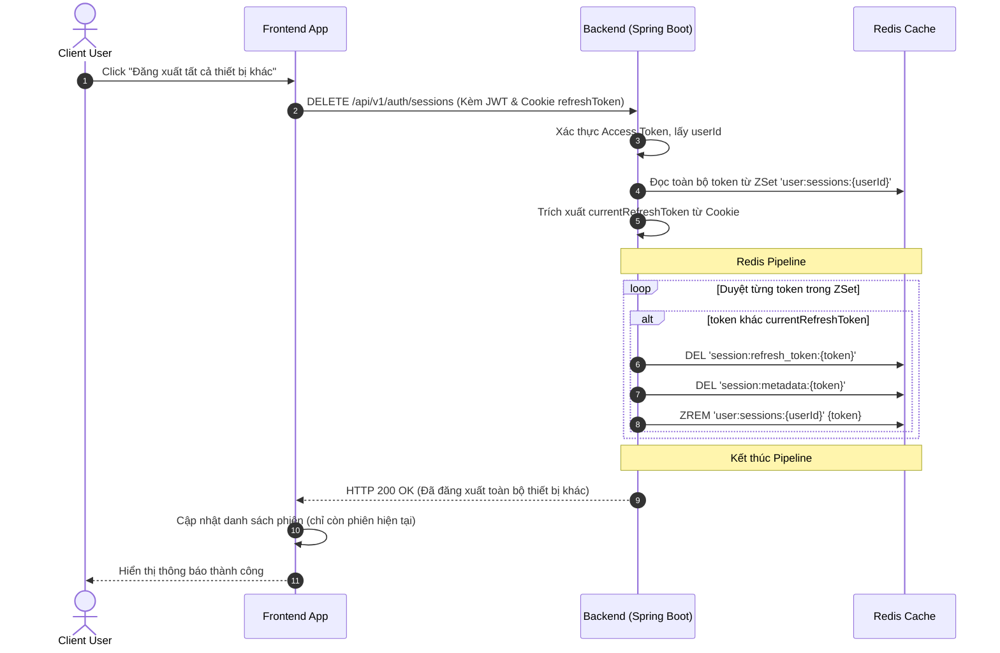
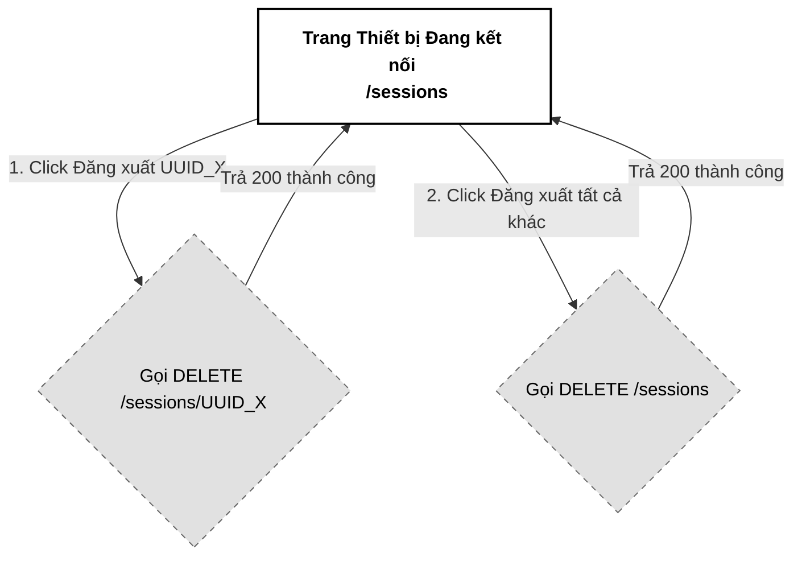

# 07. Quản lý Phiên Hoạt động (Active Sessions Management)

Tài liệu đặc tả A-Z tính năng Quản lý Phiên hoạt động (Active Sessions Management) của hệ thống PWB MiNi, cho phép người dùng tự theo dõi danh sách thiết bị đang online và chủ động hủy kết nối từ xa (Remote Session Revocation) để tối ưu hóa bảo mật.

---

## 📋 1. Business & Requirements (Nghiệp vụ & Yêu cầu)

### 1.1. Mô tả Nghiệp vụ (User Story / Use Case)
*   **Đối tượng thực hiện**: Người dùng đã đăng nhập (ACTIVE).
*   **Quy trình tóm tắt**:
    *   *Xem danh sách phiên*: Người dùng truy cập trang quản lý bảo mật, Frontend gọi `GET /api/v1/auth/sessions` lấy danh sách các phiên đăng nhập đang online (gồm thiết bị, trình duyệt, địa chỉ IP, địa điểm định vị GeoIP, thời điểm đăng nhập, và cờ đánh dấu phiên hiện tại).
    *   *Đăng xuất một thiết bị cụ thể*: Người dùng nhấn nút "Đăng xuất" bên cạnh một thiết bị lạ. Backend thu hồi Refresh Token tương ứng và xóa khỏi Redis Cache.
    *   *Đăng xuất toàn bộ các thiết bị khác*: Người dùng nhấn nút "Đăng xuất tất cả thiết bị khác" để xóa sạch mọi phiên hoạt động khác, chỉ giữ lại duy nhất phiên đang sử dụng.

### 1.2. Quy tắc Nghiệp vụ (Business Rules)

#### A. Định danh phiên trong Cache
*   Danh sách phiên của một người dùng được quản lý tập trung trong Redis ZSet `user:sessions:{userId}`. Điểm số (Score) của mỗi phần tử là mốc thời gian đăng nhập (`timestamp`).
*   Để lấy đầy đủ thông tin mô tả chi tiết của từng phiên (như IP, Device, Location), hệ thống lưu trữ thông tin bổ sung trong cấu trúc Redis Hash `session:metadata:{tokenUuid}` với TTL 7 ngày (đồng bộ với thời hạn Refresh Token).

#### B. Cơ chế Đăng xuất từ xa (Remote Session Revocation)
*   Khi người dùng yêu cầu hủy một phiên `tokenUuid` cụ thể:
    *   Hệ thống kiểm tra `tokenUuid` này có thuộc quyền sở hữu của `userId` hiện tại hay không bằng cách kiểm tra sự tồn tại trong ZSet `user:sessions:{userId}`.
    *   Thực hiện xóa khóa phiên `session:refresh_token:{tokenUuid}` và khóa metadata `session:metadata:{tokenUuid}` trên Redis.
    *   Xóa bản ghi khỏi ZSet `user:sessions:{userId}`.
*   **Hiệu ứng ở thiết bị bị xóa**: Thiết bị đó sẽ không thể tiếp tục thực hiện API `/refresh` khi Access Token hết hạn, buộc trình duyệt phải đá người dùng ra trang `/login`.
*   **Chặn tự hủy phiên hiện tại**: Backend **bắt buộc** kiểm tra `tokenUuid` không được trùng với Refresh Token hiện tại của người dùng (lấy từ Cookie `refreshToken`). Nếu trùng, trả lỗi HTTP 400 (`CANNOT_REVOKE_CURRENT_SESSION`). Điều này chống việc attacker gọi trực tiếp API bypass UI.

#### C. Đăng xuất tất cả các thiết bị khác (Exclude Current Session)
*   Khi người dùng nhấn "Đăng xuất thiết bị khác", hệ thống trích xuất UUID của phiên hiện tại từ Cookie `refreshToken`.
*   Duyệt qua danh sách token trong ZSet `user:sessions:{userId}`, thực hiện xóa tất cả các token khác UUID hiện tại khỏi Redis Cache và ZSet.

---

### 1.3. Quy tắc Xác thực Dữ liệu (Validation Rules)
*   API hủy phiên cụ thể nhận tham số đường dẫn (Path Variable) dạng UUID:
    *   `tokenUuid`: Bắt buộc, đúng định dạng UUID v4.

---

### 1.4. Giới hạn Tần suất Truy cập API (IP Rate Limiting)

| API Endpoint | Giới hạn | Mô tả |
| :--- | :--- | :--- |
| `GET /api/v1/auth/sessions` | **30 requests / phút / IP** | Hạn chế spam truy vấn danh sách phiên |
| `DELETE /api/v1/auth/sessions/{tokenUuid}` | **10 requests / phút / IP** | Ngăn chặn spam gửi lệnh xóa phiên liên tục |
| `DELETE /api/v1/auth/sessions` | **5 requests / phút / IP** | Hạn chế spam dọn dẹp phiên đồng loạt |

---

## 🔄 2. User Flow & Sequence Diagram (Luồng người dùng & Sơ đồ tuần tự)

### 2.1. Luồng Thu hồi Phiên cụ thể từ xa (Remote Session Revocation)



##### 📝 Mô tả chi tiết các bước xử lý:
1.  **Hành động**: Người dùng xem danh sách và nhấn nút "Đăng xuất" một thiết bị khác (có mã UUID_X).
2.  **Gọi API**: Frontend gửi yêu cầu `DELETE /api/v1/auth/sessions/UUID_X` lên Backend kèm JWT.
3.  **Đối chiếu quyền sở hữu**: Backend kiểm tra xem UUID_X có nằm trong danh sách ZSet quản lý của User hay không. Nếu không, trả lỗi HTTP 404 để bảo mật. Nếu UUID_X trùng với Refresh Token hiện tại (từ Cookie), trả lỗi HTTP 400 (`CANNOT_REVOKE_CURRENT_SESSION`) để chặn user tự xóa phiên mình.
4.  **Xóa Cache**: Sử dụng Redis Pipeline để vô hiệu hóa hoàn toàn Refresh Token, metadata của phiên UUID_X và xóa bản ghi khỏi danh sách phiên hoạt động của user. Trả về kết quả HTTP 200 thành công để Frontend cập nhật danh sách hiển thị.

---

### 2.2. Luồng Đăng xuất toàn bộ các thiết bị khác (Revoke All Others Flow)



---

## 💾 3. Database & Cache Schema (Thiết kế Cơ sở Dữ liệu & Cache)

### 3.1. Cấu trúc dữ liệu Redis bổ sung (Metadata & Session control)

| Định dạng Khóa (Redis Key) | Kiểu dữ liệu | Giá trị (Value) | TTL | Mục đích sử dụng |
| :--- | :--- | :--- | :--- | :--- |
| `session:metadata:{tokenUuid}` | `Hash` | `ip`, `browser`, `os`, `location`, `createdAt` | **7 ngày** | Lưu thông tin chi tiết thiết bị, địa lý của phiên phục vụ hiển thị. |

---

## 🔌 4. API Specifications (Đặc tả API)

### 4.0. Cấu hình Chung
*   **Base Path**: `/api/v1/auth`
*   **Headers**: `Authorization: Bearer <accessToken>`
*   **Format Phản Hồi**: Hệ thống đồng nhất sử dụng cấu trúc `ApiResponse<T>` chuẩn hóa theo quy ước dự án:
    *   **Thành công**: Trả về Http Code thích hợp cùng JSON body chứa `success: true`, `message`, `data`, `errors: null` và `timestamp` (ISO 8601).
    *   **Thất bại**: Trả về Http Code lỗi, JSON body chứa `success: false`, `message`, `data: null`, `errors` và `timestamp`.

---

### 4.1. API Lấy danh sách phiên đang online (List Active Sessions)
*   **Method**: `GET`
*   **Path**: `/api/v1/auth/sessions`
*   **Auth Level**: `Requires Authentication`
*   **Headers**: Kèm Cookie `refreshToken` (để đối khớp phiên hiện tại)

#### Response Thành công (200 OK):
```json
{
  "success": true,
  "message": "Lấy danh sách phiên hoạt động thành công",
  "data": [
    {
      "sessionUuid": "8f8b5f36-3a78-43d9-9524-34e803c4f2bb",
      "ipAddress": "1.2.3.4",
      "deviceInfo": "Chrome 124 (Windows 11)",
      "location": "Hà Nội, Việt Nam",
      "createdAt": "2026-07-01T10:00:00Z",
      "isCurrent": true
    },
    {
      "sessionUuid": "9a8b7c6d-3a78-43d9-9524-34e803c4f2cc",
      "ipAddress": "115.79.1.5",
      "deviceInfo": "Safari (iOS 17)",
      "location": "Hồ Chí Minh, Việt Nam",
      "createdAt": "2026-06-30T15:20:00Z",
      "isCurrent": false
    }
  ],
  "errors": null,
  "timestamp": "2026-07-01T12:00:00Z"
}
```

---

### 4.2. API Đăng xuất một phiên bất kỳ từ xa (Revoke Session)
*   **Method**: `DELETE`
*   **Path**: `/api/v1/auth/sessions/{tokenUuid}`
*   **Auth Level**: `Requires Authentication`

#### Response Thành công (200 OK):
```json
{
  "success": true,
  "message": "Thu hồi phiên đăng nhập thành công",
  "data": null,
  "errors": null,
  "timestamp": "2026-07-01T12:05:00Z"
}
```

---

### 4.3. API Đăng xuất toàn bộ các thiết bị khác (Revoke Other Sessions)
*   **Method**: `DELETE`
*   **Path**: `/api/v1/auth/sessions`
*   **Auth Level**: `Requires Authentication`
*   **Headers**: Kèm Cookie `refreshToken` (để hệ thống chừa lại phiên này)

#### Response Thành công (200 OK):
```json
{
  "success": true,
  "message": "Đã đăng xuất toàn bộ thiết bị khác thành công",
  "data": null,
  "errors": null,
  "timestamp": "2026-07-01T12:10:00Z"
}
```

---

### 4.4. Phụ lục Mã Lỗi Nghiệp Vụ (Error Codes)

Mỗi lỗi nghiệp vụ được định nghĩa trong `ErrorCode` Enum với HTTP Status tương ứng:

| Http Status | Error Code (String) | Mô tả | Trường liên quan (`field`) |
| :--- | :--- | :--- | :--- |
| `404 Not Found` | `SESSION_NOT_FOUND` | Phiên yêu cầu không tồn tại hoặc không thuộc về người dùng này | `tokenUuid` |
| `400 Bad Request` | `CANNOT_REVOKE_CURRENT_SESSION` | Không thể tự hủy phiên đang sử dụng, sử dụng chức năng Đăng xuất | `tokenUuid` |
| `429 Too Many Requests` | `RATE_LIMIT_EXCEEDED` | Vượt quá giới hạn tần suất truy cập API | `null` |

---

## 🎨 5. UI/UX & Frontend Integration Notes (Giao diện & Tích hợp)

### 5.1. Thiết kế Giao diện quản lý phiên (Grayscale Theme)
*   **Bảng phiên đăng nhập**: Hiển thị danh sách dạng thẻ dọc hoặc bảng phẳng. Tương thích Monochrome: Nền trắng, viền xám nhạt, sử dụng icon đơn sắc cho trình duyệt/thiết bị (ví dụ: Icon Máy tính cho PC, Điện thoại cho Mobile).
*   **Đánh dấu phiên hiện tại**: Phiên hiện tại (`isCurrent = true`) hiển thị nhãn `[Thiết bị này]` in đậm mờ, không hiển thị nút "Đăng xuất" để tránh người dùng tự xóa chính mình bằng API này.
*   **Nút đăng xuất hàng loạt**: Thiết kế nút "Đăng xuất tất cả thiết bị khác" viền đen chữ trắng phẳng nổi bật ở góc bảng.

---

### 5.2. Sơ đồ Luồng Màn hình (Screen Flow)



---

## 📊 6. Logging & Observability (Ghi nhận Nhật ký & Giám sát)

### 6.1. Log Points (Các điểm ghi log)

| Level | Sự kiện | Payload mẫu |
| :--- | :--- | :--- |
| `INFO` | List active sessions requested | `{"event": "LIST_SESSIONS_REQUEST", "userId": "c8b74f51-..."}` |
| `WARN` | Session revoked remotely | `{"event": "REMOTE_SESSION_REVOKED", "userId": "c8b74f51-...", "revokedTokenUuid": "9a8b7c6d-..."}` |
| `WARN` | All other sessions revoked | `{"event": "ALL_OTHER_SESSIONS_REVOKED", "userId": "c8b74f51-...", "kickedTokensCount": 2}` |
| `ERROR` | Remote session revoke unauthorized attempt | `{"event": "REVOKE_SESSION_UNAUTHORIZED", "userId": "c8b74f51-...", "attemptedTokenUuid": "9a8b7c6d-..."}` |
