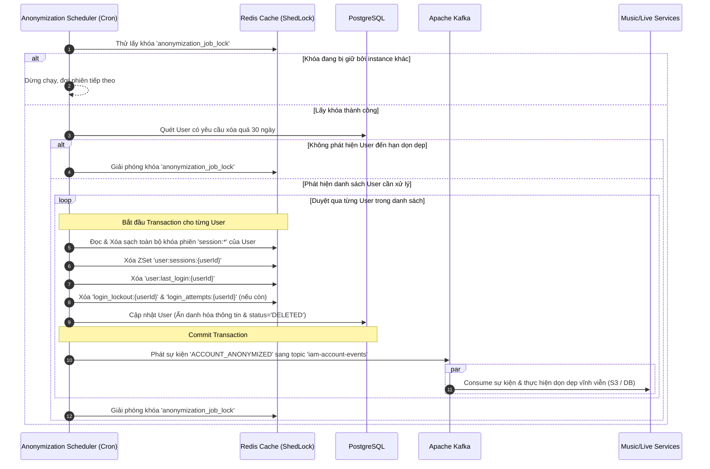

# 08. Tự động Ẩn danh hóa Tài khoản sau 30 ngày (Account Anonymization Job)

Tài liệu đặc tả kiến trúc và quy trình kỹ thuật cho tiến trình nền tự động ẩn danh hóa tài khoản người dùng sau 30 ngày chờ xóa (Account Anonymization Background Job) của hệ thống PWB MiNi, đáp ứng nghiêm ngặt tiêu chuẩn bảo mật dữ liệu GDPR (General Data Protection Regulation).

---

## 📋 1. Business & Requirements (Nghiệp vụ & Yêu cầu)

### 1.1. Mô tả Nghiệp vụ (Background Process Overview)
*   **Mục tiêu**: Tự động dọn dẹp các tài khoản người dùng đã gửi yêu cầu xóa quá 30 ngày đóng băng.
*   **Nguyên tắc xử lý**:
    *   *Không xóa cứng bản ghi*: Để bảo toàn tính toàn vẹn của cơ sở dữ liệu (các bản ghi lịch sử mua bán, thanh toán, thời lượng phòng thu Live Room, báo cáo thống kê kết nối với `userId` không bị lỗi khóa ngoại `Foreign Key Constraints`).
    *   *Ẩn danh hóa thông tin (Anonymization)*: Toàn bộ thông tin định danh cá nhân (Personally Identifiable Information - PII) sẽ bị ghi đè bằng dữ liệu ngẫu nhiên hoặc giá trị rỗng (`null`). Tài khoản sau khi xử lý sẽ vĩnh viễn không thể khôi phục hay liên hệ ngược lại với người dùng cũ.
    *   *Cho phép tái ký*: Email và Username cũ của người dùng sau khi ẩn danh hóa sẽ được giải phóng hoàn toàn, cho phép người dùng cũ (hoặc người dùng khác) đăng ký tài khoản mới bằng chính email/username đó mà không bị báo lỗi trùng lặp.

### 1.2. Quy tắc Nghiệp vụ (Business Rules)

#### A. Điều kiện quét dữ liệu
*   Tiến trình chạy định kỳ hàng ngày quét toàn bộ bảng `users` trong PostgreSQL tìm các bản ghi thỏa mãn điều kiện:
    *   `status = 'PENDING_DELETION'`
    *   `deletion_requested_at <= (Thời điểm hiện tại - 30 ngày)`

#### B. Quy trình xử lý ẩn danh hóa chi tiết (Anonymization Steps)
Đối với mỗi tài khoản User đạt điều kiện dọn dẹp, Backend thực thi chuỗi hành động nguyên tử (Atomic Database Transaction):
1.  **Hủy phiên hoạt động (Cache Invalidation)**:
    *   Lấy toàn bộ Refresh Token của User trong Redis ZSet `user:sessions:{userId}`.
    *   Xóa toàn bộ các key `session:refresh_token:{token}` và `session:metadata:{token}` khỏi Redis Cache.
    *   Xóa ZSet `user:sessions:{userId}`.
    *   Xóa key `user:last_login:{userId}` (Hash chứa IP/device/location — dữ liệu PII).
    *   Xóa các key brute-force protection: `login_lockout:{userId}` và `login_attempts:{userId}` (nếu còn tồn tại) để dọn sạch trạng thái tài khoản.
2.  **Ẩn danh hóa thông tin PostgreSQL**:
    *   `username` = Cập nhật thành chuỗi ngẫu nhiên không trùng lặp: `deleted_user_{userId}` (hoặc UUID).
    *   `email` = Cập nhật thành: `deleted_{userId}@pwbmini.com`.
    *   `password` = Cập nhật thành `null` (triệt tiêu khả năng đăng nhập cục bộ).
    *   `fullName` = Cập nhật thành `null`.
    *   `phone` = Cập nhật thành `null`.
    *   `avatarUrl` = Cập nhật thành `null`.
    *   `oauth_provider` = Cập nhật thành `null`.
    *   `oauth_id` = Cập nhật thành `null` (triệt tiêu khả năng đăng nhập Google/Social).
    *   `status` = Cập nhật thành trạng thái vĩnh viễn `DELETED`.
    *   `deleted` = Cập nhật thành `true` (kích hoạt cờ soft-delete).

#### C. Ràng buộc chạy tiến trình (Concurrency Control)
*   Trong môi trường triển khai thực tế với nhiều instance Backend chạy song song (Clustered/Distributed Environment), tiến trình nền **chỉ được phép thực thi trên duy nhất 1 instance tại cùng 1 thời điểm**.
*   Hệ thống sử dụng thư viện **ShedLock** lưu khóa trên **Redis** (`Shedlock:anonymization_job_lock`) để điều phối và khóa tiến trình. Cấu hình khóa bắt buộc phải khai báo cả hai tham số ràng buộc:
    *   `lockAtMostFor`: **10 phút** (Thời gian khóa tối đa để tự động giải phóng nếu instance chạy bị crash giữa chừng).
    *   `lockAtLeastFor`: **30 giây** (Thời gian giữ khóa tối thiểu. Ràng buộc này ngăn ngừa lỗi Clock Skew - lệch trục đồng hồ đồng bộ giữa các App Servers khi Job hoàn thành siêu tốc chỉ mất vài mili-giây, ngăn chặn Job bị kích hoạt thực thi lặp lại trên node khác).

#### D. Sự kiện tích hợp hệ thống (System Integration Events)
*   Để đảm bảo tính tách biệt giữa các service trong Backend, tiến trình nền không tự ý truy cập trực tiếp các bảng dữ liệu thuộc service khác để dọn dẹp dữ liệu nghiệp vụ của User.
*   Sau khi Database Transaction ẩn danh hóa User thành công và được Commit, Job **bắt buộc** phải phát một sự kiện kết thúc luồng mang tên `ACCOUNT_ANONYMIZED` sang Apache Kafka topic `iam-account-events`.
*   Các module chuyên trách khác như Music (quản lý nhạc demo) và Live (quản lý live room) sẽ lắng nghe (Consume) sự kiện này để tiến hành dọn dẹp vĩnh viễn dữ liệu liên quan thuộc quyền sở hữu của user (ví dụ: Ra lệnh xóa tệp nhạc vật lý trên AWS S3, hard delete các bản ghi nháp, hoặc ẩn danh hóa/xóa thông tin tác giả trong các bảng lưu trữ nghiệp vụ tương ứng).

---

## 🔄 2. Workflow & Technical Architecture (Quy trình & Kiến trúc)

### 2.1. Sơ đồ Luồng Tiến trình nền (Anonymization Background Job Flow)



##### 📝 Mô tả chi tiết các bước xử lý:
1.  **Kích hoạt Scheduler**: Một biểu thức Cron cấu hình cho `@Scheduled` tự động kích hoạt tiến trình (ví dụ: 02:00 AM hàng ngày).
2.  **Khóa ShedLock**: Scheduler gửi yêu cầu lấy khóa `anonymization_job_lock` trên Redis. Node server nào giữ khóa trước sẽ tiếp tục xử lý, các node khác tự động bỏ qua.
3.  **Quét Database**: Thực hiện truy vấn PostgreSQL lấy danh sách các user thỏa mãn điều kiện đã chờ quá 30 ngày.
4.  **Thực thi Ẩn danh hóa**: Duyệt qua từng User, bọc trong một Transaction độc lập:
    *   Hủy toàn bộ Session, metadata, và các key PII (`user:last_login:{userId}`, `login_lockout:{userId}`, `login_attempts:{userId}`) của user đó trên Redis.
    *   Cập nhật ghi đè các trường thông tin PII thành `null` hoặc chuỗi an toàn `deleted_user_{userId}`, chuyển status sang `DELETED` và `deleted = true`.
    *   Sau khi commit Database Transaction, Job phát sự kiện `ACCOUNT_ANONYMIZED` sang topic `iam-account-events` trên Kafka. Các module Music và Live sẽ lắng nghe để thực hiện xóa file nhạc trên AWS S3 và dọn dẹp vĩnh viễn các dữ liệu liên quan.
5.  **Giải phóng khóa**: Kết thúc batch, tiến trình giải phóng khóa ShedLock trên Redis.

> **Lưu ý về Batch Size**: Để tránh việc xử lý quá nhiều user cùng lúc (ví dụ: 10,000 user đến hạn) khiến Job vượt ShedLock TTL 10 phút, hệ thống nên cấu hình **batch size tối đa** (ví dụ: 100 users/batch). Nếu số lượng vượt batch size, các bản ghi còn lại sẽ được xử lý trong lần chạy Cron tiếp theo.

---

## 💾 3. Database & Cache Schema (Thiết kế Cơ sở Dữ liệu)

### 3.1. ShedLock Table (PostgreSQL / Redis)
*   Do hệ thống sử dụng Redis làm cache tập trung, ShedLock sẽ được cấu hình lưu khóa trực tiếp trên Redis dưới dạng key:
    *   Key: `Shedlock:anonymization_job_lock`
    *   Value: `tên instance đang chạy`
    *   `lockAtMostFor`: **10 phút** (TTL tối đa của key để tự động giải phóng nếu instance chạy bị crash giữa chừng).
    *   `lockAtLeastFor`: **30 giây** (Thời gian giữ khóa tối thiểu kể cả khi tiến trình kết thúc ngay lập tức, ngăn ngừa lỗi Clock Skew kích hoạt lại Job trên node khác).

---

## 🔌 4. API Specifications (Đặc tả API)

Tiến trình này chạy ngầm phía Backend, **không cung cấp API public**. Tuy nhiên, Backend cung cấp 1 endpoint nội bộ (Internal/Admin Only) có bảo mật để điều hành hoặc kích hoạt chạy thủ công (Manual Trigger) khi cần thiết:

*   **Method**: `POST`
*   **Path**: `/api/v1/admin/jobs/trigger-anonymization`
*   **Auth Level**: `Requires Role ADMIN`

#### Response Thành công (200 OK):
```json
{
  "success": true,
  "message": "Kích hoạt chạy tiến trình ẩn danh hóa thành công",
  "data": {
    "processedUsersCount": 14,
    "executionTimeMs": 1250,
    "status": "COMPLETED"
  },
  "errors": null,
  "timestamp": "2026-07-01T02:00:00Z"
}
```

---

## 📊 5. Logging & Observability (Ghi nhận Nhật ký & Giám sát)

Do đây là tiến trình chạy tự động không có tương tác trực tiếp của người dùng, hệ thống log là kênh duy nhất để giám sát sức khỏe của Job.

### 5.1. Log Points (Các điểm ghi log)

| Level | Sự kiện | Payload mẫu |
| :--- | :--- | :--- |
| `INFO` | Job started | `{"event": "ANONYMIZATION_JOB_STARTED", "instance": "backend-1"}` |
| `INFO` | User anonymized successfully | `{"event": "USER_ANONYMIZED_SUCCESS", "userId": "c8b74f51-..."}` |
| `INFO` | Job finished | `{"event": "ANONYMIZATION_JOB_FINISHED", "processedUsers": 14, "durationMs": 1250}` |
| `WARN` | Lock already held | `{"event": "ANONYMIZATION_JOB_LOCK_HELD", "message": "ShedLock lock is already held by another instance"}` |
| `ERROR` | Individual user processing failed | `{"event": "USER_ANONYMIZATION_FAILED", "userId": "c8b74f51-...", "error": "Optimistic lock failure"}` |

### 5.2. Hướng dẫn Giám sát (Monitoring Metrics)
*   **Sử dụng Micrometer / Prometheus**: Xuất các metric đo lường tốc độ xử lý:
    *   `job_anonymization_duration_seconds`: Thời gian chạy của Job.
    *   `job_anonymization_processed_users_total`: Tổng số tài khoản đã ẩn danh hóa.
    *   `job_anonymization_errors_total`: Số lượng lỗi phát sinh khi xử lý.
