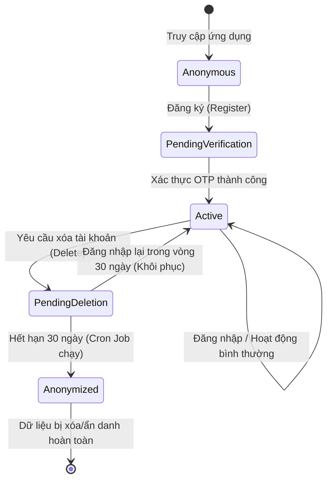
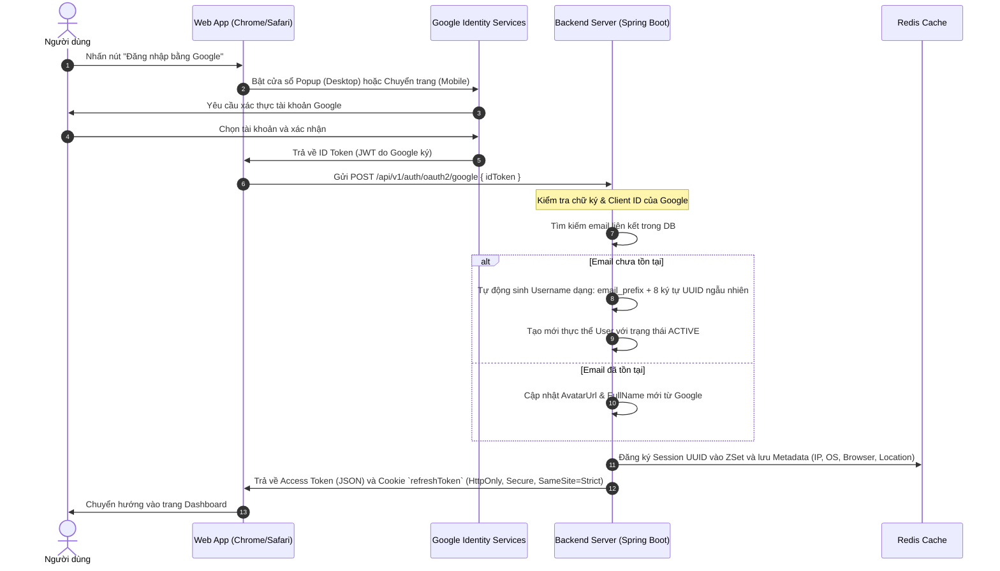
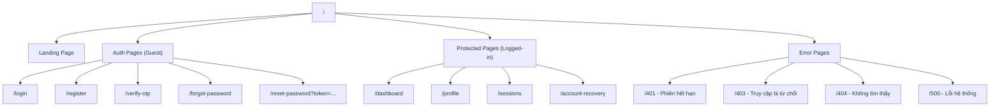

# Đặc tả Luồng màn hình & Điều hướng tổng quan (UI Flow & Navigation)

Tài liệu này đặc tả luồng tương tác tổng quan, cấu trúc trang (Site Map), các quy tắc chuyển hướng bảo mật (Redirect Matrix), và quy trình đăng nhập OAuth2 trên các thiết bị Mobile, Tablet, và Desktop.

---

## 1. Sơ đồ luồng trạng thái Người dùng (User State Flow)

Quy trình trạng thái của người dùng từ khi chưa đăng ký cho đến khi tài khoản được kích hoạt, đăng nhập và xóa.

---

## 2. Ma trận tự động điều hướng (Redirect Matrix)

Để đảm bảo trải nghiệm người dùng tối ưu và an toàn, hệ thống tự động kiểm tra trạng thái token và chuyển hướng thích hợp:

| Trạng thái hiện tại | Trang đang cố truy cập | Điều hướng đến | Lý do / UX |
| :--- | :--- | :--- | :--- |
| **Chưa đăng nhập** | `/dashboard`, `/profile`, `/settings` | `/login` | Yêu cầu xác thực. Hiển thị Toast cảnh báo: *"Vui lòng đăng nhập để tiếp tục"* |
| **Đã đăng nhập (Active)** | `/login`, `/register`, `/forgot-password` | `/dashboard` | Đã xác thực, không cần đăng nhập lại. Chuyển hướng âm thầm. |
| **Đang chờ OTP (Pending)** | Đăng nhập bằng pass cũ | `/verify-otp` | Tài khoản chưa kích hoạt. Tự động chuyển hướng đến trang OTP và điền sẵn email. |
| **Phát hiện Trộm Token (Token Theft)** | Bất kỳ trang nào | `/login` | Hệ thống tự động thu hồi tất cả phiên. Chuyển hướng ngay lập tức và hiển thị Toast: *"Phiên đăng nhập hết hạn hoặc bị nghi ngờ, vui lòng đăng nhập lại"* |
| **Chờ xóa (Pending Deletion)** | Thực hiện Đăng nhập | `/account-recovery` | Đăng nhập thành công → ép điều hướng sang trang khôi phục tài khoản. Chỉ cho phép 2 hành động: "Hủy yêu cầu xóa" hoặc "Đăng xuất". |
| **Token hết hạn + Refresh thất bại** | Bất kỳ trang nào | `/login` (trang 401) | Xóa token cũ, hiển thị trang 401 với nút "Đăng nhập lại". |
| **Truy cập bị từ chối (Role)** | Trang yêu cầu role cao hơn | Trang 403 | Hiển thị thông báo không đủ quyền hạn + nút "Quay về Dashboard". |
| **URL không tồn tại** | Đường dẫn bất kỳ không khớp | Trang 404 | Hiển thị thông báo trang không tồn tại + nút "Quay về Trang chủ". |

---

## 3. Quy trình Đăng nhập Google OAuth2 (Sequence Diagram)

Quy trình đăng nhập bằng Google trên đa thiết bị:

---

## 4. Tương thích Đa thiết bị (Multi-Device Navigation)

* **Menu Điều hướng (Navbar)**:
  - **Desktop / Tablet ngang**: Hiển thị menu dạng ngang cố định ở phía trên đầu trang.
  - **Mobile / Tablet dọc**: Menu ẩn vào nút **Hamburger Icon** (góc trên bên phải). Khi chạm vào sẽ mở ra một **Drawer** (trượt từ phải sang trái) chiếm 80% chiều rộng màn hình, đảm bảo ngón cái dễ dàng chạm tới tất cả các liên kết.
  - *Chi tiết wireframe*: Xem [03_shell_layout.md — Mục 2. Header / Navbar](./03_shell_layout.md).
* **Xử lý Quay lại (Back Button)**:
  - Các trang con như cập nhật Profile, đổi mật khẩu luôn có nút `< Quay lại` rõ ràng ở góc trên bên trái với kích thước vùng chạm tối thiểu `44x44px`.

---

## 5. Sơ đồ Cấu trúc Trang (Site Map)

Tổng quan tất cả các route thuộc module IAM:

### Ghi chú điều hướng:
* **Landing Page** (`/`): Nếu đã đăng nhập → redirect `/dashboard`.
* **Auth Pages**: Nếu đã đăng nhập → redirect `/dashboard`.
* **Protected Pages**: Nếu chưa đăng nhập → redirect `/login`.
* **Account Recovery** (`/account-recovery`): Chỉ hiển thị cho user `PENDING_DELETION`.
* **Profile** (`/profile`): Bao gồm cả form đổi mật khẩu (panel phải Desktop).

