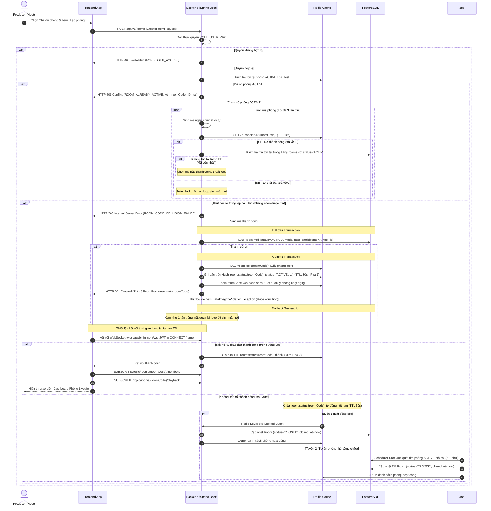
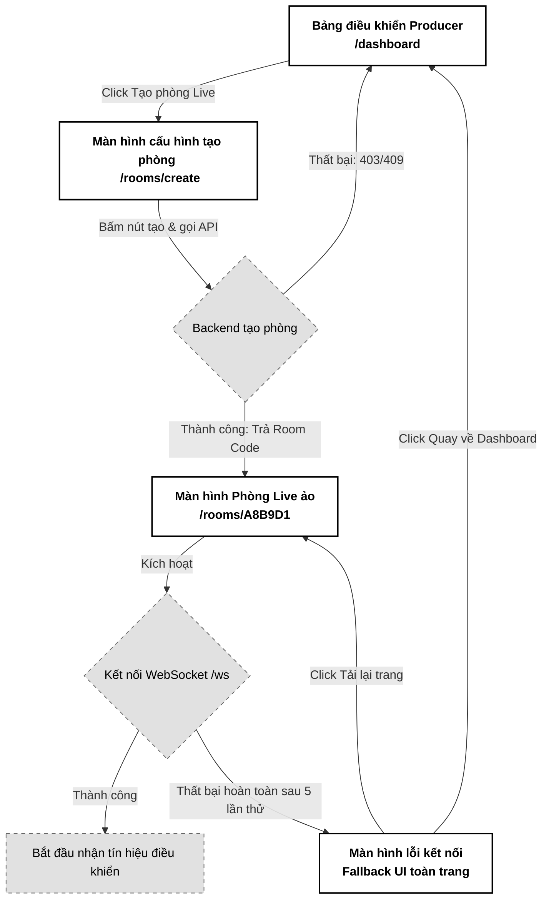

# 01. Khởi tạo & Cấu hình Phòng Live Room (Create & Configure Live Room)

Tài liệu đặc tả A-Z tính năng Khởi tạo và Cấu hình phòng Live Room dành cho Producer (Host), thiết lập các thuộc tính nền tảng, tạo mã phòng độc nhất và khởi động hệ thống liên lạc thời gian thực (WebSocket STOMP).

---

## 📋 1. Business & Requirements (Nghiệp vụ & Yêu cầu)

### 1.1. Mô tả Nghiệp vụ (User Story / Use Case)
*   **Đối tượng thực hiện**: Người dùng có quyền Producer (tài khoản đã nâng cấp lên gói Pro, sở hữu vai trò `ROLE_USER_PRO`).
*   **Quy trình tóm tắt**:
    1.  Producer truy cập màn hình quản lý, nhấn "Khởi tạo phòng Live Room".
    2.  Chọn chế độ vào phòng: Tự do (`OPEN`) hoặc Phê duyệt kiểm duyệt (`MODERATED`).
    3.  Hệ thống tạo mã phòng ngẫu nhiên 6 ký tự độc nhất (ví dụ: `A8B9D1`), lưu thông tin vào cơ sở dữ liệu Postgres và đưa trạng thái phòng hoạt động vào Redis Cache.
    4.  Hệ thống phản hồi thông tin phòng cho Client, tự động kích hoạt kết nối WebSocket STOMP của Producer (Host) tới server để sẵn sàng điều khiển.

### 1.2. Quy tắc Nghiệp vụ (Business Rules)

#### A. Phân quyền khởi tạo (Authorization)
*   Chỉ các tài khoản sở hữu vai trò **`ROLE_USER_PRO`** (Pro User / Producer) mới được quyền gọi API khởi tạo phòng Live Room.
*   Người dùng ở vai trò mặc định `ROLE_USER` khi thực hiện gọi API sẽ bị hệ thống từ chối ngay lập tức với mã HTTP `403 Forbidden` kèm mã lỗi `FORBIDDEN_ACCESS`.
*   **Giới hạn phòng hoạt động**: Mỗi Producer chỉ được phép có tối đa **1 phòng ACTIVE** tại bất kỳ thời điểm nào. Nếu đã tồn tại phòng ACTIVE, Backend trả lỗi HTTP `409 Conflict` (`ROOM_ALREADY_ACTIVE`) kèm thông tin `roomCode` của phòng đang hoạt động để Frontend điều hướng người dùng.

#### B. Cơ chế sinh mã phòng độc nhất & Chống Race Condition (Room Code Generation & Concurrency Control)
*   Mã phòng (Room Code) là một chuỗi gồm **6 ký tự chữ và số** viết hoa (không chứa các ký tự dễ nhầm lẫn như `0`, `O`, `1`, `I`), ví dụ: `A8B9D1`.
*   **Chống trùng lặp & Race Condition bằng khóa phân tán (Collision & Concurrency Control)**:
    1. Backend sinh mã ngẫu nhiên bằng `SecureRandom`.
    2. Để triệt tiêu hoàn toàn Race Condition khi nhiều thread cùng sinh và kiểm tra một mã phòng đồng thời, hệ thống sử dụng khóa phân tán Redis bằng lệnh `SETNX` (hoặc `setIfAbsent` trong Spring Data Redis) trên key tạm thời: `room:lock:{roomCode}` với TTL **10 giây**.
    3. Nếu `SETNX` trả về `1` (Thành công - giành được khóa), Backend tiếp tục kiểm tra sự tồn tại trong PostgreSQL (phòng có status = `ACTIVE`). Nếu mã chưa tồn tại, luồng này giữ quyền sở hữu mã phòng và tiến hành lưu DB. Sau khi lưu DB thành công, khóa tạm thời sẽ được chủ động xóa (`DEL`).
    4. Nếu `SETNX` trả về `0` (Thất bại - trùng mã/trùng khóa), hệ thống thực hiện sinh lại mã mới và thử lại (**tối đa 3 lần thử**).
    5. Nếu sau 3 lần vẫn thất bại, hệ thống trả lỗi HTTP 500 (`ROOM_CODE_COLLISION_FAILED`).
    6. **Vá lỗ hổng khóa hết hạn trước khi DB Commit**: Trường hợp DB Postgres bị nghẽn khiến Transaction ghi dữ liệu kéo dài quá 10 giây (vượt TTL khóa tạm Redis khiến khóa tự giải phóng, dẫn tới thread khác giành được lock ghi trùng mã), khi DB Transaction Commit sẽ ném ngoại lệ vi phạm ràng buộc duy nhất `DataIntegrityViolationException` (do DB có index duy nhất `idx_rooms_active_code`). Tầng Service bắt buộc phải bắt tường minh ngoại lệ này để ghi nhận là 1 lần trùng mã (Collision), kích hoạt sinh mã phòng mới và tự động thực hiện lại (Retry) vòng lặp lên tới 3 lần thay vì để sập request bùng ra lỗi 500 hệ thống.

#### C. Chế độ phòng (Room Modes)
*   **Chế độ OPEN (Vào tự do)**: Cho phép khách hàng có mã phòng tham gia thẳng mà không cần duyệt.
*   **Chế độ MODERATED (Kiểm duyệt)**: Khách hàng yêu cầu tham gia sẽ được xếp vào hàng chờ (Waiting List), chủ phòng phải nhấn duyệt mới được vào.

#### D. Giới hạn số lượng người kết nối (Participants Limit)
*   Mỗi phòng Live Room giới hạn tối đa **7 người kết nối đồng thời** (bao gồm 1 Host và tối đa 6 Listener) để bảo toàn chất lượng đàm thoại WebRTC Mesh (P2P). Ràng buộc này được lưu cấu hình mặc định trong DB và đồng bộ lên cache Redis.

#### E. Bảo mật kết nối WebSocket (WebSocket Security)
*   **Chống tấn công Slowloris (Handshake Timeout)**: Nhằm ngăn chặn kẻ tấn công mở hàng ngàn kết nối TCP/HTTP Upgrade tới endpoint `/ws` nhưng cố tình treo lơ lửng không gửi STOMP frame gây cạn kiệt Thread Pool của server:
    *   Hệ thống bắt buộc phải cấu hình Timeout cho quá trình Handshake/Kết nối STOMP.
    *   Nếu sau **10 giây** kể từ khi mở TCP socket mà server không nhận được frame `CONNECT` STOMP hợp lệ, Backend sẽ chủ động ngắt kết nối (force close) để giải phóng tài nguyên.

#### F. Cơ chế TTL 2 bước chống Phòng ma (Two-Phase TTL)
*   Để giải quyết trường hợp mạng Host bị đứt ngay sau khi tạo phòng thành công (dẫn tới phòng bị treo ở trạng thái `ACTIVE` trên DB và Redis suốt 4 tiếng, làm Host bị kẹt không thể tạo phòng mới):
    *   **Pha 1 (Chờ kết nối)**: Khi API `POST /rooms` tạo phòng thành công, Redis key `room:status:{roomCode}` chỉ được thiết lập TTL ngắn là **30 giây**.
    *   **Pha 2 (Kích hoạt phòng)**: Khi Host kết nối WebSocket thành công, Backend sẽ gia hạn TTL của key `room:status:{roomCode}` lên **4 giờ**.
    *   **Hết hạn/Hủy phòng**: Nếu sau 30 giây mà Host không kết nối WebSocket thành công, Redis key sẽ tự động hết hạn và bị xóa. Hệ thống sẽ lắng nghe sự kiện hết hạn qua Redis Keyspace Notification (hoặc tiến trình dọn dẹp chạy ngầm) để cập nhật trạng thái phòng dưới Database Postgres thành `CLOSED`, giải phóng quyền tạo phòng cho Host.
    *   **Tuyến phòng thủ vững chắc (Scheduler Cron Job)**: Do cơ chế Redis Keyspace Notifications hoạt động không tin cậy và không đảm bảo phân phối tin nhắn thành công (At-Most-Once Delivery, dễ bị mất sự kiện khi mạng chập chờn hoặc JVM GC Pause), hệ thống bắt buộc phải cấu hình một bộ lập lịch chạy ngầm (Scheduler Cron Job) định kỳ mỗi 1-2 phút để quét DB Postgres. Bộ lập lịch này tìm các phòng có `status = 'ACTIVE'` và `created_at` quá 1 phút nhưng không còn tồn tại key `room:status:{roomCode}` trên Redis (do chưa kết nối WebSocket kịp thời nên key đã tự hủy) để tự động cập nhật trạng thái DB thành `CLOSED`, bảo toàn tính toàn vẹn dữ liệu tuyệt đối.

---

### 1.3. Quy tắc Xác thực Dữ liệu (Validation Rules)

| Trường dữ liệu | Ràng buộc | Annotation (Backend) | Mô tả |
| :--- | :--- | :--- | :--- |
| `mode` | Bắt buộc, giá trị phải là `OPEN` hoặc `MODERATED` | `@NotNull` + Java Enum `RoomMode` | Chế độ phê duyệt khi khách hàng vào phòng (Jackson tự động reject giá trị không hợp lệ) |

---

### 1.4. Giới hạn Tần suất Truy cập API (IP Rate Limiting)

| API Endpoint | Giới hạn | Mô tả |
| :--- | :--- | :--- |
| `POST /api/v1/rooms` | **3 requests / phút / IP** | Ngăn chặn hành vi spam tạo phòng liên tục làm cạn kiệt tài nguyên mã phòng và quá tải DB |

---

## 🔄 2. User Flow & Sequence Diagram (Luồng người dùng & Sơ đồ tuần tự)

### 2.1. Luồng Khởi tạo phòng Live Room (Room Creation Flow)



##### 📝 Mô tả chi tiết các bước xử lý:
1.  **Gửi yêu cầu**: Producer thiết lập chế độ phòng (OPEN hoặc MODERATED) và click tạo. Frontend gửi `POST /api/v1/rooms` đính kèm Token JWT.
2.  **Kiểm tra quyền và giới hạn**: Backend xác thực Token và chỉ cho phép đi tiếp nếu User có vai trò `ROLE_USER_PRO`. Đồng thời kiểm tra xem Producer đã có phòng ACTIVE hay chưa — nếu đã có, trả HTTP 409 (`ROOM_ALREADY_ACTIVE`) kèm `roomCode` hiện tại.
3.  **Sinh mã phòng & Chống Race Condition**: Backend thực hiện vòng lặp (tối đa 3 lần) để sinh mã 6 chữ số/chữ viết hoa không trùng lặp. Tại mỗi lượt, Backend gửi lệnh `SETNX` lên Redis để giữ khóa tạm thời `room:lock:{roomCode}` (TTL 10 giây). Chỉ khi giành được khóa, Backend mới tiếp tục truy vấn DB để đảm bảo mã phòng là độc nhất trước khi tiến hành lưu trữ. Nếu thất bại sau 3 lần (bao gồm cả trường hợp bị trùng lặp khi check DB/Redis hoặc bị ném ngoại lệ vi phạm ràng buộc duy nhất do khóa hết hạn trước khi DB commit), hệ thống trả lỗi HTTP 500 (`ROOM_CODE_COLLISION_FAILED`).
4.  **Lưu Database & Cập nhật Redis Pha 1**: Lưu bản ghi phòng mới vào Postgres. Trường hợp xảy ra lỗi trùng khóa do latency làm trôi khóa tạm của Redis, Spring Boot bắt lỗi `DataIntegrityViolationException` để kích hoạt Retry. Nếu thành công, giải phóng khóa tạm thời và ghi thông tin trạng thái phòng lên Redis Hash với TTL ban đầu ngắn hạn là **30 giây** (Pha 1 - Chờ kết nối).
5.  **Kết nối WebSocket & Gia hạn Pha 2**: Frontend nhận Room Code, khởi tạo kết nối STOMP WebSocket tới cổng `/ws`. Khi nhận STOMP CONNECT hợp lệ của Host trong vòng 30s, Backend thực hiện gia hạn TTL của key `room:status:{roomCode}` lên **4 giờ** (Pha 2 - Hoạt động).
6.  **Xử lý Phòng ma (Timeout)**: Nếu sau 30 giây kể từ khi tạo phòng mà Host không thiết lập kết nối WebSocket thành công, Redis key `room:status:{roomCode}` sẽ tự hủy. Lúc này hệ thống tự động xử lý cập nhật trạng thái phòng dưới Database Postgres sang `CLOSED` qua 2 tuyến song song: (1) Nhận Expired Event từ Redis Keyspace Notification, và (2) Scheduler Cron Job định kỳ 1-2 phút quét DB tìm phòng ACTIVE mồ côi quá 1 phút không có kết nối thực sự trên Redis, đảm bảo an toàn tuyệt đối.

---

## 💾 3. Database & Cache Schema (Thiết kế Cơ sở Dữ liệu & Cache)

### 3.1. Sơ đồ thực thể Bảng `rooms` (PostgreSQL)

Bảng `rooms` được thiết kế để lưu vết lịch sử phòng ảo:

```sql
CREATE TABLE rooms (
    id UUID PRIMARY KEY,
    room_code VARCHAR(6) NOT NULL,
    host_id UUID NOT NULL,
    mode VARCHAR(15) NOT NULL, -- 'OPEN', 'MODERATED'
    status VARCHAR(15) NOT NULL, -- 'ACTIVE', 'CLOSED'
    max_participants INT NOT NULL DEFAULT 7,
    created_at TIMESTAMP NOT NULL,
    closed_at TIMESTAMP NULL,
    CONSTRAINT fk_rooms_host FOREIGN KEY (host_id) REFERENCES users(id)
);

-- Chỉ mục tối ưu hóa tìm kiếm phòng đang hoạt động
CREATE UNIQUE INDEX idx_rooms_active_code ON rooms(room_code) WHERE status = 'ACTIVE';
```

### 3.2. Cấu trúc dữ liệu Redis (Live Room State)

Khi phòng hoạt động, toàn bộ trạng thái thời gian thực được lưu trên Redis để xử lý tốc độ cao:

| Định dạng Khóa (Redis Key) | Kiểu dữ liệu | Trường dữ liệu (Fields) / Giá trị (Value) | TTL | Mục đích sử dụng |
| :--- | :--- | :--- | :--- | :--- |
| `room:status:{roomCode}` | `Hash` | `hostId`: UUID<br>`hostDisplayName`: String<br>`mode`: `OPEN`/`MODERATED`<br>`status`: `ACTIVE`<br>`maxParticipants`: `7`<br>`currentParticipants`: `1`<br>`activeSourceId`: `null`<br>`createdAt`: ISO 8601 | **30 giây** khi khởi tạo (Pha 1); gia hạn thành **4 giờ** sau khi Host kết nối WebSocket thành công (Pha 2). | Lưu trạng thái cấu hình và vận hành thời gian thực của phòng. |
| `room:lock:{roomCode}` | `String` | `"locked"` | **10 giây** | Khóa phân tán tạm thời dùng để chống trùng lặp mã phòng khi sinh đồng thời. |
| `room:host_disconnect:{roomCode}` | `String` | `"disconnected"` | **5 phút** | Khóa tạm được ghi khi Host mất kết nối WebSocket, đếm ngược cửa sổ 5 phút Grace Period để tự động dọn dẹp đóng phòng. |

---

## 🔌 4. API & WebSocket Specifications (Đặc tả API)

### 4.0. Cấu hình Chung
*   **Base Path**: `/api/v1`
*   **Headers**: `Authorization: Bearer <accessToken>`
*   **Format Phản Hồi**: Hệ thống đồng nhất sử dụng cấu trúc `ApiResponse<T>` chuẩn hóa theo quy ước dự án:
    *   **Thành công**: Trả về Http Code thích hợp cùng JSON body chứa `success: true`, `message`, `data` (payload kết quả), `errors: null` và `timestamp` (ISO 8601).
    *   **Thất bại**: Trả về Http Code lỗi, JSON body chứa `success: false`, `message`, `data: null`, `errors` (mảng chi tiết lỗi với `code`, `field`, `message`) và `timestamp`.

---

### 4.1. API Khởi tạo phòng Live Room (Create Room)
*   **Method**: `POST`
*   **Path**: `/api/v1/rooms`
*   **Auth Level**: `Requires ROLE_USER_PRO`

#### Request Body (`CreateRoomRequest`):
```json
{
  "mode": "MODERATED"
}
```

#### Response Thành công (201 Created):
```json
{
  "success": true,
  "message": "Khởi tạo phòng Live Room thành công",
  "data": {
    "roomCode": "A8B9D1",
    "hostId": "c8b74f51-3a78-43d9-9524-34e803c4f2bb",
    "hostDisplayName": "Nguyễn Đức Hoàng Nam",
    "mode": "MODERATED",
    "status": "ACTIVE",
    "maxParticipants": 7,
    "createdAt": "2026-07-01T14:45:00Z"
  },
  "errors": null,
  "timestamp": "2026-07-01T14:45:00Z"
}
```

#### Response Lỗi Không có Quyền (403 Forbidden):
```json
{
  "success": false,
  "message": "Tài khoản của bạn không có quyền thực hiện hành động này. Vui lòng nâng cấp lên tài khoản Pro.",
  "data": null,
  "errors": [
    {
      "code": "FORBIDDEN_ACCESS",
      "field": null,
      "message": "Yêu cầu vai trò ROLE_USER_PRO"
    }
  ],
  "timestamp": "2026-07-01T14:45:00Z"
}
```

---

### 4.2. Đặc tả Kênh Kết nối thời gian thực (WebSocket STOMP)

Sau khi tạo phòng thành công, Frontend thiết lập kết nối WebSocket thông qua giao thức STOMP để truyền tin nhắn điều khiển thời gian thực:

*   **WebSocket Endpoint**: `wss://pwbmini.com/ws` (bắt buộc TLS trong môi trường Production)
*   **Xác thực kết nối**: Frontend gửi Access Token JWT trong STOMP `CONNECT` frame header `Authorization: Bearer <token>`. Backend sử dụng `ChannelInterceptor` xác thực token trước khi cho phép kết nối. Kết nối không có token hợp lệ bị từ chối ngay lập tức.
*   **Bảo mật kết nối (Handshake Timeout)**: Server cấu hình giới hạn tối đa **10 giây** kể từ khi mở TCP/HTTP Upgrade socket. Nếu không nhận được frame STOMP `CONNECT` hợp lệ trong 10s này, Server sẽ chủ động ngắt kết nối WebSocket (force close) để chống tấn công DoS Slowloris.
*   **Kích hoạt phòng & Gia hạn TTL (Two-Phase TTL)**: Khi nhận STOMP `CONNECT` hợp lệ của Host, Backend thực hiện gia hạn TTL của key `room:status:{roomCode}` từ **30 giây** lên **4 giờ**.
*   **Kênh Đăng ký nhận tin (Subscribe Topics)**:
    *   `/topic/rooms/{roomCode}/members`: Nhận danh sách cập nhật thành viên online, sự kiện tham gia/rời phòng.
    *   `/topic/rooms/{roomCode}/playback`: Nhận lệnh đồng bộ trạng thái trình phát nhạc (Play/Pause/Seek).
    *   `/topic/rooms/{roomCode}/chat`: Nhận tin nhắn chat tạm thời từ các thành viên trong phòng *(sẽ được đặc tả chi tiết trong bài riêng)*.
*   **Auto-Reconnect & Heartbeat & Host Grace Period**:
    *   Frontend thực hiện reconnect tự động với **exponential backoff** (1s → 2s → 4s → tối đa 30s) khi kết nối bị đứt. Giới hạn tối đa **5 lần** thử lại (xem chi tiết mục 5.3).
    *   STOMP Heartbeat: cấu hình `heartbeat-incoming: 10000ms`, `heartbeat-outgoing: 10000ms` để phát hiện kết nối chết.
    *   **Cơ chế Grace Period của Host dùng Redis TTL (Tránh rò rỉ RAM)**: Để tránh việc tạo các luồng hẹn giờ chạy ngầm động (Dynamic Java Schedulers) trong bộ nhớ gây rò rỉ RAM khi có hàng ngàn phòng chạy đồng thời, hệ thống tận dụng hạ tầng Redis để đếm ngược:
        1. Ngay khi nhận sự kiện Host bị ngắt kết nối WebSocket (`DisconnectEvent`), Backend sinh một khóa tạm trên Redis: `room:host_disconnect:{roomCode}` với TTL đúng **5 phút**, đồng thời đánh dấu trạng thái phòng là `INACTIVE_HOST`.
        2. Nếu Host kết nối lại thành công trong vòng 5 phút, Backend thực hiện lệnh `DEL` để hủy khóa tạm `room:host_disconnect:{roomCode}` và chuyển trạng thái phòng lại thành `ACTIVE`.
        3. Nếu hết 5 phút mà Host không kết nối lại, khóa tạm sẽ tự động hết hạn. Sự kiện hết hạn (`Expired Event` qua Redis Keyspace Notifications hoặc Job dọn dẹp) sẽ kích hoạt tiến trình dọn dẹp đóng phòng vĩnh viễn (Postgres chuyển sang `CLOSED`, xóa các key trạng thái phòng trên Redis).

---

### 4.3. Phụ lục Mã Lỗi Nghiệp Vụ (Error Codes)

Mỗi lỗi nghiệp vụ được định nghĩa trong `ErrorCode` Enum với HTTP Status tương ứng:

| Http Status | Error Code (String) | Mô tả | Trường liên quan (`field`) |
| :--- | :--- | :--- | :--- |
| `400 Bad Request` | `VALIDATION_FAILED` | Định dạng chế độ phòng không hợp lệ | `mode` |
| `403 Forbidden` | `FORBIDDEN_ACCESS` | Người dùng là `ROLE_USER` thường, không được phép tạo phòng | `null` |
| `409 Conflict` | `ROOM_ALREADY_ACTIVE` | Producer đã có phòng đang hoạt động, chỉ cho phép tối đa 1 phòng ACTIVE | `null` |
| `429 Too Many Requests` | `RATE_LIMIT_EXCEEDED` | Vượt quá giới hạn tần suất truy cập API | `null` |
| `500 Internal Error` | `ROOM_CODE_COLLISION_FAILED` | Sinh mã phòng bị trùng lặp liên tiếp 3 lần | `null` |

---

## 🎨 5. UI/UX & Frontend Integration Notes (Giao diện & Tích hợp)

### 5.1. Thiết kế Giao diện Đơn sắc & Hỗ trợ Tiếp cận (Grayscale Theme & A11y)
*   **Màn hình Tạo phòng**: Thiết kế hộp thoại tối giản. Nút chọn chế độ phòng (OPEN / MODERATED) dạng Radio Group đơn sắc phẳng. Nút bấm "Tạo phòng" đen hoàn toàn (`bg-black text-white`), chuyển xám đậm (`bg-neutral-800`) khi hover.
*   **Màn hình Dashboard Chờ của Host**: Hiển thị mã phòng `Room Code` ở kích thước lớn (`font-bold text-3xl tracking-widest`) kèm nút "Copy mã" nhỏ gọn để dễ dàng chia sẻ cho khách hàng.
*   **Thuộc tính Accessibility (A11y)**:
    *   Các tùy chọn chế độ phòng sử dụng thẻ `input[type="radio"]` tiêu chuẩn hoặc React Aria components để đảm bảo có thể điều hướng bằng bàn phím (Tab, Arrow keys).
    *   Thêm nhãn `aria-label` mô tả hành động cho nút "Copy mã phòng" và "Đóng phòng".

---

### 5.2. Tối ưu hóa Hiệu năng & Trải nghiệm Lập trình viên (Performance & DevEx)
*   **Chống gửi yêu cầu trùng lặp (Double Submit Prevention)**:
    *   Khi bấm nút "Tạo phòng", nút Submit lập tức bị vô hiệu hóa (`disabled`) và hiển thị Spinner xoay để chặn việc người dùng gửi liên tục các request tạo phòng trùng lặp (Debounce/Throttle).
*   **Xác thực tại Client (Client-Side Validation)**:
    *   Sử dụng Zod schema để validate cấu hình đầu vào (mode) trước khi gửi request API.
*   **Xử lý Ngoại lệ mạng (Network Offline Resilience)**:
    *   Frontend sử dụng bộ theo dõi trạng thái mạng (`window.navigator.onLine`).
    *   Nếu người dùng mất kết nối, hệ thống sẽ hiển thị một Toast cảnh báo "Mất kết nối mạng, vui lòng kiểm tra lại!" và chặn không cho click tạo phòng.

---

### 5.3. Trạng thái Kết nối & Trải nghiệm Reconnection (WebSocket UX)
*   **Trạng thái Kết nối (Connection Indicators)**:
    *   Hiển thị một Badge nhỏ góc trên màn hình biểu diễn trạng thái WebSocket:
        *   `Connecting` (Badge Xám nhạt, nhấp nháy chậm).
        *   `Connected` (Badge Đen chữ Trắng ổn định).
        *   `Disconnected` (Badge Xám đậm, cảnh báo đứt kết nối).
*   **Tự động kết nối lại (Reconnection) & Giới hạn thử lại**:
    *   Khi đứt mạng, hiển thị thông báo: *"Mất kết nối. Đang thử lại trong X giây..."*
    *   Thực hiện cơ chế reconnection với exponential backoff (1s -> 2s -> 4s -> max 30s) như đã đặc tả ở mục 4.2.
    *   **Giới hạn số lần thử lại (Max Reconnection Attempts)**: Frontend thực hiện reconnect tối đa **5 lần** liên tục. Nếu sau lần thứ 5 kết nối vẫn không thành công, Frontend ngắt hoàn toàn tiến trình kết nối STOMP và hiển thị màn hình báo lỗi toàn trang (**Fallback UI**) để thông báo rõ ràng cho Host.
    *   **Fallback UI toàn trang**: Thiết kế Grayscale tối giản, hiển thị dòng chữ cảnh báo: *"Kết nối tới phòng Live Room đã bị ngắt. Vui lòng tải lại trang hoặc tạo phòng mới"*, đi kèm nút hành động "Tải lại trang" và nút "Quay về Dashboard".
*   **Hạn chế Đa tab (Multi-tab Prevention)**:
    *   Để tránh xung đột WebRTC và feedback âm thanh, khi phát hiện người dùng mở tab thứ hai của cùng một phòng Live Room, Frontend sử dụng `BroadcastChannel` để cảnh báo và tự động chặn/redirect tab mới mở về trang chủ.

---

### 5.4. Sơ đồ Luồng Màn hình (Screen Flow)

Luồng chuyển dịch màn hình từ trang chủ của Producer đến phòng Live Room và luồng xử lý lỗi kết nối:



---

## 📊 6. Logging & Observability (Ghi nhận Nhật ký & Giám sát)

### 6.1. Log Points (Các điểm ghi log)

| Level | Sự kiện | Payload mẫu |
| :--- | :--- | :--- |
| `INFO` | Create room request | `{"event": "CREATE_ROOM_REQUEST", "hostId": "c8b74f51-...", "mode": "MODERATED"}` |
| `INFO` | Room created successfully | `{"event": "ROOM_CREATED", "roomCode": "A8B9D1", "hostId": "c8b74f51-...", "mode": "MODERATED"}` |
| `WARN` | Room code collision | `{"event": "ROOM_CODE_COLLISION", "collisionCode": "A8B9D1", "attempt": 1}` |
| `WARN` | Unauthorized create attempt | `{"event": "UNAUTHORIZED_CREATE_ATTEMPT", "userId": "c8b74f51-...", "role": "ROLE_USER"}` |
| `ERROR` | Room creation job crashed | `{"event": "ROOM_CREATION_FAILED", "error": "Redis connection timeout"}` |

### 6.2. Quy tắc Bảo mật Log
*   Không log địa chỉ IP thô của Producer vào log hệ thống, chỉ ghi nhận mã thiết bị rút gọn hoặc hash của IP để bảo vệ quyền riêng tư.
