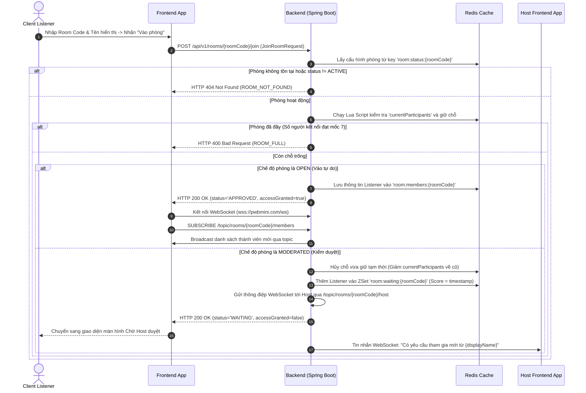
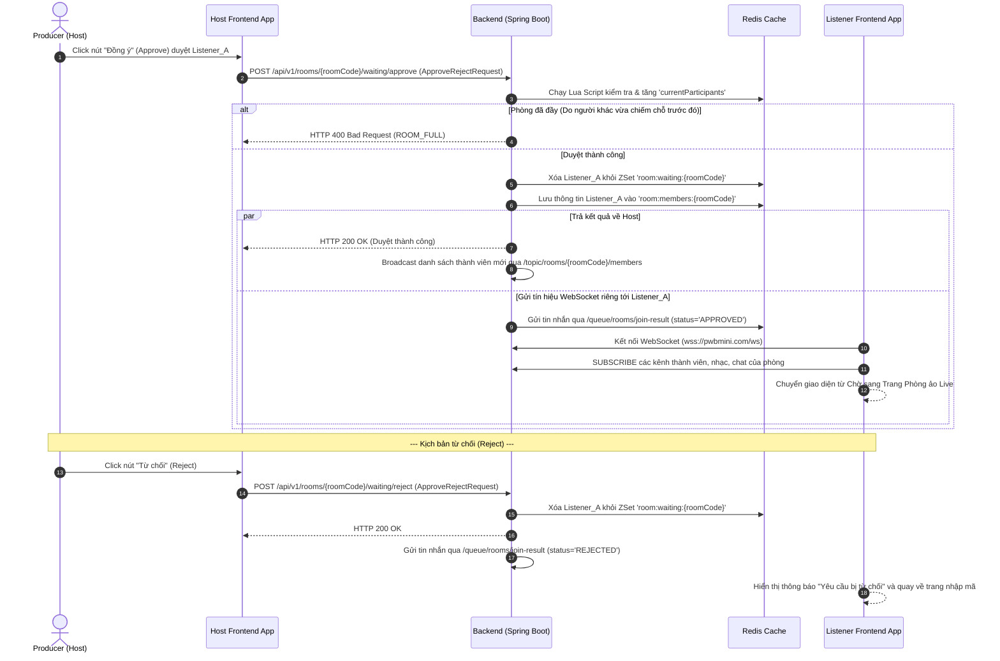
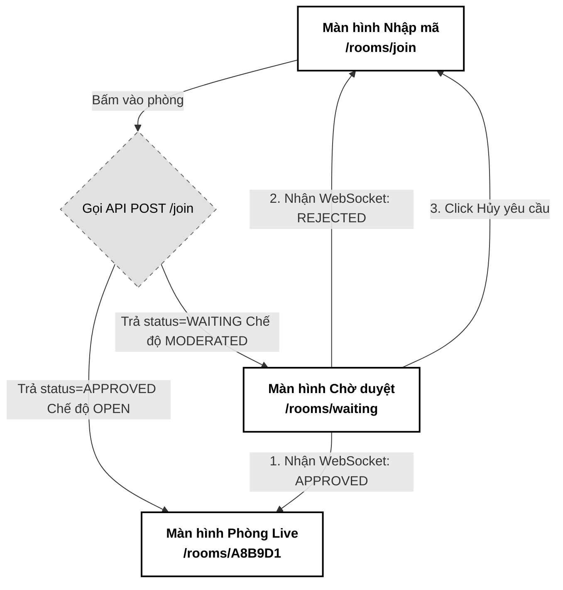

# 02. Quy trình Tham gia phòng & Phòng chờ (Join & Waiting Room)

Tài liệu đặc tả A-Z quy trình khách hàng (Listener) tham gia phòng Live Room, hệ thống hàng chờ duyệt (Waiting List) thời gian thực trên Redis, và cơ chế phê duyệt nguyên tử (Atomic Approval) sử dụng Redis Lua Script để ngăn chặn xung đột số lượng người tham gia.

---

## 📋 1. Business & Requirements (Nghiệp vụ & Yêu cầu)

### 1.1. Mô tả Nghiệp vụ (User Story / Use Case)
*   **Đối tượng thực hiện**: 
    *   *Listener*: Người dùng muốn vào phòng nghe nhạc chung (sở hữu mã `roomCode` và tên hiển thị).
    *   *Host*: Chủ phòng Live Room, người xem danh sách chờ và đưa ra quyết định phê duyệt.
*   **Quy trình tóm tắt**:
    1.  Listener nhập mã phòng và tên hiển thị tại giao diện Khách để yêu cầu tham gia.
    2.  Hệ thống kiểm tra tính tồn tại của phòng và giới hạn số lượng thành viên (tối đa 7 người bao gồm Host).
    3.  *Chế độ OPEN*: Listener được vào thẳng phòng ảo.
    4.  *Chế độ MODERATED*: Listener được đưa vào hàng đợi phòng chờ (Waiting List) trong Redis. Host nhận được thông tin yêu cầu của Listener thời gian thực qua WebSocket.
    5.  Host nhấn **Approve (Đồng ý)** hoặc **Reject (Từ chối)**.
    6.  Hệ thống gửi tín hiệu phản hồi qua WebSocket riêng tư của Listener để tự động kết nối hoặc trả về màn hình nhập mã.

### 1.2. Quy tắc Nghiệp vụ (Business Rules)

#### A. Kiểm soát số lượng người tối đa (Lua Script Atomicity)
*   Giới hạn cứng của một phòng Live Room là **7 người kết nối đồng thời** (1 Host + 6 Listener).
*   **Chống Race Condition**: Để ngăn chặn lỗi quá tải người tham gia khi nhiều người cùng vào phòng một lúc, hoặc khi Host phê duyệt đồng thời nhiều người trong lúc phòng sắp đầy:
    *   Thao tác kiểm tra số lượng hiện tại (`currentParticipants < 7`) và tăng số lượng (+1) **bắt buộc** phải được thực hiện nguyên tử ở tầng Cache bằng **Redis Lua Script**. Không thực hiện kiểm tra ở tầng Java rồi mới ghi đè nhằm tránh xung đột tương tranh.

#### B. Cơ chế Phòng chờ tự động dọn dẹp (Waiting List Auto-cleanup)
*   Trong chế độ **MODERATED**, các yêu cầu tham gia của Listener được xếp vào Redis ZSet `room:waiting:{roomCode}` với điểm số (Score) là `timestamp` lúc yêu cầu.
*   **Thời gian chờ tối đa**: Mỗi yêu cầu chỉ có hiệu lực trong vòng **5 phút (300 giây)**.
*   **Lazy Cleanup**: Khi Host tải danh sách phòng chờ (`GET /api/v1/rooms/{roomCode}/waiting`), hệ thống tự động chạy lệnh `ZREMRANGEBYSCORE` để xóa sạch các yêu cầu đã quá 5 phút trước khi trả về dữ liệu. Việc này giải phóng bộ nhớ Redis mà không cần chạy scheduler quét liên tục.

#### C. Quy trình Xử lý Phê duyệt (Approve / Reject Flow)
*   **Khi Host nhấn Approve**: 
    1. Hệ thống chạy Lua Script để giữ chỗ trống. Nếu thành công (trả về `1`):
        *   Xóa Listener khỏi danh sách chờ `room:waiting:{roomCode}`.
        *   Thêm thông tin Listener vào Redis Hash `room:members:{roomCode}`.
        *   Gửi thông báo phê duyệt thành công qua WebSocket riêng tư `/queue/rooms/join-result` của Listener.
        *   Broadcast danh sách thành viên mới tới toàn bộ phòng qua topic `/topic/rooms/{roomCode}/members`.
    2. Nếu Lua Script trả về `0` (phòng đã đầy): Trả về lỗi `ROOM_FULL` cho Host và từ chối yêu cầu của Listener.
*   **Khi Host nhấn Reject**:
    1. Hệ thống xóa Listener khỏi danh sách chờ Redis.
    2. Gửi thông điệp từ chối qua kênh WebSocket riêng tư của Listener để chuyển hướng họ về màn hình nhập mã.

---

### 1.3. Quy tắc Xác thực Dữ liệu (Validation Rules)

| API Request | Trường dữ liệu | Ràng buộc | Annotation (Backend) | Mô tả |
| :--- | :--- | :--- | :--- | :--- |
| `JoinRoomRequest` | `displayName` | Bắt buộc, không để trống, tối đa 30 ký tự | `@NotBlank`, `@Size(max=30)` | Tên hiển thị của khách hàng trong phòng |
| `ApproveRejectRequest`| `listenerId` | Bắt buộc, định dạng UUID | `@NotNull` | ID tài khoản người dùng của khách hàng cần duyệt |

---

### 1.4. Giới hạn Tần suất Truy cập API (IP Rate Limiting)

| API Endpoint | Giới hạn | Mô tả |
| :--- | :--- | :--- |
| `POST /api/v1/rooms/{roomCode}/join` | **5 requests / phút / IP** | Tránh spam gửi yêu cầu tham gia phá hoại phòng chờ của Host |
| `POST /api/v1/rooms/{roomCode}/waiting/approve` | **20 requests / phút / IP** | Tần suất thao tác duyệt của Host |

---

## 🔄 2. User Flow & Sequence Diagram (Luồng người dùng & Sơ đồ tuần tự)

### 2.1. Luồng Gửi Yêu cầu tham gia và Đưa vào Phòng chờ (Join Request)



---

### 2.2. Luồng Host phê duyệt hoặc từ chối thành viên (Approve / Reject Flow)



---

## 💾 3. Database & Cache Schema (Thiết kế Cơ sở Dữ liệu & Cache)

### 3.1. Thiết kế Cache Redis thời gian thực

Hệ thống quản lý hàng chờ và danh sách thành viên online hoàn toàn trên Redis để đạt độ trễ mili giây:

| Định dạng Khóa (Redis Key) | Kiểu dữ liệu | Giá trị (Value) | TTL | Mục đích sử dụng |
| :--- | :--- | :--- | :--- | :--- |
| `room:waiting:{roomCode}` | `ZSet` | `userId:displayName` (Ví dụ: `c8b74f51-...:NguyenArtist`) | **4 giờ** (Bằng TTL của phòng) | Danh sách hàng chờ duyệt xếp theo thời gian gửi yêu cầu (`timestamp`). |
| `room:members:{roomCode}` | `Hash` | Key: `userId`<br>Value: JSON string chứa `displayName`, `role`, `joinedAt` | **4 giờ** | Danh sách các thành viên đang online thực tế trong phòng. |

#### ⚡ Redis Lua Script kiểm tra & tăng số lượng thành viên nguyên tử (Atomic Check-and-Set)
Đoạn code script được nạp và chạy trực tiếp trên Redis để tránh Race Condition vượt quá 7 người:

```lua
-- KEYS[1]: room:status:{roomCode}
-- Trả về 1 nếu còn chỗ trống và đã tăng, trả về 0 nếu phòng đã đầy
local current = redis.call('hget', KEYS[1], 'currentParticipants')
local max = redis.call('hget', KEYS[1], 'maxParticipants')

if not current or not max then
    return 0
end

if tonumber(current) < tonumber(max) then
    redis.call('hincrby', KEYS[1], 'currentParticipants', 1)
    return 1
else
    return 0
end
```

---

## 🔌 4. API & WebSocket Specifications (Đặc tả API)

### 4.0. Cấu hình Chung
*   **Base Path**: `/api/v1`
*   **Headers**: `Authorization: Bearer <accessToken>` (Với các API yêu cầu xác thực)

---

### 4.1. API Listener Gửi yêu cầu tham gia phòng (Join Room)
*   **Method**: `POST`
*   **Path**: `/api/v1/rooms/{roomCode}/join`
*   **Auth Level**: `PermitAll` (Cho phép khách vãng lai tham gia bằng cách nhập tên)

#### Request Body (`JoinRoomRequest`):
```json
{
  "displayName": "Ca sĩ Khánh Phương"
}
```

#### Response Thành công trong chế độ OPEN (Vào thẳng):
```json
{
  "success": true,
  "message": "Yêu cầu tham gia được phê duyệt trực tiếp",
  "data": {
    "status": "APPROVED",
    "accessGranted": true,
    "roomCode": "A8B9D1",
    "mode": "OPEN"
  },
  "errors": null,
  "timestamp": "2026-07-01T15:00:00Z"
}
```

#### Response Thành công trong chế độ MODERATED (Vào hàng chờ):
```json
{
  "success": true,
  "message": "Đã gửi yêu cầu tham gia thành công. Vui lòng chờ Producer phê duyệt.",
  "data": {
    "status": "WAITING",
    "accessGranted": false,
    "roomCode": "A8B9D1",
    "mode": "MODERATED"
  },
  "errors": null,
  "timestamp": "2026-07-01T15:00:00Z"
}
```

---

### 4.2. API Host lấy danh sách chờ (Get Waiting List)
*   **Method**: `GET`
*   **Path**: `/api/v1/rooms/{roomCode}/waiting`
*   **Auth Level**: `Requires ROLE_USER_PRO` (Chỉ Host mới gọi được)

#### Response Thành công (200 OK):
```json
{
  "success": true,
  "message": "Lấy danh sách hàng chờ thành công",
  "data": [
    {
      "listenerId": "e5b84f32-3a78-43d9-9524-34e803c4f2aa",
      "displayName": "Ca sĩ Khánh Phương",
      "requestedAt": "2026-07-01T15:02:00Z"
    }
  ],
  "errors": null,
  "timestamp": "2026-07-01T15:03:00Z"
}
```

---

### 4.3. API Host duyệt phê duyệt (Approve/Reject)
*   **Method**: `POST`
*   **Path**: `/api/v1/rooms/{roomCode}/waiting/approve` (Hoặc `/reject` đối với từ chối)
*   **Auth Level**: `Requires ROLE_USER_PRO`

#### Request Body (`ApproveRejectRequest`):
```json
{
  "listenerId": "e5b84f32-3a78-43d9-9524-34e803c4f2aa"
}
```

#### Response Thành công (200 OK):
```json
{
  "success": true,
  "message": "Duyệt thành viên tham gia phòng thành công",
  "data": null,
  "errors": null,
  "timestamp": "2026-07-01T15:04:00Z"
}
```

---

### 4.4. Đặc tả Kênh Tin nhắn WebSocket STOMP
*   **Kênh Đẩy yêu cầu tham gia tới Host (Subscribe)**:
    *   `/topic/rooms/{roomCode}/host`: Host đăng ký để nhận tin thông báo thời gian thực khi có Listener mới đăng ký vào Waiting List.
*   **Kênh Trả kết quả duyệt riêng tư cho Listener (User Destination)**:
    *   `/user/queue/rooms/join-result`: Listener đăng ký kênh này (sử dụng User Destination của Spring STOMP) để nhận kết quả phê duyệt. Payload nhận được chứa `status: 'APPROVED'` hoặc `status: 'REJECTED'`.

---

### 4.5. Phụ lục Mã Lỗi Nghiệp Vụ (Error Codes)

| Http Status | Error Code (String) | Mô tả | Trường liên quan (`field`) |
| :--- | :--- | :--- | :--- |
| `400 Bad Request` | `ROOM_FULL` | Phòng đã đạt giới hạn 7 người kết nối đồng thời | `null` |
| `404 Not Found` | `ROOM_NOT_FOUND` | Không tìm thấy mã phòng yêu cầu hoặc phòng đã đóng | `roomCode` |
| `404 Not Found` | `SESSION_NOT_FOUND` | Không tìm thấy yêu cầu chờ duyệt của Listener này trên Redis | `listenerId` |

---

## 🎨 5. UI/UX & Frontend Integration Notes (Giao diện & Tích hợp)

### 5.1. Thiết kế Giao diện Đơn sắc & Hỗ trợ Tiếp cận (Grayscale Theme & A11y)
*   **Màn hình Chờ duyệt của Listener**: Thiết kế tối giản, hiển thị Spinner xoay đơn sắc nhạt và thông điệp: *"Yêu cầu đang chờ duyệt... Vui lòng đợi Producer"* kèm theo nút "Hủy yêu cầu" (nếu khách hàng không muốn đợi nữa).
*   **Giao diện quản lý hàng chờ của Host**: Hiển thị một danh mục nhỏ gọn góc phải hoặc góc trái màn hình Dashboard, liệt kê tên các thành viên đang đợi kèm theo 2 nút phẳng đơn sắc: `[ Duyệt ]` (nền đen chữ trắng) và `[ Từ chối ]` (viền xám chữ đen).
*   **Thuộc tính Accessibility (A11y)**:
    *   Các input nhập mã phòng và tên hiển thị bắt buộc định nghĩa đầy đủ `id`, `name`, `aria-label`.
    *   Nút duyệt/từ chối trên màn hình Host có `aria-label` tương ứng (ví dụ: `aria-label="Phê duyệt Ca sĩ Khánh Phương vào phòng"`).

---

### 5.2. Tối ưu hóa Hiệu năng & Trải nghiệm Lập trình viên (Performance & DevEx)
*   **Chống gửi yêu cầu trùng lặp (Double Submit Prevention)**:
    *   Khi bấm nút "Vào phòng" hoặc nút "Duyệt / Từ chối", các nút này lập tức bị vô hiệu hóa (`disabled`) và hiển thị Spinner xoay để chặn việc người dùng gửi liên tiếp các request trùng lặp (Debounce/Throttle).
*   **Xác thực tại Client (Client-Side Validation)**:
    *   Sử dụng Zod để validate mã phòng (đúng 6 ký tự, không trống) và tên hiển thị (tối thiểu 2, tối đa 30 ký tự) trước khi gọi API.
*   **Xử lý Ngoại lệ mạng (Network Offline Resilience)**:
    *   Frontend sử dụng bộ theo dõi trạng thái mạng (`window.navigator.onLine`).
    *   Nếu Listener bị mất mạng trong lúc đang ở màn hình Chờ duyệt, giao diện hiển thị cảnh báo đỏ *"Mất kết nối mạng, đang chờ kết nối lại..."* thay vì treo ứng dụng.

---

### 5.3. Trạng thái Kết nối & Trải nghiệm Reconnection (WebSocket UX)
*   **Trạng thái Kết nối (Connection Indicators)**:
    *   Cả Host và Listener (sau khi được duyệt) đều hiển thị một Badge nhỏ góc trên màn hình biểu diễn trạng thái kết nối WebSocket STOMP: `Connecting` (Xám nháy), `Connected` (Đen chữ Trắng), `Disconnected` (Xám đậm).
*   **Hạn chế Đa tab (Multi-tab Prevention)**:
    *   Sử dụng `BroadcastChannel` để theo dõi. Nếu phát hiện Listener mở tab thứ hai của cùng một phòng Live Room, tab cũ sẽ nhận thông báo và tự động giải phóng/redirect để tránh WebRTC Mesh conflict.

---

### 5.4. Sơ đồ Luồng Màn hình (Screen Flow)

Luồng chuyển dịch giao diện đối với Listener:



---

## 📊 6. Logging & Observability (Ghi nhận Nhật ký & Giám sát)

### 6.1. Log Points (Các điểm ghi log)

| Level | Sự kiện | Payload mẫu |
| :--- | :--- | :--- |
| `INFO` | Join request received | `{"event": "JOIN_REQUEST", "roomCode": "A8B9D1", "listenerName": "Ca sĩ Khánh Phương"}` |
| `INFO` | Added to waiting list | `{"event": "WAITING_LIST_ADDED", "roomCode": "A8B9D1", "userId": "e5b84f32-..."}` |
| `INFO` | Listener approved | `{"event": "LISTENER_APPROVED", "roomCode": "A8B9D1", "listenerId": "e5b84f32-...", "hostId": "c8b74f51-..."}` |
| `INFO` | Listener rejected | `{"event": "LISTENER_REJECTED", "roomCode": "A8B9D1", "listenerId": "e5b84f32-..."}` |
| `WARN` | Join blocked (Room full) | `{"event": "JOIN_BLOCKED_FULL", "roomCode": "A8B9D1", "currentCount": 7}` |
| `WARN` | Lazy cleanup executed | `{"event": "LAZY_CLEANUP_EXECUTED", "roomCode": "A8B9D1", "removedCount": 1}` |
| `ERROR` | Lua Script execution failure | `{"event": "REDIS_LUA_FAILED", "roomCode": "A8B9D1", "error": "Redis scripting error"}` |

### 6.2. Quy tắc Bảo mật Log
*   Không log thông tin nhạy cảm của cookie hay token người dùng trong quá trình gọi API.
*   **Masking**: Mã hóa hoặc ẩn danh IP của khách hàng trong log tương thích các quy định bảo mật.
