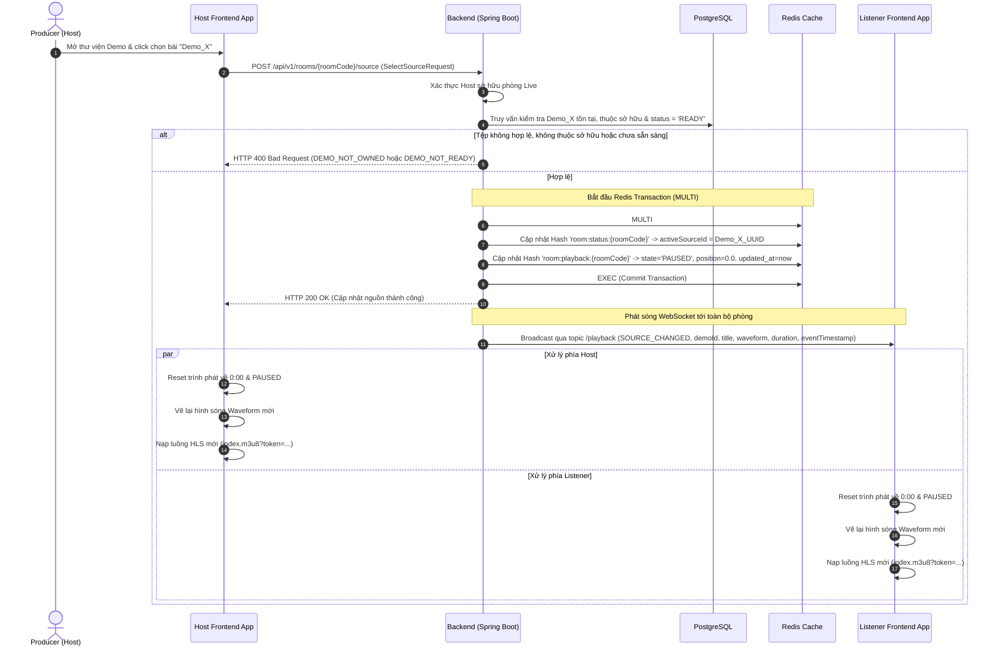
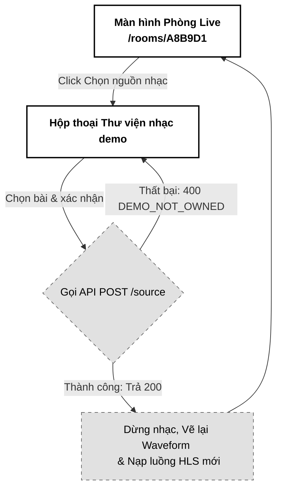

# 03. Chọn Nguồn phát nhạc (Select Audio Source)

Tài liệu đặc tả A-Z tính năng Chọn nguồn phát nhạc (Select Audio Source) trong phòng Live Room, cho phép Host (Producer) chọn bài hát từ thư viện demo cá nhân để làm nguồn phát nhạc chính đồng bộ chất lượng cao cho toàn bộ phòng.

---

## 📋 1. Business & Requirements (Nghiệp vụ & Yêu cầu)

### 1.1. Mô tả Nghiệp vụ (User Story / Use Case)
*   **Đối tượng thực hiện**: Host (Chủ phòng Live Room - `ROLE_USER_PRO`).
*   **Quy trình tóm tắt**:
    1.  Tại màn hình phòng Live, Host nhấp vào nút "Chọn nguồn nhạc".
    2.  Hệ thống mở danh mục hiển thị các tệp nhạc demo đã tải lên của Host (kết nối từ *Module 2: Quản lý & Bảo vệ File Nhạc Demo*).
    3.  Host chọn một bài hát nguồn và xác nhận.
    4.  Backend xác thực quyền sở hữu tệp demo, cập nhật thông tin nguồn phát mới lên Redis Cache và đặt lại trạng thái phát nhạc của phòng về vị trí ban đầu (position = 0, status = PAUSED).
    5.  Hệ thống gửi thông điệp WebSocket phát sóng (Broadcast) tới toàn bộ thành viên.
    6.  Trình phát nhạc của Host và toàn bộ Listener đồng loạt tải lại luồng phát nhạc mới (HLS `.m3u8`), vẽ biểu đồ hình sóng (Waveform) mới trên giao diện.

### 1.2. Quy tắc Nghiệp vụ (Business Rules)

#### A. Xác thực quyền chọn nguồn nhạc
*   **Chỉ Host mới có quyền thay đổi**: Chỉ người dùng tạo phòng (Host) mới có quyền gọi API chọn bài hát nguồn. Mọi request từ Listener (kể cả Listener đã được cấp quyền tạm thời) sẽ bị từ chối với lỗi HTTP `403 Forbidden` (`FORBIDDEN_ACCESS`).
*   **Xác thực quyền sở hữu file nhạc**: Tệp tin âm thanh được chọn (`demoId`) bắt buộc phải thuộc quyền sở hữu của chính Host (hoặc Host được quyền chia sẻ). Backend kiểm tra trong Database PostgreSQL:
    *   Nếu tệp demo không tồn tại hoặc không thuộc sở hữu của Host -> Trả lỗi HTTP `400 Bad Request` (`DEMO_NOT_OWNED`).

#### B. Reset Trạng thái trình phát (Playback Reset State)
*   Khi nguồn nhạc thay đổi, hệ thống bắt buộc phải đặt lại trạng thái trình phát của phòng về giá trị mặc định để tránh lỗi lệch pha:
    *   Trạng thái phát nhạc (`playbackState`) đặt về `PAUSED`.
    *   Mốc thời gian phát nhạc hiện tại (`currentTime`) đặt về `0.0` (giây).
*   Các thông tin này được cập nhật đồng thời vào Redis Hash `room:playback:{roomCode}`.

#### C. Xử lý đồng bộ trên Client
*   Sau khi nhận tin nhắn WebSocket thay đổi nguồn nhạc (`SOURCE_CHANGED`), toàn bộ Client (cả Host và Listener) thực hiện:
    *   Dừng ngay lập tức trình phát nhạc hiện tại (nếu đang phát).
    *   Xóa cache phân đoạn nhạc cũ.
    *   Gọi API lấy danh sách phát HLS `.m3u8` cho file demo mới từ server và bắt đầu nạp dữ liệu (Buffer).
    *   Vẽ lại biểu đồ hình sóng (Waveform) mới bằng dữ liệu nhận được trong WebSocket payload.

---

### 1.3. Quy tắc Xác thực Dữ liệu (Validation Rules)

| Trường dữ liệu | Ràng buộc | Annotation (Backend) | Mô tả |
| :--- | :--- | :--- | :--- |
| `demoId` | Bắt buộc, đúng định dạng UUID | `@NotNull` | ID của tệp demo âm nhạc cần chọn làm nguồn phát |

---

### 1.4. Giới hạn Tần suất Truy cập API (IP Rate Limiting)

| API Endpoint | Giới hạn | Mô tả |
| :--- | :--- | :--- |
| `POST /api/v1/rooms/{roomCode}/source` | **10 requests / phút / IP** | Ngăn chặn hành vi spam click thay đổi bài hát liên tục gây quá tải truy vấn thông tin file và spam WebSocket |

---

## 🔄 2. User Flow & Sequence Diagram (Luồng người dùng & Sơ đồ tuần tự)

### 2.1. Luồng Chọn nguồn phát nhạc (Select Audio Source Flow)



##### 📝 Mô tả chi tiết các bước xử lý:
1.  **Chọn bài hát**: Host mở thư viện nhạc demo trên giao diện phòng, chọn một tệp demo (Demo_X) và xác nhận. Frontend gửi `POST /rooms/{roomCode}/source` đính kèm Token JWT.
2.  **Kiểm tra tính hợp lệ**: Backend kiểm tra token xác thực:
    *   Đảm bảo người gọi là Host của mã phòng `{roomCode}`.
    *   Truy vấn Database kiểm tra `Demo_X` có tồn tại và thuộc quyền sở hữu của Host hay không. Đồng thời kiểm tra trạng thái tệp demo phải là `READY` (đã convert xong HLS & trích xuất waveform). Nếu không thuộc sở hữu trả `DEMO_NOT_OWNED`, nếu chưa sẵn sàng trả `DEMO_NOT_READY`.
3.  **Cập nhật Cache**: Sử dụng giao dịch Redis Transaction (`MULTI`/`EXEC`) hoặc Lua Script để thực hiện cập nhật đồng thời ID nguồn nhạc đang phát (`activeSourceId`) và reset trạng thái phát của phòng về `PAUSED` và vị trí `0.0` một cách nguyên tử (ngăn chặn các lệnh đồng bộ vị trí chen ngang gây bất nhất).
4.  **Phát sóng WebSocket**: Backend gửi gói tin `SOURCE_CHANGED` chứa ID tệp demo, tiêu đề, dữ liệu mảng waveform, tổng thời lượng và trường `eventTimestamp` (mốc epoch milliseconds phát hành sự kiện) qua kênh WebSocket `/topic/rooms/{roomCode}/playback`.
5.  **Tải lại nguồn ở Client**: Trình duyệt của Host và Listener nhận tin nhắn WebSocket lập tức dừng nhạc cũ (áp dụng Fade-out giảm popping), vẽ lại hình sóng Waveform và nạp URL luồng HLS `.m3u8` mới để sẵn sàng nghe nhạc đồng bộ.

---

## 💾 3. Database & Cache Schema (Thiết kế Cơ sở Dữ liệu & Cache)

### 3.1. Cấu trúc dữ liệu Redis bổ sung (Playback State Storage)

Để lưu trữ trạng thái chạy nhạc đồng bộ, hệ thống bổ sung key Redis sau:

| Định dạng Khóa (Redis Key) | Kiểu dữ liệu | Trường dữ liệu (Fields) | TTL | Mục đích sử dụng |
| :--- | :--- | :--- | :--- | :--- |
| `room:playback:{roomCode}` | `Hash` | `playbackState`: `PLAYING`/`PAUSED`<br>`currentTime`: float (Mốc giây hiện tại, ví dụ: `85.4`)<br>`serverTimestamp`: long (Mốc giờ hệ thống lúc update)<br>`lastUpdatedBy`: UUID (ID người ra lệnh) | **4 giờ** (Theo TTL của phòng) | Quản lý trạng thái phát nhạc đồng bộ thời gian thực của phòng ảo. |

> [!NOTE]
> **Tối ưu hóa dung lượng cache (Waveform Overhead Prevention)**: Dữ liệu mảng `waveform` (mảng float 200 điểm) **hoàn toàn không được lưu trữ** trong Redis Hash `room:status:{roomCode}` hay `room:playback:{roomCode}` để tránh phình to kích thước Ram đệm và làm giảm tốc độ đọc ghi. Khi Host thực hiện đổi nguồn nhạc, Backend chỉ truy vấn mảng `waveform` từ PostgreSQL (`demos` table) đúng một lần để đóng gói vào payload WebSocket rồi phát đi.

---

## 🔌 4. API & WebSocket Specifications (Đặc tả API)

### 4.0. Cấu hình Chung
*   **Base Path**: `/api/v1`
*   **Headers**: `Authorization: Bearer <accessToken>`

---

### 4.1. API Chọn nguồn phát nhạc (Select Source)
*   **Method**: `POST`
*   **Path**: `/api/v1/rooms/{roomCode}/source`
*   **Auth Level**: `Requires ROLE_USER_PRO` (Chỉ Host mới gọi được)

#### Request Body (`SelectSourceRequest`):
```json
{
  "demoId": "f7b84f32-3a78-43d9-9524-34e803c4f2bb"
}
```

#### Response Thành công (200 OK):
```json
{
  "success": true,
  "message": "Cập nhật bài hát nguồn thành công",
  "data": null,
  "errors": null,
  "timestamp": "2026-07-01T15:10:00Z"
}
```

---

### 4.2. Đặc tả Tin nhắn WebSocket Broadcast (`SOURCE_CHANGED`)
*   **Kênh phát sóng (Broadcast Topic)**: `/topic/rooms/{roomCode}/playback`
*   **Payload tin nhắn (JSON)**:
```json
{
  "event": "SOURCE_CHANGED",
  "data": {
    "activeSourceId": "f7b84f32-3a78-43d9-9524-34e803c4f2bb",
    "title": "Bản Demo Ballad Guitar Hè 2026",
    "duration": 185.50,
    "waveform": [0.12, 0.45, 0.78, 0.90, 0.65, 0.30, 0.85, 0.95, 0.10],
    "changedBy": "c8b74f51-3a78-43d9-9524-34e803c4f2bb",
    "eventTimestamp": 1782834000123
  }
}
```

*   **Ràng buộc bảo mật luồng HLS (Instant Media Revocation)**: 
    *   Mã token truyền vào luồng HLS (`index.m3u8?token=...`) phải là token ngắn hạn hoặc sử dụng chính `temporaryToken` / `accessToken` của phiên.
    *   Phân hệ Gateway hoặc tầng Reverse Proxy bảo vệ luồng HLS bắt buộc phải thực hiện kiểm tra nhanh ($O(1)$) xuống Redis Hash `room:members:{roomCode}` trước khi phân phối từng phân đoạn `.ts`. Nếu `userId` bóc tách từ token luồng không còn tồn tại trong phòng (ví dụ: đã bị Host kick hoặc đã rời phòng), lập tức trả về lỗi HTTP `403 Forbidden` để cắt đứt luồng phát (streaming) ngay lập tức, ngăn ngừa rò rỉ âm nhạc chưa phát hành.

---

### 4.3. Phụ lục Mã Lỗi Nghiệp Vụ (Error Codes)

| Http Status | Error Code (String) | Mô tả | Trường liên quan (`field`) |
| :--- | :--- | :--- | :--- |
| `400 Bad Request` | `DEMO_NOT_OWNED` | Tệp nhạc demo không tồn tại hoặc không thuộc quyền sở hữu của Host | `demoId` |
| `400 Bad Request` | `DEMO_NOT_READY` | Tệp nhạc demo chưa sẵn sàng (đang ở trạng thái `PROCESSING` hoặc `FAILED` chuyển đổi) | `demoId` |
| `403 Forbidden` | `FORBIDDEN_ACCESS` | Người gọi API không phải là Host của phòng này | `null` |

---

## 🎨 5. UI/UX & Frontend Integration Notes (Giao diện & Tích hợp)

### 5.1. Thiết kế Giao diện Chọn nguồn nhạc & Waveform (Grayscale Theme & A11y)
*   **Khung hiển thị sóng nhạc (Waveform Visualizer)**:
    *   Hệ thống vẽ lại hình sóng (được dựng sẵn từ mảng float 200 điểm nhận từ WebSocket) bằng thẻ HTML5 Canvas hoặc SVG đơn sắc phẳng.
    *   Sử dụng màu xám nhạt `bg-neutral-200` làm nền sóng chưa phát, và màu đen `bg-black` để biểu diễn sóng nhạc đã phát qua.
*   **Trạng thái loading tệp nhạc mới**:
    *   Khi nhận sự kiện `SOURCE_CHANGED`, lập tức hiển thị hiệu ứng mờ (Opacity 0.4) trên thanh tìm kiếm sóng nhạc, kèm theo Spinner tải dữ liệu mờ cho đến khi HLS nạp đủ buffer ban đầu để sẵn sàng phát.
*   **Cơ chế Fade-out chống nổ âm lượng (Fade-out Audio Popping Prevention)**:
    *   Trước khi hủy luồng HLS cũ, Frontend sử dụng Web Audio API (hoặc thuộc tính `volume` của thẻ Audio) để thực hiện giảm âm lượng nhanh (Fade-out trong khoảng **100ms - 200ms**) về 0, sau đó mới nạp luồng mới. Điều này giúp ngăn chặn hoàn toàn tiếng click/pop khó chịu khi luồng âm thanh bị dừng đột ngột.
*   **Accessibility (A11y)**:
    *   Trình phát sóng nhạc có các thuộc tính `role="slider"`, `aria-valuemin="0"`, `aria-valuemax="{duration}"`, và `aria-valuenow="{currentTime}"` để trình đọc màn hình của thiết bị có thể diễn giải được trạng thái phát.

---

### 5.2. Tối ưu hóa Hiệu năng & Trải nghiệm Lập trình viên (Performance & DevEx)
*   **Lazy Loading thư viện nhạc**:
    *   Danh sách bài hát demo trong Dialog chọn nhạc của Host được nạp dưới dạng Lazy-load (chỉ gọi API lấy danh sách khi Host click mở popup) để tối ưu thời gian tải trang ban đầu của Live Room.
*   **Chống spam gọi API (Double Click Prevention)**:
    *   Vô hiệu hóa toàn bộ danh sách click chọn bài hát nguồn ngay khi gửi yêu cầu `POST /source` lên Backend, hiển thị con trỏ dạng `cursor-wait`.

---

### 5.3. Trạng thái Kết nối & Trải nghiệm Reconnection (WebSocket UX)
*   Nếu kết nối mạng bị đứt trong lúc đang nạp bài hát mới, trình phát nhạc của Listener hiển thị thông điệp cảnh báo: *"Mất kết nối. Đang chờ đồng bộ bài hát nguồn từ Host..."*.
*   **Xử lý khoảng trống thông tin khi Reconnect (The Offline Broadcast Gap)**: Khi kết nối khôi phục thành công, Client tự động gọi API lấy trạng thái hiện tại của phòng (`GET /rooms/{roomCode}/playback-state` - đặc tả chi tiết ở Usecase 04). API này **bắt buộc phải trả về trọn vẹn cả cấu trúc metadata của bài hát mới** (`activeSourceId`, `title`, `duration`, `waveform`) chứ không chỉ mốc thời gian chạy nhạc, giúp Listener bị rớt mạng nhận biết được bài hát đã bị đổi, tự động nạp luồng HLS mới và vẽ lại UI Canvas chính xác.

---

### 5.4. Sơ đồ Luồng Màn hình (Screen Flow)



---

## 📊 6. Logging & Observability (Ghi nhận Nhật ký & Giám sát)

### 6.1. Log Points (Các điểm ghi log)

| Level | Sự kiện | Payload mẫu |
| :--- | :--- | :--- |
| `INFO` | Source selection request received | `{"event": "SOURCE_SELECT_REQUEST", "roomCode": "A8B9D1", "demoId": "f7b84f32-...", "hostId": "c8b74f51-..."}` |
| `INFO` | Audio source changed successfully | `{"event": "SOURCE_CHANGED_SUCCESS", "roomCode": "A8B9D1", "demoId": "f7b84f32-...", "duration": 185.5}` |
| `WARN` | Source change validation failure | `{"event": "SOURCE_CHANGE_FAILED_OWNERSHIP", "roomCode": "A8B9D1", "demoId": "f7b84f32-...", "hostId": "c8b74f51-..."}` |
| `ERROR` | WebSocket broadcast failed | `{"event": "WS_BROADCAST_SOURCE_FAILED", "roomCode": "A8B9D1", "error": "Broker connection lost"}` |

### 6.2. Quy tắc Bảo mật Log
*   Chỉ log ID của tệp demo (`demoId`), tuyệt đối không ghi nhận tên file tĩnh hoặc đường dẫn lưu trữ S3 Private đầy đủ lên hệ thống log.
