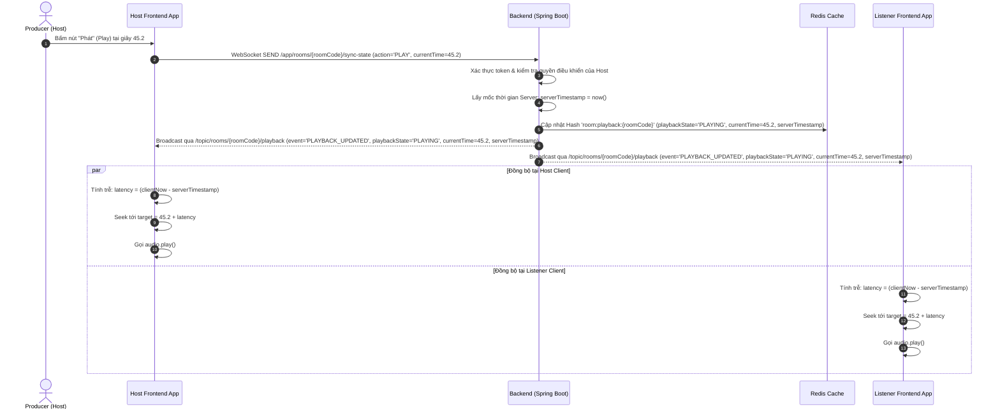
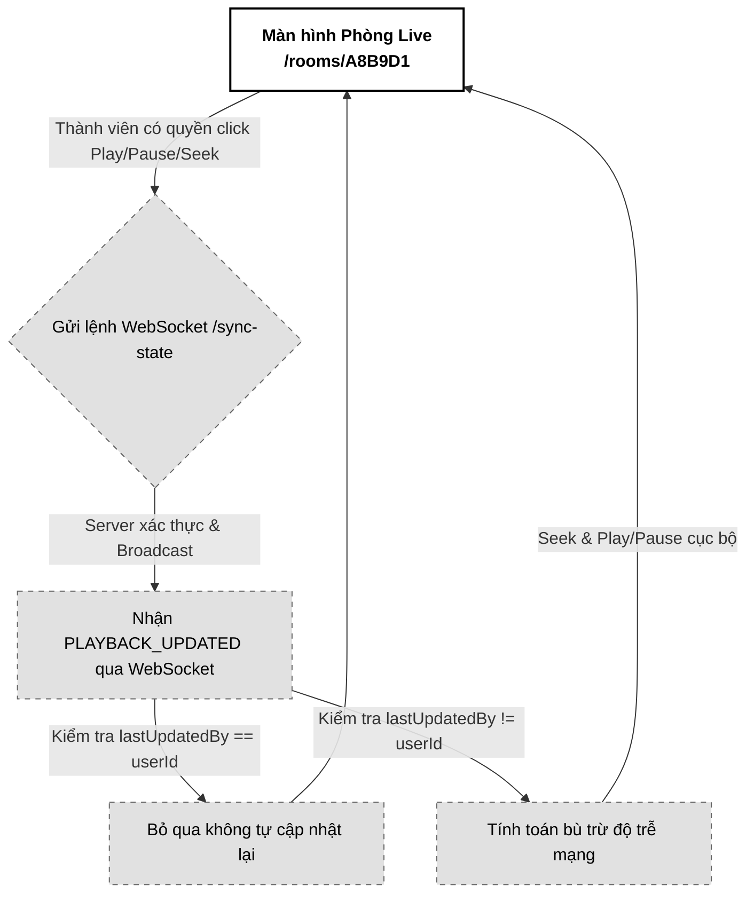

# 04. Trình phát nhạc Đồng bộ (Playback Sync)

Tài liệu đặc tả A-Z tính năng Trình phát nhạc Đồng bộ (Playback Sync) trong phòng Live Room, sử dụng giao thức STOMP WebSocket và thuật toán bù trừ độ trễ đường truyền (Latency Compensation) để đồng nhất trải nghiệm nghe nhạc chất lượng phòng thu (HLS AAC 320kbps) giữa các thành viên.

---

## 📋 1. Business & Requirements (Nghiệp vụ & Yêu cầu)

### 1.1. Mô tả Nghiệp vụ (User Story / Use Case)
*   **Đối tượng thực hiện**: Người sở hữu quyền điều khiển nhạc (Host mặc định, hoặc Listener được ủy quyền).
*   **Quy trình tóm tắt**:
    1.  Người điều khiển bấm nút Play (Phát), Pause (Tạm dừng), hoặc kéo tua thanh trượt thời gian (Seek).
    2.  Frontend gửi thông tin hành động và mốc thời gian hiện tại (`currentTime`) của trình phát lên Backend qua WebSocket.
    3.  Backend xác thực quyền, cập nhật trạng thái vào Redis Cache và broadcast sự kiện phát sóng tới toàn bộ phòng.
    4.  Frontend của tất cả thành viên nhận tin nhắn, tự động tính toán bù trừ độ trễ mạng và điều chỉnh trình phát cục bộ của mình để phát nhạc đồng bộ với độ trễ cực thấp (< 50ms).

### 1.2. Quy tắc Nghiệp vụ (Business Rules)

#### A. Độc lập luồng thoại và phát nhạc
*   **Chất lượng âm thanh phòng thu**: Luồng nhạc demo (chạy HLS stream phân đoạn phát bằng thẻ HTML5 Audio cục bộ của trình duyệt) hoạt động **tách biệt hoàn toàn** khỏi luồng đàm thoại WebRTC (thoại nén, độ trễ thấp). Điều này đảm bảo nhạc nghe thử giữ nguyên chất lượng gốc (AAC 320kbps), không bị suy giảm bởi thuật toán nén tiếng nói.

#### B. Xác thực quyền điều khiển phát nhạc
*   Khi có lệnh điều khiển gửi lên WebSocket `/app/rooms/{roomCode}/sync-state`:
    *   Backend kiểm tra xem người gửi có phải là Host của phòng hay không.
    *   Nếu không phải Host, kiểm tra xem người gửi có nằm trong danh sách được ủy quyền trong Redis key `room:delegated:{roomCode}` hay không.
    *   Nếu không có quyền -> Chặn lệnh, gửi tin nhắn lỗi cá nhân và không broadcast.

#### C. Thuật toán bù trừ độ trễ mạng (Network Latency Compensation)
Để đảm bảo tất cả các thành viên nghe nhạc trùng khớp đến từng mili giây, Client áp dụng thuật toán bù trễ khi nhận sự kiện `PLAY`:
1.  Lấy mốc thời gian hiện tại của hệ thống ở client: `clientReceiveTime` (milliseconds).
2.  Trích xuất thời điểm server phát lệnh từ tin nhắn: `serverTimestamp` (milliseconds).
3.  Tính toán độ trễ truyền tải: `latencySeconds = (clientReceiveTime - serverTimestamp) / 1000.0`.
4.  Tính toán vị trí nhạc cần đồng bộ:
    *   *Nếu trạng thái là PLAYING*: `targetPosition = packet.currentTime + latencySeconds`. Tiến hành seek tới `targetPosition` và gọi `.play()`.
    *   *Nếu trạng thái là PAUSED*: `targetPosition = packet.currentTime`. Tiến hành seek tới `targetPosition` và gọi `.pause()`.

#### D. Đồng bộ khi mới gia nhập phòng (Sync on Join/Reconnect)
*   Khi thành viên mới tham gia thành công hoặc kết nối lại sau khi mất mạng, Frontend gửi ngay request `GET /api/v1/rooms/{roomCode}/playback` để lấy trạng thái phát nhạc hiện tại của phòng từ Redis.
*   Áp dụng thuật toán bù trễ để đồng bộ trình phát ngay lập tức mà không cần đợi lệnh tiếp theo của Host.

---

### 1.3. Quy tắc Xác thực Dữ liệu (Validation Rules)

Gói tin STOMP gửi lên cổng `/app/rooms/{roomCode}/sync-state` dạng JSON phải thỏa mãn:

| Trường dữ liệu | Ràng buộc | Định dạng | Mô tả |
| :--- | :--- | :--- | :--- |
| `action` | Bắt buộc | String (`PLAY`, `PAUSE`, `SEEK`) | Hành động điều khiển trình phát |
| `currentTime` | Bắt buộc, >= 0 | Float (Ví dụ: `12.45`) | Vị trí giây hiện tại của bài hát lúc click |

---

### 1.4. Giới hạn Tần suất Truy cập API (IP Rate Limiting)

*   Vì lệnh điều khiển được truyền trực tiếp qua cổng WebSocket, Gateway áp dụng giới hạn tần suất tin nhắn WebSocket STOMP (Frame Rate Limiting) trên channel `/app/rooms/{roomCode}/sync-state` ở mức tối đa **15 frames / 10 giây / kết nối** để ngăn chặn người dùng cố tình kéo tua liên tục làm treo hệ thống broadcast.

---

## 🔄 2. User Flow & Sequence Diagram (Luồng người dùng & Sơ đồ tuần tự)

### 2.1. Luồng Đồng bộ hóa Phát nhạc (Playback Sync Flow)



##### 📝 Mô tả chi tiết các bước xử lý:
1.  **Host thao tác**: Host nhấn Play trên giao diện visualizer. Frontend lấy vị trí hiện tại của kim phát (ví dụ: `45.2` giây) và gửi lệnh STOMP WebSocket đến `/app/rooms/{roomCode}/sync-state`.
2.  **Xác thực và ghi nhận**: Backend nhận tin qua WebSocket channel:
    *   Kiểm tra tính hợp lệ của phiên kết nối.
    *   Lấy mốc thời gian hệ thống ở Server (`serverTimestamp` dạng Epoch Milliseconds).
    *   Cập nhật thông tin trạng thái phát nhạc mới vào Redis Cache Hash `room:playback:{roomCode}`.
3.  **Phát sóng trạng thái**: Backend gửi bản tin broadcast `PLAYBACK_UPDATED` chứa (`action`, `playbackState`, `currentTime`, `serverTimestamp`, `lastUpdatedBy`) tới toàn bộ các bên đang subscribe topic `/topic/rooms/{roomCode}/playback`.
4.  **Bù trễ và phát đồng bộ**: Trình duyệt của các bên nhận được gói tin, tính toán thời gian di chuyển của gói tin qua mạng (độ trễ), tự động tua nhanh hơn một khoảng bằng độ trễ rồi gọi hàm phát nhạc. Kết quả là âm thanh phát ra cùng một lúc trên tất cả các thiết bị.

---

## 💾 3. Database & Cache Schema (Thiết kế Cơ sở Dữ liệu & Cache)

### 3.1. Cấu trúc dữ liệu Redis (Playback State Storage)
Sử dụng cấu trúc Redis Hash `room:playback:{roomCode}` đã được định nghĩa ở Usecase 3:

*   `playbackState`: `PLAYING` / `PAUSED`
*   `currentTime`: Float (ví dụ: `45.20`)
*   `serverTimestamp`: Long (Epoch Milliseconds lúc Server xử lý lệnh)
*   `lastUpdatedBy`: UUID

---

## 🔌 4. API & WebSocket Specifications (Đặc tả API & Kênh truyền tin)

### 4.0. Cấu hình Chung
*   **Base Path**: `/api/v1`
*   **Headers**: `Authorization: Bearer <accessToken>`

---

### 4.1. API Đồng bộ trạng thái khi mới vào phòng (Get Current Playback State)
*   **Method**: `GET`
*   **Path**: `/api/v1/rooms/{roomCode}/playback`
*   **Auth Level**: `PermitAll` (Dành cho mọi thành viên đã vào phòng)

#### Response Thành công (200 OK):
```json
{
  "success": true,
  "message": "Lấy trạng thái trình phát nhạc thành công",
  "data": {
    "activeSourceId": "f7b84f32-3a78-43d9-9524-34e803c4f2bb",
    "playbackState": "PLAYING",
    "currentTime": 85.40,
    "serverTimestamp": 1782928500000
  },
  "errors": null,
  "timestamp": "2026-07-01T15:15:00Z"
}
```

---

### 4.2. Đặc tả Tin nhắn WebSocket Gửi lệnh (Client-to-Server)
*   **Kênh gửi lệnh (Destination)**: `/app/rooms/{roomCode}/sync-state`
*   **Payload tin nhắn (JSON)**:
```json
{
  "action": "PLAY",
  "currentTime": 45.20
}
```

---

### 4.3. Đặc tả Tin nhắn WebSocket Phát sóng (Server-to-Client Broadcast)
*   **Kênh nhận tin (Subscribe Topic)**: `/topic/rooms/{roomCode}/playback`
*   **Payload tin nhắn (JSON)**:
```json
{
  "event": "PLAYBACK_UPDATED",
  "data": {
    "action": "PLAY",
    "playbackState": "PLAYING",
    "currentTime": 45.20,
    "serverTimestamp": 1782928500500,
    "lastUpdatedBy": "c8b74f51-3a78-43d9-9524-34e803c4f2bb"
  }
}
```

---

## 🎨 5. UI/UX & Frontend Integration Notes (Giao diện & Tích hợp)

### 5.1. Thiết kế Giao diện Trình phát đồng bộ (Grayscale Theme & A11y)
*   **Giao diện Trình phát (Player Controls)**:
    *   *Đối với Host (hoặc người được ủy quyền)*: Các nút Play/Pause/Seek hiển thị rõ ràng, cho phép kéo tua tự do.
    *   *Đối với Listener thường*: Nút Play/Pause và thanh tua Seek bị **làm mờ và khóa tương tác** (`disabled = true`). Con trỏ chuột khi rê qua thanh trượt seek chuyển thành dạng `cursor-not-allowed`.
*   **Hiển thị người điều hành**: Giao diện hiển thị một dòng thông báo nhỏ chạy chữ xám mờ ở dưới visualizer: *"Chủ phòng đang phát..."* hoặc *"Nghệ sĩ A đang tua nhạc..."* để người dùng biết ai đang điều khiển bài hát.
*   **Accessibility (A11y)**:
    *   Gắn thuộc tính `aria-live="polite"` vào dòng thông báo trạng thái người điều hành để các thiết bị hỗ trợ đọc màn hình thông báo kịp thời cho người dùng khi nhạc bị dừng hoặc phát lại.

---

### 5.2. Tối ưu hóa Hiệu năng & Trải nghiệm Lập trình viên (Performance & DevEx)
*   **Chống dội lệnh tự động (Playback Loop Prevention)**:
    *   **Vấn đề**: Khi Host bấm Play -> Gửi lệnh WebSocket -> Server Broadcast lại lệnh Play -> Trình phát của Host nhận được lệnh broadcast này. Nếu code không xử lý kỹ, trình phát của Host sẽ lại kích hoạt sự kiện `.play()` lần nữa, tạo ra vòng lặp vô hạn hoặc giật nhạc.
    *   **Giải pháp**: Frontend kiểm tra `lastUpdatedBy` trong tin nhắn WebSocket nhận được. Nếu `lastUpdatedBy` trùng khớp với `userId` hiện tại của Client, Frontend sẽ **bỏ qua không thực hiện lại thao tác tua/phát cục bộ** vì Client đó đã tự thực hiện ngay khi click chuột rồi.
*   **Debounce Tua nhạc (Seek Debounce)**:
    *   Khi kéo thanh tua nhạc (Seek Bar), sự kiện tua nhạc phát sinh liên tục trong từng mili giây. Frontend chỉ gửi tin nhắn WebSocket sau khi người dùng **đã thả chuột ra khỏi thanh Seek (sự kiện `onChangeEnd` hoặc mouseup)** để tránh làm nghẽn kênh truyền WebSocket.

---

### 5.3. Trạng thái Kết nối & Trải nghiệm Reconnection (WebSocket UX)
*   Khi bị mất kết nối WebSocket, trình phát nhạc của Listener lập tức chuyển sang trạng thái `PAUSED` cục bộ để tránh việc nhạc tiếp tục chạy lệch pha với phòng ảo.
*   Khi kết nối lại thành công, tự động gọi API `GET /playback` để đồng bộ lại ngay vị trí nhạc mới nhất của Host.

---

### 5.4. Sơ đồ Luồng Màn hình (Screen Flow)

Luồng hoạt động đồng bộ trình phát:



---

## 📊 6. Logging & Observability (Ghi nhận Nhật ký & Giám sát)

### 6.1. Log Points (Các điểm ghi log)

| Level | Sự kiện | Payload mẫu |
| :--- | :--- | :--- |
| `INFO` | Playback command received | `{"event": "PLAYBACK_COMMAND", "roomCode": "A8B9D1", "action": "PLAY", "position": 45.2, "userId": "c8b74f51-..."}` |
| `INFO` | Playback state updated | `{"event": "PLAYBACK_STATE_UPDATED", "roomCode": "A8B9D1", "state": "PLAYING", "position": 45.2}` |
| `WARN` | Playback command unauthorized | `{"event": "PLAYBACK_UNAUTHORIZED_ATTEMPT", "roomCode": "A8B9D1", "userId": "e5b84f32-...", "action": "PLAY"}` |
| `ERROR` | WebSocket sync error | `{"event": "WS_SYNC_ERROR", "roomCode": "A8B9D1", "error": "STOMP frame processing exception"}` |

### 6.2. Quy tắc Bảo mật Log
*   Không log thông tin token hay dữ liệu thô của người dùng trong các sự kiện đồng bộ nhạc.
