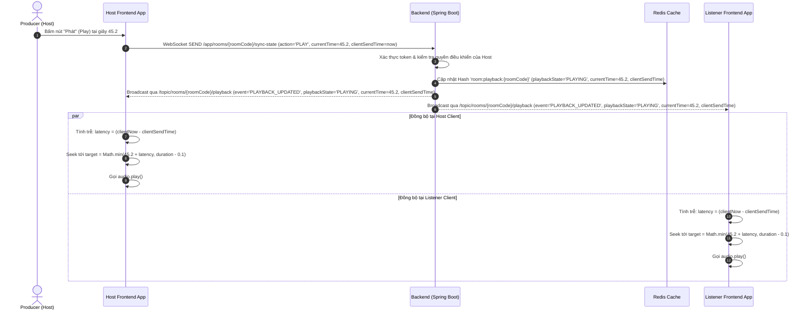
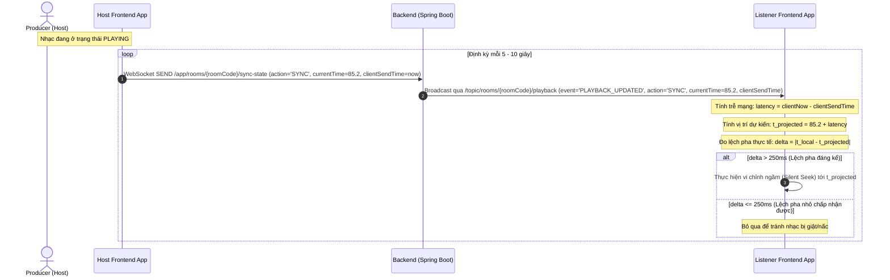
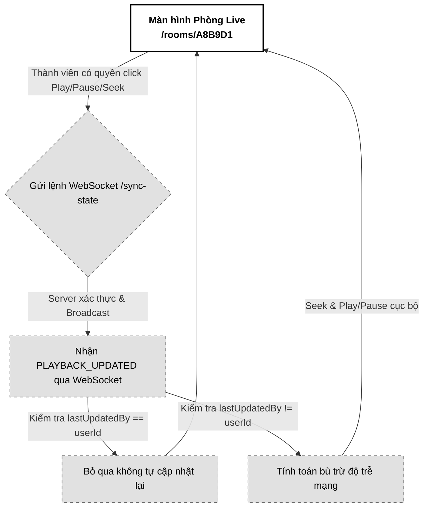

# 04. Trình phát nhạc Đồng bộ (Playback Sync)

Tài liệu đặc tả A-Z tính năng Trình phát nhạc Đồng bộ (Playback Sync) trong phòng Live Room, sử dụng giao thức STOMP WebSocket và thuật toán bù trừ độ trễ đường truyền (Latency Compensation) để đồng nhất trải nghiệm nghe nhạc chất lượng phòng thu (HLS AAC 320kbps) giữa các thành viên.

---

## 📋 1. Business & Requirements (Nghiệp vụ & Yêu cầu)

### 1.1. Mô tả Nghiệp vụ (User Story / Use Case)
*   **Đối tượng thực hiện**: Người sở hữu quyền điều khiển nhạc (Host mặc định, hoặc Listener được ủy quyền).
*   **Quy trình tóm tắt**:
    1.  Người điều khiển bấm nút Play (Phát), Pause (Tạm dừng), hoặc kéo tua thanh trượt thời gian (Seek).
    2.  Frontend gửi thông tin hành động và mốc thời gian hiện tại (`currentTime`) của trình phát lên Backend qua WebSocket.
    3.  Backend xác thực quyền, cập nhật trạng thái vào Redis Cache và broadcast sự kiện phát sóng tới toàn bộ phòng.
    4.  Frontend của tất cả thành viên nhận tin nhắn, tự động tính toán bù trừ độ trễ mạng và điều chỉnh trình phát cục bộ của mình để phát nhạc đồng bộ với độ trễ cực thấp (< 50ms).

### 1.2. Quy tắc Nghiệp vụ (Business Rules)

#### A. Độc lập luồng thoại và phát nhạc
*   **Chất lượng âm thanh phòng thu**: Luồng nhạc demo (chạy HLS stream phân đoạn phát bằng thẻ HTML5 Audio cục bộ của trình duyệt) hoạt động **tách biệt hoàn toàn** khỏi luồng đàm thoại WebRTC (thoại nén, độ trễ thấp). Điều này đảm bảo nhạc nghe thử giữ nguyên chất lượng gốc (AAC 320kbps), không bị suy giảm bởi thuật toán nén tiếng nói.

#### B. Xác thực quyền điều khiển phát nhạc & Tối ưu hóa Hiệu năng (In-Memory Session Scoping)
*   **Xác thực quyền**: Chỉ Host hoặc Listener được ủy quyền điều khiển (lưu trong Redis `room:delegated:{roomCode}`) mới có quyền gửi lệnh phát nhạc.
*   **Tối ưu hóa hiệu năng kiểm tra quyền (In-Memory Session Attributes)**:
    *   Để tránh việc WebSocket thread phải liên tục truy vấn Redis (gọi `HGET` hoặc `EXISTS`) mỗi khi nhận frame `/sync-state` (tần suất rất cao, 5-10s/lần cho hàng ngàn phòng cùng chạy), hệ thống áp dụng cơ chế cache quyền hạn vào RAM cục bộ của App Server.
    *   Khi người dùng kết nối WebSocket thành công, hoặc khi Host thực hiện ủy quyền/thu hồi quyền (sự kiện tần suất cực thấp), hệ thống ghi nhận cờ `isController = true/false` trực tiếp vào **WebSocket Session Attributes** thông qua `ChannelInterceptor`.
    *   Tầng xử lý tin nhắn của Spring Boot chỉ cần kiểm tra nhanh cờ `isController` này trong headers của STOMP frame ($O(1)$ in-memory). Loại bỏ hoàn toàn việc truy cập xuống tầng đệm Redis trên từng frame truyền tải.

---

#### C. Thuật toán bù trừ độ trễ mạng (Network Latency Compensation) & Cận biên độ phát
Để đảm bảo tất cả các thành viên nghe nhạc trùng khớp đến từng mili giây, Client áp dụng thuật toán bù trễ khi nhận sự kiện `PLAY` hoặc `SEEK`:
1.  Lấy mốc thời gian hiện tại của hệ thống ở client nhận: `clientReceiveTime` (milliseconds).
2.  Trích xuất thời điểm người phát gửi lệnh từ tin nhắn: `clientSendTime` (milliseconds) - đây là timestamp gửi từ phía Client của Host, được Server giữ nguyên và broadcast đi. Việc này giúp tính toán độ trễ mạng độc lập hoàn toàn với đồng hồ hệ thống Server, tránh được **lỗi lệch múi giờ/lệch pha đồng hồ (Clock Skew Problem)** giữa Client và Server.
3.  Tính toán độ trễ truyền tải: `latencySeconds = (clientReceiveTime - clientSendTime) / 1000.0`.
4.  Tính toán vị trí nhạc cần đồng bộ (Có áp dụng hàm chặn biên để tránh lỗi tràn thời lượng):
    *   *Nếu trạng thái là PLAYING*: `targetPosition = Math.min(Math.max(packet.currentTime + latencySeconds, 0.0), duration - 0.1)`. Tiến hành seek tới `targetPosition` và gọi `.play()`.
    *   *Nếu trạng thái là PAUSED*: `targetPosition = Math.min(Math.max(packet.currentTime, 0.0), duration - 0.1)`. Tiến hành seek tới `targetPosition` và gọi `.pause()`.
    *   **Ngăn chặn lỗi Vượt quá biên độ bài hát (Out-of-Bounds Seek)**: Việc giới hạn cận trên `duration - 0.1` giây giúp trình phát trên các thiết bị di động (đặc biệt là Safari Mobile) không bị rơi vào trạng thái lỗi treo thẻ HTML5 Audio khi vị trí bù trễ vượt quá tổng thời lượng bài hát.

#### D. Đồng bộ khi mới gia nhập phòng & Reconnect (Sync on Join/Reconnect)
*   Khi thành viên mới tham gia thành công hoặc kết nối lại sau khi mất mạng, Frontend gửi ngay request `GET /api/v1/rooms/{roomCode}/playback` để lấy trạng thái phát nhạc hiện tại của phòng từ Redis.
*   **API Phục hồi đầy đủ thông tin**: API recovery này trả về trọn vẹn cả cấu trúc metadata của bài hát mới (`activeSourceId`, `title`, `duration`, `waveform`) cùng với các thông số đồng bộ (`playbackState`, `currentTime`, `clientSendTime`), giúp Listener có được đầy đủ thông tin để tự động nạp luồng HLS mới, vẽ lại UI Canvas chính xác, và tính trễ đồng bộ bằng `clientSendTime` gốc của Host nhằm **tránh bẫy Clock Skew của đồng hồ Server** khi reconnect (Offline Broadcast Gap).
*   Áp dụng thuật toán bù trễ để đồng bộ trình phát ngay lập tức mà không cần đợi lệnh tiếp theo của Host.

#### G. Kiểm duyệt Biên độ phía Server (Server-Side Seek Validation)
*   Để chống phá hoại phòng (tài khoản bị hack hoặc script lỗi cố tình seek giá trị khổng lồ làm treo phòng), Backend thực thi cơ chế kiểm duyệt biên độ phía Server khi nhận lệnh `/sync-state` từ WebSocket.
*   Trước khi ghi nhận vào Redis và broadcast, Backend truy xuất nhanh thuộc tính `duration` của bài hát hiện tại từ Redis Hash `room:status:{roomCode}` (hoặc DB) và so khớp:
    *   Nếu `currentTime > duration` hoặc `currentTime < 0` -> Backend từ chối xử lý, không lưu cache, không broadcast và phản hồi lỗi cá nhân về cho client gửi lệnh.

#### H. Cơ chế tự động vi chỉnh lệch pha vi mô (Continuous Micro-Drift Management) & Lọc nhiễu mạng (Jitter Filter)
*   Trong quá trình nghe nhạc kéo dài liên tục mà không có thao tác của Host, sự khác biệt phần cứng decode audio hoặc mạng lag nhẹ có thể làm Listener trôi lệch thời gian phát (Micro-drift) từ 200ms - 500ms sau một khoảng thời gian.
*   **Host định kỳ phát lệnh Sync**: Khi trạng thái phát là `PLAYING`, Frontend của Host (hoặc người điều khiển) định kỳ mỗi **5 - 10 giây** tự động gửi một gói tin sync ping (action: `SYNC`) lên WebSocket chứa `currentTime` và `clientSendTime` hiện tại.
*   **Listener tự động vi chỉnh ngầm (Silent Seek)**:
    *   Listener nhận gói tin `SYNC` định kỳ, tính toán mốc phát dự kiến: $t_{\text{projected}} = packet.currentTime + latencySeconds$.
    *   **Bộ lọc nhiễu mạng đột ngột (Jitter Filter)**: Để tránh tình trạng một gói tin `SYNC` bị nghẽn mạng đến muộn (làm vọt độ trễ tính toán `latencySeconds` lên cao giả tạo mặc dù audio thực tế đang rất khớp), Listener duy trì độ trễ trung bình của các frame trước đó. Nếu `latencySeconds` của gói tin `SYNC` đột ngột vọt cao bất thường (lệch quá **50%** so với độ trễ trung bình của 3-5 frame Heartbeat / SYNC liền trước), Listener sẽ gắn cờ nghi ngờ nhiễu mạng và bỏ qua không thực hiện Silent Seek ở lượt đó, chờ gói tin kế tiếp để xác minh lại.
    *   Đo lường độ lệch pha cục bộ: $\Delta = |t_{\text{local}} - t_{\text{projected}}|$.
    *   Nếu $\Delta > 250\text{ms}$ (0.25 giây) và không bị cờ Jitter Filter chặn: Frontend tự động thực thi một lệnh seek ngầm cục bộ (**Silent Seek** - hạ âm lượng nhanh, seek và hồi âm lượng không hiện Loading Indicator) để Listener bắt kịp Host.
    *   Nếu $\Delta \le 250\text{ms}$: Bỏ qua không điều chỉnh để tránh nhạc bị giật cục/nấc liên tục.

---

### 1.3. Quy tắc Xác thực Dữ liệu (Validation Rules)

Gói tin STOMP gửi lên cổng `/app/rooms/{roomCode}/sync-state` dạng JSON phải thỏa mãn:

| Trường dữ liệu | Ràng buộc | Định dạng | Mô tả |
| :--- | :--- | :--- | :--- |
| `action` | Bắt buộc | String (`PLAY`, `PAUSE`, `SEEK`, `SYNC`) | Hành động điều khiển trình phát hoặc định kỳ sync |
| `currentTime` | Bắt buộc, $0 \le \text{currentTime} \le \text{duration}$ | Float (Ví dụ: `12.45`) | Vị trí giây hiện tại của bài hát lúc click / sync |
| `clientSendTime` | Bắt buộc | Long (Ví dụ: `1782928500000`) | Epoch milliseconds lúc gửi lệnh tại Client |

---

### 1.4. Giới hạn Tần suất Truy cập API (IP Rate Limiting)

*   Vì lệnh điều khiển được truyền trực tiếp qua cổng WebSocket, Gateway áp dụng giới hạn tần suất tin nhắn WebSocket STOMP (Frame Rate Limiting) trên channel `/app/rooms/{roomCode}/sync-state` ở mức tối đa **15 frames / 10 giây / kết nối** để ngăn chặn người dùng cố tình kéo tua liên tục làm treo hệ thống broadcast.

---

## 🔄 2. User Flow & Sequence Diagram (Luồng người dùng & Sơ đồ tuần tự)

### 2.1. Luồng Đồng bộ hóa Phát nhạc (Playback Sync Flow)



##### 📝 Mô tả chi tiết các bước xử lý:
1.  **Host thao tác**: Host nhấn Play trên giao diện visualizer. Frontend lấy vị trí hiện tại của kim phát (ví dụ: `45.2` giây), mốc thời gian hệ thống cục bộ (`clientSendTime` dạng Epoch Milliseconds) và gửi lệnh STOMP WebSocket đến `/app/rooms/{roomCode}/sync-state`.
2.  **Xác thực và ghi nhận**: Backend nhận tin qua WebSocket channel:
    *   Kiểm tra tính hợp lệ của phiên kết nối.
    *   Cập nhật thông tin trạng thái phát nhạc mới kèm theo `clientSendTime` nhận được vào Redis Cache Hash `room:playback:{roomCode}`.
3.  **Phát sóng trạng thái**: Backend gửi bản tin broadcast `PLAYBACK_UPDATED` chứa (`action`, `playbackState`, `currentTime`, `clientSendTime`, `lastUpdatedBy`) tới toàn bộ các bên đang subscribe topic `/topic/rooms/{roomCode}/playback`.
4.  **Bù trễ và phát đồng bộ**: Trình duyệt của các bên nhận được gói tin, tính toán thời gian di chuyển của gói tin qua mạng (độ trễ = `clientNow - clientSendTime`), tự động tua nhanh hơn một khoảng bằng độ trễ (được giới hạn chặn trên bởi `duration - 0.1` giây để tránh lỗi treo thẻ audio trên Safari Mobile) rồi gọi hàm phát nhạc. Kết quả là âm thanh phát ra trùng khớp trên các thiết bị cục bộ mà không bị lệch đồng hồ hệ thống.

### 2.2. Luồng Tự động Hiệu chỉnh Lệch pha Vi mô (Continuous Micro-Drift Sync Flow)



##### 📝 Mô tả chi tiết các bước xử lý:
1.  **Định kỳ gửi tin**: Mỗi 5-10 giây, Frontend của Host tự động lấy `currentTime` thực tế của thẻ audio và đính kèm `clientSendTime` (Epoch Milliseconds) gửi lên WebSocket endpoint với action `SYNC`.
2.  **Broadcast**: Backend nhận tin nhắn, thực hiện validate biên độ trên server, cập nhật trạng thái đệm vào Redis và broadcast đi y nguyên.
3.  **So khớp thời gian tại Listener**: Listener nhận bản tin `SYNC`, tính toán vị trí Host mong muốn ($t_{\text{projected}} = currentTime + latencySeconds$) và so khớp với vị trí hiện tại cục bộ ($t_{\text{local}}$).
4.  **Silent Seek**: Nếu lệch pha quá ngưỡng $\Delta > 250\text{ms}$ (ví dụ: máy yếu giải mã chậm hơn), client tự động seek ngầm đến vị trí $t_{\text{projected}}$ để đồng bộ lại mà không gây ồn hay nấc nhạc.

---

## 💾 3. Database & Cache Schema (Thiết kế Cơ sở Dữ liệu & Cache)

### 3.1. Cấu trúc dữ liệu Redis (Playback State Storage)
Sử dụng cấu trúc Redis Hash `room:playback:{roomCode}` để lưu trữ trạng thái đồng bộ:

*   `playbackState`: `PLAYING` / `PAUSED`
*   `currentTime`: Float (ví dụ: `45.20`)
*   `clientSendTime`: Long (Epoch Milliseconds khi Host gửi lệnh - được lưu trữ lại để phục vụ bù trễ khi Reconnect/Join mà không bị lỗi Clock Skew của đồng hồ Server)
*   `serverTimestamp`: Long (Epoch Milliseconds lúc Server xử lý lệnh ghi nhận)
*   `lastUpdatedBy`: UUID

---

## 🔌 4. API & WebSocket Specifications (Đặc tả API & Kênh truyền tin)

### 4.0. Cấu hình Chung
*   **Base Path**: `/api/v1`
*   **Headers**: `Authorization: Bearer <accessToken>`

---

### 4.1. API Đồng bộ trạng thái khi mới vào phòng (Get Current Playback State)
*   **Method**: `GET`
*   **Path**: `/api/v1/rooms/{roomCode}/playback`
*   **Auth Level**: `PermitAll` (Dành cho mọi thành viên đã vào phòng)

#### Response Thành công (200 OK):
```json
{
  "success": true,
  "message": "Lấy trạng thái trình phát nhạc thành công",
  "data": {
    "activeSourceId": "f7b84f32-3a78-43d9-9524-34e803c4f2bb",
    "title": "Bản Demo Ballad Guitar Hè 2026",
    "duration": 185.50,
    "waveform": [0.12, 0.45, 0.78, 0.90, 0.65, 0.30, 0.85, 0.95, 0.10],
    "eventTimestamp": 1782834000123,
    "playbackState": "PLAYING",
    "currentTime": 85.40,
    "clientSendTime": 1782928500000,
    "serverTimestamp": 1782928500000,
    "globalDelegation": false,
    "delegatedUserIds": [
      "e5b84f32-3a78-43d9-9524-34e803c4f2aa"
    ]
  },
  "errors": null,
  "timestamp": "2026-07-01T15:15:00Z"
}
```

---

### 4.2. Đặc tả Tin nhắn WebSocket Gửi lệnh (Client-to-Server)
*   **Kênh gửi lệnh (Destination)**: `/app/rooms/{roomCode}/sync-state`
*   **Payload tin nhắn (JSON)**:
```json
{
  "action": "PLAY",
  "currentTime": 45.20,
  "clientSendTime": 1782928500000
}
```

---

### 4.3. Đặc tả Tin nhắn WebSocket Phát sóng (Server-to-Client Broadcast)
*   **Kênh nhận tin (Subscribe Topic)**: `/topic/rooms/{roomCode}/playback`
*   **Payload tin nhắn (JSON)**:
```json
{
  "event": "PLAYBACK_UPDATED",
  "data": {
    "action": "PLAY",
    "playbackState": "PLAYING",
    "currentTime": 45.20,
    "clientSendTime": 1782928500000,
    "lastUpdatedBy": "c8b74f51-3a78-43d9-9524-34e803c4f2bb"
  }
}
```

---

## 🎨 5. UI/UX & Frontend Integration Notes (Giao diện & Tích hợp)

### 5.1. Thiết kế Giao diện Trình phát đồng bộ (Grayscale Theme & A11y)
*   **Giao diện Trình phát (Player Controls)**:
    *   *Đối với Host (hoặc người được ủy quyền)*: Các nút Play/Pause/Seek hiển thị rõ ràng, cho phép kéo tua tự do.
    *   *Đối với Listener thường*: Nút Play/Pause và thanh tua Seek bị **làm mờ và khóa tương tác** (`disabled = true`). Con trỏ chuột khi rê qua thanh trượt seek chuyển thành dạng `cursor-not-allowed`.
*   **Hiển thị người điều hành**: Giao diện hiển thị một dòng thông báo nhỏ chạy chữ xám mờ ở dưới visualizer: *"Chủ phòng đang phát..."* hoặc *"Nghệ sĩ A đang tua nhạc..."* để người dùng biết ai đang điều khiển bài hát.
*   **Accessibility (A11y)**:
    *   Gắn thuộc tính `aria-live="polite"` vào dòng thông báo trạng thái người điều hành để các thiết bị hỗ trợ đọc màn hình thông báo kịp thời cho người dùng khi nhạc bị dừng hoặc phát lại.

---

### 5.2. Tối ưu hóa Hiệu năng & Trải nghiệm Lập trình viên (Performance & DevEx)
*   **Chống dội lệnh tự động (Playback Loop Prevention)**:
    *   **Vấn đề**: Khi Host bấm Play -> Gửi lệnh WebSocket -> Server Broadcast lại lệnh Play -> Trình phát của Host nhận được lệnh broadcast này. Nếu code không xử lý kỹ, trình phát của Host sẽ lại kích hoạt sự kiện `.play()` lần nữa, tạo ra vòng lặp vô hạn hoặc giật nhạc.
    *   **Giải pháp**: Frontend kiểm tra `lastUpdatedBy` trong tin nhắn WebSocket nhận được. Nếu `lastUpdatedBy` trùng khớp với `userId` hiện tại của Client, Frontend sẽ **bỏ qua không thực hiện lại thao tác tua/phát cục bộ** vì Client đó đã tự thực hiện ngay khi click chuột rồi.
*   **Debounce Tua nhạc (Seek Debounce)**:
    *   Khi kéo thanh tua nhạc (Seek Bar), sự kiện tua nhạc phát sinh liên tục trong từng mili giây. Frontend chỉ gửi tin nhắn WebSocket sau khi người dùng **đã thả chuột ra khỏi thanh Seek (sự kiện `onChangeEnd` hoặc mouseup)** để tránh làm nghẽn kênh truyền WebSocket.
*   **Kỹ thuật vi chỉnh ngầm (Silent Seek)**:
    *   Khi thực thi vi chỉnh tự động $\Delta > 250\text{ms}$ ở Listener, Frontend tuyệt đối không hiển thị Loading Indicator (Spinner xoay) hay làm nháy màn hình.
    *   Frontend thực hiện: (1) Nhanh chóng fade-out âm lượng về 0 trong 50ms, (2) Tua (seek) trình phát audio đến vị trí dự kiến, (3) Fade-in âm lượng trở lại mức ban đầu trong 50ms. Việc này giúp Listener đuổi kịp Host mà tai người nghe không phát hiện được sự đứt quãng của âm thanh (không có tiếng nấc cụt/pop/click).

---

### 5.3. Trạng thái Kết nối & Trải nghiệm Reconnection (WebSocket UX)
*   Khi bị mất kết nối WebSocket, trình phát nhạc của Listener lập tức chuyển sang trạng thái `PAUSED` cục bộ để tránh việc nhạc tiếp tục chạy lệch pha với phòng ảo.
*   Khi kết nối lại thành công, tự động gọi API `GET /playback` để đồng bộ lại ngay vị trí nhạc mới nhất của Host.

---

### 5.4. Sơ đồ Luồng Màn hình (Screen Flow)

Luồng hoạt động đồng bộ trình phát:



---

## 📊 6. Logging & Observability (Ghi nhận Nhật ký & Giám sát)

### 6.1. Log Points (Các điểm ghi log)

| Level | Sự kiện | Payload mẫu |
| :--- | :--- | :--- |
| `INFO` | Playback command received | `{"event": "PLAYBACK_COMMAND", "roomCode": "A8B9D1", "action": "PLAY", "position": 45.2, "userId": "c8b74f51-..."}` |
| `INFO` | Playback state updated | `{"event": "PLAYBACK_STATE_UPDATED", "roomCode": "A8B9D1", "state": "PLAYING", "position": 45.2}` |
| `WARN` | Playback command unauthorized | `{"event": "PLAYBACK_UNAUTHORIZED_ATTEMPT", "roomCode": "A8B9D1", "userId": "e5b84f32-...", "action": "PLAY"}` |
| `ERROR` | WebSocket sync error | `{"event": "WS_SYNC_ERROR", "roomCode": "A8B9D1", "error": "STOMP frame processing exception"}` |

### 6.2. Quy tắc Bảo mật Log
*   Không log thông tin token hay dữ liệu thô của người dùng trong các sự kiện đồng bộ nhạc.
