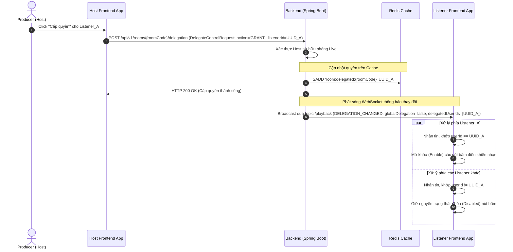
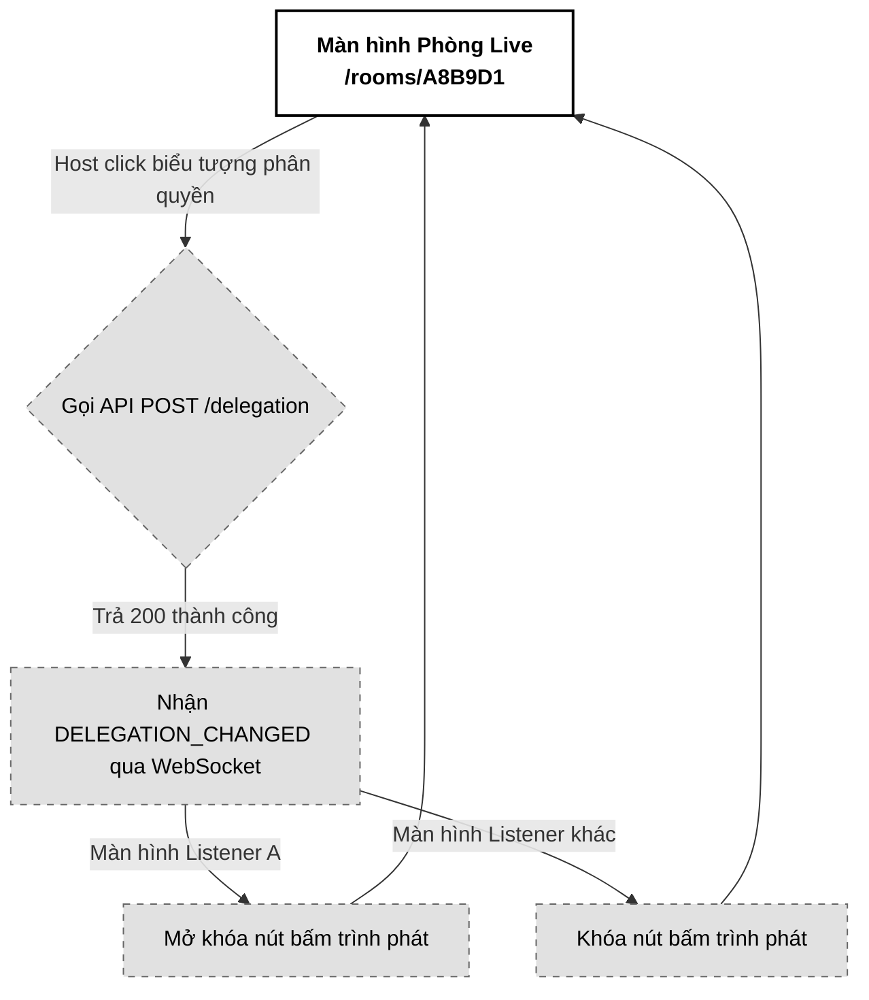

# 05. Phân quyền Điều khiển trình phát (Control Delegation)

Tài liệu đặc tả A-Z tính năng Phân quyền Điều khiển trình phát (Control Delegation) trong phòng Live Room, cho phép Host (Producer) ủy quyền điều khiển Play/Pause/Seek bài hát cho một Listener cụ thể hoặc mở quyền toàn phòng thời gian thực qua Redis Cache và WebSocket.

---

## 📋 1. Business & Requirements (Nghiệp vụ & Yêu cầu)

### 1.1. Mô tả Nghiệp vụ (User Story / Use Case)
*   **Đối tượng thực hiện**: Host (Chủ phòng Live Room - `ROLE_USER_PRO`).
*   **Quy trình tóm tắt**:
    *   *Ủy quyền cá nhân*: Host mở danh sách thành viên online, click biểu tượng "Cấp quyền điều khiển" cạnh tên Listener_A. Backend ghi nhận và gửi thông báo qua WebSocket. Trình phát của Listener_A lập tức mở khóa (enable) các nút bấm điều khiển.
    *   *Ủy quyền toàn phòng*: Host click bật tùy chọn "Cho phép tất cả điều khiển". Toàn bộ Listener trong phòng lập tức được mở khóa nút bấm.
    *   *Thu hồi quyền*: Host tắt quyền điều khiển cá nhân hoặc toàn phòng, trình phát của các Listener tương ứng bị khóa lại (disabled).

### 1.2. Quy tắc Nghiệp vụ (Business Rules)

#### A. Quyền phân cấp & Quản lý vai trò điều khiển
*   **Chỉ Host mới có quyền phân quyền**: Listener được ủy quyền điều khiển nhạc chỉ được phép Play/Pause/Seek nhạc cục bộ, tuyệt đối không có quyền gọi API phân quyền cho người khác. Mọi nỗ lực truy cập API phân quyền của Listener đều bị chặn với mã lỗi HTTP `403 Forbidden`.
*   **Lưu trữ thông tin ủy quyền (Redis State)**:
    *   *Cấp quyền toàn phòng*: Trạng thái này lưu trong Redis Hash `room:status:{roomCode}` tại trường `globalDelegation` với giá trị `"true"` hoặc `"false"`.
    *   *Cấp quyền cá nhân*: Lưu danh sách ID người dùng (userId) được ủy quyền vào một Redis Set mang tên `room:delegated:{roomCode}`.
*   **Xóa dọn dẹp (Cleanup on leave)**: Khi một Listener rời khỏi phòng hoặc mất kết nối (ngắt kết nối WebSocket), hệ thống tự động xóa userId của người đó khỏi Redis Set `room:delegated:{roomCode}` để tránh lưu rác.

#### B. Phản hồi giao diện thời gian thực (Reactive Control lock/unlock)
*   Khi có thay đổi ủy quyền, Backend gửi bản tin `DELEGATION_CHANGED` qua WebSocket broadcast.
*   Tất cả Client nhận gói tin, so khớp logic:
    *   *Có quyền*: Nếu `globalDelegation` bằng `true`, HOẶC `userId` hiện tại có trong mảng `delegatedUserIds` -> Mở khóa nút bấm Play/Pause và thanh tua Seek.
    *   *Không có quyền*: Nếu không thỏa mãn các điều kiện trên -> Khóa (disable) các nút bấm và thanh seek.

---

### 1.3. Quy tắc Xác thực Dữ liệu (Validation Rules)

| API Request | Trường dữ liệu | Ràng buộc | Annotation (Backend) | Mô tả |
| :--- | :--- | :--- | :--- | :--- |
| `DelegateControlRequest` | `listenerId` | Bắt buộc, đúng định dạng UUID | `@NotNull` | ID tài khoản của Listener cần cấp/thu hồi quyền |
| | `action` | Bắt buộc, giá trị phải là `GRANT` hoặc `REVOKE` | `@NotBlank`, `@Pattern` | Hành động cấp (`GRANT`) hoặc thu hồi (`REVOKE`) |
| `GlobalDelegationRequest`| `enabled` | Bắt buộc | `@NotNull` | Bật (`true`) hoặc tắt (`false`) quyền điều khiển toàn phòng |

---

### 1.4. Giới hạn Tần suất Truy cập API (IP Rate Limiting)

| API Endpoint | Giới hạn | Mô tả |
| :--- | :--- | :--- |
| `POST /api/v1/rooms/{roomCode}/delegation` | **10 requests / phút / IP** | Tránh spam thay đổi quyền liên tục |
| `POST /api/v1/rooms/{roomCode}/delegation/global` | **10 requests / phút / IP** | Tránh spam thay đổi trạng thái toàn phòng |

---

## 🔄 2. User Flow & Sequence Diagram (Luồng người dùng & Sơ đồ tuần tự)

### 2.1. Luồng Cấp quyền điều khiển cá nhân (Individual Control Delegation)



##### 📝 Mô tả chi tiết các bước xử lý:
1.  **Host ra lệnh**: Host nhấn icon ủy quyền cạnh Listener_A. Frontend gửi `POST /rooms/{roomCode}/delegation` với payload `listenerId = UUID_A` và `action = 'GRANT'`.
2.  **Cập nhật Redis**: Backend xác thực Host, thêm UUID_A vào Set `room:delegated:{roomCode}` trên Redis.
3.  **Phát sóng WebSocket**: Backend broadcast sự kiện `DELEGATION_CHANGED` chứa danh sách các thành viên đang có quyền cá nhân và trạng thái toàn phòng.
4.  **Client cập nhật**:
    *   Listener_A nhận tin, thấy ID của mình nằm trong mảng `delegatedUserIds` -> chuyển đổi state sang mở khóa nút bấm trình phát nhạc.
    *   Các Listener khác không thấy ID của mình -> giữ nguyên trạng thái khóa.

---

## 💾 3. Database & Cache Schema (Thiết kế Cơ sở Dữ liệu & Cache)

### 3.1. Cấu trúc dữ liệu Redis bổ sung (Delegation State Storage)

| Định dạng Khóa (Redis Key) | Kiểu dữ liệu | Giá trị (Value) | TTL | Mục đích sử dụng |
| :--- | :--- | :--- | :--- | :--- |
| `room:status:{roomCode}` | `Hash` | Thêm trường `globalDelegation`: `"true"`/`"false"` | **4 giờ** | Cấu hình bật/tắt quyền toàn phòng. |
| `room:delegated:{roomCode}` | `Set` | Danh sách các `userId` (UUID) | **4 giờ** | Lưu trữ các Listener đang có quyền điều khiển cá nhân. |

---

## 🔌 4. API & WebSocket Specifications (Đặc tả API & Kênh truyền tin)

### 4.0. Cấu hình Chung
*   **Base Path**: `/api/v1`
*   **Headers**: `Authorization: Bearer <accessToken>`

---

### 4.1. API Ủy quyền điều khiển cá nhân (Delegate Control)
*   **Method**: `POST`
*   **Path**: `/api/v1/rooms/{roomCode}/delegation`
*   **Auth Level**: `Requires ROLE_USER_PRO`

#### Request Body (`DelegateControlRequest`):
```json
{
  "listenerId": "e5b84f32-3a78-43d9-9524-34e803c4f2aa",
  "action": "GRANT"
}
```

#### Response Thành công (200 OK):
```json
{
  "success": true,
  "message": "Cấp quyền điều khiển trình phát thành công",
  "data": null,
  "errors": null,
  "timestamp": "2026-07-01T15:20:00Z"
}
```

---

### 4.2. API Ủy quyền điều khiển toàn phòng (Global Delegation)
*   **Method**: `POST`
*   **Path**: `/api/v1/rooms/{roomCode}/delegation/global`
*   **Auth Level**: `Requires ROLE_USER_PRO`

#### Request Body (`GlobalDelegationRequest`):
```json
{
  "enabled": true
}
```

#### Response Thành công (200 OK):
```json
{
  "success": true,
  "message": "Cập nhật quyền điều khiển toàn phòng thành công",
  "data": null,
  "errors": null,
  "timestamp": "2026-07-01T15:21:00Z"
}
```

---

### 4.3. Đặc tả Tin nhắn WebSocket Broadcast (`DELEGATION_CHANGED`)
*   **Kênh nhận tin (Subscribe Topic)**: `/topic/rooms/{roomCode}/playback`
*   **Payload tin nhắn (JSON)**:
```json
{
  "event": "DELEGATION_CHANGED",
  "data": {
    "globalDelegation": false,
    "delegatedUserIds": [
      "e5b84f32-3a78-43d9-9524-34e803c4f2aa"
    ]
  }
}
```

---

### 4.4. Phụ lục Mã Lỗi Nghiệp Vụ (Error Codes)

| Http Status | Error Code (String) | Mô tả | Trường liên quan (`field`) |
| :--- | :--- | :--- | :--- |
| `400 Bad Request` | `VALIDATION_FAILED` | Hành động không hợp lệ (phải là `GRANT` hoặc `REVOKE`) | `action` |
| `403 Forbidden` | `FORBIDDEN_ACCESS` | Người gọi không có quyền Host của phòng này | `null` |

---

## 🎨 5. UI/UX & Frontend Integration Notes (Giao diện & Tích hợp)

### 5.1. Thiết kế Giao diện Phân quyền (Grayscale Theme & A11y)
*   **Bảng quản lý thành viên của Host**:
    *   Mỗi dòng thành viên trong danh sách online của Host hiển thị một icon hình chìa khóa hoặc bảng điều khiển nhỏ.
    *   Icon ở trạng thái chưa cấp quyền: Màu xám nhạt nét đứt (`stroke-neutral-300`).
    *   Icon ở trạng thái đã cấp quyền: Màu đen đậm (`stroke-black`).
    *   Nút bật/tắt toàn phòng: Dạng Switch đơn sắc phẳng (Nền xám nhạt khi tắt, đen khi bật).
*   **Accessibility (A11y)**:
    *   Các Switch và icon tương tác của Host bắt buộc khai báo vai trò `role="switch"`, `aria-checked="true/false"`, kèm nhãn `aria-label="Cấp quyền điều khiển cho Listener A"`.

---

### 5.2. Tối ưu hóa Hiệu năng & Trải nghiệm Lập trình viên (Performance & DevEx)
*   **State Sync trong Zustand Store**:
    *   Frontend lưu trạng thái `isPlayerEditable: boolean` trong Zustand. Trình phát nhạc sẽ đăng ký theo dõi (subscribe) thuộc tính này để cập nhật trạng thái `disabled` của các nút bấm Play/Pause/Seek ngay lập tức khi thay đổi.
*   **Chống spam click phân quyền**:
    *   Vô hiệu hóa tạm thời icon click phân quyền của dòng đó trong khi đợi API phản hồi (mờ đục icon, đặt `pointer-events: none`).

---

### 5.3. Trạng thái Kết nối & Trải nghiệm Reconnection (WebSocket UX)
*   Khi kết nối lại thành công sau khi mất mạng, Client gọi đồng thời API `/playback` để cập nhật lại cấu hình `globalDelegation` và danh sách `delegatedUserIds` mới nhất từ Redis, khôi phục trạng thái khóa/mở nút bấm chính xác.

---

### 5.4. Sơ đồ Luồng Màn hình (Screen Flow)



---

## 📊 6. Logging & Observability (Ghi nhận Nhật ký & Giám sát)

### 6.1. Log Points (Các điểm ghi log)

| Level | Sự kiện | Payload mẫu |
| :--- | :--- | :--- |
| `INFO` | Individual delegation change | `{"event": "CONTROL_DELEGATED", "roomCode": "A8B9D1", "listenerId": "e5b84f32-...", "action": "GRANT", "hostId": "c8b74f51-..."}` |
| `INFO` | Global delegation change | `{"event": "GLOBAL_DELEGATION_CHANGED", "roomCode": "A8B9D1", "enabled": true, "hostId": "c8b74f51-..."}` |
| `WARN` | Unauthorized delegation attempt | `{"event": "UNAUTHORIZED_DELEGATE_ATTEMPT", "roomCode": "A8B9D1", "userId": "e5b84f32-..."}` |

### 6.2. Quy tắc Bảo mật Log
*   Chỉ ghi nhận ID người dùng, không ghi nhận thông tin cá nhân hay địa chỉ IP của Listener được phân quyền vào nhật ký.
