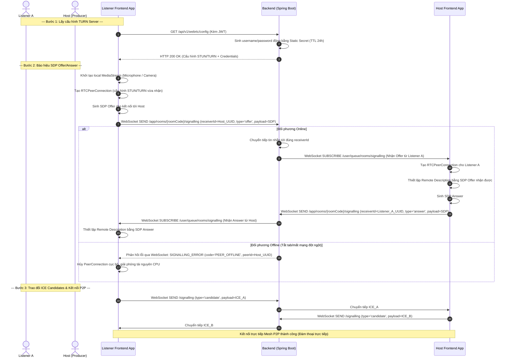
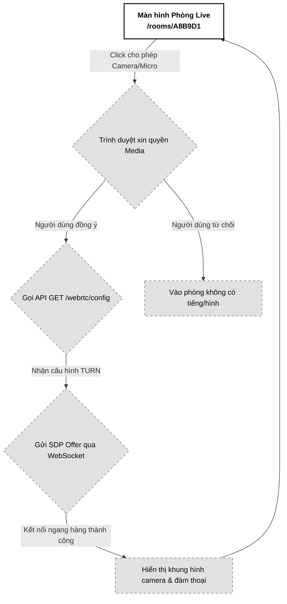

# 06. Đàm thoại trực tiếp WebRTC (Audio/Video P2P)

Tài liệu đặc tả A-Z tính năng Đàm thoại trực tiếp WebRTC (Low-latency Voice & Video) trong phòng Live Room, sử dụng mô hình kết nối lưới Mesh (Peer-to-Peer), kênh WebSocket STOMP làm máy chủ báo hiệu (Signalling Server) và cơ chế cấp khóa TURN Server động bảo mật.

---

## 📋 1. Business & Requirements (Nghiệp vụ & Yêu cầu)

### 1.1. Mô tả Nghiệp vụ (User Story / Use Case)
*   **Đối tượng thực hiện**: Toàn bộ thành viên trong phòng (Host và các Listener đã được duyệt).
*   **Quy trình tóm tắt**:
    1.  Thành viên tham gia vào phòng, Frontend tự động gọi API lấy cấu hình máy chủ STUN/TURN (kèm thông tin xác thực động).
    2.  Frontend khởi tạo camera và microphone cục bộ, thiết lập các kết nối ngang hàng (Peer Connection) tới các thành viên khác trong phòng.
    3.  Thông qua WebSocket STOMP (Signalling), các bên trao đổi gói tin SDP Offers/Answers và ICE Candidates.
    4.  Kết nối trực tiếp Mesh P2P được thiết lập. Các thành viên có thể đàm thoại và truyền camera cho nhau với độ trễ cực thấp (< 150ms).
    5.  Hệ thống hiển thị viền sáng quanh avatar của người đang nói (Active Speaker) và cho phép bật/tắt camera/micro cá nhân.

### 1.2. Quy tắc Nghiệp vụ (Business Rules)

#### A. Kiến trúc kết nối WebRTC Mesh (Peer-to-Peer)
*   Do giới hạn số người tối đa trong phòng Live Room là **7 người** (1 Host + 6 Listener), hệ thống áp dụng mô hình **Mesh**. Mỗi client sẽ duy trì kết nối trực tiếp đến $N-1$ client khác (tối đa 6 kết nối đồng thời cho mỗi người, tổng cộng tối đa 21 đường truyền ngang hàng toàn phòng).
*   Mô hình này giúp **Backend hoàn toàn không phải xử lý dữ liệu Audio/Video (không tốn băng thông và CPU làm media server)**, chỉ đóng vai trò làm máy chủ báo hiệu chuyển tiếp văn bản (Signalling Broker).

#### B. Cơ chế xác thực TURN Server động (Time-Lived Credentials)
*   Để vượt qua các tường lửa NAT phức tạp của mạng di động (3G/4G/5G) hay mạng văn phòng, hệ thống cấu hình TURN Server (ví dụ: `coturn`).
*   **Bảo mật băng thông**: Nhằm tránh việc kẻ xấu lấy cắp URL TURN Server để truyền tải dữ liệu chùa làm tăng chi phí băng thông, hệ thống sử dụng thuật toán **TURN REST API (Time-Lived Credentials)**:
    *   Backend sinh thông tin đăng nhập (`username`, `password`) động bằng cách sử dụng khóa bí mật (`TURN_STATIC_SECRET`) và thời gian hết hạn (`timestamp` sau 24 giờ).
    *   TURN Server đối chiếu kiểm tra chữ ký HMAC-SHA1 của mật khẩu để phê duyệt kết nối.

#### C. Nhận diện người đang nói (Active Speaker Detection)
*   Để tăng tương tác trực quan, Frontend sử dụng **Web Audio API (AnalyserNode)** để phân tích luồng âm thanh đầu vào (Microphone cục bộ và Audio track nhận từ các Peer):
    *   Khi âm lượng (Decibel) vượt ngưỡng nhất định (ví dụ: > -50dB) liên tục trong 200ms -> Hệ thống đánh dấu thành viên đó là `Active Speaker` và hiển thị viền sáng trên UI.
    *   Khi âm lượng hạ dưới ngưỡng trong 1 giây -> Tắt trạng thái nói.
    *   *Lưu ý*: Xử lý hoàn toàn ở client, không truyền dữ liệu âm lượng lên server.

#### D. Bật/Tắt Micro & Camera (Mute/Unmute Logic)
*   Khi người dùng click tắt Micro/Camera, Frontend thực hiện tắt trực tiếp track âm thanh/hình ảnh (`track.enabled = false`) trên luồng local media để bảo vệ sự riêng tư tuyệt đối, đồng thời gửi tin nhắn WebSocket thông báo cập nhật trạng thái UI để các bên khác hiển thị biểu tượng tắt mic/cam tương ứng.

#### E. Tránh xung đột báo hiệu (WebRTC Glare - Perfect Negotiation)
*   Trong kết nối Mesh P2P, khi hai thành viên truy cập hoặc phục hồi mạng đồng thời, có thể xảy ra tình trạng cả hai bên cùng gửi SDP Offer cho nhau cùng lúc. Hiện tượng này gọi là **xung đột báo hiệu (WebRTC Glare Effect)** và có thể gây lỗi treo đứt kết nối.
*   **Giải pháp (Perfect Negotiation)**: Thiết lập vai trò bất đối xứng cục bộ dựa trên so sánh chuỗi ID người dùng:
    *   Khi hai client khởi tạo kết nối chéo, hệ thống tự động so khớp chuỗi `userId` (UUID v4) của hai bên theo thứ tự bảng chữ cái (lexicographical comparison).
    *   Client có chuỗi `userId` nhỏ hơn được chỉ định làm **Polite Peer (Khách lịch thiệp)**, client còn lại làm **Impolite Peer**.
    *   Khi xảy ra Glare, `Polite Peer` nhận được Offer từ đối phương sẽ chủ động hủy bỏ (rollback) Offer cục bộ của mình để ưu tiên cấu hình Remote Description theo Offer nhận được và gửi trả SDP Answer, bẻ gãy hoàn toàn lỗi treo xung đột báo hiệu.

#### F. Kiểm tra và phản hồi trạng thái ngoại tuyến của Peer (PEER_OFFLINE Detection)
*   Khi Signalling Server nhận frame chuyển tiếp báo hiệu qua WebSocket, trước khi gửi tin nhắn tới `receiverId`, Backend phải kiểm tra xem Session của người nhận còn hoạt động trong Registry hay không.
*   Nếu `receiverId` đã offline (ngắt kết nối WebSocket đột ngột do mất mạng/tắt tab), Signalling Server lập tức gửi trả một frame lỗi cá nhân về cho client gửi: `{"event": "SIGNALLING_ERROR", "code": "PEER_OFFLINE", "peerId": "receiverId"}`.
*   Frontend người gửi khi nhận lỗi `PEER_OFFLINE` sẽ dừng việc chờ đợi SDP Answer vô ích, chủ động hủy bỏ tiến trình thiết lập kết nối ngang hàng đó và giải phóng CPU sớm.

---

### 1.3. Quy tắc Xác thực Dữ liệu (Validation Rules)

Gói tin báo hiệu gửi lên WebSocket `/app/rooms/{roomCode}/signalling` phải tuân thủ schema cấu trúc:

| Trường dữ liệu | Ràng buộc | Định dạng | Mô tả |
| :--- | :--- | :--- | :--- |
| `receiverId` | Bắt buộc | UUID | ID của thành viên nhận gói tin báo hiệu này |
| `type` | Bắt buộc | String (`offer`, `answer`, `candidate`) | Loại gói tin báo hiệu WebRTC |
| `payload` | Bắt buộc | String (JSON string chứa SDP hoặc ICE Candidate) | Nội dung cấu hình WebRTC |

---

### 1.4. Giới hạn Tần suất Truy cập API (IP Rate Limiting)

*   Áp dụng giới hạn Frame trên cổng WebSocket báo hiệu `/app/rooms/{roomCode}/signalling` ở mức tối đa **100 frames / phút / kết nối** để tránh các script giả lập spam gói tin báo hiệu làm treo Server WebSocket.

---

## 🔄 2. User Flow & Sequence Diagram (Luồng người dùng & Sơ đồ tuần tự)

### 2.1. Luồng Báo hiệu Thiết lập kết nối WebRTC (Signalling Flow)



##### 📝 Mô tả chi tiết các bước xử lý:
1.  **Lấy ICE Servers**: Frontend gọi API `GET /webrtc/config` để nhận danh sách máy chủ STUN và TURN. Mật khẩu kết nối TURN được Backend tạo động bằng HMAC-SHA1 dựa trên timestamp (TTL 24h).
2.  **Khởi tạo luồng**: Trình duyệt xin quyền truy cập Micro/Camera và hiển thị luồng nội bộ (Local Stream).
3.  **Tạo SDP Offer**: Đối với mỗi thành viên khác trong phòng, Client tạo một đối tượng `RTCPeerConnection` và tạo `SDP Offer`. Gửi Offer này lên WebSocket của Backend đích danh tới thành viên kia.
4.  **Báo hiệu trung gian**: Backend nhận được tin nhắn STOMP từ `/app/rooms/{roomCode}/signalling`, trích xuất `receiverId`. Đầu tiên, Backend kiểm tra sự tồn tại của kết nối hoạt động cho `receiverId` trong Registry. Nếu online, Backend chuyển thẳng tới private queue `/user/queue/rooms/signalling` của người nhận. Nếu offline, Backend lập tức gửi trả một frame lỗi `SIGNALLING_ERROR` (`PEER_OFFLINE`) về cho Client gửi để họ chủ động hủy Peer Connection và giải phóng CPU sớm.
5.  **SDP Answer & ICE Exchange**: Người nhận nhận Offer, cấu hình remote description, tạo `SDP Answer` và gửi trả lại qua luồng WebSocket tương tự. Song song đó, hai bên liên tục trao đổi các gói tin địa chỉ mạng `ICE Candidates` để tìm đường truyền tối ưu nhất.
6.  **Kết nối trực tiếp**: Trình duyệt thiết lập kết nối ngang hàng (Mesh P2P). Luồng âm thanh và hình ảnh bắt đầu truyền trực tiếp giữa 2 máy khách không đi qua Server Backend.

---

## 💾 3. Database & Cache Schema (Thiết kế Cơ sở Dữ liệu & Cache)

Nghiệp vụ WebRTC Mesh không lưu trữ trạng thái kết nối dưới DB để đảm bảo hiệu năng. Cấu hình bảo mật được khai báo trong file cấu hình Backend (`application.yml`):

```yaml
app:
  webrtc:
    turn-servers:
      - url: "turn:turn.pwbmini.com:3478?transport=udp"
      - url: "turn:turn.pwbmini.com:3478?transport=tcp"
    turn-static-secret: "MySuperStaticTurnSecretKey123!" # Khóa bí mật dùng để sinh password động
```

---

## 🔌 4. API & WebSocket Specifications (Đặc tả API & Kênh truyền tin)

### 4.0. Cấu hình Chung
*   **Base Path**: `/api/v1`
*   **Headers**: `Authorization: Bearer <accessToken>`

---

### 4.1. API Lấy cấu hình máy chủ ICE STUN/TURN (Get ICE Config)
*   **Method**: `GET`
*   **Path**: `/api/v1/webrtc/config`
*   **Auth Level**: `Requires Authentication` (Chỉ thành viên đã đăng nhập và được duyệt mới gọi được)

#### Response Thành công (200 OK):
```json
{
  "success": true,
  "message": "Lấy cấu hình WebRTC thành công",
  "data": {
    "iceServers": [
      {
        "urls": [
          "stun:stun.l.google.com:19302"
        ]
      },
      {
        "urls": [
          "turn:turn.pwbmini.com:3478?transport=udp",
          "turn:turn.pwbmini.com:3478?transport=tcp"
        ],
        "username": "1782928500:user_c8b74f51",
        "credential": "h/13245asdDAsf/214asdA="
      }
    ]
  },
  "errors": null,
  "timestamp": "2026-07-01T15:30:00Z"
}
```

---

### 4.2. Đặc tả Tin nhắn WebSocket Chuyển tiếp (Client-to-Server)
*   **Kênh gửi báo hiệu**: `/app/rooms/{roomCode}/signalling`
*   **Payload tin nhắn (JSON offer mẫu)**:
```json
{
  "receiverId": "c8b74f51-3a78-43d9-9524-34e803c4f2bb",
  "type": "offer",
  "payload": "{\"type\":\"offer\",\"sdp\":\"v=0\\r\\no=- 123456...\"}"
}
```

---

### 4.3. Kênh WebSocket Nhận báo hiệu riêng tư (Server-to-Client)
*   **Kênh nhận tin (Subscribe Topic)**: `/user/queue/rooms/signalling`
*   **Payload tin nhắn thành công**: Nhận nguyên văn JSON chuyển tiếp từ phía người gửi gửi lên (Server tự động bổ sung trường `senderId` trong payload để người nhận biết tin nhắn từ ai gửi đến).
*   **Payload tin nhắn lỗi (SIGNALLING_ERROR)**: Khi người nhận không online, Server phản hồi lỗi về hàng đợi của người gửi:
```json
{
  "event": "SIGNALLING_ERROR",
  "code": "PEER_OFFLINE",
  "peerId": "e5b84f32-3a78-43d9-9524-34e803c4f2aa"
}
```

---

## 🎨 5. UI/UX & Frontend Integration Notes (Giao diện & Tích hợp)

### 5.1. Thiết kế Giao diện Đàm thoại (Grayscale Theme & A11y)
*   **Lưới camera (Video Grid Layout)**:
    *   Thiết kế lưới hiển thị camera đơn giản, sử dụng flexbox/grid tự động chia khung hình theo số lượng người online (tối đa 7 khung hình).
    *   Nếu thành viên không bật camera, hiển thị Avatar dạng tròn đen trắng tối giản trên nền xám nhạt `bg-neutral-100`.
*   **Viền sáng nhận diện người nói (Active Speaker Highlight)**:
    *   Khi Web Audio API nhận thấy thành viên đang nói, khung camera/avatar của người đó hiển thị một viền đen mảnh đậm (`border-black border-2`) hoặc đổ bóng mờ nhẹ xung quanh. Tránh sử dụng màu sắc sặc sỡ (như xanh lá) để giữ vững phong cách Monochrome.
*   **Nút tương tác (Mute & Camera toggles)**: Nút bấm tròn dẹt phẳng màu xám nhạt. Khi Mute, hiển thị gạch chéo chéo mờ trên icon micro/camera.
*   **Accessibility (A11y)**:
    *   Các khung hình camera của Listener có thuộc tính `role="region"`, `aria-label="Khung hình của Ca sĩ Khánh Phương"`.
    *   Nút bật/tắt mic/cam có `aria-pressed="true/false"` để thông báo trạng thái nhấn cho trình đọc màn hình.

---

### 5.2. Tối ưu hóa Hiệu năng & Web Audio API (Performance & Web Audio)
*   **Xử lý Active Speaker Detector cục bộ**:
    ```typescript
    // Sử dụng AudioContext để phân tích âm lượng
    const audioContext = new AudioContext();
    const source = audioContext.createMediaStreamSource(remoteStream);
    const analyser = audioContext.createAnalyser();
    source.connect(analyser);
    
    const dataArray = new Uint8Array(analyser.frequencyBinCount);
    // Đo đạc định kỳ bằng requestAnimationFrame
    function checkVolume() {
      analyser.getByteFrequencyData(dataArray);
      let sum = 0;
      for (let i = 0; i < dataArray.length; i++) sum += dataArray[i];
      const average = sum / dataArray.length;
      if (average > 30) { // Ngưỡng nói
        setIsSpeaking(true);
      } else {
        setIsSpeaking(false);
      }
      requestAnimationFrame(checkVolume);
    }
    ```
*   **Tắt Camera khi ẩn Tab (Tab Visibility Performance)**:
    *   Nếu tab trình duyệt của phòng Live Room bị ẩn đi (`document.hidden === true`), Frontend nên tạm thời dừng render luồng video và gửi tín hiệu hạ thấp chất lượng (hoặc dừng track video tạm thời) để tiết kiệm 70% tài nguyên GPU và băng thông máy khách, kích hoạt lại khi tab được mở lại.
*   **Giải phóng kết nối rác (PeerConnection Cleanup on ICE Failure)**:
    *   **Vấn đề**: Khi mạng của thành viên (ví dụ: Listener A) gặp sự cố chập chờn đột ngột hoặc tắt ngang tab mà không gửi tín hiệu ngắt kết nối (`Disconnect`) qua WebSocket, `RTCPeerConnection` của các thành viên khác kết nối đến Listener A sẽ bị treo ở trạng thái `failed` hoặc `disconnected`.
    *   **Giải pháp**: Frontend đăng ký hàm lắng nghe sự kiện `oniceconnectionstatechange` trên mỗi kết nối ngang hàng:
        ```typescript
        peerConnection.oniceconnectionstatechange = () => {
          const state = peerConnection.iceConnectionState;
          if (state === 'failed' || state === 'disconnected') {
            // Đóng kết nối ngang hàng bị lỗi
            peerConnection.close();
            // Giải phóng luồng và dọn dẹp các audio/video tracks liên quan
            removeRemoteStream(peerId);
            // Xóa khung hình camera của peer bị mất kết nối khỏi UI grid
            removeVideoFrameFromUI(peerId);
          }
        };
        ```
        Việc chủ động dọn dẹp tại client giúp tối ưu hóa hiệu năng, giải phóng RAM/CPU ngay lập tức mà không cần phụ thuộc vào tín hiệu Signalling từ WebSocket.
*   **Phòng ngự quá tải băng thông Host (Asymmetric Mesh Bitrate Cap)**:
    *   **Vấn đề**: Khi Host bật video camera và microphone, họ phải gánh vác việc upload đồng thời luồng media tới tối đa 6 Listener khác trong phòng qua cơ chế Mesh P2P. Nếu băng thông Upload của Host yếu, việc mã hóa song song 6 luồng stream sẽ làm nghẽn mạng, gây vỡ hình/mất tiếng toàn phòng.
    *   **Giải pháp**: Host (hoặc bất kỳ thành viên nào phát stream) cấu hình các tham số mã hóa `RTCRtpEncodingParameters` để giới hạn cứng băng thông video tối đa ở mức **300kbps** (độ phân giải tối đa 360p hoặc 480p, fps tối đa 15-20 frames/giây) và ưu tiên độ mịn âm thanh (Audio Priority):
        ```typescript
        const sender = peerConnection.getSenders().find(s => s.track.kind === 'video');
        if (sender) {
          const parameters = sender.getParameters();
          parameters.encodings[0].maxBitrate = 300000; // 300kbps
          parameters.encodings[0].scaleResolutionDownBy = 2.0; // Giảm độ phân giải để tối ưu bitrate
          await sender.setParameters(parameters);
        }
        ```
        Việc hy sinh chất lượng hình ảnh thoại giúp bảo vệ băng thông và giữ cho tiếng nói đàm thoại luôn rõ ràng, ổn định trong suốt phiên nghe nhạc.

---

### 5.3. Sơ đồ Luồng Màn hình (Screen Flow)



---

## 📊 6. Logging & Observability (Ghi nhận Nhật ký & Giám sát)

### 6.1. Log Points (Các điểm ghi log)

| Level | Sự kiện | Payload mẫu |
| :--- | :--- | :--- |
| `INFO` | ICE servers config requested | `{"event": "ICE_CONFIG_REQUESTED", "userId": "c8b74f51-..."}` |
| `INFO` | Signalling frame forwarded | `{"event": "SIGNALLING_FORWARDED", "senderId": "e5b84f32-...", "receiverId": "c8b74f51-...", "type": "offer"}` |
| `WARN` | Signalling target offline | `{"event": "SIGNALLING_TARGET_OFFLINE", "receiverId": "c8b74f51-...", "senderId": "e5b84f32-..."}` |
| `ERROR` | TURN Server secret error | `{"event": "TURN_CREDENTIALS_FAILED", "error": "Static secret not configured"}` |

### 6.2. Quy tắc Bảo mật Log
*   **Tuyệt đối không log nội dung trường `payload` của bản tin Signalling** lên hệ thống log. Nội dung SDP chứa thông tin mạng chi tiết (IP nội bộ, cấu hình cổng) của người dùng, việc log lại sẽ vi phạm nghiêm trọng an toàn thông tin. Chỉ ghi nhận loại bản tin (`type`) và ID người gửi/nhận.
