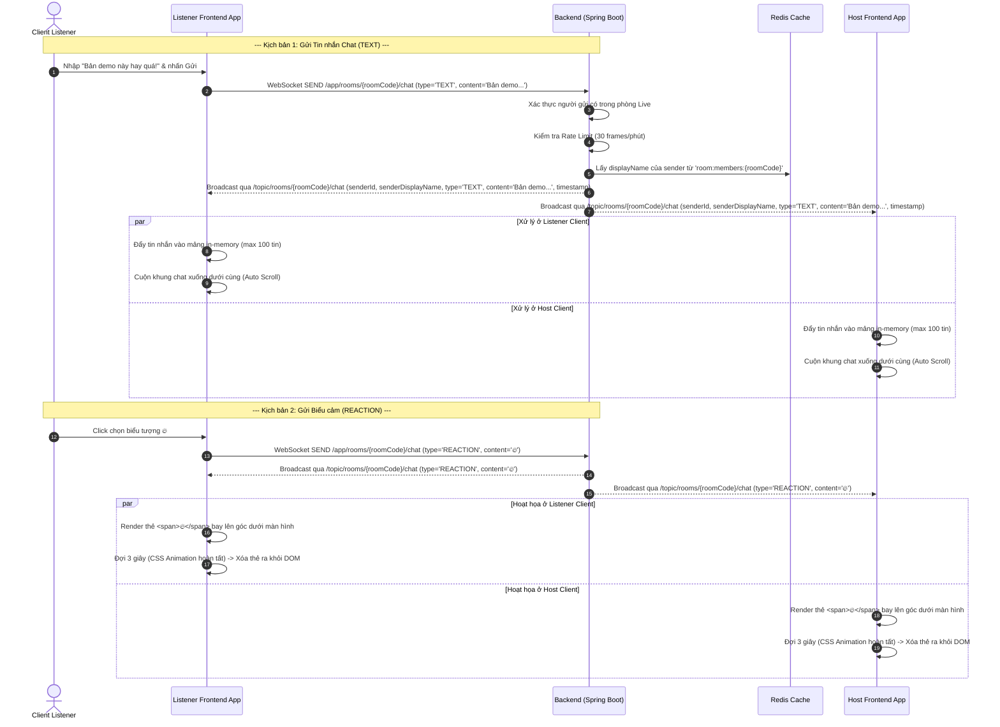
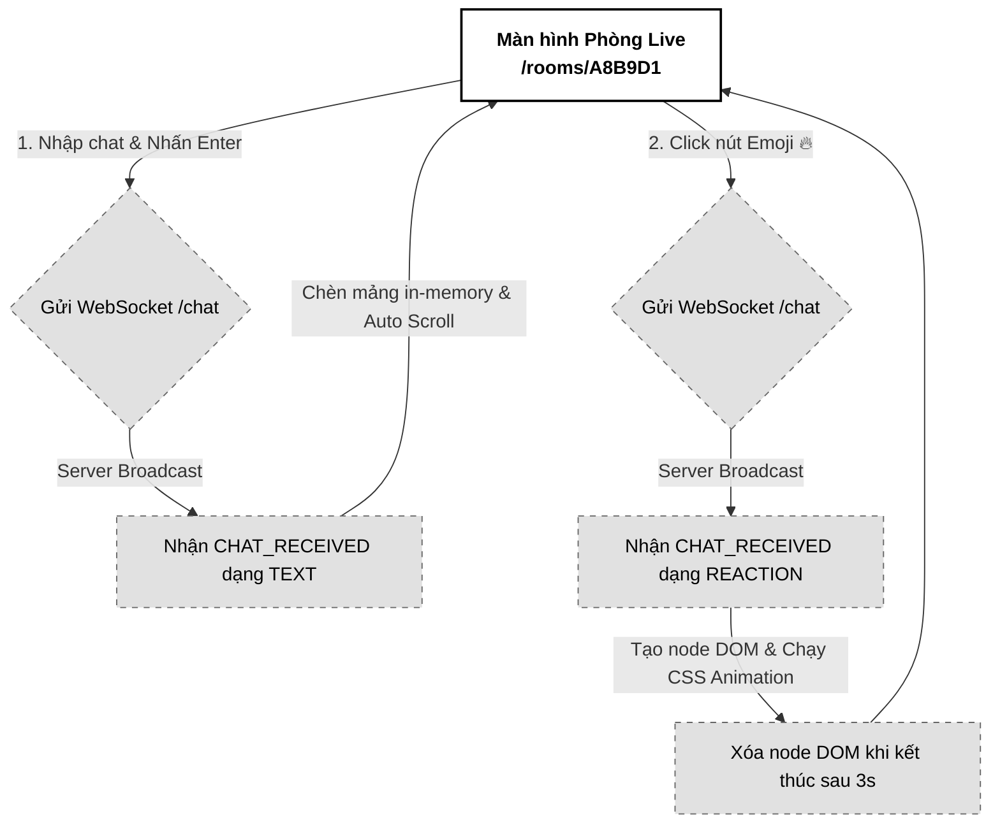

# 07. Tương tác thời gian thực (Chat & Reactions)

Tài liệu đặc tả A-Z tính năng Tương tác thời gian thực trong phòng Live Room, bao gồm kênh Chat bảo mật tạm thời (Ephemeral Chat - không lưu DB) và biểu cảm cảm xúc nhanh (Emoji Reactions) với hiệu ứng hoạt hình bay lên (Floating Animation) tiết kiệm tài nguyên.

---

## 📋 1. Business & Requirements (Nghiệp vụ & Yêu cầu)

### 1.1. Mô tả Nghiệp vụ (User Story / Use Case)
*   **Đối tượng thực hiện**: Toàn bộ thành viên đang online trong phòng (Host và các Listener đã được duyệt).
*   **Quy trình tóm tắt**:
    *   *Chat văn bản*: Thành viên nhập tin nhắn chat và gửi. Hệ thống chuyển tiếp tức thời qua WebSocket tới toàn phòng. Tin nhắn chỉ hiển thị tạm thời trên giao diện, không được lưu trữ vào bất cứ cơ sở dữ liệu nào.
    *   *Emoji Reactions*: Thành viên click chọn một trong 4 biểu tượng nhanh (🔥, 👍, 👏, 💯). Hệ thống phát sóng WebSocket và kích hoạt hiệu ứng hoạt hình bay lên màn hình của toàn bộ mọi người trong phòng ảo trong 2-3 giây.

### 1.2. Quy tắc Nghiệp vụ (Business Rules)

#### A. Ephemeral Chat (Hộp thoại Chat Tạm thời)
*   **Tuyệt đối không lưu lịch sử**: Để bảo vệ an toàn thông tin sản phẩm và nội dung trao đổi nội bộ, hệ thống **không lưu trữ tin nhắn chat vào PostgreSQL hay Redis**.
*   **Lưu trữ ở Client**: Tin nhắn chỉ được lưu trong bộ nhớ tạm (in-memory state) ở Frontend của mỗi máy khách.
*   **Tự động xóa sạch**: Khi người dùng tải lại trang (F5/Refresh) hoặc khi phòng đóng, toàn bộ lịch sử chat trước đó sẽ biến mất vĩnh viễn và không thể khôi phục.
*   **Giới hạn số tin nhắn hiển thị**: Để tránh làm đơ hoặc tràn bộ nhớ trình duyệt khi phòng chat quá lâu, Frontend chỉ lưu trữ tối đa **100 tin nhắn gần nhất**. Khi tin nhắn thứ 101 xuất hiện, tin nhắn cũ nhất sẽ tự động bị xóa khỏi bộ nhớ Client.

#### B. Cơ chế biểu tượng cảm xúc bay lên (Floating Emoji Reactions)
*   Hệ thống hỗ trợ 4 biểu tượng cảm xúc nhanh định danh: 🔥 (Lửa), 👍 (Thích), 👏 (Vỗ tay), 💯 (Tuyệt vời).
*   Khi nhận sự kiện `REACTION` từ WebSocket, Frontend sinh một thẻ biểu tượng tương ứng tại vị trí ngẫu nhiên ở góc dưới màn hình và chạy hiệu ứng CSS Animation bay lên trên kèm mờ dần.
*   **Tự động hủy DOM (Garbage Collection)**: Để tránh rò rỉ bộ nhớ (DOM Leak) làm chậm trình duyệt khi nhiều người spam biểu cảm, thẻ emoji bắt buộc phải bị xóa hoàn toàn khỏi cấu trúc cây DOM (`element.remove()`) ngay sau khi animation kết thúc (sau 3 giây).

---

### 1.3. Quy tắc Xác thực Dữ liệu (Validation Rules)

Gói tin STOMP gửi lên cổng WebSocket `/app/rooms/{roomCode}/chat` phải tuân thủ schema cấu trúc:

| Trường dữ liệu | Ràng buộc | Định dạng | Mô tả |
| :--- | :--- | :--- | :--- |
| `type` | Bắt buộc | String (`TEXT`, `REACTION`) | Phân loại tin nhắn gửi lên |
| `content` | Bắt buộc. Nếu type là `TEXT` thì tối đa 200 ký tự. Nếu type là `REACTION` thì phải là 1 trong 4 ký tự emoji hợp lệ. | String | Nội dung văn bản tin nhắn hoặc ký tự emoji |

---

### 1.4. Giới hạn Tần suất Truy cập API (IP Rate Limiting)

*   Áp dụng giới hạn Frame trên cổng WebSocket chat `/app/rooms/{roomCode}/chat` ở mức tối đa **30 frames / phút / kết nối**. 
*   Nếu vượt quá giới hạn này, server sẽ chặn không phát sóng các tin nhắn tiếp theo để ngăn chặn hành vi cố tình sử dụng autoclicker spam icon làm crash giao diện của người dùng khác.

---

## 🔄 2. User Flow & Sequence Diagram (Luồng người dùng & Sơ đồ tuần tự)

### 2.1. Luồng Gửi Tin nhắn và Biểu cảm thời gian thực (Chat & Reactions Flow)



##### 📝 Mô tả chi tiết các bước xử lý:
1.  **Gửi nội dung**: Thành viên nhập tin nhắn hoặc bấm click biểu tượng emoji nhanh. Frontend đóng gói và gửi qua STOMP WebSocket đến đích `/app/rooms/{roomCode}/chat`.
2.  **Kiểm tra và Bổ sung thông tin**: Backend nhận tin nhắn, kiểm tra Rate Limit của kết nối. Thực hiện truy vấn nhanh thông tin tên hiển thị (`displayName`) của người gửi trong Redis Hash thành viên hoạt động `room:members:{roomCode}` để làm giàu (enrich) gói tin trước khi broadcast.
3.  **Phát sóng**: Backend broadcast gói tin chứa (`senderId`, `senderDisplayName`, `type`, `content`, `timestamp`) đến topic chung `/topic/rooms/{roomCode}/chat`.
4.  **Xử lý tại Client**:
    *   *Tin nhắn TEXT*: Khung chat nhận tin, chèn vào mảng state, nếu kích thước mảng vượt quá 100 thì pop tin cũ nhất. Tự động cuộn khung chat xuống dưới.
    *   *Tin nhắn REACTION*: Kích hoạt hàm render động Emoji, thiết lập hiệu ứng CSS keyframe để emoji chuyển động đi lên, xoay và mờ dần trong 3 giây. Ngay khi kết thúc, trigger hàm Javascript để xóa node phần tử đó khỏi DOM để tránh rò rỉ bộ nhớ RAM.

---

## 💾 3. Database & Cache Schema (Thiết kế Cơ sở Dữ liệu & Cache)

Tính năng này **không thiết kế bảng cơ sở dữ liệu PostgreSQL** và không lưu trữ lịch sử tin nhắn trong Redis. Hệ thống chỉ đọc thông tin hiển thị của thành viên từ Redis Hash `room:members:{roomCode}` đã định nghĩa ở Usecase 2 để điền vào trường `senderDisplayName`.

---

## 🔌 4. WebSocket Specifications (Đặc tả Tin nhắn WebSocket)

### 4.0. Cấu hình Chung
*   Các bản tin được chuyển giao thời gian thực thông qua kết nối STOMP hiện hữu.

---

### 4.1. Đặc tả Tin nhắn WebSocket Gửi lên (Client-to-Server)
*   **Kênh gửi lệnh (Destination)**: `/app/rooms/{roomCode}/chat`
*   **Payload tin nhắn Chat dạng văn bản (JSON)**:
```json
{
  "type": "TEXT",
  "content": "Bản demo này chất lượng âm thanh tốt quá!"
}
```

*   **Payload tin nhắn biểu cảm (JSON)**:
```json
{
  "type": "REACTION",
  "content": "🔥"
}
```

---

### 4.2. Đặc tả Tin nhắn WebSocket Phát sóng (Server-to-Client Broadcast)
*   **Kênh nhận tin (Subscribe Topic)**: `/topic/rooms/{roomCode}/chat`
*   **Payload tin nhắn nhận được (JSON)**:
```json
{
  "event": "CHAT_RECEIVED",
  "data": {
    "senderId": "e5b84f32-3a78-43d9-9524-34e803c4f2aa",
    "senderDisplayName": "Ca sĩ Khánh Phương",
    "type": "TEXT",
    "content": "Bản demo này chất lượng âm thanh tốt quá!",
    "timestamp": "2026-07-01T15:40:00.500Z"
  }
}
```

---

## 🎨 5. UI/UX & Frontend Integration Notes (Giao diện & Tích hợp)

### 5.1. Thiết kế Hộp thoại Chat & Hoạt họa Emoji (Grayscale Theme & A11y)
*   **Hộp thoại Chat (Chat Panel)**: 
    *   Bố trí dọc ở cạnh phải màn hình. Nền hộp chat xám siêu nhạt `bg-neutral-50`, chữ đen, các dòng tin nhắn được phân cách bằng đường kẻ xám mảnh. Tin nhắn của bản thân hiển thị chữ in đậm nhẹ để phân biệt.
*   **Bảng chọn Emoji**: Nằm ngay dưới khung nhập chat, hiển thị 4 nút bấm emoji xám phẳng.
*   **Hiệu ứng Bay lên (CSS Keyframes)**:
    *   Thiết kế hiệu ứng CSS tịnh tiến trục Y đi lên, kết hợp xoay nhẹ (rotate) và độ mờ (opacity) giảm dần về 0.
*   **Accessibility (A11y)**:
    *   Khung nhập chat sử dụng thẻ `form` chuẩn để người dùng nhấn phím `Enter` là tự động submit gửi tin nhắn.
    *   Khung hiển thị tin nhắn có thuộc tính `aria-live="polite"` để thông báo tin nhắn mới khi người dùng đang sử dụng tính năng hỗ trợ tiếp cận.

---

### 5.2. Tối ưu hóa Hiệu năng & Rò rỉ DOM (Performance & DOM Leak Prevention)
*   **Cơ chế Tự hủy Emoji**: Khi tạo element Reaction, Frontend lắng nghe sự kiện `animationend` để tự động xóa element. Đoạn code React mẫu minh họa:
    ```typescript
    function triggerReaction(emoji: string) {
      const id = Math.random().toString(36).substring(2);
      const container = document.getElementById("reaction-container");
      if (!container) return;
      
      const el = document.createElement("span");
      el.className = "floating-emoji animate-float-up";
      el.innerText = emoji;
      el.style.left = `${Math.random() * 80 + 10}%`; // Vị trí ngẫu nhiên chiều ngang
      
      container.appendChild(el);
      
      // Lắng nghe sự kiện animation kết thúc để xóa hoàn toàn phần tử
      el.addEventListener("animationend", () => {
        el.remove();
      });
    }
    ```

---

### 5.3. Trạng thái Kết nối & Trải nghiệm Reconnection (WebSocket UX)
*   Khi bị đứt kết nối WebSocket, khung chat chuyển sang trạng thái mờ, ô nhập tin nhắn và nút chọn emoji bị khóa (`disabled = true`) kèm gợi ý: *"Mất kết nối mạng. Đang kết nối lại để chat..."*.
*   Do hệ thống không lưu lịch sử dưới DB, khi reconnection thành công, lịch sử chat cũ vẫn được giữ nguyên trên giao diện cục bộ (không bị mất), nhưng các tin nhắn gửi đi trong thời gian đứt kết nối sẽ bị bỏ qua (không hỗ trợ gửi offline).

---

### 5.4. Sơ đồ Luồng Màn hình (Screen Flow)

Luồng hoạt động tương tác chat:



---

## 📊 6. Logging & Observability (Ghi nhận Nhật ký & Giám sát)

### 6.1. Log Points (Các điểm ghi log)

| Level | Sự kiện | Payload mẫu |
| :--- | :--- | :--- |
| `INFO` | Text message broadcasted | `{"event": "CHAT_TEXT_SENT", "roomCode": "A8B9D1", "senderId": "e5b84f32-..."}` |
| `INFO` | Reaction message broadcasted | `{"event": "CHAT_REACTION_SENT", "roomCode": "A8B9D1", "emoji": "🔥"}` |
| `WARN` | Chat rate limit hit | `{"event": "CHAT_RATE_LIMIT_HIT", "roomCode": "A8B9D1", "userId": "e5b84f32-..."}` |

### 6.2. Quy tắc Bảo mật Log
*   **Tuyệt đối không log nội dung văn bản (content) của tin nhắn chat** lên hệ thống lưu nhật ký của server để bảo đảm tính riêng tư tuyệt đối cho các trao đổi demo âm nhạc nội bộ. Chỉ ghi nhận độ dài tin nhắn hoặc loại tin nhắn.
