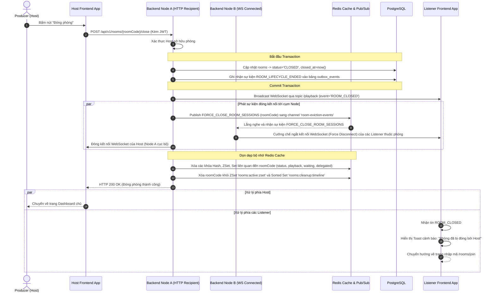
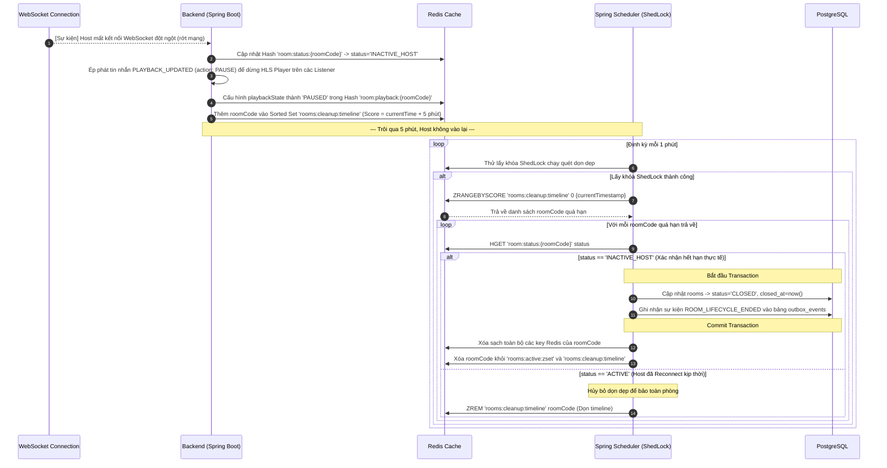
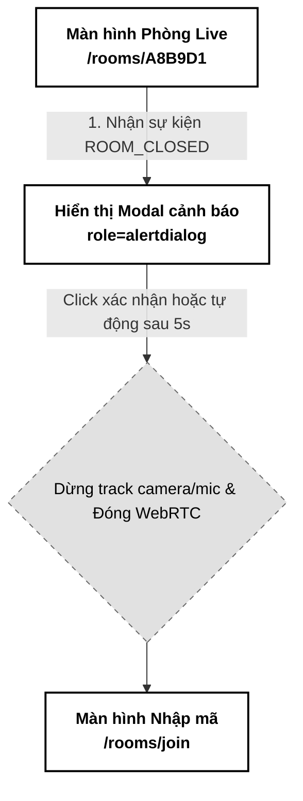

# 08. Quản lý Vòng đời phòng ảo (Room Lifecycle & Cleanup)

Tài liệu đặc tả A-Z quy trình quản lý vòng đời phòng ảo (Live Room Lifecycle) từ khi Host chủ động đóng phòng, cơ chế ân hạn tạm thời khi Host mất mạng (Grace Period) và tiến trình tự động dọn dẹp phòng trống (Idle / AFK Room Cleanup) chạy nền tối ưu hiệu năng.

---

## 📋 1. Business & Requirements (Nghiệp vụ & Yêu cầu)

### 1.1. Mô tả Nghiệp vụ (User Story / Use Case)
*   **Đối tượng thực hiện**: 
    *   *Host*: Thực hiện đóng phòng chủ động khi hoàn thành buổi nghe thử demo.
    *   *Hệ thống (Scheduler)*: Tự động phát hiện các phòng nhàn rỗi (không có người) hoặc phòng bị bỏ hoang do Host mất mạng để tiến hành dọn dẹp giải phóng tài nguyên.
*   **Quy trình tóm tắt**:
    *   *Chủ động đóng*: Host nhấn "Đóng phòng" -> Gọi API -> Cập nhật Database (`CLOSED`) -> Xóa cache Redis -> Gửi tin nhắn đóng phòng qua WebSocket -> Ép toàn bộ Listener ngắt kết nối và quay lại trang chủ.
    *   *Tự động dọn dẹp*: 
        *   Nếu Host bị mất kết nối đột ngột (rớt mạng), phòng được chuyển sang trạng thái `INACTIVE_HOST` và có **5 phút ân hạn (Grace Period)** để Host kết nối lại. Quá 5 phút, phòng tự động bị đóng.
        *   Nếu phòng không có bất kỳ thành viên nào (số người kết nối = 0) liên tục trong **15 phút**, hệ thống tự động đóng phòng.

### 1.2. Quy tắc Nghiệp vụ (Business Rules)

#### A. Host chủ động đóng phòng (Voluntary Close)
*   Chỉ Host mới có quyền gọi API đóng phòng. Lệnh đóng phòng thực hiện tuần tự:
    1. Cập nhật bản ghi phòng trong PostgreSQL sang trạng thái `CLOSED`, điền mốc giờ `closed_at = now()`, đồng thời ghi nhận một sự kiện vào bảng `outbox_events` mang tên `ROOM_LIFECYCLE_ENDED` (payload gồm: `roomCode`, `hostId`, `startedAt`, `endedAt` và `maxGuests` - số lượng Listener tối đa ghé thăm phòng) trong cùng một database transaction để đẩy qua Apache Kafka phục vụ tính toán Analytics.
    2. Gửi một bản tin WebSocket chứa sự kiện `ROOM_CLOSED` đến tất cả các thành viên qua topic `/topic/rooms/{roomCode}/playback`.
    3. Đợi 500ms (để các Client nhận tin nhắn và chuẩn bị giao diện), sau đó:
        *   Tắt và đóng toàn bộ các phiên kết nối WebSocket STOMP của phòng đó đang duy trì cục bộ trên instance hiện tại.
        *   Phát một thông điệp broadcast lên Redis Pub/Sub channel tên là `room-eviction-events` với payload chứa `{"event": "FORCE_CLOSE_ROOM_SESSIONS", "roomCode": "{roomCode}"}`. Tất cả các Node Backend khác trong cụm khi nhận tin nhắn này sẽ tự động đóng kết nối WebSocket của tất cả thành viên thuộc phòng đó, ngăn chặn hiện tượng **phiên mồ côi (WebSocket Clustered Session Leak)**.
    4. Xóa toàn bộ các khóa liên quan đến phòng đó trong Redis để giải phóng RAM:
        *   `room:status:{roomCode}` (Hash)
        *   `room:playback:{roomCode}` (Hash)
        *   `room:members:{roomCode}` (Hash)
        *   `room:waiting:{roomCode}` (ZSet)
        *   `room:delegated:{roomCode}` (Set)
        *   Xóa `roomCode` khỏi danh sách ZSet quản lý phòng hoạt động `rooms:active:zset` và Sorted Set `rooms:cleanup:timeline`.

#### B. Thời gian ân hạn mất kết nối của Host (Host Disconnect Grace Period)
*   Khi kết nối WebSocket của Host bị ngắt (phát hiện qua Heartbeat hoặc `SessionDisconnectEvent`):
    1. Cập nhật thuộc tính `status` trong Redis Hash `room:status:{roomCode}` từ `ACTIVE` thành `INACTIVE_HOST`.
    2. **Đóng băng luồng phát nhạc (HLS Stream Paused)**: Hệ thống lập tức cập nhật `playbackState` trong key `room:playback:{roomCode}` thành `PAUSED`, và phát sóng một bản tin `PLAYBACK_UPDATED` (action: `PAUSE`) tới toàn bộ Listener. Việc này ép buộc các trình phát nhạc cục bộ dừng phát nhạc ngay lập tức, ngăn chặn việc Listener nghe cố phần nhạc buffer cũ khi Host bị ngắt kết nối.
    3. **Đếm ngược quá hạn bằng ZSet Timeline**: Thêm mã phòng `roomCode` vào Redis Sorted Set `rooms:cleanup:timeline` với số điểm (score) là mốc thời gian hết hạn Epoch Milliseconds trong tương lai (`currentTime + 300000` - 5 phút).
    4. *Kịch bản A (Host kết nối lại kịp thời)*: Trong vòng 5 phút, Host kết nối WebSocket lại thành công -> Hệ thống chuyển trạng thái phòng lại thành `ACTIVE`, đồng thời gọi lệnh `ZREM rooms:cleanup:timeline {roomCode}` để gỡ bỏ đếm ngược dọn dẹp.
    5. *Kịch bản B (Quá 5 phút)*: Scheduler quét dọn dẹp nền tự động phát hiện phòng quá hạn trên ZSet timeline và thực thi đóng phòng vĩnh viễn.

#### C. Tự động đóng phòng nhàn rỗi (Empty Room AFK Cleanup)
*   Khi số lượng thành viên trong phòng giảm về 0 (thành viên cuối cùng ngắt kết nối WebSocket):
    *   Hệ thống thêm mã phòng `roomCode` vào Sorted Set `rooms:cleanup:timeline` with score đếm ngược là `currentTime + 900000` (15 phút).
    *   Nếu có người mới vào phòng trước khi hết hạn -> Gọi lệnh `ZREM rooms:cleanup:timeline {roomCode}` để hủy đếm ngược.
    *   Nếu quá 15 phút không có ai vào -> Scheduler nền quét và thực thi dọn dẹp.

#### D. Bộ quét dọn dẹp nền (Background Cleanup Scheduler) & Tối ưu hóa ZSet Expiration Timeline
*   Hệ thống sử dụng một Spring Scheduler chạy định kỳ **mỗi 1 phút** để quét các phòng hoạt động.
*   **Phòng chống Concurrency**: Cấu hình **ShedLock** trên Redis để đảm bảo chỉ có duy nhất một instance Backend thực hiện quét dọn dẹp tại một thời điểm. Cấu hình tham số khóa mở rộng tối đa `lockAtMostFor` ở mức **45-50 giây** (thay vì 10 phút) để nếu instance Backend đang chạy bị crash đột ngột (OOM, mất nguồn), khóa sẽ tự động giải phóng trước chu kỳ cron tiếp theo (1 phút), tránh treo tắc nghẽn dọn dẹp.
*   **Tối ưu hóa hiệu năng quét dọn dẹp ($O(\log M + K)$)**:
    *   Để tránh thắt nút cổ chai I/O khi duyệt vòng lặp $O(N)$ và gọi hàng ngàn lệnh `EXISTS` kiểm tra key, Scheduler chỉ cần thực thi duy nhất 1 lệnh nguyên tử trên Redis Sorted Set:
        `ZRANGEBYSCORE rooms:cleanup:timeline 0 {currentTimestamp}`
    *   Lệnh này trả về chính xác danh sách các mã phòng đã thực sự quá hạn ở thời điểm hiện tại.
    *   **Logic dọn dẹp chi tiết cho mỗi roomCode quá hạn**:
        1.  **Kiểm tra kép trạng thái phòng (Double-Check Status)**: Scheduler gọi `HGET room:status:{roomCode} status` để kiểm tra lại. Nếu status đã đổi thành `ACTIVE` (do Host vừa kịp reconnect đổi status lại ngay trước đó), Scheduler lập tức hủy bỏ và bỏ qua dọn dẹp phòng này.
        2.  Nếu status vẫn là `INACTIVE_HOST` (hoặc phòng trống), Scheduler gọi hàm đóng phòng tự động:
            *   Cập nhật DB PostgreSQL (`status = 'CLOSED'`, `closed_at = now()`), đồng thời ghi nhận sự kiện `ROOM_LIFECYCLE_ENDED` vào bảng `outbox_events` trong cùng một database transaction.
            *   Xóa toàn bộ các key Redis liên quan đến phòng.
            *   Xóa `roomCode` khỏi `rooms:active:zset` và `rooms:cleanup:timeline`.

---

### 1.3. Quy tắc Xác thực Dữ liệu (Validation Rules)
*   API đóng phòng `POST /api/v1/rooms/{roomCode}/close` không yêu cầu body, chỉ xác thực mã phòng trên URL Path và token JWT của người gọi trong Header.

---

### 1.4. Giới hạn Tần suất Truy cập API (IP Rate Limiting)

| API Endpoint | Giới hạn | Mô tả |
| :--- | :--- | :--- |
| `POST /api/v1/rooms/{roomCode}/close` | **5 requests / phút / IP** | Ngăn chặn việc bấm nút đóng phòng liên tục |

---

## 🔄 2. User Flow & Sequence Diagram (Luồng người dùng & Sơ đồ tuần tự)

### 2.1. Luồng Host chủ động Đóng phòng (Host Close Room Flow)



---

### 2.2. Luồng Tự động Dọn dẹp Phòng do Host mất mạng quá 5 phút



---

## 💾 3. Database & Cache Schema (Thiết kế Cơ sở Dữ liệu & Cache)

### 3.1. Các Khóa bộ đệm Redis bổ sung (Cache Keys)

| Định dạng Khóa (Redis Key) | Kiểu dữ liệu | Giá trị (Value) | TTL | Mục đích sử dụng |
| :--- | :--- | :--- | :--- | :--- |
| `rooms:cleanup:timeline` | `ZSet (Sorted Set)` | `roomCode` | **Vô hạn** | Quản lý dòng thời gian hết hạn của phòng (score là Epoch Timestamp hết hạn). |
| `rooms:active:zset` | `ZSet (Sorted Set)` | `roomCode` | **Vô hạn** | Danh sách tập hợp tất cả các phòng đang có trạng thái hoạt động trên hệ thống để Scheduler quét. |
| `shedlock:room_cleanup_job` | `String` | `"lock"` | **45-50 giây** (`lockAtMostFor`) | Đảm bảo duy nhất 1 instance Backend chạy Scheduled Job dọn dẹp tại một thời điểm. Mức TTL ngắn 45-50s giúp giải phóng lock nhanh nếu node bị crash, không làm kẹt chu kỳ cron tiếp theo. |

---

### 3.2. Sơ đồ Outbox Sự kiện thống kê (Transactional Outbox SQL Schema)
Để lưu vết Analytics, khi đóng phòng, hệ thống ghi bản ghi sự kiện sau vào PostgreSQL trong cùng Transaction cập nhật trạng thái phòng:

```sql
CREATE TABLE outbox_events (
    id UUID PRIMARY KEY,
    event_type VARCHAR(50) NOT NULL, -- 'ROOM_LIFECYCLE_ENDED'
    payload TEXT NOT NULL,           -- JSON chứa: roomCode, hostId, startedAt, endedAt, maxGuests
    status VARCHAR(20) NOT NULL,     -- 'PENDING', 'PROCESSED'
    created_at TIMESTAMP NOT NULL
);
```

---

### 3.3. Ràng buộc Hash Slot trên Redis Cluster (Redis Hash Tags Constraint)
*   **Vấn đề**: Các key riêng của phòng gồm `room:status:{roomCode}`, `room:playback:{roomCode}`, `room:members:{roomCode}`, `room:waiting:{roomCode}`, và `room:delegated:{roomCode}` đều dùng chung ký pháp bọc Curly Braces `{roomCode}` (Redis Hash Tags), do đó S3/Redis đảm bảo chúng nằm cùng 1 Hash Slot trên Cluster, cho phép xóa đồng loạt hoặc dùng transaction nguyên tử.
*   **Quy tắc bắt buộc**: Tuy nhiên, hai key hệ thống `rooms:active:zset` và `rooms:cleanup:timeline` không chứa hash tag `{roomCode}` ở đầu nên nằm ở các Hash Slot hoàn toàn khác. Tiến trình dọn dẹp **bắt buộc** phải chia làm 2 đợt gọi lệnh độc lập hoặc sử dụng Redis Pipeline đa slot (gửi bất đồng bộ), **tuyệt đối không** gộp chung toàn bộ tập hợp key này vào trong một lệnh `DEL` multi-key duy nhất hoặc một khối `MULTI/EXEC` đơn node để tránh kích hoạt lỗi `CROSSSLOT Keys in request don't hash to the same slot` của cụm Redis Cluster.

---

## 🔌 4. API & WebSocket Specifications (Đặc tả API)

### 4.0. Cấu hình Chung
*   **Base Path**: `/api/v1`
*   **Headers**: `Authorization: Bearer <accessToken>`

---

### 4.1. API Đóng phòng chủ động (Close Room)
*   **Method**: `POST`
*   **Path**: `/api/v1/rooms/{roomCode}/close`
*   **Auth Level**: `Requires ROLE_USER_PRO` (Chỉ Host mới gọi được)

#### Response Thành công (200 OK):
```json
{
  "success": true,
  "message": "Đóng phòng Live Room và dọn dẹp tài nguyên thành công",
  "data": null,
  "errors": null,
  "timestamp": "2026-07-01T15:50:00Z"
}
```

#### Response Thất bại do không phải Host (403 Forbidden):
```json
{
  "success": false,
  "message": "Bạn không có quyền đóng phòng này",
  "data": null,
  "errors": [
    {
      "code": "FORBIDDEN_ACCESS",
      "field": null,
      "message": "Chỉ Host mới được phép đóng phòng"
    }
  ],
  "timestamp": "2026-07-01T15:50:00Z"
}
```

---

### 4.2. Đặc tả Tin nhắn WebSocket Phát sóng khi Đóng phòng (`ROOM_CLOSED`)
*   **Kênh phát sóng**: `/topic/rooms/{roomCode}/playback`
*   **Payload tin nhắn (JSON)**:
```json
{
  "event": "ROOM_CLOSED",
  "data": {
    "roomCode": "A8B9D1",
    "reason": "Chủ phòng đã chủ động đóng phòng kết nối"
  }
}
```

---

### 4.3. Phụ lục Mã Lỗi Nghiệp Vụ (Error Codes)

| Http Status | Error Code (String) | Mô tả | Trường liên quan (`field`) |
| :--- | :--- | :--- | :--- |
| `403 Forbidden` | `FORBIDDEN_ACCESS` | Người dùng gọi API không phải là Host của phòng | `null` |
| `404 Not Found` | `ROOM_NOT_FOUND` | Không tìm thấy phòng hoặc phòng đã đóng trước đó | `roomCode` |

---

## 🎨 5. UI/UX & Frontend Integration Notes (Giao diện & Tích hợp)

### 5.1. Thiết kế Hộp thoại Cảnh báo Đóng phòng (Grayscale Theme & A11y)
*   **Trải nghiệm khi bị ép thoát (Force Redirect)**:
    *   Khi Listener nhận được sự kiện `ROOM_CLOSED` qua WebSocket, Frontend chặn ngay các hoạt động nghe nhạc/đàm thoại WebRTC.
    *   Hiển thị một hộp thoại Modal đơn sắc cảnh báo ở chính giữa màn hình: *"Buổi nghe thử đã kết thúc. Phòng đã được đóng bởi Producer"* kèm theo nút "Quay lại trang chủ" màu đen.
    *   Sau 5 giây, nếu người dùng không bấm, hệ thống tự động chuyển hướng về trang nhập mã `/rooms/join`.
*   **Accessibility (A11y)**:
    *   Hộp thoại Modal cảnh báo đóng phòng bắt buộc khai báo `role="alertdialog"` và `aria-modal="true"`. Tiêu điểm bàn phím tự động tập trung vào nút "Quay lại trang chủ" để người dùng dễ dàng thao tác bấm Enter.

---

### 5.2. Tối ưu hóa Hiệu năng & Trải nghiệm Lập trình viên (Performance & DevEx)
*   **Giải phóng WebRTC Media (Garbage Collection)**:
    *   Khi nhận sự kiện đóng phòng, Frontend bắt buộc phải chạy hàm dọn dẹp tài nguyên phần cứng của máy khách:
        ```typescript
        // Dừng toàn bộ các track camera và micro
        localStream.getTracks().forEach(track => track.stop());
        
        // Đóng các kết nối ngang hàng peer connection
        peerConnections.forEach(peerConnection => {
          peerConnection.close();
        });
        ```
    *   Nếu không dừng các track này, đèn thông báo camera/micro trên máy tính người dùng vẫn sẽ sáng (rò rỉ phần cứng) gây cảm giác bất an về bảo mật.

---

### 5.3. Trạng thái Kết nối & Trải nghiệm Reconnection (WebSocket UX)
*   Nếu mạng bị đứt đột ngột, Listener sẽ ở màn hình chờ kết nối lại (Reconnecting) trong tối đa 5 phút. 
*   Nếu trong thời gian đứt kết nối này, Host đóng phòng -> Khóa đếm ngược Grace Period của Host hết hạn -> Phòng bị xóa. Khi mạng của Listener khôi phục, quá trình reconnect WebSocket sẽ thất bại vì phòng không còn tồn tại trên Redis -> Hệ thống tự động chuyển hướng Listener về trang nhập mã kèm Toast thông báo: *"Phòng không tồn tại hoặc đã bị đóng."*

---

### 5.4. Sơ đồ Luồng Màn hình (Screen Flow)

Luồng chuyển dịch màn hình đối với Listener:



---

## 📊 6. Logging & Observability (Ghi nhận Nhật ký & Giám sát)

### 6.1. Log Points (Các điểm ghi log)

| Level | Sự kiện | Payload mẫu |
| :--- | :--- | :--- |
| `INFO` | Voluntary close room request | `{"event": "VOLUNTARY_CLOSE_REQUEST", "roomCode": "A8B9D1", "hostId": "c8b74f51-..."}` |
| `INFO` | Room closed and cache cleared | `{"event": "ROOM_CLOSED_SUCCESS", "roomCode": "A8B9D1", "closedBy": "HOST"}` |
| `INFO` | Host disconnected - Cooldown started | `{"event": "HOST_DISCONNECTED_GRACE", "roomCode": "A8B9D1", "cooldownSeconds": 300}` |
| `INFO` | AFK Idle cleanup executed | `{"event": "AFK_CLEANUP_EXECUTED", "roomCode": "A8B9D1", "reason": "EMPTY_ROOM_15M"}` |
| `WARN` | Unauthorized close attempt | `{"event": "UNAUTHORIZED_CLOSE_ATTEMPT", "roomCode": "A8B9D1", "userId": "e5b84f32-..."}` |

### 6.2. Quy tắc Bảo mật Log
*   Không ghi log chi tiết các token hay thông tin định danh IP của Listener khi thực hiện tiến trình dọn dẹp nền tự động.
