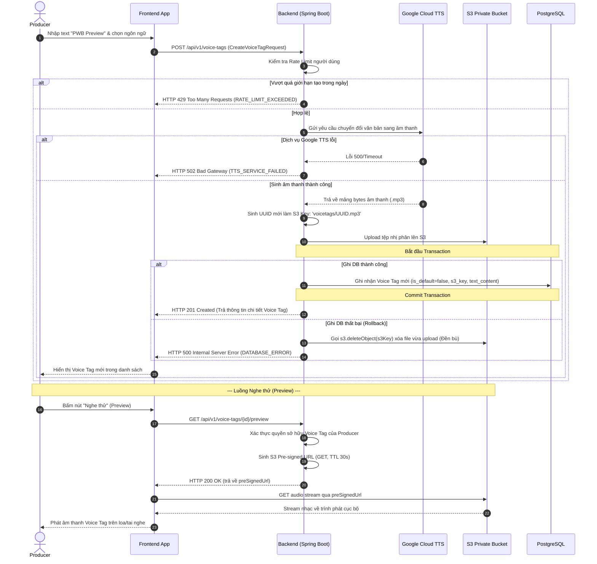
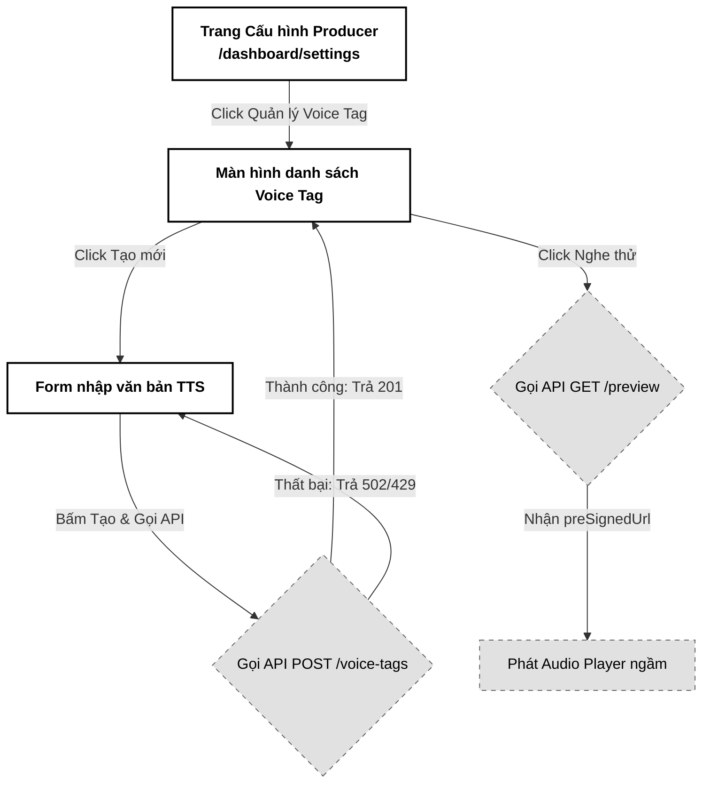

# 02. Tạo Voice Tag từ Văn bản TTS (Generate Voice Tag)

Tài liệu đặc tả A-Z tính năng Tạo Voice Tag từ Văn bản sử dụng công nghệ Chuyển đổi văn bản thành giọng nói (Google Cloud Text-to-Speech - TTS) để sinh thẻ âm thanh thương hiệu, đóng dấu bản quyền cho các tệp demo nghe thử.

---

## 📋 1. Business & Requirements (Nghiệp vụ & Yêu cầu)

### 1.1. Mô tả Nghiệp vụ (User Story / Use Case)
*   **Đối tượng thực hiện**: Producer (Music Producer - `ROLE_USER_PRO`).
*   **Quy trình tóm tắt**:
    1.  Producer truy cập màn hình Cấu hình, nhập văn bản thương hiệu muốn đọc (ví dụ: *"PWB Preview"* hoặc *"Bản nghe thử của Hoàng Nam"*).
    2.  Chọn ngôn ngữ (tiếng Việt, tiếng Anh,...) và loại giọng đọc (Nam/Nữ, chuẩn hoặc nâng cao).
    3.  Backend gửi yêu cầu sang Google Cloud TTS API, nhận về tệp tin âm thanh giọng đọc dạng nhị phân.
    4.  Backend tải tệp âm thanh này lên S3 Private Bucket và lưu bản ghi cấu hình vào Postgres.
    5.  Producer có thể nhấn nút nghe thử (Preview) trực tiếp hoặc cấu hình tệp Voice Tag này làm mặc định cho tất cả các bản nhạc tải lên sau này.

### 1.2. Quy tắc Nghiệp vụ (Business Rules)

#### A. Ràng buộc Độ dài Văn bản (TTS Cost Control)
*   **Giới hạn ký tự**: Văn bản Voice Tag giới hạn tối đa **100 ký tự** (bao gồm khoảng trắng). Việc này giúp kiểm soát chi phí sử dụng dịch vụ Google Cloud TTS và đảm bảo thời lượng Voice Tag ngắn gọn (thường dưới 4 giây), tránh che mất quá nhiều không gian âm nhạc của bản demo gốc.

#### B. Thiết lập Mặc định (Default Voice Tag)
*   Mỗi Producer có thể tạo nhiều Voice Tag khác nhau nhưng chỉ có tối đa **1 Voice Tag được đặt làm mặc định (`is_default = true`)** tại bất kỳ thời điểm nào.
*   Khi thiết lập một Voice Tag làm mặc định, hệ thống tự động cập nhật tất cả các Voice Tag khác của Producer đó về `is_default = false` trong cùng một transaction.
*   Khi Producer tải lên bản nhạc mới (Usecase 1) mà không chỉ định cụ thể `voiceTagId`, hệ thống tự động tìm và áp dụng Voice Tag mặc định này.
*   **Nguyên tử hóa mức cơ sở dữ liệu (Unique Partial Index)**: Để tránh tình trạng Race Condition khi Producer nhấn chuột nhanh/gửi các yêu cầu đồng thời thiết lập mặc định cho 2 tag khác nhau dẫn đến có nhiều hơn 1 tag mang giá trị mặc định, cơ sở dữ liệu PostgreSQL bắt buộc phải cấu hình ràng buộc Unique Partial Index ở mức schema:
    `CREATE UNIQUE INDEX idx_one_default_per_user ON voice_tags (owner_id) WHERE is_default = true;`
    Khi xảy ra xung đột tương tranh, DB sẽ ném lỗi `DataIntegrityViolationException`. Bộ xử lý lỗi tập trung (`GlobalExceptionHandler`) bắt buộc phải bắt ngoại lệ này, kiểm tra vi phạm đối với tên index `idx_one_default_per_user` và chuyển đổi thành phản hồi HTTP `409 Conflict` kèm mã lỗi nghiệp vụ `VOICE_TAG_ALREADY_DEFAULT` thay vì bùng lỗi 500 thô kệch.

#### C. Lưu trữ & Preview Bảo mật
*   Tệp âm thanh Voice Tag được lưu tại S3 Private Bucket dưới đường dẫn `voicetags/{UUID}.mp3`.
*   Để nghe thử Voice Tag trên Frontend, hệ thống không dùng URL trực tiếp mà sinh **S3 Pre-signed URL** với thời gian sống cực ngắn (**30 giây**) để đảm bảo an ninh thông tin.

#### D. Xử lý Lỗi Dịch vụ ngoài (External Service Outage)
*   Google Cloud TTS là dịch vụ bên thứ ba. Nếu xảy ra lỗi kết nối (Timeout), vượt hạn ngạch (Quota Exceeded) hoặc lỗi xác thực API:
    *   Backend ghi nhận log chi tiết lỗi, trả về HTTP `502 Bad Gateway` kèm mã lỗi nghiệp vụ `TTS_SERVICE_FAILED`.
    *   Giữ nguyên danh sách Voice Tag hiện tại của người dùng để họ thử lại sau.

#### E. Cấu hình SSML & Cắt khoảng lặng giọng đọc (SSML & Silence Removal)
*   **Nâng cấp SSML đọc tên nghệ danh (MIME/SSML Pronunciation Control)**: Nhằm kiểm soát cách phát âm các nghệ danh dạng từ viết tắt hoặc viết cách điệu (ví dụ: "HNAM" phát âm chuẩn thành "Hắc Nam" thay vì bị TTS đọc vấp thành "Hát-Năm"), Backend nâng cấp Request gửi sang Google TTS API từ định dạng Text thường sang định dạng **SSML (Speech Synthesis Markup Language)**.
    *   Frontend cung cấp trường nhập liệu hỗ trợ phiên âm hoặc chọn chế độ đánh vần.
    *   Payload gửi sang GCP được bọc trong thẻ `<speak>`: `<speak>Bản nghe thử của <say-as interpret-as="characters">HNAM</say-as></speak>` để điều chỉnh cao độ, cách phát âm.
*   **Bộ lọc chữ thô tầng Service (Raw Text Backend Validation)**: Do Spring validation sử dụng `@Size(max=250)` để cho phép chứa cú pháp SSML, kẻ xấu có thể gửi đoạn văn bản thô (không chứa XML/SSML tag) dài tới 240 ký tự, vượt quá 100 ký tự thô làm vỡ bố cục mixing Sidechain. Do đó, tại tầng Service của Backend trước khi gửi yêu cầu sang Google Cloud TTS, hệ thống bắt buộc phải dùng bộ lọc Regular Expression (hoặc XML parser gọn nhẹ) để lột bỏ tất cả các thẻ tag SSML (như `<speak>`, `<say-as>`, v.v.) rồi kiểm tra độ dài văn bản thô thực tế. Nếu `rawText.length() > 100`, Backend sẽ ném ngay lỗi `BusinessException` với mã lỗi `TTS_TEXT_TOO_LONG` (trả về HTTP `400 Bad Request`).
*   **Cắt khoảng lặng giọng đọc (Silence Removal)**: Giọng đọc tạo ra từ Google TTS thường chứa khoảng lặng (silence padding) khoảng 0.3s - 0.5s ở đầu và cuối tệp. Nhằm tránh lỗi dìm âm lượng nhạc nền sớm vô lý (Sidechain Ducking Premature Trigger) khi ghép nhạc ở Usecase 01, FFmpeg Async Worker bắt buộc phải chạy bộ lọc `silenceremove` lên tệp Voice Tag trước khi map vào lệnh `sidechaincompress`:
    `silenceremove=start_threshold=-50dB:start_duration=1:stop_threshold=-50dB:stop_duration=1:stop_periods=-1`

#### F. Cơ chế Giao dịch Đền bù dọn rác S3 (Compensation Transaction)
*   Do Backend phải tải tệp `.mp3` lên S3 trước khi commit lưu thông tin vào Database PostgreSQL, nếu transaction lưu DB bị lỗi/rollback (ví dụ: ngắt kết nối DB), tệp tin đã tải lên S3 sẽ bị mồ côi vĩnh viễn gây lãng phí dung lượng.
*   **Giải pháp đền bù**: Toàn bộ tiến trình lưu DB được bọc trong khối `try-catch`. Nếu xảy ra bất cứ ngoại lệ nào lúc ghi DB hoặc Commit Transaction, Backend bắt buộc phải lập tức gọi hàm xóa đền bù `s3.deleteObject(s3Key)` để dọn dẹp file rác trên S3 trước khi ném ngoại lệ trả về lỗi cho Frontend.
*   **Resilience chống lỗi kép (Double Failure Resilience)**: Nếu quá trình gọi S3 `deleteObject` trong khối `catch` bị sập theo do lỗi mạng hoặc timeout (lỗi kép), Backend bắt buộc phải:
    1. Ghi nhận một bản ghi log mức `CRITICAL` có cấu trúc rõ ràng: `{"event": "S3_COMPENSATION_ORPHAN", "s3Key": "..."}` để hệ thống giám sát nhật ký (như ELK Alerting) lập tức gửi cảnh báo DevOps xử lý dọn dẹp thủ công.
    2. Đồng thời, đẩy tác vụ dọn dẹp đền bù này vào một hàng đợi hoặc luồng xử lý bất đồng bộ (`@Async`) được cấu hình cơ chế tự động thử lại (Retry với Exponential Backoff).

---

### 1.3. Quy tắc Xác thực Dữ liệu (Validation Rules)

| API Request | Trường dữ liệu | Ràng buộc | Annotation (Backend) | Mô tả |
| :--- | :--- | :--- | :--- | :--- |
| `CreateVoiceTagRequest` | `textContent` | Bắt buộc, tối đa 250 ký tự (bao gồm các thẻ SSML) | `@NotBlank`, `@Size(max=250)` | Nội dung SSML hoặc chữ thường để đọc thành tiếng (phần chữ thô không tính tag tối đa 100 ký tự) |
| | `languageCode` | Bắt buộc, định dạng quốc tế | `@NotBlank`, `@Pattern(regexp="^[a-z]{2}-[A-Z]{2}$")` | Ví dụ: `vi-VN`, `en-US` |
| | `voiceName` | Bắt buộc | `@NotBlank` | Tên giọng đọc cụ thể của Google TTS |

---

### 1.4. Giới hạn Tần suất Truy cập API (IP Rate Limiting)

*   **Rất quan trọng**: Nhằm tránh việc người dùng bấm tạo liên tục làm tăng chi phí hóa đơn Google TTS:
    *   API `POST /api/v1/voice-tags` giới hạn **2 requests / phút / IP** và tối đa **30 requests / ngày / tài khoản**.

---

## 🔄 2. User Flow & Sequence Diagram (Luồng người dùng & Sơ đồ tuần tự)

### 2.1. Luồng Tạo mới và Nghe thử Voice Tag (Generate & Preview Flow)



---

## 💾 3. Database Schema (Thiết kế Cơ sở Dữ liệu)

### 3.1. Sơ đồ thực thể Bảng `voice_tags` (PostgreSQL)

```sql
CREATE TABLE voice_tags (
    id UUID PRIMARY KEY,
    owner_id UUID NOT NULL,
    text_content VARCHAR(100) NOT NULL,
    voice_name VARCHAR(50) NOT NULL,
    language_code VARCHAR(10) NOT NULL,
    s3_key VARCHAR(255) NOT NULL,
    is_default BOOLEAN NOT NULL DEFAULT false,
    created_at TIMESTAMP NOT NULL,
    CONSTRAINT fk_voice_tags_owner FOREIGN KEY (owner_id) REFERENCES users(id)
);

-- Index tối ưu hóa truy vấn tìm kiếm tag của Producer
CREATE INDEX idx_voice_tags_owner ON voice_tags(owner_id);

-- Ràng buộc duy nhất 1 thẻ mặc định cho mỗi user (Unique Partial Index chống Race Condition)
CREATE UNIQUE INDEX idx_one_default_per_user ON voice_tags (owner_id) WHERE is_default = true;
```

---

## 🔌 4. API Specifications (Đặc tả API)

### 4.0. Cấu hình Chung
*   **Base Path**: `/api/v1`
*   **Headers**: `Authorization: Bearer <accessToken>`

---

### 4.1. API Tạo mới Voice Tag (Generate Voice Tag)
*   **Method**: `POST`
*   **Path**: `/api/v1/voice-tags`
*   **Auth Level**: `Requires ROLE_USER_PRO`

#### Request Body (`CreateVoiceTagRequest`):
```json
{
  "textContent": "<speak>Bản nghe thử của <say-as interpret-as=\"characters\">HNAM</say-as></speak>",
  "languageCode": "vi-VN",
  "voiceName": "vi-VN-Standard-A"
}
```

#### Response Thành công (201 Created):
```json
{
  "success": true,
  "message": "Tạo Voice Tag thành công",
  "data": {
    "id": "e5b84f32-3a78-43d9-9524-34e803c4f2aa",
    "textContent": "Sản phẩm nghe thử của PWB Studio",
    "languageCode": "vi-VN",
    "voiceName": "vi-VN-Standard-A",
    "isDefault": false,
    "createdAt": "2026-07-01T16:00:00Z"
  },
  "errors": null,
  "timestamp": "2026-07-01T16:00:00Z"
}
```

---

### 4.2. API Lấy link nghe thử Voice Tag (Preview Voice Tag)
*   **Method**: `GET`
*   **Path**: `/api/v1/voice-tags/{id}/preview`
*   **Auth Level**: `Requires ROLE_USER_PRO`

#### Response Thành công (200 OK):
```json
{
  "success": true,
  "message": "Sinh liên kết nghe thử thành công",
  "data": {
    "preSignedUrl": "https://pwb-private-bucket.s3.amazonaws.com/voicetags/e5b84f32-....mp3?AWSAccessKeyId=...&Expires=1782928830"
  },
  "errors": null,
  "timestamp": "2026-07-01T16:05:00Z"
}
```

---

### 4.3. API Đặt Voice Tag làm mặc định (Set Default)
*   **Method**: `POST`
*   **Path**: `/api/v1/voice-tags/{id}/default`
*   **Auth Level**: `Requires ROLE_USER_PRO`

#### Response Thành công (200 OK):
```json
{
  "success": true,
  "message": "Thiết lập Voice Tag mặc định thành công",
  "data": null,
  "errors": null,
  "timestamp": "2026-07-01T16:06:00Z"
}
```

---

### 4.4. Phụ lục Mã Lỗi Nghiệp Vụ (Error Codes)

| Http Status | Error Code (String) | Mô tả | Trường liên quan (`field`) |
| :--- | :--- | :--- | :--- |
| `502 Bad Gateway` | `TTS_SERVICE_FAILED` | Lỗi kết nối hoặc gọi dịch vụ Google Cloud Text-to-Speech thất bại | `null` |
| `429 Too Many Requests`| `RATE_LIMIT_EXCEEDED` | Vượt quá số lần tạo Voice Tag cho phép trong ngày | `null` |
| `400 Bad Request` | `TTS_TEXT_TOO_LONG` | Độ dài ký tự của văn bản thô sau khi bỏ các thẻ SSML vượt quá giới hạn 100 ký tự | `textContent` |
| `409 Conflict` | `VOICE_TAG_ALREADY_DEFAULT` | Xung đột tương tranh do đã có một Voice Tag khác được thiết lập làm mặc định | `isDefault` |

---

## 🎨 5. UI/UX & Frontend Integration Notes (Giao diện & Tích hợp)

### 5.1. Thiết kế Form cấu hình & Điều hướng (Grayscale Theme & A11y)
*   **Hộp nhập văn bản (Text Area)**:
    *   Khung viền xám mỏng, nền trắng. Hiển thị bộ đếm ký tự nhỏ ở góc dưới bên phải dạng: `[0 / 100]`. Bộ đếm chuyển đỏ nhạt (`text-red-500`) nếu đạt chạm mốc 100 ký tự.
*   **Danh sách Voice Tag**: Hiển thị bảng danh sách các Voice Tag đã tạo.
    *   Cột trạng thái hiển thị nhãn `[ Mặc định ]` (nền đen chữ trắng) hoặc nút bấm phẳng `[ Đặt làm mặc định ]` (nền xám nhạt).
    *   Có nút biểu tượng Play để nghe thử tức thời. Khi click Play, nút chuyển sang Spinner tải nhạc và đổi thành icon Pause khi âm thanh đang phát.
*   **Accessibility (A11y)**:
    *   Hộp nhập text có đầy đủ thuộc tính `aria-required="true"`, `aria-describedby="char-counter"`.
    *   Biểu tượng nút Play nghe thử khai báo `aria-label="Nghe thử Voice Tag: Sản phẩm nghe thử"` để thiết bị hỗ trợ đọc được nội dung của tag.

---

### 5.2. Tối ưu hóa Hiệu năng & Trải nghiệm Lập trình viên (Performance & DevEx)
*   **Chống Spam click gửi tạo**:
    *   Vô hiệu hóa nút "Tạo giọng nói" ngay khi submit, đổi nhãn thành *"Đang tạo giọng nói..."* để ngăn gửi request trùng lặp.
*   **Dọn dẹp Audio Player cục bộ**:
    *   Sử dụng thẻ `Audio` ẩn cục bộ bằng Javascript để tải và phát link pre-signed preview. Bảo đảm chạy lệnh `.pause()` và hủy Object Audio khi người dùng đóng dialog hoặc chuyển trang để tránh rò rỉ bộ nhớ âm thanh.

---

### 5.3. Sơ đồ Luồng Màn hình (Screen Flow)



---

## 📊 6. Logging & Observability (Ghi nhận Nhật ký & Giám sát)

### 6.1. Log Points (Các điểm ghi log)

| Level | Sự kiện | Payload mẫu |
| :--- | :--- | :--- |
| `INFO` | Voice tag creation request | `{"event": "VOICE_TAG_CREATE_REQUEST", "userId": "c8b74f51-...", "lang": "vi-VN"}` |
| `INFO` | GCP TTS call success | `{"event": "GCP_TTS_CALL_SUCCESS", "userId": "c8b74f51-...", "bytesReceived": 45100}` |
| `INFO` | Voice tag created successfully | `{"event": "VOICE_TAG_CREATED", "id": "e5b84f32-...", "s3Key": "voicetags/UUID.mp3"}` |
| `WARN` | GCP TTS Quota warnings | `{"event": "GCP_TTS_QUOTA_ALERT", "quotaRemaining": 120}` |
| `ERROR` | GCP TTS connection failed | `{"event": "GCP_TTS_CONNECTION_FAILED", "userId": "c8b74f51-...", "error": "Quota exceeded or API Key invalid"}` |

### 6.2. Quy tắc Bảo mật Log
*   Không ghi log nội dung text thô của văn bản Voice Tag lên hệ thống nhật ký tập trung nếu chứa thông tin riêng tư (như số điện thoại, tên riêng nhạy cảm). Chỉ log ID và độ dài văn bản.
