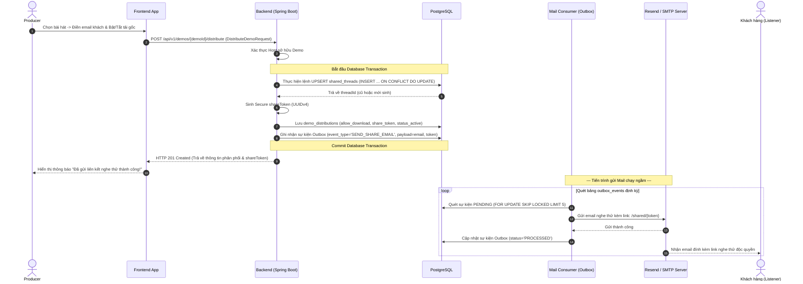
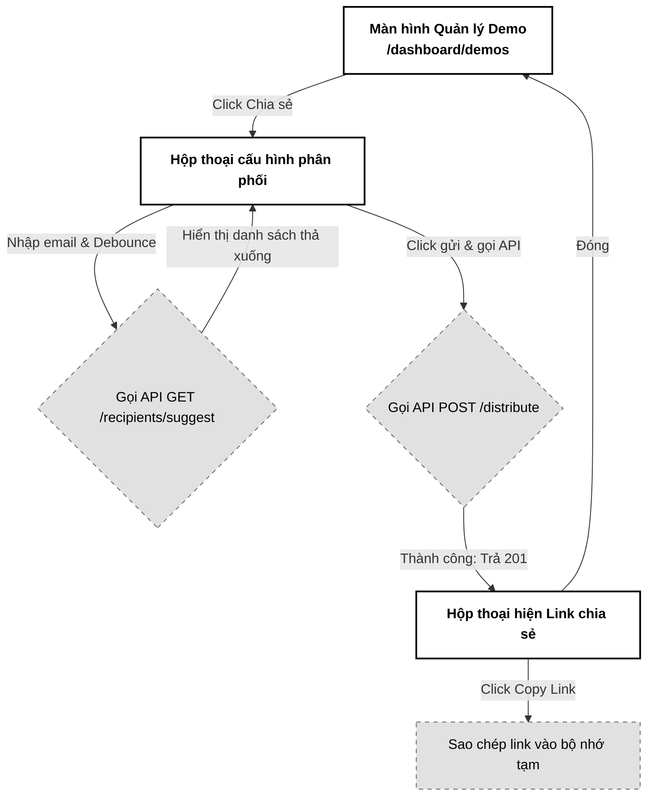

# 03. Cấu hình & Phân phối Demo (Distribute Demo)

Tài liệu đặc tả A-Z tính năng Cấu hình và Phân phối Demo (Distribute Demo), thiết lập quyền tải xuống (Allow Download), thiết lập luồng lịch sử chia sẻ (Shared Demo Thread) độc quyền và sinh email thông báo qua cơ chế Transactional Outbox.

---

## 📋 1. Business & Requirements (Nghiệp vụ & Yêu cầu)

### 1.1. Mô tả Nghiệp vụ (User Story / Use Case)
*   **Đối tượng thực hiện**: Producer (Music Producer - `ROLE_USER_PRO`).
*   **Quy trình tóm tắt**:
    1.  Producer chọn một bản nhạc demo (đã ở trạng thái `ACTIVE`) và click "Chia sẻ".
    2.  Nhập email hoặc tên khách hàng nhận nhạc (hệ thống tự động gợi ý danh sách đối tác cũ đã từng làm việc).
    3.  Cấu hình quyền: Bật/Tắt tùy chọn "Cho phép tải xuống tệp tin gốc".
    4.  Backend kiểm tra tính tồn tại của **Shared Thread (Luồng chia sẻ chung)** giữa cặp (Producer, Email người nhận). Nếu chưa có, tiến hành tạo mới.
    5.  Hệ thống ghi nhận bản phân phối kèm theo Token bảo mật độc quyền (UUID) và ghi nhận sự kiện gửi Email vào bảng Outbox.
    6.  Hệ thống gửi Email đính kèm liên kết nghe thử dạng: `https://pwbmini.com/shared/{shareToken}` tới đối tác. Bản demo xuất hiện trong luồng tin nhắn dòng thời gian (Shared Demo Thread) của hai bên.

### 1.2. Quy tắc Nghiệp vụ (Business Rules)

#### A. Ràng buộc Luồng chia sẻ (Shared Thread Constraint)
*   Để tổ chức dữ liệu khoa học giống như một hội thoại chat, hệ thống lưu trữ các tệp demo gửi đi dưới dạng tin nhắn hội thoại.
*   Mỗi cặp **(Producer_ID, Recipient_Email)** chỉ sở hữu duy nhất **1 thực thể luồng chia sẻ chung (`shared_threads`)**.
*   **Email Normalization (CRITICAL — chống Case Collision)**: Trước khi lưu DB hoặc tính hash, Backend **BẮT BUỘC** chạy `recipientEmail.trim().toLowerCase(Locale.ROOT)` rồi mới:
    1. Tính `recipient_email_hash = SHA-256(normalizedEmail)`.
    2. Dùng làm key cho unique constraint `(producer_id, recipient_email_hash)`.
    3. Gửi qua SMTP (theo RFC 5321, local-part technically case-sensitive nhưng Gmail/Outlook đều treat lowercase).
    
    Nếu thiếu bước `toLowerCase()`: Producer gửi `Customer@Gmail.com` lần đầu tạo thread hash A, lần sau gửi `customer@gmail.com` (chỉ khác chữ hoa) tạo thread hash B → 2 thread riêng biệt cho cùng 1 khách hàng → vi phạm UX và làm rối luồng chia sẻ. Ngoài ra SMTP sẽ bounce email thứ 2 do Gmail normalize trước khi nhận.
*   Mỗi lần Producer gửi bài hát mới cho email đó, hệ thống sẽ chèn thêm bản ghi phân phối mới (`demo_distributions`) trỏ về cùng ID luồng chia sẻ (`thread_id`) này. Điều này giúp khách hàng truy cập có thể xem lại toàn bộ lịch sử các bản demo cũ từng nhận được trên một giao diện thống nhất.
*   **Cơ chế UPSERT nguyên tử tránh Race Condition (Atomic UPSERT)**: Thay vì sử dụng cơ chế kiểm tra sự tồn tại rồi mới chèn (Check-then-Act) ở tầng logic ứng dụng (dễ xảy ra Race Condition khi click đúp chuột gây lỗi UniqueConstraintViolation), hệ thống thực hiện câu lệnh UPSERT nguyên tử dưới DB:
    `INSERT INTO shared_threads (id, producer_id, recipient_email, created_at) VALUES (?, ?, ?, ?) ON CONFLICT (producer_id, recipient_email) DO UPDATE SET created_at = EXCLUDED.created_at RETURNING id;`
    Cách này giúp DB tự động xử lý tương tranh nguyên tử và trả về `thread_id` đúng, loại bỏ hoàn toàn lỗi vỡ API 500 khi trùng lặp khóa.

#### B. Sinh Token chia sẻ bảo mật (Secure Token Generation)
*   Liên kết chia sẻ gửi cho khách hàng dạng: `https://pwbmini.com/shared/{shareToken}`.
*   `shareToken` bắt buộc phải là một chuỗi **UUID v4 ngẫu nhiên, không thể đoán trước** để ngăn chặn tấn công đoán mò link.
*   Mỗi lượt phân phối (dù cùng một bản demo gửi cho nhiều người nhận khác nhau) sẽ có các `shareToken` hoàn toàn khác nhau để dễ dàng kiểm soát lượt nghe và thu hồi độc lập.

#### C. Thông báo Email qua Transactional Outbox Pattern
*   Hệ thống không gọi trực tiếp dịch vụ gửi mail (SMTP) trong transaction tạo phân phối để tránh treo API khi SMTP phản hồi chậm hoặc lỗi kết nối.
*   Thông tin gửi email được đóng gói thành sự kiện và ghi vào bảng `outbox_events` trong cùng một Database Transaction.
*   Tiến trình ngầm (Mail Worker) đọc bảng outbox định kỳ, gửi email qua dịch vụ SMTP (Gmail/Resend) và đánh dấu hoàn thành.
*   **Chống gửi trùng Email trên cụm Multi-instance (Pessimistic Locking & Skip Locked)**: Để ngăn ngừa tình huống nhiều instance Mail Worker cùng kích hoạt chu kỳ quét Outbox cùng một lúc dẫn đến đọc ra cùng các bản ghi `PENDING` và dội bom trùng lặp email cho đối tác, câu lệnh SQL quét Outbox bắt buộc phải áp dụng khóa bi quan bỏ qua hàng bị khóa:
    `SELECT * FROM outbox_events WHERE status = 'PENDING' ORDER BY created_at ASC FOR UPDATE SKIP LOCKED LIMIT 5;`
    Lệnh này đảm bảo mỗi instance sẽ chỉ giành quyền xử lý một tập hợp sự kiện độc lập mà không bị chồng lấn.
*   **Giới hạn retry & DLQ cho Outbox (CRITICAL)**: Mỗi event outbox có giới hạn **tối đa 5 lần retry** (cột `retry_count`). Sau 5 lần fail (vd: SMTP timeout, network), event chuyển sang `status='DEAD_LETTER'` (khác với `SENT`). Worker bỏ qua event DEAD_LETTER. Cần ops dashboard để admin xem và replay thủ công.
    *   Backoff: Exponential 1s → 2s → 4s → 8s → 16s (cap 60s).
    *   Jitter: random ±20% để chống thundering herd nếu SMTP recover cùng lúc nhiều event fail đồng thời.
    *   Log `ERROR OUTBOX_DEAD_LETTER {eventId, retryCount, lastError}` để alerting.
    *   Cấm retry vô hạn (infinite loop chiếm CPU + spam SMTP khi recover, có thể bị Gmail rate-limit toàn service).

#### D. Tự động gợi ý người nhận (Recipient Autocomplete)
*   Để tối ưu hóa trải nghiệm, khi Producer nhập những chữ cái đầu tiên của email người nhận, Frontend gọi API Autocomplete:
    *   Truy vấn danh sách các `recipient_email` độc nhất từ các luồng chia sẻ cũ của chính Producer đó (`GET /api/v1/demos/recipients/suggest?q={keyword}`).
*   **Giới hạn số lượng gợi ý (LIMIT 10)**: Để tránh phình dung lượng JSON phản hồi làm đứng Frontend và tốn băng thông khi Producer có thâm niên chia sẻ cho hàng ngàn email, API gợi ý gợi ý email gợi ý bắt buộc phải áp dụng giới hạn cứng `LIMIT 10` trong câu lệnh SQL. Chỉ hiển thị 10 gợi ý khớp nhất (theo thời gian tương tác gần nhất).
*   **Tối ưu hiệu năng gợi ý Email (Autocomplete Performance)**: API Autocomplete tuyệt đối không thực hiện quét bảng phân phối `demo_distributions` (có thể chứa hàng vạn bản ghi) bằng lệnh `DISTINCT` hoặc `GROUP BY` gây Full Table Scan. Thay vào đó, API bắt buộc phải trỏ thẳng tới bảng `shared_threads`. Nhờ có index của ràng buộc unique `uq_threads_pair (producer_id, recipient_email)`, cơ sở dữ liệu sẽ thực thi Index Scan cực kỳ nhanh gọn ($O(\log N)$) và trả về kết quả gợi ý trong vài mili-giây.

#### E. Ngăn chặn chia sẻ liên kết trái phép (Link Forwarding Prevention - Phase 2)
*   **Vấn đề**: Hiện tại, tính bảo mật của liên kết chia sẻ phụ thuộc hoàn toàn vào độ bảo mật của chuỗi UUID `shareToken`. Nếu đối tác nhận nhạc vô tình hoặc cố tình copy link này gửi vào các nhóm chat công khai, bất kỳ ai cũng có thể truy cập nghe hoặc tải gốc (nếu `allowDownload = true`).
*   **Giải pháp bảo vệ Phase 2**: Đối với các bản demo có giá trị cao, khi người dùng truy cập link `https://pwbmini.com/shared/{shareToken}`, Backend sẽ tự động phát sinh mã OTP 6 số (tăng từ 4 lên 6 — vì 4 số = 10,000 possibilities, script dò dễ trúng quota lock) và gửi về hòm thư `recipient_email` đã được cấu hình trong phân phối đó. Khách hàng bắt buộc phải nhập đúng OTP để mở giao diện phát nhạc.
*   **Cơ chế lưu trữ & Chống dò mã OTP (Redis OTP Storage & Brute-Force Protection)**:
    *   Mã OTP 6 số khi sinh ra được lưu tạm vào Redis String Key dạng: `shared:otp:{shareToken}` với giá trị là mã OTP và TTL giới hạn cứng **5 phút**.
    *   **Single-Active OTP (chống spam OTP request)**: Tại mỗi thời điểm, mỗi `shareToken` chỉ có tối đa **1 OTP còn hiệu lực**. Khi user gọi `POST /shared/{token}/request-otp` và đã có OTP cũ chưa hết hạn:
        - **KHÔNG** sinh OTP mới (tránh user spam để tràn mailbox recipient).
        - Trả `200 OK` với payload `{alreadySent: true, expiresAtSeconds: 240, message: "OTP đã gửi, vui lòng kiểm tra email"}` — không reset TTL.
        - Rate limit strict: max **3 request / 10 phút / shareToken / IP** (chống enumeration).
    *   **Post-Confirm Cooldown (chống harassment sau khi đã confirm thành công)**: Sau khi user nhập OTP đúng và unlock session thành công, **5 phút tiếp theo** user đó không được phép gọi `POST /request-otp` cho cùng `shareToken`. Implement qua Redis key `shared:otp:cooldown:{shareToken}` TTL 300 giây set ngay khi OTP verification thành công. Nếu cooldown còn → trả `200 OK {alreadySent: true, inCooldown: true, cooldownSeconds: 240}`. Tránh script spam ngay sau khi pass auth để flood email.
    *   Để chống brute-force, hệ thống lưu một bộ đếm số lần nhập sai trên Redis. Nếu người dùng nhập sai OTP liên tiếp **3 lần**, hệ thống lập tức xóa mã OTP đó khỏi Redis, đồng thời ghi nhận khóa quyền xác thực của link `shareToken` đó bằng key `shared:lock:{shareToken}` với TTL **15 phút**, chặn đứng mọi kịch bản quét dò mã tự động.
    *   **Tăng entropy cho OTP**: Dùng `SecureRandom` + alphabet `0-9` (10 chars^6 positions = 1,000,000 combinations). Tránh các OTP pattern quá dễ đoán như `000000`, `123456` (lưu denylist nhỏ ở Service).
    *   **Chống Timing Attack (CRITICAL)**: So sánh OTP **BẮT BUỘC** dùng constant-time comparison. Java implementation:
        ```java
        // Khuyến nghị — Apache Commons Codec (đã có trong hầu hết project Spring Boot qua common-codec dependency):
        import org.apache.commons.codec.binary.MessageDigest;
        if (!MessageDigest.isEqual(otpSubmitted.getBytes(StandardCharsets.UTF_8), otpStored.getBytes(StandardCharsets.UTF_8))) {
            throw new BusinessException(ErrorCode.OTP_INVALID);
        }
        ```
        Hoặc tự implement:
        ```java
        public static boolean constantTimeEquals(String a, String b) {
            if (a.length() != b.length()) return false;
            int result = 0;
            for (int i = 0; i < a.length(); i++) {
                result |= a.charAt(i) ^ b.charAt(i);
            }
            return result == 0;
        }
        ```
        **Tuyệt đối KHÔNG** dùng `String.equals()` hoặc `==` để so sánh OTP. Lý do: `String.equals()` short-circuit ký tự đầu tiên khác nhau → phản hồi nhanh hơn cho OTP sai hoàn toàn → attacker đo thời gian (high-resolution timing attack với NTP hoặc side-channel qua network jitter) để deduce từng digit đúng. Sau vài nghìn request có thể recover 1 vị trí digit với độ chính xác >50%. Constant-time fix giữ thời gian phản hồi cố định bất kể input đúng/sai. Cũng có thể cộng thêm constant noise (3-5ms delay randomized) vào response để tăng độ khó cho timing attack.

#### F. Ràng buộc trạng thái Demo gốc (Parental Status Cascade Rule)
*   **Ràng buộc runtime**: Khi khách hàng phân giải link `/shared/{shareToken}`, Backend bắt buộc phải join kiểm tra trạng thái của bản demo gốc tương ứng dưới DB.
*   Nếu trạng thái bản demo không phải là `ACTIVE` (ví dụ: đã bị Producer xóa, đặt ẩn, hoặc tệp nhạc bị lỗi xử lý mang trạng thái `FAILED`), Backend lập tức từ chối quyền truy cập và trả về lỗi `HTTP 403 Forbidden` để vô hiệu hóa liên kết chia sẻ tự động.
*   **Áp dụng ràng buộc ngay tại API `POST /distribute`**: Trước khi insert vào `demo_distributions`, Backend bắt buộc validate `demos.status = 'ACTIVE'` (không phải `PROCESSING` hoặc `FAILED` của docs 01). Nếu không ACTIVE → trả `HTTP 409 Conflict (DEMO_NOT_ACTIVE)`, không tạo distribution mới.

#### G. Giới hạn Chia sẻ theo User (Per-User Share Cap — Anti Spam)
*   Một Producer cố tình gửi demo tới hàng ngàn email có thể gây:
    *   Tốn hạn ngụ SMTP (cost + deliverability hit).
    *   Gây phiền cho người nhận (harassment).
    *   Phình database (`shared_threads` + `demo_distributions`).
*   **Quota áp dụng**:
    *   Tối đa **100 unique email recipients** trong 24 giờ qua cho mỗi Producer.
    *   Tối đa **500 distribution** được tạo mới trong 24 giờ qua cho mỗi Producer.
    *   Vượt quota → trả `429 RATE_LIMIT_EXCEEDED` với message hướng dẫn user thử lại sau.
*   **Tracking**: Redis counters `share:daily_recipients:{producerId}` và `share:daily_count:{producerId}` (TTL 24 giờ rolling), INCR + EXPIRE giống `voice_tag:daily_count`.
*   **Domain whitelist (chống spam đa tên miền rác)**: Reject `recipient_email` thuộc các domain blacklisted (vd: `mailinator.com`, `tempmail.com`, `guerrillamail.com`, `yopmail.com`, `trashmail.com`). Backlog domain blacklist lưu trong bảng `email_blacklisted_domains` (admin có thể cập nhật) + cache Redis `email:domain:blacklist` (TTL 1 giờ). Trả `400 INVALID_RECIPIENT_EMAIL`.

#### H. Mã hóa Payload Outbox (Outbox Payload Encryption)
*   Bảng `outbox_events` lưu trữ payload email (bao gồm `shareToken` chia sẻ bảo mật). Nếu DB bị dump hoặc log slow query rò rỉ, attacker có thể lấy `shareToken` và truy cập demo.
*   **Giải pháp**: Cột `payload` mã hóa đối xứng AES-256-GCM bằng key lưu trong Vault/KMS (`outbox.encryption.key`). Format lưu trữ: `base64(nonce || ciphertext || authTag)`.
*   **Tự động giải mã**: Mail Worker (consumer của `outbox_events`) sử dụng cùng key để giải mã trước khi gửi SMTP. Nếu giải mã thất bại → log `CRITICAL OUTBOX_PAYLOAD_DECRYPT_FAILED` và skip event.
*   **Key rotation**: Key quay vòng mỗi **90 ngày**. Khi rotate, Worker giữ fallback key cũ để đọc lại events cũ; events mới dùng key mới (ghi thêm `payload_key_version` để biết).

#### I. Chống Brute-Force `shareToken` (Token Brute-Force Logging)
*   Mặc dù `shareToken` UUID v4 có 122-bit entropy (gần như không thể brute-force), nhưng docs 04 endpoint `/shared/{token}` `PermitAll` — attacker có thể script enumerate hàng triệu UUID.
*   **Counter brute-force IP-level**: Redis `share_token:fail_count:{ip}` tăng mỗi lần `/shared/{token}` trả `404 LINK_NOT_FOUND`. Nếu vượt **50 lần / 5 phút** → chặn IP đó trong **1 giờ** (key `share_token:ip_blocked:{ip}` TTL 3600).
*   **Logging**:
    *   `WARN INVALID_SHARE_TOKEN_ATTEMPT {ip, attemptedToken}` — log mỗi lần 404.
    *   `WARN SHARE_TOKEN_BRUTE_FORCE_BLOCKED {ip, failCount}` — khi trigger chặn.
*   **Distributed sync**: Block list có thể đồng bộ qua Redis Pub/Sub `security:ip-block` để các Node khác áp dụng ngay.

#### J. Phân trang `GET /distributions` (Pagination Anti-OOM)
*   Endpoint `GET /api/v1/demos/{demoId}/distributions` không giới hạn số lượng bản ghi trả về.
*   Nếu Producer share 5000 lần cho 5000 email → response JSON có thể tới 1 MB+ → OOM Frontend + tốn bandwidth.
*   **Giải pháp**: Bắt buộc phân trang với `page` (mặc định 0) và `size` (mặc định 20, max 100). Trả về metadata `totalElements`, `totalPages`, `hasNext`.

#### K. SQL Injection & LIKE Escape (Safe Autocomplete Query)
*   Endpoint `GET /api/v1/demos/recipients/suggest?q={keyword}` dùng `LIKE ? || '%'`. Nếu không escape `%` và `_`, attacker có thể gửi `q=%` → match tất cả email → brute-force toàn bộ recipient (mặc dù scope giới hạn theo `producer_id` nên rủi ro thấp).
*   **Escape logic trong Backend**:
    ```
    String sanitized = keyword.replace("\\", "\\\\")
                              .replace("%", "\\%")
                              .replace("_", "\\_");
    ```
    Sau đó `escaped LIKE ? || '%' ESCAPE '\'`.
*   **Min/Max length validation**: Ngoài `@Size(min=2)`, giới hạn `max=50` để chống DoS query rất dài.

---

### 1.3. Quy tắc Xác thực Dữ liệu (Validation Rules)

| API Request | Trường dữ liệu | Ràng buộc | Annotation (Backend) | Mô tả |
| :--- | :--- | :--- | :--- | :--- |
| `DistributeDemoRequest` | `recipientEmail` | Bắt buộc, đúng định dạng Email | `@NotBlank`, `@Email` | Địa chỉ email của khách hàng nhận nhạc |
| | `allowDownload` | Bắt buộc | `@NotNull` | Cho phép tải tệp gốc (`true`/`false`) |

---

### 1.4. Giới hạn Tần suất Truy cập API (Rate Limiting)

| API Endpoint | IP Limit | Per-User Limit | Mục đích |
| :--- | :--- | :--- | :--- |
| `POST /api/v1/demos/{id}/distribute` | **10 requests / phút / IP** | **30 requests / phút / user** | Tránh spam gửi email liên tục gây nghẽn hàng đợi Outbox |
| `GET /api/v1/demos/recipients/suggest` | **30 requests / phút / IP** | **60 requests / phút / user** | Chống enumeration email |

Ngoài rate limit IP/user, áp dụng thêm quota tổng (xem mục 1.2.G): tối đa **100 unique email recipients / 24 giờ / user** và **500 distributions / 24 giờ / user**.

---

## 🔄 2. User Flow & Sequence Diagram (Luồng người dùng & Sơ đồ tuần tự)

### 2.1. Luồng Phân phối và Gửi Mail Demo (Distribution & Outbox Email Flow)



##### 📝 Mô tả chi tiết các bước xử lý:
1.  **Gửi yêu cầu chia sẻ**: Producer điền thông tin chia sẻ và nhấn gửi. Frontend gọi API `POST /api/v1/demos/{demoId}/distribute`.
2.  **Khởi tạo hoặc tái sử dụng luồng (Atomic UPSERT)**: Backend thực thi câu lệnh SQL UPSERT nguyên tử đối với bảng `shared_threads`. Cách này giúp tự động tạo mới luồng chia sẻ nếu là khách hàng mới, hoặc tái sử dụng lại `thread_id` cũ nếu đã tồn tại, tránh xung đột tương tranh.
3.  **Lưu phân phối**: Sinh mã Token độc quyền UUID v4, chèn dòng tin nhắn nhạc vào bảng `demo_distributions`.
4.  **Tạo sự kiện Outbox**: Đóng gói thông tin email nhận, nội dung mail và mã Token chia sẻ, ghi vào bảng `outbox_events` trong cùng transaction lưu phân phối. Đảm bảo tính nguyên tử (Atomic): Nếu lưu phân phối thành công thì chắc chắn email sẽ được xếp hàng gửi đi.
5.  **Gửi Mail chạy ngầm (Concurrency Control)**: Mail Worker chạy ngầm quét bảng Outbox định kỳ. Các instance Worker sử dụng cơ chế khóa bi quan bỏ qua hàng đang bị khóa (`FOR UPDATE SKIP LOCKED LIMIT 5`) để nhận về các sự kiện `PENDING` độc lập, tiến hành gửi Email qua SMTP và đánh dấu hoàn thành, đảm bảo không có tình trạng gửi trùng mail cho khách.

#### DDL Outbox Events (tham chiếu schema thực tế)

```sql
CREATE TABLE outbox_events (
    id UUID PRIMARY KEY,
    idempotency_key UUID NOT NULL UNIQUE,      -- UUID v4 sinh bởi Producer tại INSERT — Consumer check trùng trước khi xử lý
    aggregate_type VARCHAR(50) NOT NULL,       -- 'demo_distribution', 'voice_tag_create', ...
    aggregate_id UUID NOT NULL,                -- id của aggregate gốc (distributionId, voiceTagId...)
    event_type VARCHAR(50) NOT NULL,          -- 'SEND_SHARE_EMAIL', 'SEND_REVOKE_NOTICE', ...
    payload BYTEA NOT NULL,                    -- AES-256-GCM encrypted: base64(nonce || ciphertext || authTag) format. Plaintext chứa shareToken, recipientEmail, email body, etc.
    payload_key_version INT NOT NULL,          -- Version của outbox.encryption.key dùng để encrypt payload (chống key rotation ambiguity)
    status VARCHAR(20) NOT NULL DEFAULT 'PENDING',  -- 'PENDING', 'PROCESSED', 'FAILED', 'DEAD_LETTER'
    retry_count INT NOT NULL DEFAULT 0,        -- Tối đa 5 (docs 03 §C)
    last_error TEXT NULL,                      -- Error gần nhất khi SMTP fail
    available_at TIMESTAMP NOT NULL DEFAULT NOW(),  -- Earliest time to process (cho backoff)
    processed_at TIMESTAMP NULL,               -- Set khi status='PROCESSED'
    created_at TIMESTAMP NOT NULL DEFAULT NOW(),
    updated_at TIMESTAMP NOT NULL,
    CONSTRAINT chk_outbox_status CHECK (status IN ('PENDING', 'PROCESSED', 'FAILED', 'DEAD_LETTER')),
    CONSTRAINT chk_outbox_retry CHECK (retry_count >= 0 AND retry_count <= 5)
);

-- Index cho Debezium CDC (WAL scan) + Scheduler fallback (FOR UPDATE SKIP LOCKED)
CREATE INDEX idx_outbox_status_available ON outbox_events(status, available_at) WHERE status IN ('PENDING', 'FAILED');

-- Idempotency lookup cho Consumer
CREATE INDEX idx_outbox_idempotency ON outbox_events(idempotency_key);
```

**Idempotency_key Generation Rule (Producer side)**:
- UUID v4 generated bởi `SecureRandom` tại tầng Service trước khi INSERT.
- Cùng logical event (vd cùng `distributionId`) phải dùng cùng `idempotency_key` để chống duplicate nếu Producer retry giữa lúc commit và Kafka publish.
- Nếu INSERT fail với unique violation trên `idempotency_key`, Producer có thể SELECT existing event và skip insert (idempotent retry).

---

## 💾 3. Database Schema (Thiết kế Cơ sở Dữ liệu)

### 3.1. Thiết kế các bảng PostgreSQL

```sql
-- Bảng quản lý Luồng chia sẻ (Hội thoại dòng thời gian)
CREATE TABLE shared_threads (
    id UUID PRIMARY KEY,
    producer_id UUID NOT NULL,
    recipient_email VARCHAR(100) NOT NULL,
    recipient_email_hash VARCHAR(64) NOT NULL,  -- SHA-256(lowercase(recipient_email)) — PHẢI dùng LOWER() trước khi hash để chống case-collision (HNAM@gmail.com vs hnam@gmail.com phải cùng 1 thread)
    created_at TIMESTAMP NOT NULL,
    updated_at TIMESTAMP NOT NULL,
    last_interacted_at TIMESTAMP NOT NULL,
    CONSTRAINT fk_threads_producer FOREIGN KEY (producer_id) REFERENCES users(id),
    CONSTRAINT uq_threads_pair UNIQUE (producer_id, recipient_email),
    CONSTRAINT uq_threads_pair_hash UNIQUE (producer_id, recipient_email_hash)
);

-- Bảng quản lý các tệp Demo phân phối trong luồng
CREATE TABLE demo_distributions (
    id UUID PRIMARY KEY,
    thread_id UUID NOT NULL,
    demo_id UUID NOT NULL,
    recipient_email VARCHAR(100) NOT NULL,
    share_token UUID UNIQUE NOT NULL,
    allow_download BOOLEAN NOT NULL DEFAULT false,
    is_revoked BOOLEAN NOT NULL DEFAULT false,
    revoked_at TIMESTAMP NULL,
    play_count INT NOT NULL DEFAULT 0,
    last_played_at TIMESTAMP NULL,
    created_at TIMESTAMP NOT NULL,
    updated_at TIMESTAMP NOT NULL,
    CONSTRAINT fk_dist_thread FOREIGN KEY (thread_id) REFERENCES shared_threads(id),
    CONSTRAINT fk_dist_demo FOREIGN KEY (demo_id) REFERENCES demos(id)
);

-- Index phục vụ `GET /api/v1/demos/{demoId}/distributions` (list per demo)
CREATE INDEX idx_distributions_demo_created ON demo_distributions(demo_id, created_at DESC) WHERE is_revoked = false;

-- Index phục vụ Autocomplete theo prefix email (LIKE 'HN%') cho Producer
CREATE INDEX idx_threads_producer_email_prefix ON shared_threads (producer_id, text_pattern_ops, recipient_email);

-- Index phục vụ Autocomplete theo `last_interacted_at DESC` để sắp xếp tươi
CREATE INDEX idx_threads_producer_last_interacted ON shared_threads (producer_id, last_interacted_at DESC);

-- Auto-update last_interacted_at khi tạo distribution mới
CREATE OR REPLACE FUNCTION fn_touch_shared_thread() RETURNS TRIGGER AS $$
BEGIN
    UPDATE shared_threads SET last_interacted_at = NOW() WHERE id = NEW.thread_id;
    RETURN NEW;
END;
$$ LANGUAGE plpgsql;

CREATE TRIGGER trg_distributions_touch_thread
AFTER INSERT ON demo_distributions
FOR EACH ROW
EXECUTE FUNCTION fn_touch_shared_thread();

-- Index cho query `EXISTS demo_distributions (share_token, is_revoked=false)`
-- được đặc tả tại docs 04 và docs 06.
CREATE INDEX idx_distributions_token_active ON demo_distributions(share_token) WHERE is_revoked = false;
```

### 3.2. Redis Key dành riêng cho Distribute Demo

| Định dạng Khóa (Redis Key) | Kiểu dữ liệu | Giá trị (Value) | TTL | Mục đích |
| :--- | :--- | :--- | :--- | :--- |
| `demo:distribution:{shareToken}` | `String` (JSON) | `{distributionId, threadId, demoId, recipientEmail, allowDownload, isRevoked, createdAt}` | **24 giờ** | Cache cấu hình phân phối để route `/api/v1/demos/shared/{token}` (docs 04) truy vấn nhanh không qua DB. |
| `demo:distribution:revoked:{shareToken}` | `String` | `"true"` | **10 phút** | Blacklist ngay khi Producer thu hồi (docs 06). |
| `share:daily_recipients:{producerId}` | `String` | Counter số nguyên (`INCR`) | **24 giờ rolling** | Đếm số unique email đã gửi trong 24 giờ qua. Vượt 100 → `SHARE_QUOTA_EXCEEDED` (xem mục 1.2.G). |
| `share:daily_count:{producerId}` | `String` | Counter số nguyên (`INCR`) | **24 giờ rolling** | Đếm số distribution đã tạo trong 24 giờ. Vượt 500 → `SHARE_QUOTA_EXCEEDED`. |
| `email:domain:blacklist` | `Hash` | `domain → reason` | **1 giờ** | Cache tập domain email bị cấm (mailinator, tempmail,...). Source từ DB `email_blacklisted_domains`. |
| `share_token:fail_count:{ip}` | `String` | Counter số nguyên (`INCR`) | **5 phút** | Đếm số lần `/shared/{token}` trả 404 từ 1 IP. Vượt 50 → block IP trong 1 giờ (xem mục 1.2.I). |
| `share_token:ip_blocked:{ip}` | `String` | `"1"` | **1 giờ** | Blacklist IP đã bị chặn brute-force. Mọi request từ IP này bị reject ngay từ IP rate filter. |

> Tham chiếu đầy đủ tại [`docs/09_infrastructure_config.md`](./../09_infrastructure_config.md) mục **3.5. Redis Key Catalog — Phân hệ Secure Audio Streaming**.

### 3.3. Cập nhật thuật toán Autocomplete

Vì `unique constraint (producer_id, recipient_email)` chỉ hỗ trợ **equality lookup**, hệ thống bổ sung thêm:
- Khi người dùng gõ ≥ 2 ký tự đầu tiên của email (ví dụ: `HN`), Frontend gọi `GET /api/v1/demos/recipients/suggest?q=HN` (chỉ gửi 2-50 ký tự đầu tiên, không gửi ký tự ở giữa).
- Backend thực hiện truy vấn scope chặt: `SELECT DISTINCT recipient_email FROM shared_threads WHERE producer_id = :currentUserId AND recipient_email LIKE ? || '%' ORDER BY last_interacted_at DESC LIMIT 10`.  
  **Scope isolation (CRITICAL)**: Bắt buộc `WHERE producer_id = :currentUserId` lấy từ JWT subject (KHÔNG tin client truyền) để đảm bảo Producer A không thể enumerate email khách hàng của Producer B. Khi enforce scope này, rủi ro autocomplete leak = zero vì producer chỉ thấy email do chính mình từng gửi. Log `WARN AUTOCOMPLETE_SCOPE_VIOLATION` nếu có request nào cố tình truyền `producerId` khác trong header.
- Nhờ có `idx_threads_producer_email_prefix (producer_id, recipient_email text_pattern_ops)` nên DB áp dụng Index Scan đạt `O(log N)`, trả kết quả trong vài mili-giây.

---

## 🔌 4. API Specifications (Đặc tả API)

### 4.0. Cấu hình Chung
*   **Base Path**: `/api/v1`
*   **Headers**: `Authorization: Bearer <accessToken>`

---

### 4.1. API Phân phối & Chia sẻ Demo (Distribute Demo)
*   **Method**: `POST`
*   **Path**: `/api/v1/demos/{demoId}/distribute`
*   **Auth Level**: `Requires ROLE_USER_PRO`

#### Request Body (`DistributeDemoRequest`):
```json
{
  "recipientEmail": "customer_artist@gmail.com",
  "allowDownload": true
}
```

#### Response Thành công (201 Created):
```json
{
  "success": true,
  "message": "Phân phối bản demo thành công",
  "data": {
    "distributionId": "f7b84f32-3a78-43d9-9524-34e803c4f2bb",
    "threadId": "8cf74f51-3a78-43d9-9524-34e803c4f2bb",
    "shareToken": "e5b84f32-3a78-43d9-9524-34e803c4f2aa",
    "recipientEmail": "customer_artist@gmail.com",
    "allowDownload": true,
    "shareLink": "https://pwbmini.com/shared/e5b84f32-3a78-43d9-9524-34e803c4f2aa"
  },
  "errors": null,
  "timestamp": "2026-07-01T16:10:00Z"
}
```

---

### 4.2. API Tự động gợi ý Email người nhận cũ (Autocomplete Suggestion)
*   **Method**: `GET`
*   **Path**: `/api/v1/demos/recipients/suggest`
*   **Query Params**: 
    *   `q` (Chuỗi ký tự nhập vào, tối thiểu 2 ký tự)
    *   `limit` (Số gợi ý tối đa, mặc định và giới hạn cứng là `10`)
*   **Mô tả**: Tìm kiếm tối đa 10 email đối tác cũ khớp với từ khóa tìm kiếm để tránh nghẽn băng thông và treo giao diện.
*   **Auth Level**: `Requires ROLE_USER_PRO`

#### Response Thành công (200 OK):
```json
{
  "success": true,
  "message": "Lấy danh sách gợi ý thành công",
  "data": [
    "customer_artist@gmail.com",
    "custom_musician@hotmail.com"
  ],
  "errors": null,
  "timestamp": "2026-07-01T16:11:00Z"
}
```

---

### 4.4. Phụ lục Mã Lỗi Nghiệp Vụ (Error Codes)

Bộ ErrorCode bổ sung vào enum `ErrorCode.java`:

| Http Status | Error Code (String) | Mô tả | Trường liên quan (`field`) |
| :--- | :--- | :--- | :--- |
| `400 Bad Request` | `VALIDATION_FAILED` | Định dạng email không hợp lệ | `recipientEmail` |
| `400 Bad Request` | `INVALID_RECIPIENT_EMAIL` | Email thuộc domain blacklisted (mailinator, tempmail,...) — xem mục 1.2.G | `recipientEmail` |
| `403 Forbidden` | `FORBIDDEN_ACCESS` | Producer không phải chủ sở hữu demo | `demoId` |
| `404 Not Found` | `DEMO_NOT_FOUND` | Không tìm thấy demo (đã xoá hoặc không tồn tại) | `demoId` |
| `409 Conflict` | `DEMO_NOT_ACTIVE` | Demo ở trạng thái `PROCESSING` hoặc `FAILED`, không thể chia sẻ (xem mục 1.2.F) | `demoId` |
| `429 Too Many Requests` | `RATE_LIMIT_EXCEEDED` | Vượt IP rate hoặc per-user quota (100 recipients/day hoặc 500 distributions/day) | `null` |

### 4.3. API Liệt kê Distributions của Demo (List Distributions for Demo)
*   **Method**: `GET`
*   **Path**: `/api/v1/demos/{demoId}/distributions`
*   **Auth Level**: `Requires ROLE_USER_PRO`
*   **Mô tả**: Trả về danh sách các distribution của một demo mà Producer sở hữu. Mặc định loại trừ distribution đã thu hồi; dùng `?includeRevoked=true` để xem cả.
*   **Sắp xếp**: `created_at DESC`.
*   **Phân trang** (xem mục 1.2.J):
    *   `page` (mặc định 0).
    *   `size` (mặc định 20, tối đa 100 — nếu truyền > 100 sẽ bị clamp).
    *   Response bao gồm metadata: `totalElements`, `totalPages`, `hasNext`.

#### Response Thành công (200 OK):
```json
{
  "success": true,
  "message": "Lấy danh sách phân phối thành công",
  "data": [
    {
      "distributionId": "f7b84f32-3a78-43d9-9524-34e803c4f2bb",
      "threadId": "8cf74f51-3a78-43d9-9524-34e803c4f2bb",
      "shareToken": "e5b84f32-3a78-43d9-9524-34e803c4f2aa",
      "recipientEmail": "customer_artist@gmail.com",
      "allowDownload": true,
      "isRevoked": false,
      "playCount": 12,
      "lastPlayedAt": "2026-07-01T18:30:00Z",
      "createdAt": "2026-07-01T16:10:00Z"
    }
  ],
  "errors": null,
  "timestamp": "2026-07-01T16:12:00Z"
}
```

---

## 🎨 5. UI/UX & Frontend Integration Notes (Giao diện & Tích hợp)

### 5.1. Thiết kế Giao diện Phân phối (Grayscale Theme & A11y)
*   **Hộp thoại Chia sẻ (Share Modal)**:
    *   Thiết kế dạng Dialog đơn sắc tối giản. Ô nhập email có chức năng tự động đổ xuống danh sách Autocomplete Suggestion dạng bảng phẳng xám nhạt khi người dùng nhập dữ liệu (Debounce 300ms trước khi gọi API).
    *   Switch chọn bật/tắt tải file gốc phẳng đơn giản (Chữ `Cho phép tải file gốc` đi kèm Switch).
    *   Nút bấm "Gửi Link Chia Sẻ" đen hoàn toàn, chuyển xám khi hover.
*   **Accessibility (A11y)**:
    *   Ô nhập email có thuộc tính `aria-autocomplete="list"`, `aria-controls="autocomplete-results-list"`. Danh sách gợi ý hiển thị dưới dạng thẻ `ul` với các `li` có `role="option"`.
    *   Có thể dùng phím Arrow Up/Down để di chuyển chọn email gợi ý và bấm `Enter` để chọn.

---

### 5.2. Tối ưu hóa Hiệu năng & Trải nghiệm Lập trình viên (Performance & DevEx)
*   **Debounce Autocomplete**:
    *   Frontend thực hiện debounce 300ms trước khi gọi API `/recipients/suggest` để giảm thiểu lượng request thừa gửi lên server khi người dùng gõ phím nhanh.
*   **Copy Link Nhanh (Clipboard Copy API)**:
    *   Sau khi API phản hồi tạo thành công, giao diện hiển thị mã link nghe thử kèm nút "Copy Link". Sử dụng `navigator.clipboard.writeText` để hỗ trợ sao chép nhanh, hiển thị Toast báo: *"Đã copy liên kết chia sẻ!"* chuyển màu đen trắng tối giản.

---

### 5.3. Sơ đồ Luồng Màn hình (Screen Flow)



---

## 📊 6. Logging & Observability (Ghi nhận Nhật ký & Giám sát)

### 6.1. Log Points (Các điểm ghi log)

| Level | Sự kiện | Payload mẫu |
| :--- | :--- | :--- |
| `INFO` | Share demo request received | `{"event": "SHARE_DEMO_REQUEST", "demoId": "8cf74f51-...", "recipient": "customer_artist@..."}` |
| `INFO` | Shared Thread initialized | `{"event": "SHARED_THREAD_CREATED", "threadId": "8cf74f51-...", "recipient": "customer_artist@..."}` |
| `INFO` | Shared Thread UPSERT (đã có sẵn) | `{"event": "SHARED_THREAD_UPSERTED", "threadId": "...", "producerId": "...", "lastInteractedAt": "2026-07-01T16:10:00Z"}` |
| `INFO` | Distribution token registered | `{"event": "DISTRIBUTION_REGISTERED", "distId": "f7b84f32-...", "token": "e5b84f32-..."}` |
| `INFO` | Outbox email event queued | `{"event": "OUTBOX_EMAIL_QUEUED", "eventId": "a9b74f51-...", "type": "SEND_SHARE_EMAIL"}` |
| `INFO` | Outbox payload encrypted | `{"event": "OUTBOX_PAYLOAD_ENCRYPTED", "eventId": "...", "keyVersion": 2}` |
| `INFO` | Distribution cache refreshed | `{"event": "DISTRIBUTION_CACHE_SET", "shareToken": "e5b84f32-...", "ttlSeconds": 86400}` |
| `INFO` | Distribution list paginated | `{"event": "DISTRIBUTION_LIST_PAGE", "demoId": "...", "page": 0, "size": 20, "totalElements": 47}` |
| `WARN` | Recipient autocomplete rate limited | `{"event": "AUTOCOMPLETE_RATE_LIMITED", "ip": "203.0.113.5"}` |
| `WARN` | Blacklisted domain rejected | `{"event": "BLACKLISTED_DOMAIN_REJECTED", "domain": "mailinator.com", "producerId": "..."}` |
| `WARN` | Daily share quota exceeded | `{"event": "SHARE_QUOTA_EXCEEDED", "producerId": "...", "type": "recipients|count"}` |
| `WARN` | Invalid share token attempt (brute-force suspected) | `{"event": "INVALID_SHARE_TOKEN_ATTEMPT", "ip": "203.0.113.5", "token": "..."}` |
| `WARN` | Share token brute-force IP blocked | `{"event": "SHARE_TOKEN_BRUTE_FORCE_BLOCKED", "ip": "203.0.113.5", "failCount": 50}` |
| `WARN` | SQL LIKE escape performed | `{"event": "SQL_LIKE_ESCAPE", "producerId": "...", "rawInput": "ab%", "sanitized": "ab\\%"}` |

### 6.2. Quy tắc Bảo mật Log
*   Không log địa chỉ token bảo mật đầy đủ hoặc nội dung email trong các log có cấp độ `DEBUG` hoặc log thô không mã hóa. Che giấu một phần email của khách hàng trong log nghiệp vụ nếu cần.
