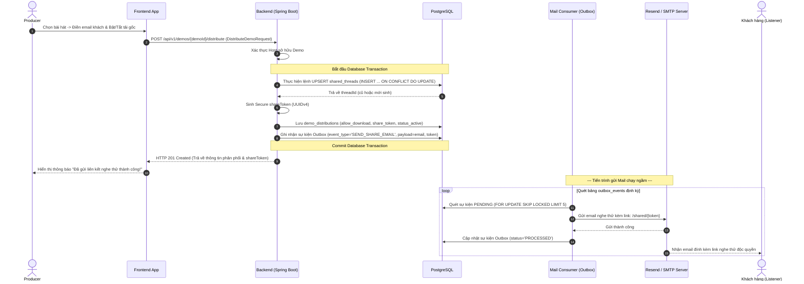
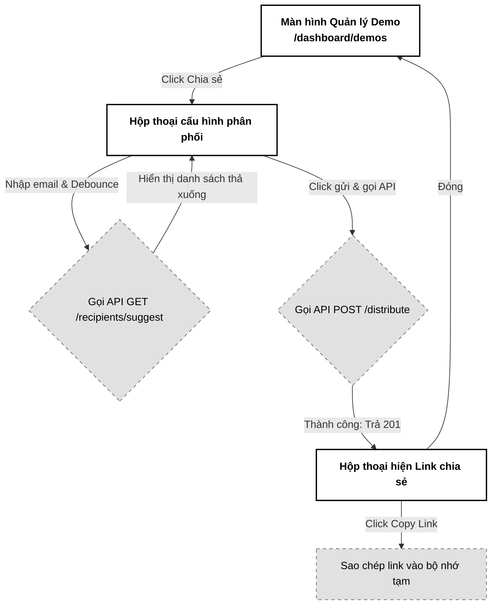

# 03. Cấu hình & Phân phối Demo (Distribute Demo)

Tài liệu đặc tả A-Z tính năng Cấu hình và Phân phối Demo (Distribute Demo), thiết lập quyền tải xuống (Allow Download), thiết lập luồng lịch sử chia sẻ (Shared Demo Thread) độc quyền và sinh email thông báo qua cơ chế Transactional Outbox.

---

## 📋 1. Business & Requirements (Nghiệp vụ & Yêu cầu)

### 1.1. Mô tả Nghiệp vụ (User Story / Use Case)
*   **Đối tượng thực hiện**: Producer (Music Producer - `ROLE_USER_PRO`).
*   **Quy trình tóm tắt**:
    1.  Producer chọn một bản nhạc demo (đã ở trạng thái `ACTIVE`) và click "Chia sẻ".
    2.  Nhập email hoặc tên khách hàng nhận nhạc (hệ thống tự động gợi ý danh sách đối tác cũ đã từng làm việc).
    3.  Cấu hình quyền: Bật/Tắt tùy chọn "Cho phép tải xuống tệp tin gốc".
    4.  Backend kiểm tra tính tồn tại của **Shared Thread (Luồng chia sẻ chung)** giữa cặp (Producer, Email người nhận). Nếu chưa có, tiến hành tạo mới.
    5.  Hệ thống ghi nhận bản phân phối kèm theo Token bảo mật độc quyền (UUID) và ghi nhận sự kiện gửi Email vào bảng Outbox.
    6.  Hệ thống gửi Email đính kèm liên kết nghe thử dạng: `https://pwbmini.com/shared/{shareToken}` tới đối tác. Bản demo xuất hiện trong luồng tin nhắn dòng thời gian (Shared Demo Thread) của hai bên.

### 1.2. Quy tắc Nghiệp vụ (Business Rules)

#### A. Ràng buộc Luồng chia sẻ (Shared Thread Constraint)
*   Để tổ chức dữ liệu khoa học giống như một hội thoại chat, hệ thống lưu trữ các tệp demo gửi đi dưới dạng tin nhắn hội thoại.
*   Mỗi cặp **(Producer_ID, Recipient_Email)** chỉ sở hữu duy nhất **1 thực thể luồng chia sẻ chung (`shared_threads`)**.
*   Mỗi lần Producer gửi bài hát mới cho email đó, hệ thống sẽ chèn thêm bản ghi phân phối mới (`demo_distributions`) trỏ về cùng ID luồng chia sẻ (`thread_id`) này. Điều này giúp khách hàng truy cập có thể xem lại toàn bộ lịch sử các bản demo cũ từng nhận được trên một giao diện thống nhất.
*   **Cơ chế UPSERT nguyên tử tránh Race Condition (Atomic UPSERT)**: Thay vì sử dụng cơ chế kiểm tra sự tồn tại rồi mới chèn (Check-then-Act) ở tầng logic ứng dụng (dễ xảy ra Race Condition khi click đúp chuột gây lỗi UniqueConstraintViolation), hệ thống thực hiện câu lệnh UPSERT nguyên tử dưới DB:
    `INSERT INTO shared_threads (id, producer_id, recipient_email, created_at) VALUES (?, ?, ?, ?) ON CONFLICT (producer_id, recipient_email) DO UPDATE SET created_at = EXCLUDED.created_at RETURNING id;`
    Cách này giúp DB tự động xử lý tương tranh nguyên tử và trả về `thread_id` đúng, loại bỏ hoàn toàn lỗi vỡ API 500 khi trùng lặp khóa.

#### B. Sinh Token chia sẻ bảo mật (Secure Token Generation)
*   Liên kết chia sẻ gửi cho khách hàng dạng: `https://pwbmini.com/shared/{shareToken}`.
*   `shareToken` bắt buộc phải là một chuỗi **UUID v4 ngẫu nhiên, không thể đoán trước** để ngăn chặn tấn công đoán mò link.
*   Mỗi lượt phân phối (dù cùng một bản demo gửi cho nhiều người nhận khác nhau) sẽ có các `shareToken` hoàn toàn khác nhau để dễ dàng kiểm soát lượt nghe và thu hồi độc lập.

#### C. Thông báo Email qua Transactional Outbox Pattern
*   Hệ thống không gọi trực tiếp dịch vụ gửi mail (SMTP) trong transaction tạo phân phối để tránh treo API khi SMTP phản hồi chậm hoặc lỗi kết nối.
*   Thông tin gửi email được đóng gói thành sự kiện và ghi vào bảng `outbox_events` trong cùng một Database Transaction.
*   Tiến trình ngầm (Mail Worker) đọc bảng outbox định kỳ, gửi email qua dịch vụ SMTP (Gmail/Resend) và đánh dấu hoàn thành.
*   **Chống gửi trùng Email trên cụm Multi-instance (Pessimistic Locking & Skip Locked)**: Để ngăn ngừa tình huống nhiều instance Mail Worker cùng kích hoạt chu kỳ quét Outbox cùng một lúc dẫn đến đọc ra cùng các bản ghi `PENDING` và dội bom trùng lặp email cho đối tác, câu lệnh SQL quét Outbox bắt buộc phải áp dụng khóa bi quan bỏ qua hàng bị khóa:
    `SELECT * FROM outbox_events WHERE status = 'PENDING' ORDER BY created_at ASC FOR UPDATE SKIP LOCKED LIMIT 5;`
    Lệnh này đảm bảo mỗi instance sẽ chỉ giành quyền xử lý một tập hợp sự kiện độc lập mà không bị chồng lấn.

#### D. Tự động gợi ý người nhận (Recipient Autocomplete)
*   Để tối ưu hóa trải nghiệm, khi Producer nhập những chữ cái đầu tiên của email người nhận, Frontend gọi API Autocomplete:
    *   Truy vấn danh sách các `recipient_email` độc nhất từ các luồng chia sẻ cũ của chính Producer đó (`GET /api/v1/demos/recipients/suggest?q={keyword}`).
*   **Giới hạn số lượng gợi ý (LIMIT 10)**: Để tránh phình dung lượng JSON phản hồi làm đứng Frontend và tốn băng thông khi Producer có thâm niên chia sẻ cho hàng ngàn email, API gợi ý gợi ý email gợi ý bắt buộc phải áp dụng giới hạn cứng `LIMIT 10` trong câu lệnh SQL. Chỉ hiển thị 10 gợi ý khớp nhất (theo thời gian tương tác gần nhất).
*   **Tối ưu hiệu năng gợi ý Email (Autocomplete Performance)**: API Autocomplete tuyệt đối không thực hiện quét bảng phân phối `demo_distributions` (có thể chứa hàng vạn bản ghi) bằng lệnh `DISTINCT` hoặc `GROUP BY` gây Full Table Scan. Thay vào đó, API bắt buộc phải trỏ thẳng tới bảng `shared_threads`. Nhờ có index của ràng buộc unique `uq_threads_pair (producer_id, recipient_email)`, cơ sở dữ liệu sẽ thực thi Index Scan cực kỳ nhanh gọn ($O(\log N)$) và trả về kết quả gợi ý trong vài mili-giây.

#### E. Ngăn chặn chia sẻ liên kết trái phép (Link Forwarding Prevention - Phase 2)
*   **Vấn đề**: Hiện tại, tính bảo mật của liên kết chia sẻ phụ thuộc hoàn toàn vào độ bảo mật của chuỗi UUID `shareToken`. Nếu đối tác nhận nhạc vô tình hoặc cố tình copy link này gửi vào các nhóm chat công khai, bất kỳ ai cũng có thể truy cập nghe hoặc tải gốc (nếu `allowDownload = true`).
*   **Giải pháp bảo vệ Phase 2**: Đối với các bản demo có giá trị cao, khi người dùng truy cập link `https://pwbmini.com/shared/{shareToken}`, Backend sẽ tự động phát sinh mã OTP 4 số và gửi về hòm thư `recipient_email` đã được cấu hình trong phân phối đó. Khách hàng bắt buộc phải nhập đúng OTP để mở giao diện phát nhạc.
*   **Cơ chế lưu trữ & Chống dò mã OTP (Redis OTP Storage & Brute-Force Protection)**:
    *   Mã OTP 4 số khi sinh ra được lưu tạm vào Redis String Key dạng: `shared:otp:{shareToken}` với giá trị là mã OTP và TTL giới hạn cứng **5 phút**.
    *   Để chống brute-force, hệ thống lưu một bộ đếm số lần nhập sai trên Redis. Nếu người dùng nhập sai OTP liên tiếp **3 lần**, hệ thống lập tức xóa mã OTP đó khỏi Redis, đồng thời ghi nhận khóa quyền xác thực của link `shareToken` đó bằng key `shared:lock:{shareToken}` với TTL **15 phút**, chặn đứng mọi kịch bản quét dò mã tự động.

#### F. Ràng buộc trạng thái Demo gốc (Parental Status Cascade Rule)
*   **Ràng buộc runtime**: Khi khách hàng phân giải link `/shared/{shareToken}`, Backend bắt buộc phải join kiểm tra trạng thái của bản demo gốc tương ứng dưới DB.
*   Nếu trạng thái bản demo không phải là `ACTIVE` (ví dụ: đã bị Producer xóa, đặt ẩn, hoặc tệp nhạc bị lỗi xử lý mang trạng thái `FAILED`), Backend lập tức từ chối quyền truy cập và trả về lỗi `HTTP 403 Forbidden` để vô hiệu hóa liên kết chia sẻ tự động.

---

### 1.3. Quy tắc Xác thực Dữ liệu (Validation Rules)

| API Request | Trường dữ liệu | Ràng buộc | Annotation (Backend) | Mô tả |
| :--- | :--- | :--- | :--- | :--- |
| `DistributeDemoRequest` | `recipientEmail` | Bắt buộc, đúng định dạng Email | `@NotBlank`, `@Email` | Địa chỉ email của khách hàng nhận nhạc |
| | `allowDownload` | Bắt buộc | `@NotNull` | Cho phép tải tệp gốc (`true`/`false`) |

---

### 1.4. Giới hạn Tần suất Truy cập API (IP Rate Limiting)

| API Endpoint | Giới hạn | Mô tả |
| :--- | :--- | :--- |
| `POST /api/v1/demos/{id}/distribute` | **10 requests / phút / IP** | Tránh spam gửi email liên tục gây nghẽn hàng đợi Outbox |

---

## 🔄 2. User Flow & Sequence Diagram (Luồng người dùng & Sơ đồ tuần tự)

### 2.1. Luồng Phân phối và Gửi Mail Demo (Distribution & Outbox Email Flow)



##### 📝 Mô tả chi tiết các bước xử lý:
1.  **Gửi yêu cầu chia sẻ**: Producer điền thông tin chia sẻ và nhấn gửi. Frontend gọi API `POST /api/v1/demos/{demoId}/distribute`.
2.  **Khởi tạo hoặc tái sử dụng luồng (Atomic UPSERT)**: Backend thực thi câu lệnh SQL UPSERT nguyên tử đối với bảng `shared_threads`. Cách này giúp tự động tạo mới luồng chia sẻ nếu là khách hàng mới, hoặc tái sử dụng lại `thread_id` cũ nếu đã tồn tại, tránh xung đột tương tranh.
3.  **Lưu phân phối**: Sinh mã Token độc quyền UUID v4, chèn dòng tin nhắn nhạc vào bảng `demo_distributions`.
4.  **Tạo sự kiện Outbox**: Đóng gói thông tin email nhận, nội dung mail và mã Token chia sẻ, ghi vào bảng `outbox_events` trong cùng transaction lưu phân phối. Đảm bảo tính nguyên tử (Atomic): Nếu lưu phân phối thành công thì chắc chắn email sẽ được xếp hàng gửi đi.
5.  **Gửi Mail chạy ngầm (Concurrency Control)**: Mail Worker chạy ngầm quét bảng Outbox định kỳ. Các instance Worker sử dụng cơ chế khóa bi quan bỏ qua hàng đang bị khóa (`FOR UPDATE SKIP LOCKED LIMIT 5`) để nhận về các sự kiện `PENDING` độc lập, tiến hành gửi Email qua SMTP và đánh dấu hoàn thành, đảm bảo không có tình trạng gửi trùng mail cho khách.

---

## 💾 3. Database Schema (Thiết kế Cơ sở Dữ liệu)

### 3.1. Thiết kế các bảng PostgreSQL

```sql
-- Bảng quản lý Luồng chia sẻ (Hội thoại dòng thời gian)
CREATE TABLE shared_threads (
    id UUID PRIMARY KEY,
    producer_id UUID NOT NULL,
    recipient_email VARCHAR(100) NOT NULL,
    created_at TIMESTAMP NOT NULL,
    CONSTRAINT fk_threads_producer FOREIGN KEY (producer_id) REFERENCES users(id),
    CONSTRAINT uq_threads_pair UNIQUE (producer_id, recipient_email)
);

-- Bảng quản lý các tệp Demo phân phối trong luồng
CREATE TABLE demo_distributions (
    id UUID PRIMARY KEY,
    thread_id UUID NOT NULL,
    demo_id UUID NOT NULL,
    recipient_email VARCHAR(100) NOT NULL,
    share_token UUID UNIQUE NOT NULL,
    allow_download BOOLEAN NOT NULL DEFAULT false,
    is_revoked BOOLEAN NOT NULL DEFAULT false,
    play_count INT NOT NULL DEFAULT 0,
    created_at TIMESTAMP NOT NULL,
    updated_at TIMESTAMP NOT NULL,
    CONSTRAINT fk_dist_thread FOREIGN KEY (thread_id) REFERENCES shared_threads(id),
    CONSTRAINT fk_dist_demo FOREIGN KEY (demo_id) REFERENCES demos(id)
);

```

---

## 🔌 4. API Specifications (Đặc tả API)

### 4.0. Cấu hình Chung
*   **Base Path**: `/api/v1`
*   **Headers**: `Authorization: Bearer <accessToken>`

---

### 4.1. API Phân phối & Chia sẻ Demo (Distribute Demo)
*   **Method**: `POST`
*   **Path**: `/api/v1/demos/{demoId}/distribute`
*   **Auth Level**: `Requires ROLE_USER_PRO`

#### Request Body (`DistributeDemoRequest`):
```json
{
  "recipientEmail": "customer_artist@gmail.com",
  "allowDownload": true
}
```

#### Response Thành công (201 Created):
```json
{
  "success": true,
  "message": "Phân phối bản demo thành công",
  "data": {
    "distributionId": "f7b84f32-3a78-43d9-9524-34e803c4f2bb",
    "threadId": "8cf74f51-3a78-43d9-9524-34e803c4f2bb",
    "shareToken": "e5b84f32-3a78-43d9-9524-34e803c4f2aa",
    "recipientEmail": "customer_artist@gmail.com",
    "allowDownload": true,
    "shareLink": "https://pwbmini.com/shared/e5b84f32-3a78-43d9-9524-34e803c4f2aa"
  },
  "errors": null,
  "timestamp": "2026-07-01T16:10:00Z"
}
```

---

### 4.2. API Tự động gợi ý Email người nhận cũ (Autocomplete Suggestion)
*   **Method**: `GET`
*   **Path**: `/api/v1/demos/recipients/suggest`
*   **Query Params**: 
    *   `q` (Chuỗi ký tự nhập vào, tối thiểu 2 ký tự)
    *   `limit` (Số gợi ý tối đa, mặc định và giới hạn cứng là `10`)
*   **Mô tả**: Tìm kiếm tối đa 10 email đối tác cũ khớp với từ khóa tìm kiếm để tránh nghẽn băng thông và treo giao diện.
*   **Auth Level**: `Requires ROLE_USER_PRO`

#### Response Thành công (200 OK):
```json
{
  "success": true,
  "message": "Lấy danh sách gợi ý thành công",
  "data": [
    "customer_artist@gmail.com",
    "custom_musician@hotmail.com"
  ],
  "errors": null,
  "timestamp": "2026-07-01T16:11:00Z"
}
```

---

### 4.3. Phụ lục Mã Lỗi Nghiệp Vụ (Error Codes)

| Http Status | Error Code (String) | Mô tả | Trường liên quan (`field`) |
| :--- | :--- | :--- | :--- |
| `400 Bad Request` | `VALIDATION_FAILED` | Định dạng email không hợp lệ | `recipientEmail` |
| `404 Not Found` | `DEMO_NOT_FOUND` | Không tìm thấy bản demo tương ứng | `demoId` |

---

## 🎨 5. UI/UX & Frontend Integration Notes (Giao diện & Tích hợp)

### 5.1. Thiết kế Giao diện Phân phối (Grayscale Theme & A11y)
*   **Hộp thoại Chia sẻ (Share Modal)**:
    *   Thiết kế dạng Dialog đơn sắc tối giản. Ô nhập email có chức năng tự động đổ xuống danh sách Autocomplete Suggestion dạng bảng phẳng xám nhạt khi người dùng nhập dữ liệu (Debounce 300ms trước khi gọi API).
    *   Switch chọn bật/tắt tải file gốc phẳng đơn giản (Chữ `Cho phép tải file gốc` đi kèm Switch).
    *   Nút bấm "Gửi Link Chia Sẻ" đen hoàn toàn, chuyển xám khi hover.
*   **Accessibility (A11y)**:
    *   Ô nhập email có thuộc tính `aria-autocomplete="list"`, `aria-controls="autocomplete-results-list"`. Danh sách gợi ý hiển thị dưới dạng thẻ `ul` với các `li` có `role="option"`.
    *   Có thể dùng phím Arrow Up/Down để di chuyển chọn email gợi ý và bấm `Enter` để chọn.

---

### 5.2. Tối ưu hóa Hiệu năng & Trải nghiệm Lập trình viên (Performance & DevEx)
*   **Debounce Autocomplete**:
    *   Frontend thực hiện debounce 300ms trước khi gọi API `/recipients/suggest` để giảm thiểu lượng request thừa gửi lên server khi người dùng gõ phím nhanh.
*   **Copy Link Nhanh (Clipboard Copy API)**:
    *   Sau khi API phản hồi tạo thành công, giao diện hiển thị mã link nghe thử kèm nút "Copy Link". Sử dụng `navigator.clipboard.writeText` để hỗ trợ sao chép nhanh, hiển thị Toast báo: *"Đã copy liên kết chia sẻ!"* chuyển màu đen trắng tối giản.

---

### 5.3. Sơ đồ Luồng Màn hình (Screen Flow)



---

## 📊 6. Logging & Observability (Ghi nhận Nhật ký & Giám sát)

### 6.1. Log Points (Các điểm ghi log)

| Level | Sự kiện | Payload mẫu |
| :--- | :--- | :--- |
| `INFO` | Share demo request received | `{"event": "SHARE_DEMO_REQUEST", "demoId": "8cf74f51-...", "recipient": "customer_artist@..."}` |
| `INFO` | Shared Thread initialized | `{"event": "SHARED_THREAD_CREATED", "threadId": "8cf74f51-...", "recipient": "customer_artist@..."}` |
| `INFO` | Distribution token registered | `{"event": "DISTRIBUTION_REGISTERED", "distId": "f7b84f32-...", "token": "e5b84f32-..."}` |
| `INFO` | Outbox email event queued | `{"event": "OUTBOX_EMAIL_QUEUED", "eventId": "a9b74f51-...", "type": "SEND_SHARE_EMAIL"}` |

### 6.2. Quy tắc Bảo mật Log
*   Không log địa chỉ token bảo mật đầy đủ hoặc nội dung email trong các log có cấp độ `DEBUG` hoặc log thô không mã hóa. Che giấu một phần email của khách hàng trong log nghiệp vụ nếu cần.
