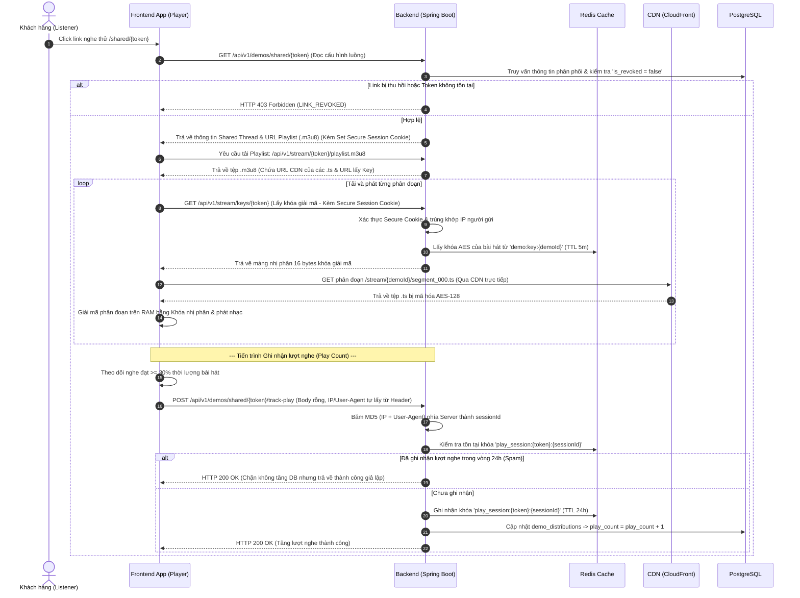
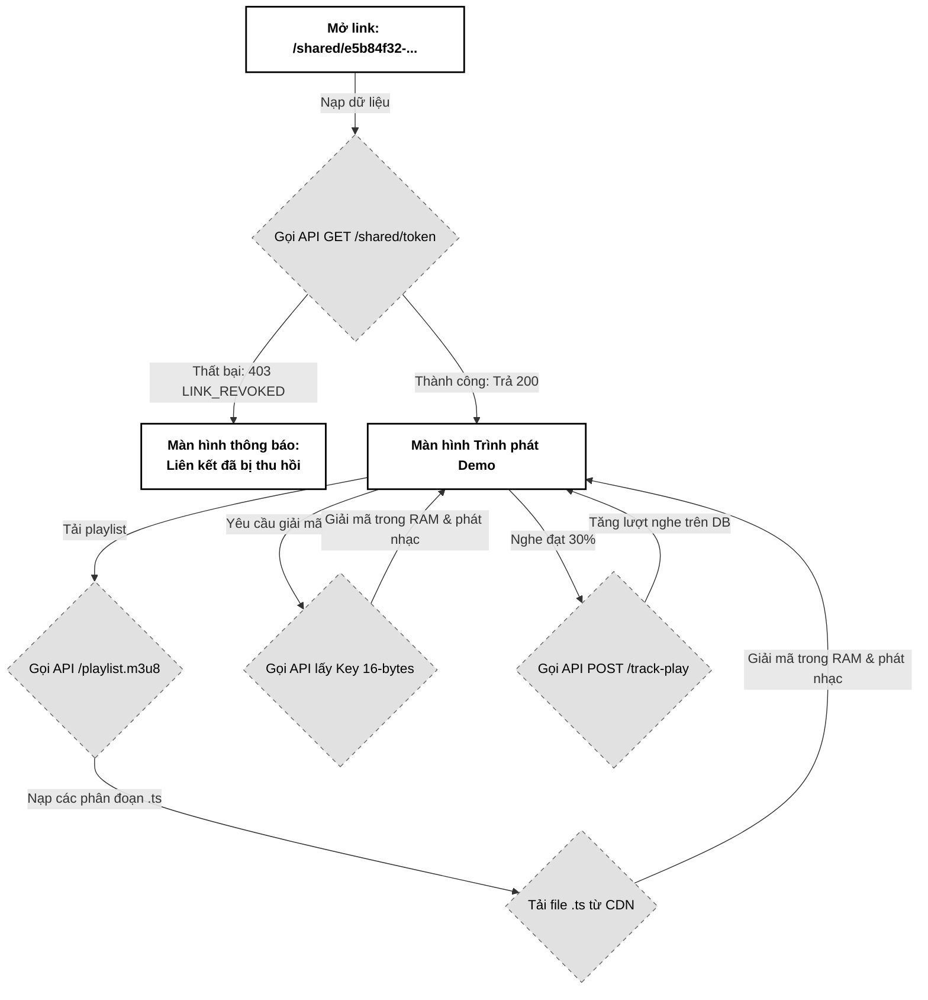

# 04. Truyền phát Nhạc bảo mật HLS CDN (Secure Streaming)

Tài liệu đặc tả A-Z cơ chế Truyền phát nhạc bảo mật (HLS Secure Streaming) mã hóa AES-128, tải trực tiếp các phân đoạn nhạc từ CDN (CloudFront/Cloudflare) giảm tải cho Backend và cơ chế ghi nhận lượt nghe chống spam (Anti-fraud Play Count) bằng Redis Session.

---

## 📋 1. Business & Requirements (Nghiệp vụ & Yêu cầu)

### 1.1. Mô tả Nghiệp vụ (User Story / Use Case)
*   **Đối tượng thực hiện**: Khách hàng (Listener) nhận được liên kết nghe thử độc quyền.
*   **Quy trình tóm tắt**:
    1.  Listener click vào liên kết `/shared/{shareToken}` nhận được từ Email.
    2.  Frontend gửi yêu cầu lấy cấu hình luồng chia sẻ và nạp danh sách phát `.m3u8` từ Backend.
    3.  Trình phát nhạc Frontend (`hls.js`) tải danh sách phát. Danh sách phát cấu hình đường dẫn tải tệp âm thanh `.ts` phân đoạn trực tiếp từ CDN, và đường dẫn lấy khóa giải mã từ Backend.
    4.  Client tải các phân đoạn nhạc `.ts` (đang bị mã hóa AES-128) từ CDN về vùng đệm RAM.
    5.  Client gọi API Backend lấy khóa giải mã nhị phân 16-bytes, tiến hành giải mã cuốn chiếu ngay trên bộ nhớ tạm của trình duyệt và phát âm thanh.
    6.  Khi Client phát nhạc qua mốc **30% thời lượng**, Frontend gọi API ẩn để ghi nhận lượt nghe (`play_count + 1`).

### 1.2. Quy tắc Nghiệp vụ (Business Rules)

#### A. Phân phối luồng HLS bảo mật chống tải lậu
*   **Tuyệt đối không truyền file tĩnh qua Backend**: Backend không đóng vai trò làm proxy trung chuyển tệp nhạc phân đoạn `.ts` để tránh cạn kiệt CPU và băng thông mạng của server.
*   **Đường dẫn CDN công khai đã mã hóa**: Các phân đoạn `.ts` lưu trữ công khai trên CDN (ví dụ: `https://cdn.pwbmini.com/stream/{demoId}/seq_001.ts`) hoàn toàn vô hại vì đã bị mã hóa đối xứng AES-128 cường độ cao.
*   **Giải mã trên bộ nhớ tạm (In-memory buffer)**: Trình phát HLS giải mã dữ liệu âm thanh trực tiếp trên RAM máy khách. Bản nhạc không lưu lại ổ cứng dưới dạng file cache `.mp3` thông thường, làm tăng độ khó cho các công cụ bắt link tự động (như IDM, Video DownloadHelper).

#### B. Cơ chế cấp Khóa giải mã (AES-128 Key Delivery)
*   Đường dẫn lấy Key giải mã khai báo trong file `.m3u8` trỏ về API Backend: `/api/v1/stream/keys/{shareToken}`.
*   **Bảo mật cấp khóa qua Ký duyệt thời gian thực (Signed Token/Cookies)**: Để triệt tiêu nguy cơ kẻ xấu dùng cURL/Postman gọi trực tiếp vào API lấy khóa thô để giải mã vĩnh viễn các phân đoạn `.ts` tải từ CDN:
    *   Khi khách hàng truy cập lấy thông tin luồng tại `/api/v1/demos/shared/{shareToken}`, Backend tiến hành kiểm tra xác thực. Nếu hợp lệ, Backend sinh một **Secure Session Cookie** có thời gian sống ngắn (**1 giờ**), cấu hình `HttpOnly`, `Secure` và `SameSite=Strict`. Cookie này mã hóa và ký số thông tin bao gồm `shareToken` và `clientIp`.
    *   Khi trình phát HLS của Client gửi yêu cầu lấy khóa giải mã tới `/api/v1/stream/keys/{shareToken}`, Backend **bắt buộc** phải xác thực sự tồn tại và tính hợp lệ của Secure Session Cookie này, đồng thời đối khớp địa chỉ IP thực tế gửi request với dải IP lưu trong Cookie. Để tránh làm đứt mạch nhạc khi người dùng di chuyển bằng mạng di động (nhảy trạm phát sóng Mobile IP Roaming, chuyển đổi mạng từ Wifi sang 4G/5G làm thay đổi IP public đột ngột), Backend không so sánh chuỗi IP tuyệt đối mà thực hiện so sánh dải mạng (CIDR Subnet Mask): so sánh dải `/24` đối với IPv4 và dải `/48` hoặc `/64` đối với IPv6. Nếu không có Cookie hoặc dải IP không khớp dải mạng cho phép, Backend mới trả về lỗi `HTTP 403 Forbidden`.
*   **Cấp phát Khóa giải mã từ bộ đệm**:
    *   Sau khi xác thực cookie thành công, Backend truy vấn nhanh khóa AES-128 từ **Redis Cache** `demo:key:{demoId}` (TTL 5 phút) để trả về mảng 16 bytes nhị phân. Nếu cache bị thiếu (miss), Backend đọc từ kho khóa bảo mật của S3/Postgres và nạp lại vào Redis.

#### C. Ghi nhận lượt nghe chống Spam (Anti-fraud Play Count)
*   **Điều kiện ghi nhận**: Lượt nghe chỉ được tăng khi Listener nghe **tối thiểu 30% thời lượng** của bài hát **VÀ duy trì phát liên tục ít nhất 15 giây sau mốc 30%**. Sự kiện này được kích hoạt tự động từ Frontend qua trigger `timeupdate` của Audio HTML5.
*   **Chống skip-then-play bypass**: Nếu Listener tua nhanh (seek) qua 31% trong vòng < 15s, chưa đủ điều kiện. Frontend phải verify `currentTime - last30PercentCrossTime >= 15` trước khi gửi `track-play`. Backend cũng validate lại qua server-side heuristic nếu muốn.
*   **Chống spam đếm ảo bằng Server-Side SessionId Hashing + Device Fingerprint**: Để ngăn khách hàng cố tình sửa mã Javascript ở Frontend để sinh hàng ngàn sessionId giả lập gửi lên:
    *   API ghi nhận lượt nghe `POST /api/v1/demos/shared/{shareToken}/track-play` **không nhận bất kỳ tham số hay body nào** từ phía Client gửi lên.
    *   Backend tự động hash kết hợp các thuộc tính request ở phía Server để tạo `sessionId`:
        ```
        sessionId = SHA-256(IP + "," + User-Agent + "," + Accept-Language + "," + Sec-CH-UA + "," + Sec-CH-UA-Platform)
        ```
        - `IP`: lấy từ `ClientIpResolver` (đã cấu hình X-Forwarded-For + CIDR allowlist).
        - `User-Agent`, `Accept-Language`: HTTP headers.
        - `Sec-CH-UA`, `Sec-CH-UA-Platform`: Client Hints (Chrome ≥ 89). Nếu thiếu → fallback về chuỗi rỗng.
        - **MD5 cũ (chỉ IP+UA) không đủ mạnh** vì attacker chỉ cần xoay IP qua VPN/proxy hoặc đổi UA là bypass được. SHA-256 kết hợp nhiều header giảm đáng kể false-negative.
*   **Chống tương tranh tăng lượt nghe ảo (Atomic SETNX)**: Nhằm triệt tiêu Race Condition xảy ra khi hacker gọi hàng chục request song song tại cùng một phần triệu giây (tất cả các thread kiểm tra đều thấy chưa tồn tại key), hệ thống bãi bỏ logic "Check-then-Act". Backend thực thi ghi nhận lượt nghe bằng câu lệnh Redis `SETNX` (hoặc `setIfAbsent`) nguyên tử:
    *   Chạy lệnh ghi khóa `play_session:{shareToken}:{sessionId}` với giá trị là `"1"` và TTL 24 giờ.
    *   Nếu Redis trả về `true` (ghi nhận thành công lần đầu), Backend mới chạy transaction cập nhật `play_count = play_count + 1` dưới PostgreSQL.
    *   Nếu Redis trả về `false` (đã có key từ trước), Backend lập tức cắt đuôi và trả về `HTTP 200 OK` giả lập để đánh lừa bot phá hoại.
*   **Suy luận Continous Play**: Bên cạnh đếm lượt, Backend tự đánh giá `isContinuousPlay` dựa trên `lastHeartbeatAt` mà Frontend gửi mỗi 5s qua WebSocket `/user/queue/demos/status` (kênh này đã có ở docs 09). Nếu heartbeat bị miss > 30s → giảm 50% weight của lượt nghe khi Producer xem analytics.
*   **Chống WebSocket Heartbeat Spoofing (CRITICAL)**: Nếu Backend chỉ dựa vào WS heartbeat nhận được để đánh giá continuous play, attacker có thể bot chỉ gửi WS heartbeat mà không load thực tế segment nào. Frontend phải kết hợp:
    1. Backend ghi nhận WS heartbeat (server tự tăng counter `ws_heartbeat:{sessionId}` mỗi 5s).
    2. Backend đồng thời đếm `keys_request_count:{sessionId}` ở `/stream/keys/{token}` (mỗi lần load segment phải request 1 key — không có cách play thật mà không request key).
    3. **Rule**: ContinuousPlay = (heartbeat_received_in_30s ≥ 5) **AND** (keys_request_count_in_30s ≥ 10). Nếu chỉ heartbeat mà không kéo key → suspect = fake play, không tính là continuous.
    4. Log `WARN CONTINUOUS_PLAY_SUSPECT_FAKE {sessionId, heartbeatCount, keysCount}` để Producer analytics dashboard highlight.

#### D. Hardening cho Secure Session Cookie (Cookie Hardening)
*   **Tên cookie `__Host-` prefix**: Sử dụng `__Host-pwb_stream_sess` thay vì `pwb_stream_sess`. Prefix `__Host-` ép trình duyệt KHÔNG gửi cookie nếu:
    - Thiếu `Secure` flag.
    - Có `Domain` attribute (cookie phải là host-only).
    - Có `Path` khác `/`.
    ⇒ Ngăn subdomain takeover (vd: `cdn.pwbmini.com` bị XSS) đánh cắp cookie từ root domain.
*   **Tăng cường entropy**: Cookie value không chỉ chứa `shareToken + clientIp`. Mã hóa JWT (HS256) với secret riêng (`audio.stream.cookieSecret`, ≥ 256-bit) và payload:
    ```
    {
      "shareToken": "...",
      "clientIpSubnet": "203.0.113.0/24",      // CIDR, không phải full IP
      "demoId": "...",
      "issuedAt": 1720608000,
      "expiresAt": 1720611600,
      "jti": "<UUIDv4>"                          // unique per session, cho phép blacklist
    }
    ```
*   **Cookie TTL giảm xuống 30 phút** (thay vì 1 giờ) để giảm attack window nếu cookie bị lộ. Frontend phải handle 401 → gọi lại `/shared/{token}` để lấy cookie mới (silent refresh).
*   **jti Blacklist (Cookie Revocation)**: Redis `stream:cookie:revoked:{jti}` (TTL = remaining lifetime). Khi Producer thu hồi share, Backend push jti của mọi cookie đang live vào blacklist (tham chiếu qua shared mapping `demo:distribution:active_sessions:{shareToken}` → Set of jti). Tất cả `/keys` request dùng jti nằm trong blacklist → reject.
*   **Cookie IP matching strict CIDR with /24 default**, override cho từng region qua config (`cookie-cidr-mask-bits: 24|48|64`). Mobile IP roaming vẫn OK nếu cùng subnet (true ở 80% trường hợp VNPT/Viettel).
*   **Cookie Anti-tamper**: Sử dụng JWT HS256 với `SecretKey` rotate mỗi 30 ngày. Cũ + mới đều được chấp nhận trong 7 ngày overlap.

#### E. Quản lý & Rotation khóa AES-128 (AES Key Lifecycle)
*   Hiện tại `key-rotation-enabled: false` (Reserved for future). Phần này nâng cấp thành **bắt buộc**.
*   **Per-Demo Key Unique**: AES-128 key sinh ngẫu nhiên (`SecureRandom`) **mỗi lần audio processing thành công** (xem docs 01 mục C — Worker tạo key mới khi build HLS). Không có key nào được dùng chung giữa các demo.
*   **Rotation On-Demand (Producer-triggered)**: Endpoint `POST /api/v1/demos/{demoId}/rotate-key` (auth Pro) tạo key mới, re-encrypt toàn bộ `.ts` segments với key mới (qua FFmpeg pipeline bất đồng bộ), invalidate toàn bộ AES key cache cũ trên Redis.
*   **Rotation On-Revoke (Tự động khi thu hồi)**: Khi Producer thu hồi distribution (docs 06), nếu AES key đang được share giữa nhiều distribution của cùng demo → xóa cache `demo:key:{demoId}`. Cookie `jti` blacklist (mục D) đảm bảo Listener không lấy lại key cũ.
*   **Storage**:
    - Master key encryption: bảng `demos.aes_key_encrypted BYTEA` chứa AES-128 đã mã hóa bằng KMS/HSM envelope key (`pwb.audio.masterKeyId`).
    - Phiên bản key lưu ở `demos.aes_key_version INT`. Worker khi re-encrypt set version mới + lưu key cũ trong `demos.previous_aes_key_encrypted` (chỉ giữ trong 30 ngày cho mục đích rollback).
*   **Chống key leak via logs**: Redis value cache `demo:key:{demoId}` lưu binary 16 bytes — KHÔNG BAO GIỜ log raw key, chỉ log `keyVersion` + `demoId`. Nếu phát hiện key leak → log `CRITICAL AES_KEY_COMPROMISED` và trigger rotate ngay.

#### F. Rate Limit & IDOR bảo vệ (Per-User & Brute-Force Defense)
*   **Mở rộng rate limit per-user** cho endpoint `GET /shared/{token}` (còn thiếu):
    - `GET /api/v1/demos/shared/{shareToken}`: 60 / phút / IP + **120 / phút / shareToken** (chống brute-force 1 token cụ thể). Vượt 120/5 phút/shareToken → tạm khóa shareToken đó 15 phút (qua Redis `demo:distribution:locked:{shareToken}`).
    - `GET /api/v1/demos/shared/{shareToken}/keys` (giải mã): 60 / phút / IP + 600 / phút / shareToken (key có thể yêu cầu nhiều do mỗi segment load).
    - `POST /api/v1/demos/shared/{shareToken}/track-play`: 5 / phút / IP + 10 / ngày / sessionId (anti-fraud).
*   **IDOR bảo vệ `playlist.m3u8`**: Khi trả về playlist, Backend ký playlist URL bằng **HMAC-SHA256 playlist content** với key riêng (`audio.playlist.signingKey`) và nhúng vào URL dạng:
    ```
    /api/v1/stream/{token}/playlist.m3u8?sig=<HMAC(base64url)>&exp=<unix_epoch>&nonce=<UUID>
    ```
    **Bắt buộc có `exp`** (mặc định 600s, configurable `signature-ttl-seconds`). CDN phải:
    1. Verify `exp > now` trước khi serve (reject nếu hết hạn để chống replay attack sau khi Producer revoke).
    2. Verify `sig = HMAC-SHA256(signingKey, shareToken || demoId || exp || nonce)` (chống sửa query string).
    3. Cache playlist tối đa `min(ttl-remaining, 30s)` để vừa giảm backend hit vừa không serve quá hạn.
    
    **Replay attack scenario**: Nếu không có `exp`, attacker có thể cache playlist URL 1 lần rồi replay sau khi Producer revoke → vẫn nhận được segment URL mới → lộ nhạc. Có `exp` giới hạn attack window = 10 phút.

#### G. Cache Poisoning & CDN Configuration
*   CDN (CloudFront/Cloudflare) **phải cấu hình**:
    - **Không cache playlist.m3u8** (`Cache-Control: no-store`).
    - **Cache .ts segments** với `Cache-Control: private, max-age=3600` (chỉ listener mới có AES key hợp lệ → segments chỉ vô hại khi key chưa leak).
    - **Origin verification**: CDN phải truyền header `X-Origin-Verify` (HMAC) cho mọi request playlist về origin để Backend xác minh request thật từ CDN.
*   **CDN log masking**: CDN log ghi lại IP client. Nếu share logs với 3rd-party (Datadog,...) → chỉ ship hash IP, không ship raw IP.

#### H. Tự động xóa Cache AES khi Demo thuộc trạng thái FAILED/PROCESSING
*   Nếu Demo ở trạng thái `FAILED` hoặc `PROCESSING`, AES key không khả dụng hoặc chưa tồn tại.
*   Trước khi trả playlist/key, Backend kiểm tra `demos.status = 'ACTIVE'`. Nếu không → 403 ngay (kết hợp docs 03 mục F).

---

### 1.3. Quy tắc Xác thực Dữ liệu (Validation Rules)
*   API lấy Playlist và Key giải mã truyền tham số `shareToken` dạng UUID trực tiếp trên URL Path để xác thực quyền truy cập.

---

### 1.4. Giới hạn Tần suất Truy cập API (Rate Limiting)

| API Endpoint | IP Limit | Per-User / Per-Token Limit | Mục đích |
| :--- | :--- | :--- | :--- |
| `GET /api/v1/demos/shared/{shareToken}` | 60 / phút / IP | 120 / phút / shareToken | Chống brute-force enumeration UUID |
| `GET /api/v1/stream/keys/{shareToken}` | 60 / phút / IP | 600 / phút / shareToken | Ngăn càn quét lấy sạch AES key |
| `POST /api/v1/demos/shared/{shareToken}/track-play` | 5 / phút / IP | 10 / ngày / sessionId | Anti-fraud đếm lượt nghe |

---

## 🔄 2. User Flow & Sequence Diagram (Luồng người dùng & Sơ đồ tuần tự)

### 2.1. Luồng Truyền phát HLS bảo mật & Đếm lượt nghe (HLS Stream & Play Count Flow)



##### 📝 Mô tả chi tiết các bước xử lý:
1.  **Nạp cấu hình**: Khách hàng mở link, Frontend gửi yêu cầu lấy cấu hình luồng chia sẻ. Backend xác thực trạng thái thu hồi trong DB. Nếu hợp lệ, Backend sinh và trả về một **Secure Session Cookie** (TTL 1 giờ, cấu hình HttpOnly, Secure) chứa chữ ký IP khách.
2.  **Đọc file Playlist**: Frontend nạp tệp `playlist.m3u8` qua API của Backend. Nội dung file chỉ đường dẫn lấy khóa giải mã về Backend `/stream/keys/{token}` và đường dẫn tải nhạc phân đoạn `.ts` trực tiếp về CDN.
3.  **Tải nhạc & Giải mã**: Trình phát HLS tải song song:
    *   Tải phân đoạn nhạc `.ts` (dung lượng lớn) từ CDN.
    *   Gửi request lấy khóa giải mã 16 bytes từ Backend, trình duyệt tự động đính kèm Secure Session Cookie. Backend xác thực cookie và so sánh IP trùng khớp mới trả về key giải mã.
    *   Thực hiện giải mã cuốn chiếu trong bộ đệm RAM cục bộ và phát ra loa.
4.  **Đếm lượt nghe**: Khi Listener nghe qua 30% bài hát, Frontend tự động gửi request `POST /track-play` với body rỗng. Backend tự động trích xuất IP và User-Agent từ request header để băm MD5 thành `sessionId` ngay tại server. Backend kiểm tra trùng lặp trên Redis trong 24 giờ qua để ngăn chặn các lượt click ảo trước khi cộng 1 vào DB Postgres.

---

## 💾 3. Database & Cache Schema (Thiết kế Cơ sở Dữ liệu & Cache)

### 3.1. Thiết kế Cache Redis thời gian thực

| Định dạng Khóa (Redis Key) | Kiểu dữ liệu | Giá trị (Value) | TTL | Mục đích sử dụng |
| :--- | :--- | :--- | :--- | :--- |
| `demo:key:{demoId}` | `Hash` | `{keyBytes: <base64 16 bytes>, version: <int>, previousKeyBytes?: <base64>}` | **300 giây** (5 phút) | Cache khóa giải mã âm thanh để trả về nhanh. Lưu dạng Hash để chứa cả version + previous key. |
| `play_session:{shareToken}:{sessionId}` | `String` | `"1"` | **86400 giây** (24 giờ) | Chặn spam đếm ảo lượt nghe từ cùng một thiết bị/IP trong ngày. sessionId = SHA-256(IP + UA + Accept-Language + Client-Hints). |
| `demo:distribution:{shareToken}` | `String` (JSON) | `{distributionId, threadId, demoId, recipientEmail, allowDownload, isRevoked, createdAt}` | **86400 giây** (24 giờ) | Cache cấu hình phân phối (do `POST /distribute` ở docs 03 nạp vào) để 4.1 / 4.2 / 4.3 truy vấn nhanh không qua DB. |
| `demo:distribution:revoked:{shareToken}` | `String` | `"true"` | **600 giây** (10 phút) | Blacklist ngay khi Producer thu hồi (docs 06). Trước mỗi request stream, kiểm tra key này để chặn ngay cả khi cache `demo:distribution:` còn hạn. |
| `demo:distribution:active_sessions:{shareToken}` | `Set<UUID>` | Set of `jti` đang live | **1800 giây** (30 phút) | Track tất cả cookie jti issued cho shareToken. Khi revoke, push tất cả jti vào `stream:cookie:revoked:{jti}`. |
| `stream:cookie:revoked:{jti}` | `String` | `"1"` | **1800 giây** (cookie TTL) | Blacklist cookie jti sau khi distribution bị revoke. |
| `demo:distribution:locked:{shareToken}` | `String` | `"1"` | **900 giây** (15 phút) | Khóa tạm thời shareToken khi bị brute-force quá 120 lần/5 phút. |
| `share_token:fail_count:{ip}` | `String` | Counter (INCR) | **300 giây** (5 phút) | Đếm số lần `/shared/{token}` trả 404 (xem docs 03 mục 1.2.I). Khi vượt 50 → IP block. |

---

## 🔌 4. API Specifications (Đặc tả API)

### 4.0. Cấu hình Chung
*   **Base Path**: `/api/v1`

---

### 4.1. API Đọc cấu hình luồng chia sẻ (Get Shared Thread details)
*   **Method**: `GET`
*   **Path**: `/api/v1/demos/shared/{shareToken}`
*   **Auth Level**: `PermitAll` (Dành cho khách hàng có mã token độc quyền truy cập)
*   **Response Headers**: `Set-Cookie: SecureSessionCookie=<token>; Max-Age=3600; HttpOnly; Secure; SameSite=Strict`
*   **Server-Side Validation Pipeline (thứ tự bắt buộc)**:
    1. Lookup `demo:distribution:{shareToken}` Redis cache. Nếu miss → query Postgres.
    2. Check `is_revoked = false` (DB) hoặc absence of `demo:distribution:revoked:{shareToken}` (Redis) → nếu fail → trả `403 LINK_REVOKED`.
    3. **Check `demos.status = 'ACTIVE'` qua join với bảng `demos`** (xem docs 01 §D DDL) — nếu status ∈ {'PROCESSING', 'FAILED', 'DELETED'} → trả `403 DEMO_NOT_ACTIVE`. Tránh UX lỗi khi FE load playlist rồi mới fail ở `/keys`. Cache key `demo:status:{demoId}` TTL 5 phút để tránh query mỗi request.
    4. Check shareToken còn hạn (nếu có `expires_at`) → nếu quá hạn → trả `410 LINK_EXPIRED`.
    5. Mọi bước 2/3/4 fail → trả 403 thay vì 404 để chống enumeration (attacker không phân biệt được "link exists but FAILED" vs "link not exists").
    6. Set Secure Session Cookie (mục D hardening ở docs 04 §1.2.D).
    7. Trả 200 OK với playlist URL.

#### Response Thành công (200 OK):
```json
{
  "success": true,
  "message": "Tải luồng chia sẻ thành công",
  "data": {
    "threadId": "8cf74f51-3a78-43d9-9524-34e803c4f2bb",
    "recipientEmail": "customer_artist@gmail.com",
    "producerDisplayName": "Hoàng Nam Producer",
    "allowDownload": true,
    "demoTitle": "Beat Piano Buồn 2026",
    "duration": 185.50,
    "waveform": [0.12, 0.45, 0.78, 0.90, 0.65],
    "playlistUrl": "/api/v1/stream/e5b84f32-3a78-43d9-9524-34e803c4f2aa/playlist.m3u8"
  },
  "errors": null,
  "timestamp": "2026-07-01T16:20:00Z"
}
```

#### Ghi chú về định dạng `waveform`:
*   `waveform` được trả về **dưới dạng mảng JSON `number[]`** gồm 200 phần tử kiểu `float` (0.0..1.0) biểu diễn biên độ đỉnh.
*   Nguồn gốc lưu trữ: cột `demos.waveform_data` kiểu `JSONB` (xem docs 01). Frontend không cần parse CSV.
*   Kích thước response trung bình: ~3.5 KB. Nếu cần tối ưu băng thông, phiên bản sau có thể thêm cờ `?waveform=compact` trả về 100 phần tử.

---

### 4.2. API Trả khóa giải mã âm thanh HLS (Get Decryption Key)
*   **Method**: `GET`
*   **Path**: `/api/v1/stream/keys/{shareToken}`
*   **Auth Level**: `PermitAll` (Yêu cầu có `SecureSessionCookie` hợp lệ và khớp địa chỉ IP thực tế gửi yêu cầu)
*   **Server-Side Validation Pipeline (thứ tự bắt buộc)**:
    1. Verify cookie signature (JWT) + chưa expired.
    2. Check `jti` không thuộc `stream:cookie:revoked:{jti}` blacklist.
    3. Match `clientIpSubnet` trong cookie với IP request hiện tại qua CIDR mask.
    4. **Check `demos.status = 'ACTIVE'`** qua `demo:distribution:{shareToken}` cache → nếu PROCESSING/FAILED → trả `403 DEMO_NOT_ACTIVE`. **Bắt buộc thực hiện ngay cả khi cache `demo:key:{demoId}` còn hiệu lực** (vì key có thể từ phiên xử lý trước đó đã fail).
    5. Check `demo:distribution:revoked:{shareToken}` — nếu có → trả `403 LINK_REVOKED`.
    6. Lấy key từ cache, nếu miss → query Postgres + nạp cache.
*   **Phản hồi lỗi đặc biệt**: Trả `403` với body JSON ApiResponse chứa `error.code` tương ứng (KHÔNG trả 404 để tránh attacker phân biệt "token exists but demo not active" vs "token not exist" — cả 2 đều 403).

#### Response Body:
*   **Content-Type**: `application/octet-stream`
*   **Body**: Trả về đúng **16 bytes dữ liệu nhị phân thô** của khóa AES (không bọc trong JSON ApiResponse để tương thích chuẩn giải mã của thẻ HLS HTML5).

---

### 4.3. API Ghi nhận lượt nghe nhạc (Track Play Count)
*   **Method**: `POST`
*   **Path**: `/api/v1/demos/shared/{shareToken}/track-play`
*   **Auth Level**: `PermitAll`
*   **Request Body**: *Trống* (Hệ thống tự động trích xuất IP và User-Agent qua header từ `HttpServletRequest` để băm MD5 phía Server).

#### Response Thành công (200 OK):
```json
{
  "success": true,
  "message": "Ghi nhận lượt nghe thành công",
  "data": null,
  "errors": null,
  "timestamp": "2026-07-01T16:25:00Z"
}
```

---

### 4.4. Phụ lục Mã Lỗi Nghiệp Vụ (Error Codes)

| Http Status | Error Code (String) | Mô tả | Trường liên quan (`field`) |
| :--- | :--- | :--- | :--- |
| `403 Forbidden` | `LINK_REVOKED` | Liên kết nghe thử này đã bị thu hồi bởi Producer | `shareToken` |
| `403 Forbidden` | `IP_MISMATCH` | IP của client không khớp với IP lúc cấp Secure Session Cookie (CIDR không match) hoặc jti bị blacklist | `null` |
| `403 Forbidden` | `DEMO_NOT_ACTIVE` | Demo ở trạng thái `PROCESSING`/`FAILED`, không cho stream | `demoId` |
| `404 Not Found` | `LINK_NOT_FOUND` | Không tìm thấy liên kết chia sẻ tương ứng với Token | `shareToken` |
| `410 Gone` | `LINK_EXPIRED` | Liên kết đã hết hạn vĩnh viễn (Producer đặt thời hạn) | `shareToken` |
| `429 Too Many Requests` | `RATE_LIMIT_EXCEEDED` | Vượt IP rate, per-token rate hoặc per-session rate | `null` |

### 4.5. Cấu hình liên quan (tham chiếu)

Cần bổ sung vào `application-audio.yaml`:

```yaml
pwb:
  audio:
    stream:
      secure-cookie:
        ttl-seconds: 1800             # 30 phút (giảm từ 1 giờ — xem mục 1.2.D)
        cookie-name: "__Host-pwb_stream_sess"
        cookie-secure: true
        cookie-same-site: Strict      # Strict (không Lax — bảo vệ tối đa chống CSRF)
        cidr-mask-bits: 24            # So khớp /24 cho IPv4, /48 cho IPv6
        cookie-secret-rotation-days: 30
      hls:
        segment-duration-seconds: 6
        aes-key-bytes: 16
        key-rotation-enabled: true    # BẮT BUỘC — xem mục 1.2.E
        key-rotation-on-revoke: true
        key-envelope:
          kms-key-id: "alias/pwb-audio-master"   # AWS KMS key alias
          previous-key-retention-days: 30
      playlist:
        signing-key: "${PWB_AUDIO_PLAYLIST_SIGNING_KEY}"  # HMAC-SHA256
        signature-ttl-seconds: 600
    play:
      anti-fraud-window-seconds: 30   # Anti-fraud: 1 lượt nghe tối đa mỗi 30s/session
      max-plays-per-session: 50       # Hard cap 50 lượt / phiên / token
      min-play-seconds-after-30pct: 15  # Phải nghe liên tục 15s sau mốc 30% (xem mục 1.2.C)
      fingerprint-algorithm: SHA-256
      fingerprint-headers: [IP, User-Agent, Accept-Language, Sec-CH-UA, Sec-CH-UA-Platform]
```

---

## 🎨 5. UI/UX & Frontend Integration Notes (Giao diện & Tích hợp)

### 5.1. Thiết kế Giao diện Trình phát nhạc bảo mật (Grayscale Theme & A11y)
*   **Trình phát đơn sắc (Grayscale Audio Player)**:
    *   Thiết kế giao diện nghe thử tối giản dạng Dark Mode Monochrome hoặc Light Mode Monochrome phẳng. 
    *   Vẽ lại biểu đồ hình sóng Waveform thô bằng dữ liệu mảng float nhận từ API cấu hình. Thanh tua nhạc trượt theo mốc thời gian, tô đen đậm phần nhạc đã phát qua.
*   **Accessibility (A11y)**:
    *   Nút Play/Pause có thuộc tính `role="button"`, `aria-label="Phát bản demo"`. Khi nhạc đang chạy, cập nhật nhãn thành `aria-label="Tạm dừng bản demo"`.

---

### 5.2. Tối ưu hóa Hiệu năng & Trải nghiệm Lập trình viên (Performance & DevEx)
*   **Tích hợp `hls.js` an toàn**:
    *   Sử dụng thư viện `hls.js` để tự động nạp playlist `.m3u8` và giải mã luồng. 
    *   Cấu hình giảm kích thước buffer tối đa (`maxMaxBufferLength: 12`) để tránh tải trước quá nhiều phân đoạn nhạc HLS khi người dùng chưa nghe đến, giúp tiết kiệm băng thông CDN.
    *   **Cấu hình đính kèm Cookie cho Key Request (`xhr.withCredentials`)**: Mặc định, các media request tải khóa giải mã `#EXT-X-KEY` chạy ngầm trong trình phát HLS (như hls.js hoặc Safari native) sẽ tự động lược bỏ toàn bộ Cookie để tối ưu hiệu năng. Để Secure Session Cookie không bị bỏ rơi dẫn đến lỗi 403 Forbidden, Frontend bắt buộc cấu hình tham số `xhrSetup` của hls.js để ép đính kèm credentials khi tải khóa:
        ```typescript
        const hls = new Hls({
          xhrSetup: function (xhr, url) {
            if (url.includes('/stream/keys/')) {
              xhr.withCredentials = true; // Ép đính kèm SecureSessionCookie xuyên suốt
            }
          }
        });
        ```
*   **Gửi API ghi lượt nghe (Play Count Trigger)**:
    *   Frontend sử dụng một cờ hiệu `let playRecorded = false`. Lắng nghe sự kiện `timeupdate` của thẻ Audio:
        ```typescript
        audio.addEventListener('timeupdate', () => {
          const percent = (audio.currentTime / audio.duration) * 100;
          if (percent >= 30 && !playRecorded) {
            playRecorded = true; // Chỉ gửi duy nhất 1 lần trong phiên nghe
            sendPlayTrackAPI();
          }
        });
        ```

---

### 5.3. Sơ đồ Luồng Màn hình (Screen Flow)



---

## 📊 6. Logging & Observability (Ghi nhận Nhật ký & Giám sát)

### 6.1. Log Points (Các điểm ghi log)

| Level | Sự kiện | Payload mẫu |
| :--- | :--- | :--- |
| `INFO` | Shared demo link accessed | `{"event": "SHARED_LINK_ACCESSED", "token": "e5b84f32-..."}` |
| `INFO` | Secure session cookie issued | `{"event": "SECURE_COOKIE_ISSUED", "token": "...", "jti": "...", "demoId": "...", "ipSubnet": "203.0.113.0/24"}` |
| `INFO` | Decryption key served | `{"event": "KEY_SERVED", "token": "e5b84f32-...", "demoId": "8cf74f51-...", "keyVersion": 2}` |
| `WARN` | Decryption key request — IP mismatch | `{"event": "KEY_IP_MISMATCH", "token": "...", "cookieSubnet": "203.0.113.0/24", "requestIp": "198.51.100.7"}` |
| `WARN` | Decryption key request — jti revoked | `{"event": "KEY_JTI_REVOKED", "token": "...", "jti": "..."}` |
| `INFO` | AES key rotated | `{"event": "AES_KEY_ROTATED", "demoId": "...", "oldVersion": 2, "newVersion": 3, "trigger": "manual|on-revoke|on-leak"}` |
| `INFO` | Playlist signature generated | `{"event": "PLAYLIST_SIGNED", "token": "...", "signature": "...", "expiresIn": 600}` |
| `INFO` | Play count incremented | `{"event": "PLAY_COUNT_INCREMENTED", "token": "e5b84f32-...", "sessionId": "b8cf74f5...", "fingerprintAlgo": "SHA-256"}` |
| `WARN` | Play count spam blocked | `{"event": "PLAY_COUNT_SPAM_BLOCKED", "token": "e5b84f32-...", "sessionId": "b8cf74f5..."}` |
| `WARN` | Brute-force lockout triggered for shareToken | `{"event": "SHARE_TOKEN_BRUTE_FORCE", "shareToken": "e5b84f32-...", "hits": 120}` |
| `WARN` | Attempted access to revoked link | `{"event": "REVOKED_LINK_ACCESS_ATTEMPT", "token": "e5b84f32-..."}` |
| `ERROR` | AES key compromised (leak detected) | `{"event": "AES_KEY_COMPROMISED", "demoId": "...", "keyVersion": 2}` |

> **CDN-side failure logging (CRITICAL)**: CDN (CloudFront/Cloudflare) verify playlist signature trước khi serve (xem docs 04 §1.2.F IDOR bảo vệ playlist). Nếu CDN reject (signature sai hoặc exp hết hạn), Backend không nhận request → không có log tự nhiên. CDN phải ship cache rejection events về Backend qua:
> 1. CDN access log ship tới CloudWatch / Loki (parse `cs-uri-query` để extract `sig`, `exp`, `nonce`).
> 2. CDN gửi Webhook về Backend endpoint `/internal/cdn-events` mỗi 5 phút batch với payload `{"event": "PLAYLIST_SIG_REJECTED", "token": "...", "cdnNodeIp": "...", "rejectionReason": "expired|invalid-sig|missing-sig", "timestamp": "..."}`.
> 3. Backend log `WARN PLAYLIST_SIG_REJECTED {token, reason}` để detect probe attack (attacker cố tình dùng URL cũ để detect Producer revoke thông qua response time).
> 4. Nếu > 10 rejects / 5 phút / IP → trigger `SHARE_TOKEN_BRUTE_FORCE` rule (rate-limit IP đó).

### 6.2. Quy tắc Bảo mật Log
*   **Không log địa chỉ IP thô** của Listener vào log file. Dùng **SHA-256 với secret IP_HASH_SALT** (lưu qua Vault, rotate mỗi 90 ngày). Ví dụ: `ipHash = SHA-256(IP_HASH_SALT + IP)`. Salt chống rainbow table / reverse lookup từ hash.
*   **Lý do KHÔNG dùng MD5**: MD5 bị broken (collision attack thực tế với prefix chosen, FLARE-On 2022) và không có salt property — bất kỳ ai có 1 IP có thể so sánh hash DB. SHA-256 + salt đảm bảo ngay cả khi DB log bị dump, attacker không reverse ra IP gốc.
*   Sample: `{"ipHash": "a4f1c9b8...7e2d", "sessionId": "b8cf74f5..."}` thay vì `{"ip": "203.0.113.5"}`.
*   Đối chiếu GDPR Art. 4(1) — IP là personal data, bắt buộc tối thiểu hóa hoặc mã hóa khi log.
