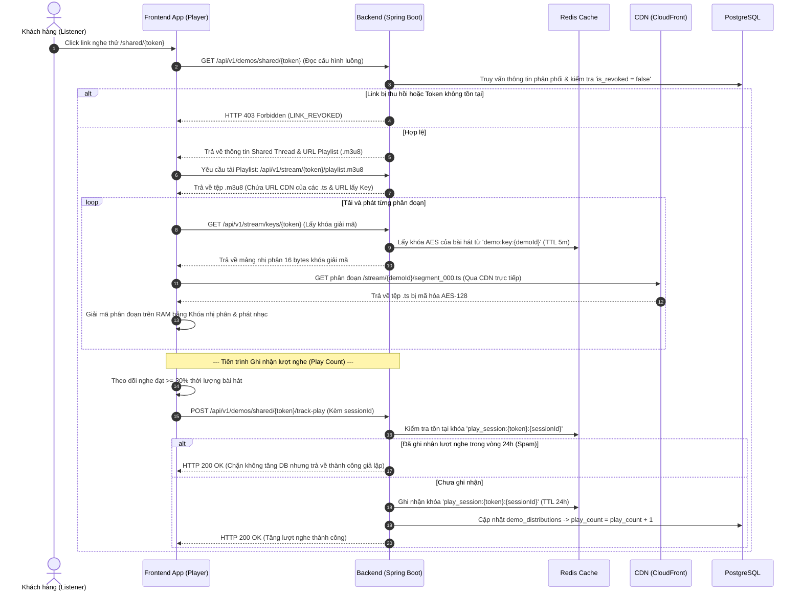
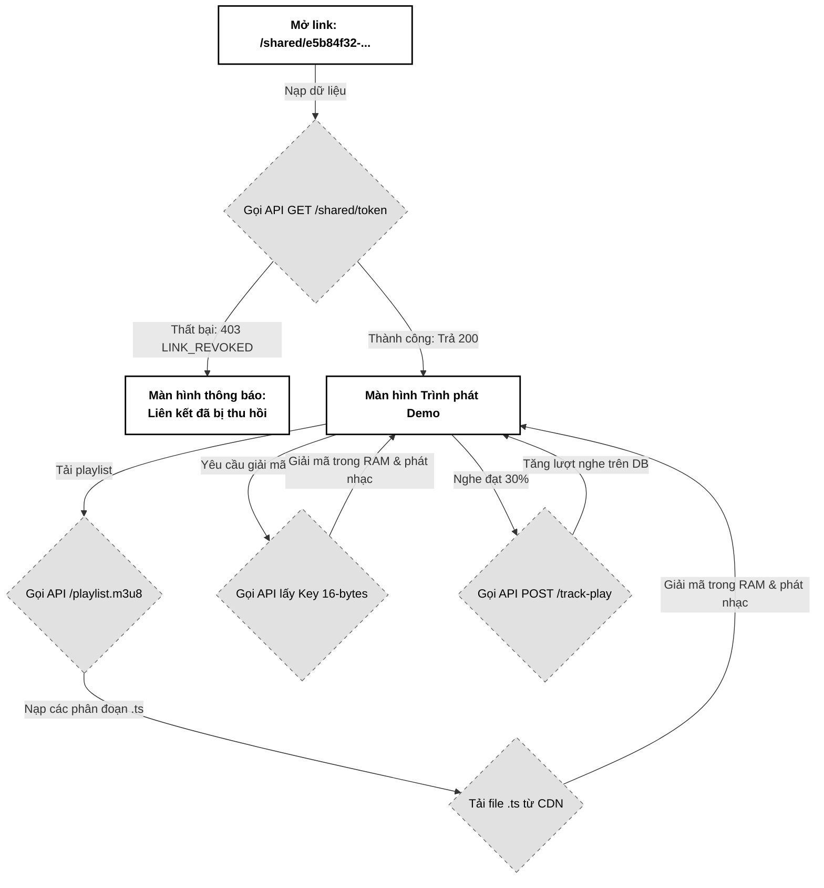

# 04. Truyền phát Nhạc bảo mật HLS CDN (Secure Streaming)

Tài liệu đặc tả A-Z cơ chế Truyền phát nhạc bảo mật (HLS Secure Streaming) mã hóa AES-128, tải trực tiếp các phân đoạn nhạc từ CDN (CloudFront/Cloudflare) giảm tải cho Backend và cơ chế ghi nhận lượt nghe chống spam (Anti-fraud Play Count) bằng Redis Session.

---

## 📋 1. Business & Requirements (Nghiệp vụ & Yêu cầu)

### 1.1. Mô tả Nghiệp vụ (User Story / Use Case)
*   **Đối tượng thực hiện**: Khách hàng (Listener) nhận được liên kết nghe thử độc quyền.
*   **Quy trình tóm tắt**:
    1.  Listener click vào liên kết `/shared/{shareToken}` nhận được từ Email.
    2.  Frontend gửi yêu cầu lấy cấu hình luồng chia sẻ và nạp danh sách phát `.m3u8` từ Backend.
    3.  Trình phát nhạc Frontend (`hls.js`) tải danh sách phát. Danh sách phát cấu hình đường dẫn tải tệp âm thanh `.ts` phân đoạn trực tiếp từ CDN, và đường dẫn lấy khóa giải mã từ Backend.
    4.  Client tải các phân đoạn nhạc `.ts` (đang bị mã hóa AES-128) từ CDN về vùng đệm RAM.
    5.  Client gọi API Backend lấy khóa giải mã nhị phân 16-bytes, tiến hành giải mã cuốn chiếu ngay trên bộ nhớ tạm của trình duyệt và phát âm thanh.
    6.  Khi Client phát nhạc qua mốc **30% thời lượng**, Frontend gọi API ẩn để ghi nhận lượt nghe (`play_count + 1`).

### 1.2. Quy tắc Nghiệp vụ (Business Rules)

#### A. Phân phối luồng HLS bảo mật chống tải lậu
*   **Tuyệt đối không truyền file tĩnh qua Backend**: Backend không đóng vai trò làm proxy trung chuyển tệp nhạc phân đoạn `.ts` để tránh cạn kiệt CPU và băng thông mạng của server.
*   **Đường dẫn CDN công khai đã mã hóa**: Các phân đoạn `.ts` lưu trữ công khai trên CDN (ví dụ: `https://cdn.pwbmini.com/stream/{demoId}/seq_001.ts`) hoàn toàn vô hại vì đã bị mã hóa đối xứng AES-128 cường độ cao.
*   **Giải mã trên bộ nhớ tạm (In-memory buffer)**: Trình phát HLS giải mã dữ liệu âm thanh trực tiếp trên RAM máy khách. Bản nhạc không lưu lại ổ cứng dưới dạng file cache `.mp3` thông thường, làm tăng độ khó cho các công cụ bắt link tự động (như IDM, Video DownloadHelper).

#### B. Cơ chế cấp Khóa giải mã (AES-128 Key Delivery)
*   Đường dẫn lấy Key giải mã khai báo trong file `.m3u8` trỏ về API Backend: `/api/v1/stream/keys/{shareToken}`.
*   Khi có request lấy khóa giải mã:
    *   Backend kiểm tra `shareToken` có tồn tại và `is_revoked = false` hay không. Nếu không hợp lệ -> Từ chối cấp khóa (HTTP 403).
    *   Truy vấn nhanh khóa AES-128 từ **Redis Cache** `demo:key:{demoId}` (TTL 5 phút) để trả về mảng 16 bytes nhị phân. Nếu cache bị thiếu (miss), Backend đọc từ kho khóa bảo mật của S3/Postgres và nạp lại vào Redis.

#### C. Ghi nhận lượt nghe chống Spam (Anti-fraud Play Count)
*   **Điều kiện ghi nhận**: Lượt nghe chỉ được tăng khi Listener nghe **tối thiểu 30% thời lượng** của bài hát. Sự kiện này được kích hoạt tự động từ Frontend qua trigger `timeupdate` của Audio HTML5.
*   **Chống spam đếm ảo (Anti-fraud)**: Để ngăn khách hàng cố tình F5 tải lại trang liên tục hoặc viết script spam gọi API nhằm đẩy ảo lượt nghe:
    *   Khi tăng lượt nghe, Backend sinh một khóa session tạm thời trên Redis: `play_session:{shareToken}:{sessionId}` với **TTL là 24 giờ**, giá trị là `"1"`.
    *   `sessionId` là chuỗi băm Hash MD5 từ (IP người nghe + User Agent thiết bị).
    *   Nếu trong vòng 24 giờ, hệ thống nhận được yêu cầu tăng lượt nghe trùng khớp `sessionId` và `shareToken` cũ -> Hệ thống bỏ qua không tăng lượt nghe nữa (trả về HTTP 200 thành công giả lập để đánh lừa bot spam).

---

### 1.3. Quy tắc Xác thực Dữ liệu (Validation Rules)
*   API lấy Playlist và Key giải mã truyền tham số `shareToken` dạng UUID trực tiếp trên URL Path để xác thực quyền truy cập.

---

### 1.4. Giới hạn Tần suất Truy cập API (IP Rate Limiting)

| API Endpoint | Giới hạn | Mô tả |
| :--- | :--- | :--- |
| `GET /api/v1/stream/keys/{shareToken}` | **60 requests / phút / IP** | Ngăn chặn hành vi dùng tool càn quét lấy sạch các key giải mã của phòng |
| `POST /api/v1/demos/shared/{shareToken}/track-play` | **5 requests / phút / IP** | Ngăn chặn spam tăng lượt nghe ảo |

---

## 🔄 2. User Flow & Sequence Diagram (Luồng người dùng & Sơ đồ tuần tự)

### 2.1. Luồng Truyền phát HLS bảo mật & Đếm lượt nghe (HLS Stream & Play Count Flow)



##### 📝 Mô tả chi tiết các bước xử lý:
1.  **Nạp cấu hình**: Khách hàng mở link, Frontend gửi yêu cầu lấy cấu hình luồng chia sẻ. Backend xác thực trạng thái thu hồi trong DB.
2.  **Đọc file Playlist**: Frontend nạp tệp `playlist.m3u8` qua API của Backend. Nội dung file chỉ đường dẫn lấy khóa giải mã về Backend `/stream/keys/{token}` và đường dẫn tải nhạc phân đoạn `.ts` trực tiếp về CDN.
3.  **Tải nhạc & Giải mã**: Trình phát HLS tải song song:
    *   Tải phân đoạn nhạc `.ts` (dung lượng lớn) từ CDN.
    *   Gửi request lấy khóa giải mã 16 bytes từ Backend.
    *   Thực hiện giải mã cuốn chiếu trong bộ đệm RAM cục bộ và phát ra loa.
4.  **Đếm lượt nghe**: Khi Listener nghe qua 30% bài hát, Frontend tự động gửi request `POST /track-play` đính kèm chuỗi MD5 của IP+UA. Backend kiểm tra trùng lặp trên Redis trong 24 giờ qua để ngăn chặn các lượt click ảo trước khi cộng 1 vào DB Postgres.

---

## 💾 3. Database & Cache Schema (Thiết kế Cơ sở Dữ liệu & Cache)

### 3.1. Thiết kế Cache Redis thời gian thực

| Định dạng Khóa (Redis Key) | Kiểu dữ liệu | Giá trị (Value) | TTL | Mục đích sử dụng |
| :--- | :--- | :--- | :--- | :--- |
| `demo:key:{demoId}` | `String` | Khóa đối xứng 16 bytes nhị phân | **300 giây** (5 phút) | Cache khóa giải mã âm thanh của bài demo để trả về nhanh. |
| `play_session:{shareToken}:{sessionId}` | `String` | `"1"` | **86400 giây** (24 giờ) | Chặn spam đếm ảo lượt nghe từ cùng một thiết bị/IP trong ngày. |

---

## 🔌 4. API Specifications (Đặc tả API)

### 4.0. Cấu hình Chung
*   **Base Path**: `/api/v1`

---

### 4.1. API Đọc cấu hình luồng chia sẻ (Get Shared Thread details)
*   **Method**: `GET`
*   **Path**: `/api/v1/demos/shared/{shareToken}`
*   **Auth Level**: `PermitAll` (Dành cho khách hàng có mã token độc quyền truy cập)

#### Response Thành công (200 OK):
```json
{
  "success": true,
  "message": "Tải luồng chia sẻ thành công",
  "data": {
    "threadId": "8cf74f51-3a78-43d9-9524-34e803c4f2bb",
    "recipientEmail": "customer_artist@gmail.com",
    "producerDisplayName": "Hoàng Nam Producer",
    "allowDownload": true,
    "demoTitle": "Beat Piano Buồn 2026",
    "duration": 185.50,
    "waveform": [0.12, 0.45, 0.78, 0.90, 0.65],
    "playlistUrl": "/api/v1/stream/e5b84f32-3a78-43d9-9524-34e803c4f2aa/playlist.m3u8"
  },
  "errors": null,
  "timestamp": "2026-07-01T16:20:00Z"
}
```

---

### 4.2. API Trả khóa giải mã âm thanh HLS (Get Decryption Key)
*   **Method**: `GET`
*   **Path**: `/api/v1/stream/keys/{shareToken}`
*   **Auth Level**: `PermitAll`

#### Response Body:
*   **Content-Type**: `application/octet-stream`
*   **Body**: Trả về đúng **16 bytes dữ liệu nhị phân thô** của khóa AES (không bọc trong JSON ApiResponse để tương thích chuẩn giải mã của thẻ HLS HTML5).

---

### 4.3. API Ghi nhận lượt nghe nhạc (Track Play Count)
*   **Method**: `POST`
*   **Path**: `/api/v1/demos/shared/{shareToken}/track-play`
*   **Auth Level**: `PermitAll`

#### Request Body (`TrackPlayRequest`):
```json
{
  "sessionId": "b8cf74f513a7843d9952434e803c4f2b"
}
```

#### Response Thành công (200 OK):
```json
{
  "success": true,
  "message": "Ghi nhận lượt nghe thành công",
  "data": null,
  "errors": null,
  "timestamp": "2026-07-01T16:25:00Z"
}
```

---

### 4.4. Phụ lục Mã Lỗi Nghiệp Vụ (Error Codes)

| Http Status | Error Code (String) | Mô tả | Trường liên quan (`field`) |
| :--- | :--- | :--- | :--- |
| `403 Forbidden` | `LINK_REVOKED` | Liên kết nghe thử này đã bị thu hồi bởi Producer | `shareToken` |
| `404 Not Found` | `LINK_NOT_FOUND` | Không tìm thấy liên kết chia sẻ tương ứng với Token | `shareToken` |

---

## 🎨 5. UI/UX & Frontend Integration Notes (Giao diện & Tích hợp)

### 5.1. Thiết kế Giao diện Trình phát nhạc bảo mật (Grayscale Theme & A11y)
*   **Trình phát đơn sắc (Grayscale Audio Player)**:
    *   Thiết kế giao diện nghe thử tối giản dạng Dark Mode Monochrome hoặc Light Mode Monochrome phẳng. 
    *   Vẽ lại biểu đồ hình sóng Waveform thô bằng dữ liệu mảng float nhận từ API cấu hình. Thanh tua nhạc trượt theo mốc thời gian, tô đen đậm phần nhạc đã phát qua.
*   **Accessibility (A11y)**:
    *   Nút Play/Pause có thuộc tính `role="button"`, `aria-label="Phát bản demo"`. Khi nhạc đang chạy, cập nhật nhãn thành `aria-label="Tạm dừng bản demo"`.

---

### 5.2. Tối ưu hóa Hiệu năng & Trải nghiệm Lập trình viên (Performance & DevEx)
*   **Tích hợp `hls.js` an toàn**:
    *   Sử dụng thư viện `hls.js` để tự động nạp playlist `.m3u8` và giải mã luồng. 
    *   Cấu hình giảm kích thước buffer tối đa (`maxMaxBufferLength: 12`) để tránh tải trước quá nhiều phân đoạn nhạc HLS khi người dùng chưa nghe đến, giúp tiết kiệm băng thông CDN.
*   **Gửi API ghi lượt nghe (Play Count Trigger)**:
    *   Frontend sử dụng một cờ hiệu `let playRecorded = false`. Lắng nghe sự kiện `timeupdate` của thẻ Audio:
        ```typescript
        audio.addEventListener('timeupdate', () => {
          const percent = (audio.currentTime / audio.duration) * 100;
          if (percent >= 30 && !playRecorded) {
            playRecorded = true; // Chỉ gửi duy nhất 1 lần trong phiên nghe
            sendPlayTrackAPI();
          }
        });
        ```

---

### 5.3. Sơ đồ Luồng Màn hình (Screen Flow)



---

## 📊 6. Logging & Observability (Ghi nhận Nhật ký & Giám sát)

### 6.1. Log Points (Các điểm ghi log)

| Level | Sự kiện | Payload mẫu |
| :--- | :--- | :--- |
| `INFO` | Shared demo link accessed | `{"event": "SHARED_LINK_ACCESSED", "token": "e5b84f32-..."}` |
| `INFO` | Decryption key served | `{"event": "KEY_SERVED", "token": "e5b84f32-...", "demoId": "8cf74f51-..."}` |
| `INFO` | Play count incremented | `{"event": "PLAY_COUNT_INCREMENTED", "token": "e5b84f32-...", "sessionId": "b8cf74f5..."}` |
| `WARN` | Play count spam blocked | `{"event": "PLAY_COUNT_SPAM_BLOCKED", "token": "e5b84f32-...", "sessionId": "b8cf74f5..."}` |
| `WARN` | Attempted access to revoked link | `{"event": "REVOKED_LINK_ACCESS_ATTEMPT", "token": "e5b84f32-..."}` |

### 6.2. Quy tắc Bảo mật Log
*   Không log địa chỉ IP thô của Listener vào log file, chỉ sử dụng chuỗi hash MD5 của IP để kiểm soát gian lận nhằm bảo vệ quyền riêng tư theo GDPR.
