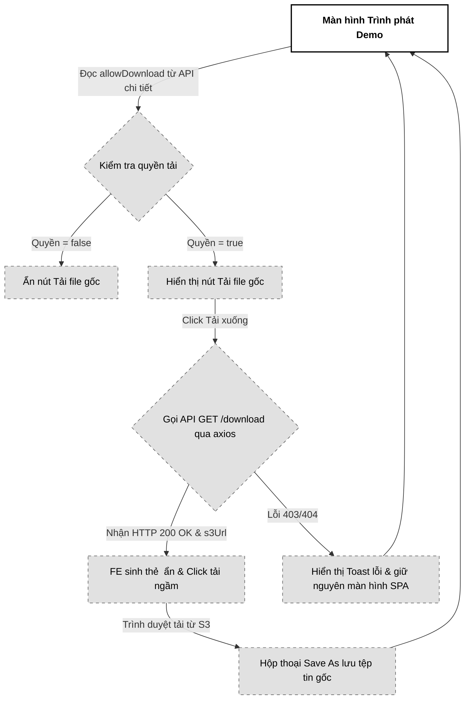

# 05. Tải file gốc chất lượng cao (Download Original Audio)

Tài liệu đặc tả A-Z quy trình Tải xuống tệp tin âm thanh gốc chất lượng cao (.wav, .flac) trực tiếp từ S3 Private Bucket thông qua liên kết Pre-signed URL ngắn hạn và cơ chế chuyển hướng HTTP 302 Redirect an toàn.

---

## 📋 1. Business & Requirements (Nghiệp vụ & Yêu cầu)

### 1.1. Mô tả Nghiệp vụ (User Story / Use Case)
*   **Đối tượng thực hiện**: Khách hàng (Listener) nhận được demo chia sẻ có cấp quyền tải xuống.
*   **Quy trình tóm tắt**:
    1.  Tại giao diện nghe thử, nếu Producer cho phép tải file gốc, nút "Tải xuống file gốc" sẽ hiển thị sáng rõ.
    2.  Khách hàng click chọn "Tải xuống file gốc".
    3.  Frontend gửi yêu cầu tải xuống đính kèm Token chia sẻ độc quyền lên Backend.
    4.  Backend xác thực Token hợp lệ và kiểm tra thuộc tính cho phép tải (`allow_download = true`).
    5.  Backend gọi thư viện S3 SDK để sinh liên kết tải xuống Pre-signed URL có thời hạn hiệu lực siêu ngắn (**60 giây**), cấu hình Header ép trình duyệt mở hộp thoại lưu tệp (`Content-Disposition: attachment`).
    6.  Backend phản hồi mã trạng thái **HTTP 200 OK** kèm theo liên kết tải xuống `downloadUrl` (chính là S3 Pre-signed URL) bên trong JSON payload. Frontend nhận link, tự tạo thẻ <a> ẩn để tự động click kích hoạt tải xuống, tránh hiện tượng lỗi 403 làm sụp đổ trạng thái ứng dụng đơn trang (SPA).

### 1.2. Quy tắc Nghiệp vụ (Business Rules)

#### A. Kiểm soát quyền hạn tải xuống
*   **Ràng buộc cấu hình**: Hệ thống chỉ cấp phép tải tệp tin gốc nếu bản phân phối tương ứng (`demo_distributions`) có giá trị trường `allow_download = true` và `is_revoked = false`.
*   **Chặn truy cập trái phép**: Nếu Producer cấu hình tắt quyền tải gốc (`allow_download = false`):
    *   Nút bấm tải xuống trên giao diện Frontend sẽ bị ẩn đi hoặc chuyển sang trạng thái bị vô hiệu hóa (`disabled`).
    *   Mọi hành vi cố tình gọi trực tiếp API tải xuống bằng công cụ (Postman, curl) sẽ bị Backend từ chối ngay lập tức với mã lỗi HTTP `403 Forbidden` kèm mã lỗi nghiệp vụ `DOWNLOAD_PROHIBITED`.

#### B. Cơ chế sinh S3 Pre-signed URL & Ép tải xuống (Attachment)
*   **Thời hạn ngắn (Short TTL)**: Liên kết tải xuống trực tiếp từ S3 chỉ tồn tại trong **60 giây**. Quá 60 giây link sẽ bị vô hiệu hóa. Ràng buộc này ngăn chặn việc khách hàng copy URL tải xuống gửi cho người thứ ba tải lậu.
*   **Mã hóa tiêu đề tiếng Việt có dấu (RFC 5987 Content-Disposition)**: Khi sinh Pre-signed URL, nếu tiêu đề bản demo chứa ký tự tiếng Việt có dấu và khoảng trắng, việc truyền thô vào header `filename="..."` sẽ làm S3 ném lỗi hoặc trình duyệt hiển thị sai tên. Backend bắt buộc mã hóa mở rộng chuẩn RFC 5987 bằng tham số `filename*=` kết hợp `filename` chuẩn để làm fallback:
    *   Cú pháp thiết lập trong Java:
        ```java
        String fallbackFilename = "demo_track.wav";
        String encodedFilename = StandardCharsets.UTF_8.name() + "''" + 
            URLEncoder.encode(title, StandardCharsets.UTF_8.name()).replace("+", "%20");
        String contentDisposition = "attachment; filename=\"" + fallbackFilename + "\"; filename*=" + encodedFilename;
        ```
    *   Thuộc tính này bắt buộc trình duyệt mở hộp thoại "Save As" hiển thị chính xác 100% tên bài hát có dấu của Producer và lưu tệp về máy, thay vì tự phát trực tuyến.

#### C. Trả về JSON Payload thay vì HTTP 302 để bảo toàn SPA
*   Để bảo vệ trải nghiệm của ứng dụng đơn trang (SPA - React/Next.js), Backend không dùng cơ chế chuyển hướng HTTP 302 trực tiếp nữa.
*   Nếu dùng 302 thông qua thay đổi `window.location.href`, trường hợp link bị thu hồi đột ngột và Backend trả về lỗi 403, trình duyệt sẽ bị chuyển trang sang một trang JSON lỗi trắng tinh làm sập SPA.
*   Do đó, Backend phản hồi **HTTP 200 OK** chứa JSON payload có trường `downloadUrl` (là S3 Pre-signed URL với TTL 60s). Frontend nhận kết quả sẽ tự động tạo một phần tử `<a>` ẩn và click để tải tệp tin ngầm về, giúp bắt các mã lỗi 403, 404 để hiển thị Toast thông báo bình thường mà không làm vỡ giao diện.

---

### 1.3. Quy tắc Xác thực Dữ liệu
*   API tải xuống nhận tham số `shareToken` (UUID) trên URL Path để đối chiếu kiểm tra quyền hạn.

---

### 1.4. Giới hạn Tần suất Truy cập API (IP Rate Limiting)

| API Endpoint | Giới hạn | Mô tả |
| :--- | :--- | :--- |
| `GET /api/v1/demos/shared/{shareToken}/download` | **5 requests / phút / IP** | Ngăn chặn hành vi spam gọi sinh link tải liên tục |

---

## 🔄 2. User Flow & Sequence Diagram (Luồng người dùng & Sơ đồ tuần tự)

### 2.1. Luồng Tải xuống file gốc chất lượng cao (Original Download Flow)

```mermaid
sequenceDiagram
    autonumber
    actor Listener as Khách hàng (Listener)
    participant FE as Frontend App (Player)
    participant BE as Backend (Spring Boot)
    participant DB as PostgreSQL
    participant S3 as S3 Private Bucket

    Listener->>FE: Bấm nút "Tải xuống file gốc chất lượng cao"
    FE->>BE: GET /api/v1/demos/shared/{token}/download
    
    BE->>DB: Truy vấn demo_distributions & demos
    
    alt Link bị thu hồi hoặc allow_download = false
        BE-->>FE: HTTP 403 Forbidden (DOWNLOAD_PROHIBITED)
        FE-->>Listener: Hiển thị Toast cảnh báo: "Bạn không có quyền tải tệp tin này."
    else Hợp lệ
        BE->>BE: Lấy original_s3_key & tiêu đề file
        BE->>BE: Gọi S3 SDK sinh GET Pre-signed URL (TTL 60 giây)
        BE->>BE: Ghi đè Header: Content-Disposition = attachment; filename="Beat.wav"
        
        BE-->>FE: HTTP 200 OK (Trả về JSON chứa downloadUrl)
        
        Note over FE: FE tạo thẻ <a> ẩn, click kích hoạt tải ngầm
        FE->>S3: GET s3PresignedUrl
        S3-->>Listener: Stream file gốc tải về máy (Mở hộp thoại Save As)
    end
```

##### 📝 Mô tả chi tiết các bước xử lý:
1.  **Listener kích hoạt tải**: Listener click nút tải xuống. Frontend sử dụng axios/fetch gửi request `GET /api/v1/demos/shared/{token}/download`.
2.  **Kiểm tra điều kiện & Đồng bộ Trạng thái cha (Parental Status Match)**: Backend truy vấn DB kiểm tra:
    *   Bản phân phối tương ứng Token có bị thu hồi không (`is_revoked = false`).
    *   Quyền tải xuống có được kích hoạt không (`allow_download = true`).
    *   Trạng thái của tệp nhạc gốc trong bảng `demos` bắt buộc phải là `status = 'ACTIVE'`. Nếu bản nhạc gốc đang bị đặt ẩn, đã bị xóa hoặc đang bị khóa do lỗi xử lý (`PROCESSING`/`FAILED`), Backend lập tức từ chối và trả về lỗi `HTTP 403 Forbidden` (`DOWNLOAD_PROHIBITED`) về cho client thông qua JSON error response để FE bắt lỗi hiển thị Toast, không làm sập SPA.
3.  **Sinh URL tải**: Backend gọi Amazon S3 Client sinh Pre-signed URL với TTL 60s, bổ sung cấu hình ghi đè header `Content-Disposition` thành `attachment` kèm theo tên file nhạc gốc thân thiện.
4.  **Trả về JSON Payload**: Backend phản hồi mã HTTP 200 OK kèm theo `downloadUrl` (S3 Pre-signed URL) trong body. Frontend tạo thẻ `<a>` ẩn và click tự động để tải tệp tin từ S3 về máy khách, bảo toàn giao diện SPA.

---

## 💾 3. Database Schema (Thiết kế Cơ sở Dữ liệu)

Nghiệp vụ này truy xuất trực tiếp dữ liệu từ các bảng `demos` và `demo_distributions` đã được thiết kế ở Usecase 1 và Usecase 3:
*   Đọc trường `original_s3_key` từ bảng `demos` để chỉ định tệp tin cần tải trên S3.
*   Đọc trường `allow_download` và `is_revoked` từ bảng `demo_distributions` để kiểm tra phân quyền.

---

## 🔌 4. API Specifications (Đặc tả API)

### 4.0. Cấu hình Chung
*   **Base Path**: `/api/v1`

---

### 4.1. API Tải file nhạc gốc chất lượng cao (Download Original Audio)
*   **Method**: `GET`
*   **Path**: `/api/v1/demos/shared/{shareToken}/download`
*   **Auth Level**: `PermitAll` (Dành cho khách hàng có mã token liên kết độc quyền truy cập)

#### Response khi có quyền (200 OK):
```json
{
  "success": true,
  "message": "Sinh liên kết tải xuống thành công",
  "data": {
    "downloadUrl": "https://pwb-private-bucket.s3.amazonaws.com/original/UUID.wav?AWSAccessKeyId=...&Expires=...&Signature=..."
  },
  "errors": null,
  "timestamp": "2026-07-01T16:30:00Z"
}
```

#### Response khi không có quyền (403 Forbidden):
```json
{
  "success": false,
  "message": "Producer không cho phép tải xuống tệp tin gốc của bản demo này",
  "data": null,
  "errors": [
    {
      "code": "DOWNLOAD_PROHIBITED",
      "field": null,
      "message": "Thuộc tính allowDownload của liên kết này là false"
    }
  ],
  "timestamp": "2026-07-01T16:30:00Z"
}
```

---

### 4.2. Phụ lục Mã Lỗi Nghiệp Vụ (Error Codes)

| Http Status | Error Code (String) | Mô tả | Trường liên quan (`field`) |
| :--- | :--- | :--- | :--- |
| `403 Forbidden` | `DOWNLOAD_PROHIBITED` | Tính năng tải xuống bị tắt bởi Producer hoặc liên kết bị thu hồi | `shareToken` |
| `404 Not Found` | `LINK_NOT_FOUND` | Không tìm thấy liên kết chia sẻ tương ứng với Token | `shareToken` |

---

## 🎨 5. UI/UX & Frontend Integration Notes (Giao diện & Tích hợp)

### 5.1. Thiết kế Giao diện Nút bấm Tải xuống (Grayscale Theme & A11y)
*   **Trạng thái Nút tải xuống (Download Button)**:
    *   *Trường hợp `allowDownload = true`*: Nút "Tải xuống file gốc" hiển thị phẳng màu đen (`bg-black text-white`), bo góc tối giản. Có icon hình mũi tên chỉ xuống tối giản bên cạnh chữ.
    *   *Trường hợp `allowDownload = false`*: Nút bị **khóa ẩn hoàn toàn** khỏi giao diện Player của khách hàng để tránh gây thắc mắc hoặc khó chịu cho trải nghiệm người dùng.
*   **Hiệu ứng đang tải (Loading Downloader)**:
    *   Khi người dùng click nút Tải xuống, đổi nhãn nút thành chữ *"Đang chuẩn bị tệp..."* và hiển thị Spinner xoay. Khôi phục nhãn gốc sau khi trình duyệt trả về file thành công hoặc phát sinh lỗi.
*   **Accessibility (A11y)**:
    *   Nút bấm khai báo đầy đủ nhãn `aria-label="Tải xuống tệp tin âm thanh gốc chất lượng cao .wav"`.

---

### 5.2. Tối ưu hóa Hiệu năng & Trải nghiệm Lập trình viên (Performance & DevEx)
*   **Tránh sập luồng SPA khi gặp lỗi**:
    *   Frontend tuyệt đối không gán `window.location.href` trực tiếp đến API tải của Backend. Thay vào đó, sử dụng `axios` hoặc `fetch` để gửi yêu cầu lấy `downloadUrl`.
    *   **Phòng chống kịch bản Tab ma (Ghost Blank Tab)**: Khi tải file, vì S3 Pre-signed URL đã đính kèm header `Content-Disposition: attachment` để ép mở hộp thoại "Save As", trình duyệt sẽ xử lý tải xuống trực tiếp tại màn hình hiện tại. Frontend **không được** thiết lập thuộc tính `link.setAttribute('target', '_blank')` để tránh ép trình duyệt mở thêm một tab trống lửng lơ gây đứt gãy UX.
    *   Khi nhận được phản hồi thành công (HTTP 200), thực thi hàm kích hoạt tải xuống an toàn thông qua một thẻ `<a>` ẩn:
        ```typescript
        const triggerDownload = (downloadUrl: string, fileName: string) => {
          const link = document.createElement('a');
          link.href = downloadUrl;
          link.setAttribute('download', fileName);
          document.body.appendChild(link);
          link.click();
          document.body.removeChild(link);
        };
        ```
    *   Nếu API trả về lỗi 403 hoặc 404, Frontend bắt ngoại lệ (catch block) và hiển thị Toast thông báo lỗi một cách mượt mà, giữ nguyên giao diện React/Next.js của người dùng.
*   **Chống Double Click**:
    *   Vô hiệu hóa nút bấm tải xuống trong 5 giây ngay sau click đầu tiên để tránh người dùng nhấn liên tục làm sinh hàng loạt URL Pre-signed rác trên S3.

---

### 5.3. Sơ đồ Luồng Màn hình (Screen Flow)



---

## 📊 6. Logging & Observability (Ghi nhận Nhật ký & Giám sát)

### 6.1. Log Points (Các điểm ghi log)

| Level | Sự kiện | Payload mẫu |
| :--- | :--- | :--- |
| `INFO` | Download request received | `{"event": "DOWNLOAD_REQUESTED", "token": "e5b84f32-..."}` |
| `INFO` | S3 Pre-signed download URL generated | `{"event": "S3_DOWNLOAD_URL_GENERATED", "s3Key": "original/UUID.wav", "token": "e5b84f32-..."}` |
| `WARN` | Download blocked (No permission) | `{"event": "DOWNLOAD_BLOCKED_UNAUTHORIZED", "token": "e5b84f32-..."}` |

### 6.2. Quy tắc Bảo mật Log
*   **Tuyệt đối không log tham số Signature hoặc Expires** của URL Pre-signed tải xuống lên nhật ký hệ thống để tránh nguy cơ lộ liên kết tải trực tiếp S3. Chỉ ghi nhận S3 Key.
