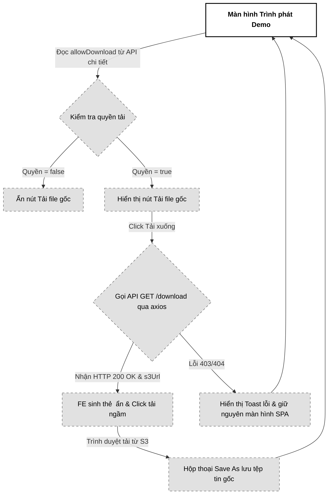

# 05. Tải file gốc chất lượng cao (Download Original Audio)

Tài liệu đặc tả A-Z quy trình Tải xuống tệp tin âm thanh gốc chất lượng cao (.wav, .flac) trực tiếp từ S3 Private Bucket thông qua liên kết Pre-signed URL ngắn hạn và cơ chế chuyển hướng HTTP 302 Redirect an toàn.

---

## 📋 1. Business & Requirements (Nghiệp vụ & Yêu cầu)

### 1.1. Mô tả Nghiệp vụ (User Story / Use Case)
*   **Đối tượng thực hiện**: Khách hàng (Listener) nhận được demo chia sẻ có cấp quyền tải xuống.
*   **Quy trình tóm tắt**:
    1.  Tại giao diện nghe thử, nếu Producer cho phép tải file gốc, nút "Tải xuống file gốc" sẽ hiển thị sáng rõ.
    2.  Khách hàng click chọn "Tải xuống file gốc".
    3.  Frontend gửi yêu cầu tải xuống đính kèm Token chia sẻ độc quyền lên Backend.
    4.  Backend xác thực Token hợp lệ và kiểm tra thuộc tính cho phép tải (`allow_download = true`).
    5.  Backend gọi thư viện S3 SDK để sinh liên kết tải xuống Pre-signed URL có thời hạn hiệu lực siêu ngắn (**60 giây**), cấu hình Header ép trình duyệt mở hộp thoại lưu tệp (`Content-Disposition: attachment`).
    6.  Backend phản hồi mã trạng thái **HTTP 200 OK** kèm theo liên kết tải xuống `downloadUrl` (chính là S3 Pre-signed URL) bên trong JSON payload. Frontend nhận link, tự tạo thẻ <a> ẩn để tự động click kích hoạt tải xuống, tránh hiện tượng lỗi 403 làm sụp đổ trạng thái ứng dụng đơn trang (SPA).

### 1.2. Quy tắc Nghiệp vụ (Business Rules)

#### A. Kiểm soát quyền hạn tải xuống
*   **Ràng buộc cấu hình**: Hệ thống chỉ cấp phép tải tệp tin gốc nếu bản phân phối tương ứng (`demo_distributions`) có giá trị trường `allow_download = true` và `is_revoked = false`.
*   **Chặn truy cập trái phép**: Nếu Producer cấu hình tắt quyền tải gốc (`allow_download = false`):
    *   Nút bấm tải xuống trên giao diện Frontend sẽ bị ẩn đi hoặc chuyển sang trạng thái bị vô hiệu hóa (`disabled`).
    *   Mọi hành vi cố tình gọi trực tiếp API tải xuống bằng công cụ (Postman, curl) sẽ bị Backend từ chối ngay lập tức với mã lỗi HTTP `403 Forbidden` kèm mã lỗi nghiệp vụ `DOWNLOAD_PROHIBITED`.

#### B. Cơ chế sinh S3 Pre-signed URL & Ép tải xuống (Attachment)
*   **Validate extension trước khi pre-sign (CRITICAL — chống Object Exfiltration)**: Trước khi gọi `s3.getObject()`, Backend **BẮT BUỘC** extract extension từ `original_s3_key` rồi validate khớp whitelist `{wav, flac, mp3, m4a, aac}` (case-insensitive). Bước này nhằm:
    1. Ngăn chặn Producer upload file `.pdf` hoặc `.exe` qua preset URL (dù Content-Type signature đã enforce lúc upload, kiểm tra ext lúc download là defense-in-depth).
    2. Ngăn IDOR: nếu `shareToken` được map tới một `original_s3_key` bất thường (vd do Operator mistake insert DB), presigned URL chỉ sinh khi ext hợp lệ.
    
    Thực thi:
    ```java
    String ext = FilenameUtils.getExtension(originalS3Key).toLowerCase(Locale.ROOT);
    if (!Set.of("wav", "flac", "mp3", "m4a", "aac").contains(ext)) {
        throw new BusinessException(ErrorCode.UNSUPPORTED_AUDIO_FORMAT);
    }
    ```
*   **Re-verify Content-Length trước khi phát presigned URL (chống object bị swap/replace)**: Trước khi generate presigned GET URL, Backend gọi `s3.headObject(original_s3_key)` để lấy `ContentLength`. So sánh:
    1. Với `demos.file_size` (lưu lúc confirm-upload). Lệch > 0 → trả `416 FILE_SIZE_MISMATCH` (object có thể bị swap thành file lậu qua IAM write-back bug hoặc accidental overwrite).
    2. Với hard cap 209715200 bytes (200 MB). Vượt → `416`.
    
    **Rationale**: Presigned URL chỉ validate `signed = s3Key` ở request time. Nếu attacker có write access tới S3 bucket (qua lỗi IAM khác), họ có thể swap object sau khi confirm. Re-verify Content-Length là chống race này.
*   **Thời hạn ngắn (Short TTL)**: Liên kết tải xuống trực tiếp từ S3 tồn tại trong **300 giây (5 phút)** — đủ để browser khởi động GET kể cả khi mạng chậm với file lớn (200 MB+). Quá 300 giây link sẽ bị vô hiệu hóa. Ràng buộc này ngăn chặn việc khách hàng copy URL tải xuống gửi cho người thứ ba tải lậu.
*   **Mã hóa tiêu đề tiếng Việt có dấu (RFC 5987 Content-Disposition)**: Khi sinh Pre-signed URL, nếu tiêu đề bản demo chứa ký tự tiếng Việt có dấu và khoảng trắng, việc truyền thô vào header `filename="..."` sẽ làm S3 ném lỗi hoặc trình duyệt hiển thị sai tên. Backend bắt buộc mã hóa mở rộng chuẩn RFC 5987 bằng tham số `filename*=` kết hợp `filename` chuẩn để làm fallback:
    *   Cú pháp thiết lập trong Java:
        ```java
        String fallbackFilename = "demo_track.wav";
        String encodedFilename = StandardCharsets.UTF_8.name() + "''" + 
            URLEncoder.encode(title, StandardCharsets.UTF_8.name()).replace("+", "%20");
        String contentDisposition = "attachment; filename=\"" + fallbackFilename + "\"; filename*=" + encodedFilename;
        ```
    *   Thuộc tính này bắt buộc trình duyệt mở hộp thoại "Save As" hiển thị chính xác 100% tên bài hát có dấu của Producer và lưu tệp về máy, thay vì tự phát trực tuyến.

#### C. Trả về JSON Payload thay vì HTTP 302 để bảo toàn SPA
*   Để bảo vệ trải nghiệm của ứng dụng đơn trang (SPA - React/Next.js), Backend không dùng cơ chế chuyển hướng HTTP 302 trực tiếp nữa.
*   Nếu dùng 302 thông qua thay đổi `window.location.href`, trường hợp link bị thu hồi đột ngột và Backend trả về lỗi 403, trình duyệt sẽ bị chuyển trang sang một trang JSON lỗi trắng tinh làm sập SPA.
*   Do đó, Backend phản hồi **HTTP 200 OK** chứa JSON payload có trường `downloadUrl` (là S3 Pre-signed URL với TTL 60s). Frontend nhận kết quả sẽ tự động tạo một phần tử `<a>` ẩn và click để tải tệp tin ngầm về, giúp bắt các mã lỗi 403, 404 để hiển thị Toast thông báo bình thường mà không làm vỡ giao diện.

#### D. Yêu cầu xác thực Secure Session Cookie (Strict Cookie Enforcement)
*   Hiện tại mục 1.2.A chỉ check `is_revoked + allow_download`. **Thiếu sót nghiêm trọng**: bất kỳ ai biết shareToken (kể cả attacker đánh cắp qua email forwarding hoặc log leak) đều có thể tải file gốc.
*   **Bắt buộc phải kiểm tra Cookie/IP** (giống endpoint `/keys` ở docs 04 mục 1.2.B):
    1. Request `GET /download` **phải đính kèm Secure Session Cookie** (`__Host-pwb_stream_sess`, xem docs 04 mục 1.2.D) đã được cấp khi gọi `/shared/{token}` trước đó.
    2. Backend verify Cookie qua JWT (HS256 + secret rotation 30 ngày) + check IP CIDR match (24 cho v4, 48 cho v6) + check `jti` not in blacklist `stream:cookie:revoked:{jti}`.
    3. Nếu Cookie thiếu/hết hạn/IP mismatch → `403 IP_MISMATCH` + yêu cầu Frontend tự refresh cookie bằng cách gọi lại `/shared/{token}`.
*   **Hash mapping**: Mỗi cookie cấp cho distribution chỉ dùng được đúng distribution đó (không dùng chéo giữa các distribution khác).

#### E. Giới hạn Số lần Tải (Download Quota — Chống Egress Cost DoS)
*   Một Listener có thể download đi download lại 1000 lần → chi phí egress S3/CloudFront tăng vọt (200 MB × 1000 = 200 GB).
*   **Hard cap**:
    - Tối đa **10 lượt download / ngày / sessionId** (đếm qua Redis counter `download:count:{shareToken}:{sessionId}` TTL 24 giờ).
    - Tối đa **100 lượt download / tuần / shareToken** (tổng tất cả sessionId, theo dõi qua `download:weekly_count:{shareToken}` TTL 7 ngày rolling).
*   **Robust sessionId cho download (chống bypass UA)**: Để chống attacker chỉ rotate UA mỗi request để bypass session quota, `sessionId` được sinh từ **multifactor fingerprint** mà attacker khó giả lập cùng lúc:
    ```
    sessionId = SHA-256(IP_HASH_SALT + IP + "|" + Sec-CH-UA + "|" + Sec-CH-UA-Platform + "|" + Accept-Language + "|" + CookieJTI)
    ```
    Trong đó `CookieJTI` lấy từ `__Host-pwb_stream_sess` cookie. Vì mỗi distribution issue cookie mới → attacker phải gọi `/shared/{token}` mỗi lần (mỗi lần lại tạo `jti` mới + bucket IP qua rate limit `/shared` ở docs 04 mục 1.2.F).
*   **Fallback cho browser không gửi Client Hints**: Nếu thiếu `Sec-CH-UA*` (Firefox/Safari), fingerprint chỉ bao gồm IP+UA+Accept-Language+CookieJTI — vẫn pass qua nhưng quota áp dụng chặt hơn (5/ngày) để bù entropy thiếu.
*   Vượt quota → `429 DOWNLOAD_QUOTA_EXCEEDED` với hướng dẫn "thử lại sau".
*   **Reset khi distribution bị thu hồi**: Tất cả counters của shareToken bị DEL (cache invalidation).

#### F. Sanitize Filename chống Header Injection
*   Mục 1.2.B chỉ đề cập RFC 5987 encoding nhưng `filename-sanitize-regex: "[^a-zA-Z0-9._-]"` chỉ áp dụng cho fallback. Phần `filename*=` trong Content-Disposition vẫn có thể chứa CRLF nếu Producer nhập `\r\n` vào `demo.title`.
*   **Sanitize kỹ hơn**: trước khi encode URI:
    1. Trim ký tự whitespace đầu/cuối.
    2. Filter bỏ `\r`, `\n`, `\t`, `;`, `"`, `'` (chống CRLF injection + escape RFC 5987).
    3. Limit length = 100 ký tự (theo `filename-fallback-max-length`).
    4. Reject nếu length về 0 sau sanitize → trả `demo_track.wav` mặc định.
*   **Test cases cần cover**:
    - Title chứa emoji 🎵 → encode UTF-8 hợp lệ.
    - Title chứa `; filename="evil.exe"` → bị filter, fallback dùng tên generic.
    - Title dài 500 ký tự → trim về 100.
*   **Bổ sung header response**: `X-Content-Type-Options: nosniff` (chống MIME sniffing), `Cache-Control: private, no-store, max-age=0` (chống cache trên proxy).

#### G. Audit & Reconciliation
*   Mỗi lượt tải thành công → Backend ghi nhận vào bảng `demo_downloads` (cho analytics + billing reconciliation với S3):
    ```sql
    CREATE TABLE demo_downloads (
        id UUID PRIMARY KEY,
        distribution_id UUID NOT NULL,
        demo_id UUID NOT NULL,
        session_id_hash VARCHAR(64) NOT NULL,    -- SHA-256(IP_HASH_SALT + IP + "|" + Sec-CH-UA + "|" + Accept-Language + "|" + CookieJTI) — GDPR Art. 4 compliant (PII pseudonymized)
        ip_subnet_hash VARCHAR(64) NULL,        -- SHA-256(IP_HASH_SALT + IP/CIDR) — chỉ giữ subnet /24, không lưu raw IP. Cho phép geo-anomaly detection mà không vi phạm GDPR.
        downloaded_at TIMESTAMP NOT NULL,
        s3_key VARCHAR(255) NOT NULL,
        file_size_bytes BIGINT NOT NULL,
        CONSTRAINT fk_dl_dist FOREIGN KEY (distribution_id) REFERENCES demo_distributions(id),
        CONSTRAINT fk_dl_demo FOREIGN KEY (demo_id) REFERENCES demos(id)
    );
    CREATE INDEX idx_dl_dist_time ON demo_downloads(distribution_id, downloaded_at);
    ```
*   **GDPR Compliance Policy cho audit table**:
    *   **KHÔNG BAO GIỜ** lưu raw IPv4/IPv6 trong bất kỳ cột nào. Tất cả IP phải qua hàm `auditHashIp(INET, salt)` để ra `ip_subnet_hash`.
    *   `session_id_hash` bao gồm nhiều thuộc tính (IP, Sec-CH-UA, Accept-Language, JTI) — không thể reverse về 1 device cụ thể nếu salt bảo mật, compliant với GDPR Art. 4(5) (pseudonymization).
    *   Salt `IP_HASH_SALT` lưu AWS Secrets Manager / Vault, rotate mỗi 90 ngày. Re-rotation KHÔNG re-hash data cũ (giữ nguyên hash hiện tại để forensic linkage giữa các event).
    *   Data Subject Access Request (DSAR): User yêu cầu xóa data → không có cách reverse hash về IP cụ thể → có thể xóa row where `session_id_hash = ?` mà không cần tracker ngược.
    *   Auto-purge: Sau 90 ngày (line 112), xóa row hoàn toàn. Reduction về retention tối thiểu.
*   **Reconciliation job** (chạy hằng ngày 03:00 UTC): So sánh `COUNT(*)` từ `demo_downloads` với CloudFront logs hoặc S3 access logs. Lệch > 5% → alert DevOps.
*   **Tự động xóa bản ghi cũ**: Sau 90 ngày → DELETE rows (saving DB space).

---

### 1.3. Quy tắc Xác thực Dữ liệu
*   API tải xuống nhận tham số `shareToken` (UUID) trên URL Path để đối chiếu kiểm tra quyền hạn.

---

### 1.4. Giới hạn Tần suất Truy cập API (Rate Limiting)

| API Endpoint | IP Limit | Per-User / Per-Token Limit | Mục đích |
| :--- | :--- | :--- | :--- |
| `GET /api/v1/demos/shared/{shareToken}/download` | 5 / phút / IP | **10 / ngày / sessionId** + **100 / tuần / shareToken** | Ngăn spam sinh presigned URL + egress cost DoS (xem mục 1.2.E) |

---

## 🔄 2. User Flow & Sequence Diagram (Luồng người dùng & Sơ đồ tuần tự)

### 2.1. Luồng Tải xuống file gốc chất lượng cao (Original Download Flow)

```mermaid
sequenceDiagram
    autonumber
    actor Listener as Khách hàng (Listener)
    participant FE as Frontend App (Player)
    participant BE as Backend (Spring Boot)
    participant DB as PostgreSQL
    participant S3 as S3 Private Bucket

    Listener->>FE: Bấm nút "Tải xuống file gốc chất lượng cao"
    FE->>BE: GET /api/v1/demos/shared/{token}/download
    
    BE->>DB: Truy vấn demo_distributions & demos
    
    alt Link bị thu hồi hoặc allow_download = false
        BE-->>FE: HTTP 403 Forbidden (DOWNLOAD_PROHIBITED)
        FE-->>Listener: Hiển thị Toast cảnh báo: "Bạn không có quyền tải tệp tin này."
    else Hợp lệ
        BE->>BE: Lấy original_s3_key & tiêu đề file
        BE->>BE: Gọi S3 SDK sinh GET Pre-signed URL (TTL 60 giây)
        BE->>BE: Ghi đè Header: Content-Disposition = attachment; filename="Beat.wav"
        
        BE-->>FE: HTTP 200 OK (Trả về JSON chứa downloadUrl)
        
        Note over FE: FE tạo thẻ <a> ẩn, click kích hoạt tải ngầm
        FE->>S3: GET s3PresignedUrl
        S3-->>Listener: Stream file gốc tải về máy (Mở hộp thoại Save As)
    end
```

##### 📝 Mô tả chi tiết các bước xử lý:
1.  **Listener kích hoạt tải**: Listener click nút tải xuống. Frontend sử dụng axios/fetch gửi request `GET /api/v1/demos/shared/{token}/download`.
2.  **Kiểm tra điều kiện & Đồng bộ Trạng thái cha (Parental Status Match)**: Backend truy vấn DB kiểm tra:
    *   Bản phân phối tương ứng Token có bị thu hồi không (`is_revoked = false`).
    *   Quyền tải xuống có được kích hoạt không (`allow_download = true`).
    *   Trạng thái của tệp nhạc gốc trong bảng `demos` bắt buộc phải là `status = 'ACTIVE'`. Nếu bản nhạc gốc đang bị đặt ẩn, đã bị xóa hoặc đang bị khóa do lỗi xử lý (`PROCESSING`/`FAILED`), Backend lập tức từ chối và trả về lỗi `HTTP 403 Forbidden` (`DOWNLOAD_PROHIBITED`) về cho client thông qua JSON error response để FE bắt lỗi hiển thị Toast, không làm sập SPA.
3.  **Sinh URL tải**: Backend gọi Amazon S3 Client sinh Pre-signed URL với TTL 60s, bổ sung cấu hình ghi đè header `Content-Disposition` thành `attachment` kèm theo tên file nhạc gốc thân thiện.
4.  **Trả về JSON Payload**: Backend phản hồi mã HTTP 200 OK kèm theo `downloadUrl` (S3 Pre-signed URL) trong body. Frontend tạo thẻ `<a>` ẩn và click tự động để tải tệp tin từ S3 về máy khách, bảo toàn giao diện SPA.

---

## 💾 3. Database Schema (Thiết kế Cơ sở Dữ liệu)

Nghiệp vụ này truy xuất trực tiếp dữ liệu từ các bảng `demos` và `demo_distributions` đã được thiết kế ở Usecase 1 và Usecase 3:
*   Đọc trường `original_s3_key` từ bảng `demos` để chỉ định tệp tin cần tải trên S3.
*   Đọc trường `allow_download` và `is_revoked` từ bảng `demo_distributions` để kiểm tra phân quyền.

---

## 🔌 4. API Specifications (Đặc tả API)

### 4.0. Cấu hình Chung
*   **Base Path**: `/api/v1`

---

### 4.1. API Tải file nhạc gốc chất lượng cao (Download Original Audio)
*   **Method**: `GET`
*   **Path**: `/api/v1/demos/shared/{shareToken}/download`
*   **Auth Level**: `PermitAll` (Dành cho khách hàng có mã token liên kết độc quyền truy cập)

#### Response khi có quyền (200 OK):
```json
{
  "success": true,
  "message": "Sinh liên kết tải xuống thành công",
  "data": {
    "downloadUrl": "https://pwb-private-bucket.s3.amazonaws.com/original/UUID.wav?AWSAccessKeyId=...&Expires=...&Signature=..."
  },
  "errors": null,
  "timestamp": "2026-07-01T16:30:00Z"
}
```

#### Response khi không có quyền (403 Forbidden):
```json
{
  "success": false,
  "message": "Producer không cho phép tải xuống tệp tin gốc của bản demo này",
  "data": null,
  "errors": [
    {
      "code": "DOWNLOAD_PROHIBITED",
      "field": null,
      "message": "Thuộc tính allowDownload của liên kết này là false"
    }
  ],
  "timestamp": "2026-07-01T16:30:00Z"
}
```

---

### 4.2. Phụ lục Mã Lỗi Nghiệp Vụ (Error Codes)

| Http Status | Error Code (String) | Mô tả | Trường liên quan (`field`) |
| :--- | :--- | :--- | :--- |
| `403 Forbidden` | `DOWNLOAD_PROHIBITED` | Tính năng tải xuống bị tắt bởi Producer hoặc liên kết bị thu hồi | `shareToken` |
| `403 Forbidden` | `LINK_REVOKED` | Liên kết đã bị Producer thu hồi (`is_revoked=true`) | `shareToken` |
| `403 Forbidden` | `IP_MISMATCH` | Cookie thiếu/hết hạn/IP không khớp CIDR (xem mục 1.2.D) | `null` |
| `404 Not Found` | `LINK_NOT_FOUND` | Không tìm thấy liên kết chia sẻ tương ứng với Token | `shareToken` |
| `404 Not Found` | `ORIGINAL_FILE_MISSING` | Tệp gốc không tồn tại trên S3 (đã bị xoá thủ công / orphaned) | `demoId` |
| `410 Gone` | `LINK_EXPIRED` | Liên kết đã hết hạn vĩnh viễn | `shareToken` |
| `429 Too Many Requests` | `RATE_LIMIT_EXCEEDED` | Vượt per-session (10/ngày) hoặc per-shareToken (100/tuần) — xem mục 1.2.E | `null` |
| `429 Too Many Requests` | `DOWNLOAD_QUOTA_EXCEEDED` | Vượt quota download theo session hoặc tuần | `null` |
| `503 Service Unavailable` | `S3_PRESIGN_FAILED` | Sinh Pre-signed URL thất bại (S3 lỗi / IAM thiếu quyền) | `null` |
| `400 Bad Request` | `UNSUPPORTED_AUDIO_FORMAT` | Extension của `original_s3_key` không thuộc whitelist {wav, flac, mp3, m4a, aac} — chống object exfiltration | `demoId` |
| `416 Range Not Satisfiable` | `FILE_SIZE_MISMATCH` | `Content-Length` từ `HeadObject` khác với `demos.file_size` (file bị thay thế/ghi đè ngoài ý muốn) hoặc > 200 MB | `demoId` |

### 4.3. Cấu hình liên quan (tham chiếu)

```yaml
pwb:
  audio:
    download:
      presigned-url-ttl-seconds: 300     # 5 phút — đủ để browser khởi động GET (xem mục 1.2.B)
      require-secure-cookie: true        # BẮT BUỘC có cookie trước khi cấp presigned URL (xem mục 1.2.D)
      filename-fallback-max-length: 100
      filename-sanitize-regex: "[^a-zA-Z0-9._-]"
      filename-blocklist-chars: "[\r\n\t;\"']"  # Bổ sung để chống CRLF injection (xem mục 1.2.F)
      response-headers:
        x-content-type-options: nosniff
        cache-control: "private, no-store, max-age=0"
      quota:
        per-session-daily: 10
        per-shareToken-weekly: 100
```

---

## 🎨 5. UI/UX & Frontend Integration Notes (Giao diện & Tích hợp)

### 5.1. Thiết kế Giao diện Nút bấm Tải xuống (Grayscale Theme & A11y)
*   **Trạng thái Nút tải xuống (Download Button)**:
    *   *Trường hợp `allowDownload = true`*: Nút "Tải xuống file gốc" hiển thị phẳng màu đen (`bg-black text-white`), bo góc tối giản. Có icon hình mũi tên chỉ xuống tối giản bên cạnh chữ.
    *   *Trường hợp `allowDownload = false`*: Nút bị **khóa ẩn hoàn toàn** khỏi giao diện Player của khách hàng để tránh gây thắc mắc hoặc khó chịu cho trải nghiệm người dùng.
*   **Hiệu ứng đang tải (Loading Downloader)**:
    *   Khi người dùng click nút Tải xuống, đổi nhãn nút thành chữ *"Đang chuẩn bị tệp..."* và hiển thị Spinner xoay. Khôi phục nhãn gốc sau khi trình duyệt trả về file thành công hoặc phát sinh lỗi.
*   **Accessibility (A11y)**:
    *   Nút bấm khai báo đầy đủ nhãn `aria-label="Tải xuống tệp tin âm thanh gốc chất lượng cao .wav"`.

---

### 5.2. Tối ưu hóa Hiệu năng & Trải nghiệm Lập trình viên (Performance & DevEx)
*   **Tránh sập luồng SPA khi gặp lỗi**:
    *   Frontend tuyệt đối không gán `window.location.href` trực tiếp đến API tải của Backend. Thay vào đó, sử dụng `axios` hoặc `fetch` để gửi yêu cầu lấy `downloadUrl`.
    *   **Phòng chống kịch bản Tab ma (Ghost Blank Tab)**: Khi tải file, vì S3 Pre-signed URL đã đính kèm header `Content-Disposition: attachment` để ép mở hộp thoại "Save As", trình duyệt sẽ xử lý tải xuống trực tiếp tại màn hình hiện tại. Frontend **không được** thiết lập thuộc tính `link.setAttribute('target', '_blank')` để tránh ép trình duyệt mở thêm một tab trống lửng lơ gây đứt gãy UX.
    *   Khi nhận được phản hồi thành công (HTTP 200), thực thi hàm kích hoạt tải xuống an toàn thông qua một thẻ `<a>` ẩn:
        ```typescript
        const triggerDownload = (downloadUrl: string, fileName: string) => {
          const link = document.createElement('a');
          link.href = downloadUrl;
          link.setAttribute('download', fileName);
          document.body.appendChild(link);
          link.click();
          document.body.removeChild(link);
        };
        ```
    *   Nếu API trả về lỗi 403 hoặc 404, Frontend bắt ngoại lệ (catch block) và hiển thị Toast thông báo lỗi một cách mượt mà, giữ nguyên giao diện React/Next.js của người dùng.
*   **Chống Double Click**:
    *   Vô hiệu hóa nút bấm tải xuống trong 5 giây ngay sau click đầu tiên để tránh người dùng nhấn liên tục làm sinh hàng loạt URL Pre-signed rác trên S3.

---

### 5.3. Sơ đồ Luồng Màn hình (Screen Flow)



---

## 📊 6. Logging & Observability (Ghi nhận Nhật ký & Giám sát)

### 6.1. Log Points (Các điểm ghi log)

| Level | Sự kiện | Payload mẫu |
| :--- | :--- | :--- |
| `INFO` | Download request received | `{"event": "DOWNLOAD_REQUESTED", "token": "e5b84f32-..."}` |
| `INFO` | S3 Pre-signed download URL generated | `{"event": "S3_DOWNLOAD_URL_GENERATED", "s3Key": "original/UUID.wav", "token": "...", "ttlSeconds": 300}` |
| `INFO` | Download audit recorded | `{"event": "DOWNLOAD_AUDIT_RECORDED", "distributionId": "...", "sessionId": "...", "fileSizeBytes": 52428800}` |
| `WARN` | Download blocked — cookie/IP mismatch | `{"event": "DOWNLOAD_BLOCKED_AUTH", "token": "...", "reason": "no-cookie|cookie-expired|ip-mismatch|jti-revoked"}` |
| `WARN` | Download blocked — no permission | `{"event": "DOWNLOAD_BLOCKED_UNAUTHORIZED", "token": "e5b84f32-..."}` |
| `WARN` | Download quota exceeded | `{"event": "DOWNLOAD_QUOTA_EXCEEDED", "token": "...", "scope": "session|shareToken"}` |
| `WARN` | Filename sanitization removed chars | `{"event": "FILENAME_SANITIZED", "originalLen": 250, "sanitizedLen": 100, "removedChars": 12}` |
| `ERROR` | S3 presign failed | `{"event": "S3_PRESIGN_FAILED", "s3Key": "original/UUID.wav", "error": "..."}` |
| `ERROR` | Reconciliation drift detected | `{"event": "DOWNLOAD_RECONCILIATION_DRIFT", "driftPct": 7.2}` |

### 6.2. Quy tắc Bảo mật Log
*   **Tuyệt đối không log tham số Signature hoặc Expires** của URL Pre-signed tải xuống lên nhật ký hệ thống để tránh nguy cơ lộ liên kết tải trực tiếp S3. Chỉ ghi nhận S3 Key.
