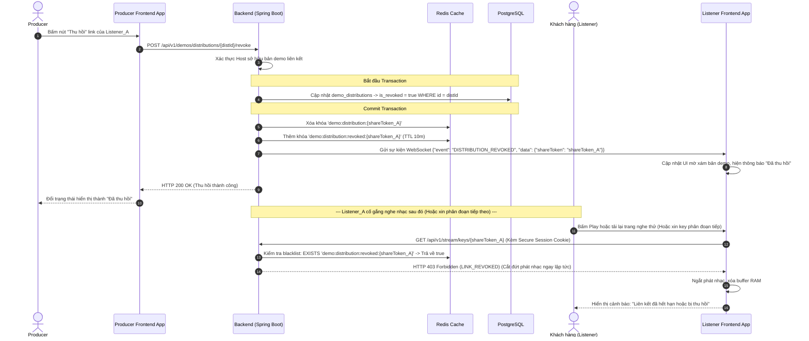
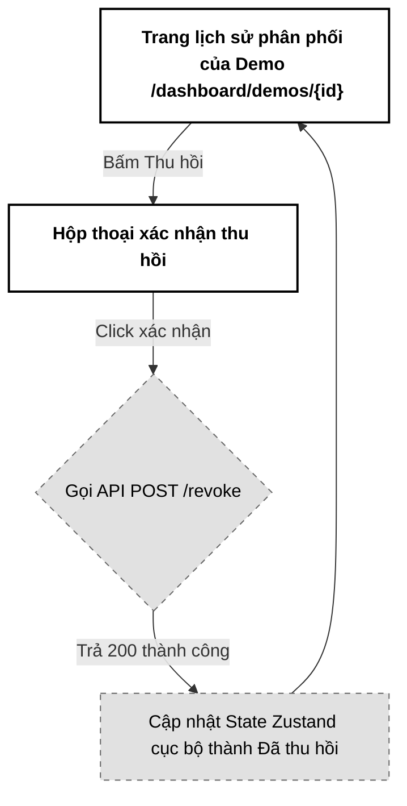

# 06. Thu hồi Quyền truy cập liên kết (Revoke Shared Link)

Tài liệu đặc tả A-Z tính năng Thu hồi quyền truy cập liên kết chia sẻ (Revoke Shared Link), cho phép Producer (Host) hủy bỏ hiệu lực của liên kết nghe thử tức thời, đồng bộ xóa cache và chặn đứng mọi yêu cầu truyền tải HLS hay tải tệp gốc tiếp theo từ phía khách hàng.

---

## 📋 1. Business & Requirements (Nghiệp vụ & Yêu cầu)

### 1.1. Mô tả Nghiệp vụ (User Story / Use Case)
*   **Đối tượng thực hiện**: Producer (Music Producer - `ROLE_USER_PRO`).
*   **Quy trình tóm tắt**:
    1.  Producer mở danh mục Lịch sử chia sẻ bản demo, click nút "Thu hồi" (Revoke) cạnh tên đối tác muốn khóa quyền.
    2.  Hệ thống hiển thị Modal xác nhận thu hồi.
    3.  Backend cập nhật cơ sở dữ liệu Postgres đánh dấu trạng thái thu hồi, đồng thời trục xuất (evict) dữ liệu khỏi Redis Cache.
    4.  Kể từ thời điểm đó, mọi yêu cầu từ phía khách hàng sử dụng Token của liên kết này để: truy cập giao diện, tải playlist HLS, lấy key giải mã AES-128, hoặc tải file gốc sẽ bị chặn đứng hoàn toàn (HTTP 403 Forbidden).

### 1.2. Quy tắc Nghiệp vụ (Business Rules)

#### A. Xác thực quyền hạn thu hồi (Authorization)
*   Chỉ Producer sở hữu bản nhạc demo đó mới được phép gọi API thu hồi quyền truy cập. 
*   Backend kiểm tra: Truy vấn bảng `demo_distributions` lấy thông tin `demo_id`, sau đó đối chiếu trường `owner_id` của bản demo đó trong bảng `demos` với `userId` của người gọi API. Nếu không khớp -> Trả lỗi HTTP `403 Forbidden` (`FORBIDDEN_ACCESS`).

#### B. Cơ chế vô hiệu hóa tức thời (Immediate Revocation)
*   Để tối ưu hiệu năng truy vấn khi khách hàng nghe nhạc, hệ thống cache cấu hình của bản phân phối vào Redis String: `demo:distribution:{shareToken}`.
*   **Quy trình đồng bộ khi thu hồi**:
    1.  Cập nhật thuộc tính `is_revoked = true` trong PostgreSQL ở bảng `demo_distributions`.
    2.  Xóa ngay lập tức key `demo:distribution:{shareToken}` khỏi Redis Cache.
    3.  Đồng thời, ghi nhận một khóa tạm thời để đánh dấu đã thu hồi: `demo:distribution:revoked:{shareToken}` với giá trị `"true"` và TTL **10 phút** trên Redis.
*   **Trám kẽ hở rò rỉ nhạc do bẫy Cookie sống dai (Secure Session Cookie Bypass)**: Mặc dù khách hàng đã có `SecureSessionCookie` hợp lệ với thời gian sống 1 giờ, tại endpoint trả khóa giải mã `/api/v1/stream/keys/{shareToken}`, trước khi phê duyệt cấp mảng byte nhị phân giải mã, Backend bắt buộc phải chạy lệnh `EXISTS demo:distribution:revoked:{shareToken}` xuống Redis. Nếu key này tồn tại (hoặc nếu key gốc `demo:distribution:{shareToken}` không còn tồn tại/DB check `is_revoked = true`), Backend lập tức từ chối và trả về lỗi `HTTP 403 Forbidden` để ngắt đứt luồng phát nhạc (Mid-stream Interruption) của Listener ngay lập tức.

#### C. Tính độc lập của liên kết
*   Việc thu hồi chỉ ảnh hưởng duy nhất đến mã Token (`shareToken`) của bản phân phối được chọn.
*   Các liên kết chia sẻ khác của cùng một bản demo đó gửi cho các đối tác khác vẫn hoạt động bình thường, không bị ảnh hưởng.

#### D. Đồng bộ giao diện Dòng thời gian của Đối tác (Shared Thread UI Sync via WebSockets)
*   Vì các liên kết chia sẻ được tổ chức hiển thị dưới dạng Luồng hội thoại lịch sử (`shared_threads`), nếu tại thời điểm Producer bấm nút thu hồi liên kết, đối tác nhận nhạc (Listener) cũng đang mở giao diện dòng thời gian của họ, bản ghi bài hát đó nên được cập nhật trạng thái thời gian thực.
*   Tại luồng xử lý thành công ở tầng Service, Backend phát đi một sự kiện WebSocket tới topic chung của cặp đôi đó:
    `{"event": "DISTRIBUTION_REVOKED", "data": {"shareToken": "{shareToken}"}}`
*   Frontend của đối tác khi nhận được tin này sẽ tự động chuyển trạng thái bài hát trên UI sang dạng làm mờ có gạch chéo kèm dòng chữ *"Liên kết đã bị thu hồi"*, ngăn chặn việc click phát nhạc bị báo lỗi giật cục, mang lại trải nghiệm UX nhất quán và tinh tế.

---

### 1.3. Quy tắc Xác thực Dữ liệu
*   API thu hồi nhận tham số `distributionId` (UUID) trên URL Path để xác định bản phân phối cần xử lý.

---

### 1.4. Giới hạn Tần suất Truy cập API (IP Rate Limiting)

| API Endpoint | Giới hạn | Mô tả |
| :--- | :--- | :--- |
| `POST /api/v1/demos/distributions/{id}/revoke` | **20 requests / phút / IP** | Tránh spam thu hồi liên tục |

---

## 🔄 2. User Flow & Sequence Diagram (Luồng người dùng & Sơ đồ tuần tự)

### 2.1. Luồng Thu hồi liên kết và Chặn truy cập (Revocation & Access Block Flow)



##### 📝 Mô tả chi tiết các bước xử lý:
1.  **Thu hồi quyền**: Producer click thu hồi trên bảng điều khiển. Frontend gửi `POST /api/v1/demos/distributions/{distId}/revoke`.
2.  **Xác thực và Cập nhật**: Backend kiểm tra quyền sở hữu, cập nhật cột `is_revoked = true` trong DB. Đồng thời, Backend thực hiện xóa khóa cache phân phối tương ứng `demo:distribution:{shareToken}` khỏi Redis, ghi nhận khóa blacklist `demo:distribution:revoked:{shareToken}` (TTL 10 phút) lên Redis, và broadcast sự kiện qua WebSocket tới Topic chung của hội thoại để tự động làm mờ và cập nhật trạng thái đã thu hồi trên giao diện Listener trong thời gian thực.
3.  **Kiểm tra và ngắt luồng (Mid-stream Interruption)**: Khi Listener cố gắng truy xuất lấy Key giải mã, tải playlist HLS hoặc tải tệp gốc:
    *   Hệ thống kiểm tra nhanh sự tồn tại của khóa blacklist `demo:distribution:revoked:{shareToken}` trên Redis.
    *   Nếu tồn tại khóa này (hoặc nếu key gốc không còn tồn tại/DB check `is_revoked = true`), Backend lập tức trả về lỗi HTTP 403 Forbidden. Trình phát HLS tại client lập tức ngắt luồng, xóa sạch bộ nhớ đệm RAM và thông báo liên kết bị khóa, chặn đứng hoàn toàn việc dùng cookie cũ còn hạn để bypass.

---

## 💾 3. Database & Cache Schema (Thiết kế Cơ sở Dữ liệu & Cache)

### 3.1. Thiết kế Cache Redis thời gian thực (Bổ sung)

| Định dạng Khóa (Redis Key) | Kiểu dữ liệu | Giá trị (Value) | TTL | Mục đích sử dụng |
| :--- | :--- | :--- | :--- | :--- |
| `demo:distribution:revoked:{shareToken}` | `String` | `"true"` | **600 giây** (10 phút) | Lưu vết nhanh các token đã bị thu hồi để chặn spam gọi API lấy key liên tục xuống DB. |

---

## 🔌 4. API Specifications (Đặc tả API)

### 4.0. Cấu hình Chung
*   **Base Path**: `/api/v1`
*   **Headers**: `Authorization: Bearer <accessToken>`

---

### 4.1. API Thu hồi liên kết phân phối (Revoke Distribution)
*   **Method**: `POST`
*   **Path**: `/api/v1/demos/distributions/{distributionId}/revoke`
*   **Auth Level**: `Requires ROLE_USER_PRO`

#### Response Thành công (200 OK):
```json
{
  "success": true,
  "message": "Thu hồi quyền truy cập liên kết chia sẻ thành công",
  "data": null,
  "errors": null,
  "timestamp": "2026-07-01T16:40:00Z"
}
```

#### Response Thất bại do không phải chủ sở hữu (403 Forbidden):
```json
{
  "success": false,
  "message": "Tài khoản của bạn không có quyền thu hồi liên kết này",
  "data": null,
  "errors": [
    {
      "code": "FORBIDDEN_ACCESS",
      "field": null,
      "message": "Người dùng không phải là Producer sở hữu tệp nhạc"
    }
  ],
  "timestamp": "2026-07-01T16:40:00Z"
}
```

---

### 4.2. Phụ lục Mã Lỗi Nghiệp Vụ (Error Codes)

| Http Status | Error Code (String) | Mô tả | Trường liên quan (`field`) |
| :--- | :--- | :--- | :--- |
| `403 Forbidden` | `FORBIDDEN_ACCESS` | Người gọi API không phải là người sở hữu bản nhạc | `null` |
| `404 Not Found` | `DISTRIBUTION_NOT_FOUND` | Không tìm thấy bản ghi phân phối tương ứng | `distributionId` |

---

## 🎨 5. UI/UX & Frontend Integration Notes (Giao diện & Tích hợp)

### 5.1. Thiết kế Giao diện Thu hồi (Grayscale Theme & A11y)
*   **Modal xác nhận thu hồi (Confirmation Dialog)**:
    *   Khi Producer bấm "Thu hồi", hiển thị hộp thoại xác nhận đơn sắc tối giản. Nền trắng, viền đen.
    *   Thông điệp: *"Bạn có chắc chắn muốn thu hồi liên kết nghe thử này? Khách hàng sẽ không thể tiếp tục nghe trực tuyến hoặc tải xuống file nhạc."*
    *   Hai nút lựa chọn phẳng: `[ Xác nhận thu hồi ]` (nền đen chữ trắng) và `[ Hủy bỏ ]` (nền trắng chữ đen viền xám).
*   **Cập nhật danh sách**:
    *   Nút bấm "Thu hồi" trên dòng bản ghi tương ứng lập tức chuyển sang nhãn `[ Đã thu hồi ]` dạng Text tĩnh màu xám nhạt (`text-neutral-400`), vô hiệu hóa mọi click tương tác sau đó.
*   **Accessibility (A11y)**:
    *   Hộp thoại xác nhận khai báo `role="alertdialog"`, `aria-modal="true"`.

---

### 5.2. Tối ưu hóa Hiệu năng & Trải nghiệm Lập trình viên (Performance & DevEx)
*   **Cập nhật State ở Client**:
    *   Khi API thu hồi trả về thành công, Frontend cập nhật mảng danh sách phân phối trong Zustand Store cục bộ (cập nhật thuộc tính `isRevoked = true` cho dòng ghi nhận đó) để render lại UI tức thời mà không cần reload trang hay gọi lại API danh sách.

---

### 5.3. Sơ đồ Luồng Màn hình (Screen Flow)



---

## 📊 6. Logging & Observability (Ghi nhận Nhật ký & Giám sát)

### 6.1. Log Points (Các điểm ghi log)

| Level | Sự kiện | Payload mẫu |
| :--- | :--- | :--- |
| `INFO` | Revoke request received | `{"event": "REVOKE_REQUEST", "distId": "f7b84f32-...", "userId": "c8b74f51-..."}` |
| `INFO` | Distribution revoked successfully | `{"event": "DISTRIBUTION_REVOKED", "distId": "f7b84f32-...", "token": "e5b84f32-..."}` |
| `WARN` | Unauthorized revoke attempt | `{"event": "UNAUTHORIZED_REVOKE_ATTEMPT", "distId": "f7b84f32-...", "userId": "e5b84f32-..."}` |

### 6.2. Quy tắc Bảo mật Log
*   Không ghi log email của khách hàng được liên kết với Token bị thu hồi trong log nghiệp vụ thô.
