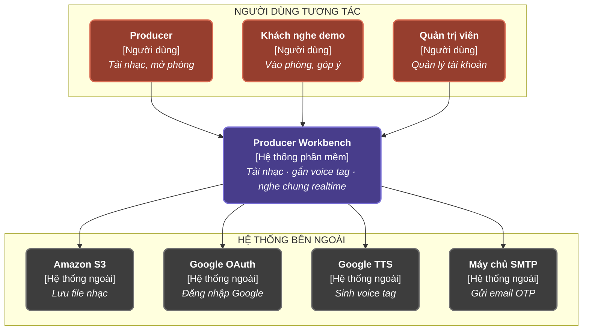
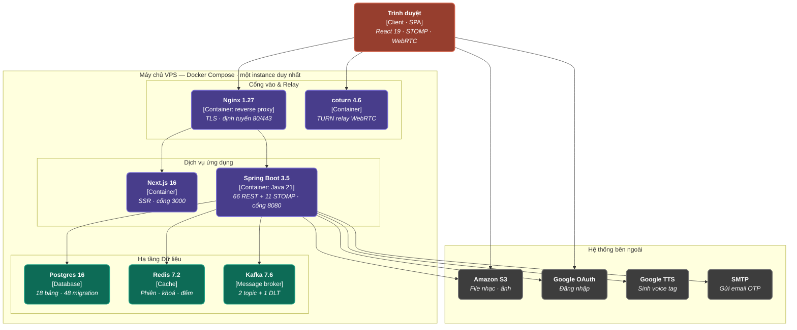
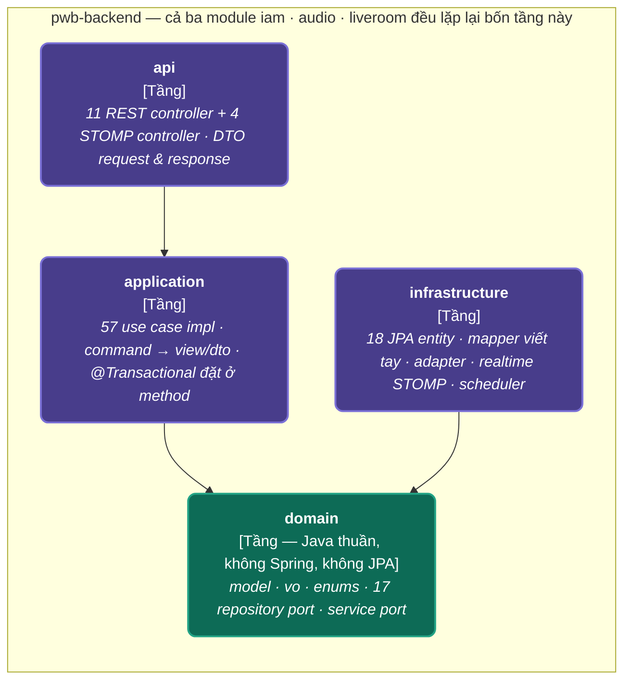
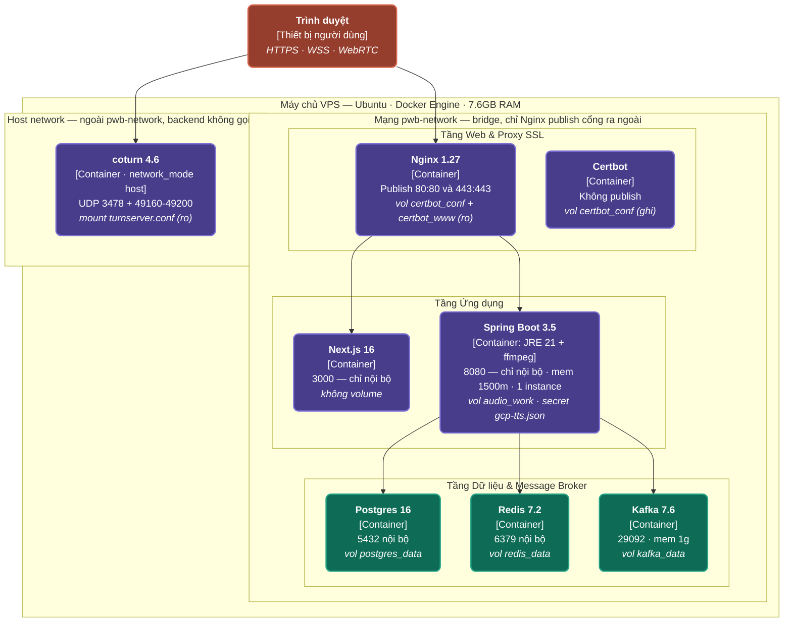
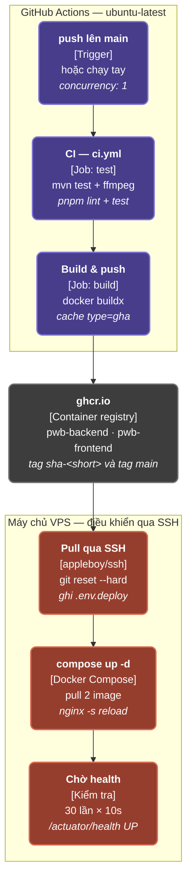

# Bộ Sơ đồ Kiến trúc Hệ thống Producer Workbench (PWB_MiNi)

Tài liệu này tổng hợp toàn bộ **5 sơ đồ kiến trúc chuẩn hóa** của dự án **Producer Workbench (PWB_MiNi)** được đặt tên và phân loại chuẩn xác theo tiêu chuẩn C4 Model và Deployment/Pipeline specifications.

---

## 📌 Bảng Quy chuẩn Tên hình & Chuẩn C4

| # | Tên hình (Filename) | Tên Tiêu đề Sơ đồ | Chuẩn C4 |
|---|---|---|---|
| **1** | [c4_level1_system_context.md](file:///d:/Learning/Project/PWB_MiNi/docs/diagram/c4_level1_system_context.md) | **C4 mức 1 — Sơ đồ ngữ cảnh hệ thống** | Level 1: System Context |
| **2** | [c4_level2_container_diagram.md](file:///d:/Learning/Project/PWB_MiNi/docs/diagram/c4_level2_container_diagram.md) | **C4 mức 2 — Sơ đồ container** | Level 2: Container |
| **3** | [c4_level3_backend_layers.md](file:///d:/Learning/Project/PWB_MiNi/docs/diagram/c4_level3_backend_layers.md) | **C4 mức 3 — Bốn tầng bên trong container backend** | Level 3: Component |
| **4** | [c4_deployment_diagram_vps.md](file:///d:/Learning/Project/PWB_MiNi/docs/diagram/c4_deployment_diagram_vps.md) | **Sơ đồ triển khai trên VPS** | Supplementary: Deployment |
| **5** | [cicd_pipeline_ghcr_to_vps.md](file:///d:/Learning/Project/PWB_MiNi/docs/diagram/cicd_pipeline_ghcr_to_vps.md) | **Pipeline CI/CD từ GitHub Actions qua GHCR tới VPS** | Không thuộc C4 — pipeline diagram |

---

## 1. C4 mức 1 — Sơ đồ ngữ cảnh hệ thống

> **Chuẩn C4 — Level 1: System Context**: Biểu diễn mối quan hệ giữa người dùng (Producer, Khách nghe demo, Admin), ứng dụng trung tâm Producer Workbench và 4 hệ thống ngoài (S3, OAuth, TTS, SMTP).

---

## 2. C4 mức 2 — Sơ đồ container

> **Chuẩn C4 — Level 2: Container**: Biểu diễn toàn bộ cụm Container vận hành hệ thống (Trình duyệt SPA, Nginx Proxy, Next.js Frontend, Spring Boot Backend, Postgres DB, Redis Cache, Kafka Message Broker, Coturn Relay Server và các dịch vụ Cloud bên ngoài).

---

## 3. C4 mức 3 — Bốn tầng bên trong container backend

> **Chuẩn C4 — Level 3: Component**: Chi tiết giải phẫu 4 tầng cấu trúc bên trong container backend (`api` -> `application` -> `domain` <- `infrastructure`). Cả 3 module (`iam`, `audio`, `liveroom`) đều lặp lại bốn tầng này.

---

## 4. Sơ đồ triển khai trên VPS

> **Chuẩn C4 — Supplementary: Deployment**: Sơ đồ triển khai chi tiết các Docker Containers trên VPS Ubuntu (7.6GB RAM), thể hiện rõ ràng mạng bridge `pwb-network`, volume persistent và host network cho Coturn.

---

## 5. Pipeline CI/CD từ GitHub Actions qua GHCR tới VPS

> **Không thuộc C4 — Pipeline Diagram**: Quy trình tự động hóa CI/CD từ lúc push code main, chạy test, buildx image, push `ghcr.io` và pull qua SSH triển khai lên VPS.

