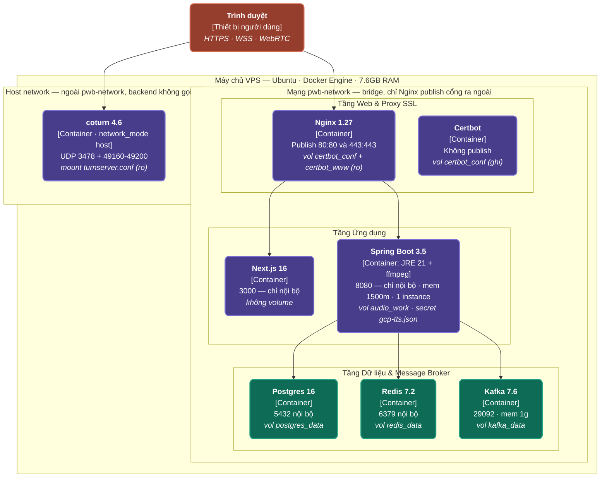

# Sơ đồ triển khai trên VPS

> **Chuẩn C4 — Supplementary: Deployment**: Sơ đồ kiến trúc triển khai chi tiết trên môi trường máy chủ VPS (Ubuntu, Docker Engine, 7.6GB RAM), phân chia rõ ràng mạng nội bộ `pwb-network` và `host network`.

---

## 1. Biểu đồ Mermaid

---

## 2. Mô tả Chi tiết Hạ tầng Triển khai VPS

| Node / Component | Cấu hình Mạng & Volume | Chức năng Triển khai |
|---|---|---|
| **Máy chủ VPS** | Ubuntu OS, Docker Engine, 7.6GB RAM | Hạ tầng vật lý/ảo hóa chạy toàn bộ các Docker Containers của hệ thống. |
| **Nginx 1.27** | `pwb-network` (bridge), publish `80:80`, `443:443` `vol certbot_conf + certbot_www (ro)` | Container duy nhất công khai cổng ra ngoài Internet, đảm nhận SSL và định tuyến. |
| **Certbot** | `pwb-network`, không publish, `vol certbot_conf (ghi)` | Tự động tạo và cập nhật chứng chỉ SSL Let's Encrypt. |
| **Next.js 16** | `pwb-network`, cổng `3000` nội bộ, không volume | Server-Side Rendering Frontend container. |
| **Spring Boot 3.5** | `pwb-network`, cổng `8080` nội bộ, mem `1500m` `vol audio_work`, `secret gcp-tts.json` | Backend Application Container (JRE 21 + ffmpeg tích hợp). |
| **Postgres 16** | `pwb-network`, cổng `5432` nội bộ, `vol postgres_data` | Database container chính lưu dữ liệu quan hệ. |
| **Redis 7.2** | `pwb-network`, cổng `6379` nội bộ, `vol redis_data` | Cache & Session container. |
| **Kafka 7.6** | `pwb-network`, cổng `29092`, mem `1g`, `vol kafka_data` | Message Broker container phục vụ xử lý bất đồng bộ. |
| **coturn 4.6** | `network_mode host`, UDP `3478 + 49160-49200` `mount turnserver.conf (ro)` | TURN/STUN server nằm ngoài `pwb-network` chạy trực tiếp ở host network phục vụ WebRTC. |
