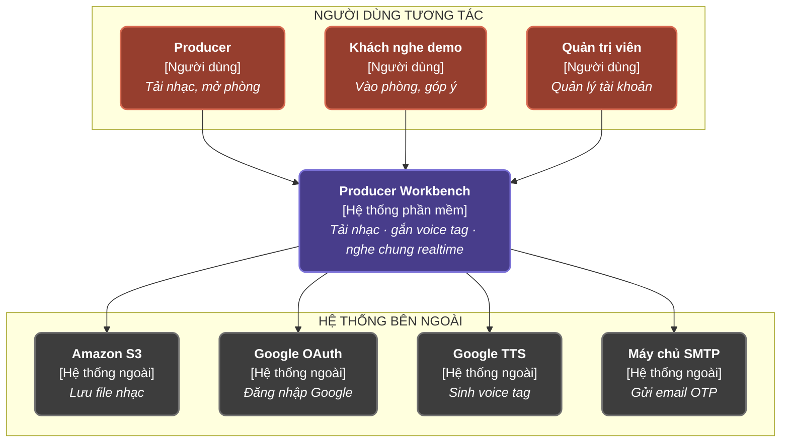

# C4 mức 1 — Sơ đồ ngữ cảnh hệ thống

> **Chuẩn C4 — Level 1: System Context**: Thể hiện ranh giới hệ thống Producer Workbench, các nhóm đối tượng người dùng tương tác và các dịch vụ bên ngoài tích hợp.

---

## 1. Biểu đồ Mermaid

---

## 2. Mô tả Chi tiết Thành phần

| Thành phần | Loại | Chức năng chính |
|---|---|---|
| **Producer** | Người dùng | Tải nhạc lên hệ thống, tạo và quản lý phòng nghe nhạc trực tiếp (Live Room). |
| **Khách nghe demo** | Người dùng | Tham gia vào các phòng nghe demo, trò chuyện, phát nhạc đồng bộ và đưa ra góp ý. |
| **Quản trị viên** | Người dùng | Quản lý tài khoản, phân quyền và giám sát hệ thống. |
| **Producer Workbench** | Hệ thống phần mềm | Hệ thống cốt lõi: Tải nhạc, gắn voice tag, nghe chung realtime. |
| **Amazon S3** | Hệ thống ngoài | Lưu trữ file nhạc và tài nguyên truyền thông. |
| **Google OAuth** | Hệ thống ngoài | Xác thực đăng nhập qua Google. |
| **Google TTS** | Hệ thống ngoài | Sinh voice tag tự động. |
| **Máy chủ SMTP** | Hệ thống ngoài | Gửi email chứa mã OTP. |
