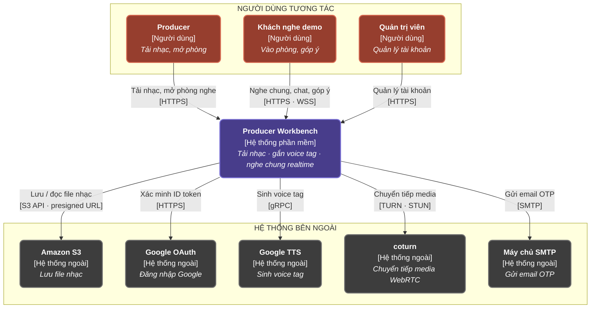

# C4 mức 1 — Sơ đồ ngữ cảnh hệ thống

> **Chuẩn C4 — Level 1: System Context**: Thể hiện ranh giới hệ thống Producer Workbench, các nhóm đối tượng người dùng tương tác và các dịch vụ bên ngoài tích hợp.

---

## 1. Biểu đồ Mermaid

---

## 2. Mô tả Chi tiết Thành phần

| Thành phần | Loại | Chức năng chính |
|---|---|---|
| **Producer** | Người dùng | Tải nhạc lên hệ thống, tạo và quản lý phòng nghe nhạc trực tiếp (Live Room). |
| **Khách nghe demo** | Người dùng | Tham gia vào các phòng nghe demo, trò chuyện, phát nhạc đồng bộ và đưa ra góp ý. |
| **Quản trị viên** | Người dùng | Quản lý tài khoản, phân quyền và giám sát hệ thống. |
| **Producer Workbench** | Hệ thống phần mềm | Hệ thống cốt lõi: Tải nhạc, gắn voice tag, nghe chung realtime. |
| **Amazon S3** | Hệ thống ngoài | Lưu trữ file nhạc và tài nguyên truyền thông. |
| **Google OAuth** | Hệ thống ngoài | Xác thực đăng nhập qua Google. |
| **Google TTS** | Hệ thống ngoài | Sinh voice tag tự động. |
| **coturn** | Hệ thống ngoài | Máy chủ TURN/STUN, chuyển tiếp luồng media WebRTC giữa các thành viên trong phòng khi kết nối ngang hàng trực tiếp không thiết lập được. |
| **Máy chủ SMTP** | Hệ thống ngoài | Gửi email chứa mã OTP. |

---

## 3. Ghi chú về phạm vi mức 1

Sơ đồ này cố ý **không** tách frontend khỏi backend: ở C4 mức 1, ứng dụng web chạy trong trình duyệt vẫn nằm bên trong ranh giới Producer Workbench. Hệ quả là hai chi tiết dưới đây đúng với code nhưng thuộc về mức 2 (Container), không vẽ ở đây:

- **File nhạc không đi qua backend.** Backend chỉ ký presigned URL (`PutObjectPresignRequest` / `GetObjectPresignRequest` trong `S3StorageServiceImpl`), còn trình duyệt đẩy và tải file trực tiếp với S3. Ở mức 1 điều này gộp thành một quan hệ `Producer Workbench → Amazon S3`, nhãn ghi rõ `presigned URL`.
- **Luồng đăng nhập Google bắt đầu ở trình duyệt.** Frontend nạp Google Identity Services rồi gửi ID token về backend; backend chỉ xác minh token bằng `GoogleIdTokenVerifier`. Ở mức 1 vẫn là một quan hệ `Producer Workbench → Google OAuth`.

Giao thức trên nhãn lấy từ code, không suy từ tài liệu: Google TTS đi **gRPC** (client dựng bằng `TextToSpeechSettings` mặc định trong `GoogleTtsAdapter`), không phải REST.
