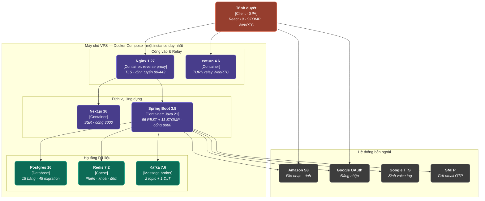

# C4 mức 2 — Sơ đồ container

> **Chuẩn C4 — Level 2: Container**: Thể hiện bức tranh toàn cảnh các Container ứng dụng (Trình duyệt SPA, Nginx Proxy, Next.js Frontend, Spring Boot Backend, Postgres, Redis, Kafka, Coturn) và các hệ thống Cloud bên ngoài.

---

## 1. Biểu đồ Mermaid

---

## 2. Mô tả Chi tiết Các Container

| Container / Dịch vụ | Loại Container | Công nghệ & Chi tiết | Vai trò trong hệ thống |
|---|---|---|---|
| **Trình duyệt** | Client SPA | React 19, STOMP, WebRTC | Giao diện người dùng tương tác trực tiếp qua HTTPS, WebSocket STOMP và WebRTC audio. |
| **Nginx 1.27** | Container: reverse proxy | TLS, định tuyến 80/443 | Cổng vào duy nhất tiếp nhận traffic HTTPS, xử lý TLS termination và định tuyến về Next.js / Spring Boot. |
| **coturn 4.6** | Container | TURN relay WebRTC | Đóng vai trò STUN/TURN server hỗ trợ kết nối âm thanh realtime qua WebRTC NAT traversal. |
| **Next.js 16** | Container | SSR, cổng 3000 nội bộ | Giao diện Frontend Server-Side Rendering (SSR). |
| **Spring Boot 3.5** | Container | Java 21, 66 REST + 11 STOMP | Backend API & Realtime WebSockets giao tiếp với DB, Cache, Kafka và Cloud APIs. |
| **Postgres 16** | Database | 18 bảng, 48 migration | Lưu trữ toàn bộ dữ liệu quan hệ của hệ thống. |
| **Redis 7.2** | Cache | Phiên, khoá, đếm | Caching, lưu trữ session người dùng, rate limit và lock phân tán. |
| **Kafka 7.6** | Message broker | 2 topic + 1 DLT | Hàng chờ xử lý sự kiện bất đồng bộ (chuyển đổi định dạng nhạc). |
| **Hệ thống bên ngoài** | External Services | S3, OAuth, TTS, SMTP | Dịch vụ lưu trữ file, xác thực, tổng hợp giọng nói và gửi mail OTP. |
