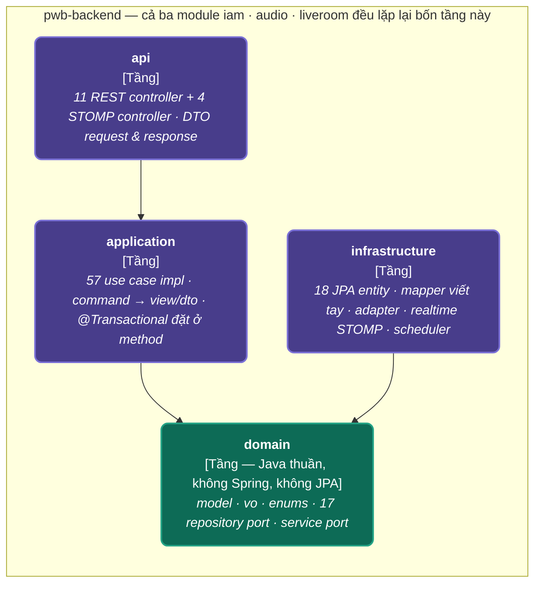

# C4 mức 3 — Bốn tầng bên trong container backend

> **Chuẩn C4 — Level 3: Component**: Chi tiết giải phẫu 4 tầng thành phần bên trong container Backend (`pwb-backend`). Cả ba module `iam`, `audio`, `liveroom` đều áp dụng đồng nhất cấu trúc 4 tầng này.

---

## 1. Biểu đồ Mermaid

---

## 2. Mô tả Chi tiết Các Tầng Thành phần (Components)

| Tầng / Component | Đặc trưng Kỹ thuật | Trách nhiệm chính |
|---|---|---|
| **`api`** | Spring Controllers | Tiếp nhận request: 11 REST controllers + 4 STOMP controllers. Quản lý DTO Request & Response. |
| **`application`** | Use Cases & Commands | 57 Use Case Implementations. Chuyển đổi Command sang View/DTO. Quản lý giao tác với `@Transactional` đặt tại cấp method. |
| **`domain`** | Pure Java (Không Spring, Không JPA) | Trái tim nghiệp vụ: Models, Value Objects (VO), Enums, 17 Repository Ports và Service Ports. |
| **`infrastructure`** | JPA, Redis, Adapters | Implement các Ports của Domain: 18 JPA Entities, Mappers viết tay, Adapters kết nối hệ thống ngoài, Realtime STOMP & Schedulers. |
