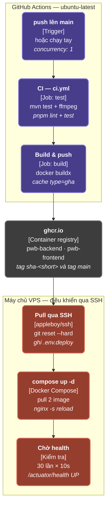

# Pipeline CI/CD từ GitHub Actions qua GHCR tới VPS

> **Phân loại**: Không thuộc C4 — Pipeline Diagram. Sơ đồ tự động hóa quy trình CI/CD tích hợp từ GitHub Actions, lưu trữ image tại GitHub Container Registry (`ghcr.io`) và tự động triển khai tới VPS qua SSH.

---

## 1. Biểu đồ Mermaid

---

## 2. Mô tả Chi tiết Các Bước Pipeline

| Giai đoạn | Thành phần / Công cụ | Mô tả Chi tiết |
|---|---|---|
| **Trigger** | GitHub Webhook | Kích hoạt khi `push` vào branch `main` hoặc chạy thủ công (`workflow_dispatch`). Cấu hình `concurrency: 1` đảm bảo chỉ một pipeline chạy tại một thời điểm. |
| **CI (Test)** | `ci.yml` Job trên GitHub Runner | Chạy `mvn test` (kèm gói `ffmpeg`) cho Backend Java 21 và `pnpm lint + test` cho Frontend Next.js. |
| **Build & Push** | Docker Buildx | Đóng gói 2 Docker Images (`pwb-backend`, `pwb-frontend`), sử dụng `cache type=gha` và push lên `ghcr.io` với tag `sha-<short>` và `main`. |
| **Container Registry** | `ghcr.io` | Lưu trữ 2 container image cho frontend và backend sẵn sàng cho VPS kéo về. |
| **Pull qua SSH** | `appleboy/ssh-action` | Kết nối SSH vào VPS, chạy `git reset --hard` và tạo file `.env.deploy`. |
| **Compose Up** | Docker Compose | Chạy `docker compose up -d` kéo 2 images mới nhất và reload cấu hình Nginx (`nginx -s reload`). |
| **Chờ Health** | Script Kiểm tra Healthcheck | Thực hiện vòng lặp 30 lần × 10s kiểm tra `/actuator/health` trả về `UP` trước khi đánh dấu hoàn thành. |
