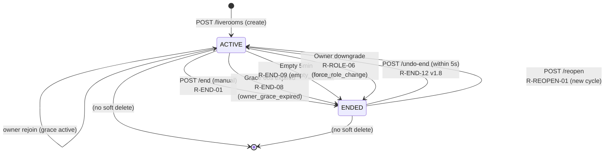
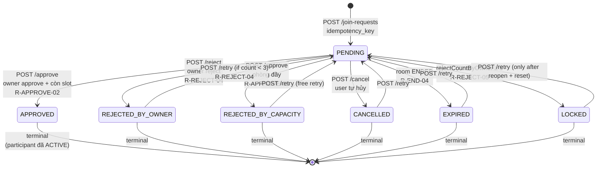
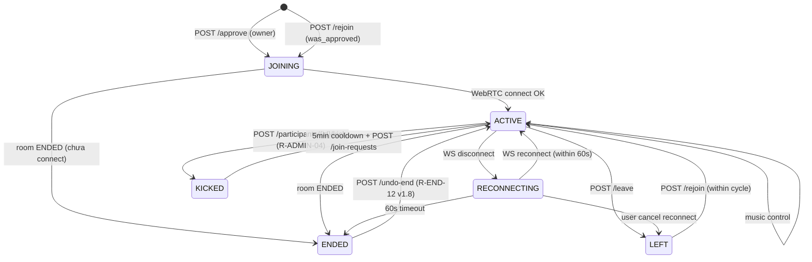
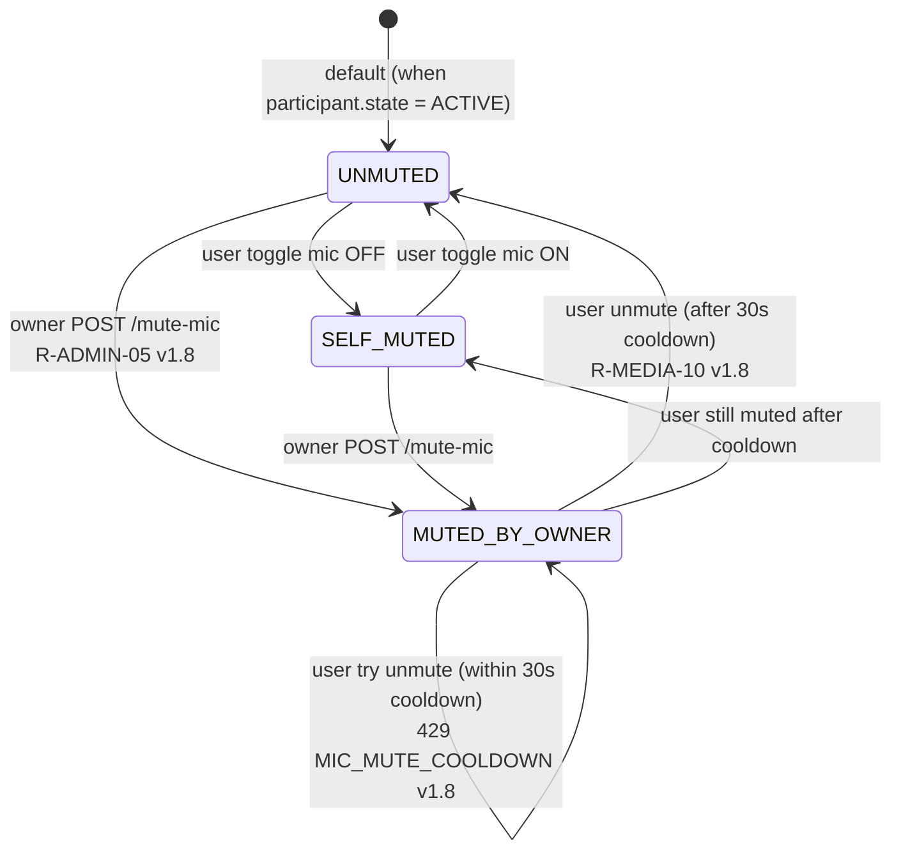
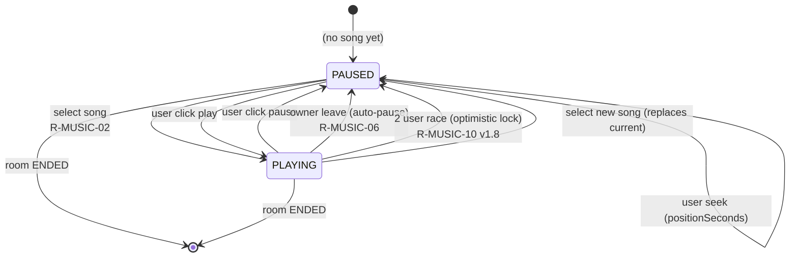
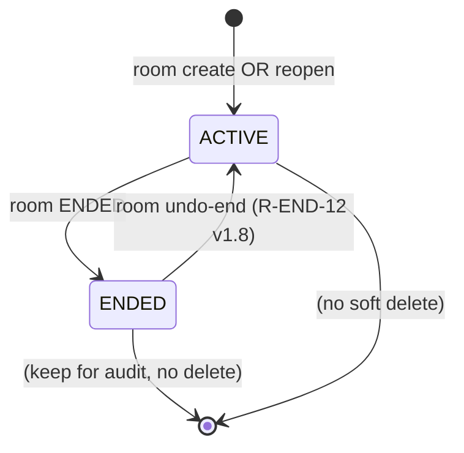

# Live Room — State Machines

**Phiên bản**: 1.0 (2026-07-26)
**Căn cứ**: `liveroom-business-requirements.md` v1.8, `liveroom-data-model.md` v1.0
**Đối tượng đọc**: Backend Dev, Frontend Dev, QA
**Mục đích**: Visualize toàn bộ state machine của module Live Room. Đây là spec chuẩn cho implementation + test.

---

## 1. Overview

Module Live Room có **5 state machines** chính:

1. **`LiveRoom.state`** — vòng đời phòng (ACTIVE ↔ ENDED)
2. **`JoinRequest.state`** — yêu cầu tham gia (PENDING → terminal)
3. **`Participant.state`** — trạng thái user trong phòng (ACTIVE → LEFT/KICKED/...)
4. **`Participant.micState`** — trạng thái mic (UNMUTED ↔ MUTED_BY_OWNER)
5. **`PlaybackState.status`** — pause/play (R-MUSIC-10 v1.8)
6. **`RoomSessionCycle`** — phiên hoạt động (cho annotation cross-session)

---

## 2. State Machine #1: `LiveRoom.status`

### 2.1. States

```
ACTIVE     — Phòng đang hoạt động, có thể join/leave
ENDED      — Phòng đã kết thúc, không thể join
```

### 2.2. Diagram



### 2.3. Transition Table

| From | To | Trigger | Endpoint | WS Event | Guard |
|---|---|---|---|---|---|
| (none) | ACTIVE | Owner create room | POST /liverooms | — | user.role = PRO, room name unique |
| ACTIVE | ENDED | Owner manual end | POST /liverooms/{id}/end | ROOM_MANUAL_ENDED | owner = currentUser |
| ACTIVE | ENDED | Grace expired | (job) | ROOM_AUTO_ENDED | owner_left_at + grace < now |
| ACTIVE | ENDED | Empty timeout | (job) | ROOM_AUTO_ENDED | started_at + 5min < now, current_count = 0 |
| ACTIVE | ENDED | Owner downgrade | (admin event) | ROOM_AUTO_ENDED | user.role từ PRO → USER |
| ENDED | ACTIVE | Undo | POST /liverooms/{id}/undo-end | ROOM_REVIVED | ended_at + 5s > now |
| ENDED | ACTIVE | Reopen | POST /liverooms/{id}/reopen | ROOM_REOPENED | status = ENDED, owner = PRO |

### 2.4. Side Effects (theo transition)

**ACTIVE → ENDED (manual/auto):**
- Update `liveroom_rooms.ended_at = now`, `ended_reason = 'manual' | 'owner_grace_expired' | 'empty_timeout' | 'force_role_change'`
- Update `liveroom_room_session_cycles.ended_at = now`
- Update tất cả `liveroom_participants.state ACTIVE → ENDED`, set `left_at = now`
- Update tất cả `liveroom_join_requests.state PENDING → EXPIRED`, `rejection_reason = ROOM_ENDED`
- **Keep** annotation, chat message (lưu DB vĩnh viễn)
- **Delete** `liveroom_playback_states` (R-MUSIC-07)
- Decrease `current_participant_count` về 0

**ACTIVE → ACTIVE (owner leave):**
- Set `liveroom_rooms.owner_left_at = now`
- Set `liveroom_rooms.reserved_owner_slot = TRUE`
- Giảm `effective_max_participants = max - 1`
- **Debounce 3s** (R-LEAVE-04.1 v1.8): KHÔNG broadcast WS ngay, buffer 3s
- Sau 3s, nếu vẫn absent → broadcast `OWNER_LEFT`

**ACTIVE → ACTIVE (owner rejoin):**
- Set `liveroom_rooms.owner_left_at = NULL`
- Set `liveroom_rooms.reserved_owner_slot = FALSE`
- Restore `effective_max_participants = max`
- Cancel grace expiry job
- Broadcast `OWNER_REJOINED` (chỉ sau khi debounce 3s đã flush)

**ENDED → ACTIVE (undo):**
- Update `liveroom_rooms.status = ACTIVE`, `ended_at = NULL`, `ended_reason = NULL`
- Update `liveroom_room_session_cycles.ended_at = NULL` (KHÔNG tạo cycle mới)
- Update `liveroom_participants.state ENDED → ACTIVE` (khôi phục)
- Update `liveroom_join_requests.state EXPIRED → PENDING` (chỉ những request chưa quá 24h)
- Broadcast `ROOM_REVIVED`

**ENDED → ACTIVE (reopen):**
- Update `liveroom_rooms.status = ACTIVE`, `started_at = now`, `reopened_count++`
- Tạo `liveroom_room_session_cycles` mới (cycle_number = reopened_count + 1)
- Set `liveroom_rooms.current_session_cycle_id = new_cycle.id`
- **Xoá** `liveroom_join_requests` (R-REOPEN-07)
- **Xoá** `liveroom_reject_counters` (R-REJECT-04.1)
- **Xoá** `liveroom_playback_states` (R-MUSIC-07)
- **Keep** `liveroom_annotations` (R-ANNOT-05 v1.8 — archive theo cycle)
- Broadcast `ROOM_REOPENED`

---

## 3. State Machine #2: `JoinRequest.state`

### 3.1. States

```
PENDING              — Chờ owner duyệt
APPROVED             — Đã duyệt, user đã vào phòng
REJECTED_BY_OWNER    — Owner chủ động reject (R-JOIN-11 v1.8)
REJECTED_BY_CAPACITY — Phòng đầy khi approve (R-JOIN-11 v1.8)
CANCELLED            — User tự hủy
EXPIRED              — Phòng ENDED trước khi duyệt
LOCKED               — rejectCountByOwner ≥ 3 (R-REJECT-05)
```

### 3.2. Diagram



### 3.3. Transition Table

| From | To | Trigger | Endpoint | Counter Effect | WS Event |
|---|---|---|---|---|---|
| (none) | PENDING | User send request | POST /join-requests | — | JOIN_REQUEST_CREATED (to owner) |
| PENDING | APPROVED | Owner approve | POST /approve | — | REQUEST_APPROVED (to user) + PARTICIPANT_JOINED (to room) |
| PENDING | REJECTED_BY_OWNER | Owner reject | POST /reject | +1 `reject_count_by_owner` | REQUEST_REJECTED_BY_OWNER (to user) |
| PENDING | REJECTED_BY_CAPACITY | Approve + room full | POST /approve | +1 `reject_count_by_capacity` | REQUEST_REJECTED_BY_CAPACITY (to user) |
| PENDING | CANCELLED | User cancel | POST /cancel | — | JOIN_REQUEST_CANCELLED (to owner) |
| PENDING | EXPIRED | Room ENDED | (system) | — | (no event, request fizzle) |
| PENDING | LOCKED | count ≥ 3 | (system, on POST) | — | REQUEST_LOCKED (to user) |
| terminal | PENDING | User retry | POST /join-requests | — | — |

### 3.4. Counter Mapping (R-REJECT-06 v1.8)

| State | `rejectionReason` | `reject_count_by_owner` | `reject_count_by_capacity` |
|---|---|---|---|
| `REJECTED_BY_OWNER` | `OWNER_REJECT` | +1 | 0 |
| `REJECTED_BY_CAPACITY` | `CAPACITY_FULL` | 0 | +1 |
| `CANCELLED` | `USER_CANCELLED` | 0 | 0 |
| `EXPIRED` | `ROOM_ENDED` | 0 | 0 |
| `LOCKED` | `RATE_LIMIT` | 0 | 0 |

**Implement**: Trigger trong transaction `IF newState = REJECTED_BY_OWNER THEN counter++`. KHÔNG dùng event hook.

### 3.5. Retry Logic

Sau khi `Reset` (cancel/expire/reject), user có thể gửi lại:
- `CANCELLED`, `EXPIRED`: retry tự do
- `REJECTED_BY_CAPACITY`: retry tự do (counter không tăng cho LOCKED)
- `REJECTED_BY_OWNER`: retry nếu `rejectCountByOwner < 3`
- `LOCKED`: KHÔNG retry được (chỉ reset khi reopen)

**Idempotency** (R-JOIN-07 v1.8):
- Mỗi POST request kèm `Idempotency-Key` header
- Nếu key đã tồn tại trong 24h → return row cũ (200 OK)
- Nếu key mới → insert new row

---

## 4. State Machine #3: `Participant.state`

### 4.1. States

```
JOINING       — Đang connect (sau POST approve, chờ WebRTC)
ACTIVE        — Đang trong phòng
RECONNECTING  — WS disconnect, chờ reconnect (60s timeout)
LEFT          — User tự leave
KICKED        — Owner kick (R-ADMIN-04 v1.8, có 5min cooldown)
ENDED         — Room ENDED
```

### 4.2. Diagram



### 4.3. Transition Table

| From | To | Trigger | Endpoint | Guard |
|---|---|---|---|---|
| (none) | JOINING | Owner approve | POST /approve | room has slot |
| (none) | JOINING | User rejoin | POST /rejoin | was_approved = TRUE, has slot |
| JOINING | ACTIVE | WebRTC OK | (WebRTC callback) | WebRTC peer connected |
| ACTIVE | RECONNECTING | WS disconnect | (STOMP) | disconnect event |
| ACTIVE | LEFT | User leave | POST /leave | — |
| ACTIVE | KICKED | Owner kick | POST /kick | target ≠ owner |
| ACTIVE | ENDED | Room ENDED | (any END trigger) | — |
| RECONNECTING | ACTIVE | WS reconnect | (STOMP connect) | within 60s |
| RECONNECTING | ENDED | Timeout | (job) | 60s passed |
| LEFT | ACTIVE | User rejoin | POST /rejoin | within same cycle |
| KICKED | (none) | — | — | user phải đợi 5min cooldown |
| ENDED | ACTIVE | Undo end | (UNDO) | R-END-12 |

### 4.4. Multi-Tab Conflict (R-JOIN-10 v1.8)

- **Database level**: Partial unique index `(room_id, user_id) WHERE state IN ('ACTIVE', 'RECONNECTING')` — ngăn 2 row ACTIVE cùng user cùng room
- **Application level**: Service throw exception → reject join → user nhận 409 MULTI_TAB_CONFLICT
- **UI level**: Frontend dùng BroadcastChannel để detect, hiển thị warning

### 4.5. KICKED + Cooldown (R-ADMIN-04 v1.8)

- User bị kick → `state = KICKED`, `left_at = now`
- `liveroom_rooms.kicked_user_id = target`, `kicked_at = now`, `kicked_cooldown_until = now + 5min`
- Mọi POST /join-requests, POST /rejoin với user đó → check `kicked_cooldown_until > now` → 429 KICKED_COOLDOWN
- Sau 5min → user gửi JoinRequest mới (state = PENDING, owner phải duyệt lại, was_approved KHÔNG restore)
- **Cooldown KHÔNG reset** khi reopen

### 4.6. RECONNECTING → ENDED (60s timeout)

- BG job mỗi 10s quét `participant.state = RECONNECTING AND updated_at < now - 60s`
- Set `state = ENDED`, `left_at = now`
- Decrement `current_participant_count`
- WS broadcast `PARTICIPANT_CONNECTION_CHANGED` (status=OFFLINE)

---

## 5. State Machine #4: `Participant.micState`

### 5.1. States

```
UNMUTED          — User đang bật mic (mặc định vào phòng = FALSE)
SELF_MUTED       — User tự tắt mic
MUTED_BY_OWNER   — Owner đã remote-mute (R-ADMIN-05 v1.8)
```

### 5.2. Diagram



### 5.3. Transition Table

| From | To | Trigger | Endpoint | Guard | WS Event |
|---|---|---|---|---|---|
| (none) | UNMUTED | Participant ACTIVE | (auto) | — | — |
| UNMUTED | SELF_MUTED | User toggle mic OFF | (UI button) | — | MEDIA_STATE_CHANGED |
| SELF_MUTED | UNMUTED | User toggle mic ON | (UI button) | — | MEDIA_STATE_CHANGED |
| UNMUTED | MUTED_BY_OWNER | Owner remote-mute | POST /mute-mic | owner = currentUser | PARTICIPANT_MIC_MUTED_BY_OWNER |
| SELF_MUTED | MUTED_BY_OWNER | Owner remote-mute | POST /mute-mic | owner = currentUser | PARTICIPANT_MIC_MUTED_BY_OWNER |
| MUTED_BY_OWNER | (none) | User try unmute | (button) | `mic_mute_cooldown_until > now` → 429 | — |
| MUTED_BY_OWNER | UNMUTED | User unmute | (button) | cooldown passed | PARTICIPANT_MIC_UNMUTED |

### 5.4. Cooldown Logic (R-MEDIA-10 v1.8)

- Set `mic_muted_by_owner_at = now`, `mic_mute_cooldown_until = now + 30s`
- Backend enforce: POST toggle mic → check `cooldown_until > now` → 429
- Sau 30s, user có thể bật mic (micState → UNMUTED)
- Khi user bật → broadcast `PARTICIPANT_MIC_UNMUTED` → owner nhận thông báo

### 5.5. Camera Rule (R-MEDIA-11 v1.8)

- Camera KHÔNG có remote-mute (giống mic cũ)
- Owner KHÔNG có quyền tắt camera của user
- Chỉ `camera_on` (boolean), không có `cameraState` machine

---

## 6. State Machine #5: `PlaybackState.status`

### 6.1. States

```
PAUSED    — Không phát (default khi select song)
PLAYING   — Đang phát
```

### 6.2. Diagram



### 6.3. Transition Table

| From | To | Trigger | Endpoint | Guard | WS Event |
|---|---|---|---|---|---|
| (none) | PAUSED | (no song) | — | — | — |
| PAUSED | PLAYING | Select song | /music/play | R-MUSIC-11 owner absent check | MUSIC_SONG_CHANGED + MUSIC_PLAYBACK_STATE_CHANGED |
| PAUSED | PLAYING | User click play | /music/play | R-MUSIC-11 owner absent check | MUSIC_PLAYBACK_STATE_CHANGED |
| PLAYING | PAUSED | User click pause | /music/pause | — | MUSIC_PLAYBACK_STATE_CHANGED |
| PLAYING | PAUSED | Owner leave | (system) | R-MUSIC-06 | MUSIC_PLAYBACK_STATE_CHANGED (status=PAUSED) |
| PLAYING | PAUSED | 2 user race | (optimistic lock fail) | R-MUSIC-10 v1.8 | — |
| PAUSED | PAUSED | Seek | /music/seek | — | MUSIC_PLAYBACK_STATE_CHANGED |
| (any) | (none) | Room ENDED | (system) | — | (cleanup) |

### 6.4. Race Condition Protection (R-MUSIC-10 v1.8)

- JPA `@Version` optimistic lock
- 2 user cùng tap Play cách nhau 100ms:
  - User A: `UPDATE ... SET version = version + 1 WHERE version = 1` → success
  - User B: `UPDATE ... SET version = version + 1 WHERE version = 1` → 0 rows affected → 409 MUSIC_STATE_CONFLICT
- Client nhận 409 → re-fetch state qua `/music/get-state`

### 6.5. Sequence Number Ordering (R-MUSIC-10 v1.8)

- Mỗi update PlaybackState → `sequence_number++`
- Server broadcast `MUSIC_PLAYBACK_STATE_CHANGED` với `sequenceNumber`
- Client track `lastSequenceNumber` đã apply
- Event với `sequenceNumber <= lastSequenceNumber` → discard (out-of-order)

### 6.6. Owner Absent Protection (R-MUSIC-11 v1.8)

- Khi `owner_left_at IS NOT NULL`:
  - Non-owner KHÔNG thể gọi `/music/play` (R-MUSIC-11)
  - Non-owner CÓ THỂ gọi `/music/pause`, `/music/seek`, `/music/volume`
- Khi owner rejoin → khôi phục quyền

---

## 7. State Machine #6: `RoomSessionCycle`

### 7.1. Concept

- Mỗi `RoomSessionCycle` = 1 phiên của phòng (ACTIVE → ENDED)
- Annotation, chat gắn với cycle
- Reopen = tạo cycle mới

### 7.2. Diagram



### 7.3. Transition Table

| From | To | Trigger | Side Effect |
|---|---|---|---|
| (none) | ACTIVE | Room create | cycle_number = 1 |
| (none) | ACTIVE | Room reopen | cycle_number = reopened_count + 1 |
| ACTIVE | ENDED | Room ENDED | ended_at = now, ended_reason = ... |
| ENDED | ACTIVE | Undo end | ended_at = NULL (keep cycle) |

### 7.4. Cross-Session Annotation (R-ANNOT-05 v1.8)

- Annotation KHÔNG bị xoá khi reopen
- Mỗi annotation có `room_session_cycle_id`
- SC-07 history view: list cycle + chọn cycle để xem annotation
- Query: `WHERE room_session_cycle_id = ?` (filter theo cycle)

### 7.5. Cross-Session Chat (R-CHAT-06 v1.8)

- Chat message KHÔNG bị xoá khi reopen
- Mỗi message có `room_session_cycle_id`
- Chat UI mặc định chỉ load cycle hiện tại (200 messages)
- User có thể scroll xem cũ (POST-MVP)

---

## 8. State Machine Cross-Reference

### 8.1. Room + Cycle + Request + Participant

```
┌──────────────────────────────────────────────────────────────┐
│ LiveRoom (status=ACTIVE)                                     │
│   └─ current_session_cycle_id → RoomSessionCycle (ACTIVE)    │
│       ├─ JoinRequest[] (PENDING/APPROVED + terminal)         │
│       ├─ Participant[] (ACTIVE/RECONNECTING + terminal)     │
│       ├─ ChatMessage[] (current cycle)                       │
│       ├─ Annotation[] (current cycle)                        │
│       └─ PlaybackState (1:1)                                 │
└──────────────────────────────────────────────────────────────┘
```

### 8.2. State Coherence Rules

| Rule | Mô tả |
|---|---|
| R1 | Nếu `room.status = ENDED` → tất cả participant ACTIVE phải ENDED |
| R2 | Nếu `room.status = ACTIVE` → có ít nhất 1 cycle ACTIVE |
| R3 | Nếu `room.owner_left_at IS NOT NULL` → `reserved_owner_slot = TRUE` |
| R4 | Nếu `participant.state = KICKED` → `room.kicked_user_id = participant.user_id` |
| R5 | Nếu `participant.mic_state = MUTED_BY_OWNER` → `mic_mute_cooldown_until > now` HOẶC `mic_muted_by_owner_at IS NOT NULL` |
| R6 | Nếu `room_session_cycle.ended_at IS NULL` → `room.status = ACTIVE` |
| R7 | Nếu `join_request.state = PENDING` → `room.status = ACTIVE` |

### 8.3. Violation Handling

- **R1 violation**: Background job quét, ENFORE participant → ENDED
- **R2 violation**: Tự fix (create cycle)
- **R3 violation**: Tự fix (set reserved_owner_slot)
- **R4 violation**: KICKED user không có kicked_user_id → manual fix
- **R5 violation**: Auto cleanup khi cooldown pass
- **R6 violation**: Integrity check fail → alert DBA
- **R7 violation**: Auto expire (cancelled)

---

## 9. Testing Strategy

### 9.1. State Transition Tests

Mỗi transition cần cover:
1. **Happy path**: from → to OK
2. **Guard fail**: from → to với guard fail → reject
3. **Side effects**: from → to trigger các side effect đúng
4. **WS broadcast**: from → to trigger event đúng
5. **Idempotency**: from → to (same trigger) 2 lần → no duplicate

### 9.2. State Coverage Matrix

| State | From transitions | To transitions | Test cases |
|---|---|---|---|
| Room: ACTIVE | none | 4 | 5 |
| Room: ENDED | 4 | 2 | 4 |
| JoinRequest: PENDING | 1 | 6 | 6 |
| JoinRequest: APPROVED | 1 | 0 | 1 |
| JoinRequest: REJECTED_BY_OWNER | 1 | 1 | 2 |
| JoinRequest: REJECTED_BY_CAPACITY | 1 | 1 | 2 |
| JoinRequest: CANCELLED | 1 | 1 | 2 |
| JoinRequest: EXPIRED | 1 | 0 | 1 |
| JoinRequest: LOCKED | 1 | 0 | 1 |
| Participant: JOINING | 2 | 2 | 3 |
| Participant: ACTIVE | 4 | 4 | 6 |
| Participant: RECONNECTING | 1 | 3 | 3 |
| Participant: LEFT | 1 | 1 | 2 |
| Participant: KICKED | 1 | 0 | 1 |
| Participant: ENDED | 3 | 1 | 3 |
| micState: UNMUTED | 1 | 3 | 4 |
| micState: SELF_MUTED | 1 | 1 | 2 |
| micState: MUTED_BY_OWNER | 2 | 1 | 3 |
| Playback: PAUSED | 1 | 3 | 4 |
| Playback: PLAYING | 2 | 3 | 4 |
| Cycle: ACTIVE | 2 | 1 | 3 |
| Cycle: ENDED | 1 | 1 | 2 |

**Tổng**: ~60+ test cases cần cover.

### 9.3. Property-based Testing

Dùng hypothesis (Python) hoặc jqwik (Java) để generate random state sequences:
- Generate random sequence of trigger events
- Verify state invariants (R1-R7) hold
- Useful cho race condition discovery

---

## 10. Out of Scope

- ❌ State diagram cho Music queu (đã out of MVP)
- ❌ State diagram cho Reaction (chưa có)
- ❌ State diagram cho Pin/Unpin (chưa có)
- ❌ State diagram cho Recording (POST-MVP)

---

## 11. Tham chiếu chéo

- **Business**: `liveroom-business-requirements.md` v1.8
- **Data model**: `liveroom-data-model.md` v1.0
- **API**: `liveroom-api-spec.md` v1.0
- **WebSocket**: `liveroom-ws-protocol.md` v1.0
- **Concurrency**: `liveroom-concurrency.md` (sẽ tạo)
- **i18n keys**: `liveroom-i18n-keys.md` (sẽ tạo)

---

**Người viết**: Senior Dev Team
**Reviewer**: Backend Lead, QA Lead
**Ngày review**: Pending
