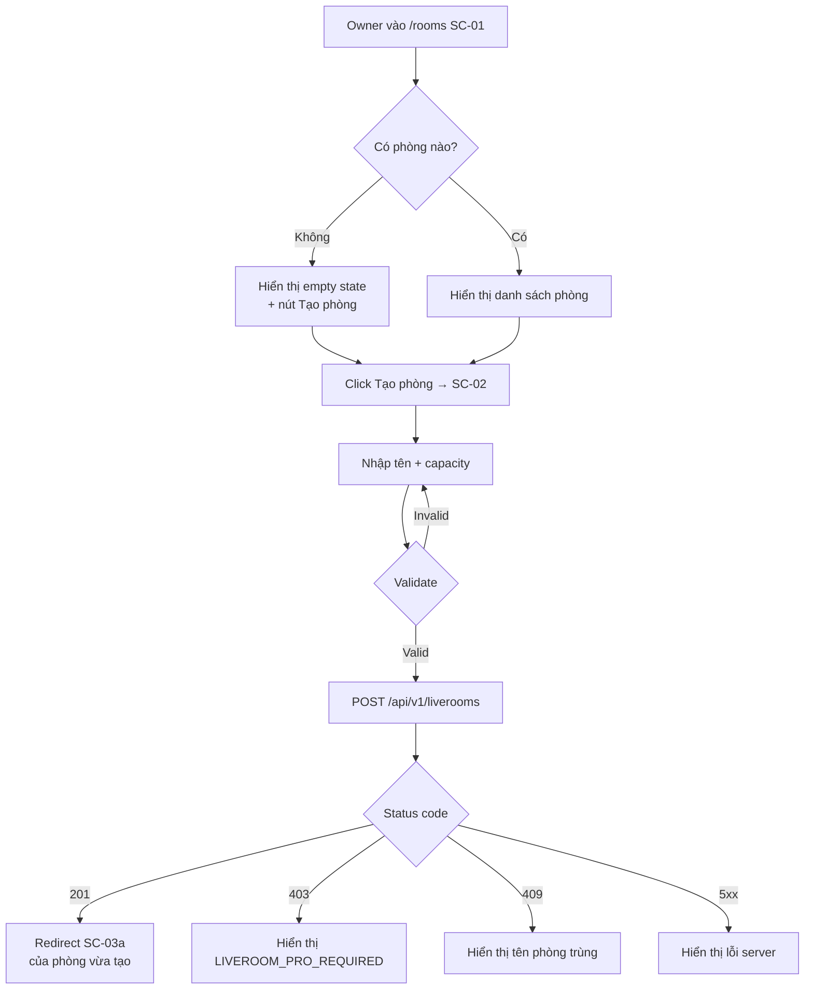
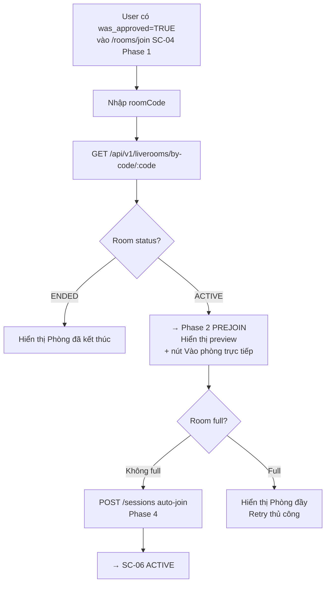
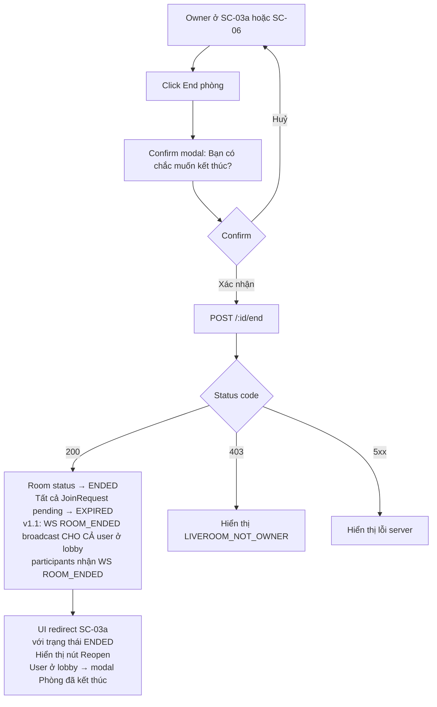
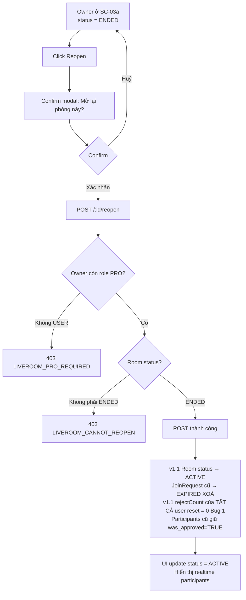
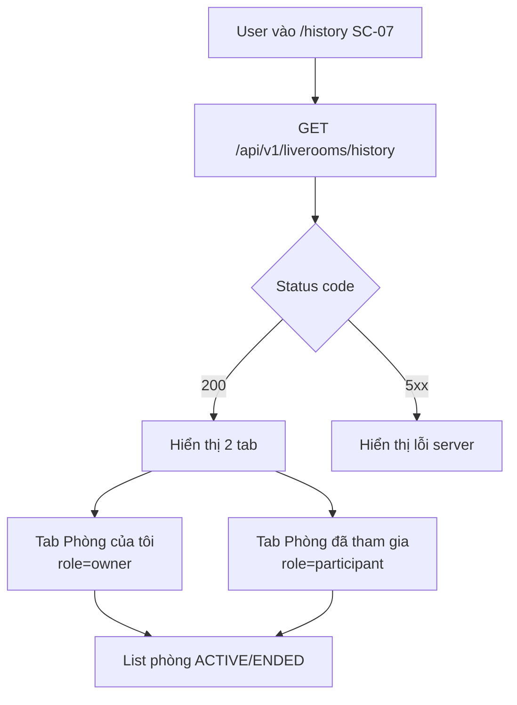
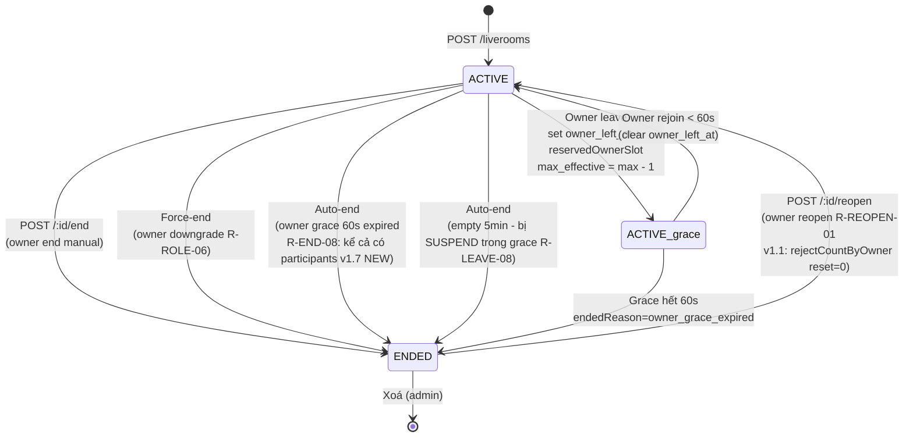
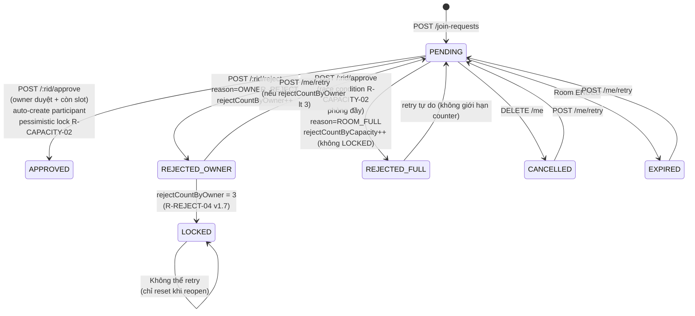
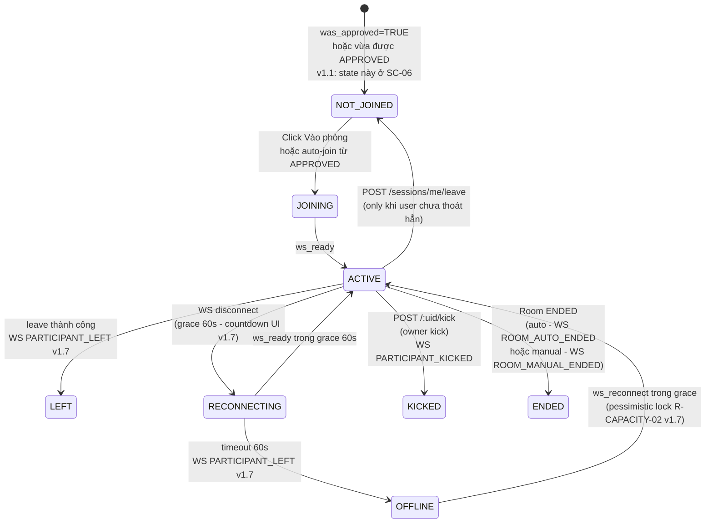
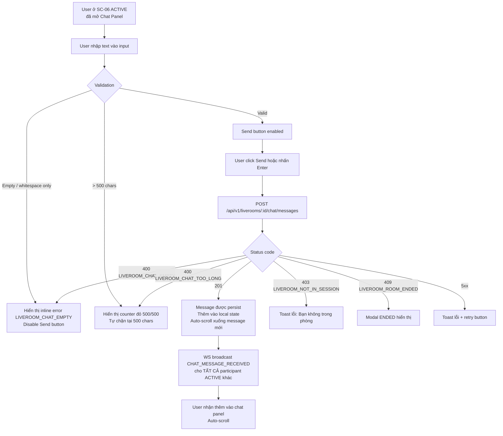
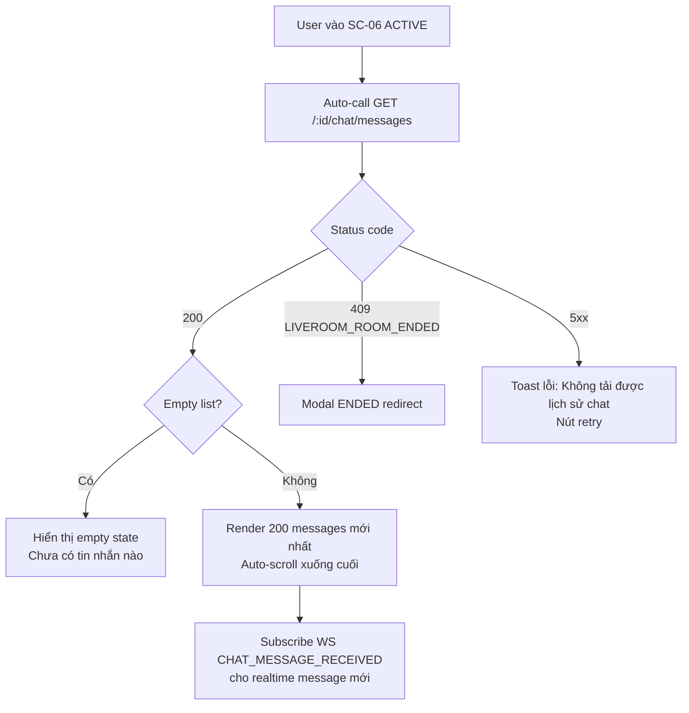

# Liveroom — User Flow

> **Mục đích**: Sơ đồ luồng nghiệp vụ cho 3 actor (Owner, Participant, Guest), làm cơ sở cho QA viết test case và Frontend implement logic.
>
> **Nguyên tắc**: Mỗi flow phải có API call tương ứng, error case rõ ràng, và state transition chính xác.

**Phiên bản**: v1.3 (2026-07-26)
**Căn cứ**: `liveroom-business-requirements.md` v1.8, `liveroom-screen-inventory.md` v1.4

**Thay đổi v1.3 (đồng bộ BR v1.8)**:
- **REJECTED state split (R-JOIN-11)**: `REJECTED_BY_OWNER` + `REJECTED_BY_CAPACITY` (MC-07 fix)
- **MC-08**: Music chỉ dùng STOMP WS, không REST control
- **MC-05 ver bump**: đồng bộ version với BR
- **MC-02**: Counter scope rõ ràng (R-REJECT-04 v1.8 table mapping)
- **MC-04**: KICKED có 5 phút cooldown (R-ADMIN-04) — không thể rejoin ngay
- **MC-06**: Room code 6 chars uppercase alphanumeric (R-CREATE-05 v1.8)
- **UX-01**: Grace duration configurable 30s-1800s (R-GRACE-01)
- **UX-03**: Email short form cho external user (R-DISPLAY-06)
- **UX-05**: SC-04 progress bar step 1/4 → 2/4 → 3/4 → 4/4
- **UX-07**: reservedOwnerSlot tooltip "1 slot reserved cho owner"
- **UX-08**: Auto-join countdown 3s + cancel (R-LEAVE-10)
- **UX-11**: Music mobile progress bar snap-to-5s, touch target ≥ 44px
- **UX-12**: Annotation popup BÊN TRÊN progress bar, auto-flip
- **B-Fix-09**: Multi-tab cùng user cùng phòng bị chặn (R-JOIN-10)
- **B-Fix-12**: Chat history lưu tất cả DB, pagination API (không xoá rolling)
- **B-Fix-14**: Annotation cross-session (R-ANNOT-08), archive theo cycle
- **B-Fix-21**: End room undo trong 5s (R-END-12)
- **B-Fix-22**: Music pause khi owner absent (R-MUSIC-11)
- **B-Fix-20**: REMOTE_MUTE permission (R-ADMIN-05) — owner mute mic từ xa

---

**Thay đổi v1.2 (đồng bộ BR v1.7)**:
- **Tách 2 reject counter (R-REJECT-04 v1.7)**:
  - `rejectCountByOwner`: REJECTED do owner chủ động → tính LOCKED (3 lần)
  - `rejectCountByCapacity`: REJECTED do phòng đầy → KHÔNG tính LOCKED
- **Owner grace period (R-LEAVE-04 → R-LEAVE-09)**:
  - Owner leave → 60s grace → ENDED kể cả có participants khác (R-END-08)
  - Owner có reserved slot trong grace → max effective = max - 1 (R-LEAVE-09)
- **Race condition protection (R-CAPACITY-02 v1.7)**: pessimistic lock khi approve/rejoin
- **WS events mới (v1.7)**: `OWNER_LEFT`, `OWNER_REJOINED`, `CAPACITY_REACHED`, `ROOM_AUTO_ENDED`, `PARTICIPANT_LEFT`
- **RECONNECTING UI** (EC-07): countdown 60s trước khi rời phòng
- **Đổi tên `Session` → `RoomSessionCycle`** (tránh nhầm với `ParticipantSession`)

## 1. Tổng quan Flow

Hệ thống có **7 flow chính**:

| # | Flow | Actor | Screen liên quan |
|---|---|---|---|
| F-01 | Tạo phòng | Owner (PRO) | SC-01 → SC-02 → SC-03a |
| F-02 | Join phòng (lần đầu) - merged Prejoin + Lobby | Participant | SC-04 (Phase 1→2→3→4) |
| F-03 | Rejoin phòng (was_approved) | Participant | SC-04 (Phase 1→2 → SC-06 NOT_JOINED → ACTIVE) |
| F-04 | Duyệt / Từ chối JoinRequest | Owner | SC-03b |
| F-05 | End phòng | Owner | SC-03a → SC-06 |
| F-06 | Reopen phòng | Owner | SC-03a |
| F-07 | Xem lịch sử | All | SC-07 |
| **F-08** (v1.2) | **Gửi chat message** | **Participant (ACTIVE)** | **SC-06 Chat Panel** |
| **F-09** (v1.2) | **Load chat history** | **Participant (ACTIVE)** | **SC-06 Chat Panel** |
| **F-10** (v1.3) | **Chọn bài hát vào phòng** | **ACTIVE participant** | **SC-06 + Song Picker Modal** |
| **F-11** (v1.3) | **Điều khiển playback (play/pause/seek/volume)** | **ACTIVE participant** | **SC-06 Music Player** |
| **F-12** (v1.3) | **Tạo annotation tại timestamp** | **ACTIVE participant (đã duyệt)** | **SC-06 + Annotation Modal** |

**Thay đổi v1.3**:
- Thêm F-10 (Select song), F-11 (Control playback), F-12 (Create annotation)
- Thêm EC-18 → EC-23 (music + annotation edge cases)
- Cập nhật SC-06 với Music Player + Annotation Markers
- **Bỏ APPROVED_WAITING state**: Approve khi phòng đầy → REJECT luôn với reason "Room is full"
- **Bỏ EC-01 (auto-promote) + AC-F02-02**: Không còn auto-promote khi có slot
- **Bỏ state diagram transitions**: APPROVED → APPROVED_WAITING và APPROVED_WAITING → APPROVED

**Thay đổi v1.2**:
- Thêm F-08 (Send chat message), F-09 (Load chat history)
- Cập nhật SC-06 với Chat Panel

**Thay đổi v1.1**:
- F-02: Gộp SC-04 (Phase 1+2) + SC-05a (Phase 3+4) thành 1 flow liên tục trong cùng screen
- F-03: Auto-join (không cần user click "Vào phòng")

---

## 2. Flow Diagram (Mermaid)

### 2.1. F-01: Tạo phòng (Owner)



### 2.2. F-02: Join phòng (lần đầu) — MERGED SINGLE SCREEN FLOW (v1.1)

```mermaid
flowchart TD
    A[User vào /rooms/join<br/>SC-04 Phase 1 CODE_INPUT] --> B[Nhập roomCode]
    B --> C[GET /api/v1/liverooms/by-code/:code]
    C --> D{Status code}
    D -->|404| E[Hiển thị LIVEROOM_ROOM_NOT_FOUND<br/>ở tại Phase 1]
    D -->|200| F{Room status?}
    F -->|ENDED| G[Hiển thị Phòng đã kết thúc<br/>ở tại Phase 1]
    F -->|ACTIVE| H[→ SC-04 Phase 2 PREJOIN<br/>Hiển thị card phòng + preview camera/test mic]
    H --> I[User click 'Xin vào phòng']
    I --> J{User đã bị LOCKED}
    J -->|Có| K[Hiển thị Modal Bị ban<br/>vẫn ở Phase 2]
    J -->|Không| L[POST /join-requests]
    L --> M{Status code}
    M -->|201| N[→ SC-04 Phase 3 LOBBY<br/>state = PENDING<br/>Hiển thị spinner Đang chờ owner duyệt]
    M -->|409 LIVEROOM_ROOM_FULL| O[→ LOBBY state = REJECTED_BY_CAPACITY (v1.8)<br/>Hiển thị toast Phòng đã đầy, vui lòng thử lại sau]
    M -->|409 duplicate| P[Hiển thị đã có request]
    M -->|5xx| Q[Hiển thị lỗi]
    N --> R{WS REQUEST_APPROVED event}
    O --> R
    R -->|Receive| S[Auto-redirect SC-06<br/>Phase 4]
    S --> T[POST /sessions auto-join]
    T --> U[SC-06 ACTIVE state<br/>User đã ở trong phòng]
```

### 2.3. F-03: Rejoin phòng (was_approved = TRUE) — SIMPLIFIED v1.1



**Lưu ý v1.6**: User có was_approved + còn slot → click "Vào phòng" 1 lần là đủ (không cần duyệt lại). User có was_approved + phòng đầy → click "Vào phòng" sẽ bị REJECT với reason "Room is full" → user phải thử lại khi có slot (không có auto-promote queue như v1.5).

### 2.4. F-04: Duyệt / Từ chối JoinRequest (Owner)

```mermaid
flowchart TD
    A[Owner vào SC-03b<br/>tab Chờ duyệt] --> B{WS event JOIN_REQUEST_NEW}
    B -->|Có| C[Badge count + 1<br/>Toast: User mới muốn tham gia]
    A --> D[Owner click Duyệt]
    D --> E[POST /:id/join-requests/:rid/approve]
    E --> F{Slot available?}
    F -->|Có| G[state → APPROVED + auto-create participant<br/>WS push REQUEST_APPROVED cho user<br/>User ở SC-04 Phase 3 → auto-redirect SC-06]
    F -->|Hết slot| H[v1.8: state → REJECTED_BY_CAPACITY<br/>Reason: ROOM_FULL (không trigger LOCKED)<br/>Hiển thị toast cho owner]
    A --> I[Owner click Từ chối]
    I --> J{Confirm modal Lý do optional}
    J --> K[POST /:id/join-requests/:rid/reject]
    K --> L{Status code}
    L -->|200| M[state → REJECTED_BY_OWNER<br/>rejectCountByOwner increment<br/>Nếu count = 3 → LOCKED<br/>WS push REQUEST_REJECTED_BY_OWNER cho user<br/>WS push REQUEST_REJECTED cho owner]
    L -->|5xx| N[Hiển thị lỗi server]
```

**v1.1 CHANGE**: APPROVED luôn kèm auto-create participant (Bug 4) → user không cần click "Vào phòng" riêng.

### 2.5. F-05: End phòng (Owner)



**v1.1 CHANGE**: WS ROOM_ENDED broadcast cho cả user ở lobby (Bug 6).

### 2.6. F-06: Reopen phòng (Owner) — v1.1 reset rejectCount



**v1.1 CHANGE**: Reopen reset rejectCount của mọi user (Bug 1 fix) → user từng LOCKED có thể thử lại.

### 2.7. F-07: Xem lịch sử (All)



---

## 3. State Transition Diagram (v1.7)

### 3.1. Room State Machine



### 3.2. JoinRequest State Machine (v1.7)



### 3.3. Participant Session State Machine



---

## 4. Edge Case Flows (v1.1 updated)

### 4.1. EC-01: User bị reject vì phòng đầy (v1.6 NEW + v1.7 - bỏ APPROVED_WAITING, R-CAPACITY-02)

**Kịch bản v1.6**: Owner approve user nhưng phòng đã đầy → reject luôn, không có queue.

**v1.7 update (R-CAPACITY-02)**: Race condition protection với pessimistic lock + tách counter (R-REJECT-04).

```
User U gửi JoinRequest → owner approve → nhưng phòng đã đầy:
1. POST /join-requests 201 PENDING
2. Owner approve → POST /:rid/approve
3. Backend pessimistic lock trên LiveRoom row (SELECT ... FOR UPDATE - v1.7 NEW)
4. Re-check currentParticipantCount >= maxParticipants (sau lock)
5. Nếu slot còn:
   - Update state = APPROVED
   - Auto-create Participant + atomic increment current_count
   - WS REQUEST_APPROVED { autoJoin: true, roomState } → U auto-redirect SC-06
6. Nếu phòng đầy (race condition - v1.7 EC-24):
   - Update state = REJECTED_BY_CAPACITY, rejectionReason = "CAPACITY_FULL"
   - rejectCountByCapacity += 1 (KHÔNG tính LOCKED - v1.7 R-REJECT-04)
   - WS JOIN_REQUEST_REJECTED { reason: "ROOM_FULL" } → U toast "Phòng đã đầy"
   - U retry tự do khi có slot (không bị LOCKED)
7. Race condition EC-24 (v1.7 NEW): 2 owner approve cùng lúc
   - Backend lock + re-check
   - Chỉ 1 thắng, người còn lại nhận REJECTION_REASON_ROOM_FULL

So với v1.5: KHÔNG có APPROVED_WAITING queue, KHÔNG auto-promote.
Đơn giản hơn nhiều, tránh race condition khi nhiều slot trống cùng lúc.
```

### 4.2. EC-02: Owner rời phòng → grace period (v1.7 NEW rules - R-LEAVE-04 → R-LEAVE-09, R-END-08)

**Kịch bản**: Owner leave phòng đang ACTIVE (có hoặc không có participants khác).

```
T=0s: Owner click "Leave room"
  1. POST /api/v1/liverooms/:id/participants/me/leave 204
  2. Backend check owner left → set owner_left_at=now, reservedOwnerSlot=true
  3. Backend: max_effective_capacity = max - 1 (giữ slot cho owner - R-LEAVE-09)
  4. Backend: Suspend empty room 5min timeout trong grace (R-LEAVE-08)
  5. WS broadcast OWNER_LEFT { ownerLeftAt, graceExpiresAt=T+60s }
  6. Music auto-pause (R-MUSIC-06)
  7. UI các participant khác hiển thị:
     - Banner top: "Owner đã rời — phòng sắp kết thúc sau Xs" + countdown 60s
     - Toast: "Owner đã rời — nhạc tạm dừng" (v1.7 NEW)
     - Music icon: đổi sang paused

T+T giây (T < 60s): Owner rejoin trong grace
  1. POST /api/v1/liverooms/:id/host/join { micMuted, cameraOff } 200
  2. Backend: Clear owner_left_at, reservedOwnerSlot=false
  3. Backend: max_effective_capacity = max
  4. WS broadcast OWNER_REJOINED
  5. Music KHÔNG auto-resume (R-MUSIC-06)
  6. Banner đóng, toast dismiss

T+60s: Grace hết, owner KHÔNG rejoin
  1. Backend: room.status = ENDED
  2. endedReason = "owner_grace_expired" (R-END-08 v1.7)
  3. WS ROOM_AUTO_ENDED { reason: "owner_grace_expired" }
  4. v1.7 (R-END-08): ÁP DỤNG KỂ CẢ KHI PHÒNG CÒN PARTICIPANTS KHÁC
  5. UI Modal "Owner không quay lại — phòng đã kết thúc" (v1.7 NEW copy)
  6. Tất cả redirect sau 3s → SC-01 (owner) / SC-03a (participants cũ) / SC-04 (lobby user)

T+5min (legacy - chỉ khi KHÔNG có owner grace): Empty room timeout
  1. Backend: room.status = ENDED
  2. endedReason = "empty_timeout"
  3. WS ROOM_AUTO_ENDED { reason: "empty_timeout" }
```

**Test cases**:
- ✅ Owner leave không có participant khác → ENDED sau 60s grace (v1.7 unchanged)
- ✅ Owner leave có 3 participants → ENDED sau 60s grace (v1.7 NEW: trước đây giữ phòng đến khi cũng rỗng)
- ✅ Owner rejoin trong 30s → banner đóng, slot khôi phục, music KHÔNG resume
- ✅ Empty room 5min timeout bị SUSPEND trong grace (R-LEAVE-08)
- ✅ Capacity hiển thị "X/Y-1" trong grace (1 slot reserved cho owner)
- ✅ Lobby users nhận WS `OWNER_LEFT`/`OWNER_REJOINED` (để biết phòng sắp END)

### 4.3. EC-03: REJECTED do OWNER 3 lần → LOCKED (v1.7 - tách counter)

```
v1.7 R-REJECT-04: Tách làm 2 counter:
  - rejectCountByOwner: do owner chủ động reject → tính LOCKED (3 lần)
  - rejectCountByCapacity: do phòng đầy → KHÔNG tính LOCKED

User A bị reject 3 lần do OWNER trong cùng phiên → LOCKED cho PHIÊN này:
1. POST /join-requests lần 1 → reject (reason=OWNER_REJECT, rejectCountByOwner = 1)
2. ... lần 2 → reject (rejectCountByOwner = 2)
3. ... lần 3 → reject (rejectCountByOwner = 3) → state auto → LOCKED
   WS JOIN_REQUEST_REJECTED { reason: "OWNER_REJECT", rejectCountByOwner: 3 }
4. POST /join-requests mới → 403 LIVEROOM_REQUEST_LOCKED
5. UI hiển thị Modal "Bạn đã bị ban" mỗi khi user click "Xin vào" (Bug 9)
6. Phòng REOPENED → rejectCountByOwner reset = 0 (Bug 1) → user thử lại → 201 OK

User A bị reject nhiều lần do ROOM_FULL → KHÔNG LOCKED:
1. Phòng đầy 7/7, owner approve A → reject (reason=ROOM_FULL)
   WS JOIN_REQUEST_REJECTED { reason: "ROOM_FULL" }
   rejectCountByCapacity = 1 (rejectCountByOwner KHÔNG tăng)
2. A click "Xin vào" → 201 OK (sau khi có slot trống, dù đã reject 10 lần)
```

**v1.7 PHIÊN vs v1.1**:
- v1.1: Reject nói chung tăng 1 counter → LOCKED khi = 3 (không phân biệt lý do)
- v1.7: Tách 2 counter → ROOM_FULL không tính LOCKED → user retry tự do

### 4.4. EC-04: PRO join phòng của owner khác (v1.1)

```
User A (PRO) muốn join phòng của User B:
1. A vào SC-04 Phase 1 → nhập roomCode
2. → Phase 2 PREJOIN (preview camera)
3. Click Xin vào → POST /join-requests → 201
4. → Phase 3 LOBBY (PENDING)
5. Owner B duyệt → APPROVED + auto-create participant → auto-redirect SC-06
6. Trong SC-06, A thấy Participant controls (mic/cam shortcut M/V)
7. A KHÔNG thấy nút End/Kick (UI không render)
```

### 4.5. EC-05: Multi-session (Owner A + Participant phòng B) (v1.1)

```
User A (PRO) vừa là owner phòng X, vừa là participant phòng Y:
1. Tab 1: SC-06 của phòng X (owner view)
2. Tab 2: A mở SC-04 → nhập code phòng Y → click Xin vào → APPROVED → SC-06
3. Lúc này A có 2 WS connection: userId+roomX và userId+roomY
4. Mỗi phòng là state độc lập:
   - Phòng X: A = owner (End/Kick + shortcut Ctrl/Cmd+E để leave)
   - Phòng Y: A = participant (chỉ M/V + Ctrl/Cmd+E)
5. Khi A leave phòng Y → chỉ WS Y disconnect, phòng X vẫn hoạt động
6. v1.1 limitation: browser thường hỗ trợ ~5-10 peer connection/tab
   → Backend KHÔNG enforce giới hạn, user tự quản lý
```

### 4.6. EC-06: Media permission denied

```
User vào SC-06 (NOT_JOINED state) → browser hỏi camera/mic:
1. User click Block
2. UI phát hiện getUserMedia fail → toast warning
3. UI vẫn cho user click "Vào phòng" → JOINING
4. JOINING → ACTIVE → không có local stream
5. UI tile của user hiển thị avatar + text "Đã tắt camera"
6. Khi user cấp quyền lại → UI toggle on được
```

### 4.7. EC-07: WebSocket disconnect trong meeting (v1.7 enhance - countdown)

```
WS connection drop giữa meeting:
1. UI phát hiện disconnect → bắt đầu reconnect
2. UI hiển thị RECONNECTING overlay "Đang kết nối lại..." (v1.7: countdown chi tiết)
   - Hiển thị real-time đếm ngược từ 60s
   - Mic/cam local vẫn hoạt động
   - Music/chat ngưng sync remote
3. Backend: set participant.status = RECONNECTING, last_seen_at = now
4. Backend: Bắt đầu grace 60s (R-LEAVE-08), giữ slot
5. Backend: WS broadcast PARTICIPANT_CONNECTION_CHANGED { status: RECONNECTING }
6. Nếu reconnect trong 60s → WS RESUME, status = ACTIVE
7. Nếu > 60s → Backend set participant.status = OFFLINE
   - WS broadcast PARTICIPANT_LEFT (v1.7 NEW, KHÔNG phải KICKED - R-LEAVE)
   - Slot được giải phóng cho user khác
   - Capacity đếm lại
8. v1.7: Nếu user là OWNER và reconnect fail → set owner_left_at → grace 60s (R-LEAVE-04)
   WS OWNER_LEFT → participants nhận banner
9. v1.7: Nếu user là participant thường → slot trống → đếm capacity lại
10. Khi user reconnect → POST /sessions (rejoin) → join lại ACTIVE
```

### 4.8. EC-08: User ở lobby thấy thông báo phòng đã kết thúc (v1.1 Bug 6)

```
User U ở SC-04 Phase 3 với state = PENDING → Owner end phòng:
1. POST /:id/end → 200 → Room status = ENDED
2. Backend: tất cả JoinRequest pending → EXPIRED
3. v1.1: WS push ROOM_ENDED tới U (Participant WS key: userId+roomId)
4. UI U: chuyển từ LOBBY → EXPIRED UI: "Phòng đã kết thúc, yêu cầu đã hết hạn"
5. Nút "Về trang chủ" hiển thị
6. User click → redirect SC-01/SC-07/SC-08
```

### 4.9. EC-09: SC-04 Modal "Bị ban" (v1.1 Bug 9)

```
User U từng bị LOCKED trong phòng P → vào SC-04 → nhập code P → click "Xin vào":
1. POST /join-requests → 403 LIVEROOM_REQUEST_LOCKED
2. UI hiển thị modal:
   ┌──────────────────────────────────────┐
   │  🔒 Bạn đã bị ban khỏi phòng này    │
   │  Lý do: Bạn đã bị từ chối 3 lần     │
   │  (Áp dụng trong phiên này)          │
   ├──────────────────────────────────────┤
   │  [Đóng]                              │
   └──────────────────────────────────────┘
3. Đóng → vẫn ở SC-04 Phase 2 PREJOIN (không chuyển lobby)
4. User có thể thử click "Xin vào" nhiều lần → mỗi lần thấy modal
5. Phòng reopen → rejectCount reset (Bug 1) → user thử lại → 201 OK
```

---

## 5. Acceptance Criteria (mẫu cho F-02 - v1.1)

### AC-F02-01: User join phòng lần đầu thành công (auto-join)

```
Given: User U chưa join phòng P, phòng P ACTIVE, còn slot trống
When: U vào SC-04 → nhập roomCode → click "Xin vào"
Then:
  - 201 Created, state = PENDING
  - UI U chuyển sang Phase 3 LOBBY, hiển thị "Hiện tại: X/7 người"
  - Hiển thị spinner "Đang chờ owner duyệt"
When: Owner O click Approve
Then:
  - WS push REQUEST_APPROVED cho U
  - UI U tự động redirect sang SC-06 (ACTIVE)
  - KHÔNG cần click "Vào phòng" lần thứ 2
  - POST /sessions được tự động gọi ở backend (auto-create)
```

### AC-F02-02: Phòng đầy → REJECTED luôn (v1.6 + v1.7 NEW race condition, R-CAPACITY-02)

```
Given: Phòng P đã có 7 participants ACTIVE
  And: U đang ở SC-04 Phase 3 PENDING
When: Owner O approve U
Then:
  - Backend pessimistic lock trên LiveRoom row (R-CAPACITY-02 v1.7)
  - Re-check currentParticipantCount >= maxParticipants → REJECT luôn
  - U state = REJECTED_BY_CAPACITY với reason = "CAPACITY_FULL" (v1.8 NEW: state tách riêng)
  - rejectCountByCapacity += 1 (v1.7 R-REJECT-04 - KHÔNG tính LOCKED)
  - rejectCountByOwner KHÔNG tăng (chỉ tăng khi owner chủ động REJECT)
  - WS push JOIN_REQUEST_REJECTED { reason: "ROOM_FULL" } cho U (v1.7 NEW - tách event)
  - UI U: text "Phòng đã đầy, vui lòng thử lại sau"
  - Nút "Gửi lại yêu cầu" LUÔN hiển thị (không bị giới hạn counter)
When: 1 participant X leave (POST /sessions/me/leave)
Then:
  - WS push ROOM_CAPACITY_CHANGED { currentCount: 6/7 }
  - U KHÔNG tự động vào phòng (v1.6 bỏ auto-promote)
  - U click "Gửi lại yêu cầu" → owner duyệt lại → vào phòng
  - Lần retry này rejectCountByOwner vẫn chưa tăng nên chắc chắn thành công (nếu còn slot)

**v1.7 EC-24 - Race condition test**:
Given: current_count = 6/7, 2 user A, B PENDING
When: 2 owner đồng thời approve A và approve B
Then:
  - pessimistic lock đảm bảo chỉ 1 được approve (atomic)
  - User được approve: state = APPROVED, count tăng = 7/7
  - User còn lại: state = REJECTED_BY_CAPACITY, reason = "CAPACITY_FULL"
  - Cả 2 nhận WS event song song nhưng UI an toàn (không có race)
```

### AC-F02-03: REJECTED 3 lần → LOCKED → Modal "Bị ban" mỗi lần click

```
Given: U đã bị reject 2 lần trong phòng P (PHIÊN hiện tại)
  And: 2 lần reject trên do OWNER_REJECT (rejectCountByOwner = 2)
When: Owner O reject U lần 3 (reason=OWNER_REJECT)
Then:
  - U JoinRequest state → LOCKED
  - rejectCountByOwner = 3, rejectCountByCapacity KHÔNG đổi
  - WS JOIN_REQUEST_REJECTED { reason: "OWNER_REJECT", rejectCountByOwner: 3 }
When: U refresh → click "Xin vào" ở SC-04 Phase 2
Then:
  - POST /join-requests → 403 LIVEROOM_REQUEST_LOCKED
  - UI: Modal "Bạn đã bị ban khỏi phòng này. Lý do: Bị từ chối 3 lần bởi owner"
  - Modal có nút "Đóng"
When: U click "Xin vào" lần nữa
Then:
  - Modal hiển thị lại (mỗi lần đều có feedback)

**v1.7 R-REJECT-04 - LOCKED chỉ do OWNER, không do CAPACITY**:
Given: U bị reject 5 lần liên tiếp vì phòng đầy
  And: rejectCountByCapacity = 5, rejectCountByOwner = 0
When: U click "Xin vào" sau khi có slot trống
Then:
  - 201 Created (rejectCountByOwner < 3, không bị LOCKED)
  - UI hiển thị PENDING bình thường

When: Owner O reopen phòng P
Then:
  - rejectCountByOwner của U reset = 0 (Bug 1) - rejectCountByCapacity cũng reset
When: U click "Xin vào" sau reopen
Then:
  - 201 Created (không còn LOCKED)
```

### AC-F02-04: Lobby user nhận WS ROOM_ENDED khi phòng kết thúc

```
Given: U đang ở SC-04 Phase 3 với state = PENDING
  And: Phòng P ACTIVE
When: Owner O click End phòng
Then:
  - WS push ROOM_ENDED cho U
  - U JoinRequest state = PENDING → EXPIRED
  - UI U chuyển sang EXPIRED UI: "Phòng đã kết thúc. Yêu cầu của bạn đã hết hạn"
  - UI U KHÔNG tự chuyển UI, user phải click "Về trang chủ"
```

### AC-F02-05: PRO join phòng khác (R-ROLE-09)

```
Given: U là PRO, owner phòng X, chưa join phòng Y
When: U vào SC-04 → nhập code Y → click "Xin vào"
  And: Owner Y approve U
Then:
  - U auto-redirect SC-06 phòng Y (ACTIVE, không qua NOT_JOINED)
  - U chỉ thấy Participant controls
  - U KHÔNG thấy nút End/Kick
  - U có thể dùng shortcut M (mute), V (camera), Ctrl/Cmd+E (leave)
```

### 2.8. F-08: Send chat message (v1.2 NEW)



### 2.9. F-09: Load chat history (v1.2 NEW)



---

## 5.5. Edge Cases cho Chat (v1.8 CLARIFIED)

### 4.10. EC-13: Chat khi phòng ENDED (v1.8 CLARIFIED)

```
User A đang chat → Owner end phòng P:
1. POST /:id/end → 200 → Room status = ENDED
2. Backend: KHÔNG xoá ChatMessage - lưu DB vĩnh viễn theo R-CHAT-06 v1.8 (audit trail)
3. WS ROOM_ENDED broadcast cho tất cả (Bug 6)
4. UI User A: modal ENDED → redirect SC-04 hoặc SC-01
5. Lịch sử chat vẫn tồn tại trong DB - query được qua API GET /chat/messages (POST-MVP)
   hoặc xem cycle cũ qua UI SC-07 session history (R-CHAT-06 v1.8)
6. Lần sau vào phòng P (nếu owner reopen) → chat history cycle cũ vẫn query được
   (mỗi message có sessionCycleId phân biệt cycle nào)
```

### 4.11. EC-14: Chat khi phòng REOPEN (v1.8 CLARIFIED)

```
Phòng P đang ACTIVE có 50 chat messages
Owner end phòng P → reopen phòng P:
1. POST /:id/end → KHÔNG cleanup 50 ChatMessage (giữ nguyên theo R-CHAT-06 v1.8)
2. POST /:id/reopen → 200
3. Room status = ACTIVE, rejectCount reset, new RoomSessionCycleId
4. User vào phòng P lại → UI mặc định chỉ load chat cycle hiện tại (empty)
   GET /:id/chat/messages?cycleId=currentCycleId → trả về []
5. UI empty state "Chưa có tin nhắn nào" cho cycle mới
6. Toggle "Xem chat cycle cũ" qua SC-07 history view (R-CHAT-06 v1.8, R-ANNOT-08)
```

### 4.12. EC-15: User bị KICKED trong khi đang gửi chat

```
User A đang gõ message → bị owner kick:
1. A nhấn Send → POST /:id/chat/messages
2. Backend check participant.state của A
3. Nếu state = KICKED (đã update trước) → 403 LIVEROOM_NOT_IN_SESSION
4. Nếu state = ACTIVE (race condition) → message được gửi (gửi trước khi kick hoàn tất)
5. WS KICKED cho user A → modal hiển thị → auto-redirect
```

### 4.13. EC-16: Chat khi disconnect → reconnect (v1.2 NEW)

```
User A đang chat → WS disconnect:
1. WS drop → RECONNECTING overlay
2. A vẫn thấy chat panel cũ (cached messages trong local state)
3. WS reconnect thành công trong 60s
4. UI tiếp tục nhận CHAT_MESSAGE_RECEIVED bình thường
5. KHÔNG cần fetch lại history (đã có local state)
```

### 4.14. EC-17: 200 messages limit (Rolling window - v1.2 NEW)

```
Phòng P có 250 messages:
1. User gửi message thứ 251
2. Backend persist message mới + trim window: xoá message cũ nhất (message #1)
3. Room giờ có 200 messages (#51 → #251)
4. User mới join → GET /:id/chat/messages → trả 200 messages mới nhất
5. KHÔNG có cách xem message cũ hơn (đã xoá)
```

---

## 5.6. Acceptance Criteria cho Chat (v1.2 NEW)

### AC-F08-01: User gửi chat message thành công

```
Given: User U ở SC-06 ACTIVE, Chat Panel đã mở
When: U nhập "Hello" → click Send
Then:
  - POST /:id/chat/messages { content: "Hello" }
  - status 201 Created
  - Message được thêm vào local state với status = SENT
  - Auto-scroll xuống message mới
When: WS CHAT_MESSAGE_RECEIVED broadcast
Then:
  - Tất cả participant ACTIVE khác (trừ U) nhận message
  - Auto-scroll xuống message mới
```

### AC-F08-02: Validation message empty / too long

```
Given: User U ở SC-06 ACTIVE, Chat Panel mở
When: U nhập "" (empty) hoặc chỉ space
Then:
  - Send button disabled
  - Inline error: "Tin nhắn không được để trống"

When: U nhập 501 chars
Then:
  - Frontend chặn tại 500 chars (counter đỏ 500/500)
  - Send button enabled (vì ≤ 500)

When: U bypass frontend validation → POST trực tiếp
Then:
  - Backend validate lại → 400 LIVEROOM_CHAT_TOO_LONG
```

### AC-F08-03: User bị KICKED không gửi được chat

```
Given: User U đang ở SC-06 ACTIVE
When: Owner kick U → U state = KICKED
  And: U nhập message → click Send
Then:
  - POST /:id/chat/messages → 403 LIVEROOM_NOT_IN_SESSION
  - Toast lỗi: "Bạn không trong phòng"
  - Input field disabled
```

### AC-F09-01: Load chat history khi vào phòng

```
Given: Phòng P có 150 messages
When: User U vào SC-06 ACTIVE
Then:
  - Auto-call GET /:id/chat/messages
  - status 200 OK với 150 messages
  - Render tất cả, auto-scroll xuống cuối
  - Subscribe WS CHAT_MESSAGE_RECEIVED

When: Phòng P rỗng (0 messages)
Then:
  - GET /:id/chat/messages → 200 OK với []
  - UI: empty state "Chưa có tin nhắn nào"
```

---

## 5.7. F-10: Select song (v1.3 NEW)

```mermaid
Flowchart SANG STOMP (`/app/liveroom/{roomId}/music/play` payload `{songId}` theo R-MUSIC-09 v1.8):

```mermaid
flowchart TD
    A[User ở SC-06 ACTIVE<br/>click Music icon trên control bar] --> B[Music Player slide up<br/>empty state: Chưa có bài hát nào]
    B --> C[Click 'Chọn bài']
    C --> D[GET /api/v1/voice/songs?userId=me&status=PROCESSED<br/>Lấy danh sách bài của user hiện tại]
    D --> E{Danh sách}
    E -->|Empty| F[Hiển thị: Bạn chưa upload bài hát nào.<br/>Tải lên trong module Voice]
    E -->|Có bài| G[Song Picker Modal<br/>List các bài PROCESSED của user]
    G --> H[User click chọn 1 bài]
    H --> I[STOMP send /app/liveroom/{roomId}/music/play<br/>Body: { songId }]
    I --> J{Status code}
    J -->|201| K[Backend stop bài cũ nếu có<br/>Update PlaybackState = bài mới, status=PLAYING, position=0<br/>WS broadcast MUSIC_SONG_CHANGED + MUSIC_PLAYBACK_STATE_CHANGED]
    K --> L[UI tất cả ACTIVE participant:<br/>player load bài mới, autoplay từ 0]
    J -->|403 LIVEROOM_MUSIC_NOT_OWN_SONG| M[Toast: Bạn chỉ có thể chọn bài của chính mình]
    J -->|409 LIVEROOM_MUSIC_NOT_READY| N[Toast: Bài hát chưa sẵn sàng]
    J -->|5xx| O[Toast lỗi server]
```

## 5.8. F-11: Control playback (v1.3 NEW)

```mermaid
flowchart TD
    A[User ở SC-06 ACTIVE<br/>Music Player đang mở<br/>có bài đang phát] --> B{Action}
    B -->|Click Play/Pause| C[STOMP /app/liveroom/{roomId}/music/play hoặc /pause]
    B -->|Kéo progress bar| D[STOMP /app/liveroom/{roomId}/music/seek { positionSeconds }]
    B -->|Kéo volume slider| E[STOMP /app/liveroom/{roomId}/music/volume { volumePercent }]
    B -->|Nhấn Space| F[Toggle play/pause qua keyboard]
    B -->|Nhấn ←/→| G[Seek -5s/+5s]
    B -->|Nhấn ↑/↓| H[Volume +5%/-5% GLOBAL]
    C --> I[Backend update PlaybackState<br/>lastUpdatedBy = actor]
    D --> I
    E --> I
    F --> I
    G --> I
    H --> I
    I --> J{Status code}
    J -->|200| K[WS broadcast MUSIC_PLAYBACK_STATE_CHANGED<br/>cho tất cả ACTIVE participant]
    K --> L[Tất cả client apply state mới:<br/>play/pause/seek/volume]
    J -->|400 LIVEROOM_MUSIC_NOT_PLAYING| M[Toast: Không có bài hát đang phát]
    J -->|400 LIVEROOM_MUSIC_INVALID_POSITION| N[Toast: Vị trí không hợp lệ]
    J -->|400 LIVEROOM_MUSIC_INVALID_VOLUME| O[Toast: Volume 0-100]
```

## 5.9. F-12: Create annotation (v1.3 NEW)

```mermaid
flowchart TD
    A[User ở SC-06 ACTIVE<br/>đã được duyệt vào phòng<br/>có bài đang phát tại 2:30] --> B[Click nút 📍 hoặc nhấn A]
    B --> C[Annotation Modal mở<br/>pre-fill positionSeconds=150]
    C --> D[User nhập content<br/>'đoạn này nhạc to quá']
    D --> E{Validation}
    E -->|Empty| F[Inline error: LIVEROOM_ANNOTATION_EMPTY]
    E -->|> 200 chars| G[Inline error: LIVEROOM_ANNOTATION_TOO_LONG]
    E -->|Valid| H[Click Lưu hoặc nhấn Enter]
    H --> I[POST /api/v1/liverooms/:id/annotations<br/>Body: { positionSeconds: 150, content }]
    I --> J{Status code}
    J -->|201| K[Backend persist Annotation<br/>WS broadcast ANNOTATION_CREATED<br/>cho user đã được duyệt]
    K --> L[UI: marker 📍 xuất hiệt tại 2:30<br/>popup hiển thị content + userName]
    J -->|403 LIVEROOM_ANNOTATION_NOT_APPROVED| M[Toast: Bạn chưa được duyệt vào phòng]
    J -->|400 LIVEROOM_MUSIC_NOT_PLAYING| N[Toast: Không có bài hát đang phát]
    J -->|400 LIVEROOM_ANNOTATION_INVALID_POSITION| O[Toast: Vị trí không hợp lệ]
    J -->|5xx| P[Toast lỗi server]
```

---

## 5.10. Edge Cases cho Music + Annotation (v1.3 NEW)

### 4.15. EC-18: Chọn bài mới khi đang phát (v1.8 STOMP)

```
Phòng P đang phát bài A (3:00 / 5:00) - status PLAYING
User B chọn bài B của B:
1. STOMP send /app/liveroom/{roomId}/music/play { songId: B }
2. Backend: stop bài A → PlaybackState = { songId: B, status: PLAYING, positionSeconds: 0, volumePercent: giữ volume cũ }
3. WS broadcast MUSIC_SONG_CHANGED → tất cả ACTIVE participant
4. WS broadcast MUSIC_PLAYBACK_STATE_CHANGED (status=PLAYING)
5. UI: progress bar reset 0, autoplay bài B
6. Annotation cũ của bài A → KHÔNG hiển thị (bài A không còn phát)
```

### 4.16. EC-19: User mới join giữa chừng (v1.3)

```
User A vào phòng P lúc bài X đang phát 2:30/5:00
1. User join session → ACTIVE
2. Backend fetch PlaybackState
3. WS gửi MUSIC_PLAYBACK_STATE_CHANGED initial cho A:
   { songId: X, status: PLAYING, positionSeconds: 150, volumePercent: 80 }
4. UI A: load audio từ position 2:30, volume 80%
5. Annotation của bài X → load GET /:id/annotations
6. UI A: hiển thị markers tại các timestamp
```

### 4.17. EC-20: Owner leave pause nhạc (v1.3)

```
Owner đang ở SC-06, nhạc đang phát 2:00
Owner click Leave:
1. POST /:id/sessions/me/leave
2. Backend set PlaybackState.status = PAUSED, lưu positionSeconds = 120
3. Backend start grace period 60s
4. WS broadcast OWNER_LEFT + MUSIC_PLAYBACK_STATE_CHANGED (status=PAUSED)
5. UI participants: banner "Owner đã rời — nhạc tạm dừng" + player paused
6. Nếu owner rejoin trong 60s:
   - WS OWNER_REJOINED
   - Nhạc KHÔNG tự resume (R-MUSIC-06)
   - Player vẫn paused
7. Nếu grace hết → phòng ENDED → nhạc cleanup
```

### 4.18. EC-21: 2 user cùng pause cùng lúc (v1.3 race)

```
User A bấm pause lúc 10:00:00.000
User B bấm pause lúc 10:00:00.100
1. Request A đến backend trước: set status=PAUSED, lastUpdatedBy=A
2. Request B đến backend sau: set status=PAUSED, lastUpdatedBy=B (overwrite)
3. Last-write-wins: B thắng
4. WS broadcast với lastUpdatedBy=B
5. UI: cả 2 client đều paused, lastUpdatedBy=B

Không có conflict nghiêm trọng - chỉ khác "ai pause cuối"
```

### 4.19. EC-22: Annotation tại timestamp, replay từ đầu (v1.3)

```
Bài X duration = 5:00
User A annotate lúc 2:30 (150s): "đoạn này nhạc to quá"
Sau đó user seek về 0:
1. STOMP /app/liveroom/{roomId}/music/seek { positionSeconds: 0 }
2. Backend update PlaybackState.positionSeconds = 0
3. UI phát lại từ 0
4. Annotation vẫn hiển thị ở marker 2:30 (cố định, không di chuyển)
5. Khi currentPositionSeconds vượt 150s → marker "active" highlight
```

### 4.20. EC-23: Xem lại annotation sau khi phòng ENDED (v1.3)

```
Phòng P có 5 annotation trong phiên hiện tại
Owner end phòng P:
1. Annotation vẫn lưu DB (R-ANNOT-05)
2. User A vào /history SC-07 → click phòng P (ENDED)
3. SC-03a hiển thị tab "Annotations (5)"
4. UI render progress bar với markers tại các timestamp
5. Click marker → popup hiển thị content + userName
6. Có thể click play để nghe lại bài (gọi Voice module API)
```

---

## 5.11. Acceptance Criteria cho Music + Annotation (v1.8 STOMP)

### AC-F10-01: User chọn bài của mình thành công (v1.8 STOMP)

```
Given: User U ở SC-06 ACTIVE, có 3 bài đã upload (PROCESSED)
When: U click Music → click "Chọn bài" → chọn bài 1
Then:
  - STOMP send /app/liveroom/{roomId}/music/play { songId: bài-1 }
  - Server nhận thành công → broadcast MUSIC_SONG_CHANGED qua topic /topic/liveroom/{roomId}/music
  - PlaybackState: songId=bài-1, status=PLAYING, positionSeconds=0
  - UI tất cả: load bài mới, autoplay từ 0
  - Nếu race condition (2 user cùng play) → 1 fail với STOMP ERROR LIVEROOM_MUSIC_STATE_CONFLICT
    → client re-fetch state qua GET /music/state hoặc STOMP /music/get-state
```

### AC-F10-02: User chọn bài của người khác bị từ chối (v1.8 STOMP)

```
Given: User U ở SC-06 ACTIVE
  And: Có bài X của User V (Song.userId = V)
When: U click chọn bài X (cố tình bypass UI)
Then:
  - STOMP send /app/liveroom/{roomId}/music/play { songId: X }
  - Server nhận error → STOMP ERROR frame với code LIVEROOM_MUSIC_NOT_OWN_SONG
  - UI Toast: "Bạn chỉ có thể chọn bài hát của chính mình"
```

### AC-F11-01: User pause đồng bộ toàn phòng (v1.8 STOMP)

```
Given: Phòng P có 3 user, bài A đang PLAYING ở 2:00
When: User A click Pause
Then:
  - STOMP send /app/liveroom/{roomId}/music/pause
  - Server nhận thành công → broadcast MUSIC_PLAYBACK_STATE_CHANGED qua topic
  - PlaybackState: status=PAUSED, positionSeconds=120, lastUpdatedBy=A
  - UI cả 3 user: paused, progress bar dừng tại 2:00
```

### AC-F11-02: Volume GLOBAL sync (v1.8 STOMP)

```
Given: Phòng P có 3 user, volume hiện tại 50%
When: User A kéo volume slider → 80%
Then:
  - STOMP send /app/liveroom/{roomId}/music/volume { volumePercent: 80 }
  - PlaybackState.volumePercent = 80
  - WS broadcast MUSIC_PLAYBACK_STATE_CHANGED
  - UI cả 3 user: volume = 80% (GLOBAL)
```

### AC-F11-03: Owner leave → nhạc pause + grace (v1.7 NEW)

```
Given: Owner đang ở SC-06 ACTIVE, nhạc đang PLAYING 2:00
  And: có 2 participants khác ACTIVE trong phòng
When: Owner click Leave
Then:
  - POST /:id/sessions/me/leave
  - PlaybackState.status = PAUSED, positionSeconds = 120
  - Backend set owner_left_at=now, reservedOwnerSlot=true
  - max_effective_capacity = max - 1 (giữ slot cho owner)
  - WS OWNER_LEFT + MUSIC_PLAYBACK_STATE_CHANGED (status=PAUSED)
  - WS broadcast graceExpiresAt = now + 60s
  - UI participants: banner "Owner đã rời — phòng sắp kết thúc sau Xs" + countdown 60s
  - UI participants: toast "Owner đã rời — nhạc tạm dừng" (v1.7 NEW)
  - UI participants: player paused
  - Grace period 60s bắt đầu (R-LEAVE-04)
When: 60s elapsed mà owner KHÔNG rejoin
Then:
  - phòng ENDED với endedReason = "owner_grace_expired" (R-END-08 v1.7)
  - **KỂ CẢ KHI PHÒNG CÒN 2 PARTICIPANTS** (v1.7 NEW behavior)
  - WS ROOM_AUTO_ENDED { reason: "owner_grace_expired" }
```

### AC-F12-01: User tạo annotation thành công

```
Given: User U ở SC-06 ACTIVE, đã được duyệt vào phòng
  And: Bài X đang PLAYING ở 2:30
When: U click 📍 → nhập "đoạn này nhạc to quá" → Lưu
Then:
  - POST /:id/annotations { positionSeconds: 150, content: "..." }
  - status 201 Created
  - Annotation persist
  - WS broadcast ANNOTATION_CREATED cho user đã duyệt
  - UI: marker 📍 xuất hiệt tại 2:30 + popup content
```

### AC-F12-02: User chưa duyệt không tạo được annotation

```
Given: User U đã gửi JoinRequest, state = PENDING (chưa được approve)
  And: U click vào phòng (vẫn ở lobby)
When: U cố tạo annotation
Then:
  - 403 LIVEROOM_ANNOTATION_NOT_APPROVED
  - Toast: "Bạn chưa được duyệt vào phòng"
```

### AC-F12-03: Annotation validation

```
Given: User U ở SC-06 ACTIVE
When: U tạo annotation content = ""
Then:
  - 400 LIVEROOM_ANNOTATION_EMPTY
  - Inline error

When: U tạo annotation content.length = 201
Then:
  - 400 LIVEROOM_ANNOTATION_TOO_LONG
  - Inline error
```

---

## 6. API-to-Flow Mapping (v1.3)

| Flow | HTTP Method | Endpoint | Screen |
|---|---|---|---|
| F-01 | POST | `/api/v1/liverooms` | SC-02 |
| F-02 | GET | `/api/v1/liverooms/by-code/:code` | SC-04 Phase 1 |
| F-02 | POST | `/api/v1/liverooms/:id/join-requests` | SC-04 Phase 2 |
| F-02 | DELETE | `/api/v1/liverooms/:id/join-requests/me` | SC-04 Phase 3 |
| F-02 | POST | `/api/v1/liverooms/:id/join-requests/me/retry` | SC-04 Phase 3 |
| F-03 | POST | `/api/v1/liverooms/:id/sessions` | SC-04 → SC-06 |
| F-04 | POST | `/api/v1/liverooms/:id/join-requests/:rid/approve` | SC-03b |
| F-04 | POST | `/api/v1/liverooms/:id/join-requests/:rid/reject` | SC-03b |
| F-05 | POST | `/api/v1/liverooms/:id/end` | SC-03a |
| F-06 | POST | `/api/v1/liverooms/:id/reopen` | SC-03a |
| F-07 | GET | `/api/v1/liverooms/history` | SC-07 |
| F-05 | POST | `/api/v1/liverooms/:id/sessions/me/leave` | SC-06 |
| F-04 | POST | `/api/v1/liverooms/:id/participants/:uid/kick` | SC-06 |
| - | PATCH | `/api/v1/liverooms/:id/sessions/me/media` | SC-06 |
| **F-08 (v1.2)** | **POST** | **`/api/v1/liverooms/:id/chat/messages`** | **SC-06 Chat Panel** |
| **F-09 (v1.2)** | **GET** | **`/api/v1/liverooms/:id/chat/messages`** | **SC-06 Chat Panel** |
| **F-10 (v1.8 NEW)** | **GET** | **`/api/v1/liverooms/:id/music/state`** | **SC-06 Music Player - read state** |
| **F-10** | **GET** | **`/api/v1/voice/songs?userId=me&status=PROCESSED`** | **Song Picker (Voice module)** |
| **F-11 (v1.8 STOMP)** | **STOMP** | **`/app/liveroom/{roomId}/music/play`** | **SC-06 Music Player - chọn bài + phát** |
| **F-11 (v1.8 STOMP)** | **STOMP** | **`/app/liveroom/{roomId}/music/pause`** | **SC-06 Music Player** |
| **F-11 (v1.8 STOMP)** | **STOMP** | **`/app/liveroom/{roomId}/music/seek`** | **SC-06 Music Player** |
| **F-11 (v1.8 STOMP)** | **STOMP** | **`/app/liveroom/{roomId}/music/volume`** | **SC-06 Music Player** |
| **F-11 (v1.3)** | **GET** | **`/api/v1/liverooms/:id/music/state`** | **SC-06 Music Player (sync when join)** |
| **F-12 (v1.3)** | **POST** | **`/api/v1/liverooms/:id/annotations`** | **SC-06 Annotation Modal** |
| **F-12 (v1.3)** | **GET** | **`/api/v1/liverooms/:id/annotations`** | **SC-03a (ENDED) / History** |
| - | WS | `ROOM_CAPACITY_CHANGED`, `ROOM_ENDED`, `REQUEST_APPROVED`, `REQUEST_REJECTED`, `OWNER_LEFT`, `CHAT_MESSAGE_RECEIVED` (v1.2), **`MUSIC_PLAYBACK_STATE_CHANGED`** (v1.3), **`MUSIC_SONG_CHANGED`** (v1.3), **`ANNOTATION_CREATED`** (v1.3) | Tất cả |

---

**Phiên bản tiếp theo**:

- Sau khi Designer review → bổ sung chi tiết micro-interaction
- Sau khi có OpenAPI spec → cross-check với API list
- Sau khi Frontend code → cập nhật với edge case thực tế phát hiện
