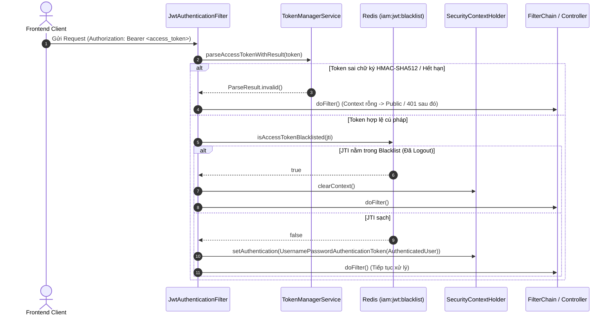
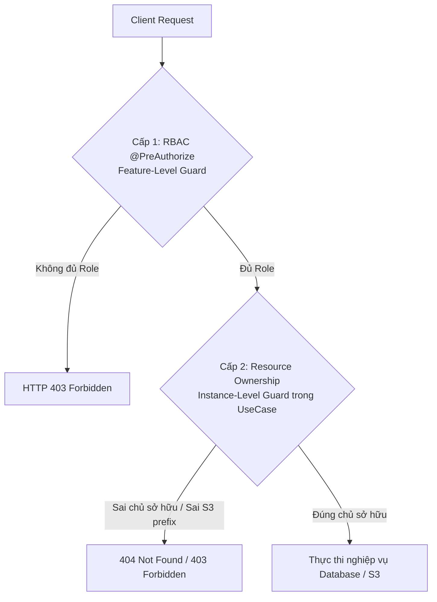

# Câu 03: Phân Tách Authentication vs Authorization, Phòng Chống Lỗ Hổng IDOR (Resource Ownership) và Cơ Chế Phân Biệt HTTP 401 vs HTTP 403

### ❓ Câu hỏi:
"Trong dự án của bạn, bạn đã phân tách và triển khai hai bài toán **Authentication (Xác thực)** và **Authorization (Phân quyền)** như thế nào? Tại sao việc chỉ phân quyền dựa trên Vai trò (**RBAC**) là chưa đủ để bảo vệ hệ thống, và bạn đã giải quyết bài toán **Phân quyền sở hữu tài nguyên (Resource Ownership)** để ngăn chặn triệt để lỗ hổng **IDOR / BOLA** ra sao? Hệ thống phân biệt rạch ròi giữa mã lỗi **HTTP 401 Unauthorized** và **HTTP 403 Forbidden** ở cả tầng Filter Chain lẫn tầng Controller Advice như thế nào?"

---

### 💡 Câu trả lời:

Trong kiến trúc bảo mật của `PWB_MiNi`, việc phân tách giữa **Authentication (Xác thực)** và **Authorization (Phân quyền)** được thực thi nghiêm ngặt theo nguyên lý **Phòng thủ đa tầng (Defense-in-Depth)** và **Đặc quyền tối thiểu (Least Privilege)**. Hệ thống không dừng lại ở mức phân quyền vai trò bề nổi (RBAC) mà áp dụng cơ chế xác thực quyền sở hữu dữ liệu cấp độ đối tượng (Instance-Level Resource Ownership) nhằm triệt tiêu hoàn toàn lỗ hổng IDOR.

---

### 1. Phân Tách Rạch Ròi: Authentication vs Authorization

| Khía Cạnh | Authentication (Xác thực) | Authorization (Phân quyền) |
| :--- | :--- | :--- |
| **Câu hỏi cốt lõi** | *"Bạn là ai?" (Who are you?)* | *"Bạn được phép làm gì trên tài nguyên này?" (What can you do?)* |
| **Nhiệm vụ** | Kiểm tra danh tính, tính hợp lệ của chữ ký số và trạng thái thu hồi của token. | Kiểm tra xem danh tính đã xác thực có đủ thẩm quyền thực hiện thao tác hay không. |
| **Vị trí thực thi** | Tầng mép Filter Chain: [`JwtAuthenticationFilter.java`](file:///d:/Learning/Project/PWB_MiNi/Backend/modules/iam/src/main/java/com/pwb/iam/infrastructure/security/JwtAuthenticationFilter.java) | Phân tầng 2 cấp: RBAC ở Controller (`@PreAuthorize`) & Ownership ở UseCase (`SongUseCaseImpl.java`). |
| **Dữ liệu đầu ra** | `AuthenticatedUser` được gắn vào `SecurityContextHolder`. | Quyết định: Cho phép thực thi (`200 OK`) hoặc ném ngoại lệ (`403 Forbidden` / `404 Not Found`). |
| **Mã lỗi khi thất bại** | **HTTP 401 Unauthorized** | **HTTP 403 Forbidden** |

---

### 2. Triển Khai Chi Tiết Tầng Authentication (Xác Thực)

Quy trình xác thực được thực hiện thông qua [`JwtAuthenticationFilter`](file:///d:/Learning/Project/PWB_MiNi/Backend/modules/iam/src/main/java/com/pwb/iam/infrastructure/security/JwtAuthenticationFilter.java) (kế thừa `OncePerRequestFilter`):



#### Chi tiết kỹ thuật đáng chú ý:
1. **Nguyên lý Fail-Safe cho Public Endpoints**:
   - Khi token bị thiếu, hết hạn hoặc sai chữ ký, filter **không ném exception ngay lập tức** mà chỉ log debug và tiếp tục gọi `chain.doFilter(request, response)`.
   - Thiết kế này đảm bảo các endpoint công khai (Public Endpoints như `/actuator/health`, Swagger docs, hoặc các API xem danh sách nhạc công khai) vẫn tiếp nhận và xử lý bình thường đối với khách vãng lai (Anonymous).
   - Nếu endpoint đó yêu cầu đăng nhập (`anyRequest().authenticated()`), bộ lọc `AuthorizationFilter` ở cuối chuỗi sẽ phát hiện `SecurityContext` rỗng và kích hoạt `RestAuthenticationEntryPoint` để trả về **HTTP 401**.
2. **Trích xuất thông tin người dùng sạch (Clean Inversion of Control)**:
   - Tầng Controller hoàn toàn không phụ thuộc vào API của Spring Security (`SecurityContextHolder`).
   - Project xây dựng custom annotation [`@CurrentUser`](file:///d:/Learning/Project/PWB_MiNi/Backend/shared/shared-web/src/main/java/com/pwb/web/security/CurrentUser.java) kết hợp [`CurrentUserArgumentResolver`](file:///d:/Learning/Project/PWB_MiNi/Backend/shared/shared-web/src/main/java/com/pwb/web/security/CurrentUserArgumentResolver.java), tự động inject trực tiếp `UUID userId` hoặc `AuthenticatedUser` vào method parameters của Controller một cách an toàn và gọn gàng.

---

### 3. Tại Sao Phân Quyền RBAC Là Chưa Đủ? Hiểm Họa IDOR & Giải Pháp Resource Ownership

#### 3.1. Điểm yếu chết người của mô hình RBAC thuần túy
Mô hình **RBAC (Role-Based Access Control)** chỉ phân loại quyền hạn dựa trên vai trò tổng quát của tài khoản (ví dụ: `ROLE_USER`, `ROLE_ADMIN`):
- Khi endpoint xóa bài hát được định nghĩa:
  ```java
  @DeleteMapping("/{songId}")
  public ResponseEntity<ApiResponse<Void>> deleteSong(@PathVariable UUID songId) { ... }
  ```
- **Kịch bản tấn công IDOR / BOLA (Insecure Direct Object References)**:
  - User A (kẻ xấu) là một tài khoản đã đăng nhập hợp lệ.
  - User B (nạn nhân) cũng là tài khoản thường và sở hữu bài hát có `songId = bbbb-bbbb`.
  - User A gửi HTTP request: `DELETE /api/v1/songs/bbbb-bbbb` kèm token của User A.
  - Chuỗi filter kiểm tra: token của User A hợp lệ $\rightarrow$ **HỢP LỆ!**
  - Nếu tầng nghiệp vụ chỉ gọi `songRepository.deleteById(songId)`, bài hát của User B sẽ bị xóa hoàn toàn bởi User A!
  - Đây là lỗ hổng đứng số 1 trong danh sách **OWASP API Security Top 10** (Broken Object Level Authorization).

#### 3.2. Kiến Trúc Phân Quyền 2 Cấp Độ (Two-Tier Authorization) Trong PWB_MiNi
Để giải quyết triệt để vấn đề này, PWB_MiNi phân tách rõ ràng trách nhiệm phân quyền thành 2 cấp độ:



1. **Cấp 1: Feature-Level Guard (RBAC tại Controller)**:
   - Dùng `@PreAuthorize("hasRole('ADMIN')")` — đặt ở cấp class trên `AdminUserController`.
   - **Mục đích**: Bảo vệ các API quản trị hệ thống. Tài khoản thường bị chặn ngay tại cửa Controller mà không tốn tài nguyên xử lý DB.
   - **Lưu ý**: các tính năng tiêu tốn tài nguyên bên Audio (tạo presigned URL upload S3, kích hoạt FFmpeg merge voice tag) từng có cấp 1 riêng là `@PreAuthorize("hasRole('PRO')")`. Gói PRO đã bị gỡ để bản demo mở hết tính năng, nên các route đó giờ chỉ còn cấp 0 (xác thực bởi chuỗi filter) và cấp 2 — chính vì vậy cấp 2 dưới đây là thứ duy nhất ngăn User A chạm vào dữ liệu của User B.
2. **Cấp 2: Instance-Level Guard (Resource Ownership tại UseCase)**:
   - Được triển khai trực tiếp trong logic nghiệp vụ của tầng Application/Domain.
   - Tuyệt đối không tin tưởng bất kỳ ID nào từ client gửi lên mà không kiểm tra đối chiếu với `userId` được trích xuất từ JWT Access Token.

#### 3.3. Hiện Thực Thực Tế Trong Mã Nguồn PWB_MiNi

##### A. Truy vấn dữ liệu có Scoped User ID (`requireOwnedSong`):
Trong [`SongUseCaseImpl.java`](file:///d:/Learning/Project/PWB_MiNi/Backend/modules/audio/src/main/java/com/pwb/audio/application/usecase/impl/SongUseCaseImpl.java#L291-L294):
```java
private Song requireOwnedSong(UUID userId, UUID songId) {
    return songRepository.findByIdAndUserId(songId, userId)
            .orElseThrow(() -> new AudioBusinessException(AudioErrorCode.SONG_NOT_FOUND));
}
```
* **Bảo vệ kép chống tấn công Oracle Attack / Data Enumeration**:
  - Khi User A cố tình truy cập `songId` của User B, UseCase không ném mã lỗi `403 FORBIDDEN` mà ném `404 SONG_NOT_FOUND`.
  - Kẻ tấn công không thể dựa vào mã HTTP status code để quét (enumerate) và biết được `songId` đó có thực sự tồn tại trong hệ thống của người khác hay không.

##### B. Xác thực quyền sở hữu S3 Staging Storage Key (`assertKeyBelongsToUser`):
Khi client hoàn tất upload lên S3 và gửi `s3Key` về backend để đăng ký bài hát trong [`SongUseCaseImpl.java`](file:///d:/Learning/Project/PWB_MiNi/Backend/modules/audio/src/main/java/com/pwb/audio/application/usecase/impl/SongUseCaseImpl.java#L400-L406):
```java
private void assertKeyBelongsToUser(UUID userId, String s3Key) {
    String expectedPrefix = STAGING_KEY_ROOT + userId + "/";
    if (s3Key == null || !s3Key.startsWith(expectedPrefix) || s3Key.contains("..")) {
        log.warn("Rejected upload with foreign or malformed storage key: userId={}, s3Key={}", userId, s3Key);
        throw new AudioBusinessException(AudioErrorCode.UNAUTHORIZED_ACCESS);
    }
}
```
* Ngăn chặn kẻ tấn công tráo đổi S3 key của người khác hoặc dùng kỹ thuật **Path Traversal** (`..`) để chiếm đoạt file âm thanh hoặc can thiệp dữ liệu ngoài phạm vi staging của chính mình. Nếu vi phạm, hệ thống ném `AudioErrorCode.UNAUTHORIZED_ACCESS` (map thành HTTP 403 Forbidden).

##### C. Kiểm tra quyền hạn trong Module LiveRoom:
- Trong [`LiveroomErrorCode.java`](file:///d:/Learning/Project/PWB_MiNi/Backend/modules/liveroom/src/main/java/com/pwb/liveroom/application/exception/LiveroomErrorCode.java):
  - `NOT_OWNER` (`LR_020`): Chỉ chủ phòng mới có quyền bật tắt nhạc hoặc kết thúc phòng live.
  - `MUSIC_NOT_OWN_SONG` (`LR_070`): Thành viên trong phòng chỉ được phép chọn phát các bài hát thuộc quyền sở hữu của chính họ.

---

### 4. Cơ Chế Phân Biệt Rạch Ròi: HTTP 401 Unauthorized vs HTTP 403 Forbidden

```mermaid
graph TD
    Client[HTTP Request] --> FilterChain[Spring Security Filter Chain]
    
    FilterChain -->|Thiếu / Hỏng / Blacklisted JWT| EntryPoint[RestAuthenticationEntryPoint]
    EntryPoint -->|ErrorResponseWriter| Resp401["HTTP 401 Unauthorized<br/>(AUTH_TOKEN_MISSING)"]
    
    FilterChain -->|Token Hợp Lệ nhưng Sai Role tại Filter| AccessDenied[RestAccessDeniedHandler]
    AccessDenied -->|ErrorResponseWriter| Resp403_1["HTTP 403 Forbidden<br/>(ACCESS_DENIED)"]
    
    FilterChain -->|Token Hợp Lệ| Dispatcher[DispatcherServlet / Controller]
    Dispatcher -->|@PreAuthorize đánh trượt| MethodSec[AccessDeniedException / AuthorizationDeniedException]
    MethodSec -->|GlobalExceptionHandler| Resp403_2["HTTP 403 Forbidden<br/>(ACCESS_DENIED)"]
    
    Dispatcher -->|UseCase vi phạm Ownership| BusinessEx[AudioBusinessException / UNAUTHORIZED_ACCESS]
    BusinessEx -->|GlobalExceptionHandler| Resp403_3["HTTP 403 Forbidden<br/>(AUDIO_012)"]
```

#### Bảng so sánh toàn diện 401 vs 403:

| Tiêu Chí | HTTP 401 Unauthorized | HTTP 403 Forbidden |
| :--- | :--- | :--- |
| **Bản chất ngữ nghĩa** | Lỗi ở tầng **Authentication (Xác thực)**: "Tôi không biết bạn là ai hoặc thông tin xác minh của bạn không hợp lệ/đã hết hạn". | Lỗi ở tầng **Authorization (Phân quyền)**: "Tôi biết rõ bạn là ai, nhưng bạn không có thẩm quyền truy cập tài nguyên này". |
| **Các kịch bản thực tế** | 1. Request không gửi kèm header `Authorization: Bearer <token>`.<br>2. Access Token bị hết hạn (Expired) hoặc sai chữ ký HMAC-SHA512.<br>3. Token đã bị người dùng Đăng xuất (JTI nằm trong Redis Blacklist `iam:jwt:blacklist:<jti>`). | 1. User thường truy cập API Admin (`@PreAuthorize("hasRole('ADMIN')")`).<br>2. Truy cập tài nguyên không thuộc sở hữu của mình (kiểm tra ownership trong UseCase).<br>3. Can thiệp S3 key của người khác hoặc tài khoản bị khóa (`ACCOUNT_INACTIVE`). |
| **Xử lý tại Filter Chain** | **[`RestAuthenticationEntryPoint.java`](file:///d:/Learning/Project/PWB_MiNi/Backend/modules/iam/src/main/java/com/pwb/iam/infrastructure/security/RestAuthenticationEntryPoint.java)**:<br>Kích hoạt khi request chưa xác thực cố truy cập endpoint yêu cầu `authenticated()`. Ghi JSON envelope với mã `IamErrorCode.AUTH_TOKEN_MISSING`. | **[`RestAccessDeniedHandler.java`](file:///d:/Learning/Project/PWB_MiNi/Backend/modules/iam/src/main/java/com/pwb/iam/infrastructure/security/RestAccessDeniedHandler.java)**:<br>Kích hoạt khi authenticated user bị từ chối bởi rule tại filter chain. Ghi JSON envelope với mã `IamErrorCode.ACCESS_DENIED`. |
| **Xử lý tại tầng Controller & UseCase** | Không xuất hiện ở Controller vì request không xác thực đã bị chặn ngay từ Filter Chain. | **[`GlobalExceptionHandler.java`](file:///d:/Learning/Project/PWB_MiNi/Backend/shared/shared-web/src/main/java/com/pwb/web/exception/GlobalExceptionHandler.java#L147-L158)**:<br>Bắt ngoại lệ `AccessDeniedException` từ `@PreAuthorize` và `BusinessException` có `ErrorCategory.FORBIDDEN` từ UseCase. |
| **Hành vi xử lý của Frontend** | **Axios Interceptor tự động Refresh Token**:<br>Frontend bắt mã 401 $\rightarrow$ Gọi ngầm `POST /api/v1/auth/refresh` bằng Refresh Token (HttpOnly Cookie) $\rightarrow$ Cấp Access Token mới $\rightarrow$ Tự động replay lại request bị lỗi.<br>Nếu refresh thất bại $\rightarrow$ Điều hướng về `/login`. | **Hiển thị thông báo quyền hạn**:<br>Frontend hiển thị Toast/Alert: *"Bạn không có quyền thực hiện thao tác này"*.<br>**TUYỆT ĐỐI KHÔNG trigger Refresh Token** vì token hoàn toàn hợp lệ, refresh cũng không thể giải quyết được quyền hạn! |

---

### 5. Hai Cạm Bẫy Kỹ Thuật Kinh Điển Khi Phỏng Vấn Senior / Tech Lead

#### Cạm bẫy 1: Sự cố "Method Security văng lỗi 500" thay vì 403
* **Hiện tượng**: Khi dùng `@PreAuthorize("hasRole('ADMIN')")` trên Controller method, nếu user vi phạm, hệ thống lại trả về mã lỗi `500 Internal Server Error` kèm stack trace thay vì `403 Forbidden`.
* **Nguyên nhân cốt lõi**:
  - `RestAccessDeniedHandler` chỉ bắt được ngoại lệ phát sinh trong **Filter Chain** (trước khi request vào `DispatcherServlet`).
  - `@PreAuthorize` được thực thi bởi Spring AOP proxy **bên trong** `DispatcherServlet`. Khi xảy ra lỗi, nó ném ra `AccessDeniedException` (hoặc `AuthorizationDeniedException` trong Spring Security 6 / Spring Boot 3).
  - Nếu `GlobalExceptionHandler` không khai báo `@ExceptionHandler(AccessDeniedException.class)`, ngoại lệ này sẽ rơi vào fallback `@ExceptionHandler(Exception.class)` và bị đóng gói thành lỗi 500!
* **Cách PWB_MiNi xử lý chuẩn mực** trong [`GlobalExceptionHandler.java`](file:///d:/Learning/Project/PWB_MiNi/Backend/shared/shared-web/src/main/java/com/pwb/web/exception/GlobalExceptionHandler.java#L147-L158):
  ```java
  @ExceptionHandler(AccessDeniedException.class)
  public ResponseEntity<ApiResponse<Void>> handleAccessDenied(AccessDeniedException ex) {
      log.debug("Access denied: {}", ex.getMessage());
      return respond(SysErrorCode.ACCESS_DENIED, null);
  }
  ```

#### Cạm bẫy 2: Xung đột WhiteLabel HTML và Chuẩn hóa JSON Envelope tại Filter
* **Vấn đề**: Các Filter bảo mật chạy bên ngoài phạm vi của Spring MVC, nên không thể dùng `@RestControllerAdvice` để format lỗi. Mặc định Spring Boot sẽ forward sang `/error` và render trang HTML WhiteLabel hoặc JSON không đúng format dự án.
* **Giải pháp**:
  - PWB_MiNi xây dựng tiện ích [`ErrorResponseWriter`](file:///d:/Learning/Project/PWB_MiNi/Backend/shared/shared-web/src/main/java/com/pwb/web/security/ErrorResponseWriter.java).
  - Tại `RestAuthenticationEntryPoint` và `RestAccessDeniedHandler`, hệ thống ghi trực tiếp JSON object chuẩn envelope `ApiResponse<Void>` xuống `HttpServletResponse.getWriter()` kèm i18n message đã được resolve qua `MessageSource`, đảm bảo trải nghiệm API đồng nhất 100% từ tầng mạng ngoài cùng tới tận tầng lõi ứng dụng.
