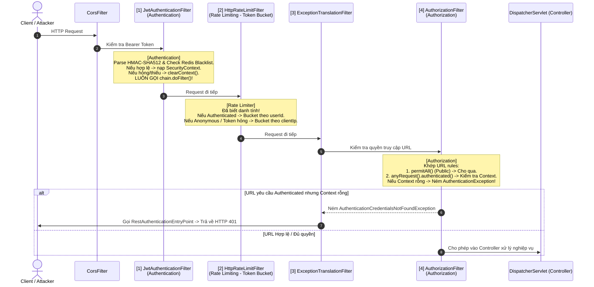

# Câu 04: Thứ Tự Thực Thi Authentication & Authorization Trong Spring Security Filter Chain Và Cơ Chế Fail-Safe Của JwtAuthenticationFilter

### ❓ Câu hỏi:
"Trong chuỗi Spring Security Filter Chain của dự án PWB_MiNi, quá trình **Authentication (Xác thực)** và **Authorization (Phân quyền)** diễn ra theo thứ tự nào? Tại sao khi `JwtAuthenticationFilter` phát hiện token hết hạn, sai chữ ký hoặc nằm trong Blacklist, bộ lọc này **không ném lỗi HTTP 401 ngay lập tức** mà lại xóa context và vẫn gọi `chain.doFilter` cho request đi tiếp?"

---

### 💡 Câu trả lời:

Trong kiến trúc bảo mật của `PWB_MiNi`, thứ tự sắp xếp các Filter trong Spring Security Filter Chain không phải là ngẫu nhiên mà được thiết kế theo một **chiến lược phòng thủ đa lớp chặt chẽ (Security Filter Topology)**.

Hành vi `JwtAuthenticationFilter` không ngắt request ngay khi phát hiện token hỏng mà vẫn gọi `chain.doFilter()` là một quyết định kiến trúc then chốt nhằm đảm bảo tính **Phân định trách nhiệm (Separation of Concerns)**, hỗ trợ **Public Endpoints (Khách vãng lai)**, và đặc biệt là **ngăn chặn kẻ tấn công vượt mặt bộ đếm Rate Limiting (Rate Limiter Bypass)**.

---

### 1. Thứ Tự Thực Thi Của Filter Chain Trong PWB_MiNi

Toàn bộ chuỗi Filter Chain được lắp ráp tại [`SecurityConfig.java`](file:///d:/Learning/Project/PWB_MiNi/Backend/modules/iam/src/main/java/com/pwb/iam/infrastructure/security/SecurityConfig.java) và được bảo vệ nghiêm ngặt bằng bài kiểm thử tích hợp [`SecurityFilterOrderTest.java`](file:///d:/Learning/Project/PWB_MiNi/Backend/bootstrap/src/test/java/com/pwb/bootstrap/security/SecurityFilterOrderTest.java):



#### Thứ tự chuẩn xác trong hệ thống:
1. **Authentication diễn ra TRƯỚC**: [`JwtAuthenticationFilter`](file:///d:/Learning/Project/PWB_MiNi/Backend/modules/iam/src/main/java/com/pwb/iam/infrastructure/security/JwtAuthenticationFilter.java) chạy ở vị trí trước `UsernamePasswordAuthenticationFilter`. Nhiệm vụ: Xác minh danh tính người gọi và nạp `AuthenticatedUser` vào `SecurityContextHolder`.
2. **Rate Limiting nằm ở GIỮA**: [`HttpRateLimitFilter`](file:///d:/Learning/Project/PWB_MiNi/Backend/shared/shared-web/src/main/java/com/pwb/web/filter/HttpRateLimitFilter.java) được cấu hình chạy ngay **SAU** `JwtAuthenticationFilter` và **TRƯỚC** `AuthorizationFilter`.
3. **Authorization diễn ra SAU CÙNG**: [`AuthorizationFilter`](file:///d:/Learning/Project/PWB_MiNi/Backend/modules/iam/src/main/java/com/pwb/iam/infrastructure/security/SecurityConfig.java#L43-L47) chạy ở cuối chuỗi Servlet Filter. Nhiệm vụ: Đối chiếu URL request với các rule (`permitAll()` hay `authenticated()`) và kiểm tra quyền hạn trong `SecurityContextHolder`.

---

### 2. Tại Sao Authentication Bắt Buộc Phải Diễn Ra Trước Authorization?

- **Về mặt logic nghiệp vụ**: Hệ thống không thể phân quyền (*"Người này được phép làm gì?"*) khi chưa biết được danh tính (*"Người này là ai?"*).
- **Về mặt cấu trúc kỹ thuật của Spring Security**:
  - `AuthorizationFilter` cần một đối tượng `Authentication` hợp lệ trong `SecurityContextHolder` chứa danh sách các quyền hạn (`GrantedAuthority`, ví dụ: `ROLE_PRO`, `ROLE_ADMIN`) để so khớp với cấu hình phân quyền.
  - Nếu Authorization chạy trước, `SecurityContextHolder` luôn luôn rỗng, dẫn đến việc mọi request đến các private endpoints đều bị coi là chưa xác thực và bị chặn đứng.

---

### 3. Tại Sao `JwtAuthenticationFilter` Không Ném 401 Ngay Mà Vẫn Gọi `chain.doFilter`?

Trong [`JwtAuthenticationFilter.java`](file:///d:/Learning/Project/PWB_MiNi/Backend/modules/iam/src/main/java/com/pwb/iam/infrastructure/security/JwtAuthenticationFilter.java#L47-L83), khi token không hợp lệ (sai signature, hết hạn, hoặc bị blacklist), code xử lý như sau:

```java
TokenManagerService.ParseResult result = tokenManager.parseAccessTokenWithResult(token);
if (result.valid()) {
    String jti = result.claims().getId();
    if (jti != null && blacklistService.isAccessTokenBlacklisted(jti)) {
        log.debug("Token is blacklisted: jti={}", jti);
        SecurityContextHolder.clearContext(); // Xóa context
    } else {
        // Nạp AuthenticatedUser vào SecurityContextHolder...
    }
} else {
    log.debug("JWT validation failed: error={}", result.error());
}
// TUYỆT ĐỐI KHÔNG throw exception hay write response 401 ở đây:
chain.doFilter(request, response); // Cho request đi tiếp!
```

Hành vi này xuất phát từ **4 nguyên do kiến trúc sống còn**:

#### Lý do 1: Nguyên tắc Phân tách Trách nhiệm (Single Responsibility Principle)
- `JwtAuthenticationFilter` là một **Authentication Filter** (Bộ lọc xác thực), nhiệm vụ duy nhất của nó là: *"Nếu request có mang theo giấy tờ hợp lệ, tôi sẽ chứng thực và ghi nhận danh tính vào `SecurityContext`. Nếu không có giấy tờ hoặc giấy tờ giả mạo/hết hạn, tôi coi người này là khách ẩn danh (Anonymous) bằng cách để `SecurityContext` rỗng"*.
- `JwtAuthenticationFilter` **không có quyền hạn và không nên quyết định** xem request này có được phép đi tiếp hay không. Quyết định cho phép hay từ chối truy cập là thẩm quyền độc quyền của tầng **Authorization** (`AuthorizationFilter`).

#### Lý do 2: Hỗ trợ Public Endpoints & Tránh Làm Hỏng Trải Nghiệm Khách Vãng Lai
- Trong hệ thống có rất nhiều endpoint công khai:
  - Endpoints nghiệp vụ: Tra cứu bài hát công khai, xem danh sách nhạc thịnh hành.
  - Endpoints hệ thống: `/actuator/health` (cho Kubernetes / AWS ALB kiểm tra sức khỏe), `/v3/api-docs/**`, Swagger UI.
  - Endpoints đăng nhập/đăng ký: `/api/v1/auth/login`, `/api/v1/auth/register`.
- **Kịch bản thực tế**:
  1. Người dùng từng đăng nhập trước đó và Access Token đã hết hạn lưu trong LocalStorage của trình duyệt. Trình duyệt hoặc frontend HTTP client có thể tự động gửi kèm header `Authorization: Bearer <expired_token>` cho mọi request, kể cả khi người dùng chỉ đang truy cập trang chủ hoặc tìm kiếm nhạc.
  2. Nếu `JwtAuthenticationFilter` ném ngay lỗi 401: **Người dùng sẽ bị chặn đứng không thể xem trang chủ hay đọc bài hát công khai**, dù những trang này hoàn toàn mở cho khách vãng lai!
  3. Tệ hơn nữa, nếu bộ giám sát sức khỏe (Prometheus hoặc Kubernetes Liveness Probe) vô tình đính kèm một header lạ hoặc token thử nghiệm hỏng, probe sẽ bị văng lỗi 401 $\rightarrow$ Kubernetes tưởng server chết và restart Pod liên tục!
- **Giải pháp**: Khi gọi `chain.doFilter()`, request mang token hỏng vẫn đi tiếp bình thường với tư cách là `Anonymous`. Khi tới `AuthorizationFilter`, vì các endpoint này được cấu hình `.permitAll()`, request vẫn được xử lý và trả về dữ liệu thành công.

#### Lý do 3: Ngăn Chặn Kẻ Tấn Công Vượt Mặt Rate Limiter (Bypass Rate Limiting)
Đây là lý do bảo mật cấp độ cao nhất được giải thích trong Javadoc của [`SecurityConfig.java`](file:///d:/Learning/Project/PWB_MiNi/Backend/modules/iam/src/main/java/com/pwb/iam/infrastructure/security/SecurityConfig.java#L53-L62):

> *"It still has to sit well before authorization, which happens at the end of the chain: a request with a missing or forged token must be counted on its way to the 401 rather than escape the limiter entirely."*

- **Vị trí chiếc bánh kẹp (The Filter Sandwich)**:
  `JwtAuthenticationFilter` $\rightarrow$ `HttpRateLimitFilter` $\rightarrow$ `AuthorizationFilter`.
- **Phân tích nguy cơ**:
  - Nếu `JwtAuthenticationFilter` ném mã lỗi 401 ngay khi gặp token sai hoặc token hết hạn, chuỗi Filter sẽ bị **ngắt ngay lập tức**! Request sẽ quay đầu trả về cho client mà **chưa hề chạm tới `HttpRateLimitFilter`**.
  - Khi đó, một kẻ tấn công DDoS có thể liên tục gửi hàng triệu request chứa token rác hoặc token giả mạo:
    - Server phải tốn CPU để parse chuỗi JWT và kiểm tra chữ ký.
    - Nhưng kẻ tấn công **hoàn toàn không bị tính quota Rate Limit**, không bao giờ bị khóa IP!
  - Bằng cách cho request đi tiếp: Kẻ tấn công sẽ đi qua `HttpRateLimitFilter`, bị trừ điểm quota trong bucket của IP đó. Khi vượt ngưỡng, IP sẽ bị chặn đứng với mã lỗi **HTTP 429 Too Many Requests**. Nếu chưa vượt ngưỡng, request mới đi tiếp tới `AuthorizationFilter` và bị từ chối bằng mã **HTTP 401**.

#### Lý do 4: Tập Trung Hóa Xử Lý Lỗi (Centralized Exception Handling)
- Nếu từng Filter tự ý ghi mã lỗi HTTP 401 trực tiếp xuống `HttpServletResponse`, việc quản lý định dạng lỗi (Error Response Format) sẽ bị phân tán, dễ dẫn đến tình trạng thiếu nhất quán hoặc rò rỉ stack trace.
- Bằng cách đẩy việc quyết định chặn lại cho `AuthorizationFilter`, khi một request không có thông tin danh tính cố truy cập endpoint yêu cầu bảo vệ (`anyRequest().authenticated()`), Spring Security sẽ ném ra `AuthenticationCredentialsNotFoundException` / `InsufficientAuthenticationException`.
- Ngoại lệ này sẽ được [`ExceptionTranslationFilter`](file:///d:/Learning/Project/PWB_MiNi/Backend/modules/iam/src/main/java/com/pwb/iam/infrastructure/security/SecurityConfig.java#L48-L51) bắt trọn và bàn giao cho [`RestAuthenticationEntryPoint`](file:///d:/Learning/Project/PWB_MiNi/Backend/modules/iam/src/main/java/com/pwb/iam/infrastructure/security/RestAuthenticationEntryPoint.java). Tại đây, tiện ích [`ErrorResponseWriter`](file:///d:/Learning/Project/PWB_MiNi/Backend/shared/shared-web/src/main/java/com/pwb/web/security/ErrorResponseWriter.java) sẽ đóng gói response 401 thành JSON chuẩn envelope `ApiResponse` đồng bộ 100% với hệ thống.

---

### 4. Bằng Chứng Kiểm Thử Độc Quyền Trong PWB_MiNi

Để đảm bảo trật tự giữa Authentication, Rate Limiting và Authorization không bao giờ bị xáo trộn khi ai đó refactor code hoặc nâng cấp phiên bản Spring Boot, dự án đã viết riêng một Integration Test chuyên biệt [`SecurityFilterOrderTest.java`](file:///d:/Learning/Project/PWB_MiNi/Backend/bootstrap/src/test/java/com/pwb/bootstrap/security/SecurityFilterOrderTest.java):

```java
@Test
@DisplayName("it runs after the JWT filter, so the principal is already resolved")
void should_run_after_authentication() {
    assertThat(indexOf(HttpRateLimitFilter.class))
            .as("running before the JWT filter would silently make every bucket per-address again")
            .isGreaterThan(indexOf(JwtAuthenticationFilter.class));
}

@Test
@DisplayName("it runs before authorization, so unauthenticated floods are still counted")
void should_run_before_authorization() {
    assertThat(indexOf(HttpRateLimitFilter.class))
            .as("running after authorization would let tokenless requests escape the limiter")
            .isLessThan(indexOf(AuthorizationFilter.class));
}
```

* **Ý nghĩa thực chiến**: Bài test này khẳng định vị thế của một kiến trúc sư hệ thống — không chỉ dựng hệ thống chạy được, mà còn tạo ra rào chắn tự động để bảo vệ các giả định bảo mật cốt lõi chống lại các lỗi tiềm ẩn (silent regressions).
