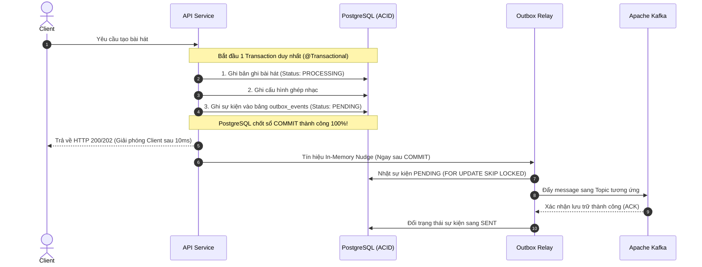

# Câu 01: Toàn Diện Về Transactional Outbox Pattern & Hạ Tầng Giao Vận Sự Kiện Apache Kafka

### ❓ Câu hỏi:
"Khi hệ thống vừa phải cập nhật cơ sở dữ liệu vừa phải phát thông điệp sang Message Broker (Kafka), bạn giải quyết bài toán **Dual-Write** bằng mẫu thiết kế **Transactional Outbox** như thế nào để bảo đảm tính nguyên tử (**Atomicity**)? Cơ chế **In-Memory Nudge** giúp triệt tiêu độ trễ Polling ra sao? Hệ thống xử lý tranh chấp khi Scale-out nhiều node (**`FOR UPDATE SKIP LOCKED`**), phục hồi khi node đột tử (**Distributed Lease 60s & Crash Recovery**), và bảo đảm thứ tự tuần tự tuyệt đối trong Kafka như thế nào?"

---

### 💡 Câu trả lời:

Trong kiến trúc hướng sự kiện (Event-Driven Architecture) của hệ thống, việc kết nối giữa Cơ sở dữ liệu quan hệ (PostgreSQL) và Message Broker (Apache Kafka) được giải quyết triệt để thông qua mẫu thiết kế **Transactional Outbox Pattern**.

Hệ thống không áp dụng cách làm Outbox ngây thơ dựa trên việc quét định kỳ (Polling) chậm chạp, mà triển khai một hạ tầng Outbox tự chủ với các cơ chế nâng cao: **In-Memory Nudge (đẩy tin tức thì trong vài mili-giây)**, **`FOR UPDATE SKIP LOCKED` (chống nghẽn khóa khi mở rộng nhiều node)**, và **Distributed Lease (tự động phục hồi khi node đột tử)**.

---

### 1. Bản Chất Bài Toán Dual-Write & Sự Thất Bại Của Các Cách Tiếp Cận Truyền Thống

Khi người dùng thực hiện một thao tác nghiệp vụ cần xử lý ngầm (ví dụ: tạo bài hát kèm yêu cầu ghép nhạc), hệ thống phải tác động vào 2 hệ sinh thái độc lập:
1. Ghi dữ liệu vào Cơ sở dữ liệu quan hệ (PostgreSQL).
2. Phát thông điệp sự kiện sang Message Broker (Kafka).

Vì hai hệ thống này nằm phân tán và không thể dùng chung một Transaction, nếu gọi trực tiếp Producer của Kafka bên trong hàm xử lý nghiệp vụ, hệ thống chắc chắn sẽ rơi vào **2 kịch bản thảm họa của bài toán Dual-Write**:

* **Kịch bản 1: "Bắn Kafka trước, Ghi Database sau"**:
  - Lệnh gửi sang Kafka thành công, tin nhắn đã nằm an toàn trên Broker.
  - Ngay sau đó, bước lưu Database bị lỗi (đứt kết nối DB, vi phạm ràng buộc dữ liệu, trùng khóa) $\rightarrow$ Database bị Rollback!
  - **Hậu quả**: Worker phía Consumer nhặt được message từ Kafka, nhảy vào Database tìm kiếm thông tin bài hát nhưng không thấy gì $\rightarrow$ Sinh ra lỗi **"Sự kiện ma" (Ghost Event)** làm crash luồng xử lý.
* **Kịch bản 2: "Ghi Database trước, Bắn Kafka sau"**:
  - Ghi bài hát vào Database thành công và chốt sổ trạng thái là "Đang xử lý".
  - Ngay trước khi bắn sang Kafka, mạng nội bộ bị ngắt quãng, Kafka Broker quá tải từ chối kết nối, hoặc máy chủ ứng dụng bị sập nguồn / tràn RAM.
  - **Hậu quả**: Database đã ghi nhận bài hát đang xử lý, nhưng Kafka không nhận được việc $\rightarrow$ Sinh ra lỗi **"Bản ghi xác sống" (Zombie Record)**, bài hát bị kẹt vĩnh viễn ở trạng thái "Đang xử lý" và không bao giờ hoàn thành.

> **Tại sao không dùng Two-Phase Commit (2PC / XA)?**  
> Kafka không hỗ trợ chuẩn XA Transactions với RDBMS. Mặt khác, 2PC giam giữ khóa cơ sở dữ liệu rất lâu, làm sụt giảm thông lượng thê thảm và tạo ra điểm nghẽn nghiêm trọng khi có sự cố mạng.

---

### 2. Cách Chúng Ta Xây Dựng & Triển Khai Transactional Outbox Pattern

Để triệt tiêu Dual-Write, nguyên tắc cốt lõi là: **Chuyển bài toán ghi phân tán thành một Single ACID Database Transaction duy nhất** trên PostgreSQL.

#### 2.1. Cấu Trúc Bảng `outbox_events`
Hệ thống thiết kế bảng lưu trữ sự kiện với các trường thông tin chặt chẽ:
- **Khóa nhận diện**: Mã định danh sự kiện (UUID), loại sự kiện (Event Type), đối tượng gốc (Aggregate Type & Aggregate ID).
- **Định tuyến giao vận**: Tên Topic Kafka, Khóa phân vùng (Payload Key - dùng làm Kafka Partition Key).
- **Nội dung sự kiện**: Dữ liệu Payload lưu dưới dạng `JSONB` nguyên bản, kèm thông tin Headers mở rộng.
- **Trạng thái & Điều phối**: Trạng thái vòng đời (`PENDING`, `PROCESSING`, `SENT`, `FAILED`), số lần thử lại (Retry Count), thời điểm thực hiện lần kế tiếp (Next Attempt At).
- **Khóa thuê phân tán**: Trường mốc thời gian hết hạn thuê (`lease_until`) dùng để chống sự cố sập node.

> **Kỹ thuật tối ưu Partial Index**:  
> Thay vì đánh chỉ mục toàn bộ bảng, hệ thống sử dụng **Partial Index (Chỉ mục bộ phận)** trong PostgreSQL: chỉ đánh index trên cột `lease_until` đối với các bản ghi có trạng thái là `PROCESSING`. Nhờ đó, chỉ mục luôn siêu nhỏ gọn và đạt tốc độ truy vấn tối đa, kể cả khi bảng Outbox tích tụ hàng triệu sự kiện đã gửi thành công (`SENT`).

#### 2.2. Đảm Bảo Tính Toàn Vẹn ACID
Khi người dùng bấm tạo bài hát:
- Thao tác lưu bài hát, lưu cấu hình và chèn sự kiện vào bảng `outbox_events` đều nằm chung trong **một kết nối cơ sở dữ liệu** và được bảo vệ bởi cùng **một Database Transaction**.
- Hệ quản trị PostgreSQL đảm bảo tính nguyên tử tuyệt đối: Hoặc tất cả cùng được ghi an toàn xuống đĩa cứng, hoặc nếu có sự cố thì tất cả cùng được rollback sạch sẽ. Không bao giờ xảy ra tình trạng lệch pha dữ liệu.

---

### 3. Cơ Chế "In-Memory Nudge" — Triệt Tiêu Hoàn Toàn Độ Trễ Polling

#### 3.1. Hạn chế của Outbox truyền thống (Polling Latency)
Mô hình Outbox cổ điển sử dụng một tiến trình hẹn giờ (Scheduler) định kỳ quét cơ sở dữ liệu mỗi 3 đến 5 giây để tìm các bản ghi mới.
- **Hạn chế**: Tạo ra một "Độ trễ chết" (Dead Latency). Người dùng bấm tạo bài hát xong, dù server hoàn toàn rảnh rỗi nhưng bài hát vẫn phải nằm im trong DB mất vài giây chờ Scheduler thức dậy mới được gửi sang Kafka, gây ức chế trải nghiệm người dùng.

#### 3.2. Giải pháp In-Memory Nudge của chúng ta
Hệ thống giải quyết bài toán độ trễ bằng kỹ thuật **Đánh thức bộ nhớ nội bộ (In-Memory Nudge)** kết hợp với việc móc nối vòng đời Transaction của framework:

1. **Móc nối sau Commit (Post-Commit Hook)**:
   - Khi bản ghi sự kiện được chèn vào bảng Outbox, hệ thống không gọi Kafka ngay (vì nếu gọi trước mà DB rollback thì sẽ sinh ra sự kiện ma).
   - Thay vào đó, hệ thống đăng ký một bộ lắng nghe sự kiện hoàn tất giao dịch (`afterCompletion`).
2. **Kích hoạt đánh thức tức thì**:
   - Đúng vào thời khắc PostgreSQL xác nhận toàn bộ dữ liệu đã được **COMMIT thành công 100% xuống đĩa**, hook này lập tức phát tín hiệu Nudge.
   - Tín hiệu này ném ngay một tác vụ vào một Thread Pool riêng biệt (`outboxPublishExecutor`) để kích hoạt tiến trình Relay nhặt bản ghi vừa commit và bắn thẳng sang Kafka.
3. **Kết quả**:
   - Độ trễ gửi tin từ lúc người dùng bấm nút đến khi Kafka nhận được message giảm từ **5 giây xuống chỉ còn 2 đến 5 mili-giây** (Zero Polling Delay)!
4. **Lưới đỡ an toàn (Safety Net)**:
   - Tiến trình Scheduler định kỳ quét mỗi 5 giây vẫn được duy trì ngầm. Nhưng nó không còn gánh tải chính, mà chỉ đóng vai trò dự phòng để nhặt các sự kiện bị sót lại trong trường hợp server gặp sự cố nghẽn thread pool hoặc khởi động lại.

---

### 4. Xử Lý Tranh Chấp Khi Scale-out Nhiều Node Bằng `FOR UPDATE SKIP LOCKED`

Trong môi trường thực tế, hệ thống chạy song song từ 3 đến 10 máy chủ (Instances). Khi có nhiều sự kiện phát sinh cùng lúc và nhiều máy chủ cùng chạy tiến trình quét Outbox:
- Nếu không có cơ chế khóa: Các máy chủ sẽ nhặt trùng cùng một sự kiện, dẫn đến việc bắn trùng lặp hàng loạt tin nhắn lên Kafka.
- Nếu dùng cơ chế khóa dòng thông thường (`FOR UPDATE`): Máy chủ B sẽ bị "đứng hình" (chờ đợi khóa của Máy chủ A giải phóng), gây nghẽn cổ chai và rất dễ dẫn đến thảm họa **Deadlock**.

#### Giải pháp của chúng ta:
Hệ thống áp dụng cơ chế khóa dòng nâng cao **`FOR UPDATE SKIP LOCKED`** trực tiếp trong câu truy vấn SQL lấy mẻ sự kiện:

1. **Nguyên lý nhảy cóc**:
   - Khi Máy chủ A thực thi truy vấn lấy một mẻ 50 sự kiện `PENDING`, nó đặt khóa trên 50 dòng này và cập nhật trạng thái sang `PROCESSING`.
   - Cùng đúng mili-giây đó, Máy chủ B thực thi truy vấn tương tự. Thay vì phải dừng lại chờ đợi Máy chủ A, hệ cơ sở dữ liệu PostgreSQL sẽ **tự động bỏ qua (nhảy cóc) 50 dòng đang bị Máy chủ A khóa** và nhặt ngay 50 dòng tiếp theo còn rảnh rỗi.
2. **Hiệu quả**:
   - Không có bất kỳ tiến trình nào phải chờ đợi nhau, triệt tiêu hoàn toàn nguy cơ Deadlock.
   - Các máy chủ tự động phân chia công việc song song hoàn hảo, thông lượng xử lý tăng tuyến tính theo số lượng máy chủ được scale-out.

---

### 5. Cơ Chế Khóa Thuê Phân Tán (Distributed Lease) & Tự Phục Hồi Sự Cố Đột Tử (Crash Recovery)

#### 5.1. Nguy cơ sự cố đột tử (Node Failure)
Giả sử Máy chủ A nhặt được 50 sự kiện và đổi trạng thái sang `PROCESSING`. Đột nhiên, Máy chủ A bị sập nguồn, tràn RAM bị hệ điều hành tiêu diệt tức thì (`SIGKILL`), hoặc mất mạng trước khi kịp gửi tin nhắn sang Kafka.
- Các sự kiện này sẽ bị **kẹt vĩnh viễn ở trạng thái `PROCESSING`** vì không máy chủ nào thèm nhặt lại các bản ghi không phải là `PENDING`. Dữ liệu của người dùng sẽ bị rơi rớt vĩnh viễn nếu không có cơ chế phát hiện.

#### 5.2. Giải pháp Khóa thuê phân tán (Distributed Lease 60s)
Chúng ta triển khai mô hình Khóa thuê có thời hạn để giải quyết triệt để sự cố này:

1. **Đóng dấu thời hạn thuê**:
   - Khi Máy chủ A nhận việc, ngoài việc đổi trạng thái sang `PROCESSING`, hệ thống bắt buộc phải đóng dấu thêm mốc thời gian hết hạn thuê: `lease_until = Thời điểm hiện tại + 60 giây`.
   - Trong điều kiện bình thường, việc gửi tin sang Kafka chỉ mất vài mili-giây, sau đó trạng thái được chuyển ngay thành `SENT`.
2. **Cơ chế tự phục hồi (Crash Recovery)**:
   - Nếu Máy chủ A bị sập giữa chừng, sau 60 giây, mốc thời gian `lease_until` sẽ trở thành quá khứ (`lease_until <= Hiện tại`).
   - Tiến trình quét định kỳ của các máy chủ còn sống có một tác vụ chuyên trách thu hồi: Tìm kiếm các sự kiện đang ở trạng thái `PROCESSING` nhưng đã quá hạn thuê (`reclaimExpiredLease`).
   - Máy chủ còn sống sẽ tự động tước lại quyền xử lý của các sự kiện này (kết hợp với `SKIP LOCKED` để không tranh chấp) và giao cho luồng khỏe mạnh gửi lại lên Kafka.
3. **Cam kết phân tán**:
   - Bảo đảm tuyệt đối nguyên lý: **At-Least-Once Delivery** — Không bao giờ làm rơi rớt sự kiện, kể cả khi máy chủ chết bất đắc kỳ tử.

---

### 6. Bảo Đảm Thứ Tự Tuần Tự Tuyệt Đối (Strict FIFO) Trong Kafka

Trong nghiệp vụ bài hát, một tài nguyên có thể phát sinh nhiều sự kiện theo dòng thời gian:
1. Sự kiện tạo bài hát lần đầu.
2. Sự kiện thử lại khi xử lý lỗi (Retry).

Trong môi trường phân tán có nhiều Worker chạy ngầm, nếu không kiểm soát thứ tự, lệnh thử lại có thể bị Worker khác nhặt và chạy trước lệnh tạo ban đầu, gây xung đột và hỏng dữ liệu.

#### Cách chúng ta xử lý:
1. **Định tuyến phân vùng có chủ đích (Partition Key Routing)**:
   - Khi lưu sự kiện vào Outbox và đẩy sang Kafka, hệ thống bắt buộc sử dụng **Message Key chính là ID của thực thể (`songId`)**.
2. **Cơ chế băm của Kafka**:
   - Kafka sử dụng thuật toán băm (MurmurHash2) trên Message Key để quyết định message đó rơi vào Partition nào của topic.
   - Vì mọi sự kiện liên quan đến cùng một bài hát đều mang chung một `songId`, chúng **100% được định tuyến rơi vào cùng một Partition duy nhất**.
3. **Bảo đảm thứ tự FIFO**:
   - Bên trong một Partition, Kafka bảo đảm cấu trúc hàng đợi tuần tự nghiêm ngặt (First-In, First-Out).
   - Một Consumer Worker duy nhất trong Consumer Group sẽ đọc tuần tự từng message theo đúng mốc thời gian phát sinh, loại bỏ hoàn toàn nguy cơ chạy lộn xộn giữa lệnh cũ và lệnh mới.

---

### 7. Vòng Đời Cập Nhật Trạng Thái & Cơ Chế Thử Lại Tự Động (Retry Backoff)

Khi tiến trình Relay đẩy thông điệp sang Kafka, toàn bộ việc xác nhận được xử lý theo cơ chế bất đồng bộ không chặn luồng (Non-blocking Asynchronous Callback):

* **Trường hợp gửi thành công**:
  - Nhận được phản hồi xác nhận (ACK) từ Kafka Broker.
  - Cập nhật trạng thái sự kiện thành `SENT`, đóng dấu thời gian gửi thành công và xóa bỏ các thông tin lỗi cũ.
* **Trường hợp gửi thất bại (Kafka Broker chập chờn / đứt mạng)**:
  - Bắt nguyên nhân lỗi chi tiết và lưu vào cột vết lỗi (`last_error`).
  - Tăng biến đếm số lần thử lại (`retry_count`).
  - Chuyển trạng thái sự kiện trở lại `PENDING`, đồng thời tính toán mốc thời gian hẹn giờ thử lại (`next_attempt_at`) theo thuật toán **lùi thời gian lũy tiến (Exponential Backoff)**.
  - Nhờ cơ chế này, hệ thống không bị nghẽn hay spam liên tục vào Kafka khi mạng có sự cố. Khi hạ tầng Kafka bình phục, các sự kiện này sẽ tự động được gửi lại một cách trơn tru mà không cần bất kỳ sự can thiệp thủ công nào của đội ngũ vận hành.
