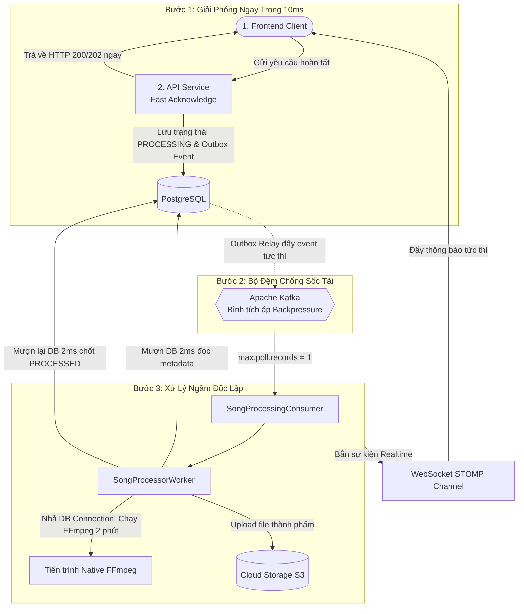

# Câu 02: Toàn Diện Về Kiến Trúc Xử Lý Bất Đồng Bộ & Vận Hành Heavy Worker Cho Tác Vụ Nặng

### ❓ Câu hỏi:
"Tại sao các tác vụ xử lý tệp nặng và tính toán CPU cao (như render âm thanh FFmpeg) bắt buộc phải xử lý bất đồng bộ? Bạn đã thiết kế luồng xử lý bất đồng bộ tổng thể từ lúc tiếp nhận request, bộ đệm thông điệp, worker xử lý ngầm cho tới phản hồi kết quả realtime như thế nào? Trong quá trình đó, bạn cấu hình Kafka Consumer ra sao để chống thảm họa **Rebalance Storm**, quản trị Database Connection Pool như thế nào để không làm sập các API Web khác, và xử lý các tình huống biên (**Idempotent**, **tệp mồ côi**, **lỗi độc lập**) ra sao?"

---

### 💡 Câu trả lời:

Trong một nền tảng âm thanh chuyên nghiệp, việc xử lý tệp đa phương tiện (tải tệp dung lượng lớn từ Cloud Storage, giải mã dữ liệu âm thanh, đo đạc năng lượng LUFS, lồng ghép voice tag và nén lại thành phẩm) là những tác vụ tiêu tốn 100% công suất CPU và ổ đĩa (CPU/IO-bound), kéo dài từ **30 giây đến vài phút**.

Để đảm bảo hệ thống web luôn phản hồi mượt mà trong vài chục mili-giây, toàn bộ quy trình này được thiết kế theo **Kiến trúc Bất đồng bộ hướng sự kiện (Event-Driven Asynchronous Architecture)** với các giải pháp bảo vệ tài nguyên máy chủ nghiêm ngặt.

---

### 1. Tại Sao Bắt Buộc Phải Xử Lý Bất Đồng Bộ? (The "Why")

Nếu xử lý tác vụ nặng theo cách đồng bộ truyền thống (Synchronous HTTP Request) — tức là Client gửi yêu cầu, Server giữ kết nối và bắt Client chờ cho đến khi render xong mới trả về kết quả — hệ thống sẽ đối mặt với **3 thảm họa vận hành chí mạng**:

1. **Lỗi HTTP 504 Gateway Timeout**:
   - Trình duyệt người dùng bị "đóng băng" (vòng xoay loading liên tục). Các cổng Gateway hoặc Reverse Proxy (như Nginx, Cloudflare, AWS ALB) thường có trần ngắt kết nối sau 60 giây. Khi tác vụ render mất 2 phút, kết nối HTTP sẽ bị Gateway ngắt giữa chừng và trả về lỗi 504, làm hỏng hoàn toàn trải nghiệm người dùng.
2. **Cạn kiệt Tomcat Thread Pool (Thread Pool Starvation)**:
   - Một Web Server (Tomcat) mặc định có khoảng 200 worker threads. Nếu mỗi tác vụ giam giữ một thread trong suốt 2-3 phút, thì **chỉ cần 50 đến 100 người dùng thực hiện thao tác cùng một lúc là toàn bộ 200 threads bị chiếm giữ 100%**.
   - Khi đó, máy chủ không còn bất kỳ luồng nào để phục vụ các yêu cầu khác: từ các API nhẹ như đăng nhập, xem danh sách nhạc cho đến việc thanh toán đều bị xếp hàng chờ (blocked) và kéo sập toàn bộ hệ thống (Cascading Failure).
3. **Áp lực bộ nhớ (Memory Churn & Out-Of-Memory)**:
   - Việc duy trì hàng chục luồng xử lý file nhị phân nặng đồng thời trong bộ nhớ RAM của ứng dụng sẽ gây áp lực khổng lồ lên bộ thu gom rác (Garbage Collection), kích hoạt các đợt "Stop-The-World" làm đơ ứng dụng hoặc gây crash tiến trình do tràn RAM (OOM).

$\rightarrow$ **Giải pháp bắt buộc**: Tách rời hoàn toàn luồng tiếp nhận Web ra khỏi luồng tính toán nặng bằng mô hình **Xử lý Bất đồng bộ (Fire-and-Forget kết hợp Event-Driven Background Worker)**.

---

### 2. Kiến Trúc Luồng Xử Lý Bất Đồng Bộ 3 Bước Khép Kín

Quy trình xử lý bất đồng bộ trong hệ thống được phân tách thành 3 bước rành mạch, bảo đảm tính độc lập tuyệt đối giữa các tầng:

#### Bước 1: Tiếp Nhận Nhanh & Giải Phóng Client Tức Thì (Fast Acknowledge)
- Khi người dùng gửi yêu cầu xử lý bài hát, API Service chỉ thực hiện các thao tác xác thực cơ bản và thực thi một giao dịch vi mô (Micro-transaction kéo dài **dưới 10 mili-giây**):
  1. Ghi nhận trạng thái bài hát trong Database là `PROCESSING`.
  2. Ghi nhận sự kiện yêu cầu xử lý vào bảng Outbox (áp dụng Transactional Outbox Pattern đã hoàn thiện để đảm bảo an toàn dữ liệu 100%).
- **Ngay lập tức trả về HTTP 200/202 cho Client**: Trình duyệt của người dùng được giải phóng trong chưa đầy 50ms. Người dùng có thể thoải mái chuyển trang, nghe bài hát khác hoặc tắt trình duyệt đi ngủ mà không cần ngồi chờ.

#### Bước 2: Bộ Đệm Sự Kiện & Chống Sốc Tải Qua Kafka (Buffering & Backpressure)
- Tín hiệu In-Memory Nudge kích hoạt tiến trình Outbox Relay đẩy sự kiện lên topic của Apache Kafka.
- Việc sử dụng Kafka ở tầng giữa đóng vai trò như một **bình tích áp (Pressure Tank / Backpressure)**: Trong giờ cao điểm khi có 10.000 bài hát được gửi lên cùng một lúc, Kafka sẽ hấp thụ và xếp hàng an toàn toàn bộ lượng công việc này, không để lượng tải khổng lồ tràn thẳng vào làm sập hệ thống tính toán.

#### Bước 3: Worker Xử Lý Ngầm Độc Lập (Isolated Heavy Worker Execution)
- Các Audio Worker (Kafka Consumer) chạy hoàn toàn độc lập trên các tiến trình nền, tách biệt hoàn toàn khỏi luồng phục vụ Web/API.
- Worker nhặt từng bài hát từ Kafka về và thực thi việc xử lý nặng trong background: tải file, chạy FFmpeg ghép nhạc, chuẩn hóa LUFS, và upload file thành phẩm lên Cloud Storage. Toàn bộ tiến trình nặng nhọc diễn ra ngầm, không gây ảnh hưởng tới bất kỳ API nào khác.

---

### 3. Kỹ Thuật Vận Hành Kafka Consumer Cho Tác Vụ Nặng — Chống Thảm Họa Rebalance Storm

#### 3.1. Thảm họa "Rebalance Storm" khi tác vụ chạy quá lâu
Khác với tác vụ gửi email hay thông báo chỉ mất vài mili-giây, việc xử lý âm thanh kéo dài từ **vài chục giây đến vài phút**. Đây là cái bẫy lớn nhất khi tích hợp Kafka:
- **Cơ chế mặc định của Kafka**:
  - Consumer định kỳ kéo tin nhắn bằng hàm `poll()`.
  - Kafka Broker kiểm soát sức khỏe của Consumer thông qua ngưỡng thời gian `max.poll.interval.ms` (mặc định là 5 phút). Nếu luồng Consumer bận chạy FFmpeg và không gọi lại `poll()` trước thời hạn này, Broker sẽ coi Worker đó **đã bị treo hoặc đột tử (Dead/Stuck)**!
- **Hậu quả dây chuyền (Rebalance Storm)**:
  - Broker lập tức đá Worker đó ra khỏi Consumer Group và kích hoạt **Rebalance** (tái phân bổ Partition) để giao Partition đó cho Worker thứ 2.
  - Worker thứ 2 nhặt đúng bài hát đó và bắt đầu render lại từ đầu. Trong khi đó, Worker thứ 1 thực ra **vẫn đang sống** và vẫn đang cày 100% CPU để xử lý bài hát đó.
  - Hai Worker cùng tranh chấp tài nguyên máy chủ cho cùng một bài hát. Khi Worker thứ 2 cũng bị quá giờ, Broker lại Rebalance sang Worker thứ 3...
  - Toàn bộ cụm Consumer bị cuốn vào vòng xoáy Rebalance liên tục (**Rebalance Storm**), gây tê liệt và sập toàn bộ hệ thống xử lý ngầm!

#### 3.2. Cấu hình chốt chặn của chúng ta
Chúng ta cấu hình hai thông số sống còn ở tầng Kafka Listener để triệt tiêu 100% nguy cơ này:
1. **Ép cứng chỉ nhận một thông điệp (`max.poll.records = 1`)**:
   - Mặc định Kafka rút 500 bản ghi mỗi lần poll. Nếu rút một lúc nhiều bài hát, Worker sẽ bị quá tải và chắc chắn vi phạm thời gian chờ.
   - Hệ thống ép cứng mỗi lần poll chỉ lấy đúng **1 bài hát duy nhất**. Toàn bộ tài nguyên CPU và đồng hồ thời gian được dành trọn vẹn cho duy nhất một tác vụ đó.
2. **Nới rộng trần thời gian (`max.poll.interval.ms = 30 phút`)**:
   - Nâng ngưỡng kiểm tra thời gian chờ của Kafka Broker lên **30 phút (1,800,000 mili-giây)**, vượt xa thời gian render tối đa của bất kỳ bài hát dài nào (kể cả các bản nhạc dài 15–20 phút).
   - **Kết quả**: Kafka Broker hoàn toàn yên tâm chờ đợi Worker hoàn thành việc render mà không bao giờ kích hoạt Rebalance nhầm.

---

### 4. Bảo Tồn Connection Pool: Tuyệt Đối KHÔNG Dùng `@Transactional` Bọc Worker

#### 4.1. Cái bẫy giam giữ kết nối Database (Connection Pool Starvation)
Một lỗi kiến trúc cực kỳ phổ biến là lập trình viên gắn annotation `@Transactional` lên toàn bộ hàm `process()` của Worker để "cho an toàn".
- Quá trình tải file từ Cloud Storage, chạy FFmpeg trên đĩa, và upload lại file thành phẩm mất từ 1 đến 3 phút.
- Nếu bọc `@Transactional`, một kết nối Database trong HikariCP Pool sẽ bị **chiếm giữ và giam lỏng suốt 3 phút đó**, dù lúc đó chỉ có CPU và ổ đĩa làm việc chứ Database hoàn toàn không làm gì!
- Khi có 10 đến 20 Worker cùng chạy, toàn bộ Database Connection Pool bị cạn kiệt sạch sẽ (**Connection Pool Starvation**). Toàn bộ hệ thống Web (đăng nhập, xem danh sách, tra cứu) sẽ bị nghẽn cứng vì không còn kết nối nào để truy vấn Database.

#### 4.2. Giải pháp: Mô hình Giao dịch Vi mô (Micro-Transactions)
Worker được thiết kế **hoàn toàn KHÔNG mang `@Transactional`**. Thay vào đó, quy trình được bẻ nhỏ thành 3 giai đoạn độc lập:

1. **Giai đoạn 1: Đọc dữ liệu nhanh**:
   - Mở một Transaction chỉ đọc kéo dài đúng **2 mili-giây** để kiểm tra trạng thái và lấy thông số bài hát, sau đó **nhả ngay kết nối trả về cho HikariCP Pool**.
2. **Giai đoạn 2: Xử lý nặng tốn thời gian**:
   - Tải file từ Cloud Storage về đĩa tạm, gọi tiến trình native FFmpeg ngoài hệ điều hành ghép nhạc, upload file thành phẩm lên Cloud Storage.
   - **Trong suốt 2–3 phút này, Worker hoàn toàn không giữ bất kỳ kết nối Database nào**!
3. **Giai đoạn 3: Chốt kết quả**:
   - Mở một Transaction cực ngắn kéo dài **2 mili-giây** để cập nhật trạng thái bài hát sang `PROCESSED`, lưu đường dẫn file thành phẩm, và nhả kết nối ngay lập tức.
- **Kết quả**: Dù hàng chục Worker có render nhạc liên tục thì Database Connection Pool vẫn luôn rảnh rỗi, các API phục vụ người dùng bên ngoài vẫn phản hồi với độ trễ cực thấp (< 20ms).

---

### 5. Xử Lý Các Tình Huống Biên Trong Hệ Phân Tán

#### 5.1. Chống xử lý trùng lặp (Idempotent Consumer)
Kafka chỉ cam kết gửi **Ít nhất một lần (At-Least-Once Delivery)**. Khi mạng nội bộ chập chờn hoặc quá trình commit offset bị chậm, việc một message bị gửi lặp lại là điều chắc chắn xảy ra trong hệ phân tán.

Chúng ta áp dụng cơ chế **Chốt chặn trạng thái 2 tầng (Two-Phase State Guard)** để bảo đảm tính Idempotent:
- **Chốt chặn đầu vào (Trước khi tốn CPU)**: Ở Giai đoạn 1, khi nạp bài hát từ Database, Worker kiểm tra: nếu bài hát không còn ở trạng thái `PROCESSING` (ví dụ: đã được Worker khác xử lý xong, hoặc đã bị người dùng hủy), Worker **lập tức bỏ qua và thoát ngay**. Không tốn 1 chu kỳ CPU nào cho việc chạy FFmpeg.
- **Chốt chặn đầu ra (Trước khi ghi đè dữ liệu)**: Ở Giai đoạn 3, sau khi render xong, hàm chốt kết quả kiểm tra lại một lần nữa: nếu bài hát đã ở trạng thái `PROCESSED`, hệ thống nhận diện đây là kết quả xử lý trùng lặp và nhẹ nhàng bỏ qua, không ghi đè dữ liệu đang hoạt động.

#### 5.2. Xử lý tình huống biên Tệp mồ côi (Orphan Detection & Disposal)
- **Kịch bản sự cố**:
  - Người dùng bấm tạo bài hát $\rightarrow$ Worker nhặt việc và bắt đầu chạy FFmpeg (dự kiến mất 45 giây).
  - Ở giây thứ 15, người dùng đổi ý bấm nút "Xóa bài hát" trên giao diện Web $\rightarrow$ API xóa đã xóa sạch bản ghi trong Database và xóa file gốc trên Cloud Storage.
  - Đến giây thứ 45, tiến trình FFmpeg của Worker hoàn tất và đẩy file thành phẩm lên Cloud Storage.
  - Lúc này, bản ghi trong Database đã biến mất từ lâu. File âm thanh thành phẩm vừa upload lên Cloud Storage không có ai trỏ tới và sẽ trở thành **"tệp rác mồ côi"** nằm vĩnh viễn trên đám mây, tiêu tốn tiền lưu trữ hàng tháng.
- **Giải pháp của chúng ta**:
  - Khi Worker hoàn tất việc ghép nhạc và gọi hàm chốt kết quả: Nếu phát hiện bản ghi bài hát **không còn tồn tại trong Database** (đã bị xóa mất trong lúc render), hàm lập tức trả về cờ cảnh báo: `orphaned = true`.
  - Ngay khi nhận được cờ này, Worker hiểu rằng đây là sản phẩm vô thừa nhận. Nó lập tức gọi lệnh dọn dẹp khẩn cấp: **phát lệnh xóa ngay lập tức tệp vừa upload lên Cloud Storage**. Kho lưu trữ luôn sạch bóng 100%!

#### 5.3. Cách ly ghi nhận lỗi bằng `Propagation.REQUIRES_NEW`
Khi tiến trình ghép nhạc bị thất bại (ví dụ: file âm thanh của người dùng bị hỏng cấu trúc giữa chừng khiến FFmpeg crash, hoặc ổ đĩa tạm bị lỗi):
- Làm thế nào để lưu lại nguyên nhân lỗi chi tiết vào Database để người dùng nhìn thấy trên giao diện (và bấm nút Thử lại), mà việc ghi lỗi này không bị rollback theo tiến trình chính?
- **Giải pháp**: Phương thức ghi nhận lỗi được thiết lập mức độ lan truyền giao dịch độc lập (**`REQUIRES_NEW`**). Nó tự động tách rời khỏi ngữ cảnh cũ, mượn một kết nối mới và thực hiện một giao dịch riêng biệt để chuyển trạng thái bài hát sang `FAILED`, đồng thời lưu nguyên văn lý do lỗi vào Database.
- Giao dịch này commit ngay lập tức. Nhờ đó, người dùng mở web lên sẽ thấy ngay thông báo lỗi và nút "Thử lại" sáng lên, trong khi hệ thống giám sát ghi nhận cảnh báo chính xác cho đội ngũ kỹ thuật.

---

### 6. Cơ Chế Phản Hồi Kết Quả Realtime Về Client (Eventual Consistency & Real-time Feedback)

Trong kiến trúc bất đồng bộ, người dùng không thể nhận kết quả ngay trong kết nối HTTP ban đầu. Vậy làm thế nào để người dùng biết bài hát đã xử lý xong mà **không cần phải bấm F5 reload trang liên tục**?

Hệ thống kết hợp mô hình **Tính nhất quán sau cùng (Eventual Consistency)** với kênh thông báo thời gian thực:
1. **Thông báo qua STOMP WebSocket**:
   - Ngay sau khi Worker cập nhật trạng thái bài hát thành `PROCESSED` thành công trong Database, hệ thống phát một thông điệp sự kiện qua kênh WebSocket cá nhân của người dùng (`/topic/songs/{userId}`).
2. **Cập nhật giao diện mượt mà (Optimistic Real-time UI)**:
   - Ứng dụng Frontend lắng nghe sự kiện qua WebSocket: Ngay khi nhận được tín hiệu hoàn tất kèm metadata của file âm thanh mới, giao diện tự động chuyển trạng thái bài hát từ "Đang xử lý" sang "Đã sẵn sàng", đồng thời tự động nạp và vẽ dạng sóng âm thanh (Waveform) ngay trước mắt người dùng.
   - Trải nghiệm của người dùng hoàn toàn liền mạch, tự động và hiện đại theo thời gian thực mà không tiêu tốn tài nguyên Polling liên tục lên server.
