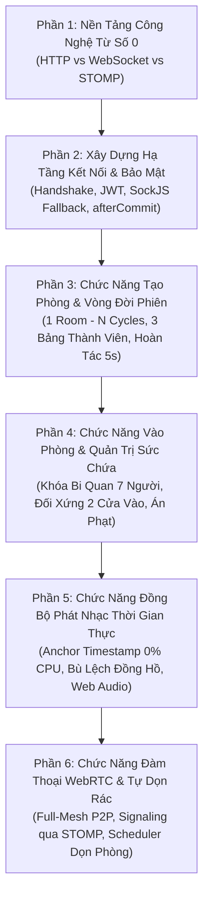

# Giai Đoạn 4: Masterclass Realtime — Module Live Room (STOMP WebSocket & WebRTC)

Chào mừng sếp đến với chương trình đào tạo và hệ thống hóa kiến thức chuyên sâu của **Giai đoạn 4**. 

Khác với các giai đoạn trước, Module Live Room là module sở hữu độ phức tạp cao nhất về hạ tầng truyền dẫn thời gian thực. Vì vậy, tài liệu của giai đoạn này được biên soạn theo hình thức **Giáo trình Giảng dạy Từng Bước (Step-by-Step Masterclass)**:
- Đi từ **bản chất công nghệ từ con số 0** (cho người chưa có kiến thức nền tảng về Socket).
- Hướng dẫn cách xây dựng **Đường ống Hạ tầng (Realtime Pipe)** kết nối giữa Trình duyệt và Máy chủ.
- Đi vào chi tiết **Cách triển khai từng chức năng thực tế** bên trong phòng nghe nhạc trực tuyến.

---

## 🗺️ Bản Đồ Lộ Trình Giảng Dạy 6 Phần Thực Chiến

---

## 📚 Danh Mục Các Bài Giảng Chi Tiết (100% Hoàn Thành)

| Phần | File Tài Liệu | Trọng Tâm Kiến Thức Giảng Dạy | Trạng Thái |
| :---: | :--- | :--- | :---: |
| **01** | [Nền Tảng Công Nghệ: HTTP vs WebSocket vs STOMP](cau-01-nen-tang-cong-nghe-http-websocket-stomp.md) | Bản chất Request-Response, sự thất bại của Polling, Full-Duplex TCP, Frame WebSocket siêu nhẹ 2 bytes, tại sao cần STOMP, giải phẫu Frame STOMP, mô hình Pub/Sub & Broker. | ✅ Đã hoàn thành |
| **02** | [Xây Dựng Hạ Tầng Kết Nối & Bảo Mật](cau-02-xay-dung-ha-tang-stomp-websocket-va-bao-mat.md) | Vượt rào cản W3C bằng xác thực JWT tại frame `CONNECT`, Dual-Registration (WebSocket + SockJS Fallback), phân quyền kênh Pub/Sub, nhất quán `afterCommit`, Client auto-refresh token & chống Thundering Herd. | ✅ Đã hoàn thành |
| **03** | [Chức Năng Tạo Phòng & Vòng Đời Phiên](cau-03-chuc-nang-tao-phong-va-vong-doi-session-cycle.md) | Tách rời `LiveRoom` vs `SessionCycle`, chuẩn hóa 3 bảng thành viên (`participants`, `join_requests`, `room_members`), đóng phòng 6 bước, cửa sổ hoàn tác 5s (`left_at == endedAt`), sinh mã `SecureRandom` & Throttle Redis. | ✅ Đã hoàn thành |
| **04** | [Chức Năng Vào Phòng & Quản Trị Sức Chứa](cau-04-chuc-nang-kiem-soat-vao-phong-va-quan-tri-suc-chua.md) | Khóa bi quan `SELECT FOR UPDATE` trần 7 người, đối xứng 2 cửa vào, bàn giao mốc phát nhạc khi gia nhập, hình phạt Deadline `kicked_cooldown_until`, giám sát chủ phòng vắng mặt 60s. | ✅ Đã hoàn thành |
| **05** | [Chức Năng Đồng Bộ Phát Nhạc Thời Gian Thực](cau-05-chuc-nang-dong-bo-phat-nhac-thoi-gian-thuc.md) | Mô hình Vị trí neo tĩnh (Anchor Timestamp Model) 0% CPU/IO, tính bù lệch đồng hồ máy tính (`serverOffsetMs`), khóa lạc quan `@Version`, thuật toán bù lệch nhịp 3 tầng Web Audio API. | ✅ Đã hoàn thành |
| **06** | [Chức Năng Đàm Thoại WebRTC & Tự Dọn Rác](cau-06-chuc-nang-dam-thoai-webrtc-full-mesh-va-tu-don-rac.md) | Mạng Full-Mesh 7 người (21 kết nối P2P), luồng Signaling mượn STOMP User Destination, STUN/TURN Ephemeral Credentials HMAC-SHA1 24h, 4 Scheduler tự dọn phòng rác & khóa đa tab chống hú mic. | ✅ Đã hoàn thành |

---

### 🎯 Kim Chỉ Nam Giảng Dạy Của Giai Đoạn 4:
1. **Dễ hiểu từ con số 0**: Dùng ẩn dụ đời thực, không dùng thuật ngữ đánh đố.
2. **Hiểu lý do tại sao (Why over What)**: Luôn giải thích *nếu không làm như thế thì hệ thống sẽ sập hoặc rò rỉ dữ liệu như thế nào*.
3. **Từ hạ tầng đến chức năng**: Xây dựng đường ống kết nối vững chắc trước, sau đó mới lắp ráp từng tính năng nghiệp vụ vào.
