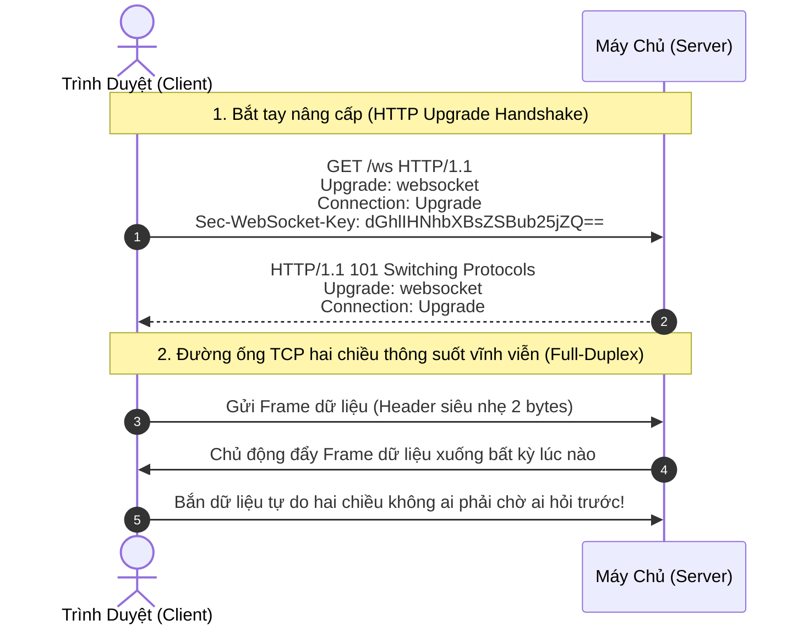
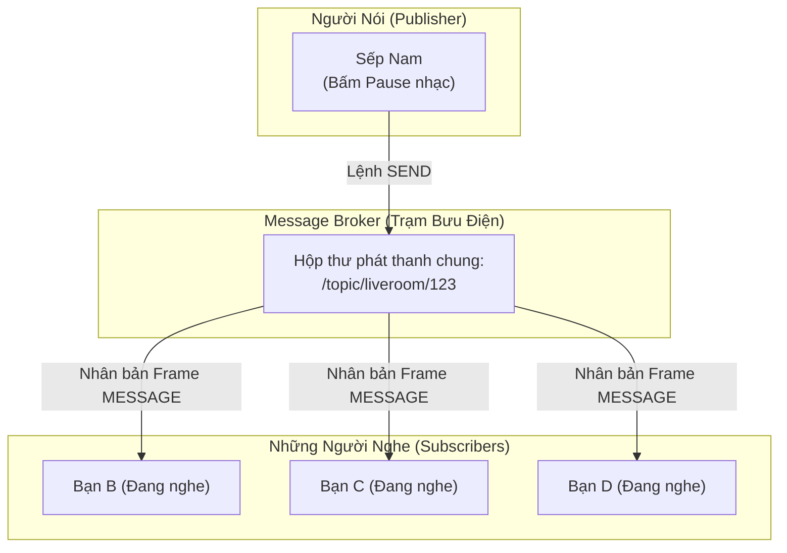

# Phần 01: Nền Tảng Công Nghệ Từ Số 0 — Toàn Diện Về HTTP, WebSocket Và Giao Thức STOMP

Tài liệu này ghi chép lại đầy đủ 100% toàn bộ bài giảng lý thuyết nền tảng từ con số 0, giúp sếp nắm chắc từng chi tiết bản chất công nghệ truyền thông thời gian thực (Realtime Communication) trước khi bước vào xây dựng hạ tầng và các chức năng của Module Live Room.

---

## 🧭 Hình Ảnh Ẩn Dụ Đời Thực Để Sếp Dễ Hình Dung Nhất

Trước khi đi vào chi tiết kỹ thuật, sếp hãy nhớ 3 hình ảnh đời thực này:

```
[HTTP]        : Gửi thư bưu điện (Hỏi một câu, nhận một câu, rồi ngắt liên lạc).
[WebSocket]   : Nhấc điện thoại gọi trực tiếp (Đường dây thông suốt 2 chiều, nhưng chỉ là tiếng "alo" thô).
[STOMP]       : Quy ước ngôn ngữ đàm thoại trên điện thoại (Chào hỏi, gửi tin cho ai, phòng nào).
```

---

## 1. Thế Giới Web Cũ: Giao Thức HTTP Hoạt Động Như Thế Nào & Tại Sao Bế Tắc?

Để thấy WebSocket vi diệu ra sao, trước hết sếp cần hiểu điểm yếu cốt tử của giao thức Web truyền thống: **HTTP (Hypertext Transfer Protocol)**.

```
Mô hình HTTP truyền thống:
[Trình Duyệt (Client)] ─── (1) Gửi Request ───► [Máy Chủ (Server)]
[Trình Duyệt (Client)] ◄─── (2) Trả Response ─── [Máy Chủ (Server)]
                       ❌ [NGẮT KẾT NỐI NGAY LẬP TỨC] ❌
```

### 1.1. Mô hình "Hỏi - Đáp" (Request - Response)
Mạng internet truyền thống hoạt động hoàn toàn theo nguyên tắc: **Client hỏi thì Server mới được phép trả lời**.
* **Bước 1**: Sếp mở trình duyệt, gõ địa chỉ trang web $\rightarrow$ Trình duyệt mở một kết nối mạng TCP lên máy chủ và gửi một **HTTP Request** (Yêu cầu).
* **Bước 2**: Server nhận được request, xử lý dữ liệu và gửi ngược lại một **Response** (Phản hồi chứa HTML, hình ảnh, JSON).
* **Bước 3**: **Ngay sau khi gửi xong Response, đường dây kết nối bị ngắt đứt hoàn toàn!** Máy chủ hoàn toàn "quên" người dùng vừa rồi là ai (đặc tính Stateless - Vô trạng thái).

---

### 1.2. Sự "Câm Lặng" Của Máy Chủ Trong Thế Giới Thời Gian Thực (Server Inability to Push)
Đặc tính lớn nhất của HTTP là **Stateless (Vô trạng thái)** và **Bất đối xứng**:
* Máy chủ **hoàn toàn thụ động**: Máy chủ không có cách nào, không có số điện thoại hay địa chỉ để tự ý "gõ cửa" máy tính của sếp khi có tin mới.

> **Tình huống thực tế trong Phòng Live Nghe Nhạc**:  
> Giả sử có 7 người cùng đang ngồi trong phòng nghe nhạc. Sếp (Chủ phòng) bấm nút **"Tua nhạc sang phút thứ 01:30"** hoặc **"Tạm dừng nhạc" (Pause)**.  
> 1. Lệnh của sếp gửi lên Server qua HTTP rất dễ dàng (vì sếp là Client chủ động gửi Request).  
> 2. **Nhưng vấn đề hóc búa xuất hiện**: Làm sao Server báo cho 6 người còn lại biết là *"Sếp Nam vừa bấm Pause/Tua nhạc đấy, máy các bạn hãy tự động dừng/tua sang phút 01:30 ngay lập tức"*?  
> 3. Với HTTP thuần túy, Server đành chịu chết, vì Server không thể tự ý đẩy dữ liệu xuống cho 6 người kia khi họ không gửi câu hỏi lên!

---

### 1.3. Những Giải Pháp "Chắp Vá" Trong Quá Khứ & Lý Do Chúng Thất Bại

Trước khi có WebSocket, các kỹ sư phần mềm đã phải dùng những cách "chữa cháy" rất khổ sở:

```
1. Short Polling (Hỏi dồn dập):
   Client: "Có nhạc mới chưa?"  -> Server: "Chưa!"
   Client: "Có nhạc mới chưa?"  -> Server: "Chưa!"
   Client: "Có nhạc mới chưa?"  -> Server: "Có rồi nè!"
   ==> Nghẽn mạng, 99% tài nguyên bị lãng phí!

2. Long Polling (Treo đường dây chờ đợi):
   Client: "Khi nào có thì trả lời nhé..." -> Server treo kết nối chờ...
   Khi có tin -> Server trả lời -> Ngắt kết nối.
   Client lại phải nhấc máy gọi cuộc mới -> Độ trễ cao, giật cục!
```

#### A. Short Polling (Hỏi liên tục mỗi giây)
* Trình duyệt cài một đồng hồ đếm giờ (Timer), cứ mỗi 1 giây tự động gửi một HTTP Request lên hỏi Server: *"Có ai chat không? Có ai tua nhạc không?"*.
* **Hậu quả thảm họa**:
  - Giả sử có 100 phòng, mỗi phòng 7 người $\rightarrow$ Mỗi giây có **$700$ request dồn dập đổ vào Server**!
  - Trong số $700$ request đó, có tới $695$ request nhận câu trả lời là: *"Không có gì mới cả"*. Máy chủ bị quá tải CPU chỉ để đi trả lời những câu hỏi vô nghĩa.
  - Mỗi request HTTP phải cõng theo một cái **HTTP Header** rất nặng (chứa Cookies, Token, User-Agent... nặng từ $1KB$ đến $2KB$). Gửi một tin nhắn chat chỉ vỏn vẹn chữ "Hi" (2 bytes) nhưng tốn tới $2.000$ bytes băng thông mạng!

#### B. Long Polling (Treo kết nối chờ tin)
* Trình duyệt gửi request lên, nếu chưa có tin gì mới, Server không trả lời ngay mà **giữ treo kết nối đó ở trạng thái chờ**. Khi nào có người chat hoặc tua nhạc, Server mới đẩy dữ liệu về và đóng kết nối. Trình duyệt nhận được dữ liệu xong lại phải lập tức bật một HTTP request khác để tiếp tục treo.
* **Hạn chế**:
  - Hàng ngàn kết nối HTTP bị treo ngâm làm cạn kiệt bộ nhớ RAM và Connection Pool của Web Server.
  - Mỗi lần có sự kiện lại phải đập đi xây lại kết nối TCP từ đầu $\rightarrow$ Độ trễ cao ($100ms - 500ms$), âm thanh nghe chung giữa các máy bị lệch nhịp, giật cục, không thể nào đạt được độ đồng bộ thời gian thực chuẩn xác đến từng mili-giây.

#### C. Server-Sent Events (SSE)
* Server có thể chủ động đẩy dữ liệu xuống Client theo 1 chiều qua kết nối HTTP mở.
* **Nhược điểm**: SSE chỉ là đường truyền **1 chiều (Half-Duplex: Server $\rightarrow$ Client)**. Khi Client muốn gửi tin nhắn chat hoặc bấm nút tua nhạc ngược lên, Client vẫn phải mở một HTTP Request độc lập khác. Nó không phải là kênh truyền hai chiều thực thụ trên cùng một kết nối, không đáp ứng được yêu cầu tương tác đàm thoại giọng nói và đồng bộ âm thanh liên tục của Live Room.

---

## 2. Cuộc Cách Mạng Mang Tên WebSocket: Mở Đường Ống 2 Chiều Vĩnh Viễn

Năm 2011, tổ chức tiêu chuẩn Internet (IETF) đã chính thức ban hành giao thức **WebSocket (RFC 6455)**, mở ra kỷ nguyên mới cho toàn bộ các ứng dụng thời gian thực trên thế giới.



### 2.1. WebSocket Là Gì?
WebSocket là một giao thức mạng cung cấp **kênh truyền thông hai chiều liên tục (Full-Duplex)** trên một kết nối TCP duy nhất:
* Sau khi kết nối được mở, nó sẽ **được giữ thông suốt 24/7** (chừng nào người dùng chưa tắt tab trình duyệt hoặc rớt mạng).
* Cả Trình duyệt và Máy chủ có **vị thế hoàn toàn bình đẳng**: Thích gửi dữ liệu cho nhau lúc nào thì gửi, không ai phải đợi ai hỏi trước.

---

### 2.2. Quá Trình "Bắt Tay Nâng Cấp" (HTTP Upgrade Handshake) Diễn Ra Như Thế Nào?
WebSocket không tự dựng lên một cổng mạng mới mà tận dụng cổng Web tiêu chuẩn (cổng 80 của HTTP hoặc cổng 443 của HTTPS) để vượt qua các thiết bị mạng và tường lửa:

1. **Bước 1 (Gửi lời chào)**: Trình duyệt gửi một request HTTP bình thường lên máy chủ, nhưng đính kèm chỉ dẫn nâng cấp đặc biệt:
   ```http
   GET /ws HTTP/1.1
   Host: pwb.mini
   Upgrade: websocket
   Connection: Upgrade
   Sec-WebSocket-Key: dGhlIHNhbXBsZSBub25jZQ==
   Sec-WebSocket-Version: 13
   ```
   *(Dịch nghĩa: "Chào Server, tôi muốn nâng cấp cuộc trò chuyện này từ HTTP bình thường lên thành đường ống WebSocket, anh có đồng ý không?")*

2. **Bước 2 (Chấp thuận nâng cấp)**: Máy chủ kiểm tra và đồng ý, trả về mã trạng thái HTTP rất đặc biệt: **`101 Switching Protocols`**:
   ```http
   HTTP/1.1 101 Switching Protocols
   Upgrade: websocket
   Connection: Upgrade
   Sec-WebSocket-Accept: s3pPLMBiTxaQ9kYGzzhZRbK+xOo=
   ```

3. **Bước 3 (Khoảnh khắc biến đổi)**: Ngay sau khi mã 101 được trao đổi thành công, **giao thức HTTP chính thức rút lui**! Kết nối mạng TCP bên dưới được giữ nguyên và chính thức biến thành **đường hầm WebSocket chuyên dụng**.

---

### 2.3. Khung Dữ Liệu WebSocket (Framing) — Nhẹ Đến Mức Nào?
* Dữ liệu chạy trên đường hầm WebSocket được đóng gói thành các **Khung dữ liệu (Frames)**.
* Phần tiêu đề (Header) của mỗi khung WebSocket chỉ nặng từ **2 đến 10 bytes** (so với $1.000 - 2.000$ bytes của HTTP).
* **Kết quả**: Khi chủ phòng bấm Pause nhạc, thông điệp bay từ Server xuống 6 người còn lại chỉ mất **vài mili-giây**, tiêu tốn băng thông gần như bằng 0 (tiết kiệm tới 99% băng thông so với HTTP Polling).

---

### 2.4. Điểm Hạn Chế Cốt Tử: Tại Sao WebSocket Thuần Lại "Chưa Đủ"?

Đây là câu hỏi quan trọng nhất mà mọi kỹ sư cần nắm rõ: *"Đã có WebSocket chạy hai chiều cực nhanh rồi, tại sao lại phải đẻ ra thêm STOMP làm gì?"*

Sếp hãy xem ví dụ thực tế này:
* WebSocket thuần giống như việc sếp kéo một **sợi dây đồng truyền tín hiệu thô** nối giữa phòng sếp và phòng nhân viên. Trên sợi dây đó, sếp có thể hét lên bất kỳ âm thanh gì: *"123"*, *"hello"*, hoặc gửi một chuỗi chữ text.
* **Các vấn đề bế tắc nếu chỉ dùng WebSocket thuần**:
  1. **Không có cấu trúc (Unstructured Data)**: WebSocket chỉ biết truyền mớ chuỗi byte hoặc chuỗi ký tự thô. Nếu Client gửi lên chuỗi `{"action": "seek", "time": 90}`, WebSocket chỉ xem đó là một đống ký tự vô nghĩa. Máy chủ nhận được thì phải tự viết code đọc từng chữ để đoán xem Client muốn gì.
  2. **Không có cơ chế định tuyến (No Routing Mechanism)**: Trong một ứng dụng có hàng trăm phòng Live, hàng ngàn người nghe nhạc. WebSocket thuần không có khái niệm "Phòng", không có khái niệm "Địa chỉ người nhận". Làm sao sếp bảo WebSocket: *"Hãy chỉ gửi thông điệp này cho những người ngồi ở Phòng 123, đừng gửi cho Phòng 456"*?
  3. **Tự chế bánh xe lịch sử (Reinventing the Wheel)**: Nếu chỉ dùng WebSocket thuần, đội ngũ lập trình viên sẽ phải tự ngồi viết tay hàng trăm quy tắc: làm sao để đăng ký kênh, làm sao để hủy kênh, làm sao để báo lỗi, làm sao để gửi tin riêng tư... Việc này vừa tốn hàng tháng trời code, vừa cực kỳ dễ phát sinh lỗi bảo mật.

👉 **Và đó chính là lý do giao thức STOMP ra đời để làm "Bộ não chỉ huy"!**

---

## 3. Giao Thức STOMP: "Bộ Não Định Dạng & Điều Phối" Chạy Trên WebSocket

### 3.1. STOMP Là Gì?
* **STOMP (Simple Text Oriented Messaging Protocol)** là một giao thức truyền thông tầng ứng dụng, được thiết kế để chạy đè lên trên các giao thức truyền dẫn hai chiều như WebSocket.
* Nếu WebSocket là **con đường cao tốc**, thì STOMP chính là **luật giao thông, biển báo và các chuyến xe thư tín chạy trên con đường đó**.
* STOMP biến những chuỗi ký tự vô định hình của WebSocket thành những **Khung thông điệp (Frames) có cấu trúc chuẩn mực quốc tế**, giúp Client và Server hiểu nhau ngay lập tức.

---

### 3.2. Giải Phẫu Một Khung Thông Điệp STOMP (STOMP Frame Anatomy)

Mỗi một khung thông điệp STOMP đều tuân thủ cấu trúc 4 phần chuẩn mực y hệt như một văn bản HTTP thu nhỏ:

```
COMMAND                     <-- 1. Lệnh thao tác (Bắt buộc viết hoa)
header1:value1              <-- 2. Các dòng Tiêu đề (Chỉ dẫn địa chỉ, token...)
header2:value2
                            <-- 3. Một dòng trống phân cách bắt buộc (\n)
{"key": "value"} ^@         <-- 4. Nội dung thực tế (Body), kết thúc bằng ký tự NULL
```

Sếp hãy xem 3 ví dụ thực tế diễn ra hàng ngày trong phòng Live Room của chúng ta:

#### Ví dụ 1: Frame đăng ký nghe kênh phòng (`SUBSCRIBE`)
Khi người dùng bước vào phòng nghe nhạc số 123, trình duyệt gửi frame này lên:
```stomp
SUBSCRIBE
id:sub-01
destination:/topic/liveroom/123

^@
```
*(Ý nghĩa: "Kính gửi Server, tôi muốn đăng ký lắng nghe mọi sự kiện diễn ra tại địa chỉ `/topic/liveroom/123`. Mã số đăng ký của tôi là `sub-01`")*

#### Ví dụ 2: Frame gửi tin nhắn chat (`SEND`)
Khi người dùng gõ tin nhắn *"Bài này hay quá!"*:
```stomp
SEND
destination:/app/liveroom/123/chat
content-type:application/json

{"message":"Bài này hay quá!"}^@
```
*(Ý nghĩa: "Kính gửi Server, tôi gửi một tin nhắn đến địa chỉ `/app/liveroom/123/chat`, nhờ Server duyệt và phát ra phòng giúp tôi")*

#### Ví dụ 3: Frame Server phát tin nhắn xuống cho cả phòng (`MESSAGE`)
Sau khi Server duyệt xong, Server gửi frame này xuống cho toàn bộ 7 người trong phòng:
```stomp
MESSAGE
subscription:sub-01
destination:/topic/liveroom/123
message-id:msg-999

{"sender":"Sếp Nam","message":"Bài này hay quá!"}^@
```

---

### 3.3. Sáu Lệnh STOMP Cốt Lõi Trong Hệ Thống Live Room

Sếp chỉ cần nhớ 6 lệnh căn bản này là nắm trọn vẹn 100% ngôn ngữ giao tiếp giữa Trình duyệt và Máy chủ:

| Lệnh STOMP | Người Gửi | Mục Đích Thực Tế Trong Phòng Live |
| :--- | :--- | :--- |
| **`CONNECT`** | Client $\rightarrow$ Server | Lệnh đầu tiên khi mở app: Xin mở phiên làm việc STOMP kèm Token JWT để xác thực danh tính. |
| **`CONNECTED`** | Server $\rightarrow$ Client | Lời chào từ Server: Xác thực hợp lệ, phiên làm việc chính thức được thiết lập. |
| **`SUBSCRIBE`** | Client $\rightarrow$ Server | Đăng ký lắng nghe một kênh (kênh phát nhạc của phòng, kênh chat, kênh thông báo lỗi). |
| **`UNSUBSCRIBE`** | Client $\rightarrow$ Server | Rời phòng: Hủy đăng ký, không nhận tin tức của kênh đó nữa. |
| **`SEND`** | Client $\rightarrow$ Server | Bắn một thao tác nghiệp vụ lên hệ thống (bấm Play, Pause, Seek nhạc, gửi tin nhắn). |
| **`MESSAGE`** | Server $\rightarrow$ Client | Đẩy dữ liệu từ Server tới những người đã đăng ký kênh. |

---

### 3.4. Mô Hình Publish / Subscribe (Pub/Sub) & Bộ Điều Phối Message Broker

Bên trong máy chủ Spring Boot của chúng ta có một bộ phận gọi là **Message Broker (Bộ điều phối tin nhắn)**. Nó hoạt động giống hệt như một **Trạm Bưu Điện Thông Minh**:



1. **Người nghe (Subscribers)**: Không cần biết ai sẽ phát biểu. Chỉ cần gửi lệnh `SUBSCRIBE` vào hộp thư `/topic/liveroom/123`.
2. **Người nói (Publisher)**: Không cần biết trong phòng đang có bao nhiêu người, tên là gì, IP ở đâu. Chỉ cần bắn một lệnh `SEND` vào hộp thư `/topic/liveroom/123`.
3. **Bộ điều phối (Broker)**: Tự động nhân bản thông điệp đó làm 7 bản và đẩy tức thì xuống từng đường ống WebSocket của tất cả những người đang đăng ký nghe.

---

## 4. Bảng So Sánh Tổng Kết Toàn Diện: HTTP vs WebSocket vs STOMP

| Tiêu Chí So Sánh | HTTP Truyền Thống | WebSocket Thuần | STOMP trên WebSocket |
| :--- | :--- | :--- | :--- |
| **Hình ảnh đời thực** | Gửi thư bưu điện (Hỏi mới trả lời) | Sợi dây đồng truyền tín hiệu thô | Quy ước ngôn ngữ nói chuyện qua điện thoại |
| **Bản chất đường truyền** | 1 chiều, đóng kết nối ngay sau khi nhận | 2 chiều liên tục (Full-Duplex TCP) | 2 chiều liên tục có cấu trúc Frame chuẩn |
| **Độ trễ phản hồi** | Rất cao ($200ms - 1.000ms$) | Cực thấp ($5ms - 20ms$) | Cực thấp ($5ms - 20ms$) |
| **Kích thước Tiêu đề** | Nặng ($1.000 - 2.000$ bytes / request) | Siêu nhẹ ($2 - 10$ bytes / frame) | Nhẹ, dạng văn bản có cấu trúc chuẩn |
| **Cơ chế phân tuyến** | Dựa trên URL (`GET /api/v1/...`) | **Không có** (Lập trình viên tự viết tay) | **Rất mạnh mẽ** qua hệ thống kênh Pub/Sub (`/topic`, `/queue`) |
| **Ứng dụng phù hợp** | Tải trang web, đọc tin tức, mua sắm | Nền tảng kết nối mạng vật lý tầng dưới | Điều khiển phòng live, chat nhóm, đồng bộ nhạc, gọi thoại |

---

### 💡 Câu Nói "Nằm Lòng" Để Sếp Ghi Nhớ Phần 1:
> **"WebSocket giúp mở toang cánh cửa hai chiều siêu tốc giữa Trình duyệt và Máy chủ; còn STOMP đóng vai trò là vị nhạc trưởng phân loại và điều phối các bản tin chat, lệnh phát nhạc đi đúng người, đúng phòng một cách trật tự và an toàn."**

---

## 🧭 Cầu Nối Sang Phần Tiếp Theo

Sau khi sếp đã nắm vững lý thuyết nền tảng về WebSocket và STOMP, câu hỏi lớn tiếp theo sẽ là:  
👉 **"Làm thế nào chúng ta dựng được 'Đường Ống Hạ Tầng' này trên máy chủ Spring Boot và Trình duyệt Next.js? Làm sao để xác thực bảo mật khi trình duyệt cấm gửi Token lúc bắt tay, làm sao để vượt tường lửa công ty và chống sập máy chủ?"**  

Đó chính là nội dung của **Phần 02: Xây Dựng Hạ Tầng STOMP WebSocket & Cơ Chế Bảo Mật Kênh Truyền**.
