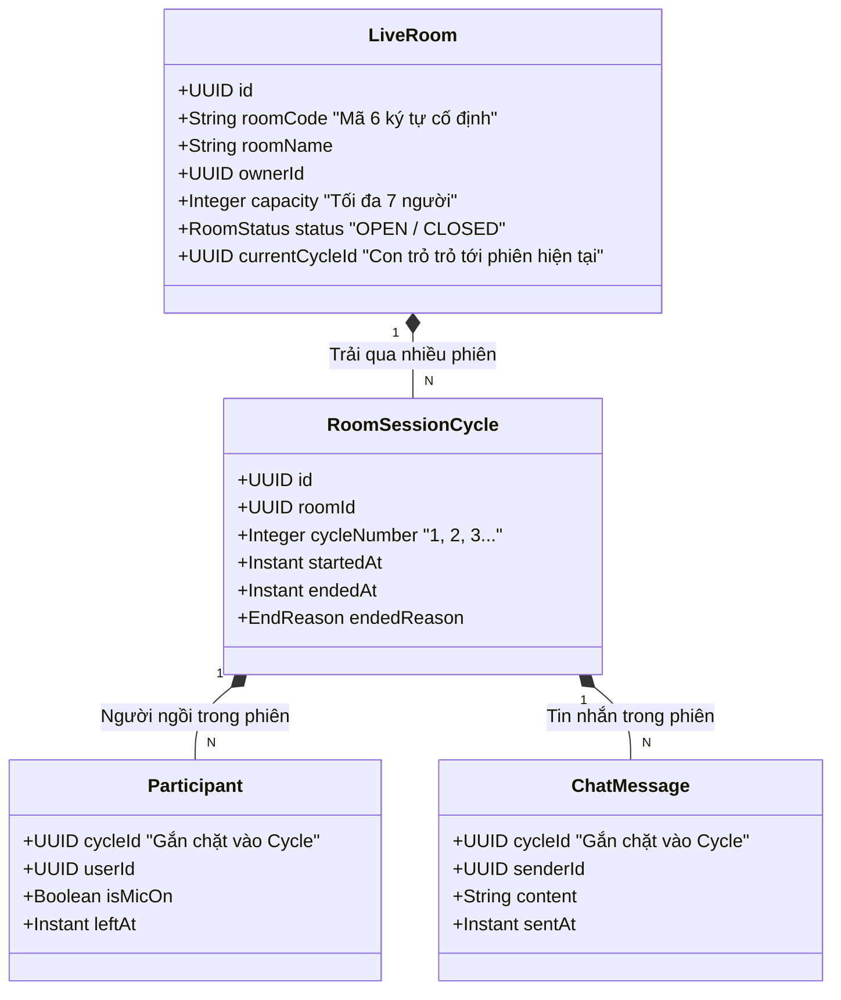
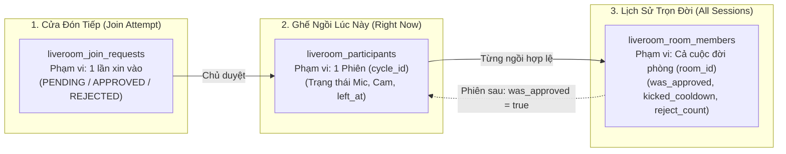
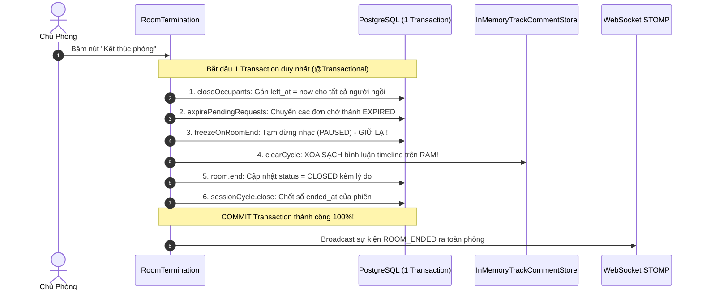
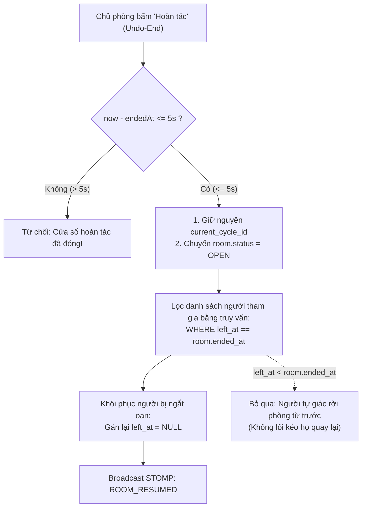
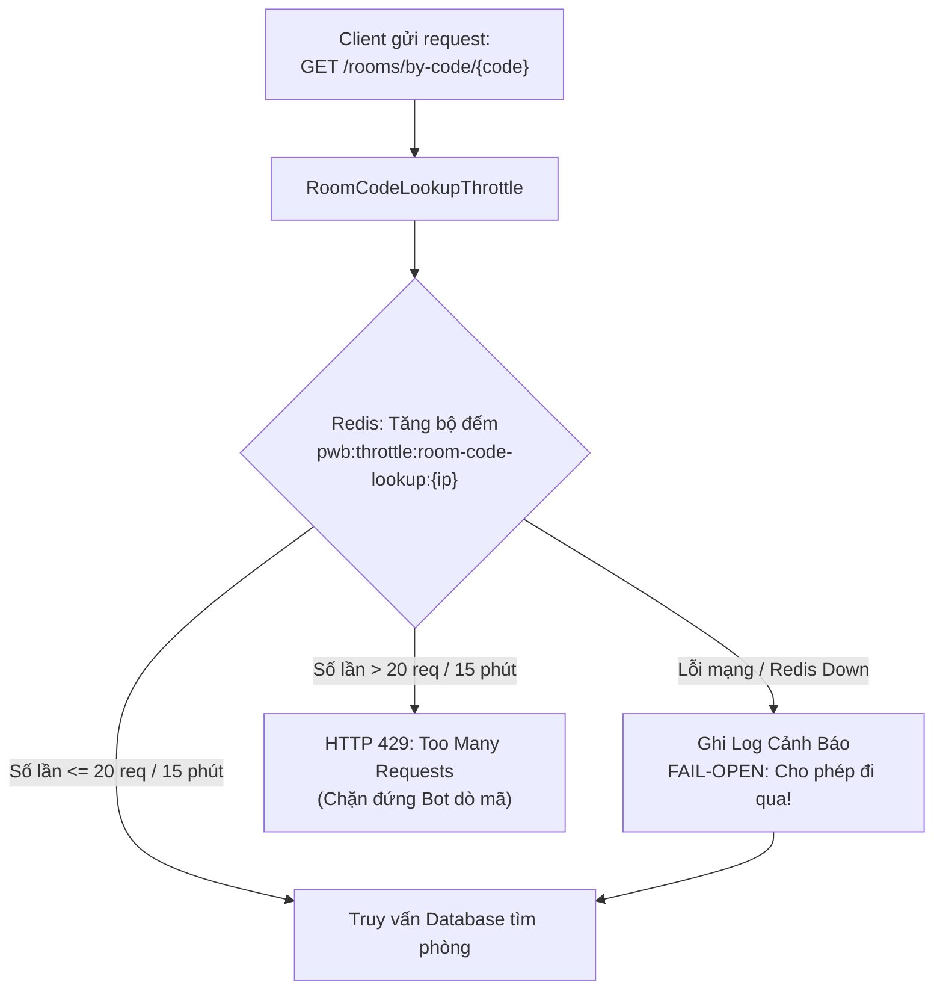

# Phần 03: Chức Năng Tạo Phòng & Quản Trị Vòng Đời Phiên (Session Cycle)

Tài liệu này ghi chép lại đầy đủ 100% toàn bộ bài giảng về **Chức năng Tạo Phòng & Quản Trị Vòng Đời Phiên (Session Cycle)** trong Module Live Room. Đây là bước đi nghiệp vụ đầu tiên sau khi hạ tầng STOMP WebSocket đã thông suốt: giải quyết bài toán dung hòa giữa sự tồn tại dài hạn của phòng và tính riêng tư ngắn hạn của từng buổi nghe nhạc.

---

## 🧭 Hình Ảnh Ẩn Dụ Đời Thực Để Sếp Dễ Hình Dung

Sếp hãy tưởng tượng ở công ty mình có một **"Phòng Họp Ban Giám Đốc" (Phòng số 301)**:
* **Căn phòng vật lý 301**: Có biển tên phòng, có sức chứa tối đa 7 ghế, có chìa khóa phòng do sếp giữ. Căn phòng này tồn tại cố định từ năm này qua năm khác.
* **Các cuộc họp diễn ra trong phòng đó**: 
  - Sáng thứ Hai: Họp chiến lược tài chính mật với các Giám đốc (từ 09:00 đến 11:00).
  - Chiều thứ Năm: Họp tiếp đón đối tác khách hàng mới (từ 14:00 đến 16:00).

👉 **Vấn đề cốt tử**: Nếu sau cuộc họp sáng thứ Hai, mọi tài liệu nhạy cảm, biên bản bàn bạc trên bảng trắng **không hề bị xóa đi**, mà cứ để nguyên lù lù trên bàn. Đến chiều thứ Năm, đối tác khách hàng bước vào phòng số 301 và đọc được toàn bộ bí mật nội bộ của sáng thứ Hai $\rightarrow$ **Đó là thảm họa rò rỉ dữ liệu!**

---

## 1. Vấn Đề Kỹ Thuật: Thảm Họa Nếu Thiết Kế Cơ Sở Dữ Liệu Theo Cách Ngây Thơ

Nếu lập trình viên thiết kế cơ sở dữ liệu theo kiểu thông thường: Gắn danh sách người tham gia (`participants`) và tin nhắn trò chuyện (`chat_messages`) trực tiếp vào khóa ngoại `room_id`, hệ thống sẽ lập tức đối mặt với **3 sự cố nghiêm trọng**:

```
Thiết kế ngây thơ (Gộp chung Room ID):
[LiveRoom (room_id = 88)]
   ├──► [participants] (userA, userB, userC...)
   └──► [chat_messages] ("Bàn chuyện mật hôm thứ 2...")
==> Khi mở lại phòng vào thứ 5: Khách mới đọc sạch chat cũ, người rớt mạng cũ chiếm chỗ ảo!
```

1. **Rò rỉ dữ liệu riêng tư (Privacy Breach)**: Tối thứ Bảy, chủ phòng mở phòng nghe nhạc và chat tâm sự riêng tư với bạn bè thân. Đến tối thứ Tư tuần sau, chủ phòng bấm "Mở lại phòng" để họp nhóm với đồng nghiệp. Toàn bộ lịch sử chat tâm sự của thứ Bảy tuần trước **vẫn hiện lù lù trên màn hình** trước mặt những người mới!
2. **Người ảo chiếm chỗ (Ghost Participants)**: Một người tham gia ở phiên trước bị mất mạng đột ngột lúc chuẩn bị đóng phòng, máy chủ chưa kịp ghi nhận bản tin rời phòng. Khi phiên mới mở ra vào tuần sau, người đó vẫn bị tính là "đang ngồi trong phòng", làm phòng bị chiếm chỗ ảo và chặn người mới vào.
3. **Mất dấu vết lịch sử & Sai lệch thống kê**: Không thể đo lường buổi nghe nhạc nào kéo dài bao lâu, có bao nhiêu người nghe đỉnh điểm, vì dữ liệu của các ngày khác nhau bị trộn lẫn thành một mớ hỗn độn dưới một `room_id`.

---

## 2. Giải Pháp Kiến Trúc Của Chúng Ta: Mô Hình "Một Phòng - Nhiều Phiên" (`1 Room - N Cycles`)

Để triệt tiêu hoàn toàn các lỗi trên, chúng ta áp dụng nguyên tắc: **Tách biệt hoàn toàn Không gian (Căn phòng) khỏi Thời gian (Phiên làm việc)**.



### 2.1. Thực Thể Dài Hạn: `LiveRoom` (Đại Diện Cho Căn Phòng)
Bảng `liveroom_rooms` chỉ lưu giữ các thông tin mang tính căn cước vĩnh viễn:
* `id` (UUID): Khóa chính cố định.
* `room_code` (Chuỗi 6 ký tự): Mã phòng định danh công khai (ví dụ: `ABC-XYZ` để chia sẻ cho bạn bè).
* `room_name`, `owner_id`: Tên phòng và định danh người sở hữu.
* `capacity`: Sức chứa tối đa (cố định là 7 người để tối ưu cho mạng WebRTC Full-Mesh).
* `status`: Trạng thái phòng (`OPEN` - Đang mở, `CLOSED` - Đang đóng).
* `current_cycle_id`: **Con trỏ chiến lược** trỏ trực tiếp tới bản ghi phiên làm việc đang diễn ra.

---

### 2.2. Thực Thể Ngắn Hạn: `RoomSessionCycle` (Đại Diện Cho Một Buổi Nghe Nhạc)
Bảng `liveroom_session_cycles` đại diện cho một buổi họp cụ thể:
* `id` (UUID): Khóa chính của phiên.
* `room_id`: Khóa ngoại trỏ về phòng cha.
* `cycle_number`: Số thứ tự của phiên (tự động tăng: $1, 2, 3...$).
* `started_at`, `ended_at`: Dấu thời gian chính xác lúc mở phòng và lúc đóng phòng.
* `ended_reason`: Lý do đóng phòng (`OWNER_CLOSED` - Chủ bấm tắt, `EMPTY_TIMEOUT` - Phòng rỗng 10 phút, `OWNER_ABSENT_TIMEOUT` - Chủ vắng mặt 60 giây).

---

### 2.3. Ràng Buộc Khóa Ngoại Tuyệt Đối Vào `cycle_id`
* Toàn bộ dữ liệu phát sinh theo thời gian thực: Danh sách người tham gia (`liveroom_participants`) và tin nhắn chat (`liveroom_chat_messages`) **bắt buộc phải gắn khóa ngoại vào `cycle_id`**, tuyệt đối cấm gắn vào `room_id`.
* **Dòng chảy nghiệp vụ khi chủ phòng bấm "Mở lại phòng" (Reopen Room)**:
  1. Hệ thống tìm bản ghi `LiveRoom` theo mã phòng.
  2. Hệ thống **không tái sử dụng phiên cũ**, mà tự động tạo ra một bản ghi `RoomSessionCycle` mới tinh với `cycle_number = số_cũ + 1`.
  3. Cập nhật `current_cycle_id` của phòng sang ID mới, chuyển trạng thái phòng sang `OPEN`.
  4. **Kết quả mỹ mãn**:
     - Mã phòng vẫn là mã cũ thân thuộc, bạn bè không cần xin lại mã mới.
     - Khách bước vào phòng được đón chào bằng **một trang giấy trắng tinh khiết 100%**: Danh sách người ngồi trống trơn, khung chat sạch sẽ, không bị lẫn bất kỳ thông tin nào của các buổi trước!
     - Lịch sử của các buổi trước vẫn nằm an toàn trong cơ sở dữ liệu để phục vụ việc tra cứu nhật ký khi cần.

---

## 3. Phân Cấp 3 Bảng Quản Lý Thành Viên: Nghệ Thuật Tối Ưu Hiệu Năng & Trải Nghiệm

Để quản lý người dùng vừa có tính kỷ luật cao, vừa mang lại trải nghiệm mượt mà, hệ thống phân chia thành **3 bảng dữ liệu độc lập tương ứng với 3 phạm vi thời gian khác nhau**:



### 3.1. Bảng 1: `liveroom_participants` — Phạm Vi Một Phiên (`cycle_id`)
* **Nhiệm vụ**: Trả lời câu hỏi: *"Ngay lúc này, ai đang thực sự ngồi trong phòng?"*.
* **Đặc điểm**:
  - Gắn chặt vào `cycle_id`.
  - Lưu trữ trạng thái mic, camera thời gian thực: `is_mic_on`, `is_camera_on`.
  - Cột `left_at` (dấu thời gian rời phòng): Khi một người chủ động rời phòng hoặc bị kick, hệ thống không xóa dòng (`DELETE`) mà chỉ đóng dấu `left_at = now()`. Nhờ đó, hệ thống luôn biết ai đang ngồi (`left_at IS NULL`) và ai đã từng tham gia buổi họp đó.

---

### 3.2. Bảng 2: `liveroom_join_requests` — Phạm Vi Một Lần Xin Vào
* **Nhiệm vụ**: Trả lời câu hỏi: *"Người lạ này xin vào phòng đã được chủ duyệt hay bị từ chối?"*.
* **Đặc điểm**:
  - Quản lý vòng đời của một lần bấm chuông xin vào: `PENDING` (chờ duyệt), `APPROVED` (đã duyệt), `REJECTED` (bị từ chối), `EXPIRED` (hết hạn).
  - Bản ghi này mang tính dùng một lần (Single-use), giúp chủ phòng nhìn thấy danh sách những người đang chờ ở cửa.

---

### 3.3. Bảng 3: `liveroom_room_members` — Phạm Vi Trọn Đời Của Phòng (`room_id`)
* **Nhiệm vụ**: Trả lời câu hỏi: *"Trong toàn bộ lịch sử của phòng này, mối quan hệ giữa người này và phòng là gì?"*.
* **Đặc điểm cấu tạo**:
  - Sử dụng khóa chính phức hợp: `(room_id, user_id)`.
  - Đây là bảng quan trọng nhất để giải quyết 2 bài toán lớn về Trải nghiệm (UX) và An ninh (Security):

| Trường Dữ Liệu | Mục Đích Nghiệp Vụ & Giải Pháp Kỹ Thuật |
| :--- | :--- |
| **`was_approved = true`** | **Tối ưu trải nghiệm (VIP Bypass)**: Khi một người bạn đã từng được chủ phòng duyệt vào phòng ở phiên số 1, cờ này được bật `true`. Ở các phiên số 2, 3, 4 về sau, người này **được phép đi thẳng vào phòng qua cửa trước mà không cần bắt chủ phòng phải bấm nút duyệt lại**! |
| **`kicked_cooldown_until`** | **Án phạt có thời hạn (Anti-Troll Cooldown)**: Khi một kẻ quậy phá bị chủ phòng Kick, hệ thống gán mốc thời gian hết án phạt: `kicked_cooldown_until = now() + 5 phút`. Trong suốt 5 phút này, kẻ đó bị chặn đứng ngay từ vòng gửi xe, không thể bấm F5 xin vào lại phòng để quấy rối tiếp. |
| **`reject_count_by_owner`** | **Chống spam bấm chuông**: Đếm số lần bị chủ phòng từ chối. Nếu bị từ chối liên tiếp quá ngưỡng, hệ thống sẽ tạm khóa quyền gửi yêu cầu để tránh làm phiền chủ phòng. |
| **`reject_count_by_capacity`** | Ghi nhận số lần bị từ chối tự động do phòng đầy chỗ (7 người), phân biệt với việc bị chủ phòng cố tình từ chối. |

> **Tại sao lại gộp 4 thông tin trên vào 1 bảng `room_members` duy nhất?**  
> Bốn thông tin trên có thể tách thành 4 bảng con. Nhưng chúng ta lựa chọn gộp chung vào bảng `liveroom_room_members` vì **toàn bộ 4 thông tin này luôn được đọc đồng thời bởi đúng một bước kiểm tra duy nhất ngay tại cửa vào phòng**.  
> Việc gộp bảng giúp câu lệnh kiểm tra tư cách thành viên chỉ tốn **đúng 1 phép SELECT duy nhất theo cặp `(room_id, user_id)`**, triệt tiêu hoàn toàn các phép JOIN bảng đắt đỏ, giúp tốc độ phản hồi tại cửa vào đạt dưới 2 mili-giây!

---

## 4. Thủ Tục Đóng Phòng 6 Bước Nguyên Tử & Cửa Sổ Hoàn Tác 5 Giây

Đóng một phòng họp thời gian thực không đơn giản là đổi một cột `status = 'CLOSED'` trong cơ sở dữ liệu. Nó đòi hỏi một quy trình dọn dẹp nguyên khối để không để lại tài nguyên rác.



### 4.1. Thủ Tục Đóng Phòng 6 Bước Nguyên Khối (`RoomTermination.terminate`)
Toàn bộ 6 thao tác sau được thực thi gói gọn bên trong một Database Transaction duy nhất (`@Transactional`):
1. **`closeOccupants(cycleId, at)`**: Đóng phiên của toàn bộ người đang ngồi trong phòng bằng cách gán `left_at = at` cho tất cả các bản ghi có `left_at IS NULL`.
2. **`expirePendingRequests(roomId, at)`**: Quét sạch toàn bộ các yêu cầu xin vào phòng đang treo ở trạng thái `PENDING` và chuyển thành `EXPIRED`, giải phóng màn hình chờ của khách lạ.
3. **`playbacks.freezeOnRoomEnd(room, at)`**: **Đóng băng bài nhạc đang phát sang trạng thái TẠM DỪNG (`PAUSED`) — Tuyệt đối KHÔNG XÓA**.
4. **`trackCommentStore.clearCycle(cycleId)`**: **XÓA SẠCH HOÀN TOÀN các bình luận ghim trên timeline nhạc**.
5. **`room.end(reason, at)`**: Đánh dấu phòng kết thúc (`status = CLOSED`), ghi nhận lý do cụ thể (`OWNER_CLOSED`, `EMPTY_TIMEOUT`, `OWNER_ABSENT_TIMEOUT`).
6. **`sessionCycleStarter.close(cycle, at)`**: Cập nhật dấu thời gian `ended_at` cho phiên làm việc hiện tại.

---

### 4.2. Giải Mã Nghịch Lý Kiến Trúc: Tại Sao Bước 3 Và Bước 4 Lại Xử Lý Ngược Nhau?

* **Tại sao Nhạc KHÔNG XÓA mà chỉ TẠM DỪNG (`PAUSED`)?**:
  - Nếu xóa sạch bản ghi phát nhạc khi đóng phòng, hệ thống sẽ tự tay triệt tiêu khả năng "Hoàn tác" (Undo).
  - Khi chủ phòng lỡ tay bấm nhầm nút đóng phòng rồi bấm "Hoàn tác" ngay sau đó, nếu nhạc bị xóa, phòng sẽ hồi sinh trong tình trạng mất tích bài hát đang nghe dở, gây đứt gãy trải nghiệm nghiêm trọng.
  - Do đó, việc đóng băng nhạc ở vị trí giây hiện tại giúp phòng luôn sẵn sàng hồi sinh nguyên trạng nếu có lệnh hoàn tác.
* **Tại sao Bình luận Timeline lại XÓA SẠCH HOÀN TOÀN?**:
  - Tính năng bình luận theo từng giây của bài hát (SoundCloud-style comments) được lưu trữ trực tiếp trên bộ nhớ đệm RAM (`InMemoryTrackCommentStore`) để đạt tốc độ đọc/ghi cực nhanh theo mili-giây.
  - Bộ nhớ RAM là tài nguyên hữu hạn và đắt đỏ. Nếu phòng đã đóng mà không dọn dẹp các bình luận này, máy chủ sẽ bị hiện tượng **Rò rỉ bộ nhớ (Memory Leak)** khi có hàng ngàn phòng mở ra và đóng lại mỗi ngày. Do đó, việc dọn dẹp RAM là yêu cầu bắt buộc vì sự an toàn của toàn bộ hạ tầng.

---

### 4.3. Cửa Sổ Hoàn Tác 5 Giây (Undo Window) & Kỹ Thuật So Khớp Dấu Thời Gian

Trên thiết bị di động, tai nạn bấm nhầm nút "Kết thúc phòng" (Fat-Finger Problem) xảy ra rất thường xuyên. Hệ thống cung cấp một **Cửa sổ hoàn tác vàng 5 giây (`undoEndWindow = 5s`)**.



#### Vì sao lại là 5 giây mà không phải 1 phút hay 5 phút?
* 5 giây là khoảng thời gian vừa đủ cho một phản xạ giật mình khi nhận ra mình bấm nhầm.
* Nếu kéo dài cửa sổ này (ví dụ 1 hay 2 phút), người tham gia trong phòng lúc đó đã đóng tab trình duyệt, tháo tai nghe hoặc chuyển sang ứng dụng khác. Nếu đột ngột kéo họ vào phòng lại và phát nhạc ầm ĩ sẽ gây phiền hà và vi phạm quyền riêng tư của người dùng.

#### Thuật toán lọc người thông minh: Phân biệt "Người bị ngắt oan" vs "Người tự giác rời phòng"
Khi hồi sinh phòng, một thách thức xuất hiện: **Làm sao để kéo đúng những người vừa bị hệ thống đá ra do phòng đóng quay trở lại, mà tuyệt đối không lôi kéo những người đã chủ động bấm nút "Rời phòng" từ 10 phút trước đó?**

Chúng ta giải quyết bằng một thuật toán so khớp mốc thời gian cực kỳ thanh lịch:
1. Khi thủ tục đóng phòng diễn ra ở bước trên, toàn bộ những người đang ngồi trong phòng đều bị đóng dấu `left_at` bằng đúng chính xác mốc thời gian `endedAt` của phòng (`left_at = endedAt`).
2. Những người tự giác rời phòng trước đó đều có mốc `left_at` nhỏ hơn thời điểm phòng đóng (`left_at < endedAt`).
3. Khi use case `UndoEndRoom` được kích hoạt, hệ thống chỉ chạy một câu lệnh lọc:
   `WHERE cycle_id = :currentCycleId AND left_at = :roomEndedAt`
4. Hệ thống gán lại `left_at = NULL` cho đúng tập hợp người này, khôi phục lại sĩ số phòng và phát sự kiện `ROOM_RESUMED` qua WebSocket. Những người đã tự rời phòng từ trước hoàn toàn không bị ảnh hưởng.

---

## 5. Sinh Mã Phòng An Toàn Mật Mã Học & Bộ Điều Tiết Throttle Trên Redis

Mã phòng (Room Code) gồm 6 ký tự (ví dụ: `A8K9XP`) được thiết kế để người dùng dễ đọc, dễ nhớ và chia sẻ nhanh. Tuy nhiên, độ dài 6 ký tự đồng nghĩa với không gian tổ hợp hữu hạn, mở ra nguy cơ bị tấn công dò quét mã (**Brute-Force Attack**).



### 5.1. Bộ Sinh Mã An Toàn Mật Mã Học (`SecureRandom`)
* **Lý do cấm dùng `Math.random()` hoặc `java.util.Random`**:
  - Các hàm ngẫu nhiên thông thường hoạt động dựa trên thuật toán LCG (Linear Congruential Generator). Nếu kẻ tấn công thu thập được một vài mã phòng liên tiếp, chúng có thể tính toán ngược lại hạt giống ngẫu nhiên (Seed) và đoán trước chính xác 100% các mã phòng sẽ được sinh ra tiếp theo trong tương lai!
* **Giải pháp của chúng ta**:
  - Sử dụng `java.security.SecureRandom`.
  - Bộ sinh số này lấy nguồn entropy ngẫu nhiên thực tế từ môi trường vật lý (nhiệt độ CPU, tiếng ồn ngắt phần cứng của hệ điều hành), đảm bảo mã phòng sinh ra có tính ngẫu nhiên tuyệt đối và không thể đảo ngược thuật toán (Non-deterministic).
  - Kết hợp cơ chế thử lại tự động tối đa 5 lần nếu phát hiện mã trùng lặp trong cơ sở dữ liệu (`Collision Retry`).

---

### 5.2. Bộ Điều Tiết Chống Dò Mã Chuyên Biệt Trên Redis (`RoomCodeLookupThrottle`)
Để bảo vệ các phòng nghe nhạc riêng tư không bị kẻ xấu dùng tool quét tự động, hệ thống dựng một chốt chặn chuyên biệt tại API tra cứu mã phòng:
* **Ngưỡng giới hạn**: Tối đa **20 lần tra cứu trong vòng 15 phút cho mỗi địa chỉ IP**.
* **Key lưu trữ trên Redis**: `pwb:throttle:room-code-lookup:{clientIp}` đi kèm thời gian sống TTL tự hủy là 15 phút.
* **Tại sao không dùng chung Rate Limit của toàn hệ thống?**:
  - Rate Limit toàn cục của API Gateway thường tính theo cửa sổ ngắn (ví dụ: 100 request/phút). Kẻ tấn công có thể rải đều 90 request/phút để dò quét mà không bao giờ kích hoạt cảnh báo toàn cục.
  - Áp dụng một cửa sổ dài 15 phút riêng biệt giúp bóp nghẹt hoàn toàn các công cụ quét tự động mà không làm ảnh hưởng đến các thao tác bình thường khác của người dùng.

---

### 5.3. Triết Lý Fail-Open vs Fail-Closed: Sự Đánh Đổi Giữa Bảo Mật Và Tính Khả Dụng

> *"Nếu cụm Redis bị sập đột ngột, bộ điều tiết Throttle tra cứu mã phòng sẽ xử lý thế nào?"*

* **Câu trả lời của chúng ta là: Chọn cơ chế FAIL-OPEN (Cho phép đi qua)**:
  - Nếu lệnh gọi sang Redis bị timeout hoặc ném Exception, bộ filter sẽ ghi log cảnh báo (`WARN`) và **cho phép request tra cứu phòng tiếp tục đi xuống Database**.
* **So sánh đối nghịch với Module IAM (Xác thực người dùng)**:
  - Ở Module IAM, khi kiểm tra Blacklist Token hoặc Brute-Force Password, nếu Redis sập, hệ thống chọn **Fail-Closed (Chặn lại ngay)** vì thà từ chối phục vụ còn hơn để lộ mật khẩu hoặc cho phép token bị thu hồi đột nhập vào hệ thống.
  - Ngược lại, tại Module Live Room, tính năng tra cứu phòng mang tính trải nghiệm người dùng cao. Mã phòng dù có dò trúng thì khi bước vào phòng vẫn còn hàng rào bảo vệ số 2 (Chủ phòng phải bấm duyệt nếu là phòng riêng tư). Do đó, chúng ta **ưu tiên tính sẵn sàng của sản phẩm (High Availability) hơn sự đa nghi thái quá**, tránh làm tê liệt toàn bộ ứng dụng chỉ vì Redis gặp sự cố tạm thời.

---

## 6. Tổng Kết Bảng So Sánh Các Thực Thể Vòng Đời Phòng

| Tiêu Chí So Sánh | `LiveRoom` (Phòng) | `RoomSessionCycle` (Phiên) |
| :--- | :--- | :--- |
| **Bản chất** | Thực thể Không gian dài hạn | Thực thể Thời gian ngắn hạn |
| **Vòng đời** | Tồn tại bền vững (vài tháng/năm) | Tồn tại tạm thời (vài chục phút/giờ) |
| **Dữ liệu sở hữu** | Mã phòng, Chủ phòng, Sức chứa, Trạng thái | Người ngồi nghe, Chat, Bài hát, Bình luận timeline |
| **Khi mở lại phòng** | Giữ nguyên ID và Room Code | Luôn sinh ra Cycle mới tinh (`cycleNumber++`) |

| Bảng Thành Viên | Phạm Vi | Mục Đích Cốt Lõi |
| :--- | :--- | :--- |
| `liveroom_participants` | Theo 1 Phiên (`cycle_id`) | Quản lý người đang ngồi lúc này, mic, cam, mốc `left_at` |
| `liveroom_join_requests` | Theo 1 Lần xin (`cycle_id`) | Quản lý trạng thái bấm chuông xin vào (`PENDING`, `APPROVED`...) |
| `liveroom_room_members` | Theo Trọn đời phòng (`room_id`) | Lưu `was_approved` (vào thẳng), `kicked_cooldown_until` (phạt 5 phút) |

---

## 🧭 Cầu Nối Sang Phần Tiếp Theo

Sau khi căn phòng đã được tạo và vòng đời phiên đã được quản lý an toàn, câu hỏi tiếp theo xuất hiện ngay tại cửa vào phòng:  
👉 **"Làm thế nào để đảm bảo phòng không bao giờ bị quá tải 7 người khi có hàng chục người cùng ùa vào 1 lúc (Race Condition)? Cơ chế 2 cửa vào (Cửa trước cho khách quen vs Cửa sau cho khách lạ xin duyệt) hoạt động ra sao? Và nếu chủ phòng đột ngột rớt mạng đi ra ngoài thì hệ thống xử lý như thế nào?"**  

Đó chính là nội dung của **Phần 04: Chức Năng Kiểm Soát Vào Phòng, Quản Trị Sức Chứa & Xử Lý Sự Cố (Admission & Moderation)**.
