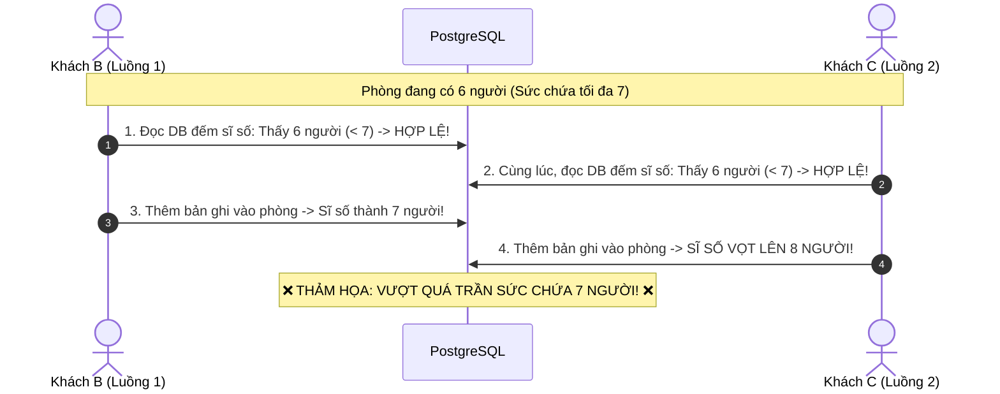
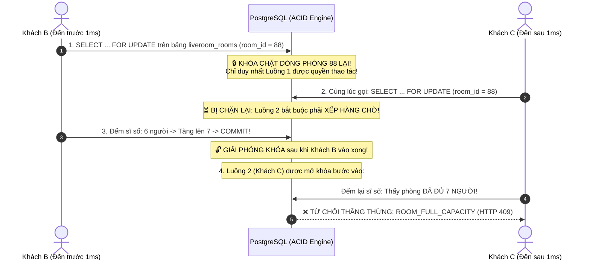
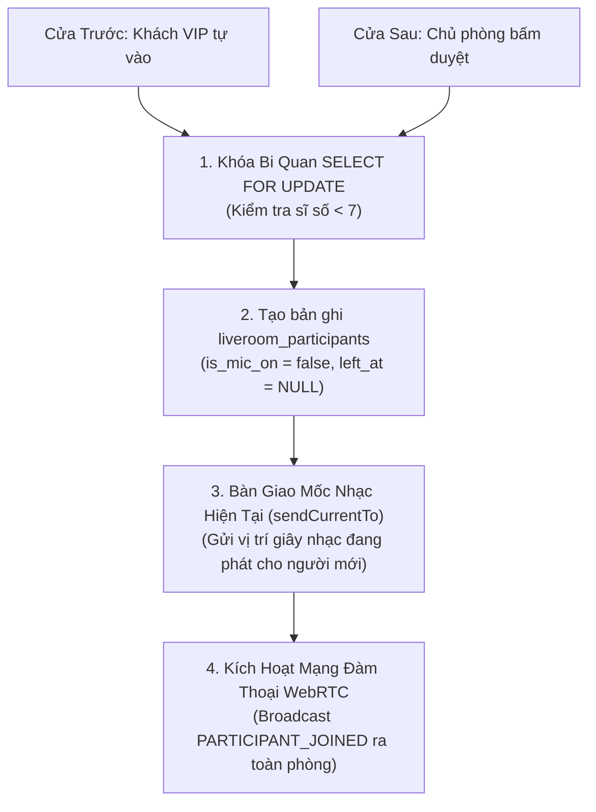
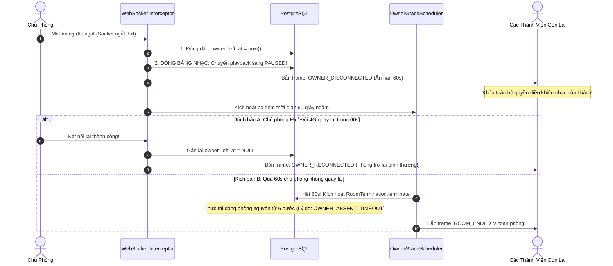

# Phần 04: Chức Năng Kiểm Soát Vào Phòng, Quản Trị Sức Chứa & Xử Lý Sự Cố (Admission & Moderation)

Tài liệu này ghi chép lại đầy đủ 100% toàn bộ bài giảng về **Chức Năng Kiểm Soát Vào Phòng, Quản Trị Sức Chứa & Xử Lý Sự Cố (Admission & Moderation)** trong Module Live Room. Đây là chốt chặn an ninh tối quan trọng: bảo vệ căn phòng không bao giờ bị vỡ trận sức chứa 7 người, duy trì trật tự kỷ luật và tự động xử lý khi chủ phòng bị rớt mạng.

---

## 🧭 Hình Ảnh Ẩn Dụ Đời Thực Để Sếp Dễ Hình Dung

Sếp hãy tưởng tượng một **Bàn tiệc VIP tại một câu lạc bộ âm nhạc cao cấp**:
* Bàn tiệc này được thiết kế vòng tròn đặc biệt chỉ có **đúng 7 chiếc ghế** (tương ứng 7 người tham gia để chất lượng âm thanh đàm thoại trực tiếp WebRTC đạt độ nét tối đa, không bị méo tiếng hay nghẽn mạng).
* Bàn tiệc đang có **6 người ngồi, chỉ còn đúng 1 chiếc ghế trống duy nhất!**
* Đột nhiên, có **2 vị khách (Anh B và Anh C) cùng lúc lao tới cửa phòng trong cùng một phần triệu giây**. Cả hai đều muốn giành chiếc ghế cuối cùng đó.

👉 **Vấn đề sống còn**: Nếu bảo vệ ở cửa làm việc lơ là, không có quy trình chốt chặn nghiêm ngặt, cả 2 anh cùng lách qua cửa và ngồi chen chúc vào $\rightarrow$ Bàn tiệc thành 8 người, mạng đàm thoại bị vỡ trận, tiếng nói bị rè và giật cục!

---

## 1. Bài Toán Race Condition Vượt Trần 7 Người & Giải Pháp Khóa Bi Quan (`SELECT FOR UPDATE`)

### 1.1. Thảm Họa Nếu Kiểm Tra Sức Chứa Theo Cách Thông Thường (Check-Then-Act)

Nếu lập trình viên viết code ngây thơ theo kiểu thông thường:
```
Bước 1: Đọc DB đếm sĩ số: SELECT COUNT(*) FROM participants WHERE left_at IS NULL;
Bước 2: Nếu sĩ số < 7 thì: INSERT INTO participants (...);
```

💥 **Kịch bản sập trần sức chứa (Race Condition)**:



Vì cả 2 luồng xử lý cùng đọc cơ sở dữ liệu ở cùng một thời điểm, cả 2 đều thấy phòng còn 1 chỗ trống, và cả 2 đều tự cho phép mình bước vào. Kết quả là phòng bị **vọt lên 8 người**, phá vỡ giới hạn chịu tải của mạng WebRTC!

---

### 1.2. Giải Pháp Của Chúng Ta: Khóa Bi Quan Tầng Cơ Sở Dữ Liệu (`SELECT ... FOR UPDATE`)

Để triệt tiêu hoàn toàn hiện tượng tranh chấp đồng thời (Race Condition), chúng ta áp dụng cơ chế **Khóa bi quan (Pessimistic Locking)** ngay tại thực thể phòng `LiveRoom`:



* **Nguyên lý hoạt động**:
  1. Ngay khi có bất kỳ ai chạm vào cửa phòng (dù là khách tự vào hay chủ phòng bấm duyệt), câu lệnh đầu tiên trong Transaction là:  
     `SELECT * FROM liveroom_rooms WHERE id = :roomId FOR UPDATE;`
  2. Câu lệnh này yêu cầu PostgreSQL **khóa chặt dòng dữ liệu của căn phòng đó lại**. 
  3. Mọi yêu cầu khác muốn vào phòng đều bị máy chủ cơ sở dữ liệu bắt buộc phải **đứng xếp hàng chờ** cho đến khi người trước hoàn tất.
  4. Người đến sau khi được mở khóa bước vào, đọc lại sĩ số thì thấy phòng đã tròn 7 người $\rightarrow$ Hệ thống ném ngoại lệ `RoomFullCapacityException` và từ chối ngay lập tức!
  5. **Kết quả**: Trần 7 người được bảo vệ vững chắc tuyệt đối 100%, không bao giờ có người thứ 8 lọt vào được.

---

## 2. Tính Đối Xứng Của Hai Cửa Vào (Symmetry of Two Admission Doors)

Trong phòng Live Room của chúng ta, người dùng bước vào phòng qua **2 cánh cửa khác nhau**:

```
[CÁNH CỬA 1: CỬA TRƯỚC (Direct Join)]
Dành cho: Chủ phòng HOẶC Khách quen đã từng được duyệt (was_approved = true).
Khách gọi API: POST /rooms/{id}/join -> Đi thẳng vào phòng!

[CÁNH CỬA 2: CỬA SAU (Knock Door & Owner Approval)]
Dành cho: Khách lạ chưa từng được duyệt.
Bước 1: Khách bấm chuông: POST /rooms/{id}/requests (Tạo JoinRequest: PENDING)
Bước 2: Chủ phòng duyệt:  POST /rooms/{id}/requests/{reqId}/approve -> Khách vào phòng!
```

### 2.1. Tính Đối Xứng Hoàn Hảo (Symmetry) Về Mặt Kỹ Thuật
Dù người dùng bước vào bằng **Cửa trước** hay **Cửa sau**, quy trình kỹ thuật phía sau đều bắt buộc phải kích hoạt **4 bước đối xứng giống hệt nhau**:



1. **Đều phải qua chốt khóa bi quan `SELECT FOR UPDATE`**: Dù là sếp duyệt hay khách quen tự vào, đều phải xếp hàng kiểm tra trần 7 người.
2. **Đều tạo bản ghi trong `liveroom_participants`**: Ghi nhận người đó chính thức ngồi vào ghế của phiên hiện tại.
3. **Bàn giao mốc nhạc thời gian thực (`sendCurrentTo`)**:
   - Đây là chi tiết cực kỳ tinh tế: Khi một người vừa bước vào phòng, làm sao máy của họ biết bài nhạc đang chạy đến giây thứ bao nhiêu để phát theo mọi người?
   - Ngay tại thời điểm vào phòng thành công, hệ thống gửi riêng cho người đó một gói tin STOMP chứa: *Mã bài hát, Trạng thái phát (PLAYING hay PAUSED), và Vị trí neo thời gian*. Trình duyệt của người mới nhận được là tự động tua và bật loa phát khớp từng mili-giây với mọi người trong phòng ngay tức thì, không bị câm lặng!
4. **Kích hoạt mạng thoại WebRTC**:
   - Hệ thống phát sự kiện STOMP `PARTICIPANT_JOINED` ra toàn bộ phòng.
   - Các máy tính của những người đang ngồi trong phòng nhận được tin này sẽ lập tức kích hoạt luồng bắt tay WebRTC (Signaling) để kết nối âm thanh giọng nói với người mới.

---

## 3. Quản Trị Kỷ Luật Bằng Mốc Thời Gian Deadline (Deadline Timestamps over Boolean Flags)

Trong một phòng cộng tác âm thanh, việc xử phạt các hành vi gây rối (nói tục, bật nhạc ồn ào phá đám) là tính năng bắt buộc của Chủ phòng:
* **Kick**: Đuổi ra khỏi phòng.
* **Mute Mic**: Khóa micro không cho phát biểu.

---

### 3.1. Thất Bại Của Cách Làm Truyền Thống Dùng Cờ Boolean
Nếu lập trình viên dùng các cờ boolean đơn giản như: `is_kicked = true` hoặc `is_muted = true`:
* **Vấn đề 1**: Làm sao để hết hạn phạt? Phải viết một tiến trình ngầm (Cronjob) chạy liên tục mỗi phút để đi quét cơ sở dữ liệu tìm ai bị phạt quá 5 phút để gỡ cờ $\rightarrow$ Cực kỳ tốn CPU và I/O đĩa từ, độ trễ không chuẩn xác.
* **Vấn đề 2**: Kẻ xấu chỉ cần bấm F5 tải lại trang là cờ boolean ở phía Client có nguy cơ bị reset, lại tiếp tục bật mic phá phách.

---

### 3.2. Giải Pháp Của Chúng Ta: Quản Trị Bằng Mốc Thời Gian Deadline
Hệ thống của chúng ta nói KHÔNG với các cờ boolean tạm bợ. Mọi hình phạt đều được ấn định bằng **Mốc thời gian Deadline tự động hết hạn**:

```
1. Hình phạt Đuổi khỏi phòng (Kick):
   Gán vào bảng room_members: kicked_cooldown_until = now() + 5 phút

2. Hình phạt Khóa Micro (Mute):
   Gán vào bảng participants: mic_unmute_cooldown_until = now() + 30 giây
```

#### Ưu điểm vượt trội của Mốc Thời Gian Deadline:
1. **Hoàn toàn tự động hết hạn, không tốn 1 dòng Cronjob**:
   - Khi kẻ bị kick cố tình bấm xin vào lại phòng, hệ thống chỉ chạy một phép so sánh đơn giản:
     $$\text{Thời gian hiện tại} < \text{kicked\_cooldown\_until}$$
   - Nếu còn trong hạn phạt: Từ chối thẳng thừng!
   - Khi đã qua 5 phút: Án phạt tự động biến mất một cách tự nhiên mà không cần bất kỳ tác vụ quét dọn nào chạy ngầm.
2. **Chống lươn lẹo tuyệt đối**:
   - Kẻ xấu có bấm F5, xóa cookie, đóng tab mở lại hay đổi trình duyệt thì mốc thời gian `kicked_cooldown_until` vẫn nằm trơ trơ trong Database PostgreSQL. Không có cách nào vượt ngục được trước khi hết 5 phút!

---

## 4. Xử Lý Sự Cố Chủ Phòng Vắng Mặt (Owner Absence & Grace Period 60s)

Trong phòng Live Room, **Chủ phòng (Owner) là linh hồn của căn phòng**: là người chọn bài hát, tua nhạc, duyệt khách và đuổi người xấu.

> **Một bài toán hóc búa được đặt ra**:  
> Nếu chủ phòng đang nghe nhạc mà nhà bị mất điện, rớt mạng Wifi, hoặc máy tính bị sập nguồn đột ngột thì sao?  
> - Nếu lập tức đóng phòng ngay: Quá bất tiện cho chủ phòng (nếu họ chỉ vừa lỡ tay vấp dây mạng, cắm lại là vào được).  
> - Nếu để phòng chạy tự do mãi mãi: Những người còn lại sẽ bị kẹt trong một căn phòng "vô chủ", kẻ xấu có thể nhảy vào chiếm quyền điều khiển bài hát.

---

### 4.1. Quy Trình Xử Lý 3 Bước Cực Kỳ Tinh Tế Của Chúng Ta



#### Bước 1: Kích hoạt Thời gian ân hạn 60 giây (`ownerGraceSeconds = 60s`)
* Khi phát hiện kết nối WebSocket của chủ phòng bị đứt, hệ thống **không đóng phòng ngay**.
* Hệ thống đóng dấu thời điểm chủ rời đi: `owner_left_at = now()`, mở ra một "cửa sổ ân hạn" kéo dài đúng **60 giây**.
* 60 giây là thời gian vàng đủ để người dùng bật 4G trên điện thoại hoặc cắm lại dây mạng vào máy tính.

#### Bước 2: Đóng băng âm thanh & Khóa quyền điều khiển (Anti-Hijack)
* Trong suốt 60 giây chủ phòng vắng mặt, bài hát đang phát lập tức được tự động chuyển sang trạng thái **TẠM DỪNG (`PAUSED`)**.
* Hệ thống **khóa chặt toàn bộ quyền bật nhạc, tua nhạc của tất cả các thành viên còn lại**.
* **Ý nghĩa**: Ngăn chặn kẻ xấu thừa nước đục thả câu, chiếm quyền làm chủ phòng âm nhạc của người khác.

#### Bước 3: Thu hồi phòng tự động (`OwnerGraceScheduler`)
* Một bộ lập lịch ngầm (`OwnerGraceScheduler`) theo dõi các phòng có chủ đang vắng mặt.
* **Nếu trong vòng 60 giây chủ phòng quay lại**: Hệ thống xóa dấu `owner_left_at = NULL`, phát thông báo chủ phòng đã trở lại, âm nhạc sẵn sàng tiếp tục.
* **Nếu quá 60 giây mà chủ phòng không xuất hiện**: Scheduler sẽ thay mặt chủ phòng kích hoạt thủ tục đóng phòng nguyên khối 6 bước với lý do: `OWNER_ABSENT_TIMEOUT`, giải tỏa toàn bộ tài nguyên để tránh làm tốn dung lượng máy chủ!

---

## 5. Tổng Kết Các Quy Tắc Thép Trong Quản Trị Phòng Live

| Tính Năng | Thách Thức Nghiệp Vụ | Giải Pháp Kiến Trúc Của PWB_MiNi |
| :--- | :--- | :--- |
| **Sức chứa trần 7 người** | Nhiều người cùng vào 1 lúc gây Race Condition vượt quá 7 | **Khóa bi quan `SELECT FOR UPDATE`** trên `liveroom_rooms`, bắt các luồng xếp hàng tuần tự. |
| **Bàn giao trạng thái** | Người mới vào không biết nhạc đang chạy đến giây nào | Hàm **`sendCurrentTo`** bắn riêng gói tin vị trí neo nhạc ngay tại thời điểm vào phòng thành công. |
| **Xử phạt vi phạm** | Bị kick/mute xong bấm F5 vào lại quấy rối tiếp | Quản trị bằng **Mốc thời gian Deadline** (`kicked_cooldown_until`), tự hết hạn không cần Cronjob. |
| **Chủ phòng rớt mạng** | Phòng bị kẹt vô chủ hoặc bị chiếm quyền điều khiển | **Thời gian ân hạn 60s**, đóng băng nhạc sang `PAUSED`, sau 60s tự hủy phòng qua `OwnerGraceScheduler`. |

---

## 🧭 Cầu Nối Sang Phần Tiếp Theo

Bây giờ mọi người đã ngồi ngay ngắn trong phòng, sức chứa được kiểm soát an toàn và trật tự được giữ vững.

Câu hỏi trung tâm và hấp dẫn nhất của toàn bộ dự án Live Room xuất hiện:  
👉 **"Làm thế nào để 7 người ngồi ở 7 nơi khác nhau, dùng 7 chiếc máy tính với cấu hình và mạng khác nhau, lại có thể cùng nghe một bài hát khớp từng nốt nhạc, từng mili-giây mà không bị máy chủ quá tải CPU? Mô hình Vị trí neo tĩnh (Anchor Timestamp) là gì? Và thuật toán bù lệch nhịp 3 tầng phía Trình duyệt hoạt động ra sao?"**  

Đó chính là nội dung đỉnh cao của **Phần 05: Chức Năng Đồng Bộ Phát Nhạc Thời Gian Thực (Realtime Audio Playback Sync)**.
