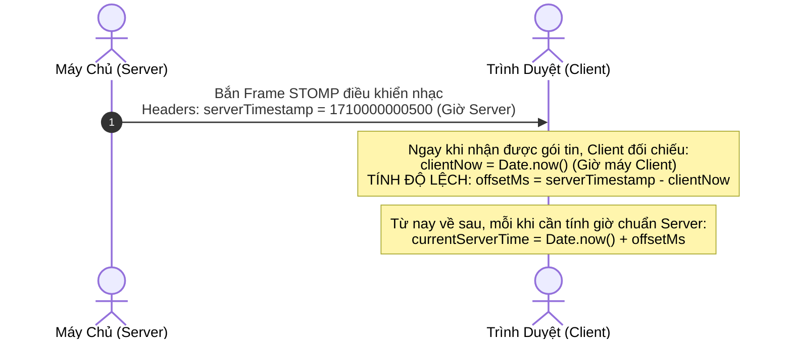
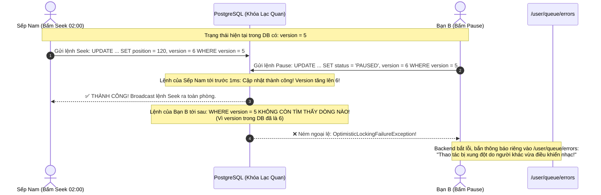
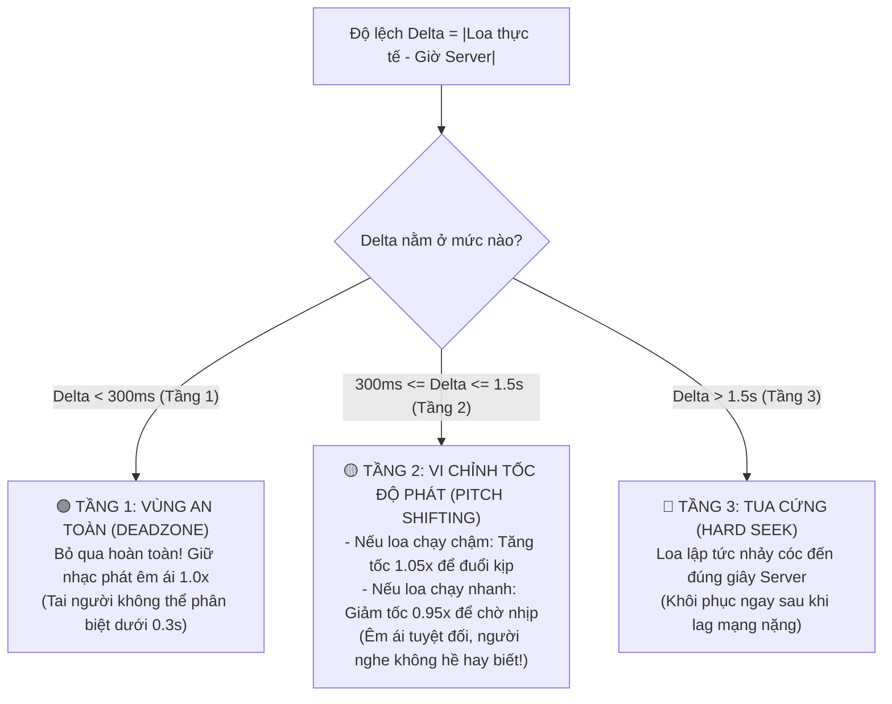

# Phần 05: Chức Năng Đồng Bộ Phát Nhạc Thời Gian Thực (Realtime Audio Playback Sync)

Tài liệu này ghi chép lại đầy đủ 100% toàn bộ bài giảng về **Chức Năng Đồng Bộ Phát Nhạc Thời Gian Thực (Realtime Audio Playback Sync)** trong Module Live Room. Đây là tính năng đỉnh cao và mang lại giá trị trải nghiệm cốt lõi nhất của dự án: làm sao để 7 người ngồi ở 7 nơi khác nhau, dùng các thiết bị và đường truyền mạng khác nhau, lại có thể cùng nghe một bài hát khớp từng nốt nhạc, từng mili-giây mà máy chủ hoàn toàn không bị quá tải.

---

## 🧭 Hình Ảnh Ẩn Dụ Đời Thực Để Sếp Dễ Hình Dung

Sếp hãy tưởng tượng một **Dàn hợp xướng gồm 7 nhạc công cùng hòa tấu một bản nhạc**:
* Nếu mỗi nhạc công tự đếm nhịp bằng chiếc đồng hồ đeo tay riêng của mình: Người thì đồng hồ chạy nhanh 1 giây, người thì đồng hồ chạy chậm 2 giây $\rightarrow$ **Âm thanh phát ra sẽ biến thành một nồi lẩu hỗn loạn, tiếng đàn và tiếng trống đánh đè lên nhau không thể nghe nổi!**
* Để bản hòa tấu hoàn hảo, cả 7 nhạc công bắt buộc phải nhìn theo **chiếc gậy chỉ huy của Vị Nhạc Trưởng (Server)** để gõ đúng từng phách nhạc.

Trong thế giới web, bài toán còn khắc nghiệt hơn gấp bội: 7 người dùng máy tính Mac, Windows, điện thoại Android; người dùng mạng Wifi cáp quang, người dùng 4G giật lag; đồng hồ máy tính của từng người bị lệch nhau từ vài giây đến cả phút.

---

## 1. Cách Làm Ngây Thơ & Lý Do Dẫn Đến Thảm Họa Sập Máy Chủ

Nếu một lập trình viên mới vào nghề nhận đề bài: *"Hãy làm tính năng nghe nhạc cùng nhau"*, bạn ấy thường sẽ chọn cách làm sau:

```
Ý tưởng ngây thơ (Vòng lặp Server Tick):
Máy chủ cài một Timer cứ 1 giây chạy 1 lần:
  1. Cập nhật Database: UPDATE playback SET position = position + 1;
  2. Bắn STOMP xuống toàn phòng: "Bây giờ là giây thứ 31 nè!"
  3. Bắn STOMP xuống toàn phòng: "Bây giờ là giây thứ 32 nè!"
```

💥 **Hậu quả thảm họa ngay lập tức**:
1. **Quá tải CPU và đĩa từ (Database Bottleneck)**:
   - Giả sử hệ thống có $1.000$ phòng đang nghe nhạc $\rightarrow$ Mỗi giây máy chủ phải chạy $1.000$ vòng lặp và ghi Database $1.000$ lần!
   - CPU chạm trần 100%, ổ cứng bị nghẽn thông lượng ghi (IOPS), máy chủ lập tức bốc khói và sập nguồn.
2. **Âm thanh bị giật cục như đĩa xước**:
   - Mạng internet luôn có độ trễ chập chờn (Jitter). Gói tin giây thứ 31 bị trễ $100ms$, gói tin giây thứ 32 đến sớm $\rightarrow$ Loa của người dùng bị giật khựng liên tục, tiếng nhạc bị méo mó không thể nghe được.

---

## 2. Giải Pháp Kiến Trúc Của Chúng Ta: Mô Hình "Vị Trí Neo Tĩnh" (Anchor Timestamp Model) — 0% CPU, 0% I/O DB

Để giải quyết triệt để bài toán hiệu năng, chúng ta áp dụng mô hình toán học đỉnh cao: **Anchor Timestamp Model**.

```
[MÁY CHỦ KHÔNG CHẠY BẤT KỲ VÒNG LẶP NÀO - 0% CPU]
Cơ sở dữ liệu chỉ lưu duy nhất 3 thông số TĨNH:
  1. position_seconds = 30.0   (Vị trí neo: Giây thứ 30 lúc bấm Play)
  2. started_at = 20:00:00.000 (Thời điểm neo: Đồng hồ Server lúc bấm Play)
  3. status = PLAYING          (Trạng thái: Đang phát)
```

### 2.1. Công Thức Tính Vị Trí Nhạc Thuần Túy Bằng Toán Học
Khi bài hát đang phát, máy chủ **hoàn toàn không cần cập nhật cơ sở dữ liệu mỗi giây**. Vị trí của bài hát ở bất kỳ thời điểm nào được tính bằng một công thức toán học tức thì:

$$\text{Vị trí bài hát hiện tại} = \text{position\_seconds} + \Big(\text{Thời gian hiện tại của Server} - \text{started\_at}\Big)$$

* **Ví dụ trực quan**:
  - Sếp bấm Play ở giây thứ $30.0$ vào lúc $20:00:00$.
  - 15 giây sau, một người mới bước vào phòng lúc $20:00:15$.
  - Máy tính người đó chỉ cần tính: $30.0 + (20:00:15 - 20:00:00) = 45.0$ giây!
  - Loa tự động nhảy đến đúng giây thứ $45.0$ và phát tiếp.
* **Ý nghĩa kiến trúc tối thượng**:
  - Dù có $100.000$ người cùng nghe nhạc, **CPU máy chủ vẫn ở mức 0%, không tốn 1 lượt đọc/ghi Database nào**! Máy chủ hoàn toàn thảnh thơi.

---

## 3. Khắc Phục Lệch Đồng Hồ Máy Tính Bằng Kỹ Thuật `serverOffsetMs`

### 3.1. Vấn Đề Lệch Đồng Hồ (Clock Drift / Timezone Skew)
* Trong công thức toán học ở trên, điều kiện tiên quyết là: **Thời gian hiện tại phải là thời gian chuẩn của Server**.
* Nhưng trong thực tế, đồng hồ trên máy tính cá nhân của người dùng bị sai lệch rất nhiều:
  - Có máy chạy nhanh $500ms$.
  - Có máy chỉnh giờ tay bị lệch 3 phút.
  - Có máy đang ở múi giờ khác (Mỹ, Nhật Bản, Châu Âu).
* Nếu Client tự tiện lấy hàm `Date.now()` của máy mình để tính, bài hát sẽ bị phát lệch nhịp hoàn toàn giữa các thành viên!

---

### 3.2. Giải Pháp Của Chúng Ta (`server-clock.ts`)

Chúng ta giải quyết bài toán lệch đồng hồ bằng cơ chế đo lường độ lệch thời gian:



1. Trên mọi gói tin STOMP điều khiển âm nhạc phát ra, Server luôn đính kèm một trường: `serverTimestamp` (dấu thời gian chuẩn theo đồng hồ nguyên tử của máy chủ).
2. Khi Trình duyệt nhận được gói tin, nó lập tức tính toán độ lệch:
   $$\text{offsetMs} = \text{serverTimestamp} - \text{Date.now()}$$
3. Từ thời điểm đó trở đi, mỗi khi Trình duyệt cần biết bây giờ là mấy giờ theo giờ máy chủ, nó chỉ cần lấy:
   $$\text{Giờ Server Chuẩn} = \text{Date.now()} + \text{offsetMs}$$
4. **Kết quả**: Dù máy tính của người dùng có bị sai giờ, lệch múi giờ hay pin CMOS bị hỏng, trình duyệt vẫn luôn quy đổi về đúng giờ chuẩn của Server với độ chính xác đến từng mili-giây!

---

## 4. Xử Lý Xung Đột Bấm Nút Bằng Khóa Lạc Quan (`@Version`)

Trong một phòng nghe nhạc, nếu hai người cùng bấm nút điều khiển tại cùng một thời điểm:
* Sếp Nam bấm nút: **Tua đến phút 02:00**.
* Người bạn B cùng lúc bấm nút: **Tạm dừng (Pause)**.

Nếu không xử lý, cơ sở dữ liệu sẽ bị lỗi ghi đè dữ liệu cũ (Lost Update), hệ thống không biết bài nhạc nên dừng hay nên tua.



### Cách chúng ta triển khai:
1. Thực thể `PlaybackState` trong Database được gắn cột `@Version`.
2. Ai bấm nhanh hơn trước 1 mili-giây sẽ ghi thành công và đẩy số version tăng lên.
3. Người bấm chậm hơn bị Database chặn lại và ném ra ngoại lệ: `OptimisticLockingFailureException`.
4. **Xử lý ngoại lệ tinh tế**: Tại `LiveroomStompExceptionHandler`, hệ thống bắt ngoại lệ này và gửi thông báo lỗi riêng tư xuống hàng đợi cá nhân `/user/queue/errors` của riêng người bấm chậm. Hệ thống tuyệt đối không bị sập, cả phòng vẫn nghe nhạc bình thường theo lệnh của người đến trước!

---

## 5. Thuật Toán Bù Lệch Nhịp 3 Tầng Phía Trình Duyệt (3-Tier Drift Compensation)

Tại file `use-playback-position.ts` phía Frontend (chạy trên nền tảng **Web Audio API** của trình duyệt), đây là nơi phép màu âm thanh diễn ra.

Làm sao để loa của 7 người luôn khớp nhau từng mili-giây mà **người nghe không cảm thấy nhạc bị giật cục hay bị nhảy đĩa**?

Client liên tục đo độ lệch:
$$\Delta = |\text{Giây nhạc thực tế đang phát ở loa} - \text{Giây nhạc tính toán theo chuẩn Server}|$$

Chúng ta chia độ lệch $\Delta$ làm **3 tầng xử lý thông minh**:



### 5.1. Tầng 1 — Vùng An Toàn (Deadzone: Dưới 300ms)
* Nếu độ lệch nhỏ hơn $300ms$ ($0.3$ giây): **Hệ thống bỏ qua hoàn toàn, không can thiệp gì cả!**
* *Lý do*: Theo nghiên cứu thính giác, tai người bình thường hoàn toàn không thể nhận biết được sự lệch pha dưới $300ms$. Nếu cứ cố chỉnh từng mili-giây, loa sẽ bị giật và rè tiếng. Việc giữ nguyên giúp âm thanh phát mượt mà nhất.

---

### 5.2. Tầng 2 — Vi Chỉnh Tốc Độ Phát Mượt Mà (Smooth Catch-up: Từ 300ms đến 1.5s)
* Nếu độ lệch nằm trong khoảng từ $0.3$ giây đến $1.5$ giây:
  - Nếu loa của bạn đang chạy chậm hơn Server: Trình duyệt tự động tăng nhẹ tốc độ phát lên **`1.05x`** trong vài giây để âm thanh âm thầm đuổi kịp nhịp chuẩn.
  - Nếu loa của bạn đang chạy nhanh hơn Server: Trình duyệt tự động hãm nhẹ tốc độ phát xuống **`0.95x`** để chờ nhịp Server đuổi tới.
* **Trải nghiệm người dùng đạt điểm 10**:
  - Độ thay đổi $5\%$ tốc độ nằm dưới ngưỡng nhận biết cao độ của tai người. Người nghe vẫn cảm thấy bài hát du dương bình thường, trong khi âm thanh ngầm tự động trôi về đúng điểm đồng bộ hoàn hảo mà không hề có một tiếng "khựng" hay "vấp đĩa" nào!

---

### 5.3. Tầng 3 — Tua Cứng Bắt Buộc (Hard Seek: Lớn hơn 1.5s)
* Xảy ra khi: Người dùng vừa bị rớt mạng chập chờn vài giây, hoặc vừa chuyển từ tab khác quay lại trình duyệt.
* Độ lệch lúc này đã quá lớn ($> 1.5s$), vi chỉnh tốc độ sẽ mất quá nhiều thời gian để đuổi kịp.
* **Hành động**: Trình duyệt lập tức thực hiện lệnh tua cứng (Hard Seek), đưa đầu đọc âm thanh nhảy cóc thẳng đến đúng vị trí giây hiện tại của Server và tiếp tục phát.

---

## 6. Chống Giật Lùi Bằng Số Thứ Tự Tuần Tự (`sequence_number`)

* **Vấn đề mạng Out-of-Order**: Mạng internet không đảm bảo gói tin gửi trước sẽ đến trước. Có trường hợp:
  - Sếp bấm tua đến giây 50 (Gói tin A).
  - Ngay sau đó sếp bấm tua đến giây 60 (Gói tin B).
  - Do mạng lag, gói tin B lại bay đến máy người nghe trước (loa nhảy đến giây 60). Vài mili-giây sau gói tin A mới lật đật bay tới!
  - Nếu không xử lý: Loa đang ở giây 60 lại bị giật lùi về giây 50 $\rightarrow$ Trải nghiệm cực kỳ khó chịu!
* **Cách chúng ta xử lý**:
  - Mỗi bản tin điều khiển nhạc luôn có một số tự tăng: `sequence_number`.
  - Trình duyệt chỉ chấp nhận thực thi các gói tin có:
    $$\text{sequence\_number} > \text{sequence\_number\_lớn\_nhất\_đã\_nhận}$$
  - Mọi gói tin cũ bay đến muộn sẽ bị vứt vào thùng rác ngay lập tức, triệt tiêu hoàn toàn hiện tượng "nhạc nhảy lùi về quá khứ"!

---

## 7. Tổng Kết Các Trụ Cột Kỹ Thuật Của Đồng Bộ Phát Nhạc

| Khía Cạnh Kỹ Thuật | Vấn Đề Gặp Phải | Giải Pháp Đỉnh Cao Của PWB_MiNi |
| :--- | :--- | :--- |
| **Tải máy chủ** | Cập nhật giây nhạc mỗi giây làm sập DB | **Mô hình Anchor Timestamp**: Chỉ lưu mốc lúc bấm nút, tính giờ bằng công thức toán học $\rightarrow$ **0% CPU, 0% I/O DB**. |
| **Lệch giờ máy tính** | Đồng hồ từng máy tính bị sai lệch vài giây/phút | Kỹ thuật **`serverOffsetMs`**: Bù trừ độ lệch thời gian qua Server Timestamp trên từng gói STOMP. |
| **Tranh chấp nút bấm** | Nhiều người cùng bấm Play/Pause/Seek 1 lúc | **Khóa lạc quan `@Version`**: Người đến trước thành công, người đến sau nhận thông báo lỗi riêng qua `/user/queue/errors`. |
| **Độ mượt âm thanh** | Loa bị giật cục khi cố gắng đồng bộ | **Thuật toán bù lệch 3 tầng Web Audio API**: Dưới $0.3s$ bỏ qua, $0.3s - 1.5s$ vi chỉnh tốc độ $1.05x/0.95x$, trên $1.5s$ mới tua cứng. |
| **Mạng đảo thứ tự tin** | Gói tin cũ đến sau làm nhạc bị giật lùi | Đánh số thứ tự **`sequence_number`**, tự động loại bỏ các gói tin đến muộn. |

---

## 🧭 Cầu Nối Sang Phần Tiếp Theo

Bây giờ âm nhạc đã vang lên đồng bộ từng mili-giây trên loa của tất cả các thành viên trong phòng.

Mảnh ghép công nghệ cuối cùng, phức tạp và kỳ diệu nhất của dự án xuất hiện:  
👉 **"Làm thế nào để các thành viên có thể bật mic nói chuyện trực tiếp với nhau theo thời gian thực (Voice Chat)? Tại sao chúng ta chọn mạng ngang hàng WebRTC Full-Mesh mà không dùng Media Server đắt đỏ? Quy trình trao đổi tín hiệu Signaling qua STOMP diễn ra thế nào? Và làm sao để đục thủng tường lửa NAT bằng STUN/TURN?"**  

Đó chính là nội dung của **Phần 06: Chức Năng Đàm Thoại Giọng Nói WebRTC Full-Mesh & Cơ Chế Tự Dọn Tài Nguyên**.
