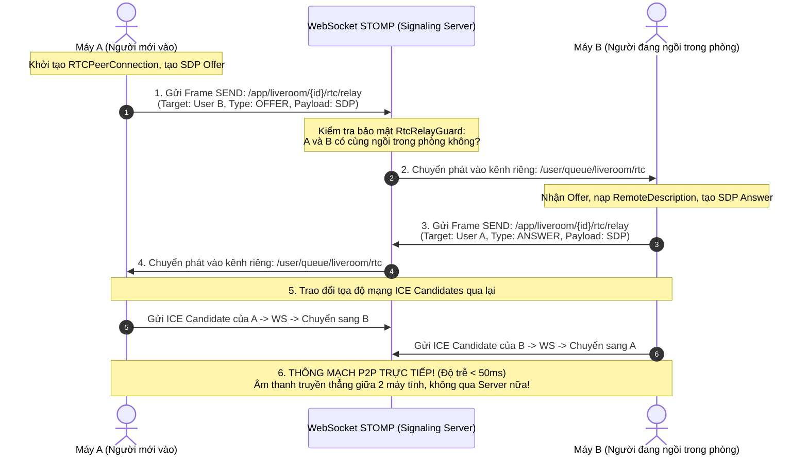
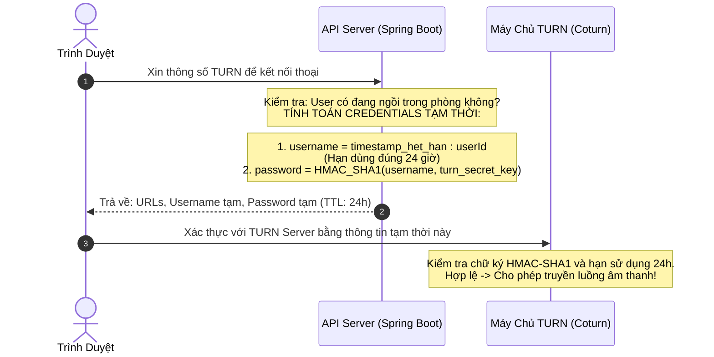

# Phần 06: Chức Năng Đàm Thoại Giọng Nói WebRTC Full-Mesh & Cơ Chế Tự Dọn Tài Nguyên

Tài liệu này ghi chép lại đầy đủ 100% toàn bộ bài giảng về **Chức Năng Đàm Thoại Giọng Nói WebRTC Full-Mesh & Cơ Chế Tự Dọn Tài Nguyên (Voice Chat, Signaling, STUN/TURN & Resource Reaper)** trong Module Live Room. Đây là mảnh ghép công nghệ cuối cùng, phức tạp và kỳ diệu nhất: giúp các thành viên vừa nghe nhạc vừa có thể bật micro trò chuyện trực tiếp với nhau với độ trễ cực thấp dưới $50ms$, đồng thời giữ cho toàn bộ hệ thống luôn sạch sẽ tài nguyên.

---

## 🧭 Hình Ảnh Ẩn Dụ Đời Thực Để Sếp Dễ Hình Dung

Sếp hãy tưởng tượng:
* **Cách gọi điện thoại truyền thống (Qua Media Server trung gian)**:
  - Sếp muốn nói chuyện với người bạn ngồi cách 5 mét.
  - Nhưng sếp phải thu âm giọng nói, gửi file lên một máy chủ đặt tại Singapore, máy chủ đó xử lý rồi mới truyền ngược về máy người bạn kia.
  - 👉 Vừa tốn tiền thuê máy chủ cấu hình khủng, vừa bị trễ tiếng nói!
* **Cách gọi điện thoại WebRTC (Mạng ngang hàng Peer-to-Peer - P2P)**:
  - Hai máy tính tự động "bắt sóng" và truyền âm thanh trực tiếp cho nhau qua mạng Internet. Giọng nói đi thẳng từ micro máy sếp sang loa máy bạn sếp trong chớp mắt!
  - Máy chủ của chúng ta chỉ đóng vai trò là **"Người mai mối / Bưu điện chuyển thư" (Signaling)** lúc ban đầu để hai bên biết số điện thoại của nhau, sau đó hai máy tự nói chuyện với nhau.

---

## 1. Lựa Chọn Kiến Trúc: Tại Sao Chọn Full-Mesh 7 Người Thay Vì Dựng Media Server Đắt Đỏ?

Trong thế giới WebRTC, có 2 trường phái kiến trúc chính:

```
Trường phái 1: Dùng Media Server (SFU / MCU)
[Client 1] ───► [MÁY CHỦ TRUNG GIAN (SFU/MCU)] ───► [Client 2, 3, 4...]
Tốn hàng ngàn USD/tháng tiền thuê máy chủ xử lý Media và băng thông khủng!

Trường phái 2: Mạng Lưới Toàn Phần (Full-Mesh P2P) - LỰA CHỌN CỦA PWB_MiNi
[Client 1] ◄──────────── Kết nối P2P trực tiếp ────────────► [Client 2]
     ▲  ╲                                                 ╱  ▲
     │    ╲                                             ╱    │
     │      ╲                                         ╱      │
     ▼        ▼                                     ▼        ▼
[Client 3] ◄───► [Client 4] ◄───► [Client 5] ◄───► [Client 6] ◄───► [Client 7]
Máy chủ PWB_MiNi tốn 0% CPU âm thanh, 0% băng thông Media!
```

### 1.1. Công Thức Tính Số Lượng Kết Nối Trong Mạng Full-Mesh
Trong một căn phòng có $K$ người, số lượng kết nối ngang hàng (Peer Connection) được tính bằng công thức tổ hợp:

$$\text{Số kết nối P2P} = \frac{K \times (K - 1)}{2}$$

Với sức chứa cố định $K = 7$ người của phòng Live Room:
$$\text{Số kết nối} = \frac{7 \times 6}{2} = 21 \text{ kết nối P2P}$$

### 1.2. Phân Tích Băng Thông Mạng Dân Dụng
* Khi một người bật micro nói chuyện, luồng âm thanh nén chất lượng cao (Codec Opus) chỉ tốn khoảng **$50 \text{ kbps}$**.
* Một người cần gửi âm thanh của mình cho 6 người còn lại:
  $$\text{Băng thông gửi (Uplink)} = 6 \times 50 \text{ kbps} = 300 \text{ kbps} \approx 0.3 \text{ Mbps}$$
* **Kết luận thực tiễn**: Đường truyền mạng Wifi gia đình hay mạng di động 4G/5G hiện nay đều có tốc độ tải lên từ $10 \text{ Mbps}$ đến $50 \text{ Mbps}$ $\rightarrow$ Dư sức gánh vác $0.3 \text{ Mbps}$ một cách nhẹ nhàng!
* **Lợi ích kiến trúc tối thượng**:
  - Chúng ta **không cần phải chi hàng ngàn USD mỗi tháng** để duy trì cụm máy chủ Media Server (SFU/MCU) cồng kềnh.
  - Máy chủ Spring Boot của chúng ta chỉ đóng vai trò chuyển tiếp vài gói tin văn bản ban đầu, **hoàn toàn 0% gánh nặng xử lý âm thanh**!

---

## 2. Quy Trình Bắt Tay Signaling: Mượn STOMP WebSocket Làm Bưu Điện Chuyển Thư

Trước khi hai trình duyệt có thể nói chuyện trực tiếp với nhau, chúng cần trao đổi 2 thông tin cơ bản:
1. **SDP (Session Description Protocol)**: Bức thư mô tả thiết bị (*"Máy tôi dùng Micro gì, hỗ trợ chuẩn âm thanh Opus hay AAC..."*).
   - Gồm 2 lá thư: **`Offer`** (Lời chào mời) và **`Answer`** (Lời hồi đáp).
2. **ICE Candidate**: Tọa độ mạng thực tế (*"Địa chỉ IP công khai và Cổng Port mà máy tôi đang mở để nghe là gì..."*).

Chúng ta tận dụng ngay hạ tầng STOMP WebSocket sẵn có để làm trạm chuyển thư (`RtcStompController`):



---

## 3. Bảo Mật Luồng Signaling & Chốt Chặn `RtcRelayGuard`

Tọa độ mạng (Địa chỉ IP nhà riêng và Port) là thông tin cực kỳ nhạy cảm. Nếu bị lộ ra ngoài, người dùng có thể bị kẻ xấu tấn công mạng (DDoS).

Hệ thống của chúng ta bảo vệ an ninh luồng Signaling qua **3 lớp phòng thủ nghiêm ngặt**:
1. **Cô lập kênh truyền riêng tư tuyệt đối**: Toàn bộ SDP và ICE Candidate được chuyển phát vào hàng đợi cá nhân bí mật: `/user/queue/liveroom/rtc`. Tuyệt đối không gửi vào topic chung của phòng, người khác cùng phòng không thể nghe lén.
2. **Chốt chặn `RtcRelayGuard`**:
   - Khi nhận một lá thư chuyển tiếp, Backend kiểm tra: *Người gửi (Sender) và Người nhận (Target) có đang thực sự ngồi cùng trong căn phòng đó không?*
   - Kẻ xấu ở ngoài phòng gửi tin rác vào sẽ bị chặn đứng ngay lập tức!
3. **Giới hạn tần suất chuyên biệt (RTC Rate Limit)**:
   - Áp dụng hạn mức: **Tối đa 400 frame trong vòng 10 giây cho mỗi kết nối**.
   - Ngăn chặn kẻ xấu viết bot spam hàng triệu gói tin ICE Candidate để làm nghẽn CPU và mạng của máy chủ.

---

## 4. Vượt Tường Lửa Bằng Máy Chủ STUN & Cấp Chứng Chỉ TURN Tạm Thời (Ephemeral Credentials)

Hầu hết máy tính của người dùng đều ngồi sau cục Wifi gia đình hoặc mạng 4G (công nghệ NAT - Network Address Translation), tức là máy tính chỉ có địa chỉ IP nội bộ (ví dụ `192.168.1.5`) chứ không có IP công khai ngoài Internet.

```
[Máy tính của Sếp] ──(IP nội bộ: 192.168.1.5)──► [Router Wifi] ──(IP công khai: 14.161.x.x)──► Internet
Làm sao máy tính của bạn sếp ở nơi khác biết đường mà gửi âm thanh tới?
```

### 4.1. Vai Trò Của Máy Chủ STUN (Soi Gương Công Khai)
* **STUN (Session Traversal Utilities for NAT)** giống như một **chiếc gương soi công cộng**.
* Máy tính gửi một gói tin tới máy chủ STUN.
* Máy chủ STUN nhìn thấy gói tin và soi gương trả lời lại: *"Địa chỉ IP công khai ngoài Internet của bạn là `14.161.88.99`, đang mở tại cổng `54321`"*.
* Nhờ đó, hai máy tính biết được địa chỉ IP thật của nhau để kết nối P2P trực tiếp (chiếm khoảng 85% các trường hợp mạng thông thường).

---

### 4.2. Vai Trò Của Máy Chủ TURN & Bài Toán Bảo Mật Chứng Chỉ Tạm Thời
* Trong khoảng 15% trường hợp mạng còn lại (như mạng 4G ngặt nghèo hoặc tường lửa doanh nghiệp - Symmetric NAT), hai máy tính bị chặn đứng hoàn toàn, không thể đục lỗ P2P được.
* Lúc này, bắt buộc phải dùng đến **máy chủ TURN (Traversal Using Relays around NAT)** đóng vai trò làm trạm trung chuyển luồng âm thanh.

#### Hiểm họa nếu dùng Mật khẩu Cố định:
Băng thông của máy chủ TURN rất đắt đỏ. Nếu cấu hình username/password cố định trong mã nguồn JavaScript ở trình duyệt, hacker chỉ cần bấm `F12` xem code là lấy cắp được tài khoản TURN và biến máy chủ của chúng ta thành trạm trung chuyển dữ liệu miễn phí cho họ!

#### Giải pháp của chúng ta: Cấp chứng chỉ tạm thời HMAC-SHA1 có thời hạn sống (Ephemeral Credentials)
Tại endpoint `GET /rooms/{id}/rtc/turn-credentials`:



* **Ý nghĩa an ninh tuyệt đối**:
  - Không có mật khẩu gốc nào bị lộ ra ngoài trình duyệt.
  - Tài khoản TURN chỉ tồn tại tạm thời đúng 24 giờ. Quá thời gian này, tài khoản tự động vô giá trị, triệt tiêu hoàn toàn nguy cơ bị ăn cắp băng thông!

---

## 5. Bốn Bộ Lập Lịch Thu Hồi Tài Nguyên Tự Động (Resource Reapers)

Một hệ thống vận hành bền bỉ nhiều năm không thể trông chờ vào việc người dùng nhớ bấm nút "Tắt phòng". Hệ thống của chúng ta triển khai **4 Scheduler chạy ngầm độc lập** để dọn dẹp sạch sẽ tài nguyên rác:

```
1. EmptyRoomScheduler (Quét mỗi phút):
   Phòng không có ai ngồi trong 10 phút -> Tự động ĐÓNG PHÒNG (Lý do: EMPTY_TIMEOUT).

2. OwnerGraceScheduler (Quét mỗi 10 giây):
   Chủ phòng rớt mạng quá 60 giây mà không quay lại -> Tự động ĐÓNG PHÒNG (Lý do: OWNER_ABSENT_TIMEOUT).

3. ChatRetentionScheduler (Quét hàng ngày):
   Tự động dọn dẹp các tin nhắn chat cũ quá hạn lưu trữ để giải phóng dung lượng ổ cứng.

4. IdempotencyKeyCleanupScheduler (Quét định kỳ):
   Xóa các khóa chống trùng lặp (Idempotency Keys) đã hết hạn trong cơ sở dữ liệu.
```

Nhờ có 4 "người dọn rác cần mẫn" này, cơ sở dữ liệu và bộ nhớ RAM của hệ thống luôn được giữ ở trạng thái tinh gọn và tối ưu nhất!

---

## 6. Khóa Đa Tab Phía Trình Duyệt Chống Hú Mic Kinh Hoàng (`room-tab-lock.ts`)

### Hiện Tượng Hú Mic (Echo Loop / Audio Feedback) Là Gì?
Nếu một người dùng vô tình mở cùng 1 phòng nghe nhạc trên 2 tab trình duyệt khác nhau:
* Cả 2 tab đều cùng kết nối vào phòng.
* Tiếng phát ra từ loa của Tab 1 sẽ bị micro của Tab 2 thu lại và phát tiếp.
* Tiếng đó lại bị micro Tab 1 thu lại $\rightarrow$ Tạo ra một vòng lặp âm thanh vô tận, sinh ra tiếng **hú rít chói tai kinh hoàng**, làm điếc tai toàn bộ những người đang ngồi trong phòng!

### Giải Pháp Của Chúng Ta: Khóa Đa Tab Bằng `BroadcastChannel`
Tại file `room-tab-lock.ts` phía Frontend:
1. Mỗi khi người dùng bước vào phòng, tab trình duyệt sẽ đăng ký một kênh giao tiếp nội bộ giữa các tab: `BroadcastChannel("pwb_room_tab_lock")`.
2. Tab gửi tín hiệu chào hỏi: *"Tôi đang mở phòng số 88 nè!"*.
3. **Nếu phát hiện đã có một tab khác đang mở cùng phòng đó**:
   - Tab mở sau lập tức hiện cảnh báo: *"Bạn đang mở phòng này ở một tab khác!"*.
   - Tab mở sau **tự động vô hiệu hóa toàn bộ micro và loa, ngắt kết nối âm thanh** để bảo vệ màng nhĩ của người dùng và giữ yên tĩnh cho cả phòng!

---

## 7. Bảng Tổng Kết Toàn Diện 6 Phần Của Giai Đoạn 4

| Phần | Tên Chuyên Đề | Trụ Cột Kỹ Thuật Đỉnh Cao Của PWB_MiNi |
| :---: | :--- | :--- |
| **01** | **Nền Tảng Công Nghệ** | Bản chất HTTP vs WebSocket vs STOMP; giải phẫu Frame STOMP; Message Broker Pub/Sub. |
| **02** | **Hạ Tầng Kết Nối** | Xác thực JWT tại frame `CONNECT`; kỹ thuật Đăng Ký Kép (SockJS Fallback); bảo đảm an toàn `afterCommit`. |
| **03** | **Tạo Phòng & Phiên** | Mô hình `1 Room - N Cycles`; phân cấp 3 bảng thành viên; đóng phòng 6 bước & hoàn tác 5 giây (`left_at == endedAt`). |
| **04** | **Quản Trị Sức Chứa** | Khóa bi quan `SELECT FOR UPDATE` trần 7 người; đối xứng 2 cửa vào; án phạt Deadline `kicked_cooldown_until`; ân hạn chủ 60s. |
| **05** | **Đồng Bộ Phát Nhạc** | Mô hình Anchor Timestamp 0% CPU; bù lệch đồng hồ `serverOffsetMs`; khóa lạc quan `@Version`; bù lệch 3 tầng Web Audio API. |
| **06** | **Đàm Thoại WebRTC** | Mạng Full-Mesh 7 người (21 kết nối P2P); Signaling qua STOMP User Destination; Ephemeral TURN Credentials 24h; Khóa đa tab chống hú mic. |

---

🎉 **Chúc mừng sếp đã hoàn thành xuất sắc 100% toàn bộ 6 phần của Giai đoạn 4 — Module Live Room!**  
Giờ đây sếp đã nắm trọn từ bản chất công nghệ tầng mạng thấp nhất cho đến tư duy kiến trúc hệ thống phân tán thời gian thực đỉnh cao!
