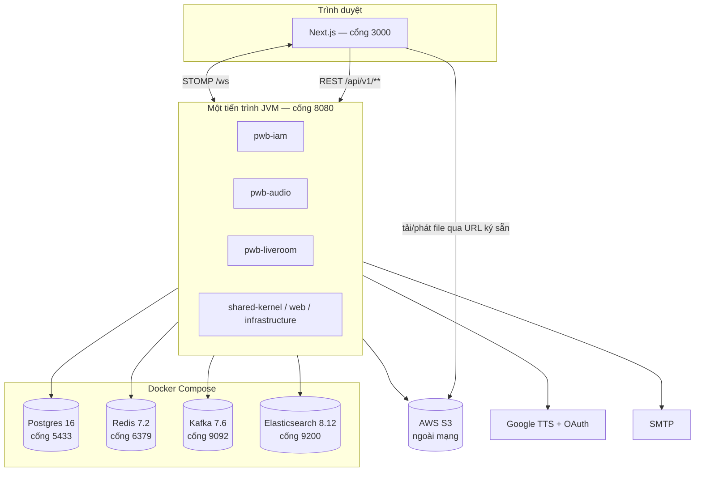
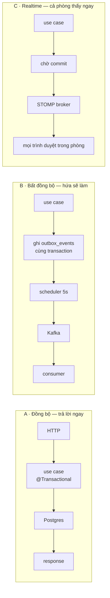

# 00 — Bản đồ hệ thống

> **Đọc file này trước.** Mục tiêu: 20 phút để biết hệ thống gồm những gì, cái gì nằm ở đâu, và mọi thứ chỉ đi theo **ba con đường**. Chi tiết nằm ở các file khác, file này chỉ dẫn đường.
> Số liệu chụp từ hệ thống chạy thật ngày 2026-08-10 — dùng để cảm nhận quy mô, không phải để tra cứu.

---

## 1. Hệ thống này làm gì

Nền tảng cho người làm nhạc: **tải bài hát lên, gắn dấu âm thanh thương hiệu (voice tag) vào bản nghe thử, rồi mở một phòng trực tuyến để nghe cùng khách hàng và nhận góp ý ngay trên timeline bài hát.**

Bài toán thật đứng sau: gửi demo cho khách qua Zoom/Meet thì âm thanh bị nén hỏng và bản gốc dễ bị chép lại. Nên hệ thống làm ba việc mà công cụ họp không làm: phát nhạc **đồng bộ theo thời gian** cho cả phòng, đóng dấu voice tag vào bản nghe thử, và bình luận **ghim vào giây thứ mấy** của bài hát.

Ba việc đó tương ứng ba module.

---

## 2. Bức tranh chạy thật



Điểm quan trọng nhất của bức tranh: **backend là một tiến trình duy nhất**. Ba module là ba artifact Maven, không phải ba service. Ranh giới giữa chúng là đồ thị phụ thuộc lúc biên dịch — chi tiết ở [01 — Kiến trúc tổng thể](01-architecture-overview.md).

Điểm thứ hai: **file nhạc không đi qua backend**. Trình duyệt tải lên và phát trực tiếp từ S3 bằng URL ký sẵn; backend chỉ cấp chữ ký. Đó là lý do một request phát nhạc không tốn băng thông của server.

---

## 3. Ba module làm gì

| Module | Chịu trách nhiệm | Khái niệm chính | Bảng |
|---|---|---|---|
| **IAM** | Danh tính, phiên đăng nhập, hồ sơ, quản trị người dùng | User, Role (USER/PRO/ADMIN), OtpCode, PasswordResetToken | 5 |
| **Audio** | Bài hát, voice tag, đóng dấu âm thanh | Song + `SongStatus`, VoiceTag, SongTagConfig | 3 |
| **Live Room** | Phòng nghe chung, duyệt vào phòng, chat, phát nhạc đồng bộ, gọi video | LiveRoom, SessionCycle, Participant, JoinRequest, PlaybackState | 9 |

Phụ thuộc: `liveroom → audio` (lấy bài hát để phát) và `liveroom → iam` (lấy ảnh đại diện). Không có chiều ngược lại.

---

## 4. Toàn bộ bề mặt API

**68 endpoint REST** trên 12 controller, cộng **11 destination STOMP**.

### IAM — 24 endpoint

| Nhóm | Endpoint |
|---|---|
| `/api/v1/auth` | `register` · `verify-otp` · `resend-otp` · `login` · `refresh` · `logout` · `google-login` · `forgot-password` · `reset-password` · `change-password` |
| `/api/v1/profile` | `GET` xem · `PUT` sửa · `POST` đổi ảnh đại diện |
| `/api/v1/admin/users` | danh sách · `search` · `suggest` · chi tiết · đổi role · `ban` · `unban` · xoá · `stats` |
| `/api/v1/admin/search` | `indices` · `reindex` |

### Audio — 21 endpoint

| Nhóm | Endpoint |
|---|---|
| `/api/v1/songs` | `upload-url` · tạo · chi tiết · danh sách · `search` · `suggest` · sửa · xoá · `voice-tag-config` · `retry-processing` · `audio-url` |
| `/api/v1/voice-tags` | `tts` · tải lên · `tts/preview` · `tts/voices` · danh sách · `search` · `suggest` · sửa · xoá · `audio-url` |

### Live Room — 23 endpoint + 11 STOMP

| Nhóm | Endpoint |
|---|---|
| `/rooms` | tạo · danh sách · `search` · chi tiết · `by-code/{code}` · `end` · `undo-end` · `reopen` |
| `/rooms/{id}/join-requests` | tạo · danh sách · `me` · huỷ · `approve` · `reject` |
| `/rooms/{id}/participants` | vào (`POST /me`) · rời (`DELETE /me`) · danh sách · `PATCH /me/media` · `kick` · `mute` |
| `/rooms/{id}/…` | `chat/messages` · `music/audio-url` · `rtc/config` |
| STOMP `/app/liveroom/{id}/…` | `chat/send` · `music/{play,pause,seek,volume,get-state}` · `comments/{add,get}` · `rtc/{offer,answer,ice}` |

Quy luật đáng nhớ: **cái gì cần bền vững hoặc cần phân trang thì đi REST; cái gì cần cả phòng thấy ngay thì đi STOMP.** Nhạc có cả hai — `audio-url` đi REST vì nó cấp chữ ký S3, còn lệnh play/pause đi STOMP vì cả phòng phải nghe cùng lúc.

---

## 5. Dữ liệu nằm ở đâu

Năm nơi lưu trữ, mỗi nơi một vai trò rạch ròi:

| Nơi | Giữ cái gì | Mất thì sao |
|---|---|---|
| **Postgres** | Sự thật. 19 bảng. | Mất hết |
| **Redis** | Phiên đăng nhập, bộ đếm, khoá tạm | Mọi người phải đăng nhập lại; **không đăng nhập được** (fail-closed) |
| **Elasticsearch** | Bản sao để tìm kiếm. 4 index. | Tìm kiếm lùi về truy vấn Postgres — [chấp nhận được, có chủ ý](01-architecture-overview.md) |
| **S3** | File nhạc, voice tag, ảnh đại diện | Mất file, metadata vẫn còn |
| **Kafka** | Việc cần làm sau, đang trên đường | Việc kẹt lại trong bảng `outbox_events`, chạy tiếp khi Kafka sống lại |

### 5.1. Postgres — 19 bảng, nhìn tiền tố là biết chủ

```
iam_       users · roles · otp_codes · password_history · password_reset_tokens
audio_     songs · voice_tags · song_tag_configs
liveroom_  rooms · session_cycles · participants · join_requests · room_members
           chat_messages · playback_states · admin_actions · ownership_history
(chung)    outbox_events · flyway_schema_history
```

Live Room chiếm 9/17 bảng nghiệp vụ — nó là module nặng nhất về trạng thái.

Migration chia dải để ba module không đụng số: **IAM `V1–V99` · shared `V100+` · Audio `V200+` · Live Room `V300+`**, kèm `out-of-order: true`.

> Quy mô hiện tại: 7 user · 6 bài hát · 2 voice tag · 5 phòng · 83 dòng outbox.

### 5.2. Redis — bốn họ khoá

```
iam:refresh:token:<sha256>      phiên còn sống        TTL 14 ngày
iam:refresh:user:<userId>       tập phiên của 1 người TTL 14 ngày
iam:refresh:rotated:<sha256>    bia mộ chống trộm     TTL 14 ngày
iam:jwt:blacklist:<jti>         token đã đăng xuất    TTL = đời còn lại
iam:ratelimit:<scope>:<key>     bộ đếm tần suất       TTL 1 phút
iam:login:fail|lock:…           đếm sai & khoá        TTL 15–30 phút
```

Chi tiết cả sáu họ ở [02 — Lát cắt dọc đăng nhập](02-lat-cat-doc-dang-nhap.md).

Live Room cũng dùng Redis cho throttle tra mã phòng, nhưng phần đếm frame STOMP thì **để trong bộ nhớ tiến trình**, không dùng Redis — một trong những lý do hệ thống hiện chỉ chạy được một instance ([13 §10](13-realtime-stomp.md)).

### 5.3. Elasticsearch — 4 index, tiền tố `pwb`

`pwb_users` · `pwb_songs` · `pwb_voice_tags` · `pwb_rooms`

Đều là **bản sao chỉ đọc**. Không có gì tồn tại duy nhất ở đây. Timeout cố tình ngắn (kết nối 1s, đọc 2s) để một cluster chậm không giữ Tomcat worker và xếp hàng cả việc vào phòng phía sau.

### 5.4. Kafka — 5 topic thật

| Topic | Việc |
|---|---|
| `voice.processing.v1` | Đóng voice tag vào bài hát (FFmpeg, chạy phút) |
| `notification.email.v1` | Gửi email (OTP, đặt lại mật khẩu) |
| `search.index.v1` | Đồng bộ Elasticsearch |
| `*.DLT` ×2 | Việc thất bại hết số lần thử |

> **Có một topic thừa:** `iam.audit.v1` tồn tại trong broker nhưng **không có dòng code nào** nhắc tới, và không có dòng outbox nào trỏ vào. Đây là dấu vết của tính năng nhật ký kiểm toán đã bị gỡ — migration `V5__create_iam_audit_logs.sql` tạo bảng, `V10__drop_iam_audit_logs.sql` xoá đi.

---

## 6. Ba con đường — phần quan trọng nhất của bản đồ

Mọi thứ xảy ra trong hệ thống này đều đi theo **một trong ba** con đường. Nắm ba cái này là nắm được cách hệ thống vận hành.



### A. Đồng bộ — mặc định

Đăng nhập, sửa hồ sơ, tạo phòng, lấy danh sách bài hát. Request vào, use case chạy trong một transaction, trả lời. Không có gì bí ẩn. Đi hết một ca cụ thể ở [02](02-lat-cat-doc-dang-nhap.md).

### B. Bất đồng bộ — mọi thứ đều qua bảng `outbox_events`

Đây là chi tiết dễ bỏ sót nhất: **không use case nào gửi thẳng vào Kafka.** Chúng ghi một dòng vào `outbox_events` **trong cùng transaction** với thay đổi nghiệp vụ, rồi một scheduler đọc bảng đó và đẩy sang Kafka.

Lý do: nếu use case gửi Kafka trực tiếp rồi transaction rollback, bạn vừa gửi đi một sự kiện nói về chuyện chưa từng xảy ra. Ngược lại, commit xong mới gửi thì tiến trình chết ở giữa là sự kiện mất hẳn. Ghi vào cùng một transaction thì hai chuyện hoặc cùng xảy ra, hoặc cùng không.

Bảng có đủ đồ nghề cho việc phát lại tin cậy: `status` · `retry_count` · `next_attempt_at` · `last_error` · `version` (khoá lạc quan) · `lease_until` (giữ chỗ để hai worker không cùng đẩy một dòng), cộng ba index trong đó có một partial index chỉ cho hàng `PROCESSING`.

Cấu hình: quét mỗi **5 giây**, lô **20** dòng, thử lại tối đa **3** lần với giãn cách **1s → 5s → 30s**.

> **Chụp thật từ bảng — đủ ba đường, không thiếu đường nào:**
>
> | `event_type` | `topic` | số dòng |
> |---|---|---|
> | `SearchIndexPersisted` | `search.index.v1` | 75 |
> | `SongPersisted` | `voice.processing.v1` | 7 |
> | `EmailPersisted` | `notification.email.v1` | 1 |
>
> Tất cả `SENT`. Con số 75 cho thấy đồng bộ tìm kiếm là nguồn phát sự kiện lớn nhất — mỗi lần lưu một user/bài hát/phòng đều sinh một dòng.

### C. Realtime — chỉ Live Room

Sự kiện STOMP đẩy tới trình duyệt, và **luôn sau khi transaction commit**. Cùng lý do như đường B: phát "đã kick" rồi rollback là nói dối client. Toàn bộ cơ chế ở [13 — Realtime STOMP](13-realtime-stomp.md).

---

## 7. Ranh giới giữa các module

Ba loại ranh giới, mạnh yếu khác nhau — biết cái nào yếu để không dựa vào nó:

| Ranh giới | Cứng tới đâu | Ai canh |
|---|---|---|
| Giữa artifact Maven | **Cứng** — import sai là lỗi compile | Maven |
| Qua port + adapter | Quy ước — nhưng kiểm chứng được: chỉ **2 file** trong Live Room import module khác | Review |
| Trong database | **Mềm nhất** — chỉ có tiền tố tên bảng, không có tường chặn nào | Không ai |

Chưa có ArchUnit hay Spring Modulith. Chi tiết ở [01 §6, §10](01-architecture-overview.md).

---

## 8. Frontend — 24 trang

```
(auth)       login · register · verify-otp · forgot-password · reset-password
(dashboard)  dashboard · profile
             songs · songs/new · songs/[songId]
             voice-tags · voice-tags/new · voice-tags/[voiceTagId]
             liveroom · liveroom/new · liveroom/join · liveroom/join/[roomCode]
(liveroom)   liveroom/[roomId]          ← phòng thật, ngoài layout dashboard
(public)     / · contact · features · features/technical
(error)      401 · 403
```

Chú ý phòng thật nằm ở **route group riêng** `(liveroom)`, không nằm trong `(dashboard)`: nó cần toàn màn hình, không có sidebar, và vòng đời kết nối WebSocket khác hẳn một trang dashboard bình thường.

Mã nguồn chia theo tính năng: `Frontend/src/features/{auth,liveroom,voice,profile,landing,contact,showcase}`.

---

## 9. Mục lục tài liệu

| File | Nội dung | Trạng thái |
|---|---|---|
| **00** — bản đồ này | Toàn cảnh, ba con đường | ✅ |
| [01 — Kiến trúc tổng thể](01-architecture-overview.md) | Modular monolith, giải phẫu module, quy ước thật vs tài liệu chuẩn | ✅ |
| [02 — Lát cắt dọc: đăng nhập](02-lat-cat-doc-dang-nhap.md) | Một request đi hết mọi tầng | ✅ |
| [13 — Realtime STOMP](13-realtime-stomp.md) | Tầng vận chuyển của Live Room | ✅ |
| [IAM — Tour](iam-00-tour.md) | Vòng đời tài khoản, 6 khuôn mẫu lặp lại | ✅ |
| [IAM — Đăng ký & OTP](iam-01-dang-ky-va-otp.md) | `register` · `verify-otp` · `resend-otp` | ✅ |
| [IAM — Mật khẩu](iam-02-mat-khau.md) | `forgot` · `reset` · `change`, chính sách, lịch sử | ✅ |
| [IAM — Google](iam-03-google-oauth.md) | Xác minh ID token, nối tài khoản | ✅ |
| [IAM — Hồ sơ & ảnh đại diện](iam-04-profile-va-avatar.md) | S3, URL ký sẵn, chỗ bỏ transaction | ✅ |
| [IAM — Quản trị](iam-05-quan-tri-nguoi-dung.md) | Cấm, vai trò, xoá mềm, thống kê | ✅ |
| [IAM — Tìm kiếm](iam-06-tim-kiem-nguoi-dung.md) | ES, đồng bộ qua outbox, ngã về Postgres | ✅ |
| [Audio — Tour](audio-00-tour.md) | Vòng đời bài hát, 6 khuôn mẫu lặp lại | ✅ |
| [Audio — Tải lên bài hát](audio-01-tai-len-bai-hat.md) | URL ký sẵn, bịt khoảng trống tin cậy | ✅ |
| [Audio — Voice tag](audio-02-voice-tag.md) | TTS Google, tải lên, xem thử | ✅ |
| [Audio — Cấu hình ghép tag](audio-03-cau-hinh-ghep-tag.md) | Bốn tham số → đồ thị lọc FFmpeg | ✅ |
| [Audio — Pipeline xử lý](audio-04-pipeline-xu-ly.md) | Kafka, FFmpeg, cân độ to, timeout | ✅ |
| [Audio — Phát nhạc & tìm kiếm](audio-05-phat-nhac-va-tim-kiem.md) | `playbackKey`, URL ký sẵn, ES | ✅ |
| [Live Room — Tour](liveroom-00-tour.md) | 9 bảng, session cycle, 7 khuôn mẫu | ✅ |
| [Live Room — Vòng đời phòng](liveroom-01-vong-doi-phong.md) | Tạo, mã phòng, phiên, kết thúc/undo/mở lại | ✅ |
| [Live Room — Vào phòng](liveroom-02-vao-phong.md) | Hai cửa vào, duyệt/từ chối, khoá 3 lần | ✅ |
| [Live Room — Người tham gia](liveroom-03-nguoi-tham-gia.md) | Rời phòng, owner grace, kick, ba trạng thái mic | ✅ |
| [Live Room — Chat](liveroom-04-chat.md) | Code point, con trỏ phân trang, echo | ✅ |
| [Live Room — Nghe nhạc cùng](liveroom-05-nghe-nhac-cung.md) | Anchor, khoá lạc quan, bình luận timeline | ✅ |
| [Live Room — WebRTC](liveroom-06-webrtc.md) | Mesh, signaling, lỗ hổng topic đã vá | ✅ |
| [Live Room — Scheduler](liveroom-07-scheduler.md) | Bốn công việc chạy nền | ✅ |
| [Hạ tầng — Outbox & Kafka](infra-01-outbox-va-kafka.md) | Xương sống bất đồng bộ, lease, DLT | ✅ |
| [Hạ tầng — Redis](infra-02-redis.md) | Bảy nhóm khoá, fail-open vs fail-closed | ✅ |
| [Hạ tầng — Lưu trữ S3](infra-03-luu-tru-s3.md) | URL ký sẵn, thời hạn, dọn rác | ✅ |
| [Hạ tầng — Elasticsearch](infra-04-elasticsearch.md) | Index, ba tầng bảo vệ, lệch phiên bản | ✅ |
| [Hạ tầng — Lỗi & i18n](infra-05-loi-va-i18n.md) | Mã lỗi, `MessageSource`, dịch phía client | ✅ |
| [Hạ tầng — Bảo mật & rate limit](infra-06-bao-mat-va-rate-limit.md) | Chuỗi filter, sáu tầng giới hạn, IP tin cậy | ✅ |
| [Hạ tầng — Triển khai](infra-07-trien-khai.md) | CI/CD, Docker, Nginx, Flyway | ✅ |

**Đường đọc gợi ý:** 00 → 02 (một ca thật) → 01 (khái quát hoá cái vừa thấy) → tour của module bạn quan tâm → chi tiết từng chức năng.

---

## 10. Những chỗ bản đồ không khớp thực tế

Ghi lại để không mất công đi tìm:

| Chỗ lệch | Thực tế |
|---|---|
| `iam.audit.v1` trong Kafka | Không code nào dùng; dấu vết tính năng audit đã gỡ (`V5` tạo, `V10` xoá) |
| `Backend/modules/module-development-standards.md` | Sai 6 điểm so với code — [01 §3.3](01-architecture-overview.md) |
| `docs/audio-module.md`, `docs/liveroom-module.md` | Hướng dẫn sử dụng, không phải tài liệu kỹ thuật; chưa đối chiếu lại với code |
| MapStruct trong `pom.xml` | Khai báo và cắm annotation processor, nhưng **0 file** dùng — mapper viết tay hết |
| Bảng `iam_password_history` | Có bảng và có `PasswordHistoryGuard`, chưa kiểm chứng đường ghi |
| Một instance duy nhất | Broker STOMP, đếm frame, và sổ session đều nằm trong bộ nhớ tiến trình — nhân bản instance là hỏng phòng ([13 §10](13-realtime-stomp.md)) |

---

## 11. Tự kiểm chứng

Dựng lại toàn bộ số liệu trong file này:

```bash
docker ps --format "{{.Names}}\t{{.Image}}\t{{.Ports}}"
```

```bash
docker exec -e PGPASSWORD="$(grep -E '^POSTGRES_PASSWORD=' .env | cut -d= -f2-)" pwb-postgres psql -U pwb_user -d pwb_db -c "\dt"
```

```bash
curl -s "http://localhost:9200/_cat/indices?h=index,docs.count,store.size&s=index"
```

```bash
docker exec pwb-kafka kafka-topics --bootstrap-server localhost:9092 --list
```

Xem ba đường bất đồng bộ trong một truy vấn:

```bash
docker exec -e PGPASSWORD="$(grep -E '^POSTGRES_PASSWORD=' .env | cut -d= -f2-)" pwb-postgres psql -U pwb_user -d pwb_db -c "SELECT event_type, topic, status, count(*) FROM outbox_events GROUP BY 1,2,3 ORDER BY 4 DESC;"
```

Xem các họ khoá Redis:

```bash
docker exec pwb-redis redis-cli -a "$(grep -E '^REDIS_PASSWORD=' .env | cut -d= -f2-)" --no-auth-warning --scan --pattern 'iam:*' | sed -E 's/:[a-f0-9]{8,}.*//' | sort -u
```
