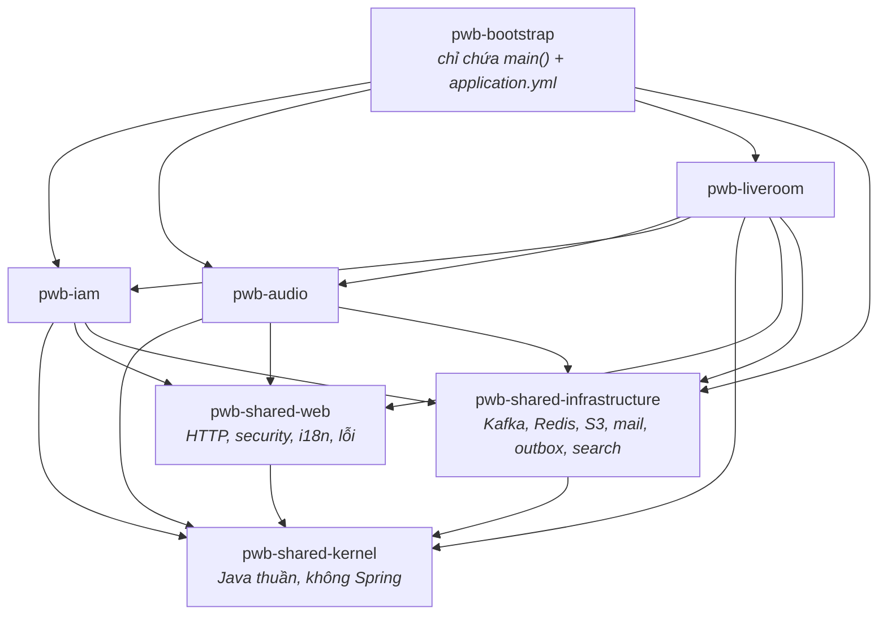
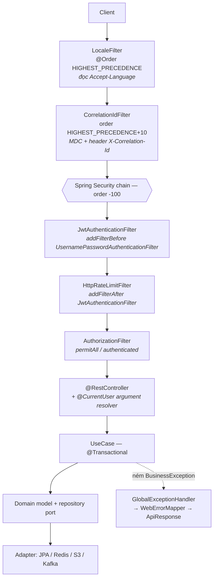
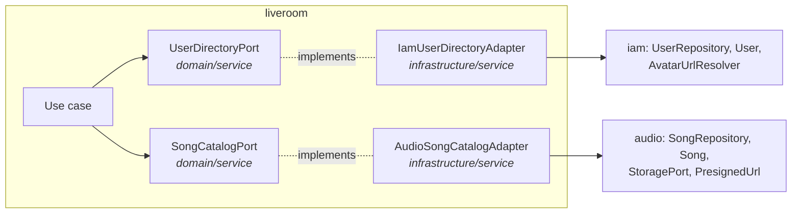

# 01 — Kiến trúc tổng thể & giải phẫu một module

> Nội dung nền. Mọi mục kỹ thuật khác tham chiếu về đây thay vì giải thích lại.
> Mục 3 và 4 là phần "giải phẫu module": tầng, quy ước, và cách một module tự ráp vào ứng dụng.

---

## 1. Bài toán

Dự án có ba phân hệ nghiệp vụ rất khác nhau về bản chất:

| Phân hệ | Bản chất | Ràng buộc kỹ thuật đặc thù |
|---|---|---|
| **IAM** | CRUD + bảo mật | Đồng bộ, request–response, nhạy cảm về đúng/sai |
| **Audio** | Xử lý file nặng | Bất đồng bộ, tác vụ chạy phút, phải retry được |
| **Live Room** | Realtime nhiều người | STOMP/WebRTC, trạng thái chia sẻ, tranh chấp ghi |

Ba thứ này nếu nhét chung một khối code sẽ dính vào nhau: một thay đổi ở IAM làm hỏng Live Room mà không ai biết trước. Nhưng tách thành ba service riêng thì phải trả giá bằng network, phân tán transaction, ba pipeline deploy, ba database — cho một dự án một người viết và chạy trên một VPS.

Hướng đã chọn: **modular monolith** — ranh giới module cứng ở *thời điểm biên dịch*, nhưng chạy trong *một tiến trình, một JAR, một database*. Vi phạm ranh giới thì Maven báo lỗi compile, không phải chờ tới lúc chạy mới lộ.

---

## 2. Bản đồ hệ thống

Backend là một Maven multi-module gồm 7 artifact (`Backend/pom.xml`, parent `com.pwb:pwb-refactor`, Spring Boot 3.5.16, Java 21):



Ba điều đọc ra được ngay từ đồ thị này:

1. **`bootstrap` rỗng về nghiệp vụ.** Toàn bộ nội dung là `PwbApplication` (12 dòng, chỉ `@SpringBootApplication`) và các file `application*.yml`. Thêm một module mới = thêm một `<dependency>` vào `bootstrap/pom.xml`, không sửa một dòng Java nào.
2. **Cạnh giữa module là một chiều:** `liveroom → audio` và `liveroom → iam`. Không có chiều ngược. Audio không biết Live Room tồn tại, IAM không biết cả hai.
3. **`shared-kernel` là đáy.** Nó không phụ thuộc gì, kể cả Spring.

### 2.1. Ba tầng shared, chia theo "cái gì được phép biết"

| Artifact | Được phép biết | Nội dung thật |
|---|---|---|
| `shared-kernel` | Không gì cả — Java thuần | `DomainBaseEntity`, `ApiResponse`, `PageResponse`, `BusinessException`, `ErrorCode`, `ErrorCategory`, `SysErrorCode`, `ValidationException`, `DateTimeUtils`, `UuidGenerator` |
| `shared-web` | Có HTTP | `GlobalExceptionHandler`, `WebErrorMapper`, `MessageSourceConfig` + `MessageResolver`, `LocaleFilter`, `CorrelationIdFilter`, `HttpRateLimitFilter` + `HttpRateLimitService`, `CookieUtils`, `@CurrentUser` / `@CurrentClientIp` / `@CurrentUserAgent` + argument resolver, `AuthenticatedUser`, `ClientIpResolver`, `ErrorResponseWriter`, `WebMvcConfig` |
| `shared-infrastructure` | Có hạ tầng ngoài | `infra/kafka`, `infra/redis`, `infra/storage` (S3), `infra/mail` (consumer + template), `infra/outbox` |

Lý do tách `kernel` khỏi `web`: `ErrorCode` và `BusinessException` được domain layer ném ra, mà domain thì không được biết HTTP. Việc quy `ErrorCode` thành mã HTTP nằm ở `WebErrorMapper` bên `shared-web` — đúng chỗ biết HTTP là gì.

---

## 3. Giải phẫu một module

Cả ba module theo cùng một khuôn (`Backend/modules/module-development-standards.md`):

```
modules/<module>/src/main/java/com/pwb/<module>/
├── api/                    REST controller + DTO request/response
├── application/            use case (interface + Impl), command, view, exception
├── domain/                 model, vo, enums, repository (interface), service (port)
└── infrastructure/         persistence (entity/mapper/repository/adapter),
                            service (adapter), config, + phần đặc thù:
                              audio    → processor, tts, search, audio
                              liveroom → realtime (STOMP), scheduler
                              iam      → security
```

### 3.1. Quy tắc phụ thuộc giữa các tầng

```
api ──────────► application ──────► domain
                                      ▲
infrastructure ───────────────────────┘
```

- `domain` **không phụ thuộc** `application` hay `infrastructure`, và **không chứa annotation Spring/JPA**.
- `infrastructure` implement interface do `domain` khai báo, không phải ngược lại.

Hệ quả cụ thể: có **hai lớp cho cùng một khái niệm**. `Song` (domain, thuần) và `SongJpaEntity` (`infrastructure/persistence/entity`), nối bằng một mapper viết tay. Domain model không có setter công khai, khôi phục từ DB bằng factory `rehydrate`.

Mapper có hai chiều bất đối xứng, đáng để ý: `toEntity(domain)` tạo entity mới, còn `applyTo(domain, target)` **ghi đè lên một entity đang gắn persistence context**. Cập nhật phải dùng `applyTo` — tạo entity mới cho một hàng đã tồn tại là cách nhanh nhất để mất version của khoá lạc quan.

### 3.2. Bốn kiểu object, đừng lẫn

| Kiểu | Ở đâu | Nhiệm vụ |
|---|---|---|
| `XxxRequest` / `XxxResponse` | `api/dto/request`, `api/dto/response` | Hợp đồng với client — có `@NotBlank`, `@Size` |
| `XxxCommand` → `XxxView` | `application/command`, `application/view` | Hợp đồng giữa controller và use case (IAM gọi chiều ra là `dto`, xem 3.3) |
| `Xxx` (domain model) | `domain/model` | Bất biến nghiệp vụ, quy tắc |
| `XxxJpaEntity` | `infrastructure/persistence/entity` | Hình dạng bảng |

Cái giá phải trả là bốn lần chuyển đổi cho một request. Cái mua được là đổi cột trong DB không làm vỡ hợp đồng API, và ngược lại.

### 3.3. Quy ước đặt tên — theo code, không theo tài liệu chuẩn

> `Backend/modules/module-development-standards.md` mô tả một bộ quy ước mà code **không tuân theo ở sáu điểm**. Bảng dưới là quy ước *thật*, đọc ra từ tên file. Phần lệch liệt kê ngay sau.

| Vai trò | Tên thật trong code | Ghi chú |
|---|---|---|
| Use case | `CreateRoomUseCase` + `CreateRoomUseCaseImpl` | 57 impl, tất cả đều `@Service` + `@RequiredArgsConstructor` |
| Repository (port) | `SongRepository` trong `domain/repository` | |
| Repository (impl) | `SongRepositoryImpl` trong `infrastructure/persistence/adapter` | Hậu tố `Impl`, **không phải** `Adapter` |
| JPA entity | `SongJpaEntity`, kế thừa `AudioJpaBaseEntity` | Mỗi module có một base entity riêng |
| Mapper | `SongMapper` — class `@Component` **viết tay** | Không phải MapStruct |
| Port ra ngoài / module khác | `UserDirectoryPort`, `StoragePort`, `ThrottlingService` trong `domain/service` | Hai kiểu tên cùng tồn tại: `*Port` và `*Service` |
| Adapter của port | `IamUserDirectoryAdapter`, `ThrottlingServiceAdapter`, `JaffreeAudioProcessorAdapter` | Hậu tố `Adapter`, tiền tố thường là công nghệ hoặc module nguồn |
| Bản trong bộ nhớ | `InMemoryEmailDeliveryAdapter`, `InMemoryTrackCommentStore` | **Tiền tố** `InMemory`, không phải hậu tố |
| Bản giả cho test | `StubOtpGenerator`, `StubThrottlingService` | Tiền tố `Stub`, và chỉ tồn tại trong `iam/src/test` |
| Cấu hình | `JwtProperties`, `OtpProperties`, `AvatarProperties`… | 21 file `*Properties`; `LiveroomConfig` và `SearchConfig` là hai ngoại lệ |

**Sáu chỗ tài liệu chuẩn nói sai so với code:**

| Chuẩn viết | Code thật | Kiểm chứng |
|---|---|---|
| Có tầng `Facade` giữa controller và use case | Không tồn tại; controller gọi thẳng use case | `find -name "*Facade*.java"` → **0** |
| Mapper dùng MapStruct `@Mapper(componentModel = "spring")` | Mapper là class `@Component` viết tay | `grep -rl "org.mapstruct" --include=*.java` → **0**, dù MapStruct vẫn khai báo trong `pom.xml` và cắm sẵn annotation processor |
| Entity đặt tên `UserEntity` | `UserJpaEntity` | Toàn bộ 3 module |
| Impl của repository gọi là `Adapter` | `UserRepositoryImpl` (nằm trong package tên `adapter`) | Toàn bộ 3 module |
| Config dùng `XxxConfig`, **không** dùng `XxxProperties` | Ngược lại: 21 `*Properties` vs 2 `*Config` | `grep -rl "@ConfigurationProperties"` |
| `XxxInMemoryAdapter` / `XxxStubAdapter` (hậu tố) | `InMemoryXxx` / `StubXxx` (tiền tố) | 2 + 9 file |

MapStruct là trường hợp đáng chú ý nhất: dependency và annotation processor đều đã cấu hình trong `Backend/pom.xml`, nhưng không một file nào import — mọi mapper đều viết tay. Đổi lại thì mapper kiểm soát được `rehydrate` và `applyTo` (cập nhật entity đã gắn persistence context thay vì tạo entity mới), thứ MapStruct làm được nhưng phải cấu hình thêm.

**Ba module cũng không đồng nhất với nhau ở tầng `application`:**

| Module | Sub-package |
|---|---|
| `iam` | `command`, `dto`, `service`, `usecase` |
| `audio` | `command`, `view`, `exception`, `support`, `usecase` |
| `liveroom` | `command`, `view`, `event`, `exception`, `support`, `usecase` |

IAM trả về `dto`, hai module còn lại trả về `view` — cùng một vai trò, hai cái tên. IAM là module viết trước, hai module sau thống nhất lại nhưng chưa ai quay về đổi IAM.

**`@Transactional` nằm ở method, không ở class:** 38 method `@Transactional` và 28 `@Transactional(readOnly = true)` rải trong các `*UseCaseImpl`; chỉ 8 class đặt ở mức class. Có ít nhất một chỗ **cố ý không** đánh dấu, kèm comment giải thích: một use case có vòng gọi S3 ở giữa, giữ transaction mở suốt thời gian đó là giữ luôn một connection của pool.

### 3.4. Thêm một module mới cần đúng những gì

1. `modules/<tên>/pom.xml` kế thừa parent `pwb-refactor`, phụ thuộc `shared-kernel` + `shared-web` + `shared-infrastructure`.
2. Khai báo module trong `<modules>` của `Backend/pom.xml`.
3. Thêm `<dependency>` vào `bootstrap/pom.xml` — bước duy nhất động vào bootstrap.
4. `<Tên>AutoConfiguration` với `@ComponentScan` ba package của mình + `@AutoConfigurationPackage` trỏ vào package persistence.
5. Đăng ký nó trong `META-INF/spring/org.springframework.boot.autoconfigure.AutoConfiguration.imports`.
6. Chọn một dải version Flyway chưa ai dùng (mục 7).
7. Nếu có bundle message riêng: **thêm basename vào `MessageSourceConfig`** — bước bị quên một lần và hỏng lặng lẽ (mục 4).

---

## 4. Spring ráp các module lại bằng cách nào

`PwbApplication` **không có `@ComponentScan`**. Nếu có, bootstrap sẽ phải biết tên package của từng module — đúng thứ ta muốn tránh.

Thay vào đó mỗi module tự đăng ký qua cơ chế auto-configuration của Spring Boot:

```
modules/liveroom/src/main/resources/META-INF/spring/
  org.springframework.boot.autoconfigure.AutoConfiguration.imports
  └─ com.pwb.liveroom.infrastructure.config.LiveroomAutoConfiguration
```

```java
@AutoConfiguration
@AutoConfigurationPackage(basePackages = "com.pwb.liveroom.infrastructure.persistence")
@EnableConfigurationProperties(LiveroomConfig.class)
@ComponentScan(basePackages = {
        "com.pwb.liveroom.application",
        "com.pwb.liveroom.infrastructure",
        "com.pwb.liveroom.api"
})
public class LiveroomAutoConfiguration { }
```

Hai annotation làm hai việc khác nhau, hay bị nhầm:

- `@ComponentScan` — nhặt `@Service`, `@RestController`, `@Component` của module.
- `@AutoConfigurationPackage` — chỉ cho Spring Data JPA biết quét `@Entity` và repository ở **đúng package persistence của module này**. Thiếu nó, entity của module không được đăng ký và lỗi chỉ hiện ra lúc chạy query đầu tiên.

Danh sách auto-configuration đầy đủ khi ứng dụng khởi động:

| Artifact | Đăng ký |
|---|---|
| `shared-web` | `WebAutoConfiguration` |
| `shared-infrastructure` | `InfraAutoConfiguration`, `MailAutoConfiguration`, `OutboxAutoConfiguration` |
| `iam` | `IamAutoConfiguration` (+ bean `PasswordEncoder` = BCrypt, + 11 `@ConfigurationProperties`) |
| `audio` | `AudioAutoConfiguration` |
| `liveroom` | `LiveroomAutoConfiguration` |

**Mặt trái, đã cắn một lần:** cơ chế này im lặng. Một module quên đăng ký thứ gì đó thì không có exception, chỉ có hành vi sai. Bundle message của Live Room từng không được thêm vào `MessageSourceConfig.setBasenames`, kết quả là mọi lỗi `LR_xxx` rơi về chuỗi English hard-code trong enum và mọi message thành công trả về nguyên key thô (`"LIVEROOM_ROOM_CREATED"`) — trong khi HTTP vẫn 200 và log vẫn sạch. Chi tiết ở mục *Lỗi & i18n*.

---

## 5. Một request đi qua đâu



`SecurityConfig` (`modules/iam/src/main/java/com/pwb/iam/infrastructure/security/SecurityConfig.java`) là chỗ dựng chain: CSRF tắt, CORS mặc định, session `STATELESS`, `OPTIONS /**` permitAll, danh sách public lấy từ cấu hình `publicEndpoints`, còn lại `authenticated()`.

### 5.1. Vị trí của rate limiter — một chi tiết đắt hơn vẻ ngoài

`HttpRateLimitFilter` **phải** nằm giữa hai mốc, và lệch bên nào cũng hỏng im lặng:

| Đặt sai | Hậu quả |
|---|---|
| Trước `JwtAuthenticationFilter` | `SecurityContext` còn rỗng → mọi request trông như ẩn danh → limiter quay về đếm theo IP cho tất cả mọi người. Không có lỗi nào được ném ra. Đây đúng là hành vi cũ, hồi filter còn đăng ký như servlet filter ở `HIGHEST_PRECEDENCE + 20` — tức là trước cả chain mà Spring Boot cài ở order -100. |
| Sau `AuthorizationFilter` | Request thiếu token hoặc token giả bị chặn *trước khi* được đếm → một trận flood không đăng nhập hoàn toàn không bị giới hạn, đúng tình huống cần limiter nhất. |

Thêm một bẫy nữa: mọi bean kiểu `Filter` đều được Spring Boot tự map vào `/*`. Nếu không chặn, filter sẽ chạy **hai lần mỗi request từ hai vị trí khác nhau**, và bản chạy sớm chính là bản ẩn danh mà thay đổi này sinh ra để dẹp. Cách chặn (`WebMvcConfig`):

```java
@Bean
public FilterRegistrationBean<HttpRateLimitFilter> httpRateLimitFilterRegistration(
        HttpRateLimitFilter httpRateLimitFilter) {
    FilterRegistrationBean<HttpRateLimitFilter> registration =
            new FilterRegistrationBean<>(httpRateLimitFilter);
    registration.setEnabled(false);   // chỉ huỷ đăng ký servlet, bean vẫn sống trong chain
    return registration;
}
```

Ràng buộc này bắc qua hai artifact — config ở `iam`, filter ở `shared-web` — nên **không module nào tự kiểm tra được**. Nó được chốt bằng một test ở tầng bootstrap: `bootstrap/src/test/java/com/pwb/bootstrap/security/SecurityFilterOrderTest.java`, dựng chain thật rồi assert chỉ số của filter nằm sau JWT và trước authorization.

### 5.2. Cửa vào thứ hai: STOMP

Live Room còn nhận request qua WebSocket/STOMP, và **`GlobalExceptionHandler` không nhìn thấy chúng** — nó gắn vào servlet dispatch. Một STOMP frame bị từ chối sẽ chết lặng phía server trong khi client ngồi chờ. Vì vậy Live Room có đường xử lý lỗi riêng (`LiveroomStompExceptionHandler`). Chi tiết ở mục *Realtime STOMP*.

---

## 6. Module nói chuyện với module

Quy tắc: **module cần dữ liệu tự khai báo port trong `domain/service` của mình; chỉ adapter trong `infrastructure/service` được phép import class của module khác.**



Kiểm chứng được bằng một lệnh grep: trong toàn bộ `modules/liveroom/src/main/java`, đúng **hai file** import `com.pwb.iam.*` hoặc `com.pwb.audio.*` — chính là hai adapter trên. Use case của Live Room chỉ nhìn thấy `UserDirectoryPort` và `SongCatalogPort`.

Cái này mua được ba thứ: đổi nguồn dữ liệu chỉ cần viết adapter mới; test use case chỉ cần stub port; và khi cần tách module ra service riêng thì biết chính xác phải thay hai file nào.

Từng có một port thứ ba, `RoomSearchPort`, cùng khuôn nhưng trỏ ra hạ tầng (Elasticsearch) thay vì module khác. Nó biến mất cùng Elasticsearch ngày 2026-08-10 — tìm kiếm phòng giờ gọi thẳng `LiveRoomRepository`, vốn đã nằm trong domain của chính Live Room nên không cần port nào cả.

---

## 7. Một database, ba module

Tất cả dùng chung một Postgres. Việc chia sân nằm ở hai chỗ:

**Tiền tố tên bảng** — `iam_users`, `audio_songs`, `liveroom_rooms`… Nhìn tên bảng là biết chủ.

**Dải version Flyway** — mỗi module có thư mục `db/migration` riêng, tất cả gộp vào cùng một classpath khi đóng gói, nên số version phải không đụng nhau:

| Dải | Chủ | Đã dùng tới |
|---|---|---|
| `V1` – `V99` | `iam` | `V11__add_iam_users_ban_fields.sql` |
| `V100` – `V199` | `shared-infrastructure` | `V101__outbox_add_lease_until.sql` |
| `V200` – `V299` | `audio` | `V205__add_voice_tag_voice_name.sql` |
| `V300` – `V399` | `liveroom` | `V304__create_liveroom_playback.sql` |

Đi kèm là `spring.flyway.out-of-order: true`. Bắt buộc phải bật: các module tiến độc lập, nên hoàn toàn có chuyện `V304` đã chạy ở môi trường nào đó trước khi `V12` của IAM xuất hiện. Không bật thì Flyway từ chối khởi động.

---

## 8. Quyết định & đánh đổi

| Quyết định | Thay vì | Vì sao | Cái giá |
|---|---|---|---|
| Modular monolith | Microservices | Một tiến trình, một DB → transaction thật, không cần saga; một pipeline deploy | Không scale được từng phân hệ riêng; ranh giới chỉ mạnh bằng kỷ luật |
| Ranh giới bằng đồ thị Maven | Chỉ bằng quy ước package | Import sai module là **lỗi compile**, không phải lỗi review sót | Thêm module = thêm artifact, pom dài hơn |
| AutoConfiguration mỗi module | `@ComponentScan` ở root | Module tự chứa; bootstrap không biết tên package của ai | Quên đăng ký thì **hỏng lặng lẽ**, không có lỗi |
| Domain thuần, tách khỏi JPA entity | Dùng thẳng `@Entity` làm domain model | Nghiệp vụ không bị hình dạng bảng dắt mũi; đổi cột không vỡ API | Bốn lớp object + mapper cho một request |
| Port trong domain của bên gọi | Gọi thẳng repository module khác | Chỉ 2 file biết về module khác; stub được khi test | Thêm một interface + một adapter cho mỗi quan hệ |
| Dải version Flyway | Schema Postgres riêng mỗi module | Join được, một connection pool, migration đơn giản | Phải nhớ dải; không có tường chặn thật ở tầng DB |
| Rate limiter đặt trong security chain | Servlet filter đứng trước | Có principal → giới hạn theo tài khoản, không theo IP | Phụ thuộc thứ tự filter, phải khoá bằng test riêng |
| Tìm kiếm chạy thẳng trên Postgres | Một search engine riêng | Bớt một dịch vụ ăn RAM và một bản sao dữ liệu phải giữ đồng bộ trên VPS 7.6GB | Mất bỏ dấu, khớp gần đúng và xếp hạng — [iam-06](iam-06-tim-kiem-nguoi-dung.md) |

---

## 9. Bẫy đã gặp thật

Ba cái dưới đây đều **không sinh ra lỗi**, nên chỉ lộ khi có người dùng thật:

1. **Bundle message không đăng ký basename** → mọi mã lỗi của module rơi về chuỗi English hard-code, response vẫn 200. Kiểm tra `MessageSourceConfig.setBasenames` mỗi khi một module mang bundle riêng. *(Hiện tại đủ cả 5 bundle: shared-web, iam, audio, liveroom, shared-infra.)*
2. **Domain model mất dấu thời gian khi khôi phục từ DB.** `rehydrate` không nhận `createdAt`/`updatedAt`, nên nếu mapper không khôi phục thêm thì hai trường này bằng null — và vì `default-property-inclusion: non_null`, chúng **biến mất khỏi response** thay vì hiện ra là null. `DomainBaseEntity.restoreAuditTimestamps` sinh ra để chữa, và 10 mapper của Audio + Live Room đều gọi nó ngay sau `rehydrate`.
3. **Bean `Filter` bị đăng ký hai lần** (mục 5.1) → filter chạy hai vị trí, bản sai lại chạy trước.

Riêng điểm 2, **IAM đi đường khác**: 5 domain model của IAM đều kế thừa `DomainBaseEntity` nhưng không mapper nào gọi `restoreAuditTimestamps`. Thay vào đó tầng application đọc thẳng từ JPA entity:

```java
// AdminListUsersUseCaseImpl, AdminSearchUsersUseCaseImpl, AdminUserGuard
return AdminUserView.from(user, entity.getCreatedAt(), entity.getUpdatedAt());
```

Response không thiếu dữ liệu, nhưng cách này **phá đúng quy tắc phụ thuộc ở mục 3.1** — `application` chạm vào `infrastructure`. Ba chỗ, đều trong nhánh admin. Cách chữa cùng khuôn với hai module kia là để mapper khôi phục và tầng application chỉ nhìn thấy domain model.

---

## 10. Giới hạn hiện tại

- **Ranh giới module không được máy kiểm tra.** Đồ thị Maven chặn được `audio → liveroom`, nhưng không chặn được việc ai đó thêm import `com.pwb.iam.*` vào một use case của Live Room thay vì đi qua port. Chưa có ArchUnit hay Spring Modulith trong dự án; hiện chỉ có quy ước và review.
- **Ranh giới database còn mỏng hơn:** một repository hoàn toàn có thể query bảng của module khác, chỉ tiền tố tên bảng là dấu hiệu.
- **Scale chỉ theo chiều ngang toàn khối.** Muốn thêm sức cho phần xử lý audio thì phải nhân bản cả ứng dụng. Với tải hiện tại thì chấp nhận được; ngưỡng cần tách là khi pipeline FFmpeg bắt đầu ăn tranh CPU của request realtime.
- **`liveroom → iam` là cạnh mới thêm** (cho ảnh đại diện trong phòng). Cần giữ nó chỉ đi qua `UserDirectoryPort`, nếu không Live Room sẽ dần dính chặt vào IAM.

---

## EN summary

- Designed a **modular monolith** on Spring Boot 3.5 / Java 21: 7 Maven artifacts (3 business modules, 3 shared layers, 1 bootstrap), with module boundaries enforced by the **compile-time dependency graph** rather than by convention alone.
- Each module self-registers through **Spring Boot auto-configuration** (`AutoConfiguration.imports` + scoped `@ComponentScan` / `@AutoConfigurationPackage`); the application entry point contains no component scan, so adding a module is a one-line POM change.
- Applied **hexagonal layering** per module (api / application / domain / infrastructure) with a Spring-free domain layer and MapStruct mapping between domain models and JPA entities.
- Cross-module access goes through **ports declared by the consuming module**; exactly two adapter classes in the Live Room module are allowed to import another module's code, keeping the extraction path to a separate service explicit.
- Diagnosed and fixed a silent rate-limiting flaw: the limiter ran as a servlet filter **ahead of the security chain**, so every caller looked anonymous and quotas silently degraded to per-IP. Moved it inside the chain between authentication and authorization, cancelled Spring Boot's duplicate servlet registration, and **pinned the ordering with an integration test** at the bootstrap layer — a constraint no single module can verify.
- Partitioned one shared Postgres across modules via **table prefixes and reserved Flyway version ranges** with out-of-order migrations, allowing modules to evolve their schemas independently.
