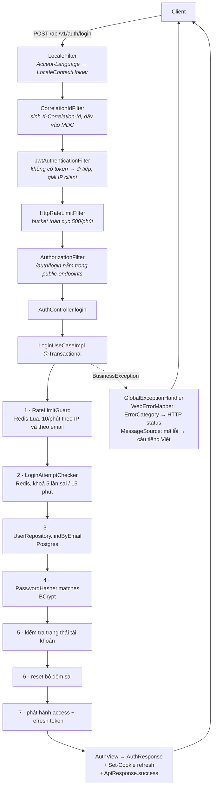
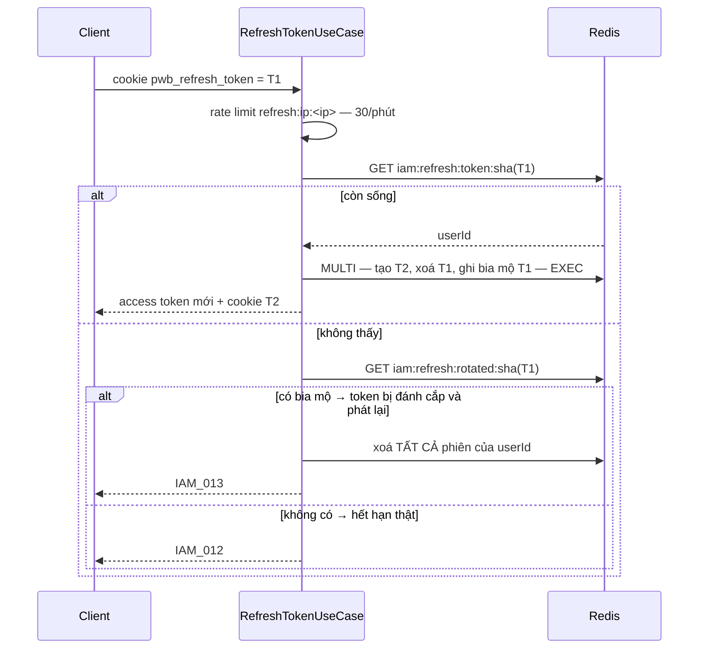

# 02 — Lát cắt dọc: đăng nhập

> Đây là file để **hiểu kiến trúc qua một ca thật**, không phải để tra cứu chức năng đăng nhập.
> Một request `POST /api/v1/auth/login` đi qua gần như mọi tầng của hệ thống: filter chain, security, rate limit trên Redis, use case, domain model, JPA, phát hành JWT, cookie, envelope response, i18n. Đi hết một lượt thì các file sau chỉ còn là chi tiết.
> Mọi số liệu và output trong file này đều lấy từ code và từ backend chạy thật ngày 2026-08-10.
> Nền: [01 — Kiến trúc tổng thể](01-architecture-overview.md).

---

## 1. Toàn cảnh



Bảy bước bên trong use case có **thứ tự cố ý**, mục 4 giải thích vì sao đổi chỗ bất kỳ hai bước nào cũng tạo ra lỗ hổng.

---

## 2. Chặng 1 — từ dây mạng tới controller

Bốn thứ chạy trước khi controller thấy request. Chi tiết vị trí và lý do ở [01 §5](01-architecture-overview.md); ở đây chỉ nói cái luồng đăng nhập thực sự dùng.

| Thứ tự | Thành phần | Làm gì cho luồng này |
|---|---|---|
| 1 | `LocaleFilter` | Đọc `Accept-Language`, đặt vào `LocaleContextHolder`. **Đây là lý do câu lỗi trả về tiếng Việt được** — mã lỗi được dịch ở tận cuối, dùng locale mà filter này đặt từ đầu. |
| 2 | `CorrelationIdFilter` | Sinh `X-Correlation-Id`, nhét vào MDC → mọi dòng log của request này mang cùng một id, và id đó cũng nằm trong response header. |
| 3 | `JwtAuthenticationFilter` | Không có header `Authorization` nên bỏ qua phần xác thực. **Nhưng nó vẫn làm một việc thiết yếu**: `ClientIpResolver.resolve(request, trustedProxies)` rồi lưu vào request attribute. |
| 4 | `HttpRateLimitFilter` | Đếm vào bucket toàn cục **500 request/phút**. Đăng nhập chưa có principal nên bucket này tính theo địa chỉ. |

Điểm dễ bỏ sót ở bước 3: giải IP client **nằm trong filter JWT**, không nằm ở filter riêng. Nghĩa là `@CurrentClientIp` chỉ có giá trị vì filter JWT đã chạy — kể cả với request hoàn toàn ẩn danh. Gỡ filter JWT khỏi chain cho một endpoint public nào đó thì IP sẽ là null ở đúng chỗ cần nó nhất.

`trustedProxies` lấy từ `pwb.iam.security.trusted-proxies`. Rỗng thì `X-Forwarded-For` bị bỏ qua và IP lấy từ socket — đúng cho môi trường không có proxy, và là mặc định an toàn: tin `X-Forwarded-For` vô điều kiện cho phép ai cũng tự khai IP của mình.

> **Quan sát thật:** gọi từ máy local, IP giải ra là `0:0:0:0:0:0:0:1` (IPv6 loopback). Thấy được trong khoá Redis: `iam:ratelimit:refresh:ip:0:0:0:0:0:0:0:1`. Dấu hai chấm của IPv6 nằm luôn trong khoá — không sao vì Redis không quan tâm, nhưng nó làm khoá khó đọc và khó tách bằng dấu `:`.

---

## 3. Chặng 2 — controller

```java
@PostMapping("/login")
public ResponseEntity<ApiResponse<AuthResponse>> login(
        @Valid @RequestBody LoginRequest request,
        @CurrentClientIp String clientIp,
        @CurrentUserAgent String userAgent,
        HttpServletResponse response
) {
    AuthView view = toAuthView(loginUseCase.execute(
            new LoginCommand(request.email(), request.password(), clientIp, userAgent)));
    return respondWithTokens(view, response);
}
```

Controller **không chứa logic nghiệp vụ nào**. Nó làm đúng bốn việc: nhận DTO đã được `@Valid` kiểm, gom thêm ngữ cảnh HTTP (IP, user-agent) qua argument resolver, gọi use case, và biến kết quả thành response.

Ba chi tiết đáng học từ đây:

**`@CurrentClientIp` / `@CurrentUserAgent` là argument resolver tự viết**, đăng ký trong `WebMvcConfig.addArgumentResolvers`. Không có chúng thì mọi controller cần IP phải nhận `HttpServletRequest` — và tầng api lập tức dính vào servlet API ở khắp nơi.

**`toAuthView` tồn tại để chống một lỗi cụ thể**, comment trong code nói thẳng: bốn endpoint cùng dựng `AuthView`, và nếu mỗi chỗ tự giải avatar thì sớm muộn có một chỗ trả về **khoá lưu trữ thô** thay vì URL tải được. Gom về một chỗ là cách chặn.

**Refresh token không nằm trong body.** `respondWithTokens` đặt nó vào cookie `HttpOnly`; body chỉ có access token. Xem mục 6.

---

## 4. Chặng 3 — bên trong use case, và vì sao thứ tự bảy bước là cố ý

`LoginUseCaseImpl.execute` mở đầu bằng `EmailAddress.normalize(...)` rồi chạy bảy bước. Đây là phần đáng đọc kỹ nhất của cả lát cắt.

### 4.1. Bước 1 — chặn tần suất, trước mọi thứ khác

```java
rateLimitGuard.checkIpAndSubject("login", clientIp, email, loginPolicy.loginPerMinute());
```

`checkIpAndSubject` đếm **hai** bucket riêng, cả hai đều 10/phút (`pwb.iam.rate-limit.login-per-minute: 10`):

- `login:ip:<ip>` — chặn một máy dò nhiều tài khoản
- `login:subject:<email>` — chặn nhiều máy cùng dò một tài khoản

Hai bucket này giải hai bài toán khác nhau; chỉ có một cái là chừa cửa cho bài kia.

Đặt ở **bước 1** vì mọi bước sau đều tốn tài nguyên: một truy vấn Postgres, một phép BCrypt (cố tình chậm). Chặn trước khi tốn là điểm duy nhất chặn có ý nghĩa.

### 4.2. Bộ đếm rate limit là một script Lua

`ThrottlingServiceAdapter` không dùng `INCR` rồi `EXPIRE` bằng hai lệnh, mà gói vào một script Lua:

```lua
local count = redis.call('INCR', key)
if count == 1 then
    redis.call('EXPIRE', key, window)
end
local ttl = redis.call('TTL', key)
if count > limit then return {0, ttl} else return {1, limit - count} end
```

Vì sao phải Lua: `INCR` rồi `EXPIRE` là **hai** round trip. Tiến trình chết giữa hai lệnh, hoặc hai request chen nhau, thì khoá tồn tại mà không có TTL — **bộ đếm sống vĩnh viễn** và tài khoản đó bị chặn mãi mãi. Script Lua chạy nguyên tử trên Redis nên khe hở đó không tồn tại.

Script còn trả về luôn TTL để đưa vào `retryAfterSeconds` cho client, thay vì phải hỏi thêm một lần nữa.

**Khi Redis chết** thì hành vi do cấu hình quyết định:

```yaml
fail-closed-for-critical-ops: true   # từ chối, trả IamErrorCode.SERVICE_UNAVAILABLE
```

Comment trong `application.yml` giải thích lựa chọn: *một bộ giới hạn mở toang thì không bảo vệ gì đúng vào lúc hệ thống đã yếu.* Riêng cooldown gửi lại email đặt lại mật khẩu thì **luôn** fail-closed bất kể cấu hình — vì nó gửi mail tới địa chỉ bất kỳ, để hở là biến endpoint thành máy phát tán thư.

Mỗi quyết định đều được đếm vào metric `pwb.ratelimit.iam.decision` với tag `scope` / `decision` / `reason`, nên phân biệt được "từ chối vì quá hạn mức" với "từ chối vì Redis chết".

### 4.3. Bước 2 — khoá tài khoản, khác hoàn toàn với rate limit

Hai cơ chế này hay bị nhầm là một. Chúng khác nhau ở mọi mặt:

| | Rate limit (bước 1) | Khoá tài khoản (bước 2) |
|---|---|---|
| Đếm cái gì | **Mọi** lần thử, kể cả đúng | Chỉ lần **sai** |
| Cửa sổ | 1 phút | 15 phút (email) / 30 phút (IP) |
| Ngưỡng | 10 | 5 (email) / 20 (IP) |
| Đăng nhập đúng | Không xoá bộ đếm | **Xoá sạch** bộ đếm và khoá |
| Khoá Redis | `iam:ratelimit:login:*` | `iam:login:fail:*`, `iam:login:lock:*` |
| Mã lỗi | `IAM_014` | `IAM_005` |

Rate limit chống dò nhanh; khoá tài khoản chống dò chậm và bền. Một kẻ thử 9 mật khẩu mỗi phút không bao giờ chạm rate limit, nhưng chạm khoá tài khoản sau chưa đầy một phút.

`RedisLoginAttemptChecker` dùng TTL của **chính khoá lock** làm `retryAfterSeconds` (`redis.getExpire`), nên con số trả về client luôn đúng, không cần lưu thêm thời điểm hết hạn.

### 4.4. Bước 3–5 — mật khẩu trước, trạng thái sau

Đây là chi tiết bảo mật tinh tế nhất trong luồng, và code có comment giải thích:

```java
// Status is only inspected once the password has been proven, so an attacker cannot
// probe which addresses are registered, banned or unverified without the credentials.
```

Nếu kiểm tra trạng thái **trước** khi kiểm mật khẩu thì endpoint đăng nhập trở thành máy tra cứu: nhập một email bất kỳ với mật khẩu bừa, thông điệp trả về sẽ cho biết địa chỉ đó có tồn tại không, đã xác minh chưa, có bị cấm không. Kiểm mật khẩu trước thì mọi email lạ đều nhận đúng một câu `IAM_004`.

Cùng logic đó: `user == null` và `sai mật khẩu` **gộp chung một nhánh**, cùng ném `LOGIN_BAD_CREDENTIALS`.

```java
if (user == null || user.getPassword() == null
        || !passwordHasher.matches(command.rawPassword(), user.getPassword().hash())) {
```

`user.getPassword() == null` là trường hợp tài khoản đăng ký bằng Google — không có mật khẩu để so. Nó rơi vào cùng nhánh, nên người ngoài không phân biệt được "tài khoản này dùng Google" với "email này không tồn tại".

> **Điểm chưa hoàn hảo, quan sát được:** khi `user == null`, hàm thoát *trước* khi chạy BCrypt, còn khi user tồn tại thì có chạy. BCrypt cố tình chậm, nên thời gian phản hồi hai trường hợp lệch nhau — về lý thuyết đo được (timing attack). Cách chữa chuẩn là luôn so với một hash giả. Ở quy mô hiện tại, rate limit 10/phút làm việc đo này rất khó, nhưng đây là một lỗ hổng có thật chứ không phải chuyện lý thuyết suông.

### 4.5. Bước 6 — đăng nhập đúng thì xoá dấu vết thất bại

```java
attemptChecker.reset(email);
attemptChecker.resetIpLock(clientIp);
```

Xoá cả bộ đếm email lẫn bộ đếm IP. Không có dòng thứ hai thì một người gõ sai vài lần rồi đăng nhập được vẫn tích luỹ bộ đếm IP, và sau vài phiên như vậy cả nhà cùng dùng một IP sẽ bị khoá 30 phút mà không hiểu vì sao.

---

## 5. Chặng 4 — phát hành token, và mô hình dữ liệu trong Redis

### 5.1. Access token: JWT tự chứa

```java
Jwts.builder()
    .id(jti)                                    // UUID ngẫu nhiên, dùng cho blacklist
    .issuer("pwb-iam").audience().add("pwb-clients").and()
    .subject(user.getUserId().toString())
    .issuedAt(now).expiration(now + 900s)
    .claim("email", ...).claim("role", ...).claim("status", ...).claim("oauth", ...)
    .signWith(signingKey)                        // HMAC-SHA512
```

TTL **900 giây (15 phút)**. Ký HMAC bằng `APP_JWT_SECRET`.

Khoá bí mật **không có giá trị mặc định**, và comment trong `application.yml` nói rõ vì sao: *một fallback ở đây là một khoá ký được công bố trong repository, và môi trường nào quên đặt biến sẽ vẫn khởi động rồi phát ra token ai cũng giả được. Không khởi động được là kết cục ồn ào và an toàn.*

Token tự chứa nên **xác thực không cần chạm Redis hay database** — đó là cái mua được. Cái mất là không thu hồi được: token đã phát thì hợp lệ đủ 15 phút. Chỗ vá là danh sách đen theo `jti` (mục 5.3).

### 5.2. Refresh token: chuỗi ngẫu nhiên, lưu dạng băm

Ngược hẳn với access token:

| | Access token | Refresh token |
|---|---|---|
| Hình dạng | JWT có chữ ký | 48 byte ngẫu nhiên, Base64-url |
| Ai giữ sự thật | Chính token | Redis |
| TTL | 15 phút | **14 ngày** (1 209 600s) |
| Kiểm tra | Xác minh chữ ký, offline | Tra Redis |
| Lưu ở server | Không | Có, nhưng **chỉ lưu SHA-256** |
| Đi đường nào | Header `Authorization` | Cookie `HttpOnly` |

Lưu băm chứ không lưu token thô: ai đọc được Redis cũng không mạo danh được ai. Cùng nguyên tắc với lưu mật khẩu.

Ba nhóm khoá:

```
iam:refresh:token:<sha256>    → "<userId>"      TTL 14 ngày   (token còn sống)
iam:refresh:user:<userId>     → SET các <sha256>  TTL 14 ngày   (mọi phiên của một người)
iam:refresh:rotated:<sha256>  → "<userId>"      TTL 14 ngày   (bia mộ token đã xoay)
```

Tập `iam:refresh:user:*` tồn tại chỉ để phục vụ **một** thao tác: "đăng xuất khỏi mọi thiết bị". Không có nó thì thao tác đó phải quét toàn bộ keyspace.

### 5.3. Danh sách đen access token

`iam:jwt:blacklist:<jti>` với TTL bằng đúng phần đời còn lại của token. Đây là cách vá điểm yếu ở 5.1: đăng xuất ghi `jti` vào đây, `JwtAuthenticationFilter` tra trước khi chấp nhận. Khoá tự hết hạn cùng token nên danh sách không phình vô hạn.

> **Quan sát thật:** `iam:jwt:blacklist:*` hiện có **0** khoá — chưa ai đăng xuất kể từ lần khởi động này. Danh sách đen chỉ có ích khi client thực sự gọi `/logout`; đóng tab thì token vẫn sống hết 15 phút.

---

## 6. Chặng 5 — response đi ra

### 6.1. Envelope thống nhất

Mọi response của hệ thống đều là `ApiResponse`. Bắt được thật:

```json
{
  "success": true,
  "data": {
    "userId": "57f81a89-…", "email": "user1@gmail.com", "fullName": "Demo User 1",
    "status": "ACTIVE", "role": "USER", "oauthProvider": "LOCAL",
    "tokenType": "Bearer", "expiresIn": 900, "accessToken": "eyJhbGciOiJIUzUxMiJ9…"
  },
  "traceId": "b3a454e1-…",
  "timestamp": 1786333492431
}
```

**`refreshToken` không có trong body** — nó chỉ đi bằng cookie. **`avatarUrl` cũng không có**, vì user seed chưa có ảnh: trường null bị `default-property-inclusion: non_null` loại khỏi JSON. Đây chính là cơ chế đã nói ở [01 §9](01-architecture-overview.md) — trường null không hiện ra là `null`, nó **biến mất**. Client phải hiểu "vắng mặt" nghĩa là "không có".

Chú ý có **hai** id khác nhau: `X-Correlation-Id` trên header và `traceId` trong body, và chúng **không trùng nhau** trong mọi lần đo. Cái đầu do `CorrelationIdFilter` sinh cho toàn request; cái sau do lớp dựng `ApiResponse` sinh riêng. Tra log cần biết mình đang cầm cái nào.

### 6.2. Cookie refresh token

Bắt được thật:

```
Set-Cookie: pwb_refresh_token=mc4TFuX_…; Path=/; Max-Age=1209600;
            Secure; HttpOnly; SameSite=Lax
```

`HttpOnly` để JavaScript không đọc được — một lỗ XSS lấy mất access token 15 phút, nhưng không lấy được refresh token 14 ngày. `SameSite=Lax` chặn CSRF gửi kèm cookie từ site khác. `Secure` nghĩa là **chỉ đi trên HTTPS**; ở local qua `http://localhost` trình duyệt vẫn chấp nhận vì localhost được coi là ngữ cảnh an toàn.

`clearRefreshTokenCookie` có comment đáng chú ý: phải xoá bằng **đúng** name/path/attributes đã dùng lúc đặt, vì trình duyệt chỉ thay thế cookie khi những thứ đó khớp. Hard-code `path="/"` sẽ âm thầm không xoá được cookie nếu cấu hình path là thứ khác — người dùng bấm đăng xuất mà phiên vẫn còn.

---

## 7. Chặng 6 — dùng token ở request tiếp theo

`JwtAuthenticationFilter` là chiều ngược lại của mục 5:

1. Đọc header `Authorization: Bearer …`
2. `parseAccessTokenWithResult` — xác minh chữ ký, **bắt buộc đúng** issuer và audience, cho phép lệch đồng hồ 30 giây
3. Nếu hợp lệ → tra danh sách đen theo `jti`; có trong đó thì **xoá sạch** security context
4. Dựng `AuthenticatedUser` + `UsernamePasswordAuthenticationToken`, quyền là `"ROLE_" + role`
5. Đặt vào `SecurityContextHolder`

Điểm quan trọng nhất về thiết kế filter này: **token hỏng không làm request thất bại ở đây**. Filter chỉ ghi log debug rồi `chain.doFilter` đi tiếp với context rỗng. Việc từ chối là của `AuthorizationFilter` phía sau. Tách như vậy để một endpoint public vẫn phục vụ được request mang theo token hết hạn — thay vì trả 401 cho một trang không cần đăng nhập.

Hàm phân loại lỗi JWT thành 5 loại (`EXPIRED`, `MALFORMED`, `INVALID_SIGNATURE`, `UNSUPPORTED`, `UNKNOWN`) với mức log khác nhau — riêng `INVALID_SIGNATURE` log `warn` vì đó là dấu hiệu có người đang thử giả token, còn `EXPIRED` chỉ là `debug` vì nó xảy ra suốt ngày.

---

## 8. Refresh và xoay vòng token

`POST /api/v1/auth/refresh` đọc cookie, không đọc body.



### 8.1. Toàn bộ phép xoay là một MULTI/EXEC

Bảy lệnh Redis trong một transaction: tạo khoá mới, đặt TTL, thêm vào tập của user, đặt TTL cho tập, xoá khoá cũ, bỏ khỏi tập, ghi bia mộ. Đứt gánh giữa chừng mà không có transaction thì có thể rơi vào trạng thái token cũ đã xoá còn token mới chưa tạo — người dùng bị đăng xuất không lý do.

### 8.2. Phát hiện tái sử dụng: bia mộ

Đây là ý hay nhất của cả luồng. Token đã xoay không biến mất hẳn — nó để lại `iam:refresh:rotated:<hash>` sống nốt phần TTL còn lại. Nhờ vậy hệ thống **phân biệt được hai chuyện trông giống nhau**:

- Token lạ hoắc → hết hạn bình thường → `IAM_012`
- Token **từng hợp lệ và đã bị thay** → chỉ có thể là bản sao ai đó chép được và phát lại, vì chủ nhân thật đã cầm token mới rồi → **đây là trộm** → xoá sạch mọi phiên của tài khoản → `IAM_013`

Xoá sạch chứ không chỉ từ chối, vì tại thời điểm đó không biết ai đang cầm token mới — chủ nhân hay kẻ trộm. Đá cả hai ra và bắt đăng nhập lại là lựa chọn duy nhất an toàn.

> **Kiểm chứng thật, chạy đúng như thiết kế:**
> 1. `refresh` với T1 → 200, nhận T2
> 2. `refresh` lại với T1 → `IAM_013 "Refresh token has been revoked"`
> 3. `refresh` với **T2** (token hợp lệ của chủ nhân thật) → `IAM_012` — T2 cũng đã bị xoá ở bước 2
>
> Bước 3 xác nhận việc "xoá sạch mọi phiên" thực sự xảy ra.

### 8.3. Một điểm trải nghiệm chưa ổn

Ở bước 3 trên, chủ nhân thật nhận `IAM_012 "Refresh token has expired"` — sai bản chất. Phiên của họ **bị thu hồi vì lý do an ninh**, không phải hết hạn. Nguyên nhân kỹ thuật: `revokeAllRefreshTokensForUser` xoá cả `token:*` lẫn `rotated:*` của mọi hash, nên T2 không để lại dấu vết gì để nhánh sau nhận ra.

Muốn báo đúng thì cần một bia mộ riêng loại "đã thu hồi vì phát hiện trộm", sống thêm một thời gian. Chưa làm.

---

## 9. Lỗi đi từ exception tới JSON như thế nào

Use case ném `BusinessException(IamErrorCode.LOGIN_BAD_CREDENTIALS)`. Nó thành cái này:

```
BusinessException
   ├─ ErrorCode.code()      → "IAM_004"        → field "code"
   ├─ ErrorCode.category()  → UNAUTHORIZED     → WebErrorMapper → HTTP 401
   └─ MessageSource.getMessage("IAM_004", locale)
                            → "Email hoặc mật khẩu không hợp lệ"  → field "message"
```

Bảng `ErrorCategory → HttpStatus` trong `WebErrorMapper`:

| Category | HTTP | | Category | HTTP |
|---|---|---|---|---|
| `VALIDATION` | 400 | | `CONFLICT` | 409 |
| `UNAUTHORIZED` | 401 | | `TOO_MANY_REQUESTS` | 429 |
| `FORBIDDEN` | 403 | | `BUSINESS` | 422 |
| `NOT_FOUND` | 404 | | `INTERNAL` | 500 |
| `METHOD_NOT_ALLOWED` | 405 | | | |

Nhờ vậy tầng domain **không biết gì về HTTP** — nó chỉ khai báo "đây là loại lỗi không có quyền", còn dịch sang 401 là việc của `shared-web`.

Bắt được thật, có `Accept-Language: vi`:

```
HTTP/1.1 401
{"success":false,"message":"Email hoặc mật khẩu không hợp lệ",
 "traceId":"0011a77b-…","code":"IAM_004","timestamp":1786333429178}
```

Không có `Accept-Language` thì nhận câu tiếng Anh mặc định của enum: `"Refresh token has been revoked"`. Hai lần đo trong mục 8 chính là ví dụ.

Response lỗi **không có** field `data`, response thành công **không có** `code`. Cùng một lớp `ApiResponse`, hai nửa, nhờ `non_null` loại bỏ nửa không dùng.

---

## 10. Sự kiện đăng nhập hiện chỉ là log

`LoginUseCaseImpl` gọi `authEventPublisher.publishAuthSuccess(...)` và `publishLoginFailed(...)`. Nhìn tên tưởng có hệ thống sự kiện phía sau. Không có — implementation duy nhất là `LoggingAuthEventPublisher`, và nó chỉ ghi log:

```java
public void publishLoginFailed(String email, String clientIp, String userAgent, String reason) {
    log.info("Login failed: emailMasked={} ip={} reason={}", maskEmail(email), clientIp, reason);
}
```

Không Kafka, không outbox, không bảng audit. Có hai dấu vết cho thấy đây là chủ ý chứ không phải bỏ dở: email được **che** trước khi ghi log, và lịch sử migration có `V5__create_iam_audit_logs.sql` rồi `V10__drop_iam_audit_logs.sql` — bảng audit từng tồn tại và đã bị gỡ.

Giá trị của việc giữ lại cái port: khi cần audit thật, chỉ thêm một implementation, không phải sờ vào use case nào.

Cũng chú ý `LoggingAuthEventPublisher` nằm trong package `infrastructure/config` — chỗ hơi lạ cho một adapter, đúng ra thuộc `infrastructure/service`.

---

## 11. Quyết định & đánh đổi

| Quyết định | Thay vì | Vì sao | Cái giá |
|---|---|---|---|
| Access token JWT tự chứa | Token tra Redis mỗi request | Xác thực không chạm I/O | Không thu hồi được ngay; phải thêm blacklist |
| TTL 15 phút | Dài hơn cho đỡ phải refresh | Cửa sổ thiệt hại khi lộ token rất hẹp | Client phải xử lý refresh, kể cả trong luồng WebSocket |
| Refresh 14 ngày trong cookie `HttpOnly` | Refresh token trong body + localStorage | XSS không với tới được | Phải xử lý CORS + `SameSite`; native client dùng cookie bất tiện hơn |
| Chỉ lưu SHA-256 của refresh token | Lưu token thô | Rò rỉ Redis không thành mạo danh | Không tra ngược được từ Redis ra token |
| Xoay token mỗi lần refresh + bia mộ | Refresh token dùng lại nhiều lần | Phát hiện được token bị chép | Mỗi lần xoay để lại một khoá sống 14 ngày |
| Kiểm mật khẩu trước, kiểm trạng thái sau | Kiểm trạng thái trước cho rẻ | Không rò rỉ email nào có tồn tại | Tốn một phép BCrypt cho cả tài khoản bị cấm |
| Hai bucket rate limit (IP + email) | Một bucket | Chặn được cả dò rộng lẫn dò sâu | Hai round trip Redis mỗi lần đăng nhập |
| Rate limit bằng script Lua | `INCR` + `EXPIRE` hai lệnh | Không có khe hở tạo khoá không TTL | Phải nạp script, khó debug hơn |
| Fail-closed khi Redis chết | Fail-open cho dịch vụ vẫn chạy | Limiter mở toang lúc hệ thống yếu là vô nghĩa | Redis chết thì **không ai đăng nhập được** |
| Rate limit và khoá tài khoản là hai cơ chế | Gộp một | Chống hai kiểu tấn công khác nhau | Hai bộ khoá Redis, hai mã lỗi, dễ nhầm |

---

## 12. Tự kiểm chứng

Backend chạy ở `localhost:8080`, tài khoản seed trong `application-dev-users.yml` (profile `dev`).

**Đăng nhập thành công — xem envelope và cookie:**

```bash
curl -i -X POST http://localhost:8080/api/v1/auth/login -H "Content-Type: application/json" -d '{"email":"user1@gmail.com","password":"@NamHoang511"}'
```

Nhìn: `Set-Cookie` có `HttpOnly` + `SameSite=Lax`; body **không** có `refreshToken`; `expiresIn: 900`.

**Xem lỗi được dịch theo `Accept-Language`:**

```bash
curl -X POST http://localhost:8080/api/v1/auth/login -H "Content-Type: application/json" -H "Accept-Language: vi" -d '{"email":"user1@gmail.com","password":"sai-mat-khau"}'
```

Đổi `vi` thành `en` và so sánh field `message`; field `code` giữ nguyên `IAM_004`.

**Xem mô hình khoá trong Redis:**

```bash
docker exec pwb-redis redis-cli -a "$(grep -E '^REDIS_PASSWORD=' .env | cut -d= -f2-)" --no-auth-warning --scan --pattern 'iam:*'
```

**Dựng lại kịch bản phát hiện trộm token** — đăng nhập lấy T1, refresh để có T2, rồi phát lại T1:

```bash
curl -s -X POST http://localhost:8080/api/v1/auth/refresh -b "pwb_refresh_token=<T1>"
```

Lần đầu 200, lần hai `IAM_013`. Sau đó T2 cũng chết.

**Xem khoá tài khoản** — gọi sai mật khẩu 5 lần cho cùng một email, lần thứ 5 đổi từ `IAM_004` sang `IAM_005` kèm `retryAfterSeconds`. Dùng email không có thật để không khoá tài khoản seed, và **đừng quá 20 lần** — ngưỡng khoá theo IP.

**Xem một dòng log ghép được với response** — lấy `X-Correlation-Id` từ header rồi tìm trong log backend; mọi dòng của request đó đều mang id ấy.

---

## 13. Giới hạn hiện tại

| Giới hạn | Chi tiết |
|---|---|
| **Bia mộ token nhiều hơn token sống** | Đo thật: **342** khoá `rotated:*` so với **152** khoá `token:*` — gấp 2,2 lần, mỗi khoá sống 14 ngày (khoá lấy mẫu còn ~9,2 ngày). Đây là cái giá cố hữu của phát hiện tái sử dụng, nhưng đáng theo dõi bộ nhớ Redis khi số người dùng tăng. |
| **Tài khoản bị thu hồi nhận sai thông điệp** | Mục 8.3 — chủ nhân thật thấy "hết hạn" thay vì "phiên đã bị thu hồi vì lý do an ninh". |
| **Redis chết là không ai đăng nhập được** | Hệ quả cố ý của `fail-closed-for-critical-ops: true`. Redis là điểm chết đơn của cả luồng xác thực. |
| **Chênh lệch thời gian phản hồi** | Mục 4.4 — email không tồn tại trả lời nhanh hơn email có thật vì bỏ qua BCrypt. |
| **Không thu hồi được access token nếu client không gọi `/logout`** | Đóng tab thì token sống nốt 15 phút. Đo thật: blacklist đang có 0 khoá. |
| **Sự kiện đăng nhập chỉ là log** | Không tra cứu được, không cảnh báo được. Bảng audit đã từng có rồi bị gỡ (`V10`). |
| **Hai id truy vết không trùng nhau** | `X-Correlation-Id` ≠ `traceId`. Dễ tra nhầm. |
| **Đổi mật khẩu không huỷ access token đang sống** | `revokeAllRefreshTokensForUser` xoá refresh token, nhưng access token đã phát vẫn dùng được tới 15 phút — chỉ chặn được bằng blacklist theo `jti`, mà đường đổi mật khẩu không biết `jti` nào đang lưu hành. |
