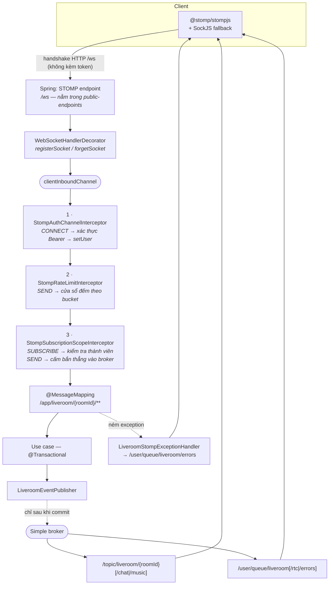

# 13 — Realtime: WebSocket / STOMP

> Tầng vận chuyển của Live Room. Mục này chỉ nói về **đường ống**: kết nối, xác thực, phân quyền kênh, đẩy sự kiện, xử lý lỗi, chống lụt.
> Nội dung từng nghiệp vụ chạy trên đường ống này (chat, nghe nhạc, WebRTC, kick) nằm ở các mục riêng.
> Nền kiến trúc: [01 — Kiến trúc tổng thể](01-architecture-overview.md).

---

## 1. Bài toán

Live Room cần đẩy sự kiện từ server xuống nhiều client cùng lúc: có người vào phòng, chủ phòng tắt mic của ai đó, bài hát vừa được tua, một tin nhắn mới. Polling không dùng được — độ trễ vài giây làm hỏng cảm giác "nghe cùng nhau", và 7 người trong phòng nhân với mấy loại trạng thái thì số request rỗng lớn hơn số request có ích rất nhiều.

Bốn ràng buộc định hình thiết kế:

1. **Trình duyệt không đặt được header `Authorization` lên handshake WebSocket.** Không có API nào cho phép. Nên xác thực phải xảy ra ở chỗ khác.
2. **Phòng là riêng tư.** Một người ngoài không được đọc chat hay tín hiệu WebRTC của phòng, kể cả khi họ đoán đúng `roomId`.
3. **Sự kiện phải phản ánh trạng thái đã ghi.** Đẩy "đã kick" rồi transaction rollback là nói dối client.
4. **Có cả kênh chung và kênh riêng.** "Ai đó đã vào phòng" là chuyện của cả phòng; "yêu cầu tham gia của bạn bị từ chối" là chuyện giữa hai người.

---

## 2. Sơ đồ tổng thể



Cấu hình ở `WebSocketConfig` (`modules/liveroom/src/main/java/com/pwb/liveroom/infrastructure/realtime/config/WebSocketConfig.java`):

```java
registry.enableSimpleBroker("/topic", "/queue");
registry.setApplicationDestinationPrefixes("/app");
registry.setUserDestinationPrefix("/user");
```

Broker là **simple broker trong bộ nhớ**, không phải RabbitMQ/ActiveMQ. Đủ cho một tiến trình; giới hạn ở mục 10.

---

## 3. Kết nối và xác thực

### 3.1. Endpoint `/ws` đăng ký hai lần — cố ý

```java
registry.addEndpoint("/ws").setAllowedOriginPatterns(origins);
registry.addEndpoint("/ws").setAllowedOriginPatterns(origins).withSockJS();
```

Nhìn như lỗi copy-paste, nhưng **`withSockJS()` thay thế mapping WebSocket thuần của endpoint chứ không cộng thêm vào**. Chỉ gọi dòng dưới thì client WebSocket thuần mất đường vào; chỉ gọi dòng trên thì mất đường dự phòng SockJS cho môi trường có proxy chặn WebSocket. Mỗi kiểu một lần đăng ký là cách giữ được cả hai.

### 3.2. Token đi trên frame CONNECT, không đi trên handshake

`/ws/**` nằm trong `pwb.iam.security.public-endpoints` — nghĩa là handshake HTTP **không được Spring Security bảo vệ**. Nghe như lỗ hổng, nhưng đó là hệ quả bắt buộc của ràng buộc số 1: trình duyệt không gắn được header lên handshake. Comment ngay trong `application.yml` ghi lại lý do này.

Bù lại, `StompAuthChannelInterceptor` chặn frame `CONNECT`:

```java
AuthenticatedUser user = Optional
        .ofNullable(accessor.getFirstNativeHeader("Authorization"))
        .flatMap(AccessTokenAuthenticator::extractBearerToken)
        .flatMap(accessTokenAuthenticator::authenticate)
        .orElseThrow(() -> new MessageDeliveryException(message, "WS_UNAUTHENTICATED"));

accessor.setUser(StompUserPrincipal.of(user));
```

Kết quả: một socket mở được, nhưng không làm được gì cho tới khi CONNECT thành công. `setUser` gắn principal vào session — đây chính là thứ mọi lớp phía sau dựa vào (`/user/**` định tuyến theo tên principal, interceptor phân quyền đọc `userId` từ đây).

`AccessTokenAuthenticator` nằm ở `shared-web`, dùng chung với `JwtAuthenticationFilter` của đường HTTP — một chỗ hiểu token, hai giao thức.

### 3.3. Phía client: token, fallback, backoff

`Frontend/src/features/liveroom/lib/liveroom-socket.ts`:

| Cơ chế | Chi tiết |
|---|---|
| Token luôn tươi | `beforeConnect` gọi `freshToken()`: nếu access token còn dưới **30s** thì refresh trước rồi mới CONNECT. Không có bước này thì mỗi lần reconnect sau khi máy ngủ dậy đều dính `WS_UNAUTHENTICATED`. |
| Fallback SockJS | Dùng WebSocket thuần trước; sau **2 lần đóng liên tiếp mà chưa từng CONNECT được**, chuyển sang SockJS. Không thử SockJS ngay để tránh trả giá overhead cho đa số kết nối bình thường. |
| Backoff | `min(15s, 1s × 2^(n-1)) + jitter ngẫu nhiên tới 400ms`, tối đa **8 lần** rồi chuyển trạng thái `offline`. Jitter để 7 người trong cùng một phòng không cùng lúc gõ cửa lại sau khi server restart. |
| Chờ mạng | Nếu `navigator.onLine === false` thì hoãn thêm 2s thay vì đốt một lần thử. |
| Heartbeat | 10s cả hai chiều. |
| `reconnectDelay: 0` | Tắt reconnect tự động của thư viện — nếu bật, nó sẽ chạy song song với vòng backoff tự viết và tạo ra hai chuỗi thử kết nối chồng nhau. |

Client đăng ký **3 kênh cá nhân ngay khi CONNECT** (`/user/queue/liveroom`, `.../errors`, `.../rtc`) và **3 kênh phòng chỉ khi đã được phép** vào phòng (`ensureRoomSubscriptions(roomId, allowed)`). Tách hai nhóm là cần thiết: người đang chờ duyệt phải nhận được quyết định trên kênh cá nhân trước khi họ có quyền nghe kênh phòng.

---

## 4. Bản đồ destination

### 4.1. Client gửi lên — luôn qua `/app/**`

| Destination | Controller |
|---|---|
| `/app/liveroom/{roomId}/chat/send` | `ChatStompController` |
| `/app/liveroom/{roomId}/music/play` · `/pause` · `/seek` · `/volume` · `/get-state` | `MusicStompController` |
| `/app/liveroom/{roomId}/comments/add` · `/get` | `TrackCommentStompController` |
| `/app/liveroom/{roomId}/rtc/offer` · `/answer` · `/ice` | `RtcStompController` |

### 4.2. Server đẩy xuống

| Destination | Ai nhận | Chở gì |
|---|---|---|
| `/topic/liveroom/{roomId}` | Cả phòng | Sự kiện chung: vào/ra/kick, media, sức chứa, vòng đời phòng |
| `/topic/liveroom/{roomId}/chat` | Cả phòng | `CHAT_MESSAGE_RECEIVED` |
| `/topic/liveroom/{roomId}/music` | Cả phòng | Trạng thái phát nhạc, đổi bài, track comment |
| `/user/queue/liveroom` | Một người | Quyết định duyệt/từ chối yêu cầu tham gia |
| `/user/queue/liveroom/rtc` | Một người | SDP offer/answer, ICE candidate |
| `/user/queue/liveroom/errors` | Một người | `ApiResponse.error` cho frame vừa gửi |

28 loại sự kiện trong `LiveroomEventType`. Tất cả dùng chung một hình dạng:

```java
public record RoomEvent(
        LiveroomEventType type,
        UUID roomId,
        Instant timestamp,
        Map<String, Object> data
) { }
```

`data` được **copy và bọc bất biến** trong compact constructor — event đã phát đi không thể bị người nhận sửa, và `LinkedHashMap` giữ thứ tự khoá ổn định để JSON không đổi hình dạng vô cớ.

**Vì sao ba topic thay vì một:** chat và nhạc là hai luồng có tần suất cao và độc lập với nhau. Gộp chung thì mọi client phải giải mã và bỏ qua frame không liên quan; tách ra cho phép về sau ngừng đăng ký từng kênh (ví dụ ẩn khung chat) mà không đụng gì tới các kênh khác.

---

## 5. Ba lớp interceptor

Thứ tự đăng ký có ý nghĩa — `configureClientInboundChannel` chạy chúng theo đúng thứ tự khai báo:

```java
registration.interceptors(authInterceptor, rateLimitInterceptor, subscriptionScopeInterceptor);
```

Xác thực trước để hai lớp sau có principal mà dùng. Rate limit trước phân quyền để một client bắn 500 frame/giây bị chặn trước khi kịp tạo ra 500 lượt truy vấn database kiểm tra thành viên.

### 5.1. Phân quyền đăng ký kênh phòng

`StompSubscriptionScopeInterceptor` bắt frame `SUBSCRIBE` có destination bắt đầu bằng `/topic/liveroom/`, cắt lấy `roomId` ở đoạn đầu tiên, rồi hỏi `RoomSubscriptionPolicy.canSubscribe(userId, roomId)`. Được phép nếu **một trong ba**:

1. Là chủ phòng, hoặc
2. Là participant đang trong phòng của **cycle hiện tại**, hoặc
3. Có một yêu cầu tham gia **đang chờ duyệt**.

Điều kiện 3 dễ bị bỏ sót: người đang đứng ngoài chờ cũng cần nghe kênh phòng để thấy phòng đầy hay phòng đóng cửa trong lúc họ chờ.

Không thoả thì ném `MessageDeliveryException("WS_UNAUTHORIZED")` → mã `LR_080`.

### 5.2. Cấm client bắn thẳng vào broker

```java
private static final List<String> BROKER_PREFIXES = List.of("/topic/", "/queue/", "/user/");
```

Frame `SEND` tới bất cứ prefix nào trong ba cái trên bị từ chối. **Mọi thứ client gửi phải đi qua `/app/**` và một `@MessageMapping`.**

Vì sao cần: simple broker của Spring **chuyển tiếp nguyên văn** một frame `SEND` của client tới `/topic/**`. Không có nó, bất kỳ người dùng đã đăng nhập nào cũng bơm được sự kiện giả vào topic của một phòng — không qua use case nào, không có dòng nào trong database, và client trong phòng sẽ tin ngay vì frame giả trông hệt frame thật.

**Chặn `/topic/` và `/queue/` thôi là chưa đủ**, và đây là phần tinh tế nhất của cả mục này. `UserDestinationMessageHandler` cũng lắng nghe trên `clientInboundChannel`, và một frame `SEND` của client mang `SimpMessageType.MESSAGE` — đúng nhánh mà `DefaultUserDestinationResolver` lấy người nhận **từ chuỗi destination**, không phải từ principal của session. Nghĩa là một client bất kỳ có thể gửi tới `/user/{id-của-người-khác}/queue/liveroom` và Spring sẽ chuyển đúng tới người đó. Vì vậy `/user/` nằm trong danh sách chặn. Chiều server (`convertAndSendToUser`) không ảnh hưởng vì nó đi qua `brokerChannel`, một kênh khác.

### 5.3. Chống lụt frame

`StompRateLimitInterceptor` chia frame `SEND` thành ba bucket theo đoạn trong destination, mỗi bucket một hạn mức riêng trong cùng cửa sổ **10 giây**:

| Bucket | Nhận diện | Hạn mức mặc định | Vì sao chênh nhau |
|---|---|---|---|
| `RTC` | destination chứa `/rtc/` | **400** | Một lần thương lượng WebRTC bắn ra hàng loạt ICE candidate trong vài giây; đặt thấp là tự làm hỏng cuộc gọi |
| `CHAT` | chứa `/chat/` hoặc `/comments/` | **15** | Tốc độ gõ của người thật |
| `OTHER` | còn lại (điều khiển nhạc…) | **60** | Tua/chỉnh âm lượng có thể dồn dập nhưng không tới mức RTC |

Khoá đếm là `sessionId + "|" + bucket`, giữ trong `ConcurrentHashMap` **cục bộ trong tiến trình** (không phải Redis như rate limit HTTP — xem mục 10). Vượt hạn mức thì frame bị **nuốt** (`return null`) chứ không ném exception, và người gửi nhận **đúng một** cảnh báo `LR_081` cho mỗi cửa sổ nhờ cờ `claimWarning()`. Nuốt thay vì ném là có chủ ý: một client đang lụt mà nhận về 400 lỗi nữa thì chỉ tốn thêm băng thông cho cả hai phía.

Dọn dẹp: `SessionDisconnectEvent` xoá mọi khoá bắt đầu bằng `sessionId` — nếu không, map sẽ phình theo mỗi lần reconnect.

---

## 6. Đẩy sự kiện: luôn sau commit

`StompLiveroomEventPublisherAdapter` bọc mọi lần gửi trong một `TransactionSynchronization`:

```java
private void afterCommit(Runnable send) {
    if (!TransactionSynchronizationManager.isActualTransactionActive()
            || !TransactionSynchronizationManager.isSynchronizationActive()) {
        dispatch(send);
        return;
    }
    TransactionSynchronizationManager.registerSynchronization(new TransactionSynchronization() {
        @Override public void afterCommit() { dispatch(send); }
    });
}
```

Ba tính chất đáng chú ý:

- **Không có transaction thì gửi ngay.** Có đường gọi không nằm trong transaction (scheduler, luồng dọn dẹp), và chúng vẫn phải phát được sự kiện.
- **Lỗi gửi chỉ log warn, không ném.** Ném ở đây là ném *sau khi* commit — không undo được gì, chỉ làm bẩn stack trace của một transaction đã thành công.
- **Không có retry.** Client mất frame sẽ tự đồng bộ lại khi reconnect (fetch REST + `music/get-state`), rẻ hơn nhiều so với hàng đợi gửi lại.

### 6.1. Bẫy: đừng defer hai lần

Publisher **đã** hoãn tới sau commit. Một use case tự bọc lời gọi publish của mình trong callback commit của chính nó sẽ khiến publisher đăng ký `TransactionSynchronization` thứ hai **từ bên trong** callback thứ nhất — quá muộn để chạy. Sự kiện biến mất, **không lỗi, không log**.

Tệ hơn: bên trong `afterCommit`, Spring vẫn báo transaction đang active, nên `isActualTransactionActive()` không cứu được. Không có kiểm tra runtime nào bắt được lỗi này. Nó từng làm `OWNER_REJOINED` mất tăm và tốn một giờ dò.

Quy tắc rút ra: **use case cứ gọi `publisher.broadcastToRoom(...)` thẳng, không bọc gì cả.**

---

## 7. Xử lý lỗi trên đường STOMP

`GlobalExceptionHandler` gắn với servlet dispatch, **không bao giờ nhìn thấy một STOMP frame**. Không có gì thay thế thì một frame bị từ chối chết lặng phía server trong khi client ngồi đợi một broadcast không bao giờ tới.

`LiveroomStompExceptionHandler` (`@ControllerAdvice` + `@MessageExceptionHandler` + `@SendToUser`) lấp chỗ đó:

| Exception | Trả về |
|---|---|
| `BusinessException` | Mã lỗi của chính nó; log `error` nếu `ErrorCategory.INTERNAL`, còn lại chỉ `debug` |
| `OptimisticLockingFailureException` | `LR_075` — hai người điều khiển nhạc cùng lúc |
| `IllegalArgumentException` | `INVALID_REQUEST` |
| `Exception` | `INTERNAL_SERVER_ERROR` |

Ba chi tiết đằng sau:

1. **Kênh lỗi tách khỏi kênh sự kiện.** `/user/queue/liveroom/errors`, không dùng chung `/user/queue/liveroom`, vì phía subscriber của kênh sau parse mọi frame thành `RoomEvent` — nhét một `ApiResponse` vào đó sẽ làm hỏng parse.
2. **`broadcast = false`.** Mặc định `@SendToUser` gửi tới *mọi* session của người đó; ở đây lỗi chỉ về đúng session đã gây ra nó.
3. **`OptimisticLockingFailureException` phải bắt ở đây, không bắt được trong use case.** Lỗi khoá lạc quan nổi lên lúc **flush/commit**, tức là sau khi thân use case đã chạy xong — `try/catch` bên trong không với tới.

Thông điệp được dịch qua `MessageSource` theo `LocaleContextHolder`, có fallback về `defaultMessage()` của enum nếu bundle thiếu key.

---

## 8. Đóng session từ phía server

Khi một người bị kick, chỉ gửi sự kiện là chưa đủ — kết nối của họ phải đứt, nếu không họ vẫn nghe được topic phòng cho tới khi tự đóng tab.

**Cách nhiều nơi mách là vô dụng ở đây:** đẩy một frame `DISCONNECT` từ server xuống. Spring **loại bỏ** frame `DISCONNECT` theo chiều server→client. Muốn ngắt thật thì phải đóng `WebSocketSession`.

Nhưng `WebSocketSession` không có sẵn ở tầng messaging, nên `WebSocketConfig` cài một decorator ở tầng transport để bắt chúng:

```java
registration.addDecoratorFactory(handler -> new WebSocketHandlerDecorator(handler) {
    @Override public void afterConnectionEstablished(WebSocketSession session) throws Exception {
        sessionRegistry.registerSocket(session);
        super.afterConnectionEstablished(session);
    }
    @Override public void afterConnectionClosed(WebSocketSession session, CloseStatus status) throws Exception {
        sessionRegistry.forgetSocket(session.getId());
        super.afterConnectionClosed(session, status);
    }
});
```

`StompSessionRegistryAdapter` giữ hai map — `sessionId → WebSocketSession` (từ decorator) và `userId → tập sessionId` (từ `SessionConnectedEvent` / `SessionDisconnectEvent`) — vì hai nguồn thông tin này đến từ hai tầng khác nhau và không tầng nào biết đủ cả hai.

`evictUser(userId)` đóng mọi session của một người, với **hai lớp trễ có chủ đích**:

```
commit transaction  →  chờ 2 giây  →  đóng socket
```

- **Chờ commit:** đóng socket rồi rollback thì người ta bị văng ra khỏi một phòng mà họ chưa từng bị đuổi.
- **Chờ thêm 2 giây:** khoảng thở để frame `PARTICIPANT_KICKED` kịp tới nơi. Đóng ngay thì người bị kick chỉ thấy màn hình mất kết nối, không bao giờ biết lý do.

Đóng chạy trên một `ScheduledExecutorService` một luồng, daemon, có `@PreDestroy` gọi `shutdownNow()` để không giữ JVM lại lúc tắt máy.

---

## 9. Đồng bộ đồng hồ, ăn theo miễn phí

Mọi `RoomEvent` đều mang `timestamp` của server. Client dùng ngay frame đó để chỉnh đồng hồ (`Frontend/src/features/liveroom/lib/server-clock.ts`):

```ts
offsetMs = serverMs - Date.now();
```

Từ đó `serverNow()`, `msUntil(deadline)`, `hasPassed(deadline)` đều tính theo giờ server. Cần thiết vì đồng hồ máy người dùng có thể lệch vài phút, mà **vị trí phát nhạc và các deadline (cooldown mute, cửa sổ undo-end) đều là mốc thời gian tuyệt đối do server phát ra**. Lệch đồng hồ nghĩa là nhạc chạy sai chỗ và bộ đếm ngược hiện sai.

Không cần thêm endpoint nào cho việc này: mỗi sự kiện đã là một lần đồng bộ, và trong phòng thì sự kiện đến liên tục. Đánh đổi là ước lượng thô — không trừ đi độ trễ đường truyền như NTP, nên offset lệch đúng bằng một chiều truyền (thường vài chục ms, không đáng kể so với đơn vị giây của bài toán).

---

## 10. Giới hạn hiện tại

| Giới hạn | Hệ quả | Khi nào phải xử lý |
|---|---|---|
| **Simple broker trong bộ nhớ** | Sự kiện không đi qua được giữa nhiều instance. Hai người cùng phòng nhưng bám hai instance khác nhau sẽ không thấy nhau. | Ngay khi chạy nhiều hơn một instance → cần STOMP broker relay (RabbitMQ) |
| **Rate limit STOMP đếm trong bộ nhớ** | Hạn mức nhân lên theo số instance | Cùng lúc với trên; chuyển sang Redis như đường HTTP |
| **`StompSessionRegistryAdapter` giữ session trong map cục bộ** | `evictUser` chỉ đóng được session bám vào chính instance đó | Cùng lúc với trên; cần phát tín hiệu evict qua Redis pub/sub |
| **Không có retry / bù frame mất** | Client mất frame lúc mạng chập phải chờ tới lần reconnect | Chấp nhận được — reconnect đã kéo lại toàn bộ trạng thái |
| **Client bị giới hạn 8 lần thử rồi `offline`** | Người dùng phải bấm thử lại thủ công | Có chủ ý: thử vô hạn giữ tab treo và đốt pin |
| **`RoomSubscriptionPolicy` chạm database mỗi lần SUBSCRIBE** | 3 truy vấn cho mỗi lần vào phòng | Chưa thành vấn đề; nếu thành thì cache theo `(userId, cycleId)` |

---

## EN summary

- Built the Live Room real-time layer on **WebSocket + STOMP** (Spring simple broker) with a SockJS fallback, serving 28 event types over three room topics and three per-user queues.
- Authenticated sessions on the **STOMP `CONNECT` frame** rather than the HTTP handshake — browsers cannot attach an `Authorization` header to a WebSocket upgrade — reusing the same token authenticator as the REST filter chain.
- Hardened the channel against forged events: client `SEND` to broker destinations is refused outright, including the `/user/` prefix, where Spring's `DefaultUserDestinationResolver` takes the recipient **from the destination string instead of the session principal** — a path that let any authenticated client deliver a forged event into another user's private queue.
- Enforced per-room subscription authorization in a channel interceptor backed by a membership policy (owner / active participant / pending requester).
- Guaranteed **events are published only after transaction commit**, and documented the double-deferral trap where wrapping a publish in a second commit callback makes the event vanish with no error.
- Implemented **server-initiated disconnects** by decorating the WebSocket transport to capture sessions — Spring discards server-sent `DISCONNECT` frames — with a 2-second grace so a kicked user receives the reason before the socket closes.
- Added a per-session, per-category STOMP flood limiter (RTC 400 / chat 15 / other 60 frames per 10s) that drops frames silently and warns the sender once per window.
- Derived a **client clock offset from every event timestamp**, keeping absolute server deadlines and playback positions correct on machines with skewed clocks, without an extra round trip.
