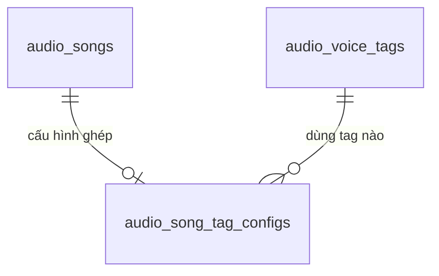
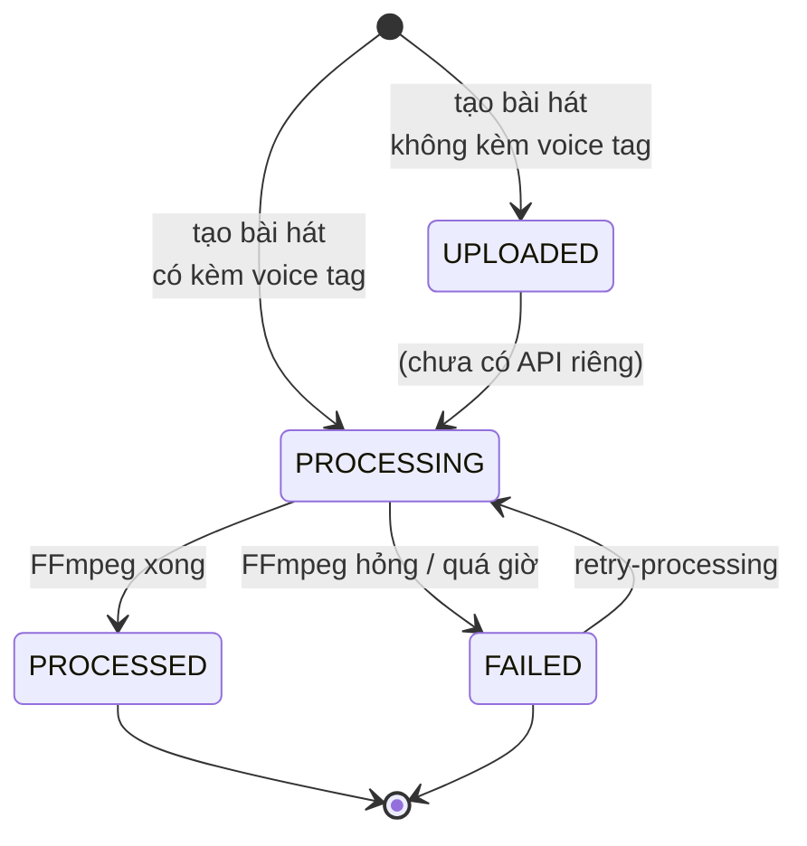

# Audio — Tour

> **Module này khác hẳn IAM.** IAM là CRUD đồng bộ; Audio là **xử lý file nặng, chạy hàng phút, ngoài transaction**. Mọi quyết định thiết kế đáng chú ý ở đây đều bắt nguồn từ một sự thật: FFmpeg chạy lâu, và không được giữ connection database trong lúc nó chạy.
> Chi tiết: [tải lên bài hát](audio-01-tai-len-bai-hat.md) · [voice tag](audio-02-voice-tag.md) · [cấu hình ghép](audio-03-cau-hinh-ghep-tag.md) · [pipeline xử lý](audio-04-pipeline-xu-ly.md) · [phát nhạc & tìm kiếm](audio-05-phat-nhac-va-tim-kiem.md)

---

## 1. Audio làm gì

Hai đối tượng, một phép ghép:



- **Song** — bài hát người dùng tải lên
- **Voice tag** — một đoạn âm thanh ngắn (≤10 giây) mang thương hiệu, ví dụ ai đó đọc tên studio
- **SongTagConfig** — nói cách ghép: bao lâu chèn một lần, to nhỏ ra sao, có hạ nhạc nền khi tag vang lên không

Kết quả: từ một file gốc sinh ra một **file thứ hai đã đóng dấu**. File gốc không bao giờ bị sửa. Bản đóng dấu là thứ đem đi khoe khách; bản gốc chỉ chủ nhân giữ.

Đây chính là lý do tồn tại của cả dự án — gửi demo cho khách mà không sợ bị chép lại nguyên bản.

---

## 2. Vòng đời một bài hát



Bốn trạng thái, và **`playbackKey()` là hàm quyết định phát cái nào**: có bản đã xử lý thì phát bản đó, chưa có thì phát bản gốc. Một bài `FAILED` vẫn nghe được — chỉ là nghe bản chưa đóng dấu.

Chú ý mũi tên `UPLOADED → PROCESSING` không có API. Voice tag chỉ gắn được **lúc tạo bài hát**; muốn đổi tag của một bài đã tạo thì không có đường. Xem [audio-03 §5](audio-03-cau-hinh-ghep-tag.md).

---

## 3. Câu chuyện, theo thứ tự xảy ra

### Chặng 1 — Đưa file lên

Không đi qua backend. Client xin một **URL ký sẵn**, tự `PUT` thẳng lên S3, rồi báo lại khoá lưu trữ. Backend hỏi S3 xem file có thật không, to bao nhiêu, rồi mới tạo bản ghi.

→ [audio-01](audio-01-tai-len-bai-hat.md)

### Chặng 2 — Có một voice tag

Hai cách: gõ chữ cho Google đọc thành tiếng (TTS), hoặc tự tải lên một file đã thu.

→ [audio-02](audio-02-voice-tag.md)

### Chặng 3 — Nói cách ghép

Bốn tham số: khoảng cách giữa hai lần chèn, âm lượng tag, mức hạ nhạc nền, và điểm bắt đầu.

→ [audio-03](audio-03-cau-hinh-ghep-tag.md)

### Chặng 4 — Máy làm việc

Kafka → worker → tải hai file về đĩa → đo độ to → dựng đồ thị lọc FFmpeg → render → tải kết quả lên → cập nhật database. Chạy hàng chục giây tới vài phút.

→ [audio-04](audio-04-pipeline-xu-ly.md) — **file dày nhất của module**

### Chặng 5 — Nghe và tìm

URL ký sẵn để phát, một truy vấn Postgres để tìm.

→ [audio-05](audio-05-phat-nhac-va-tim-kiem.md)

---

## 4. Sáu khuôn mẫu lặp lại khắp module

### 4.1. Việc chậm thì không có transaction

**Ba** class cố tình bỏ `@Transactional`, mỗi chỗ đều có comment giải thích:

| Class | Việc chậm ở giữa | Thời gian |
|---|---|---|
| `SongProcessorWorker` | Tải file, chạy FFmpeg, tải lên | **hàng phút** |
| `VoiceTagUseCaseImpl.createVoiceTagTts` | Gọi Google TTS, tải lên S3 | vài giây |
| `VoiceTagUseCaseImpl.createVoiceTagUpload` | Đo file, tải lên S3 | vài giây |

Cùng lý do một câu: giữ connection của pool suốt vòng gọi mạng là cách làm cạn pool khi có tải thật. So sánh: IAM chỉ có **một** chỗ như vậy ([iam-04 §3](iam-04-profile-va-avatar.md)), và đó cũng là chỗ đụng tới S3.

### 4.2. Bỏ transaction thì phải tự dọn rác

Không có rollback thì phải có tay dọn. Module này có hẳn một lớp cho việc đó, `StorageCleaner`, với **hai** chế độ:

```java
deleteAfterCommit(keys…)   // xoá sau khi transaction commit — dùng khi xoá bài hát
deleteNow(key)             // xoá ngay — dùng khi việc ghi database hỏng
```

`deleteAfterCommit` còn xử lý cả trường hợp không có transaction nào đang chạy thì xoá luôn. Thất bại chỉ ghi log `error` kèm chữ *"manual cleanup required"* — thừa nhận thẳng rằng lúc đó cần người vào dọn.

### 4.3. Không tin gì client nói về file

Client tự tải file lên S3, nên backend **không thấy** file đó lúc nào. Ba lớp kiểm tra bù lại:

| Kiểm gì | Cách |
|---|---|
| Khoá này có phải của bạn không | Phải bắt đầu bằng `audio/originals/<userId>/`, và không chứa `..` |
| File có thật không | Hỏi S3 (`findMetadata`), không tin request |
| To bao nhiêu | Lấy **từ S3**, không lấy từ request |

Comment trong code nói gọn: *"Storage is the only authority on whether a file exists and how big it really is."*

### 4.4. Đo, đừng đoán

Module này đo bằng `ffprobe` ở nhiều chỗ thay vì tin metadata:

- Thời lượng bài hát và voice tag — đo lại từ file, không lấy con số client khai
- **Độ to (LUFS)** của cả hai — dùng để cân âm lượng tag so với nhạc, xem [audio-04 §4](audio-04-pipeline-xu-ly.md)

### 4.5. Chỉ PRO mới tạo được

Ba endpoint mang `@PreAuthorize("hasRole('PRO')")`: `upload-url`, tạo bài hát, `retry-processing`. Đọc/sửa/xoá thì `USER` thường làm được.

> **Kiểm chứng thật:** `user1@gmail.com` gọi `POST /songs/upload-url` nhận `ACCESS_DENIED`; `pro1@gmail.com` gọi cùng endpoint nhận về URL ký sẵn.

Đây là ranh giới trả phí của sản phẩm, và nó được cài ngay ở tầng annotation chứ không trong logic nghiệp vụ.

### 4.6. Mọi thứ đều có trần

Module chạm vào file người dùng đưa lên và một chương trình ngoài, nên chỗ nào cũng phải có giới hạn:

| Giới hạn | Giá trị | Ở đâu |
|---|---|---|
| Kích thước bài hát | 200 MB | `pwb.audio.upload.max-file-size-bytes` |
| Kích thước voice tag | 10 MB | `pwb.audio.voice-tag.max-file-size-bytes` |
| Thời lượng voice tag | 10 giây | `pwb.audio.voice-tag.max-duration-seconds` |
| Thời gian chạy FFmpeg | 15 phút | `pwb.audio.processor.timeout-minutes` |
| Số lần chèn tag | 500 | hằng số trong `WatermarkFilterBuilder` |
| Bộ nhớ đệm vòng lặp | 64 MB | hằng số trong `WatermarkFilterBuilder` |
| Đĩa trống trước khi chạy | kiểm trước | `AudioWorkspace.assertSpaceAvailable` |

Ba dòng cuối là thứ IAM không bao giờ cần nghĩ tới.

---

## 5. Mã lỗi

`AUDIO_001` → `AUDIO_028`. Nhóm theo nguồn gốc:

| Nhóm | Mã | Ví dụ |
|---|---|---|
| Không tìm thấy | `001`–`003` | bài hát, voice tag, cấu hình |
| File người dùng đưa vào | `004`, `005`, `014`, `018`, `019`, `024`, `027` | sai định dạng, quá to, rỗng, không thấy khoá đã tải |
| Quy tắc nghiệp vụ | `006`–`008`, `022`, `026` | trùng tên tag, tag đang được dùng, **khoảng chèn ngắn hơn chính tag** |
| Hạ tầng | `010`, `013`, `015`, `021`, `023`, `028` | S3, xử lý hỏng, ffprobe hỏng, **FFmpeg ra file rỗng**, **hết đĩa**, **quá giờ** |
| TTS | `011`, `016`, `017`, `025` | tổng hợp hỏng, chưa cấu hình, chữ rỗng, giọng không hỗ trợ |

Bốn mã in đậm không tồn tại ở IAM và chỉ có nghĩa với một module chạy chương trình ngoài trên đĩa thật.

---

## 6. Tự kiểm chứng

Lấy token PRO (chỉ PRO mới tạo được):

```bash
T=$(curl -s -X POST http://localhost:8080/api/v1/auth/login -H "Content-Type: application/json" -d '{"email":"pro1@gmail.com","password":"@NamHoang511"}' | grep -o '"accessToken":"[^"]*' | cut -d'"' -f4)
```

**Xem ranh giới PRO** — gọi cùng endpoint bằng token của `user1@gmail.com`, nhận `ACCESS_DENIED`.

**Xem trạng thái các bài hát:**

```bash
docker exec -e PGPASSWORD="$(grep -E '^POSTGRES_PASSWORD=' .env | cut -d= -f2-)" pwb-postgres psql -U pwb_user -d pwb_db -c "SELECT status, count(*), count(processed_s3_key) AS co_ban_da_xu_ly FROM audio_songs GROUP BY 1;"
```

**Xem một bài đã xử lý mất bao lâu** — hiệu giữa `created_at` và `updated_at`:

```bash
docker exec -e PGPASSWORD="$(grep -E '^POSTGRES_PASSWORD=' .env | cut -d= -f2-)" pwb-postgres psql -U pwb_user -d pwb_db -c "SELECT title, duration_seconds, status, updated_at - created_at AS mat_bao_lau FROM audio_songs ORDER BY created_at DESC LIMIT 5;"
```

> Chụp thật: một bài 125 giây, `PROCESSED`, mất **khoảng 3 giây** từ lúc tạo tới lúc xong.

---

## 7. Audio khác IAM ở đâu

| | IAM | Audio |
|---|---|---|
| Số use case | 26 lớp `*UseCaseImpl` | **4** — `SongUseCase`, `VoiceTagUseCase` và hai lớp tìm kiếm, mỗi lớp nhiều phương thức |
| Chỗ bỏ `@Transactional` | 1 | 3 |
| Phụ thuộc ngoài | SMTP, Google OAuth | S3, Google TTS, **FFmpeg trên đĩa cục bộ** |
| Việc chạy lâu nhất | một BCrypt | **15 phút** |
| Dọn rác lưu trữ | rải trong use case | có lớp `StorageCleaner` riêng |

Cột "số use case" đáng chú ý: Audio gom nhiều thao tác vào một interface (`SongUseCase` có 11 phương thức) thay vì mỗi thao tác một lớp như IAM. Hai phong cách khác nhau trong cùng một codebase, không có chỗ nào ghi lại lý do.
